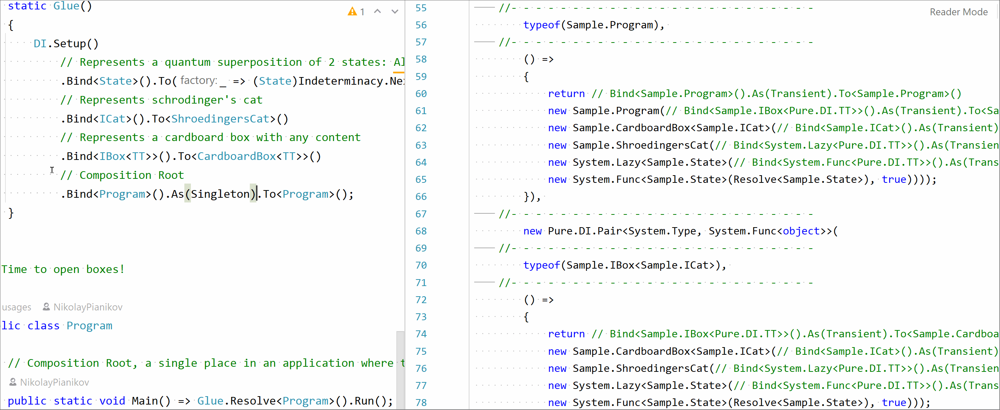

# Pure DI for .NET

[](https://www.nuget.org/packages/Pure.DI)
[](LICENSE)
[](http://teamcity.jetbrains.com/viewType.html?buildTypeId=OpenSourceProjects_DevTeam_PureDi_BuildAndTestBuildType&guest=1)



## Key features

_Pure.DI_ is __NOT__ a framework or library, but a code generator that generates static method code to create an object graph in a pure DI paradigm using a set of hints that are verified at compile time. Since all the work is done at compile time, at run time you only have efficient code that is ready to be used. This generated code does not depend on library calls or .NET reflection and is efficient in terms of performance and memory consumption.

- [X] DI without any IoC/DI containers, frameworks, dependencies and therefore without any performance impact and side effects. 
  >_Pure.DI_ is actually a [.NET code generator](https://docs.microsoft.com/en-us/dotnet/csharp/roslyn-sdk/source-generators-overview). It generates simple code as well as if you were doing it yourself: de facto just a bunch of nested constructors` calls. And you can see this code at any time.
- [X] A predictable and verified dependency graph is built and verified on the fly while you write your code.
  >All the logic for analyzing the graph of objects, constructors, methods happens at compile time. Thus, the _Pure.DI_ tool notifies the developer about missing or circular dependency, for cases when some dependencies are not suitable for injection, etc., at compile-time. Developers have no chance of getting a program that crashes at runtime due to these errors. All this magic happens simultaneously as the code is written, this way, you have instant feedback between the fact that you made some changes to your code and your code was already checked and ready for use.
- [X] It does not add any dependencies to any other assemblies.
  >Using a pure DI approach, you don't add runtime dependencies to your assemblies.
- [X] High performance, including C# and JIT compilers optimizations.
  >All generated code runs as fast as your own, in pure DI style, including compile-time and run-time optimizations. As mentioned above, graph analysis doing at compile-time, but at run-time, there are just a bunch of nested constructors, and that's it.
- [X] Works everywhere.
  >Since a pure DI approach does not use any dependencies or the [.NET reflection](https://docs.microsoft.com/en-us/dotnet/framework/reflection-and-codedom/reflection) at runtime, it does not prevent your code from working as expected on any platform: .NET Framework, .NET Core, UWP / XBOX, .NET IoT, Xamarin, etc.
- [X] Ease of use.
  >The _Pure.DI_ API is very similar to the API of most IoC/DI libraries. And it was a deliberate decision: the main reason is that programmers do not need to learn a new API.
- [X] Ultra-fine tuning of generic types.
  >_Pure.DI_ offers special type markers instead of using open generic types. This allows you to more accurately build the object graph and take full advantage of generic types.
- [X] Supports basic .NET BCL types out of the box.
  >_Pure.DI_ already supports many of [BCL types](https://docs.microsoft.com/en-us/dotnet/standard/framework-libraries#base-class-libraries) like Array, IEnumerable, IList, ISet, Func, ThreadLocal, etc. without any extra effort.

## Try it easy!

- Install the DI template `dotnet new -i Pure.DI.Templates`.
- Create a project directory and make it current
- Create an application `dotnet new di`
- Run it `dotnet run`

## Contents

- [How it works](#schrödingers-cat-shows-how-it-works)
- [API](#simple-and-powerful-api)
- [Requirements](#development-environment-requirements)
- [Supported frameworks](#supported-frameworks)
- [Project templates](#project-templates)
- [Samples](#samples)
  - [ASP.NET Core Blazor](#aspnet-core-blazor) 
  - [WPF](#wpf)
- [Performance test](#performance-test)
- [Troubleshooting](#troubleshooting)
- [How to build this project](#how-to-build-this-project)
- [Other resources](#other-resources)
- [Usage scenarios](#usage-scenarios)

## [Schrödinger's cat](Samples/ShroedingersCat) shows how it works

### The reality is that


### Let's create an abstraction

```c#
interface IBox<out T> { T Content { get; } }

interface ICat { State State { get; } }

enum State { Alive, Dead }
```

### Here is our implementation

```c#
class CardboardBox<T> : IBox<T>
{
    public CardboardBox(T content) => Content = content;

    public T Content { get; }
}

class ShroedingersCat : ICat
{
  // Represents the superposition of the states
  private readonly Lazy<State> _superposition;

  public ShroedingersCat(Lazy<State> superposition) => _superposition = superposition;

  // Decoherence of the superposition at the time of observation via an irreversible process
  public State State => _superposition.Value;

  public override string ToString() => $"{State} cat";
}
```

It is important to note that our abstraction and implementation do not know anything about DI magic or any frameworks. Also, please make attention that an instance of type *__Lazy<>__* was used here only as a sample. Still, using this type with nontrivial logic as a dependency is not recommended, so consider replacing it with some simple abstract type.

### Let's glue all together

Add a package reference to:

[](https://www.nuget.org/packages/Pure.DI)

- Package Manager

  ```
  Install-Package Pure.DI
  ```
  
- .NET CLI
  
  ```
  dotnet add package Pure.DI
  ```

Bind abstractions to their implementations or factories, define lifetimes and other options in a class like the following:

```c#
static partial class Composer
{
  // Actually, this code never runs and the method might have any name or be a constructor for instance
  // because this is just a hint to set up an object graph.
  private static void Setup() => DI.Setup()
      // Models a random subatomic event that may or may not occur
      .Bind<Random>().As(Singleton).To<Random>()
      // Represents a quantum superposition of 2 states: Alive or Dead
      .Bind<State>().To(ctx => (State)ctx.Resolve<Random>().Next(2))
      // Represents schrodinger's cat
      .Bind<ICat>().To<ShroedingersCat>()
      // Represents a cardboard box with any content
      .Bind<IBox<TT>>().To<CardboardBox<TT>>()
      // Composition Root
      .Bind<Program>().To<Program>();
  }
}
```

The code above is just a chain of hints to define a dependency graph used to generate a static class *__Composer__* with method *__Resolve__*, which creates a composition root *__Program__* below. In fact, there is no reason to run this code, because it does nothing ant run-time, so it can be placed anywhere in the class (in methods,  in constructors, or in properties), and better where it will not be called. Its purpose is only to check the syntax of dependencies and to help in building a dependency graph at compile-time to generate static methods. In the example above, the name of the method ```Setup()``` was chosen arbitrarily, made private, and is not called anywhere. Only the name of the owner class matters, since it will be implicitly used to create a static partial class that will contain the logic for creating objects, in our case it is ```static partial class Composer```, although it can be defined explicitly.

> Defining generic type arguments using particular marker types like ```TT``` in this sample is a distinguishing and outstanding feature. This allows binding complex generic types with nested generic types and with any type constraints. For instance ``` interface IService<T1, T2, T3> where T3: IDictionary<T1, T2[]> { }``` and its binding to the some implementation ```Bind<IService<TT1, TT2, IDictionary<TT1, TT2[]>>>().To<Service<TT1, TT2, IDictionary<TT1, TT2[]>>>()``` with all checks and code-generation at the compile time. It is clear that this example is exaggerated, it just demonstrates the ease of working with marker types like ```TT, TTEnumerable, TTSet``` and etc. for binding complex generic types.

### Time to open boxes!

```c#
class Program
{
  // Composition Root, a single place in an application
  // where the composition of the object graphs for an application take place
  public static void Main() => Composer.ResolveProgram().Run();

  private readonly IBox<ICat> _box;

  internal Program(IBox<ICat> box) => _box = box;

  private void Run() => Console.WriteLine(_box);
}
```

*__Program__* is a [*__Composition Root__*](https://blog.ploeh.dk/2011/07/28/CompositionRoot/) here, a single place in an application where the composition of the object graphs for an application takes place. Each instance is resolved by a strongly-typed block of statements like the operator [*__new__*](https://docs.microsoft.com/en-us/dotnet/csharp/language-reference/operators/new-operator), which are compiling with all optimizations with minimal impact on performance or memory consumption. The creating of a composition root *__Program__*  is looking as ``````Composer.ResolveProgram()`````` here and the compiler replaces this statement with the set of constructor calls:

```c#
new Program(
  new CardboardBox<ICat>(
    new ShroedingersCat(
      new Lazy<State>(
        new Func<State>(
            () => (State)SingletonSystemRandom.Shared.Next(2)
        ),
        true // thread safe
      )
    )
  )
)
```

where ```SingletonSystemRandom``` is a private static class for the most efficient lazy-style ```Random``` singleton support, because the runtime loads the ```SingletonSystemRandom``` type and thread-safely initializes the static field ```Shared``` only the first time the composition code gets the value from ```SingletonSystemRandom.Shared```:

```c#
private static class SingletonSystemRandom
{
  static readonly Random Shared = new Random();
}
```

_Pure.DI_ works the same as calling a set of nested constructors, but allows dependency injection. And that's a reason to take full advantage of Dependency Injection everywhere, every time, without any compromise!

## Simple and powerful API.

```c#
// Starts DI configuration chain.
// This method contains a single optional argument to specify a custom DI type name to generate.
// By default, it is a name of an owner class.
DI.Setup("MyComposer")
  
  // This is a basic binding format:
  .Bind<IMyInterface>().To<MyImplementation>()

  // This option is also possible:
  .Bind<IMyInterface>().Bind<IMyInterface2>().To<MyImplementation>()

  // Determines a binding lifetime:
  .Bind<IMyInterface>().As(Lifetime.Singleton).To<MyImplementation>()
  
  // Determines tags for all dependency types of binding:
  .Bind<IMyInterface>().Tags(123).To<MyImplementation>()
  
  // Determines tags for the specific dependency type of binding:
  .Bind<IMyInterface>("MyImpl", 99).To<MyImplementation>()

  // Determines a binding implementation using a factory method,
  // it allows to create instance manually and to invoke required methods,
  // to initialize properties and etc.: 
  .Bind<IMyInterface>().To(
    ctx => new MyImplementation(
      ctx.Resolve<ISomeDependency1>(),
      "Some value",
      ctx.Resolve<ISomeDependency2>()))

  // Overrides a default lifetime (Transient by default):
  .Default(Lifetime.Singleton)

  // Determines a custom attribute overriding an injection type:
  .TypeAttribute<MyTypeAttribute>()
  
  // Determines a tag attribute overriding an injection tag:
  .TagAttribute<MyTagAttribute>()
  
  // Determines a custom attribute overriding an injection order:
  .OrderAttribute<MyOrderAttribute>()
  
  // Use some DI configuration as a base:
  .DependsOn(nameof(BasicComposer)) 
```

Predefined lifetimes:

- *__Transient__* - Creates a new object of the requested type every time.
- *__Singleton__* - Creates a singleton object first time you and then returns the same object.
- *__PerResolve__* - Similar to the Transient, but it reuses the same object in the recursive object graph. 
- *__ContainerSingleton__* - This lifetime is applicable for ASP.NET, specifies that a single instance of the service will be created
- *__Scoped__* - This lifetime is applicable for ASP.NET, specifies that a new instance of the service will be created for each scope

You can [add a lifetime](#custom-singleton-lifetime) yourself.

## Development environment requirements

- [.NET SDK 5.0.102+](https://dotnet.microsoft.com/download/dotnet/5.0)
- [C# v.4 or newer](https://docs.microsoft.com/en-us/dotnet/csharp/whats-new/csharp-version-history#c-version-40)

## Supported frameworks

- [.NET and .NET Core](https://docs.microsoft.com/en-us/dotnet/core/) 1.0+
- [.NET Standard](https://docs.microsoft.com/en-us/dotnet/standard/net-standard) 1.0+
- [.NET Framework](https://docs.microsoft.com/en-us/dotnet/framework/) 3.5+
- [UWP/XBOX](https://docs.microsoft.com/en-us/windows/uwp/index)
- [.NET IoT](https://dotnet.microsoft.com/apps/iot)
- [Xamarin](https://dotnet.microsoft.com/apps/xamarin)
- [.NET Multi-platform App UI (MAUI)](https://docs.microsoft.com/en-us/dotnet/maui/)

## Project templates

Run the following command to install [Pure.DI templates](https://www.nuget.org/packages/Pure.DI.Templates) for _dotnet new_ command:

```dotnet new -i Pure.DI.Templates```

To create a new C# DI-based console project from the template, run:

```dotnet new di```

After that, you can run the created application:

```dotnet run```

Please see [this page](https://github.com/DevTeam/Pure.DI/wiki/Project-templates) for more details.

## Samples

### [ASP.NET Core Blazor](Samples/BlazorServerApp)


When a targeting project is an ASP.NET project, a special extension method is generated automatically. This extension method could be used to integrate DI into a web application infrastructure. Pay attention to [this single statement](https://github.com/DevTeam/Pure.DI/blob/d1c4cdf3d6d7015f809cf7f9153d091a1d42dc34/Samples/BlazorServerApp/Startup.cs#L24)  that makes all magic.

### [WPF](Samples/WpfAppNetCore)


This sample demonstrates how to apply DI for a WPF application. The crucial class is [DataProvider](Samples/WpfAppNetCore/DataProvider.cs), which connects view and view models. Besides that, it provides two sets of models for [design-time](Samples/WpfAppNetCore/ClockDomainDesignTime.cs) and [running](Samples/WpfAppNetCore/ClockDomain.cs) modes.

For details please see [this sample](IoC.Tests/UsageScenarios/Interception.cs).

## Performance test

### Graph of 27 transient instances


### Graph of 20 transient instances and 1 singleton instance


### Graph of 22 transient instances, including 3 Func to create 4 instances each time


### Graph of 22 transient instances, including 3 arrays of 4 instances in each


### Graph of 22 transient instances, including 3 enumerable of 4 instances in each


_[BenchmarkDotNet](https://github.com/dotnet/BenchmarkDotNet) was used to measure and analyze these results._

### Global Options

#### Changing the _Pure.DI_ API namespace

To change the default _Pure.DI_ namespace for the generated API to something else add a few lines to your project file:

```xml
<PropertyGroup>
  <PureDINamespace>MyNameSpace</PureDINamespace>
</PropertyGroup>

<ItemGroup>
  <CompilerVisibleProperty Include="PureDINamespace" />
</ItemGroup>
```

For instance, to use the default project namespace, you could specify the following lines:

```xml
<PropertyGroup>
  <PureDINamespace>$(RootNamespace)</PureDINamespace>
</PropertyGroup>

<ItemGroup>
  <CompilerVisibleProperty Include="PureDINamespace" />
</ItemGroup>
```

### Troubleshooting

To get all generated source code and log, add a hint like ```// out=<path to the diagnostics directory >``` as a comment before calling the method ```DI.Setup()```, for instance:

```c#
// out=c:\Projects\MyDiagnostics
DI.Setup()
  .Bind<IDependency>().To<Dependency>();
```

To change a log verbosity level use a hint like ```verbosity=<Verbosity level>```:

```c#
// out=c:\Projects\MyDiagnostics
// verbosity=Diagnostic
DI.Setup()
  .Bind<IDependency>().To<Dependency>();
```

The list of verbosity levels:
- Quiet
- Minimal
- Normal
- Diagnostic

To debug a code generation, add a hint like ```debug=true```:
```c#
// debug=true
DI.Setup()
  .Bind<IDependency>().To<Dependency>();
```

To get a code-generation performance snapshot:
- install [JetBrains dotTrace command-line tool](https://www.jetbrains.com/help/profiler/Performance_Profiling__Profiling_Using_the_Command_Line.html#install-and-use-the-command-line-tool-as-a-net-core-tool):
```
dotnet tool install --global JetBrains.dotTrace.GlobalTools
```
- specify an output path like ```// out=<path to the diagnostics directory >```
- add a hint like ```trace=true```:
```c#
// out=c:\Projects\MyDiagnostics
// trace=true
DI.Setup()
  .Bind<IDependency>().To<Dependency>();
```

### How to build this project

To run a build and tests, use the following command line from the root directory of the solution:

```dotnet run --project Build```

To run benchmarks:

```dotnet run --project Build -- -p target=Benchmark```

Benchmarks results are here `BenchmarkDotNet.Artifacts/results`

### Other resources

* [Project templates](https://github.com/DevTeam/Pure.DI/wiki/Project-templates) - project templates for _dotnet new_ command
* [Schrödinger's cat](Samples/ShroedingersCat) - simple console application
* [C# script tool](https://github.com/JetBrains/teamcity-csharp-interactive/blob/master/TeamCity.CSharpInteractive/Composer.cs) - JetBrain TeamCity interactive tool for running C# scripts
* [MSBuild logger](https://github.com/JetBrains/teamcity-msbuild-logger/blob/master/TeamCity.MSBuild.Logger/Composer.cs) - Provides the JetBrain TeamCity integration with Microsoft MSBuild.
* [Performance comparison](https://danielpalme.github.io/IocPerformance/) - performance comparison of the most popular .NET DI/IoC containers
## Usage Scenarios

- Basics
  - [Composition Root](#composition-root)
  - [Constants](#constants)
  - [Generics](#generics)
  - [Manual binding](#manual-binding)
  - [Service collection](#service-collection)
  - [Tags](#tags)
  - [Aspect-oriented DI](#aspect-oriented-di)
  - [Service provider](#service-provider)
  - [Several contracts](#several-contracts)
  - [Aspect-oriented DI with custom attributes](#aspect-oriented-di-with-custom-attributes)
  - [Instance initialization](#instance-initialization)
  - [Record structs](#record-structs)
  - [Records](#records)
  - [Dependency tag](#dependency-tag)
  - [Injection of default parameters](#injection-of-default-parameters)
  - [Injection of nullable parameters](#injection-of-nullable-parameters)
  - [Complex generics](#complex-generics)
  - [Complex generics with constraints](#complex-generics-with-constraints)
  - [Depends On](#depends-on)
  - [Unbound instance resolving](#unbound-instance-resolving)
- Lifetimes
  - [Default lifetime](#default-lifetime)
  - [Per resolve lifetime](#per-resolve-lifetime)
  - [Singleton lifetime](#singleton-lifetime)
  - [Transient lifetime](#transient-lifetime)
  - [Custom singleton lifetime](#custom-singleton-lifetime)
- BCL types
  - [Arrays](#arrays)
  - [Collections](#collections)
  - [Enumerables](#enumerables)
  - [Func](#func)
  - [Lazy](#lazy)
  - [Lazy with metadata](#lazy-with-metadata)
  - [Sets](#sets)
  - [Thread Local](#thread-local)
  - [Tuples](#tuples)
  - [Multi statement func](#multi-statement-func)
  - [Array binding override](#array-binding-override)
- Interception
  - [Decorator](#decorator)
  - [Intercept specific types](#intercept-specific-types)
  - [Intercept a set of types](#intercept-a-set-of-types)
  - [Intercept advanced](#intercept-advanced)
- Samples
  - [ASPNET](#aspnet)
  - [OS specific implementations](#os-specific-implementations)

### Composition Root

This sample demonstrates the most efficient way of getting a composition root object, free from any impact on memory consumption and performance.

``` CSharp
DI.Setup("Composer")
    .Bind<IDependency>().To<Dependency>()
    .Bind<IService>().To<Service>();

// Resolves an instance of interface `IService`
var instance = Composer.ResolveIService();
```

Actually, the method _ResolveIService_ looks like this:
```csharp
[MethodImpl(MethodImplOptions.AggressiveInlining | MethodImplOptions.AggressiveOptimization)]
public static IService ResolveIService() => new Service(new Dependency());
```
and the compiler just inserts this set of constructor calls instead of ```Composer.ResolveIService()```:
```csharp
new Service(new Dependency())
```

### Constants

It's obvious here.

``` CSharp
DI.Setup()
    .Bind<int>().To(_ => 10);

// Resolve an integer
var val = ConstantsDI.ResolveInt();
// Check the value
val.ShouldBe(10);
```

The compiler replaces the statement:
```CSharp
var val = ConstantsDI.ResolveInt();
```
by the statement:
```CSharp
var val = 10;
```

### Generics

Auto-wring of generic types via binding of open generic types or generic type markers are working the same way.

``` CSharp
public class Consumer
{
    public Consumer(IService<int> service) { }
}

DI.Setup()
    .Bind<IDependency>().To<Dependency>()
    // Bind a generic type
    .Bind<IService<TT>>().To<Service<TT>>()
    .Bind<Consumer>().To<Consumer>();

var instance = GenericsDI.Resolve<Consumer>();
```

Open generic type instance, for instance, like IService&lt;TT&gt; here, cannot be a composition root instance. This sample references types from [this file](Pure.DI.UsageScenarios.Tests/Models.cs).
The actual composition for the example above looks like this:
```CSharp
new Consumer(new Service<int>(Dependency()));
```

### Manual binding

We can specify a constructor manually with all its arguments and even call some methods before an instance will be returned to consumers. Would also like to point out that invocations like *__ctx.Resolve<>()__* will be replaced by a related expression to create a required composition for the performance boost where possible, except when it might cause a circular dependency.

``` CSharp
DI.Setup()
    .Bind<IDependency>().To<Dependency>()
    .Bind<IService>().To(
        // Select the constructor and inject required dependencies manually
        ctx => new Service(ctx.Resolve<IDependency>(), "some state"));

var instance = ManualBindingDI.Resolve<IService>();

// Check the injected constant
instance.State.ShouldBe("some state");
```

The actual composition for the example above looks like this:
```CSharp
new Service(new Dependency()), "some state");
```
... and no any additional method calls. This sample references types from [this file](Pure.DI.UsageScenarios.Tests/Models.cs).

### Service collection

In the cases when a project references the Microsoft Dependency Injection library, an extension method for ```IServiceCollection``` is generating automatically with a name like _Add..._ plus the name of a generated class, here it is ```AddMyComposer()``` for class ```public class MyComposer { }```.

``` CSharp
[Fact]
public void Run()
{
    DI.Setup("MyComposer")
        .Bind<IDependency>().As(Lifetime.Singleton).To<Dependency>()
        .Bind<IService>().To<Service>();
    
    var serviceProvider =
        // Creates some serviceCollection
        new ServiceCollection()
            // Adds some registrations with any lifetime
            .AddScoped<ServiceConsumer>()
        // Adds registrations produced by Pure DI above
        .AddMyComposer()
        // Builds a service provider
        .BuildServiceProvider();
    
    var consumer = serviceProvider.GetRequiredService<ServiceConsumer>();
    var instance = serviceProvider.GetRequiredService<IService>();
    consumer.Service.Dependency.ShouldBe(instance.Dependency);
    consumer.Service.ShouldNotBe(instance);

    // Creates a service provider directly
    var otherServiceProvider = MyComposer.Resolve<IServiceProvider>();
    var otherInstance = otherServiceProvider.GetRequiredService<IService>();
    otherInstance.Dependency.ShouldBe(consumer.Service.Dependency);
}

public class ServiceConsumer
{
    public ServiceConsumer(IService service) =>
        Service = service;

    public IService Service { get; }
}
```


### Tags

Tags are useful while binding to several implementations of the same abstract types.

``` CSharp
public void Run()
{
    DI.Setup()
        .Bind<IDependency>().To<Dependency>()
        // Adds some tags for a specific contract
        .Bind<IService>("Service 1").To<Service>()
        // Adds some tags for a binding
        .Bind<IService>().Tags("Service 2", 2).As(Lifetime.Singleton).To<ServiceRecord>()
        .Bind<Consumer>().To<Consumer>();

    var consumer = TagsDI.Resolve<Consumer>();
    consumer.Service1.ShouldBeOfType<Service>();
    consumer.Service2.ShouldBeOfType<ServiceRecord>();
    consumer.Service3.ShouldBe(consumer.Service2);
}

internal class Consumer
{
    public Consumer(
        [Tag("Service 1")] IService service1,
        [Tag("Service 2")] IService service2,
        [Tag(2)] IService service3)
    {
        Service1 = service1;
        Service2 = service2;
        Service3 = service3;
    }
    
    public IService Service1 { get; }

    public IService Service2 { get; }

    public IService Service3 { get; }
}
```

This sample references types from [this file](Pure.DI.UsageScenarios.Tests/Models.cs).

### Aspect-oriented DI


``` CSharp
public void Run()
{
    DI.Setup()
        .Bind<IConsole>().Tags("MyConsole").To(_ => AspectOriented.Console.Object)
        .Bind<string>().Tags("Prefix").To(_ => "info")
        .Bind<ILogger>().As(Singleton).To<Logger>();

    // Create a logger
    var logger = AspectOrientedDI.Resolve<ILogger>();

    // Log the message
    logger.Log("Hello");

    // Check the output has the appropriate format
    Console.Verify(i => i.WriteLine(It.IsRegex(".+ - info: Hello")));
}

public interface IConsole { void WriteLine(string text); }

public interface IClock { DateTimeOffset Now { get; } }

public interface ILogger { void Log(string message); }

public class Logger : ILogger
{
    private readonly IConsole _console;
    private IClock? _clock;

    // Constructor injection using the tag "MyConsole"
    public Logger([Tag("MyConsole")] IConsole console) => _console = console;

    // Method injection after constructor using specified type _Clock_
    [Order(1)] public void Initialize([Type(typeof(Clock))] IClock clock) => _clock = clock;

    // Setter injection after the method injection above using the tag "Prefix"
    [Tag("Prefix"), Order(2)]
    public string Prefix { get; set; } = string.Empty;

    // Adds current time and prefix before a message and writes it to console
    public void Log(string message) => _console.WriteLine($"{_clock?.Now} - {Prefix}: {message}");
}

public class Clock : IClock
{
    // "clockName" dependency is not resolved here but has default value
    public Clock([Type(typeof(string)), Tag("ClockName")] string clockName = "SPb") { }

    public DateTimeOffset Now => DateTimeOffset.Now;
}
```


### Service provider

It is easy to get an instance of the _IServiceProvider_ type at any time without any additional effort.

``` CSharp
DI.Setup()
    .Bind<IDependency>().To<Dependency>()
    .Bind<IService>().To<Service>();

// Resolve the instance of IServiceProvider
var serviceProvider = ServiceProviderDI.Resolve<IServiceProvider>();

// Get the instance via service provider
var instance = serviceProvider.GetService(typeof(IService));
```


### Several contracts

It is possible to bind several types to a single implementation.

``` CSharp
DI.Setup()
    .Bind<IDependency>().To<Dependency>()
    .Bind<IService>().Bind<IAnotherService>().To<Service>();

// Resolve instances
var instance1 = SeveralContractsDI.Resolve<IService>();
var instance2 = SeveralContractsDI.Resolve<IAnotherService>();
```

This sample references types from [this file](Pure.DI.UsageScenarios.Tests/Models.cs).

### Aspect-oriented DI with custom attributes

There is already a set of predefined attributes to support aspect-oriented autowiring such as _TypeAttribute_. But in addition, you can use your own attributes, see the sample below.

``` CSharp
public void Run()
{
    DI.Setup()
        // Define custom attributes for aspect-oriented autowiring
        .TypeAttribute<MyTypeAttribute>()
        .OrderAttribute<MyOrderAttribute>()
        .TagAttribute<MyTagAttribute>()

        .Bind<IConsole>().Tags("MyConsole").To(_ => AspectOrientedWithCustomAttributes.Console.Object)
        .Bind<string>().Tags("Prefix").To(_ => "info")
        .Bind<ILogger>().As(Singleton).To<Logger>();

    // Create a logger
    var logger = AspectOrientedWithCustomAttributesDI.Resolve<ILogger>();

    // Log the message
    logger.Log("Hello");

    // Check the output has the appropriate format
    Console.Verify(i => i.WriteLine(It.IsRegex(".+ - info: Hello")));
}

// Represents the dependency aspect attribute to specify a type for injection.
[AttributeUsage(
    AttributeTargets.Parameter
    | AttributeTargets.Property
    | AttributeTargets.Field)]
public class MyTypeAttribute : Attribute
{
    // A type, which will be used during an injection
    public readonly Type Type;

    public MyTypeAttribute(Type type) => Type = type;
}

// Represents the dependency aspect attribute to specify a tag for injection.
[AttributeUsage(
    AttributeTargets.Parameter
    | AttributeTargets.Property
    | AttributeTargets.Field)]
public class MyTagAttribute : Attribute
{
    // A tag, which will be used during an injection
    public readonly object Tag;

    public MyTagAttribute(object tag) => Tag = tag;
}

// Represents the dependency aspect attribute to specify an order for injection.
[AttributeUsage(
    AttributeTargets.Constructor
    | AttributeTargets.Method
    | AttributeTargets.Property
    | AttributeTargets.Field)]
public class MyOrderAttribute : Attribute
{
    // An order to be used to invoke a method
    public readonly int Order;

    public MyOrderAttribute(int order) => Order = order;
}

public interface IConsole { void WriteLine(string text); }

public interface IClock { DateTimeOffset Now { get; } }

public interface ILogger { void Log(string message); }

public class Logger : ILogger
{
    private readonly IConsole _console;
    private IClock? _clock;

    // Constructor injection using the tag "MyConsole"
    public Logger([MyTag("MyConsole")] IConsole console) => _console = console;

    // Method injection after constructor using specified type _Clock_
    [MyOrder(1)] public void Initialize([MyType(typeof(Clock))] IClock clock) => _clock = clock;

    // Setter injection after the method injection above using the tag "Prefix"
    [MyTag("Prefix"), MyOrder(2)]
    public string Prefix { get; set; } = string.Empty;

    // Adds current time and prefix before a message and writes it to console
    public void Log(string message) => _console.WriteLine($"{_clock?.Now} - {Prefix}: {message}");
}

public class Clock : IClock
{
    // "clockName" dependency is not resolved here but has default value
    public Clock([MyType(typeof(string)), MyTag("ClockName")] string clockName = "SPb") { }

    public DateTimeOffset Now => DateTimeOffset.Now;
}
```


### Instance initialization

Sometimes instances required some actions before you give them to use - some methods of initialization or fields which should be defined. You can solve these things easily. :warning: But this approach is not recommended because it is a cause of hidden dependencies.

``` CSharp
DI.Setup()
    .Bind<IDependency>().To<Dependency>()
    .Bind<INamedService>().To(
        ctx =>
        {
            var service = new InitializingNamedService(ctx.Resolve<IDependency>());
            // Invokes method "Initialize" for every created instance of this type
            service.Initialize("Initialized!", ctx.Resolve<IDependency>());
            return service;
        });

// Resolve an instance of interface `IService`
var instance = InstanceInitializationDI.Resolve<INamedService>();

// Check the instance
instance.ShouldBeOfType<InitializingNamedService>();

// Check that the initialization has took place
instance.Name.ShouldBe("Initialized!");
```

This sample references types from [this file](Pure.DI.UsageScenarios.Tests/Models.cs).

### Records


``` CSharp
public void Run()
{
    DI.Setup()
        .Bind<IDependency>().To<Dependency>()
        .Bind<IService>().To<RecordService>();
    
    var service = RecordsDI.Resolve<IService>();
    service.ShouldBeOfType<RecordService>();
}

public record RecordService(IDependency Dependency, string State = "") : IService;
```


### Record structs


``` CSharp
public void Run()
{
    DI.Setup()
        .Bind<IDependency>().To<Dependency>()
        .Bind<IService>().To<RecordStructService>();
    
    var service = RecordStructsDI.Resolve<IService>();
    service.ShouldBeOfType<RecordStructService>();
}

public readonly record struct RecordStructService(IDependency Dependency, string State = "") : IService;
```


### Dependency tag

Use a _tag_ to bind several dependencies for the same types.

``` CSharp
DI.Setup()
    .Bind<IDependency>().Tags("MyDep").To<Dependency>()
    // Configure autowiring and inject dependency tagged by "MyDep"
    .Bind<IService>().To(ctx => new Service(ctx.Resolve<IDependency>("MyDep")));

// Resolve an instance
var instance = DependencyTagDI.Resolve<IService>();
```

This sample references types from [this file](Pure.DI.UsageScenarios.Tests/Models.cs).

### Injection of default parameters


``` CSharp
public void Run()
{
    DI.Setup()
        .Bind<IDependency>().To<Dependency>()
        .Bind<IService>().To<SomeService>();

    // Resolve an instance
    var instance = DefaultParamsInjectionDI.Resolve<IService>();

    // Check the optional dependency
    instance.State.ShouldBe("my default value");
}

public class SomeService: IService
{
    // There is no registered dependency for parameter "state" of type "string",
    // but constructor has the default parameter value "my default value"
    public SomeService(IDependency dependency, string state = "my default value")
    {
        Dependency = dependency;
        State = state;
    }

    public IDependency Dependency { get; }

    public string State { get; }
}
```


### Injection of nullable parameters


``` CSharp
public void Run()
{
    DI.Setup()
        .Bind<IDependency>().To<Dependency>()
        .Bind<IService>().To<SomeService>();

    // Resolve an instance
    var instance = NullableParamsInjectionDI.Resolve<IService>();

    // Check the optional dependency
    instance.State.ShouldBe("my default value");
}

public class SomeService: IService
{
    // There is no registered dependency for parameter "state" of type "string",
    // but parameter "state" has a nullable annotation
    public SomeService(IDependency dependency, string? state)
    {
        Dependency = dependency;
        State = state ?? "my default value";
    }

    public IDependency Dependency { get; }

    public string State { get; }
}
```


### Complex generics

Autowiring of generic types as simple as autowiring of other simple types. Just use a generic parameters markers like _TT_, _TT1_, _TT2_ and etc. or TTI, TTI1, TTI2 ... for interfaces or _TTS_, _TTS1_, _TTS2_ ... for value types or other special markers like _TTDisposable_, _TTDisposable1_ and etc. _TTList<>_, _TTDictionary<>_ ... or create your own generic parameters markers or bind open generic types.

``` CSharp
public void Run()
{
    // Create and configure the container using autowiring
    DI.Setup()
        .Bind<IDependency>().To<Dependency>()
        // Bind using the predefined generic parameters marker TT (or TT1, TT2, TT3 ...)
        .Bind<IService<TT>>().To<Service<TT>>()
        // Bind using the predefined generic parameters marker TTList (or TTList1, TTList2 ...)
        // For other cases there are TTComparable, TTComparable<in T>,
        // TTEquatable<T>, TTEnumerable<out T>, TTDictionary<TKey, TValue> and etc.
        .Bind<IListService<TTList<int>>>().To<ListService<TTList<int>>>()
        // Bind using the custom generic parameters marker TCustom
        .Bind<IService<TTMy>>().Tags("custom tag").To<Service<TTMy>>()
        .Bind<Consumer>().To<Consumer>();

    // Resolve a generic instance
    var consumer = ComplexGenericsDI.Resolve<Consumer>();
    
    consumer.Services2.Count.ShouldBe(2);
    // Check the instance's type
    foreach (var instance in consumer.Services2)
    {
        instance.ShouldBeOfType<Service<int>>();
    }

    consumer.Services1.ShouldBeOfType<ListService<IList<int>>>();
}

public class Consumer
{
    public Consumer(IListService<IList<int>> services1, ICollection<IService<int>> services2)
    {
        Services1 = services1;
        Services2 = services2;
    }
    
    public IListService<IList<int>> Services1 { get; }

    public ICollection<IService<int>> Services2 { get; }
}

// Custom generic type marker using predefined attribute `GenericTypeArgument`
[GenericTypeArgument]
class TTMy { }
```

This sample references types from [this file](Pure.DI.UsageScenarios.Tests/Models.cs).

### Complex generics with constraints


``` CSharp
public class Program
{
    public Program(IConsumer<int> consumer)
    { }
}

public interface IConsumer<T>
{ }

public class Consumer<T>: IConsumer<T>
{
    public Consumer(IService<T, string, IDictionary<T, string[]>> service) { }
}

public class Consumer
{
    public Consumer(IService<int, string, IDictionary<int, string[]>> service) { }
}

public interface IService<T1, T2, T3>
    where T3: IDictionary<T1, T2[]>
{ }

public class Service<T1, T2, T3> : IService<T1, T2, T3>
    where T3: IDictionary<T1, T2[]>
{ }

DI.Setup()
    .Bind<Program>().To<Program>()
    // Bind complex generic types
    .Bind<IService<TT1, TT2, IDictionary<TT1, TT2[]>>>().To<Service<TT1, TT2, IDictionary<TT1, TT2[]>>>()
    .Bind<IConsumer<TT>>().To<Consumer<TT>>();

// var instance = new Program(new Consumer<int>(new Service<int, string, System.Collections.Generic.IDictionary<int, string[]>>()));
var instance = ComplexGenericsWithConstraintsDI.Resolve<Program>();
```


### Depends On


``` CSharp
static partial class MyBaseComposer
{
    static MyBaseComposer() => DI.Setup()
        .Bind<IDependency>().To<Dependency>();
}

static partial class MyDependentComposer
{
    static MyDependentComposer() => DI.Setup()
        .DependsOn(nameof(MyBaseComposer))
        .Bind<IService>().To<Service>();
}

// Resolve an instance of interface `IService`
var instance = MyDependentComposer.Resolve<IService>();
```

This sample references types from [this file](Pure.DI.UsageScenarios.Tests/Models.cs).

### Unbound instance resolving

Autowiring automatically injects dependencies based on implementations even if it does not have an appropriate binding. :warning: This approach is not recommended. When you follow the dependency inversion principle you want to make sure that you do not depend on anything concrete.

``` CSharp
public void Run()
{
    DI.Setup()
        .Bind<IService>().To<Service>();
    
    var instance = UnboundInstanceResolvingDI.Resolve<IService>();
}

public class Dependency { }

public interface IService { }

public class Service : IService
{
    public Service(Dependency dependency) { }
}
```


### Default lifetime


``` CSharp
public void Run()
{
    DI.Setup()
        // Makes Singleton as default lifetime
        .Default(Singleton)
            .Bind<IDependency>().To<Dependency>()
        // Makes Transient as default lifetime
        .Default(Transient)
            .Bind<IService>().To<Service>();
    
    // Resolve the singleton twice
    var instance = DefaultLifetimeDI.Resolve<IService>();

    // Check that instances are equal
    instance.Dependency1.ShouldBe(instance.Dependency2);
}

public interface IDependency { }

public class Dependency : IDependency { }

public interface IService
{
    IDependency Dependency1 { get; }
    
    IDependency Dependency2 { get; }
}

public class Service : IService
{
    public Service(IDependency dependency1, IDependency dependency2)
    {
        Dependency1 = dependency1;
        Dependency2 = dependency2;
    }

    public IDependency Dependency1 { get; }
    
    public IDependency Dependency2 { get; }
}
```


### Per resolve lifetime


``` CSharp
public void Run()
{
    DI.Setup()
        .Bind<IDependency>().As(PerResolve).To<Dependency>()
        .Bind<IService>().To<Service>();

    // Track disposables
    var disposables = new List<IDisposable>();
    PerResolveLifetimeDI.OnDisposable += e => disposables.Add(e.Disposable);

    var instance = PerResolveLifetimeDI.Resolve<IService>();

    // Check that dependencies are equal
    instance.Dependency1.ShouldBe(instance.Dependency2);
    
    // Check disposable instances created
    disposables.Count.ShouldBe(1);
}

public interface IDependency { }

public class Dependency : IDependency, IDisposable
{
    public void Dispose() => GC.SuppressFinalize(this);
}

public interface IService
{
    IDependency Dependency1 { get; }
    
    IDependency Dependency2 { get; }
}

public class Service : IService
{
    public Service(IDependency dependency1, IDependency dependency2)
    {
        Dependency1 = dependency1;
        Dependency2 = dependency2;
    }

    public IDependency Dependency1 { get; }
    
    public IDependency Dependency2 { get; }
}
```


### Singleton lifetime

[Singleton](https://en.wikipedia.org/wiki/Singleton_pattern) is a design pattern that supposes for having only one instance of some class during the whole application lifetime. The main complaint about Singleton is that it contradicts the Dependency Injection principle and thus hinders testability. It essentially acts as a global constant, and it is hard to substitute it with a test when needed. The _Singleton lifetime_ is indispensable in this case.

``` CSharp
public void Run()
{
    DI.Setup()
        // Use the Singleton lifetime
        .Bind<IDependency>().As(Singleton).To<Dependency>()
        .Bind<IService>().To<Service>();
    
    // Resolve the singleton twice
    var instance = SingletonLifetimeDI.Resolve<IService>();
    var dependency = SingletonLifetimeDI.ResolveSingletonLifetimeIDependency();

    // Check that instances are equal
    instance.Dependency1.ShouldBe(instance.Dependency2);
    instance.Dependency1.ShouldBe(dependency);
    
    // Dispose of singletons, this method should be invoked once
    SingletonLifetimeDI.FinalDispose();
    instance.Dependency1.IsDisposed.ShouldBeTrue();
}

public interface IDependency
{
    bool IsDisposed { get; }
}

public class Dependency : IDependency, IDisposable
{
    public bool IsDisposed { get; private set; }
    
    public void Dispose()
    {
        IsDisposed = true;
        GC.SuppressFinalize(this);
    }
}

public interface IService
{
    IDependency Dependency1 { get; }
    
    IDependency Dependency2 { get; }
}

public class Service : IService
{
    public Service(IDependency dependency1, IDependency dependency2)
    {
        Dependency1 = dependency1;
        Dependency2 = dependency2;
    }

    public IDependency Dependency1 { get; }
    
    public IDependency Dependency2 { get; }
}
```


### Transient lifetime


``` CSharp
public void Run()
{
    DI.Setup()
        .Bind<IDependency>().To<Dependency>()
        .Bind<IService>().To<Service>();

    // Track disposables to dispose of instances manually
    var disposables = new List<IDisposable>();
    TransientLifetimeDI.OnDisposable += e =>
    {
        if (e.Lifetime == Lifetime.Transient) disposables.Add(e.Disposable);
    };

    var instance = TransientLifetimeDI.Resolve<IService>();

    // Check that dependencies are not equal
    instance.Dependency1.ShouldNotBe(instance.Dependency2);
    
    // Check the number of transient disposable instances
    disposables.Count.ShouldBe(2);
    
    // Dispose instances
    disposables.ForEach(disposable => disposable.Dispose());
    disposables.Clear();
}

public interface IDependency { }

public class Dependency : IDependency, IDisposable
{
    public void Dispose() => GC.SuppressFinalize(this);
}

public interface IService
{
    IDependency Dependency1 { get; }
    
    IDependency Dependency2 { get; }
}

public class Service : IService
{
    public Service(IDependency dependency1, IDependency dependency2)
    {
        Dependency1 = dependency1;
        Dependency2 = dependency2;
    }

    public IDependency Dependency1 { get; }
    
    public IDependency Dependency2 { get; }
}
```


### Custom singleton lifetime

*__IFactory__* is a powerful tool that allows controlling most the aspects while resolving dependencies.

``` CSharp
public void Run()
{
    DI.Setup()
        // Registers the custom lifetime for all implementations with a class name ending by word "Singleton"
        .Bind<IFactory>().As(Singleton).To<CustomSingletonLifetime>()
        .Bind<IDependency>().To<DependencySingleton>()
        .Bind<IService>().To<Service>();
    
    var instance1 = CustomSingletonDI.Resolve<IService>();
    var instance2 = CustomSingletonDI.Resolve<IService>();

    // Check that dependencies are singletons
    instance1.Dependency.ShouldBe(instance2.Dependency);
    instance1.ShouldNotBe(instance2);
}

// A pattern of the class name ending by word "Singleton"
[Include(".*Singleton$")]
public class CustomSingletonLifetime: IFactory
{
    // Stores singleton instances by key
    private readonly ConcurrentDictionary<Key, object> _instances = new();

    // Gets an existing instance or creates a new
    public T Create<T>(Func<T> factory, Type implementationType, object tag) =>
        (T)_instances.GetOrAdd(new Key(implementationType, tag), _ => factory()!);

    // Represents an instance key
    private record Key(Type Type, object? Tag);
}

public interface IDependency { }

public class DependencySingleton : IDependency { }

public interface IService { IDependency Dependency { get; } }

public class Service : IService
{
    public Service(IDependency dependency) { Dependency = dependency; }

    public IDependency Dependency { get; }
}
```


### Arrays

To resolve all possible instances of any tags of the specific type as an _array_ just use the injection of _T[]_.

``` CSharp
// out=C:\Projects\TeamCity\Teamcity.CSharpInteractive\TeamCity.CSharpInteractive\obj\Generated
DI.Setup()
    .Bind<IDependency>().To<Dependency>()
    // Bind to the implementation #1
    .Bind<IService>(1).As(Lifetime.PerResolve).To<Service>()
    // Bind to the implementation #2
    .Bind<IService>(99).Tags(2, "abc").To<Service>()
    // Bind to the implementation #3
    .Bind<IService>().Tags(3).To<Service>()
    .Bind<CompositionRoot<IService[]>>()
        .To<CompositionRoot<IService[]>>();

// Resolve all appropriate instances
var composition = ArraysDI.Resolve<CompositionRoot<IService[]>>();
```

This sample references types from [this file](Pure.DI.UsageScenarios.Tests/Models.cs).

### Collections

To resolve all possible instances of any tags of the specific type as a _collection_ just use the injection _ICollection<T>_

``` CSharp
DI.Setup()
    .Bind<IDependency>().To<Dependency>()
    // Bind to the implementation #1
    .Bind<IService>(1).As(PerResolve).To<Service>()
    // Bind to the implementation #2
    .Bind<IService>(2).Tags("abc").To<Service>()
    // Bind to the implementation #3
    .Bind<IService>().As(Singleton).Tags(3).To<Service>()
    .Bind<CompositionRoot<ICollection<IService>>>().To<CompositionRoot<ICollection<IService>>>();

// Resolve all appropriate instances
var composition = CollectionsDI.ResolveCompositionRootICollectionIService();

// Check the number of resolved instances
composition.Root.Count.ShouldBe(3);
```

This sample references types from [this file](Pure.DI.UsageScenarios.Tests/Models.cs).

### Enumerables

To resolve all possible instances of any tags of the specific type as an _enumerable_ just use the injection _IEnumerable<T>_.

``` CSharp
DI.Setup()
    .Bind<IDependency>().To<Dependency>()
    // Bind to the implementation #1
    .Bind<IService>().Tags(1).To<Service>()
    // Bind to the implementation #2
    .Bind<IService>().Tags(2, "abc").To<Service>()
    // Bind to the implementation #3
    .Bind<IService>().Tags(3).To<Service>()
    .Bind<CompositionRoot<IEnumerable<IService>>>().To<CompositionRoot<IEnumerable<IService>>>();

// Resolve all appropriate instances
var instances = EnumerablesDI.Resolve<CompositionRoot<IEnumerable<IService>>>().Root.ToList();

// Check the number of resolved instances
instances.Count.ShouldBe(3);
```

This sample references types from [this file](Pure.DI.UsageScenarios.Tests/Models.cs).

### Func

_Func<>_ with the required type specified helps when a logic needs to inject some type of instances on-demand. Also, it is possible to solve circular dependency issues, but it is not the best way - better to reconsider the dependencies between classes.

``` CSharp
DI.Setup()
    .Bind<IDependency>().To<Dependency>()
    .Bind<IService>().To<Service>()
    .Bind<CompositionRoot<Func<IService>>>().To<CompositionRoot<Func<IService>>>();

// Resolve function to create instances
var factory = FuncDI.Resolve<CompositionRoot<Func<IService>>>().Root;

// Resolve few instances
var instance1 = factory();
var instance2 = factory();
```

This sample references types from [this file](Pure.DI.UsageScenarios.Tests/Models.cs).

### Lazy

_Lazy_ dependency helps when a logic needs to inject _Lazy<T>_ to get instance once on-demand.

``` CSharp
DI.Setup()
    .Bind<IDependency>().To<Dependency>()
    .Bind<IService>().To<Service>()
    .Bind<CompositionRoot<Lazy<IService>>>().To<CompositionRoot<Lazy<IService>>>();

// Resolve the instance of Lazy<IService>
var lazy = LazyDI.Resolve<CompositionRoot<Lazy<IService>>>().Root;

// Get the instance via Lazy
var instance = lazy.Value;
```

This sample references types from [this file](Pure.DI.UsageScenarios.Tests/Models.cs).

### Lazy with metadata

_Lazy_ dependency helps when a logic needs to inject _Lazy<T, TMetadata>_ to get instance once on-demand and the metadata associated with the referenced object.

``` CSharp
DI.Setup()
    .Bind<IDependency>().To<Dependency>()
    .Bind<IService>().To<Service>()
    .Bind<IService<TT>>().To<Service<TT>>()
    .Bind<CompositionRoot<Lazy<IService, IService<int>>>>().To<CompositionRoot<Lazy<IService, IService<int>>>>();

// Resolve the instance of Lazy<IService> with some metadata, for instance of type IService<int>
var lazy = LazyWithMetadataDI.Resolve<CompositionRoot<Lazy<IService, IService<int>>>>().Root;

// Get the instance via Lazy
var instance = lazy.Value;
```

This sample references types from [this file](Pure.DI.UsageScenarios.Tests/Models.cs).

### Sets

To resolve all possible instances of any tags of the specific type as a _ISet<>_ just use the injection _ISet<T>_.

``` CSharp
DI.Setup()
    .Bind<IDependency>().To<Dependency>()
    // Bind to the implementation #1
    .Bind<IService>().Tags(1).To<Service>()
    // Bind to the implementation #2
    .Bind<IService>().Tags(2, "abc").As(Singleton).To<Service>()
    // Bind to the implementation #3
    .Bind<IService>().Tags(3).To<Service>()
    .Bind<CompositionRoot<ISet<IService>>>().To<CompositionRoot<ISet<IService>>>();

// Resolve all appropriate instances
var instances = SetsDI.Resolve<CompositionRoot<ISet<IService>>>().Root;

// Check the number of resolved instances
instances.Count.ShouldBe(3);
```

This sample references types from [this file](Pure.DI.UsageScenarios.Tests/Models.cs).

### Thread Local


``` CSharp
DI.Setup()
    .Bind<IDependency>().To<Dependency>()
    .Bind<IService>().To<Service>()
    .Bind<CompositionRoot<ThreadLocal<IService>>>().To<CompositionRoot<ThreadLocal<IService>>>();

// Resolve the instance of ThreadLocal<IService>
var threadLocal = ThreadLocalDI.Resolve<CompositionRoot<ThreadLocal<IService>>>().Root;

// Get the instance via ThreadLocal
var instance = threadLocal.Value;
```

This sample references types from [this file](Pure.DI.UsageScenarios.Tests/Models.cs).

### Tuples

[Tuple](https://docs.microsoft.com/en-us/dotnet/api/system.tuple) has a set of elements that should be resolved at the same time.

``` CSharp
DI.Setup()
    .Bind<IDependency>().To<Dependency>()
    .Bind<IService>().To<Service>()
    .Bind<INamedService>().To(ctx => new NamedService(ctx.Resolve<IDependency>(), "some name"))
    .Bind<CompositionRoot<(IService, INamedService)>>().To<CompositionRoot<(IService, INamedService)>>();

// Resolve an instance of type Tuple<IService, INamedService>
var (service, namedService) = TuplesDI.Resolve<CompositionRoot<(IService, INamedService)>>().Root;
```

This sample references types from [this file](Pure.DI.UsageScenarios.Tests/Models.cs).

### Multi statement func


``` CSharp
public void Run()
{
    DI.Setup()
        .Bind<MultiStatementFunc.MyService>().To<MultiStatementFunc.MyService>()
        .Bind<Func<string, MultiStatementFunc.IMyService>>().To(ctx => new Func<string, MultiStatementFunc.IMyService>(name =>
        {
            var service = ctx.Resolve<MyService>();
            service.Name = name;
            return service;
        }))
        .Bind<Consumer>().To<Consumer>();

    // Resolve function to create instances
    var consumer = MultiStatementFuncDI.Resolve<Consumer>();

    consumer.Service.Name.ShouldBe("Abc");
}

public interface IMyService
{
    string Name { get; }
}

public class MyService: IMyService
{
    public string Name { get; set; } = "";
}

public class Consumer
{
    public Consumer(Func<string, IMyService> factory) => Service = factory("Abc");

    public IMyService Service { get; }
}
```


### Array binding override


``` CSharp
DI.Setup()
    .Bind<IDependency>().To<Dependency>()
    // Bind to the implementation #1
    .Bind<IService>(1).To<Service>()
    // Bind to the implementation #2
    .Bind<IService>(99).Tags(2, "abc").To<Service>()
    // Bind to the implementation #3
    .Bind<IService>().Tags(3).To<Service>()
    // Bind array
    .Bind<IService[]>().To(ctx => new[] {ctx.Resolve<IService>(1), ctx.Resolve<IService>("abc")})
    .Bind<CompositionRoot<IService[]>>()
        .To<CompositionRoot<IService[]>>();

var composition = ArrayBindingOverrideDI.Resolve<CompositionRoot<IService[]>>();
```


### Decorator


``` CSharp
public void Run()
{
    DI.Setup()
        .Bind<IService>().Tags("base").To<Service>()
        .Bind<IService>().To<DecoratorService>();
    
    var service = DecoratorDI.Resolve<IService>();

    service.GetMessage().ShouldBe("Hello World !!!");
}

public interface IService { string GetMessage(); }

public class Service : IService {
    public string GetMessage() => "Hello World";
}

public class DecoratorService : IService
{
    private readonly IService _baseService;

    public DecoratorService([Tag("base")] IService baseService) => _baseService = baseService;

    public string GetMessage() => $"{_baseService.GetMessage()} !!!";
}
```


### Intercept specific types


``` CSharp
public void Run()
{
    DI.Setup()
        .Default(Singleton)
        // Generates proxies
        .Bind<IProxyGenerator>().To<ProxyGenerator>()
        // Controls creating instances of type Dependency
        .Bind<IFactory<IDependency>>().To<MyInterceptor<IDependency>>()
        // Controls creating instances of type Service
        .Bind<IFactory<IService>>().To<MyInterceptor<IService>>()

        .Bind<IDependency>().To<Dependency>()
        .Bind<IService>().As(Transient).To<Service>();
    
    var instance = InterceptDI.Resolve<IService>();
    instance.Run();
    instance.Run();
    instance.Run();

    // Check number of invocations
    ((MyInterceptor<IService>)InterceptDI.Resolve<IFactory<IService>>()).InvocationCounter.ShouldBe(3);
    ((MyInterceptor<IDependency>)InterceptDI.Resolve<IFactory<IDependency>>()).InvocationCounter.ShouldBe(3);
}

public class MyInterceptor<T>: IFactory<T>, IInterceptor
    where T: class
{
    private readonly IProxyGenerator _proxyGenerator;

    public MyInterceptor(IProxyGenerator proxyGenerator) =>
        _proxyGenerator = proxyGenerator;

    public int InvocationCounter { get; private set; }

    public T Create(Func<T> factory, Type implementationType, object tag) =>
        _proxyGenerator.CreateInterfaceProxyWithTarget(factory(), this);

    void IInterceptor.Intercept(IInvocation invocation)
    {
        InvocationCounter++;
        invocation.Proceed();
    }
}

public interface IDependency { void Run();}

public class Dependency : IDependency { public void Run() {} }

public interface IService { void Run(); }

public class Service : IService
{
    private readonly IDependency? _dependency;

    public Service(IDependency dependency) { _dependency = dependency; }

    public void Run() { _dependency?.Run(); }
}
```


### Intercept advanced

This approach represents a fastest way of working with interceptors.

``` CSharp
public void Run()
{
    DI.Setup()
        .Default(Singleton)
        // Generates proxies
        .Bind<IProxyBuilder>().To<DefaultProxyBuilder>()
        // Controls creating instances of types Dependency and Service filtered by the [Include(...)] attribute
        .Bind<IFactory<TT>>().To<MyInterceptor<TT>>()
        
        .Bind<IDependency>().To<Dependency>()
        .Bind<IService>().As(Transient).To<Service>();
    
    var instance = InterceptAdvancedDI.Resolve<IService>();
    instance.Run();
    instance.Run();
    instance.Run();

    // Check number of invocations
    ((MyInterceptor<IService>)InterceptAdvancedDI.Resolve<IFactory<IService>>()).InvocationCounter.ShouldBe(3);
    ((MyInterceptor<IDependency>)InterceptAdvancedDI.Resolve<IFactory<IDependency>>()).InvocationCounter.ShouldBe(3);
}

// Filters for Service and for Dependency classes
[Include("(Service|Dependency)$")]
public class MyInterceptor<T>: IFactory<T>, IInterceptor
    where T: class
{
    private readonly Func<T, T> _proxyFactory;

    public MyInterceptor(IProxyBuilder proxyBuilder) =>
        _proxyFactory = CreateProxyFactory(proxyBuilder, this);

    public int InvocationCounter { get; private set; }

    public T Create(Func<T> factory, Type implementationType, object tag) =>
        // Creates a proxy for an instance
        _proxyFactory(factory());

    void IInterceptor.Intercept(IInvocation invocation)
    {
        InvocationCounter++;
        invocation.Proceed();
    }
    
    // Compiles a delegate to create a proxy for the performance boost
    private static Func<T, T> CreateProxyFactory(IProxyBuilder proxyBuilder, params IInterceptor[] interceptors)
    {
        var proxyType = proxyBuilder.CreateInterfaceProxyTypeWithTargetInterface(typeof(T), Type.EmptyTypes, ProxyGenerationOptions.Default);
        var ctor = proxyType.GetConstructors().Single(i => i.GetParameters().Length == 2);
        var instance = Expression.Parameter(typeof(T));
        var newProxyExpression = Expression.New(ctor, Expression.Constant(interceptors), instance);
        return Expression.Lambda<Func<T, T>>(newProxyExpression, instance).Compile();
    }
}

public interface IDependency { void Run();}

public class Dependency : IDependency { public void Run() {} }

public interface IService { void Run(); }

public class Service : IService
{
    private readonly IDependency? _dependency;

    public Service(IDependency dependency) { _dependency = dependency; }

    public void Run() { _dependency?.Run(); }
}
```


### Intercept a set of types


``` CSharp
public void Run()
{
    DI.Setup()
        // Generates proxies
        .Bind<IProxyGenerator>().As(Singleton).To<ProxyGenerator>()
        // Controls creating instances
        .Bind<IFactory>().Bind<MyInterceptor>().As(Singleton).To<MyInterceptor>()

        .Bind<IDependency>().As(Singleton).To<Dependency>()
        .Bind<IService>().To<Service>();
    
    var instance = InterceptManyDI.Resolve<IService>();
    instance.Run();
    instance.Run();

    // Check number of invocations
    InterceptManyDI.Resolve<MyInterceptor>().InvocationCounter.ShouldBe(4);
}

[Exclude(nameof(ProxyGenerator))]
public class MyInterceptor: IFactory, IInterceptor
{
    private readonly IProxyGenerator _proxyGenerator;

    public MyInterceptor(IProxyGenerator proxyGenerator) =>
        _proxyGenerator = proxyGenerator;
    
    public int InvocationCounter { get; private set; }

    public T Create<T>(Func<T> factory, Type implementationType, object tag) => 
        (T)_proxyGenerator.CreateInterfaceProxyWithTarget(typeof(T), factory(), this);

    void IInterceptor.Intercept(IInvocation invocation)
    {
        InvocationCounter++;
        invocation.Proceed();
    }
}

public interface IDependency { void Run();}

public class Dependency : IDependency { public void Run() {} }

public interface IService { void Run(); }

public class Service : IService
{
    private readonly IDependency? _dependency;

    public Service(IDependency dependency) { _dependency = dependency; }

    public void Run() { _dependency?.Run(); }
}
```


### ASPNET


``` CSharp
public class AspNetMvc
{
    public async Task Run()
    {
        var hostBuilder = new WebHostBuilder().UseStartup<Startup>();
        using var server = new TestServer(hostBuilder);
        using var client = server.CreateClient();
        
        var response = await client.GetStringAsync("/Greeting");
        response.ShouldBe("Hello!");
    }
}

public interface IGreeting
{
    string Hello { get; }
}

public class Greeting : IGreeting
{
    public string Hello => "Hello!";
}

[ApiController]
[Route("[controller]")]
public class GreetingController : ControllerBase
{
    private readonly IGreeting _greeting;

    public GreetingController(IGreeting greeting) => _greeting = greeting;

    [HttpGet] public string Get() => _greeting.Hello;
}

public static partial class GreetingDomain
{
    static GreetingDomain()
    {
        DI.Setup()
            .Bind<IGreeting>().As(Lifetime.ContainerSingleton).To<Greeting>()
            .Bind<GreetingController>().To<GreetingController>();
    }
}

public class Startup
{
    public Startup(Microsoft.Extensions.Configuration.IConfiguration configuration) =>
        Configuration = configuration;

    public Microsoft.Extensions.Configuration.IConfiguration Configuration { get; }
    
    public void ConfigureServices(Microsoft.Extensions.DependencyInjection.IServiceCollection services)
    {
        services.AddControllers();
        // AddGreetingDomain(this IServiceCollection services) method was generated automatically
        services.AddGreetingDomain();
    }

    public void Configure(IApplicationBuilder app, IWebHostEnvironment env)
    {
        app.UseRouting();
        app.UseEndpoints(endpoints =>
        {
            endpoints.MapControllers();
        });
    }
}
```


### OS specific implementations


``` CSharp
public void Run()
{
    DI.Setup()
        .Bind<IOsSpecific<TT>>().As(Lifetime.Singleton).To<OsSpecific<TT>>()

        // OS specific bindings
        .Bind<IDependency>(OSSpecificImplementations.OSPlatform.Windows).To<WindowsImpl>()
        .Bind<IDependency>(OSSpecificImplementations.OSPlatform.Linux).To<LinuxImpl>()
        .Bind<IDependency>(OSSpecificImplementations.OSPlatform.OSX).To<OSXImpl>()
        .Bind<IDependency>().To(ctx => ctx.Resolve<IOsSpecific<IDependency>>().Instance)

        // Other bindings
        .Bind<IService>().To<Service>();
    
    var service = OSSpecificImplementationsDI.Resolve<IService>();

    service.Run().Contains("Hello from").ShouldBeTrue();
}

public interface IOsSpecific<out T> {  T Instance { get; } }

public enum OSPlatform
{
    Windows,
    Linux,
    OSX
}

public class OsSpecific<T>: IOsSpecific<T>
{
    private readonly Func<T> _windowsFactory;
    private readonly Func<T> _linuxFactory;
    private readonly Func<T> _osxFactory;

    public OsSpecific(
        [Tag(OSSpecificImplementations.OSPlatform.Windows)] Func<T> windowsFactory,
        [Tag(OSSpecificImplementations.OSPlatform.Linux)] Func<T> linuxFactory,
        [Tag(OSSpecificImplementations.OSPlatform.OSX)] Func<T> osxFactory)
    {
        _windowsFactory = windowsFactory;
        _linuxFactory = linuxFactory;
        _osxFactory = osxFactory;
    }

    public T Instance =>
            Environment.OSVersion.Platform switch
            {
                PlatformID.Win32S => OSPlatform.Windows,
                PlatformID.Win32Windows => OSPlatform.Windows,
                PlatformID.Win32NT => OSPlatform.Windows,
                PlatformID.WinCE => OSPlatform.Windows,
                PlatformID.Xbox => OSPlatform.Windows,
                PlatformID.Unix => OSPlatform.Linux,
                PlatformID.MacOSX => OSPlatform.OSX,
                _ => throw new NotSupportedException()
            } switch
            {
                OSPlatform.Windows => _windowsFactory(),
                OSPlatform.Linux => _linuxFactory(),
                OSPlatform.OSX => _osxFactory(),
                _ => throw new NotSupportedException()
            };
}

public interface IDependency { string GetMessage(); }

public class WindowsImpl : IDependency { public string GetMessage() => "Hello from Windows"; }

public class LinuxImpl : IDependency { public string GetMessage() => "Hello from Linux"; }

public class OSXImpl : IDependency { public string GetMessage() => "Hello from OSX"; }

public interface IService { string Run(); }

public class Service : IService
{
    private readonly IDependency _dependency;
    
    public Service(IDependency dependency) => _dependency = dependency;

    public string Run() => _dependency.GetMessage();
}
```


