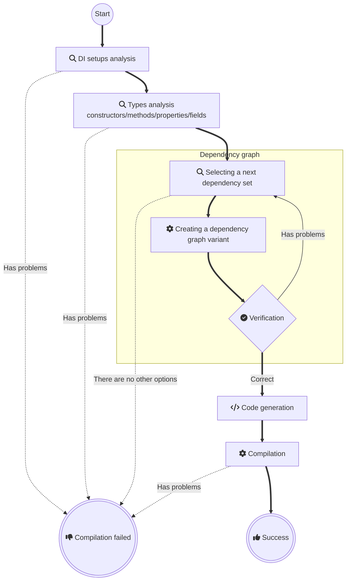

# Pure DI for .NET

<a href="https://t.me/pure_di"></a>
[](https://www.nuget.org/packages/Pure.DI)
[](LICENSE)


|                   |                                                                                                                                                                                                                                                                                 |
|-------------------|---------------------------------------------------------------------------------------------------------------------------------------------------------------------------------------------------------------------------------------------------------------------------------|
| Build and test    | [/statusIcon)](https://teamcity.jetbrains.com/viewType.html?buildTypeId=OpenSourceProjects_DevTeam_PureDi_BuildAndTestBuildType&guest=1) |
| Test examples     | [/statusIcon)](https://teamcity.jetbrains.com/viewType.html?buildTypeId=OpenSourceProjects_DevTeam_PureDi_TestExamples&guest=1)                    |
| Performance tests | [/statusIcon)](https://teamcity.jetbrains.com/viewType.html?buildTypeId=OpenSourceProjects_DevTeam_PureDi_PerformanceTests&guest=1)        |


_Supports .NET starting with [.NET Framework 2.0](https://www.microsoft.com/en-us/download/details.aspx?id=6041), released 2005-10-27, and all newer versions._

## Usage requirements

- [.NET SDK 6.0.4](https://dotnet.microsoft.com/download/dotnet/6.0) or later is installed. At the same time, you can develop .NET projects even for older versions like .NET Framework 2.0

- [C# 8](https://docs.microsoft.com/en-us/dotnet/csharp/whats-new/csharp-version-history#c-version-80) or later. This requirement only needs to be met for projects that reference the _Pure.DI_ source code generator, other projects can use any version of C#.

## Key features

Pure.DI is not a framework or library, but a source code generator for creating object graphs. To make them accurate, the developer uses a set of intuitive hints from the Pure.DI API. During the compilation phase, Pure.DI determines the optimal graph structure, checks its correctness, and generates partial class code to create object graphs in the Pure DI paradigm using only basic language constructs. The resulting generated code is robust, works everywhere, throws no exceptions, does not depend on .NET library calls or .NET reflections, is efficient in terms of performance and memory consumption, and is subject to all optimizations. This code can be easily integrated into an application because it does not use unnecessary delegates, additional calls to any methods, type conversions, boxing/unboxing, etc.

- [X] DI without any IoC/DI containers, frameworks, dependencies and hence no performance impact or side effects. 
  >_Pure.DI_ is actually a [.NET code generator](https://docs.microsoft.com/en-us/dotnet/csharp/roslyn-sdk/source-generators-overview). It uses basic language constructs to create simple code as well as if you were doing it yourself: de facto it's just a bunch of nested constructor calls. This code can be viewed, analyzed at any time, and debugged.
- [X] A predictable and verified dependency graph is built and validated on the fly while writing code.
  >All logic for analyzing the graph of objects, constructors and methods takes place at compile time. _Pure.DI_ notifies the developer at compile time of missing or cyclic dependencies, cases when some dependencies are not suitable for injection, etc. The developer has no chance to get a program that will crash at runtime because of some exception related to incorrect object graph construction. All this magic happens at the same time as the code is written, so you have instant feedback between the fact that you have made changes to your code and the fact that your code is already tested and ready to use.
- [X] Does not add any dependencies to other assemblies.
  >When using pure DI, no dependencies are added to assemblies because only basic language constructs and nothing more are used.
- [X] Highest performance, including compiler and JIT optimization and minimal memory consumption.
  >All generated code runs as fast as your own, in pure DI style, including compile-time and run-time optimization. As mentioned above, graph analysis is done at compile time, and at runtime there are only a bunch of nested constructors, and that's it. Memory is spent only on the object graph being created.
- [X] It works everywhere.
  >Since the pure DI approach does not use any dependencies or [.NET reflection](https://docs.microsoft.com/en-us/dotnet/framework/reflection-and-codedom/reflection) at runtime, it does not prevent the code from running as expected on any platform: Full .NET Framework 2.0+, .NET Core, .NET, UWP/XBOX, .NET IoT, Xamarin, Native AOT, etc.
- [X] Ease of Use.
  >The _Pure.DI_ API is very similar to the API of most IoC/DI libraries. And this was a conscious decision: the main reason is that programmers don't need to learn a new API.
- [X] Superfine customization of generic types.
  >In _Pure.DI_ it is proposed to use special marker types instead of using open generic types. This allows you to build the object graph more accurately and take full advantage of generic types.
- [X] Supports the major .NET BCL types out of the box.
  >_Pure.DI_ already [supports](#base-class-library) many of [BCL types](https://docs.microsoft.com/en-us/dotnet/standard/framework-libraries#base-class-libraries) like `Array`, `IEnumerable<T>`, `IList<T>`, `IReadOnlyCollection<T>`, `IReadOnlyList<T>`, `ISet<T>`, `IProducerConsumerCollection<T>`, `ConcurrentBag<T>`, `Func<T>`, `ThreadLocal`, `ValueTask<T>`, `Task<T>`, `MemoryPool<T>`, `ArrayPool<T>`, `ReadOnlyMemory<T>`, `Memory<T>`, `ReadOnlySpan<T>`, `Span<T>`, `IComparer<T>`, `IEqualityComparer<T>` and etc. without any extra effort.
- [X] Good for building libraries or frameworks where resource consumption is particularly critical.
  >Its high performance, zero memory consumption/preparation overhead, and lack of dependencies make it ideal for building libraries and frameworks.


## Schrödinger's cat will demonstrate how it all works [](samples/ShroedingersCat)

### The reality is


### Let's create an abstraction

```c#
interface IBox<out T>
{
    T Content { get; }
}

interface ICat
{
    State State { get; }
}

enum State { Alive, Dead }
```

### Here's our implementation

```c#
record CardboardBox<T>(T Content): IBox<T>;

class ShroedingersCat(Lazy<State> superposition): ICat
{
    // The decoherence of the superposition
    // at the time of observation via an irreversible process
    public State State => superposition.Value;
}
```

> [!IMPORTANT]
> Our abstraction and implementation knows nothing about the magic of DI or any frameworks.

### Let's glue it all together

Add the _Pure.DI_ package to your project:

[](https://www.nuget.org/packages/Pure.DI)

Let's bind the abstractions to their implementations and set up the creation of the object graph:

```c#
DI.Setup(nameof(Composition))
    // Models a random subatomic event that may or may not occur
    .Bind().As(Singleton).To<Random>()
    // Quantum superposition of two states: Alive or Dead
    .Bind().To((Random random) => (State)random.Next(2))
    .Bind().To<ShroedingersCat>()
    // Cardboard box with any contents
    .Bind().To<CardboardBox<TT>>()
    // Composition Root
    .Root<Program>("Root");
```

> [!NOTE]
> In fact, the `Bind().As(Singleton).To<Random>()` binding is unnecessary since _Pure.DI_ supports many .NET BCL types out of the box, including [Random](https://github.com/DevTeam/Pure.DI/blob/27a1ccd604b2fdd55f6bfec01c24c86428ddfdcb/src/Pure.DI.Core/Features/Default.g.cs#L289). It was added just for the example of using the _Singleton_ lifetime.

The above code specifies the generation of a partial class named *__Composition__*, this name is defined in the `DI.Setup(nameof(Composition))` call. This class contains a *__Root__* property that returns a graph of objects with an object of type *__Program__* as the root. The type and name of the property is defined by calling `Root<Program>("Root")`. The code of the generated class looks as follows:

```c#
partial class Composition
{
    private Lock _lock = new Lock();
    private Random? _random;
    
    public Program Root
    {
      [MethodImpl(MethodImplOptions.AggressiveInlining)]
      get
      {
        var stateFunc = new Func<State>(() => {
              if (_random is null)
                using (_lock.EnterScope())
                  if (_random is null)
                    _random = new Random();

              return (State)_random.Next(2)
            });

        return new Program(
          new CardboardBox<ICat>(
            new ShroedingersCat(
              new Lazy<State>(
                stateFunc))));    
      }
    }

    public T Resolve<T>() { ... }

    public object Resolve(Type type) { ... }
}
```

Obviously, this code does not depend on other libraries, does not use type reflection or any other tricks that can negatively affect performance and memory consumption. It looks like an efficient code written by hand. At any given time, you can study it and understand how it works.

The `public Program Root { get; }` property here is a [*__Composition Root__*](https://blog.ploeh.dk/2011/07/28/CompositionRoot/), the only place in the application where the composition of the object graph for the application takes place. Each instance is created by only basic language constructs, which compiles with all optimizations with minimal impact on performance and memory consumption. In general, applications may have multiple composition roots and thus such properties. Each composition root must have its own unique name, which is defined when the `Root<T>(string name)` method is called, as shown in the above code.

### Time to open boxes!

```c#
class Program(IBox<ICat> box)
{
  // Composition Root, a single place in an application
  // where the composition of the object graphs
  // for an application take place
  static void Main() => new Composition().Root.Run();

  private void Run() => Console.WriteLine(box);
}
```

_Pure.DI_ creates efficient code in a pure DI paradigm, using only basic language constructs as if you were writing code by hand. This allows you to take full advantage of Dependency Injection everywhere and always, without any compromise!

The full analog of this application with top-level statements can be found [here](samples/ShroedingersCatTopLevelStatements).

<details>
<summary>Just try creating a project from scratch!</summary>

Install the [projects template](https://www.nuget.org/packages/Pure.DI.Templates)

```shell
dotnet new install Pure.DI.Templates
```

In some directory, create a console application

```shell
dotnet new di
```

And run it

```shell
dotnet run
```

</details>


## Examples

### Basics
- [Auto-bindings](readme/auto-bindings.md)
- [Injections of abstractions](readme/injections-of-abstractions.md)
- [Composition roots](readme/composition-roots.md)
- [Resolve methods](readme/resolve-methods.md)
- [Simplified binding](readme/simplified-binding.md)
- [Factory](readme/factory.md)
- [Simplified factory](readme/simplified-factory.md)
- [Class arguments](readme/class-arguments.md)
- [Root arguments](readme/root-arguments.md)
- [Tags](readme/tags.md)
- [Smart tags](readme/smart-tags.md)
- [Build up of an existing object](readme/build-up-of-an-existing-object.md)
- [Field injection](readme/field-injection.md)
- [Method injection](readme/method-injection.md)
- [Property injection](readme/property-injection.md)
- [Default values](readme/default-values.md)
- [Required properties or fields](readme/required-properties-or-fields.md)
- [Root binding](readme/root-binding.md)
- [Async Root](readme/async-root.md)
- [Consumer types](readme/consumer-types.md)
### Lifetimes
- [Transient](readme/transient.md)
- [Singleton](readme/singleton.md)
- [PerResolve](readme/perresolve.md)
- [PerBlock](readme/perblock.md)
- [Scope](readme/scope.md)
- [Auto scoped](readme/auto-scoped.md)
- [Default lifetime](readme/default-lifetime.md)
- [Default lifetime for a type](readme/default-lifetime-for-a-type.md)
- [Default lifetime for a type and a tag](readme/default-lifetime-for-a-type-and-a-tag.md)
- [Disposable singleton](readme/disposable-singleton.md)
- [Async disposable singleton](readme/async-disposable-singleton.md)
- [Async disposable scope](readme/async-disposable-scope.md)
### Base Class Library
- [Func](readme/func.md)
- [Enumerable](readme/enumerable.md)
- [Enumerable generics](readme/enumerable-generics.md)
- [Array](readme/array.md)
- [Lazy](readme/lazy.md)
- [Task](readme/task.md)
- [ValueTask](readme/valuetask.md)
- [Manually started tasks](readme/manually-started-tasks.md)
- [Span and ReadOnlySpan](readme/span-and-readonlyspan.md)
- [Tuple](readme/tuple.md)
- [Weak Reference](readme/weak-reference.md)
- [Async Enumerable](readme/async-enumerable.md)
- [Service collection](readme/service-collection.md)
- [Func with arguments](readme/func-with-arguments.md)
- [Func with tag](readme/func-with-tag.md)
- [Keyed service provider](readme/keyed-service-provider.md)
- [Service provider](readme/service-provider.md)
- [Service provider with scope](readme/service-provider-with-scope.md)
- [Overriding the BCL binding](readme/overriding-the-bcl-binding.md)
### Generics
- [Generics](readme/generics.md)
- [Generic composition roots](readme/generic-composition-roots.md)
- [Complex generics](readme/complex-generics.md)
- [Generic composition roots with constraints](readme/generic-composition-roots-with-constraints.md)
- [Generic async composition roots with constraints](readme/generic-async-composition-roots-with-constraints.md)
- [Custom generic argument](readme/custom-generic-argument.md)
- [Build up of an existing generic object](readme/build-up-of-an-existing-generic-object.md)
- [Generic root arguments](readme/generic-root-arguments.md)
### Attributes
- [Constructor ordinal attribute](readme/constructor-ordinal-attribute.md)
- [Member ordinal attribute](readme/member-ordinal-attribute.md)
- [Tag attribute](readme/tag-attribute.md)
- [Type attribute](readme/type-attribute.md)
- [Inject attribute](readme/inject-attribute.md)
- [Custom attributes](readme/custom-attributes.md)
- [Custom universal attribute](readme/custom-universal-attribute.md)
- [Custom generic argument attribute](readme/custom-generic-argument-attribute.md)
- [Bind attribute](readme/bind-attribute.md)
- [Bind attribute with lifetime and tag](readme/bind-attribute-with-lifetime-and-tag.md)
- [Bind attribute for a generic type](readme/bind-attribute-for-a-generic-type.md)
### Interception
- [Decorator](readme/decorator.md)
- [Interception](readme/interception.md)
- [Advanced interception](readme/advanced-interception.md)
### Hints
- [Resolve hint](readme/resolve-hint.md)
- [ThreadSafe hint](readme/threadsafe-hint.md)
- [OnDependencyInjection hint](readme/ondependencyinjection-hint.md)
- [OnCannotResolve hint](readme/oncannotresolve-hint.md)
- [OnNewInstance hint](readme/onnewinstance-hint.md)
- [ToString hint](readme/tostring-hint.md)
- [Check for a root](readme/check-for-a-root.md)
### Advanced
- [Composition root kinds](readme/composition-root-kinds.md)
- [Tag Type](readme/tag-type.md)
- [Tag Unique](readme/tag-unique.md)
- [Tag on injection site](readme/tag-on-injection-site.md)
- [Tag on a constructor argument](readme/tag-on-a-constructor-argument.md)
- [Tag on a member](readme/tag-on-a-member.md)
- [Tag on a method argument](readme/tag-on-a-method-argument.md)
- [Tag on injection site with wildcards](readme/tag-on-injection-site-with-wildcards.md)
- [Dependent compositions](readme/dependent-compositions.md)
- [Accumulators](readme/accumulators.md)
- [Global compositions](readme/global-compositions.md)
- [Partial class](readme/partial-class.md)
- [A few partial classes](readme/a-few-partial-classes.md)
- [Tracking disposable instances per a composition root](readme/tracking-disposable-instances-per-a-composition-root.md)
- [Tracking disposable instances in delegates](readme/tracking-disposable-instances-in-delegates.md)
- [Tracking disposable instances using pre-built classes](readme/tracking-disposable-instances-using-pre-built-classes.md)
- [Tracking disposable instances with different lifetimes](readme/tracking-disposable-instances-with-different-lifetimes.md)
- [Tracking async disposable instances per a composition root](readme/tracking-async-disposable-instances-per-a-composition-root.md)
- [Tracking async disposable instances in delegates](readme/tracking-async-disposable-instances-in-delegates.md)
- [Exposed roots](readme/exposed-roots.md)
- [Exposed roots with tags](readme/exposed-roots-with-tags.md)
- [Exposed roots via arg](readme/exposed-roots-via-arg.md)
- [Exposed roots via root arg](readme/exposed-roots-via-root-arg.md)
- [Exposed generic roots](readme/exposed-generic-roots.md)
- [Exposed generic roots with args](readme/exposed-generic-roots-with-args.md)
- [DI tracing via serilog](readme/di-tracing-via-serilog.md)
### Applications
- Console
  - [Schrödinger's cat](readme/Console.md)
  - [Top level statements](readme/ConsoleTopLevelStatements.md)
  - [Native AOT](readme/ConsoleNativeAOT.md)
- UI
  - [MAUI](readme/Maui.md)
  - [WPF](readme/Wpf.md)
  - [Avalonia](readme/Avalonia.md)
  - [Win Forms Net Core](readme/WinFormsAppNetCore.md)
  - [Win Forms](readme/WinFormsApp.md)
- Web
  - [Web](readme/WebApp.md)
  - [Minimal Web API](readme/MinimalWebAPI.md)
  - [Web API](readme/WebAPI.md)
  - [gRPC service](readme/GrpcService.md)
  - [Blazor Server](readme/BlazorServerApp.md)
  - [Blazor WebAssembly](readme/BlazorWebAssemblyApp.md)
    - [https://devteam.github.io/Pure.DI/](https://devteam.github.io/Pure.DI/)
- Git repo with examples
  - [Schrödinger's cat](https://github.com/DevTeam/Pure.DI.Example) 
  - [How to use Pure.DI to create and test libraries](https://github.com/DevTeam/Pure.DI.Solution) 
## Generated Code

Each generated class, hereafter called a _composition_, must be customized. Setup starts with a call to the `Setup(string compositionTypeName)` method:

```c#
DI.Setup("Composition")
    .Bind<IDependency>().To<Dependency>()
    .Bind<IService>().To<Service>()
    .Root<IService>("Root");
```

<details>
<summary>The following class will be generated</summary>

```c#
partial class Composition
{
    // Default constructor
    public Composition() { }

    // Scope constructor
    internal Composition(Composition parentScope) { }

    // Composition root
    public IService Root
    {
        get
        {
            return new Service(new Dependency());
        }
    }

    public T Resolve<T>()  { ... }

    public T Resolve<T>(object? tag)  { ... }

    public object Resolve(Type type) { ... }

    public object Resolve(Type type, object? tag) { ... }
}
```

The _compositionTypeName_ parameter can be omitted

- if the setup is performed inside a partial class, then the composition will be created for this partial class
- for the case of a class with composition kind `CompositionKind.Global`, see [this example](readme/global-compositions.md)

</details>

<details>
<summary>Setup arguments</summary>

The first parameter is used to specify the name of the composition class. All sets with the same name will be combined to create one composition class. Alternatively, this name may contain a namespace, e.g. a composition class is generated for `Sample.Composition`:

```c#
namespace Sample
{
    partial class Composition
    {
        ...
    }
}
```

The second optional parameter may have multiple values to determine the kind of composition.

### CompositionKind.Public

This value is used by default. If this value is specified, a normal composition class will be created.

### CompositionKind.Internal

If you specify this value, the class will not be generated, but this setup can be used by others as a base setup. For example:

```c#
DI.Setup("BaseComposition", CompositionKind.Internal)
    .Bind().To<Dependency>();

DI.Setup("Composition").DependsOn("BaseComposition")
    .Bind().To<Service>();    
```

If the _CompositionKind.Public_ flag is set in the composition setup, it can also be the base for other compositions, as in the example above.

### CompositionKind.Global

No composition class will be created when this value is specified, but this setup is the base setup for all setups in the current project, and `DependsOn(...)` is not required.

</details>

<details>
<summary>Constructors</summary>

### Default constructor

It's quite trivial, this constructor simply initializes the internal state.

### Parameterized constructor

It replaces the default constructor and is only created if at least one argument is specified. For example:

```c#
DI.Setup("Composition")
    .Arg<string>("name")
    .Arg<int>("id")
    ...
```

In this case, the constructor with arguments is as follows:

```c#
public Composition(string name, int id) { ... }
```

and there is no default constructor. It is important to remember that only those arguments that are used in the object graph will appear in the constructor. Arguments that are not involved cannot be defined, as they are omitted from the constructor parameters to save resources.

### Scope constructor

This constructor creates a composition instance for the new scope. This allows ``Lifetime.Scoped`` to be applied. See [this](readme/scope.md) example for details.

</details>

<details>
<summary>Composition Roots</summary>

### Public Composition Roots

To create an object graph quickly and conveniently, a set of properties (or a methods) is formed. These properties/methods are here called roots of compositions. The type of a property/method is the type of the root object created by the composition. Accordingly, each invocation of a property/method leads to the creation of a composition with a root element of this type.

```c#
DI.Setup("Composition")
    .Bind<IService>().To<Service>()
    .Root<IService>("MyService");
```

In this case, the property for the _IService_ type will be named _MyService_ and will be available for direct use. The result of its use will be the creation of a composition of objects with the root of _IService_ type:

```c#
public IService MyService
{
    get
    { 
        ...
        return new Service(...);
    }
}
```

This is [recommended way](https://blog.ploeh.dk/2011/07/28/CompositionRoot/) to create a composition root. A composition class can contain any number of roots.

### Private Composition Roots

If the root name is empty, a private composition root with a random name is created:

```c#
private IService RootM07D16di_0001
{
    get { ... }
}
```

This root is available in _Resolve_ methods in the same way as public roots. For example:

```c#
DI.Setup("Composition")
    .Bind<IService>().To<Service>()
    .Root<IService>();
```

These properties have an arbitrary name and access modifier _private_ and cannot be used directly from the code. Do not attempt to use them, as their names are arbitrarily changed. Private composition roots can be resolved by _Resolve_ methods.

</details>

<details>
<summary>Methods "Resolve"</summary>

### Methods "Resolve"

By default, a set of four _Resolve_ methods is generated:

```c#
public T Resolve<T>() { ... }

public T Resolve<T>(object? tag) { ... }

public object Resolve(Type type) { ... }

public object Resolve(Type type, object? tag) { ... }
```

These methods can resolve both public and private composition roots that do not depend on any arguments of the composition roots. They are useful when using the [Service Locator](https://martinfowler.com/articles/injection.html) approach, where the code resolves composition roots in place:

```c#
var composition = new Composition();

composition.Resolve<IService>();
```

This is a [not recommended](https://blog.ploeh.dk/2010/02/03/ServiceLocatorisanAnti-Pattern/) way to create composition roots because _Resolve_ methods have a number of disadvantages:
- They provide access to an unlimited set of dependencies.
- Their use can potentially lead to runtime exceptions, for example, when the corresponding root has not been defined.
- Lead to performance degradation because they search for the root of a composition based on its type.

To control the generation of these methods, see the [Resolve](#resolve-hint) hint.

### Dispose and DisposeAsync

Provides a mechanism to release unmanaged resources. These methods are generated only if the composition contains at least one singleton/scoped instance that implements either the [IDisposable](https://learn.microsoft.com/en-us/dotnet/api/system.idisposable) and/or [DisposeAsync](https://learn.microsoft.com/en-us/dotnet/api/system.iasyncdisposable.disposeasync) interface. The `Dispose()` or `DisposeAsync()` method of the composition should be called to dispose of all created singleton/scoped objects:

```c#
using var composition = new Composition();
```

or

```c#
await using var composition = new Composition();
```

To dispose objects of other lifetimes please see [this](readme/tracking-disposable-instances-per-a-composition-root.md) or [this](readme/tracking-disposable-instances-in-delegates.md) examples.

</details>

<details>
<summary>Setup hints</summary>

## Setup hints

Hints are used to fine-tune code generation. Setup hints can be used as shown in the following example:

```c#
DI.Setup("Composition")
    .Hint(Hint.Resolve, "Off")
    .Hint(Hint.ThreadSafe, "Off")
    .Hint(Hint.ToString, "On")
    ...
```

In addition, setup hints can be commented out before the _Setup_ method as `hint = value`. For example:

```c#
// Resolve = Off
// ThreadSafe = Off
DI.Setup("Composition")
    ...
```

Both approaches can be mixed:

```c#
// Resolve = Off
DI.Setup("Composition")
    .Hint(Hint.ThreadSafe, "Off")
    ...
```

| Hint                                                                                                                               | Values                                     | C# version | Default   |
|------------------------------------------------------------------------------------------------------------------------------------|--------------------------------------------|------------|-----------|
| [Resolve](#resolve-hint)                                                                                                           | _On_ or _Off_                              |            | _On_      |
| [OnNewInstance](#onnewinstance-hint)                                                                                               | _On_ or _Off_                              | 9.0        | _Off_     |
| [OnNewInstancePartial](#onnewinstance-hint)                                                                                        | _On_ or _Off_                              |         | _On_      |
| [OnNewInstanceImplementationTypeNameRegularExpression](#onnewinstanceimplementationtypenameregularexpression-hint)                 | Regular expression                         |            | .+        |
| [OnNewInstanceTagRegularExpression](#onnewinstancetagregularexpression-hint)                                                       | Regular expression                         |            | .+        |
| [OnNewInstanceLifetimeRegularExpression](#onnewinstancelifetimeregularexpression-hint)                                             | Regular expression                         |            | .+        |
| [OnDependencyInjection](#ondependencyinjection-hint)                                                                               | _On_ or _Off_                              | 9.0        | _Off_     | 
| [OnDependencyInjectionPartial](#ondependencyinjectionpartial-hint)                                                                 | _On_ or _Off_                              |         | _On_      |
| [OnDependencyInjectionImplementationTypeNameRegularExpression](#OnDependencyInjectionImplementationTypeNameRegularExpression-Hint) | Regular expression                         |            | .+        |
| [OnDependencyInjectionContractTypeNameRegularExpression](#ondependencyinjectioncontracttypenameregularexpression-hint)             | Regular expression                         |            | .+        |
| [OnDependencyInjectionTagRegularExpression](#ondependencyinjectiontagregularexpression-hint)                                       | Regular expression                         |            | .+        |
| [OnDependencyInjectionLifetimeRegularExpression](#ondependencyinjectionlifetimeregularexpression-hint)                             | Regular expression                         |            | .+        |
| [OnCannotResolve](#oncannotresolve-hint)                                                                                           | _On_ or _Off_                              | 9.0        | _Off_     |
| [OnCannotResolvePartial](#oncannotresolvepartial-hint)                                                                             | _On_ or _Off_                              |         | _On_      |
| [OnCannotResolveContractTypeNameRegularExpression](#oncannotresolvecontracttypenameregularexpression-hint)                         | Regular expression                         |            | .+        |
| [OnCannotResolveTagRegularExpression](#oncannotresolvetagregularexpression-hint)                                                   | Regular expression                         |            | .+        |
| [OnCannotResolveLifetimeRegularExpression](#oncannotresolvelifetimeregularexpression-hint)                                         | Regular expression                         |            | .+        |
| [OnNewRoot](#onnewroot-hint)                                                                                                       | _On_ or _Off_                              |            | _Off_     |
| [OnNewRootPartial](#onnewrootpartial-hint)                                                                                         | _On_ or _Off_                              |            | _On_      |
| [ToString](#tostring-hint)                                                                                                         | _On_ or _Off_                              |            | _Off_     |
| [ThreadSafe](#threadsafe-hint)                                                                                                     | _On_ or _Off_                              |            | _On_      |
| [ResolveMethodModifiers](#resolvemethodmodifiers-hint)                                                                             | Method modifier                            |            | _public_  |
| [ResolveMethodName](#resolvemethodname-hint)                                                                                       | Method name                                |            | _Resolve_ |
| [ResolveByTagMethodModifiers](#resolvebytagmethodmodifiers-hint)                                                                   | Method modifier                            |            | _public_  |
| [ResolveByTagMethodName](#resolvebytagmethodname-hint)                                                                             | Method name                                |            | _Resolve_ |
| [ObjectResolveMethodModifiers](#objectresolvemethodmodifiers-hint)                                                                 | Method modifier                            |            | _public_  |
| [ObjectResolveMethodName](#objectresolvemethodname-hint)                                                                           | Method name                                |            | _Resolve_ |
| [ObjectResolveByTagMethodModifiers](#objectresolvebytagmethodmodifiers-hint)                                                       | Method modifier                            |            | _public_  |
| [ObjectResolveByTagMethodName](#objectresolvebytagmethodname-hint)                                                                 | Method name                                |            | _Resolve_ |
| [DisposeMethodModifiers](#disposemethodmodifiers-hint)                                                                             | Method modifier                            |            | _public_  |
| [DisposeAsyncMethodModifiers](#disposeasyncmethodmodifiers-hint)                                                                   | Method modifier                            |            | _public_  |
| [FormatCode](#formatcode-hint)                                                                                                     | _On_ or _Off_                              |            | _Off_     |
| [SeverityOfNotImplementedContract](#severityofnotimplementedcontract-hint)                                                         | _Error_ or _Warning_ or _Info_ or _Hidden_ |            | _Error_   |
| [Comments](#comments-hint)                                                                                                         | _On_ or _Off_                              |            | _On_     |

The list of hints will be gradually expanded to meet the needs and desires for fine-tuning code generation. Please feel free to add your ideas.

### Resolve Hint

Determines whether to generate [_Resolve_ methods](#resolve). By default, a set of four _Resolve_ methods are generated. Set this hint to _Off_ to disable the generation of resolve methods. This will reduce the generation time of the class composition, and in this case no [private composition roots](#private-composition-roots) will be generated. The class composition will be smaller and will only have [public roots](#public-composition-roots). When the _Resolve_ hint is disabled, only the public roots properties are available, so be sure to explicitly define them using the `Root<T>(string name)` method with an explicit composition root name.

### OnNewInstance Hint

Determines whether to use the _OnNewInstance_ partial method. By default, this partial method is not generated. This can be useful, for example, for logging purposes:

```c#
internal partial class Composition
{
    partial void OnNewInstance<T>(ref T value, object? tag, object lifetime) =>
        Console.WriteLine($"'{typeof(T)}'('{tag}') created.");
}
```

You can also replace the created instance with a `T` type, where `T` is the actual type of the created instance. To minimize performance loss when calling _OnNewInstance_, use the three hints below.

### OnNewInstancePartial Hint

Determines whether to generate the _OnNewInstance_ partial method. By default, this partial method is generated when the _OnNewInstance_ hint is ```On```.

### OnNewInstanceImplementationTypeNameRegularExpression Hint

This is a regular expression for filtering by instance type name. This hint is useful when _OnNewInstance_ is in _On_ state and it is necessary to limit the set of types for which the _OnNewInstance_ method will be called.

### OnNewInstanceTagRegularExpression Hint

This is a regular expression for filtering by _tag_. This hint is also useful when _OnNewInstance_ is in _On_ state and it is necessary to limit the set of _tags_ for which the _OnNewInstance_ method will be called.

### OnNewInstanceLifetimeRegularExpression Hint

This is a regular expression for filtering by _lifetime_. This hint is also useful when _OnNewInstance_ is in _On_ state and it is necessary to restrict the set of _life_ times for which the _OnNewInstance_ method will be called.

### OnDependencyInjection Hint

Determines whether to use the _OnDependencyInjection_ partial method when the _OnDependencyInjection_ hint is ```On``` to control dependency injection. By default it is ```On```.

```c#
// OnDependencyInjection = On
// OnDependencyInjectionPartial = Off
// OnDependencyInjectionContractTypeNameRegularExpression = ICalculator[\d]{1}
// OnDependencyInjectionTagRegularExpression = Abc
DI.Setup("Composition")
    ...
```

### OnDependencyInjectionPartial Hint

Determines whether to generate the _OnDependencyInjection_ partial method to control dependency injection. By default, this partial method is not generated. It cannot have an empty body because of the return value. It must be overridden when it is generated. This may be useful, for example, for [Interception Scenario](readme/interception.md).

```c#
// OnDependencyInjection = On
// OnDependencyInjectionContractTypeNameRegularExpression = ICalculator[\d]{1}
// OnDependencyInjectionTagRegularExpression = Abc
DI.Setup("Composition")
    ...
```

To minimize performance loss when calling _OnDependencyInjection_, use the three tips below.

### OnDependencyInjectionImplementationTypeNameRegularExpression Hint

This is a regular expression for filtering by instance type name. This hint is useful when _OnDependencyInjection_ is in _On_ state and it is necessary to restrict the set of types for which the _OnDependencyInjection_ method will be called.

### OnDependencyInjectionContractTypeNameRegularExpression Hint

This is a regular expression for filtering by the name of the resolving type. This hint is also useful when _OnDependencyInjection_ is in _On_ state and it is necessary to limit the set of permissive types for which the _OnDependencyInjection_ method will be called.

### OnDependencyInjectionTagRegularExpression Hint

This is a regular expression for filtering by _tag_. This hint is also useful when _OnDependencyInjection_ is in the _On_ state and you want to limit the set of _tags_ for which the _OnDependencyInjection_ method will be called.

### OnDependencyInjectionLifetimeRegularExpression Hint

This is a regular expression for filtering by _lifetime_. This hint is also useful when _OnDependencyInjection_ is in _On_ state and it is necessary to restrict the set of _lifetime_ for which the _OnDependencyInjection_ method will be called.

### OnCannotResolve Hint

Determines whether to use the `OnCannotResolve<T>(...)` partial method to handle a scenario in which an instance cannot be resolved. By default, this partial method is not generated. Because of the return value, it cannot have an empty body and must be overridden at creation.

```c#
// OnCannotResolve = On
// OnCannotResolveContractTypeNameRegularExpression = string|DateTime
// OnDependencyInjectionTagRegularExpression = null
DI.Setup("Composition")
    ...
```

To avoid missing failed bindings by mistake, use the two relevant hints below.

### OnCannotResolvePartial Hint

Determines whether to generate the `OnCannotResolve<T>(...)` partial method when the _OnCannotResolve_ hint is <c>On</c> to handle a scenario in which an instance cannot be resolved. By default it is ```On```.

```c#
// OnCannotResolve = On
// OnCannotResolvePartial = Off
// OnCannotResolveContractTypeNameRegularExpression = string|DateTime
// OnDependencyInjectionTagRegularExpression = null
DI.Setup("Composition")
    ...
```

To avoid missing failed bindings by mistake, use the two relevant hints below.

### OnNewRoot Hint

Determines whether to use a static partial method `OnNewRoot<TContract, T>(...)` to handle the new composition root registration event.

```c#
// OnNewRoot = On
DI.Setup("Composition")
    ...
```

Be careful, this hint disables checks for the ability to resolve dependencies!

### OnNewRootPartial Hint

Determines whether to generate a static partial method `OnNewRoot<TContract, T>(...)` when the _OnNewRoot_ hint is ```On``` to handle the new composition root registration event.

```c#
// OnNewRootPartial = Off
DI.Setup("Composition")
    ...
```

### OnCannotResolveContractTypeNameRegularExpression Hint

This is a regular expression for filtering by the name of the resolving type. This hint is also useful when _OnCannotResolve_ is in _On_ state and it is necessary to limit the set of resolving types for which the _OnCannotResolve_ method will be called.

### OnCannotResolveTagRegularExpression Hint

This is a regular expression for filtering by _tag_. This hint is also useful when _OnCannotResolve_ is in _On_ state and it is necessary to limit the set of _tags_ for which the _OnCannotResolve_ method will be called.

### OnCannotResolveLifetimeRegularExpression Hint

This is a regular expression for filtering by _lifetime_. This hint is also useful when _OnCannotResolve_ is in the _On_ state and it is necessary to restrict the set of _lives_ for which the _OnCannotResolve_ method will be called.

### ToString Hint

Determines whether to generate the _ToString()_ method. This method provides a class diagram in [mermaid](https://mermaid.js.org/) format. To see this diagram, just call the ToString method and copy the text to [this site](https://mermaid.live/).

```c#
// ToString = On
DI.Setup("Composition")
    .Bind<IService>().To<Service>()
    .Root<IService>("MyService");
    
var composition = new Composition();
string classDiagram = composition.ToString(); 
```

### ThreadSafe Hint

This hint determines whether the composition of objects will be created in a thread-safe way. The default value of this hint is _On_. It is a good practice not to use threads when creating an object graph, in this case the hint can be disabled, which will result in a small performance gain. For example:

```c#
// ThreadSafe = Off
DI.Setup("Composition")
    .Bind<IService>().To<Service>()
    .Root<IService>("MyService");
```

### ResolveMethodModifiers Hint

Overrides the modifiers of the `public T Resolve<T>()` method.

### ResolveMethodName Hint

Overrides the method name for `public T Resolve<T>()`.

### ResolveByTagMethodModifiers Hint

Overrides the modifiers of the `public T Resolve<T>(object? tag)` method.

### ResolveByTagMethodName Hint

Overrides the method name for `public T Resolve<T>(object? tag)`.

### ObjectResolveMethodModifiers Hint

Overrides the modifiers of the `public object Resolve(Type type)` method.

### ObjectResolveMethodName Hint

Overrides the method name for `public object Resolve(Type type)`.

### ObjectResolveByTagMethodModifiers Hint

Overrides the modifiers of the `public object Resolve(Type type, object? tag)` method.

### ObjectResolveByTagMethodName Hint

Overrides the method name for `public object Resolve(Type type, object? tag)`.

### DisposeMethodModifiers Hint

Overrides the modifiers of the `public void Dispose()` method.

### DisposeAsyncMethodModifiers Hint

Overrides the modifiers of the `public ValueTask DisposeAsync()` method.

### FormatCode Hint

Specifies whether the generated code should be formatted. This option consumes a lot of CPU resources. This hint may be useful when studying the generated code or, for example, when making presentations.

### SeverityOfNotImplementedContract Hint

Indicates the severity level of the situation when, in the binding, an implementation does not implement a contract. Possible values:

- _"Error"_, it is default value.
- _"Warning"_ - something suspicious but allowed.
- _"Info"_ - information that does not indicate a problem.
- _"Hidden"_ - what's not a problem.

### Comments Hint

Specifies whether the generated code should be commented.

```c#
// Represents the composition class
DI.Setup(nameof(Composition))
    .Bind<IService>().To<Service>()
    // Provides a composition root of my service
    .Root<IService>("MyService");
```

Appropriate comments will be added to the generated ```Composition``` class and the documentation for the class, depending on the IDE used, will look something like this:


Then documentation for the composition root:


</details>

<details>
<summary>Code generation workflow</summary>



</details>

## NuGet packages

|                      |                                                                                                                     |                                                            |
|----------------------|---------------------------------------------------------------------------------------------------------------------|:-----------------------------------------------------------|
| Pure.DI              | [](https://www.nuget.org/packages/Pure.DI)                           | DI Source code generator                                   |
| Pure.DI.Abstractions | [](https://www.nuget.org/packages/Pure.DI.Abstractions) | Abstractions for Pure.DI                                   |
| Pure.DI.Templates    | [](https://www.nuget.org/packages/Pure.DI.Templates)       | Template Package you can call from the shell/command line. |
| Pure.DI.MS           | [](https://www.nuget.org/packages/Pure.DI.MS)                     | Tools for working with Microsoft DI                        |

## Project template

Install the DI template [Pure.DI.Templates](https://www.nuget.org/packages/Pure.DI.Templates)

```shell
dotnet new install Pure.DI.Templates
```

Create a "Sample" console application from the template *__di__*

```shell
dotnet new di -o ./Sample
```

And run it

```shell
dotnet run --project Sample
```

For more information about the template, please see [this page](https://github.com/DevTeam/Pure.DI/wiki/Project-templates).

## Troubleshooting

<details>
<summary>Version update</summary>

When updating the version, it is possible that the previous version of the code generator remains active and is used by compilation services. In this case, the old and new versions of the generator may conflict. For a project where the code generator is used, it is recommended to do the following:
- After updating the version, close the IDE if it is open
- Delete the _obj_ and _bin_ directories
- Execute the following commands one by one

```shell
dotnet build-server shutdown
```

```shell
dotnet restore
```

```shell
dotnet build
```

</details>

<details>
<summary>Disabling API generation</summary>

_Pure.DI_ automatically generates its API. If an assembly already has the _Pure.DI_ API, for example, from another assembly, it is sometimes necessary to disable its automatic generation to avoid ambiguity. To do this, you need to add a _DefineConstants_ element to the project files of these modules. For example:

```xml
<PropertyGroup>
    <DefineConstants>$(DefineConstants);PUREDI_API_SUPPRESSION</DefineConstants>
</PropertyGroup>
```

</details>

<details>
<summary>Display generated files</summary>

You can set project properties to save generated files and control their storage location. In the project file, add the `<EmitCompilerGeneratedFiles>` element to the `<PropertyGroup>` group and set its value to `true`. Build the project again. The generated files are now created in the _obj/Debug/netX.X/generated/Pure.DI/Pure.DI/Pure.DI.SourceGenerator_ directory. The path components correspond to the build configuration, the target framework, the source generator project name, and the full name of the generator type. You can choose a more convenient output folder by adding the `<CompilerGeneratedFilesOutputPath>` element to the application project file. For example:

```xml
<Project Sdk="Microsoft.NET.Sdk">
    
    <PropertyGroup>
        <EmitCompilerGeneratedFiles>true</EmitCompilerGeneratedFiles>
        <CompilerGeneratedFilesOutputPath>$(BaseIntermediateOutputPath)Generated</CompilerGeneratedFilesOutputPath>
    </PropertyGroup>
    
</Project>
```

</details>

## Contribution

Thank you for your interest in contributing to the _Pure.DI_ project! First of all, if you are going to make a big change or feature, please open a problem first. That way, we can coordinate and understand if the change you're going to work on fits with current priorities and if we can commit to reviewing and merging it within a reasonable timeframe. We don't want you to waste a lot of your valuable time on something that may not align with what we want for _Pure.DI_.

Contribution prerequisites: [.NET SDK 9.0](https://dotnet.microsoft.com/en-us/download/dotnet/9.0) or later is installed.

The entire build logic is a regular [console .NET application](/build). You can use the [build.cmd](/build.cmd) and [build.sh](/build.sh) files with the appropriate command in the parameters to perform all basic actions on the project, e.g:

| Command        | Description                                                       |
|----------------|-------------------------------------------------------------------|
| g, generator   | Builds and tests generator                                        |
| l, libs        | Builds and tests libraries                                        |
| c, check       | Compatibility checks                                              |
| p, pack        | Creates NuGet packages                                            |
| r, readme      | Generates README.md                                               |
| benchmarks, bm | Runs benchmarks                                                   |
| deploy, dp     | Deploys packages                                                  |
| t, template    | Creates and deploys templates                                     |
| u, upgrade     | Upgrading the internal version of DI to the latest public version |

For example:

```
./build.sh pack
./build.cmd benchmarks
```

If you are using the Rider IDE, it already has a set of configurations to run these commands. This project uses [C# interactive](https://github.com/DevTeam/csharp-interactive) build automation system for .NET. This tool helps to make .NET builds more efficient.


### Additional resources

Examples of how to set up a composition
- [Pure.DI](https://github.com/DevTeam/Pure.DI/blob/master/src/Pure.DI.Core/Generator.cs)
- [C# interactive](https://github.com/DevTeam/csharp-interactive/blob/master/CSharpInteractive/Composition.cs)
- [Immutype](https://github.com/DevTeam/Immutype/blob/master/Immutype/Composition.cs)
- [MSBuild logger](https://github.com/JetBrains/teamcity-msbuild-logger/blob/master/TeamCity.MSBuild.Logger/Composition.cs)

Articles
- [RU New in Pure.DI](https://habr.com/ru/articles/808297/)
- [RU Pure.DI v2.1](https://habr.com/ru/articles/795809/)
- [RU Pure.DI next step](https://habr.com/ru/articles/554236/)
- [RU Pure.DI for .NET](https://habr.com/ru/articles/552858/)

RU DotNext video

<a href="http://www.youtube.com/watch?feature=player_embedded&v=nrp9SH-gLqg" target="_blank"></a>


## Benchmarks

<details>
<summary>Array</summary>

<table>
<thead><tr><th>Method              </th><th>Mean  </th><th>Error</th><th>StdDev</th><th>Median</th><th>Ratio</th><th>RatioSD</th><th>Gen0</th><th>Gen1</th><th>Allocated</th><th>Alloc Ratio</th>
</tr>
</tr><tr><td>&#39;Pure.DI composition root&#39;</td><td>88.33 ns</td><td>1.075 ns</td><td>1.006 ns</td><td>88.58 ns</td><td>0.94</td><td>0.03</td><td>0.0377</td><td>-</td><td>632 B</td><td>1.00</td>
</tr><tr><td>&#39;Pure.DI Resolve&lt;T&gt;()&#39;</td><td>91.94 ns</td><td>1.832 ns</td><td>2.445 ns</td><td>91.66 ns</td><td>0.98</td><td>0.04</td><td>0.0377</td><td>-</td><td>632 B</td><td>1.00</td>
</tr><tr><td>&#39;Pure.DI Resolve(Type)&#39;</td><td>92.65 ns</td><td>2.244 ns</td><td>6.366 ns</td><td>89.18 ns</td><td>0.98</td><td>0.07</td><td>0.0377</td><td>-</td><td>632 B</td><td>1.00</td>
</tr><tr><td>&#39;Hand Coded&#39;</td><td>94.24 ns</td><td>1.883 ns</td><td>2.578 ns</td><td>94.06 ns</td><td>1.00</td><td>0.04</td><td>0.0377</td><td>-</td><td>632 B</td><td>1.00</td>
</tr><tr><td>DryIoc</td><td>99.10 ns</td><td>0.999 ns</td><td>0.834 ns</td><td>98.91 ns</td><td>1.05</td><td>0.03</td><td>0.0377</td><td>-</td><td>632 B</td><td>1.00</td>
</tr><tr><td>LightInject</td><td>103.24 ns</td><td>2.119 ns</td><td>4.183 ns</td><td>102.65 ns</td><td>1.10</td><td>0.05</td><td>0.0377</td><td>-</td><td>632 B</td><td>1.00</td>
</tr><tr><td>Unity</td><td>4,510.09 ns</td><td>74.628 ns</td><td>66.155 ns</td><td>4,488.31 ns</td><td>47.89</td><td>1.47</td><td>0.8621</td><td>0.0076</td><td>14520 B</td><td>22.97</td>
</tr><tr><td>Autofac</td><td>15,134.66 ns</td><td>110.608 ns</td><td>86.355 ns</td><td>15,131.24 ns</td><td>160.72</td><td>4.45</td><td>1.7090</td><td>0.0610</td><td>28976 B</td><td>45.85</td>
</tr></tbody></table>

[Array details](readme/ArrayDetails.md)

</details>

<details>
<summary>Enum</summary>

<table>
<thead><tr><th>Method              </th><th>Mean  </th><th>Error</th><th>StdDev</th><th>Median</th><th>Ratio</th><th>RatioSD</th><th>Gen0</th><th>Gen1</th><th>Allocated</th><th>Alloc Ratio</th>
</tr>
</tr><tr><td>&#39;Pure.DI composition root&#39;</td><td>64.36 ns</td><td>1.282 ns</td><td>2.919 ns</td><td>62.75 ns</td><td>1.00</td><td>0.05</td><td>0.0205</td><td>-</td><td>344 B</td><td>1.00</td>
</tr><tr><td>&#39;Hand Coded&#39;</td><td>64.49 ns</td><td>0.791 ns</td><td>0.661 ns</td><td>64.47 ns</td><td>1.00</td><td>0.01</td><td>0.0205</td><td>-</td><td>344 B</td><td>1.00</td>
</tr><tr><td>&#39;Pure.DI Resolve&lt;T&gt;()&#39;</td><td>65.26 ns</td><td>0.965 ns</td><td>0.903 ns</td><td>65.56 ns</td><td>1.01</td><td>0.02</td><td>0.0205</td><td>-</td><td>344 B</td><td>1.00</td>
</tr><tr><td>&#39;Pure.DI Resolve(Type)&#39;</td><td>65.43 ns</td><td>1.004 ns</td><td>0.784 ns</td><td>65.23 ns</td><td>1.01</td><td>0.02</td><td>0.0205</td><td>-</td><td>344 B</td><td>1.00</td>
</tr><tr><td>&#39;Microsoft DI&#39;</td><td>93.40 ns</td><td>1.322 ns</td><td>1.172 ns</td><td>92.96 ns</td><td>1.45</td><td>0.02</td><td>0.0281</td><td>-</td><td>472 B</td><td>1.37</td>
</tr><tr><td>LightInject</td><td>147.58 ns</td><td>1.650 ns</td><td>1.544 ns</td><td>147.96 ns</td><td>2.29</td><td>0.03</td><td>0.0510</td><td>-</td><td>856 B</td><td>2.49</td>
</tr><tr><td>DryIoc</td><td>147.61 ns</td><td>1.110 ns</td><td>0.984 ns</td><td>147.54 ns</td><td>2.29</td><td>0.03</td><td>0.0510</td><td>-</td><td>856 B</td><td>2.49</td>
</tr><tr><td>Unity</td><td>3,736.48 ns</td><td>73.272 ns</td><td>68.539 ns</td><td>3,739.88 ns</td><td>57.94</td><td>1.18</td><td>0.8202</td><td>0.0076</td><td>13752 B</td><td>39.98</td>
</tr><tr><td>Autofac</td><td>15,610.79 ns</td><td>288.580 ns</td><td>595.967 ns</td><td>15,436.50 ns</td><td>242.08</td><td>9.47</td><td>1.7395</td><td>0.0610</td><td>29104 B</td><td>84.60</td>
</tr></tbody></table>

[Enum details](readme/EnumDetails.md)

</details>

<details>
<summary>Func</summary>

<table>
<thead><tr><th>Method              </th><th>Mean  </th><th>Error</th><th>StdDev</th><th>Ratio</th><th>RatioSD</th><th>Gen0</th><th>Gen1</th><th>Allocated</th><th>Alloc Ratio</th>
</tr>
</tr><tr><td>&#39;Pure.DI composition root&#39;</td><td>4.382 ns</td><td>0.0561 ns</td><td>0.0525 ns</td><td>0.84</td><td>0.01</td><td>0.0014</td><td>-</td><td>24 B</td><td>1.00</td>
</tr><tr><td>&#39;Hand Coded&#39;</td><td>5.193 ns</td><td>0.0649 ns</td><td>0.0542 ns</td><td>1.00</td><td>0.01</td><td>0.0014</td><td>-</td><td>24 B</td><td>1.00</td>
</tr><tr><td>&#39;Pure.DI Resolve&lt;T&gt;()&#39;</td><td>5.914 ns</td><td>0.0753 ns</td><td>0.0667 ns</td><td>1.14</td><td>0.02</td><td>0.0014</td><td>-</td><td>24 B</td><td>1.00</td>
</tr><tr><td>&#39;Pure.DI Resolve(Type)&#39;</td><td>6.375 ns</td><td>0.0465 ns</td><td>0.0388 ns</td><td>1.23</td><td>0.01</td><td>0.0014</td><td>-</td><td>24 B</td><td>1.00</td>
</tr><tr><td>DryIoc</td><td>28.979 ns</td><td>0.3875 ns</td><td>0.3435 ns</td><td>5.58</td><td>0.08</td><td>0.0072</td><td>-</td><td>120 B</td><td>5.00</td>
</tr><tr><td>LightInject</td><td>155.185 ns</td><td>2.9628 ns</td><td>2.7714 ns</td><td>29.89</td><td>0.60</td><td>0.0300</td><td>-</td><td>504 B</td><td>21.00</td>
</tr><tr><td>Unity</td><td>1,760.400 ns</td><td>12.4774 ns</td><td>11.6714 ns</td><td>339.03</td><td>3.99</td><td>0.1507</td><td>-</td><td>2552 B</td><td>106.33</td>
</tr><tr><td>Autofac</td><td>5,745.474 ns</td><td>36.1642 ns</td><td>30.1988 ns</td><td>1,106.51</td><td>12.28</td><td>0.8316</td><td>0.0076</td><td>14008 B</td><td>583.67</td>
</tr></tbody></table>

[Func details](readme/FuncDetails.md)

</details>

<details>
<summary>Singleton</summary>

<table>
<thead><tr><th>Method              </th><th>Mean   </th><th>Error  </th><th>StdDev</th><th>Ratio</th><th>RatioSD</th><th>Gen0</th><th>Gen1</th><th>Allocated</th><th>Alloc Ratio</th>
</tr>
</thead><tbody><tr><td>&#39;Hand Coded&#39;</td><td>3.016 ns</td><td>0.0721 ns</td><td>0.0602 ns</td><td>1.00</td><td>0.03</td><td>0.0014</td><td>-</td><td>24 B</td><td>1.00</td>
</tr><tr><td>&#39;Pure.DI composition root&#39;</td><td>3.337 ns</td><td>0.0778 ns</td><td>0.0728 ns</td><td>1.11</td><td>0.03</td><td>0.0014</td><td>-</td><td>24 B</td><td>1.00</td>
</tr><tr><td>&#39;Pure.DI Resolve&lt;T&gt;()&#39;</td><td>3.517 ns</td><td>0.0602 ns</td><td>0.0533 ns</td><td>1.17</td><td>0.03</td><td>0.0014</td><td>-</td><td>24 B</td><td>1.00</td>
</tr><tr><td>&#39;Pure.DI Resolve(Type)&#39;</td><td>4.649 ns</td><td>0.1417 ns</td><td>0.3832 ns</td><td>1.54</td><td>0.13</td><td>0.0014</td><td>-</td><td>24 B</td><td>1.00</td>
</tr><tr><td>DryIoc</td><td>11.388 ns</td><td>0.0389 ns</td><td>0.0304 ns</td><td>3.78</td><td>0.07</td><td>0.0014</td><td>-</td><td>24 B</td><td>1.00</td>
</tr><tr><td>&#39;Simple Injector&#39;</td><td>16.630 ns</td><td>0.0782 ns</td><td>0.0693 ns</td><td>5.52</td><td>0.11</td><td>0.0014</td><td>-</td><td>24 B</td><td>1.00</td>
</tr><tr><td>&#39;Microsoft DI&#39;</td><td>19.551 ns</td><td>0.0684 ns</td><td>0.0606 ns</td><td>6.49</td><td>0.12</td><td>0.0014</td><td>-</td><td>24 B</td><td>1.00</td>
</tr><tr><td>LightInject</td><td>426.861 ns</td><td>1.0945 ns</td><td>0.9702 ns</td><td>141.59</td><td>2.70</td><td>0.0014</td><td>-</td><td>24 B</td><td>1.00</td>
</tr><tr><td>Unity</td><td>2,645.530 ns</td><td>47.7345 ns</td><td>66.9171 ns</td><td>877.51</td><td>27.40</td><td>0.1869</td><td>-</td><td>3184 B</td><td>132.67</td>
</tr><tr><td>Autofac</td><td>9,723.452 ns</td><td>60.9124 ns</td><td>53.9972 ns</td><td>3,225.24</td><td>63.41</td><td>1.4343</td><td>0.0458</td><td>24208 B</td><td>1,008.67</td>
</tr><tr><td>&#39;Castle Windsor&#39;</td><td>16,991.331 ns</td><td>93.5701 ns</td><td>87.5255 ns</td><td>5,635.97</td><td>110.23</td><td>1.4038</td><td>-</td><td>23912 B</td><td>996.33</td>
</tr><tr><td>Ninject</td><td>67,297.995 ns</td><td>1,045.7465 ns</td><td>927.0271 ns</td><td>22,322.54</td><td>516.33</td><td>4.2725</td><td>1.0986</td><td>73176 B</td><td>3,049.00</td>
</tr></tbody></table>

[Singleton details](readme/SingletonDetails.md)

</details>

<details>
<summary>Transient</summary>

<table>
<thead><tr><th>Method              </th><th>Mean    </th><th>Error  </th><th>StdDev </th><th>Ratio</th><th>RatioSD</th><th>Gen0</th><th>Gen1</th><th>Allocated</th><th>Alloc Ratio</th>
</tr>
</thead><tbody><tr><td>&#39;Pure.DI composition root&#39;</td><td>3.491 ns</td><td>0.1203 ns</td><td>0.2764 ns</td><td>0.97</td><td>0.09</td><td>0.0014</td><td>-</td><td>24 B</td><td>1.00</td>
</tr><tr><td>&#39;Hand Coded&#39;</td><td>3.619 ns</td><td>0.1132 ns</td><td>0.1952 ns</td><td>1.00</td><td>0.07</td><td>0.0014</td><td>-</td><td>24 B</td><td>1.00</td>
</tr><tr><td>&#39;Pure.DI Resolve&lt;T&gt;()&#39;</td><td>4.417 ns</td><td>0.1377 ns</td><td>0.3429 ns</td><td>1.22</td><td>0.11</td><td>0.0014</td><td>-</td><td>24 B</td><td>1.00</td>
</tr><tr><td>&#39;Pure.DI Resolve(Type)&#39;</td><td>4.649 ns</td><td>0.1431 ns</td><td>0.1338 ns</td><td>1.29</td><td>0.08</td><td>0.0014</td><td>-</td><td>24 B</td><td>1.00</td>
</tr><tr><td>LightInject</td><td>7.043 ns</td><td>0.0902 ns</td><td>0.0754 ns</td><td>1.95</td><td>0.10</td><td>0.0014</td><td>-</td><td>24 B</td><td>1.00</td>
</tr><tr><td>&#39;Microsoft DI&#39;</td><td>10.357 ns</td><td>0.1357 ns</td><td>0.1133 ns</td><td>2.87</td><td>0.15</td><td>0.0014</td><td>-</td><td>24 B</td><td>1.00</td>
</tr><tr><td>DryIoc</td><td>10.673 ns</td><td>0.1197 ns</td><td>0.1119 ns</td><td>2.96</td><td>0.16</td><td>0.0014</td><td>-</td><td>24 B</td><td>1.00</td>
</tr><tr><td>&#39;Simple Injector&#39;</td><td>14.594 ns</td><td>0.1373 ns</td><td>0.1217 ns</td><td>4.04</td><td>0.21</td><td>0.0014</td><td>-</td><td>24 B</td><td>1.00</td>
</tr><tr><td>Unity</td><td>4,320.577 ns</td><td>85.0619 ns</td><td>175.6675 ns</td><td>1,197.13</td><td>78.58</td><td>0.3052</td><td>-</td><td>5176 B</td><td>215.67</td>
</tr><tr><td>Autofac</td><td>12,616.111 ns</td><td>227.4971 ns</td><td>201.6703 ns</td><td>3,495.62</td><td>189.02</td><td>1.9836</td><td>0.0916</td><td>33224 B</td><td>1,384.33</td>
</tr><tr><td>&#39;Castle Windsor&#39;</td><td>27,766.858 ns</td><td>312.7020 ns</td><td>277.2021 ns</td><td>7,693.52</td><td>405.54</td><td>3.2349</td><td>0.0305</td><td>54360 B</td><td>2,265.00</td>
</tr><tr><td>Ninject</td><td>148,286.554 ns</td><td>3,309.2559 ns</td><td>9,600.7521 ns</td><td>41,086.58</td><td>3,398.59</td><td>7.5684</td><td>1.4648</td><td>128736 B</td><td>5,364.00</td>
</tr></tbody></table>

[Transient details](readme/TransientDetails.md)

</details>

<details>
<summary>Benchmarks environment</summary>

<pre><code>
BenchmarkDotNet v0.14.0, Windows 10 (10.0.19045.4894/22H2/2022Update)
AMD Ryzen 9 5900X, 1 CPU, 24 logical and 12 physical cores
.NET SDK 9.0.100
  [Host]     : .NET 9.0.0 (9.0.24.52809), X64 RyuJIT AVX2
  DefaultJob : .NET 9.0.0 (9.0.24.52809), X64 RyuJIT AVX2
</code></pre>

</details>
