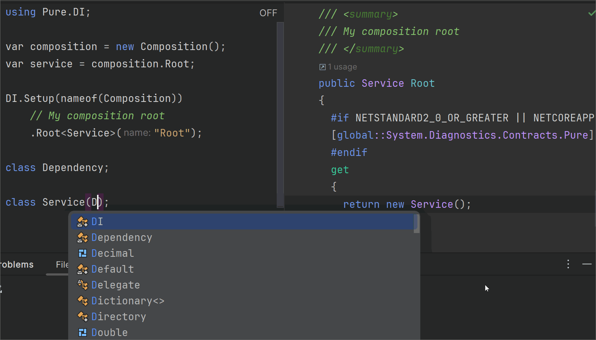
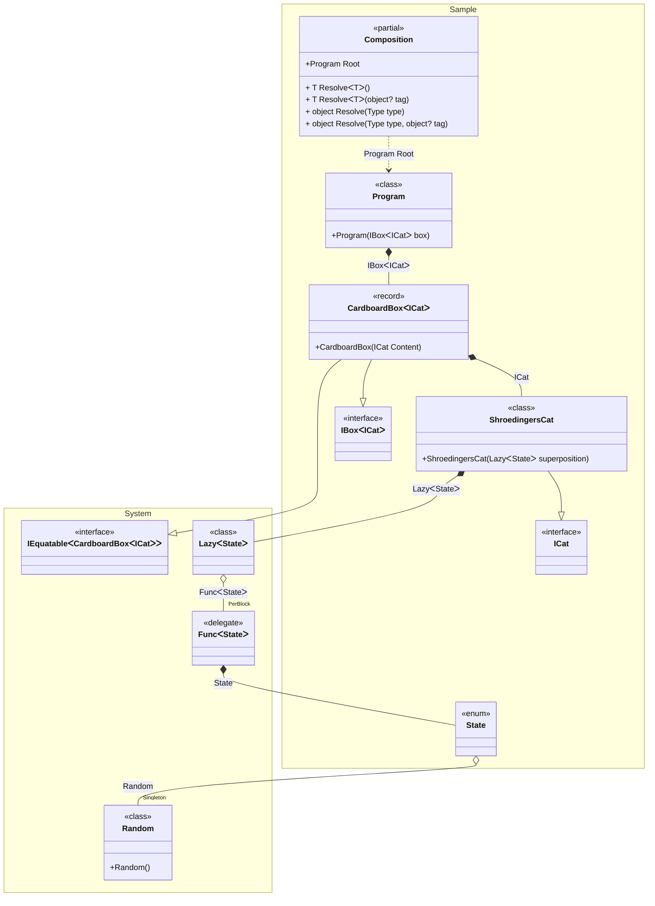
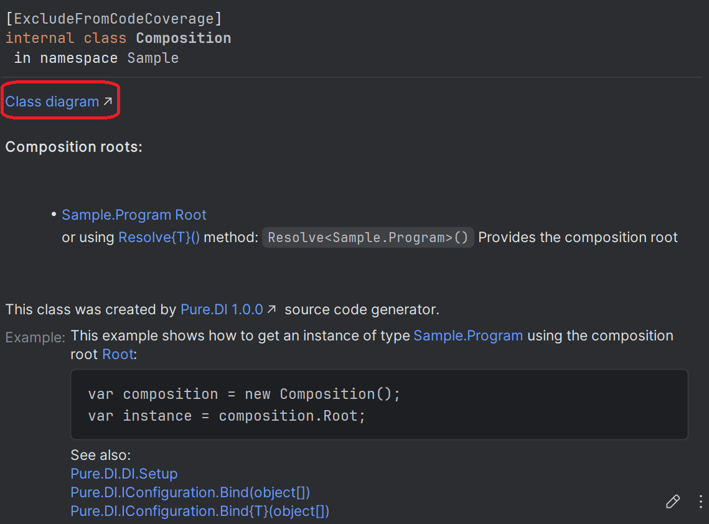
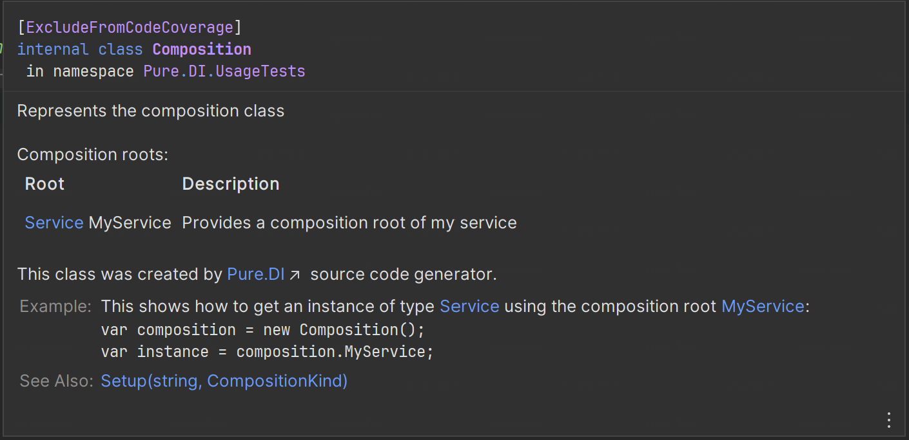
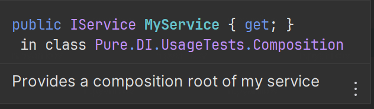
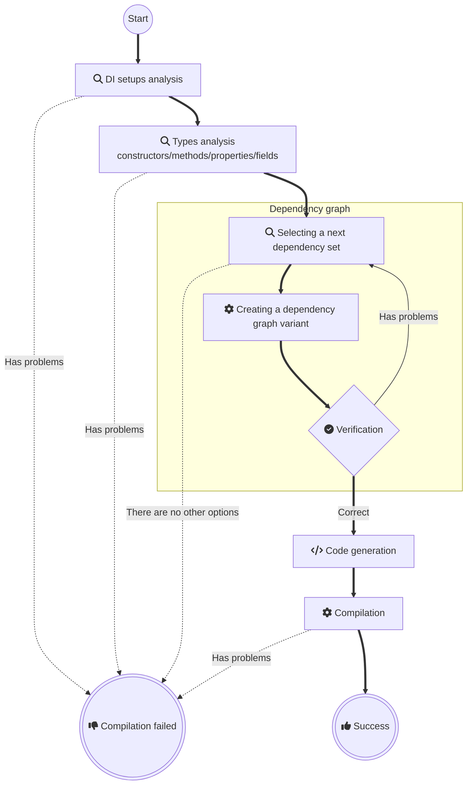

# Pure DI for .NET

<a href="https://t.me/pure_di"></a>
[](https://www.nuget.org/packages/Pure.DI)
[](LICENSE)




**Pure.DI is a compile-time dependency injection (DI) code generator**. _Supports .NET starting with [.NET Framework 2.0](https://www.microsoft.com/en-us/download/details.aspx?id=6041), released 2005-10-27, and all newer versions._

## Usage Requirements

- **[.NET SDK 6.0.4+](https://dotnet.microsoft.com/download/dotnet/6.0)**  
  Required for compilation. Projects can target older frameworks (e.g., .NET Framework 2.0).
- **[C# 8+](https://docs.microsoft.com/en-us/dotnet/csharp/whats-new/csharp-version-history#c-version-80)**  
  Only required for projects using the Pure.DI source generator. Other projects support any C# version.

## Key Features

### ✔️ Zero Overhead
Pure.DI is a .NET code generator designed to produce clean, efficient dependency injection logic. By leveraging basic language constructs, it generates straightforward code indistinguishable from manual implementation—essentially composing objects through nested constructor invocations. Unlike traditional DI frameworks, Pure.DI avoids reflection and dynamic instantiation entirely, eliminating performance penalties associated with runtime overhead.
### ✔️ Compile-Time Validation
All analysis of object, constructor, and method graphs occurs at compile time. Pure.DI proactively detects and alerts developers to issues such as missing dependencies, cyclic references, or dependencies unsuitable for injection—ensuring these errors are resolved before execution. This approach guarantees that developers cannot produce a program vulnerable to runtime crashes caused by faulty dependency wiring. The validation process operates seamlessly alongside code development, creating an immediate feedback loop: as you modify your code, Pure.DI verifies its integrity in real time, effectively delivering tested, production-ready logic the moment changes are implemented.
### ✔️ Works everywhere
The pure dependency injection approach introduces no runtime dependencies and avoids .NET reflection , ensuring consistent execution across all supported platforms. This includes the Full .NET Framework 2.0+, .NET Core, .NET 5+, UWP/Xbox, .NET IoT, Unity, Xamarin, Native AOT, and beyond. By decoupling runtime constraints, it preserves predictable behavior regardless of the target environment.
### ✔️ Familiar Syntax
The Pure.DI API is intentionally designed to closely mirror the APIs of mainstream IoC/DI frameworks. This approach ensures developers can leverage their existing knowledge of dependency injection patterns without requiring significant adaptation to a proprietary syntax.
### ✔️ Precise Generics
Pure.DI recommends utilizing dedicated marker types rather than relying on open generics. This approach enables more precise construction of object graphs while allowing developers to fully leverage the capabilities of generic types.
### ✔️ Transparency
Pure.DI allows to view and debug the generated code, making debugging and testing easier.
### ✔️ Built-in BCL Support
Pure.DI provides native [support](#base-class-library) for numerous [Base Class Library (BCL)](https://docs.microsoft.com/en-us/dotnet/standard/framework-libraries#base-class-libraries) types out of the box without any extra effort.

## When to Use Pure.DI

### ✔️ High-Performance Applications
Pure.DI is designed for high-performance applications where speed and minimal memory consumption are critical.
### ✔️ Projects with a Focus on Clean Code
Pure.DI is suitable for projects where code cleanliness and minimalism are important factors.
### ✔️ Applications with Complex Dependencies
Pure.DI can handle complex dependencies and provides flexible configuration options.
### ✔️ Ideal for Libraries
Its high performance, zero memory consumption/preparation overhead, and lack of dependencies make it ideal for building libraries and frameworks.

## NuGet packages

| NuGet package                                                               | Description                                                         |
|-----------------------------------------------------------------------------|:--------------------------------------------------------------------|
| [Pure.DI](https://www.nuget.org/packages/Pure.DI)                           | DI source code generator                                            |
| [Pure.DI.Abstractions](https://www.nuget.org/packages/Pure.DI.Abstractions) | Abstractions for Pure.DI                                            |
| [Pure.DI.Templates](https://www.nuget.org/packages/Pure.DI.Templates)       | Template package, for creating projects from the shell/command line |
| [Pure.DI.MS](https://www.nuget.org/packages/Pure.DI.MS)                     | Add-ons on Pure.DI to work with Microsoft DI                        |


## Schrödinger's cat will demonstrate how it all works [](samples/ShroedingersCat)

### The reality is


### Let's create an abstraction

```c#
interface IBox<out T>
{
    T Content { get; }
}

interface ICat
{
    State State { get; }
}

enum State { Alive, Dead }
```

### Here's our implementation

```c#
record CardboardBox<T>(T Content): IBox<T>;

class ShroedingersCat(Lazy<State> superposition): ICat
{
    // The decoherence of the superposition
    // at the time of observation via an irreversible process
    public State State => superposition.Value;
}
```

> [!IMPORTANT]
> Our abstraction and implementation knows nothing about the magic of DI or any frameworks.

### Let's glue it all together

Add the Pure.DI package to your project:

[](https://www.nuget.org/packages/Pure.DI)

Let's bind the abstractions to their implementations and set up the creation of the object graph:

```c#
DI.Setup(nameof(Composition))
    // Models a random subatomic event that may or may not occur
    .Bind().As(Singleton).To<Random>()
    // Quantum superposition of two states: Alive or Dead
    .Bind().To((Random random) => (State)random.Next(2))
    .Bind().To<ShroedingersCat>()
    // Cardboard box with any contents
    .Bind().To<CardboardBox<TT>>()
    // Composition Root
    .Root<Program>("Root");
```

> [!NOTE]
> In fact, the `Bind().As(Singleton).To<Random>()` binding is unnecessary since Pure.DI supports many .NET BCL types out of the box, including [Random](https://github.com/DevTeam/Pure.DI/blob/27a1ccd604b2fdd55f6bfec01c24c86428ddfdcb/src/Pure.DI.Core/Features/Default.g.cs#L289). It was added just for the example of using the _Singleton_ lifetime.

The above code specifies the generation of a partial class named *__Composition__*, this name is defined in the `DI.Setup(nameof(Composition))` call. This class contains a *__Root__* property that returns a graph of objects with an object of type *__Program__* as the root. The type and name of the property is defined by calling `Root<Program>("Root")`. The code of the generated class looks as follows:

```c#
partial class Composition
{
    private readonly Lock _lock = new Lock();
    private Random? _random;
    
    public Program Root
    {
      [MethodImpl(MethodImplOptions.AggressiveInlining)]
      get
      {
        var stateFunc = new Func<State>(() => {
              if (_random is null)
                lock (_lock)
                  if (_random is null)
                    _random = new Random();

              return (State)_random.Next(2)
            });

        return new Program(
          new CardboardBox<ICat>(
            new ShroedingersCat(
              new Lazy<State>(
                stateFunc))));    
      }
    }

    public T Resolve<T>() { ... }
    public T Resolve<T>(object? tag) { ... }

    public object Resolve(Type type) { ... }
    public object Resolve(Type type, object? tag)) { ... }
}
```

<details>
<summary>Class diagram</summary>



You can see the class diagram at any time by following the link in the comment of the generated class:


</details>

Obviously, this code does not depend on other libraries, does not use type reflection or any other tricks that can negatively affect performance and memory consumption. It looks like an efficient code written by hand. At any given time, you can study it and understand how it works.

The `public Program Root { get; }` property here is a [*__Composition Root__*](https://blog.ploeh.dk/2011/07/28/CompositionRoot/), the only place in the application where the composition of the object graph for the application takes place. Each instance is created by only basic language constructs, which compiles with all optimizations with minimal impact on performance and memory consumption. In general, applications may have multiple composition roots and thus such properties. Each composition root must have its own unique name, which is defined when the `Root<T>(string name)` method is called, as shown in the above code.

### Time to open boxes!

```c#
class Program(IBox<ICat> box)
{
  // Composition Root, a single place in an application
  // where the composition of the object graphs
  // for an application take place
  static void Main() => new Composition().Root.Run();

  private void Run() => Console.WriteLine(box);
}
```

Pure.DI creates efficient code in a pure DI paradigm, using only basic language constructs as if you were writing code by hand. This allows you to take full advantage of Dependency Injection everywhere and always, without any compromise!

The full analog of this application with top-level statements can be found [here](samples/ShroedingersCatTopLevelStatements).

<details>
<summary>Just try creating a project from scratch!</summary>

Install the [projects template](https://www.nuget.org/packages/Pure.DI.Templates)

```shell
dotnet new install Pure.DI.Templates
```

In some directory, create a console application

```shell
dotnet new di
```

And run it

```shell
dotnet run
```

</details>


## API


<details><summary>Pure.DI</summary><blockquote>


<details><summary>BindAttribute</summary><blockquote>

Indicates that a property or method can be automatically added as a binding.
            
```c#

internal class DependencyProvider
            {
                [Bind()]
                public Dependency Dep => new Dependency();
            }
            
```


```c#

internal class DependencyProvider
            {
                [Bind(typeof(IDependency<TT>), Lifetime.Singleton)]
                public Dependency GetDep<T>() => new Dependency();
            }
            
```


```c#

internal class DependencyProvider
            {
                [Bind(typeof(IDependency), Lifetime.PerResolve, "some tag")]
                public Dependency GetDep(int id) => new Dependency(id);
            }
            
```


See also _Exposed_.

<details><summary>Constructor BindAttribute(System.Type,Pure.DI.Lifetime,System.Object[])</summary><blockquote>

Creates an attribute instance.
            
</blockquote></details>


</blockquote></details>


<details><summary>CompositionKind</summary><blockquote>

Determines how the partial class will be generated. The _Setup(System.String,Pure.DI.CompositionKind)_ method has an additional argument  `kind` , which defines the type of composition:
            
```c#

DI.Setup("BaseComposition", CompositionKind.Internal);
            
```


See also _Setup(System.String,Pure.DI.CompositionKind)_.

<details><summary>Field Public</summary><blockquote>

This value is used by default. If this value is specified, a normal partial class will be generated.
            
</blockquote></details>


<details><summary>Field Internal</summary><blockquote>

If this value is specified, the class will not be generated, but this setting can be used by other users as a baseline. The API call _DependsOn(System.String[])_ is mandatory.
            
</blockquote></details>


<details><summary>Field Global</summary><blockquote>

No partial classes will be created when this value is specified, but this setting is the baseline for all installations in the current project, and the API call _DependsOn(System.String[])_ is not required.
            
</blockquote></details>


</blockquote></details>


<details><summary>DependencyAttribute</summary><blockquote>

A universal DI attribute that allows to specify the tag and ordinal of an injection.
            
 - parameter _tag_ - The injection tag. See also _Tags(System.Object[])_
.
            
 - parameter _ordinal_ - The injection ordinal.

See also _OrdinalAttribute_.

See also _TagAttribute_.

<details><summary>Constructor DependencyAttribute(System.Object,System.Int32)</summary><blockquote>

Creates an attribute instance.
            
 - parameter _tag_ - The injection tag. See also _Tags(System.Object[])_
.
            
 - parameter _ordinal_ - The injection ordinal.

</blockquote></details>


</blockquote></details>


<details><summary>DI</summary><blockquote>

An API for a Dependency Injection setup.
            
See also _Setup(System.String,Pure.DI.CompositionKind)_.

<details><summary>Method Setup(System.String,Pure.DI.CompositionKind)</summary><blockquote>

Begins the definitions of the Dependency Injection setup chain.
             
```c#

interface IDependency;
            
             
             class Dependency : IDependency;
            
             
             interface IService;
            
             
             class Service(IDependency dependency) : IService;
            
             
             DI.Setup("Composition")
               .Bind<IDependency>().To<Dependency>()
               .Bind<IService>().To<Service>()
               .Root<IService>("Root");
             
```


 - parameter _compositionTypeName_ - An optional argument specifying the partial class name to generate.

 - parameter _kind_ - An optional argument specifying the kind of setup. Please _CompositionKind_ for details. It defaults to  `Public` .

 - returns Reference to the setup continuation chain.

</blockquote></details>


</blockquote></details>


<details><summary>GenericTypeArgumentAttribute</summary><blockquote>

Represents a generic type argument attribute. It allows you to create custom generic type argument such as _TTS_, _TTDictionary`2_, etc.
            
```c#

[GenericTypeArgument]
            internal interface TTMy: IMy { }
            
```


See also _GenericTypeArgumentAttribute``1_.

See also _GenericTypeArgument``1_.

</blockquote></details>


<details><summary>Hint</summary><blockquote>

Hints for the code generator and can be used to fine-tune code generation.
            
```c#

// Resolve = Off
            DI.Setup("Composition")
                .Bind<IDependency>().To<Dependency>();
            
```


            or using the API call _Hint(Pure.DI.Hint,System.String)_:
            
```c#

DI.Setup("Composition")
                .Hint(Hint.Resolve, "Off")
                .Bind<IDependency>().To<Dependency>();
            
```


See also _Hint(Pure.DI.Hint,System.String)_.

<details><summary>Field Resolve</summary><blockquote>

 `On`  or  `Off` . Determines whether to generate  `Resolve`  methods.  `On`  by default.
            
```c#

// Resolve = Off
            DI.Setup("Composition")
                .Bind<IDependency>().To<Dependency>();
            
```


            or using the API call _Hint(Pure.DI.Hint,System.String)_:
            
```c#

DI.Setup("Composition")
                .Hint(Hint.Resolve, "Off")
                .Bind<IDependency>().To<Dependency>();
            
```


See also _Hint(Pure.DI.Hint,System.String)_.

</blockquote></details>


<details><summary>Field OnNewInstance</summary><blockquote>

 `On`  or  `Off` . Determines whether to use partial  `OnNewInstance`  method.  `Off`  by default.
            
```c#

// OnNewInstance = On
            DI.Setup("Composition")
                .Bind<IDependency>().To<Dependency>();
            
```


            or using the API call _Hint(Pure.DI.Hint,System.String)_:
            
```c#

DI.Setup("Composition")
                .Hint(Hint.OnNewInstance, "On")
                .Bind<IDependency>().To<Dependency>();
            
```


See also _Hint(Pure.DI.Hint,System.String)_.

</blockquote></details>


<details><summary>Field OnNewInstancePartial</summary><blockquote>

 `On`  or  `Off` . Determines whether to generate partial  `OnNewInstance`  method when the _OnNewInstance_ hint is  `On` .  `On`  by default.
            
```c#

// OnNewInstancePartial = On
            DI.Setup("Composition")
                .Bind<IDependency>().To<Dependency>();
            
```


            or using the API call _Hint(Pure.DI.Hint,System.String)_:
            
```c#

DI.Setup("Composition")
                .Hint(Hint.OnNewInstancePartial, "On")
                .Bind<IDependency>().To<Dependency>();
            
```


See also _Hint(Pure.DI.Hint,System.String)_.

</blockquote></details>


<details><summary>Field OnNewInstanceImplementationTypeNameRegularExpression</summary><blockquote>

The regular expression to filter OnNewInstance by the instance type name. ".+" by default.
            
```c#

// OnNewInstanceImplementationTypeNameRegularExpression = Dependency
            DI.Setup("Composition")
                .Bind<IDependency>().To<Dependency>();
            
```


            or using the API call _Hint(Pure.DI.Hint,System.String)_:
            
```c#

DI.Setup("Composition")
                .Hint(Hint.OnNewInstanceImplementationTypeNameRegularExpression, "Dependency")
                .Bind<IDependency>().To<Dependency>();
            
```


See also _Hint(Pure.DI.Hint,System.String)_.

</blockquote></details>


<details><summary>Field OnNewInstanceImplementationTypeNameWildcard</summary><blockquote>

The wildcard to filter OnNewInstance by the instance type name. "*" by default.
            
```c#

// OnNewInstanceImplementationTypeNameWildcard = *Dependency
            DI.Setup("Composition")
                .Bind<IDependency>().To<Dependency>();
            
```


            or using the API call _Hint(Pure.DI.Hint,System.String)_:
            
```c#

DI.Setup("Composition")
                .Hint(Hint.OnNewInstanceImplementationTypeNameWildcard, "*Dependency")
                .Bind<IDependency>().To<Dependency>();
            
```


See also _Hint(Pure.DI.Hint,System.String)_.

</blockquote></details>


<details><summary>Field OnNewInstanceTagRegularExpression</summary><blockquote>

The regular expression to filter OnNewInstance by the tag. ".+" by default.
            
```c#

// OnNewInstanceTagRegularExpression = IDependency
            DI.Setup("Composition")
                .Bind<IDependency>().To<Dependency>();
            
```


            or using the API call _Hint(Pure.DI.Hint,System.String)_:
            
```c#

DI.Setup("Composition")
                .Hint(Hint.OnNewInstanceTagRegularExpression, "IDependency")
                .Bind<IDependency>().To<Dependency>();
            
```


See also _Hint(Pure.DI.Hint,System.String)_.

</blockquote></details>


<details><summary>Field OnNewInstanceTagWildcard</summary><blockquote>

The wildcard to filter OnNewInstance by the tag. "*" by default.
            
```c#

// OnNewInstanceTagWildcard = *IDependency
            DI.Setup("Composition")
                .Bind<IDependency>().To<Dependency>();
            
```


            or using the API call _Hint(Pure.DI.Hint,System.String)_:
            
```c#

DI.Setup("Composition")
                .Hint(Hint.OnNewInstanceTagWildcard, "*IDependency")
                .Bind<IDependency>().To<Dependency>();
            
```


See also _Hint(Pure.DI.Hint,System.String)_.

</blockquote></details>


<details><summary>Field OnNewInstanceLifetimeRegularExpression</summary><blockquote>

The regular expression to filter OnNewInstance by the lifetime. ".+" by default.
            
```c#

// OnNewInstanceLifetimeRegularExpression = Singleton
            DI.Setup("Composition")
                .Bind<IDependency>().To<Dependency>();
            
```


            or using the API call _Hint(Pure.DI.Hint,System.String)_:
            
```c#

DI.Setup("Composition")
                .Hint(Hint.OnNewInstanceLifetimeRegularExpression, "Singleton")
                .Bind<IDependency>().To<Dependency>();
            
```


See also _Hint(Pure.DI.Hint,System.String)_.

</blockquote></details>


<details><summary>Field OnNewInstanceLifetimeWildcard</summary><blockquote>

The wildcard to filter OnNewInstance by the lifetime. "*" by default.
            
```c#

// OnNewInstanceLifetimeWildcard = *Singleton
            DI.Setup("Composition")
                .Bind<IDependency>().To<Dependency>();
            
```


            or using the API call _Hint(Pure.DI.Hint,System.String)_:
            
```c#

DI.Setup("Composition")
                .Hint(Hint.OnNewInstanceLifetimeWildcard, "*Singleton")
                .Bind<IDependency>().To<Dependency>();
            
```


See also _Hint(Pure.DI.Hint,System.String)_.

</blockquote></details>


<details><summary>Field OnDependencyInjection</summary><blockquote>

 `On`  or  `Off` . Determines whether to use partial  `OnDependencyInjection`  method to control of a dependency injection.  `Off`  by default.
            
```c#

// OnDependencyInjection = On
            DI.Setup("Composition")
                .Bind<IDependency>().To<Dependency>();
            
```


            or using the API call _Hint(Pure.DI.Hint,System.String)_:
            
```c#

DI.Setup("Composition")
                .Hint(Hint.OnDependencyInjection, "On")
                .Bind<IDependency>().To<Dependency>();
            
```


See also _Hint(Pure.DI.Hint,System.String)_.

</blockquote></details>


<details><summary>Field OnDependencyInjectionPartial</summary><blockquote>

 `On`  or  `Off` . Determines whether to generate partial  `OnDependencyInjection`  method when the _OnDependencyInjection_ hint is  `On`  to control of dependency injection.  `On`  by default.
            
```c#

// OnDependencyInjectionPartial = On
            DI.Setup("Composition")
                .Bind<IDependency>().To<Dependency>();
            
```


            or using the API call _Hint(Pure.DI.Hint,System.String)_:
            
```c#

DI.Setup("Composition")
                .Hint(Hint.OnDependencyInjectionPartial, "On")
                .Bind<IDependency>().To<Dependency>();
            
```


See also _Hint(Pure.DI.Hint,System.String)_.

</blockquote></details>


<details><summary>Field OnDependencyInjectionImplementationTypeNameRegularExpression</summary><blockquote>

The regular expression to filter OnDependencyInjection by the instance type name. ".+" by default.
            
```c#

// OnDependencyInjectionImplementationTypeNameRegularExpression = Dependency
            DI.Setup("Composition")
                .Bind<IDependency>().To<Dependency>();
            
```


            or using the API call _Hint(Pure.DI.Hint,System.String)_:
            
```c#

DI.Setup("Composition")
                .Hint(Hint.OnDependencyInjectionImplementationTypeNameRegularExpression, "Dependency")
                .Bind<IDependency>().To<Dependency>();
            
```


See also _Hint(Pure.DI.Hint,System.String)_.

</blockquote></details>


<details><summary>Field OnDependencyInjectionImplementationTypeNameWildcard</summary><blockquote>

The wildcard to filter OnDependencyInjection by the instance type name. "*" by default.
            
```c#

// OnDependencyInjectionImplementationTypeNameWildcard = *Dependency
            DI.Setup("Composition")
                .Bind<IDependency>().To<Dependency>();
            
```


            or using the API call _Hint(Pure.DI.Hint,System.String)_:
            
```c#

DI.Setup("Composition")
                .Hint(Hint.OnDependencyInjectionImplementationTypeNameWildcard, "*Dependency")
                .Bind<IDependency>().To<Dependency>();
            
```


See also _Hint(Pure.DI.Hint,System.String)_.

</blockquote></details>


<details><summary>Field OnDependencyInjectionContractTypeNameRegularExpression</summary><blockquote>

The regular expression to filter OnDependencyInjection by the resolving type name. ".+" by default.
            
```c#

// OnDependencyInjectionContractTypeNameRegularExpression = IDependency
            DI.Setup("Composition")
                .Bind<IDependency>().To<Dependency>();
            
```


            or using the API call _Hint(Pure.DI.Hint,System.String)_:
            
```c#

DI.Setup("Composition")
                .Hint(Hint.OnDependencyInjectionContractTypeNameRegularExpression, "IDependency")
                .Bind<IDependency>().To<Dependency>();
            
```


See also _Hint(Pure.DI.Hint,System.String)_.

</blockquote></details>


<details><summary>Field OnDependencyInjectionContractTypeNameWildcard</summary><blockquote>

The wildcard to filter OnDependencyInjection by the resolving type name. "*" by default.
            
```c#

// OnDependencyInjectionContractTypeNameWildcard = *IDependency
            DI.Setup("Composition")
                .Bind<IDependency>().To<Dependency>();
            
```


            or using the API call _Hint(Pure.DI.Hint,System.String)_:
            
```c#

DI.Setup("Composition")
                .Hint(Hint.OnDependencyInjectionContractTypeName, "*IDependency")
                .Bind<IDependency>().To<Dependency>();
            
```


See also _Hint(Pure.DI.Hint,System.String)_.

</blockquote></details>


<details><summary>Field OnDependencyInjectionTagRegularExpression</summary><blockquote>

The regular expression to filter OnDependencyInjection by the tag. ".+" by default.
            
```c#

// OnDependencyInjectionTagRegularExpression = MyTag
            DI.Setup("Composition")
                .Bind<IDependency>("MyTag").To<Dependency>();
            
```


            or using the API call _Hint(Pure.DI.Hint,System.String)_:
            
```c#

DI.Setup("Composition")
                .Hint(Hint.OnDependencyInjectionTagRegularExpression, "MyTag")
                .Bind<IDependency>("MyTag").To<Dependency>();
            
```


See also _Hint(Pure.DI.Hint,System.String)_.

</blockquote></details>


<details><summary>Field OnDependencyInjectionTagWildcard</summary><blockquote>

The wildcard to filter OnDependencyInjection by the tag. "*" by default.
            
```c#

// OnDependencyInjectionTagWildcard = MyTag
            DI.Setup("Composition")
                .Bind<IDependency>("MyTag").To<Dependency>();
            
```


            or using the API call _Hint(Pure.DI.Hint,System.String)_:
            
```c#

DI.Setup("Composition")
                .Hint(Hint.OnDependencyInjectionTagWildcard, "MyTag")
                .Bind<IDependency>("MyTag").To<Dependency>();
            
```


See also _Hint(Pure.DI.Hint,System.String)_.

</blockquote></details>


<details><summary>Field OnDependencyInjectionLifetimeRegularExpression</summary><blockquote>

The regular expression to filter OnDependencyInjection by the lifetime. ".+" by default.
            
```c#

// OnDependencyInjectionLifetimeRegularExpression = Singleton
            DI.Setup("Composition")
                .Bind<IDependency>().To<Dependency>();
            
```


            or using the API call _Hint(Pure.DI.Hint,System.String)_:
            
```c#

DI.Setup("Composition")
                .Hint(Hint.OnDependencyInjectionLifetimeRegularExpression, "Singleton")
                .Bind<IDependency>().To<Dependency>();
            
```


See also _Hint(Pure.DI.Hint,System.String)_.

</blockquote></details>


<details><summary>Field OnDependencyInjectionLifetimeWildcard</summary><blockquote>

The wildcard to filter OnDependencyInjection by the lifetime. ".+" by default.
            
```c#

// OnDependencyInjectionLifetimeWildcard = *Singleton
            DI.Setup("Composition")
                .Bind<IDependency>().To<Dependency>();
            
```


            or using the API call _Hint(Pure.DI.Hint,System.String)_:
            
```c#

DI.Setup("Composition")
                .Hint(Hint.OnDependencyInjectionLifetimeWildcard, "*Singleton")
                .Bind<IDependency>().To<Dependency>();
            
```


See also _Hint(Pure.DI.Hint,System.String)_.

</blockquote></details>


<details><summary>Field OnCannotResolve</summary><blockquote>

 `On`  or  `Off` . Determines whether to use a partial  `OnCannotResolve<T>(...)`  method to handle a scenario in which the dependency cannot be resolved.  `Off`  by default.
            
```c#

// OnCannotResolve = On
            DI.Setup("Composition")
                .Bind<IDependency>().To<Dependency>();
            
```


            or using the API call _Hint(Pure.DI.Hint,System.String)_:
            
```c#

DI.Setup("Composition")
                .Hint(Hint.OnCannotResolve, "On")
                .Bind<IDependency>().To<Dependency>();
            
```


See also _Hint(Pure.DI.Hint,System.String)_.

</blockquote></details>


<details><summary>Field OnCannotResolvePartial</summary><blockquote>

 `On`  or  `Off` . Determines whether to generate a partial  `OnCannotResolve<T>(...)`  method when the  `OnCannotResolve`  hint is  `On`  to handle a scenario in which the dependency cannot be resolved.  `On`  by default.
            
```c#

// OnCannotResolvePartial = On
            DI.Setup("Composition")
                .Bind<IDependency>().To<Dependency>();
            
```


            or using the API call _Hint(Pure.DI.Hint,System.String)_:
            
```c#

DI.Setup("Composition")
                .Hint(Hint.OnCannotResolvePartial, "On")
                .Bind<IDependency>().To<Dependency>();
            
```


See also _Hint(Pure.DI.Hint,System.String)_.

</blockquote></details>


<details><summary>Field OnCannotResolveContractTypeNameRegularExpression</summary><blockquote>

The regular expression to filter OnCannotResolve by the resolving type name. ".+" by default.
            
```c#

// OnCannotResolveContractTypeNameRegularExpression = OtherType
            DI.Setup("Composition")
                .Bind<IDependency>().To<Dependency>();
            
```


            or using the API call _Hint(Pure.DI.Hint,System.String)_:
            
```c#

DI.Setup("Composition")
                .Hint(Hint.OnCannotResolveContractTypeNameRegularExpression, "OtherType")
                .Bind<IDependency>().To<Dependency>();
            
```


See also _Hint(Pure.DI.Hint,System.String)_.

</blockquote></details>


<details><summary>Field OnCannotResolveContractTypeNameWildcard</summary><blockquote>

The wildcard to filter OnCannotResolve by the resolving type name. "*" by default.
            
```c#

// OnCannotResolveContractTypeNameWildcard = *OtherType
            DI.Setup("Composition")
                .Bind<IDependency>().To<Dependency>();
            
```


            or using the API call _Hint(Pure.DI.Hint,System.String)_:
            
```c#

DI.Setup("Composition")
                .Hint(Hint.OnCannotResolveContractTypeNameWildcard, "*OtherType")
                .Bind<IDependency>().To<Dependency>();
            
```


See also _Hint(Pure.DI.Hint,System.String)_.

</blockquote></details>


<details><summary>Field OnCannotResolveTagRegularExpression</summary><blockquote>

The regular expression to filter OnCannotResolve by the tag. ".+" by default.
            
```c#

// OnCannotResolveTagRegularExpression = MyTag
            DI.Setup("Composition")
                .Bind<IDependency>().To<Dependency>();
            
```


            or using the API call _Hint(Pure.DI.Hint,System.String)_:
            
```c#

DI.Setup("Composition")
                .Hint(Hint.OnCannotResolveTagRegularExpression, "MyTag")
                .Bind<IDependency>().To<Dependency>();
            
```


See also _Hint(Pure.DI.Hint,System.String)_.

</blockquote></details>


<details><summary>Field OnCannotResolveTagWildcard</summary><blockquote>

The wildcard to filter OnCannotResolve by the tag. "*" by default.
            
```c#

// OnCannotResolveTagWildcard = MyTag
            DI.Setup("Composition")
                .Bind<IDependency>().To<Dependency>();
            
```


            or using the API call _Hint(Pure.DI.Hint,System.String)_:
            
```c#

DI.Setup("Composition")
                .Hint(Hint.OnCannotResolveTagWildcard, "MyTag")
                .Bind<IDependency>().To<Dependency>();
            
```


See also _Hint(Pure.DI.Hint,System.String)_.

</blockquote></details>


<details><summary>Field OnCannotResolveLifetimeRegularExpression</summary><blockquote>

The regular expression to filter OnCannotResolve by the lifetime. ".+" by default.
            
```c#

// OnCannotResolveLifetimeRegularExpression = Singleton
            DI.Setup("Composition")
                .Bind<IDependency>().To<Dependency>();
            
```


            or using the API call _Hint(Pure.DI.Hint,System.String)_:
            
```c#

DI.Setup("Composition")
                .Hint(Hint.OnCannotResolveLifetimeRegularExpression, "Singleton")
                .Bind<IDependency>().To<Dependency>();
            
```


See also _Hint(Pure.DI.Hint,System.String)_.

</blockquote></details>


<details><summary>Field OnCannotResolveLifetimeWildcard</summary><blockquote>

The wildcard to filter OnCannotResolve by the lifetime. "*" by default.
            
```c#

// OnCannotResolveLifetimeWildcard = *Singleton
            DI.Setup("Composition")
                .Bind<IDependency>().To<Dependency>();
            
```


            or using the API call _Hint(Pure.DI.Hint,System.String)_:
            
```c#

DI.Setup("Composition")
                .Hint(Hint.OnCannotResolveLifetimeWildcard, "*Singleton")
                .Bind<IDependency>().To<Dependency>();
            
```


See also _Hint(Pure.DI.Hint,System.String)_.

</blockquote></details>


<details><summary>Field OnNewRoot</summary><blockquote>

 `On`  or  `Off` . Determines whether to use a static partial  `OnNewRoot<T>(...)`  method to handle the new composition root registration event.  `Off`  by default.
            
```c#

// OnNewRoot = On
            DI.Setup("Composition")
                .Bind<IDependency>().To<Dependency>();
            
```


            or using the API call _Hint(Pure.DI.Hint,System.String)_:
            
```c#

DI.Setup("Composition")
                .Hint(Hint.OnNewRoot, "On")
                .Bind<IDependency>().To<Dependency>();
            
```


See also _Hint(Pure.DI.Hint,System.String)_.

</blockquote></details>


<details><summary>Field OnNewRootPartial</summary><blockquote>

 `On`  or  `Off` . Determines whether to generate a static partial  `OnNewRoot<T>(...)`  method when the  `OnNewRoot`  hint is  `On`  to handle the new composition root registration event.  `On`  by default.
            
```c#

// OnNewRootPartial = On
            DI.Setup("Composition")
                .Bind<IDependency>().To<Dependency>();
            
```


            or using the API call _Hint(Pure.DI.Hint,System.String)_:
            
```c#

DI.Setup("Composition")
                .Hint(Hint.OnNewRootPartial, "On")
                .Bind<IDependency>().To<Dependency>();
            
```


See also _Hint(Pure.DI.Hint,System.String)_.

</blockquote></details>


<details><summary>Field ToString</summary><blockquote>

 `On`  or  `Off` . Determine if the  `ToString()`  method should be generated. This method provides a text-based class diagram in the format mermaid.  `Off`  by default. 
            
```c#

// ToString = On
            DI.Setup("Composition")
                .Bind<IDependency>().To<Dependency>();
            
```


            or using the API call _Hint(Pure.DI.Hint,System.String)_:
            
```c#

DI.Setup("Composition")
                .Hint(Hint.ToString, "On")
                .Bind<IDependency>().To<Dependency>();
            
```


See also _Hint(Pure.DI.Hint,System.String)_.

</blockquote></details>


<details><summary>Field ThreadSafe</summary><blockquote>

 `On`  or  `Off` . This hint determines whether object composition will be created in a thread-safe manner.  `On`  by default.
            
```c#

// ThreadSafe = Off
            DI.Setup("Composition")
                .Bind<IDependency>().To<Dependency>();
            
```


            or using the API call _Hint(Pure.DI.Hint,System.String)_:
            
```c#

DI.Setup("Composition")
                .Hint(Hint.ThreadSafe, "Off")
                .Bind<IDependency>().To<Dependency>();
            
```


See also _Hint(Pure.DI.Hint,System.String)_.

</blockquote></details>


<details><summary>Field ResolveMethodModifiers</summary><blockquote>

Overrides modifiers of the method  `public T Resolve<T>()` . "Public" by default.
            
```c#

// ResolveMethodModifiers = internal
            DI.Setup("Composition")
                .Bind<IDependency>().To<Dependency>();
            
```


            or using the API call _Hint(Pure.DI.Hint,System.String)_:
            
```c#

DI.Setup("Composition")
                .Hint(Hint.ResolveMethodModifiers, "internal")
                .Bind<IDependency>().To<Dependency>();
            
```


See also _Hint(Pure.DI.Hint,System.String)_.

</blockquote></details>


<details><summary>Field ResolveMethodName</summary><blockquote>

Overrides name of the method  `public T Resolve<T>()` . "Resolve" by default.
            
```c#

// ResolveMethodName = GetService
            DI.Setup("Composition")
                .Bind<IDependency>().To<Dependency>();
            
```


            or using the API call _Hint(Pure.DI.Hint,System.String)_:
            
```c#

DI.Setup("Composition")
                .Hint(Hint.ResolveMethodName, "GetService")
                .Bind<IDependency>().To<Dependency>();
            
```


See also _Hint(Pure.DI.Hint,System.String)_.

</blockquote></details>


<details><summary>Field ResolveByTagMethodModifiers</summary><blockquote>

Overrides modifiers of the method  `public T Resolve<T>(object? tag)` . "public" by default.
            
```c#

// ResolveByTagMethodModifiers = internal
            DI.Setup("Composition")
                .Bind<IDependency>().To<Dependency>();
            
```


            or using the API call _Hint(Pure.DI.Hint,System.String)_:
            
```c#

DI.Setup("Composition")
                .Hint(Hint.ResolveByTagMethodModifiers, "internal")
                .Bind<IDependency>().To<Dependency>();
            
```


See also _Hint(Pure.DI.Hint,System.String)_.

</blockquote></details>


<details><summary>Field ResolveByTagMethodName</summary><blockquote>

Overrides name of the method  `public T Resolve<T>(object? tag)` . "Resolve" by default.
            For example:
            
```c#

// ResolveByTagMethodName = GetService
            DI.Setup("Composition")
                .Bind<IDependency>().To<Dependency>();
            
```


            or using the API call _Hint(Pure.DI.Hint,System.String)_:
            
```c#

DI.Setup("Composition")
                .Hint(Hint.ResolveByTagMethodName, "GetService")
                .Bind<IDependency>().To<Dependency>();
            
```


See also _Hint(Pure.DI.Hint,System.String)_.

</blockquote></details>


<details><summary>Field ObjectResolveMethodModifiers</summary><blockquote>

Overrides modifiers of the method  `public object Resolve(Type type)` . "public" by default.
            
```c#

// ObjectResolveMethodModifiers = internal
            DI.Setup("Composition")
                .Bind<IDependency>().To<Dependency>();
            
```


            or using the API call _Hint(Pure.DI.Hint,System.String)_:
            
```c#

DI.Setup("Composition")
                .Hint(Hint.ObjectResolveMethodModifiers, "internal")
                .Bind<IDependency>().To<Dependency>();
            
```


See also _Hint(Pure.DI.Hint,System.String)_.

</blockquote></details>


<details><summary>Field ObjectResolveMethodName</summary><blockquote>

Overrides name of the method  `public object Resolve(Type type)` . "Resolve" by default.
            
```c#

// ObjectResolveMethodName = GetService
            DI.Setup("Composition")
                .Bind<IDependency>().To<Dependency>();
            
```


            or using the API call _Hint(Pure.DI.Hint,System.String)_:
            
```c#

DI.Setup("Composition")
                .Hint(Hint.ObjectResolveMethodName, "GetService")
                .Bind<IDependency>().To<Dependency>();
            
```


See also _Hint(Pure.DI.Hint,System.String)_.

</blockquote></details>


<details><summary>Field ObjectResolveByTagMethodModifiers</summary><blockquote>

Overrides modifiers of the method  `public object Resolve(Type type, object? tag)` . "public" by default.
            
```c#

// ObjectResolveByTagMethodModifiers = internal
            DI.Setup("Composition")
                .Bind<IDependency>().To<Dependency>();
            
```


            or using the API call _Hint(Pure.DI.Hint,System.String)_:
            
```c#

DI.Setup("Composition")
                .Hint(Hint.ObjectResolveByTagMethodModifiers, "internal")
                .Bind<IDependency>().To<Dependency>();
            
```


See also _Hint(Pure.DI.Hint,System.String)_.

</blockquote></details>


<details><summary>Field ObjectResolveByTagMethodName</summary><blockquote>

Overrides name of the method  `public object Resolve(Type type, object? tag)` . "Resolve" by default.
            
```c#

// ObjectResolveByTagMethodName = GetService
            DI.Setup("Composition")
                .Bind<IDependency>().To<Dependency>();
            
```


            or using the API call _Hint(Pure.DI.Hint,System.String)_:
            
```c#

DI.Setup("Composition")
                .Hint(Hint.ObjectResolveByTagMethodName, "GetService")
                .Bind<IDependency>().To<Dependency>();
            
```


See also _Hint(Pure.DI.Hint,System.String)_.

</blockquote></details>


<details><summary>Field DisposeMethodModifiers</summary><blockquote>

Overrides modifiers of the method  `public void Dispose()` . "public" by default.
            
```c#

// DisposeMethodModifiers = internal
            DI.Setup("Composition")
                .Bind<IDependency>().To<Dependency>();
            
```


            or using the API call _Hint(Pure.DI.Hint,System.String)_:
            
```c#

DI.Setup("Composition")
                .Hint(Hint.DisposeMethodModifiers, "internal")
                .Bind<IDependency>().To<Dependency>();
            
```


See also _Hint(Pure.DI.Hint,System.String)_.

</blockquote></details>


<details><summary>Field DisposeAsyncMethodModifiers</summary><blockquote>

Overrides modifiers of the method  `public _ValueTask_ DisposeAsyncMethodModifiers()` . "public" by default.
            
```c#

// DisposeAsyncMethodModifiers = internal
            DI.Setup("Composition")
                .Bind<IDependency>().To<Dependency>();
            
```


            or using the API call _Hint(Pure.DI.Hint,System.String)_:
            
```c#

DI.Setup("Composition")
                .Hint(Hint.DisposeAsyncMethodModifiers, "internal")
                .Bind<IDependency>().To<Dependency>();
            
```


See also _Hint(Pure.DI.Hint,System.String)_.

</blockquote></details>


<details><summary>Field FormatCode</summary><blockquote>

 `On`  or  `Off` . Specifies whether the generated code should be formatted. This option consumes a lot of CPU resources.  `Off`  by default.
            
```c#

// FormatCode = On
            DI.Setup("Composition")
                .Bind<IDependency>().To<Dependency>();
            
```


            or using the API call _Hint(Pure.DI.Hint,System.String)_:
            
```c#

DI.Setup("Composition")
                .Hint(Hint.FormatCode, "On")
                .Bind<IDependency>().To<Dependency>();
            
```


See also _Hint(Pure.DI.Hint,System.String)_.

</blockquote></details>


<details><summary>Field SeverityOfNotImplementedContract</summary><blockquote>

 `Error`  or  `Warning`  or  `Info`  or  `Hidden` . Indicates the severity level of the situation when, in the binding, an implementation does not implement a contract.  `Error`  by default.
            
```c#

// FormatCode = On
            DI.Setup("Composition")
                .Bind<IDependency>().To<Dependency>();
            
```


            or using the API call _Hint(Pure.DI.Hint,System.String)_:
            
```c#

DI.Setup("Composition")
                .Hint(Hint.SeverityOfNotImplementedContracts, "On")
                .Bind<IDependency>().To<Dependency>();
            
```


See also _Hint(Pure.DI.Hint,System.String)_.

</blockquote></details>


<details><summary>Field Comments</summary><blockquote>

 `On`  or  `Off` . Specifies whether the generated code should be commented.  `On`  by default.
            
```c#

// Comments = Off
            DI.Setup("Composition")
                .Bind<IDependency>().To<Dependency>();
            
```


            or using the API call _Hint(Pure.DI.Hint,System.String)_:
            
```c#

DI.Setup("Composition")
                .Hint(Hint.Comments, "Off")
                .Bind<IDependency>().To<Dependency>();
            
```


See also _Hint(Pure.DI.Hint,System.String)_.

</blockquote></details>


<details><summary>Field SkipDefaultConstructor</summary><blockquote>

 `On`  or  `Off` . Determines whether to skip using the default constructor to create an instance.  `Off`  by default.
            
```c#

// SkipDefaultConstructor = On
            DI.Setup("Composition")
                .Bind<IDependency>().To<Dependency>();
            
```


            or using the API call _Hint(Pure.DI.Hint,System.String)_:
            
```c#

DI.Setup("Composition")
                .Hint(Hint.UseDefaultConstructor, "Off")
                .Bind<IDependency>().To<Dependency>();
            
```


See also _Hint(Pure.DI.Hint,System.String)_.

</blockquote></details>


<details><summary>Field SkipDefaultConstructorImplementationTypeNameRegularExpression</summary><blockquote>

The regular expression to filter whether to skip using the default constructor to create an instance by the instance type name. ".+" by default.
            
```c#

// SkipDefaultConstructorImplementationTypeNameRegularExpression = Dependency
            DI.Setup("Composition")
                .Bind<IDependency>().To<Dependency>();
            
```


            or using the API call _Hint(Pure.DI.Hint,System.String)_:
            
```c#

DI.Setup("Composition")
                .Hint(Hint.SkipDefaultConstructorImplementationTypeNameRegularExpression, "Dependency")
                .Bind<IDependency>().To<Dependency>();
            
```


See also _Hint(Pure.DI.Hint,System.String)_.

</blockquote></details>


<details><summary>Field SkipDefaultConstructorImplementationTypeNameWildcard</summary><blockquote>

The wildcard to filter whether to skip using the default constructor to create an instance by the instance type name. "*" by default.
            
```c#

// SkipDefaultConstructorImplementationTypeNameWildcard = *Dependency
            DI.Setup("Composition")
                .Bind<IDependency>().To<Dependency>();
            
```


            or using the API call _Hint(Pure.DI.Hint,System.String)_:
            
```c#

DI.Setup("Composition")
                .Hint(Hint.SkipDefaultConstructorImplementationTypeNameWildcard, "*Dependency")
                .Bind<IDependency>().To<Dependency>();
            
```


See also _Hint(Pure.DI.Hint,System.String)_.

</blockquote></details>


<details><summary>Field SkipDefaultConstructorLifetimeRegularExpression</summary><blockquote>

The regular expression to filter whether to skip using the default constructor to create an instance by the lifetime. ".+" by default.
            
```c#

// SkipDefaultConstructorLifetimeRegularExpression = Singleton
            DI.Setup("Composition")
                .Bind<IDependency>().To<Dependency>();
            
```


            or using the API call _Hint(Pure.DI.Hint,System.String)_:
            
```c#

DI.Setup("Composition")
                .Hint(Hint.SkipDefaultConstructorLifetimeRegularExpression, "Singleton")
                .Bind<IDependency>().To<Dependency>();
            
```


See also _Hint(Pure.DI.Hint,System.String)_.

</blockquote></details>


<details><summary>Field SkipDefaultConstructorLifetimeWildcard</summary><blockquote>

The wildcard to filter whether to skip using the default constructor to create an instance by the lifetime. ".+" by default.
            
```c#

// SkipDefaultConstructorLifetimeWildcard = *Singleton
            DI.Setup("Composition")
                .Bind<IDependency>().To<Dependency>();
            
```


            or using the API call _Hint(Pure.DI.Hint,System.String)_:
            
```c#

DI.Setup("Composition")
                .Hint(Hint.SkipDefaultConstructorLifetimeWildcard, "*Singleton")
                .Bind<IDependency>().To<Dependency>();
            
```


See also _Hint(Pure.DI.Hint,System.String)_.

</blockquote></details>


<details><summary>Field DisableAutoBinding</summary><blockquote>

 `On`  or  `Off` . Determines whether dependency injection should NOT be performed if a binding for that dependency has not been explicitly defined.  `Off`  by default.
            
```c#

// DisableAutoBinding = On
            DI.Setup("Composition")
                .Bind<IDependency>().To<Dependency>();
            
```


            or using the API call _Hint(Pure.DI.Hint,System.String)_:
            
```c#

DI.Setup("Composition")
                .Hint(Hint.DisableAutoBinding, "Off")
                .Bind<IDependency>().To<Dependency>();
            
```


See also _Hint(Pure.DI.Hint,System.String)_.

</blockquote></details>


<details><summary>Field DisableAutoBindingImplementationTypeNameRegularExpression</summary><blockquote>

The regular expression by the instance type name to filter whether a dependency injection should NOT be performed if a binding for that dependency has not been explicitly defined. ".+" by default.
            
```c#

// DisableAutoBindingImplementationTypeNameRegularExpression = Dependency
            DI.Setup("Composition")
                .Bind<IDependency>().To<Dependency>();
            
```


            or using the API call _Hint(Pure.DI.Hint,System.String)_:
            
```c#

DI.Setup("Composition")
                .Hint(Hint.DisableAutoBindingImplementationTypeNameRegularExpression, "Dependency")
                .Bind<IDependency>().To<Dependency>();
            
```


See also _Hint(Pure.DI.Hint,System.String)_.

</blockquote></details>


<details><summary>Field DisableAutoBindingImplementationTypeNameWildcard</summary><blockquote>

The wildcard by the instance type name to filter whether a dependency injection should NOT be performed if a binding for that dependency has not been explicitly defined. "*" by default.
            
```c#

// DisableAutoBindingImplementationTypeNameWildcard = *Dependency
            DI.Setup("Composition")
                .Bind<IDependency>().To<Dependency>();
            
```


            or using the API call _Hint(Pure.DI.Hint,System.String)_:
            
```c#

DI.Setup("Composition")
                .Hint(Hint.DisableAutoBindingImplementationTypeNameWildcard, "*Dependency")
                .Bind<IDependency>().To<Dependency>();
            
```


See also _Hint(Pure.DI.Hint,System.String)_.

</blockquote></details>


<details><summary>Field DisableAutoBindingLifetimeRegularExpression</summary><blockquote>

The regular expression by the lifetime to filter whether a dependency injection should NOT be performed if a binding for that dependency has not been explicitly defined. ".+" by default.
            
```c#

// DisableAutoBindingLifetimeRegularExpression = Singleton
            DI.Setup("Composition")
                .Bind<IDependency>().To<Dependency>();
            
```


            or using the API call _Hint(Pure.DI.Hint,System.String)_:
            
```c#

DI.Setup("Composition")
                .Hint(Hint.DisableAutoBindingLifetimeRegularExpression, "Singleton")
                .Bind<IDependency>().To<Dependency>();
            
```


See also _Hint(Pure.DI.Hint,System.String)_.

</blockquote></details>


<details><summary>Field DisableAutoBindingLifetimeWildcard</summary><blockquote>

The wildcard by the lifetime to filter whether a dependency injection should NOT be performed if a binding for that dependency has not been explicitly defined. ".+" by default.
            
```c#

// DisableAutoBindingLifetimeWildcard = *Singleton
            DI.Setup("Composition")
                .Bind<IDependency>().To<Dependency>();
            
```


            or using the API call _Hint(Pure.DI.Hint,System.String)_:
            
```c#

DI.Setup("Composition")
                .Hint(Hint.DisableAutoBindingLifetimeWildcard, "*Singleton")
                .Bind<IDependency>().To<Dependency>();
            
```


See also _Hint(Pure.DI.Hint,System.String)_.

</blockquote></details>


</blockquote></details>


<details><summary>IBinding</summary><blockquote>

An API for a binding setup.
            
<details><summary>Method Bind(System.Object[])</summary><blockquote>

Begins the binding definition for the implementation type itself, and if the implementation is not an abstract class or structure, for all abstract but NOT special types that are directly implemented.
            Special types include:
            System.ObjectSystem.EnumSystem.MulticastDelegateSystem.DelegateSystem.Collections.IEnumerableSystem.Collections.Generic.IEnumerable<T>System.Collections.Generic.IList<T>System.Collections.Generic.ICollection<T>System.Collections.IEnumeratorSystem.Collections.Generic.IEnumerator<T>System.Collections.Generic.IIReadOnlyList<T>System.Collections.Generic.IReadOnlyCollection<T>System.IDisposableSystem.IAsyncResultSystem.AsyncCallback
```c#

DI.Setup("Composition")
                .Bind().To<Service>();
            
```


 - parameter _tags_ - The optional argument that specifies tags for a particular type of dependency binding.

 - returns Reference to the setup continuation chain.

See also _To``1_.

See also _To``1(System.Func{Pure.DI.IContext,``0})_.

See also _!:To<T1,T>()_.

See also _!:To<T1,T2,T>()_.

See also _Tags(System.Object[])_.

See also _As(Pure.DI.Lifetime)_.

</blockquote></details>


<details><summary>Method Bind``1(System.Object[])</summary><blockquote>

Begins the definition of the binding.
            
```c#

DI.Setup("Composition")
                .Bind<IDependency>().To<Dependency>();
            
```

The type of dependency to be bound. Common type markers such as _TT_, _TTList`1_ and others are also supported.
 - parameter _tags_ - The optional argument that specifies tags for a particular type of dependency binding.

 - returns Reference to the setup continuation chain.

See also _To``1_.

See also _To``1(System.Func{Pure.DI.IContext,``0})_.

See also _!:To<T1,T>()_.

See also _!:To<T1,T2,T>()_.

See also _Tags(System.Object[])_.

See also _As(Pure.DI.Lifetime)_.

</blockquote></details>


<details><summary>Method Bind``2(System.Object[])</summary><blockquote>

Begins binding definition for multiple dependencies. See _Bind``1(System.Object[])_ for examples.
            Type 1 of a dependency to be bound.Type 2 of a dependency to be bound.
 - parameter _tags_ - The optional argument that specifies tags for a particular type of dependency binding.

 - returns Reference to the setup continuation chain.

See also _To``1_.

See also _To``1(System.Func{Pure.DI.IContext,``0})_.

See also _!:To<T1,T>()_.

See also _!:To<T1,T2,T>()_.

See also _Tags(System.Object[])_.

See also _As(Pure.DI.Lifetime)_.

</blockquote></details>


<details><summary>Method Bind``3(System.Object[])</summary><blockquote>

Begins binding definition for multiple dependencies. See _Bind``1(System.Object[])_ for examples.
            Type 1 of a dependency to be bound.Type 2 of a dependency to be bound.Type 3 of a dependency to be bound.
 - parameter _tags_ - The optional argument that specifies tags for a particular type of dependency binding.

 - returns Reference to the setup continuation chain.

See also _To``1_.

See also _To``1(System.Func{Pure.DI.IContext,``0})_.

See also _!:To<T1,T>()_.

See also _!:To<T1,T2,T>()_.

See also _Tags(System.Object[])_.

See also _As(Pure.DI.Lifetime)_.

</blockquote></details>


<details><summary>Method Bind``4(System.Object[])</summary><blockquote>

Begins binding definition for multiple dependencies. See _Bind``1(System.Object[])_ for examples.
            Type 1 of a dependency to be bound.Type 2 of a dependency to be bound.Type 3 of a dependency to be bound.Type 3 of a dependency to be bound.
 - parameter _tags_ - The optional argument that specifies tags for a particular type of a dependency binding.

 - returns Reference to the setup continuation chain.

See also _To``1_.

See also _To``1(System.Func{Pure.DI.IContext,``0})_.

See also _!:To<T1,T>()_.

See also _!:To<T1,T2,T>()_.

See also _Tags(System.Object[])_.

See also _As(Pure.DI.Lifetime)_.

</blockquote></details>


<details><summary>Method As(Pure.DI.Lifetime)</summary><blockquote>

Determines the _Lifetime_ of a binding.
            
```c#

DI.Setup("Composition")
                .Bind<IDependency>().As(Lifetime.Singleton).To<Dependency>();
            
```


 - parameter _lifetime_ - The _Lifetime_ of a binding

 - returns Reference to the setup continuation chain.

See also _Bind``1(System.Object[])_.

See also _To``1_.

See also _To``1(System.Func{Pure.DI.IContext,``0})_.

See also _!:To<T1,T>()_.

See also _!:To<T1,T2,T>()_.

See also _Tags(System.Object[])_.

</blockquote></details>


<details><summary>Method Tags(System.Object[])</summary><blockquote>

Defines the binding tags.
             Sometimes it's important to take control of building a dependency graph. For example, when there are multiple implementations of the same contract. In this case, tags will help:
             
```c#

interface IDependency { }
             
            
             class AbcDependency : IDependency { }
             
            
             class XyzDependency : IDependency { }
             
            
             class Dependency : IDependency { }
             
            
             interface IService
             {
                 IDependency Dependency1 { get; }
             
            
                 IDependency Dependency2 { get; }
             }
            
             
             class Service : IService
             {
                 public Service(
                     [Tag("Abc")] IDependency dependency1,
                     [Tag("Xyz")] IDependency dependency2)
                 {
                     Dependency1 = dependency1;
                     Dependency2 = dependency2;
                 }
            
                 public IDependency Dependency1 { get; }
            
             
                 public IDependency Dependency2 { get; }
             }
            
             
             DI.Setup("Composition")
                 .Bind<IDependency>().Tags("Abc").To<AbcDependency>()
                 .Bind<IDependency>().Tags("Xyz").To<XyzDependency>()
                 .Bind<IService>().To<Service>().Root<IService>("Root");
             
```


 - parameter _tags_ - The binding tags.

 - returns Reference to the setup continuation chain.

See also _Bind``1(System.Object[])_.

See also _To``1_.

See also _To``1(System.Func{Pure.DI.IContext,``0})_.

See also _!:To<T1,T>()_.

See also _!:To<T1,T2,T>()_.

See also _As(Pure.DI.Lifetime)_.

</blockquote></details>


<details><summary>Method To``1</summary><blockquote>

Completes the binding chain by specifying the implementation.
            
```c#

DI.Setup("Composition")
                .Bind<IDependency>().To<Dependency>();
            
```

The implementation type. Also supports generic type markers such as _TT_, _TTList`1_, and others.
 - returns Reference to the setup continuation chain.

See also _Bind``1(System.Object[])_.

See also _To``1(System.Func{Pure.DI.IContext,``0})_.

See also _!:To<T1,T>()_.

See also _!:To<T1,T2,T>()_.

See also _Tags(System.Object[])_.

See also _As(Pure.DI.Lifetime)_.

</blockquote></details>


<details><summary>Method To``1(System.Func{Pure.DI.IContext,``0})</summary><blockquote>

Completes the binding chain by specifying the implementation using a factory method. It allows you to manually create an instance, call the necessary methods, initialize properties, fields, etc.
             
```c#

DI.Setup("Composition")
                 .Bind<IService>()
                 To(_ =>
                 {
                     var service = new Service("My Service");
                     service.Initialize();
                     return service;
                 })
             
```


             another example:
             
```c#

DI.Setup("Composition")
                 .Bind&lt;IService&gt;()
                 To(ctx =&gt;
                 {
                     ctx.Inject<IDependency>(out var dependency);
                     return new Service(dependency);
                 })
             
```


             and another example:
             
```c#

DI.Setup("Composition")
                 .Bind&lt;IService&gt;()
                 To(ctx =&gt;
                 {
                     // Builds up an instance with all necessary dependencies
                     ctx.Inject<Service>(out var service);
            
             
                     service.Initialize();
                     return service;
                 })
             
```


 - parameter _factory_ - An expression for manually creating and initializing an instance.
The implementation type.
 - returns Reference to the setup continuation chain.

See also _Bind``1(System.Object[])_.

See also _To``1_.

See also _!:To<T1,T>()_.

See also _!:To<T1,T2,T>()_.

See also _Tags(System.Object[])_.

See also _As(Pure.DI.Lifetime)_.

</blockquote></details>


<details><summary>Method To``1(System.String)</summary><blockquote>

Completes the binding chain by specifying the implementation using a source code statement.
            
```c#

DI.Setup("Composition")
                .Bind<int>().To<int>("dependencyId")
                .Bind<Func<int, IDependency>>()
                    .To<Func<int, IDependency>>(ctx =>
                        dependencyId =>
                        {
                            ctx.Inject<Dependency>(out var dependency);
                            return dependency;
                        });
            
```


 - parameter _sourceCodeStatement_ - Source code statement
The implementation type.
 - returns Reference to the setup continuation chain.

See also _Bind``1(System.Object[])_.

</blockquote></details>


<details><summary>Method To``2(System.Func{``0,``1})</summary><blockquote>

Completes the binding chain by specifying the implementation using a simplified factory method. It allows you to manually create an instance, call the necessary methods, initialize properties, fields, etc. Each parameter of this factory method represents a dependency injection. Starting with C# 10, you can also put the _TagAttribute_ in front of the parameter to specify the tag of the injected dependency.
            
```c#

DI.Setup(nameof(Composition))
                .Bind<IDependency>().To((
                    Dependency dependency) =>
                {
                    dependency.Initialize();
                    return dependency;
                });
            
```


            A variant using _TagAttribute_:
            
```c#

DI.Setup(nameof(Composition))
                .Bind<IDependency>().To((
                    [Tag("some tag")] Dependency dependency) =>
                {
                    dependency.Initialize();
                    return dependency;
                });
            
```


 - parameter _factory_ - An expression for manually creating and initializing an instance.
Type #1 of injected dependency.The implementation type.
 - returns Reference to the setup continuation chain.

See also _Bind``1(System.Object[])_.

See also _To``1(System.Func{Pure.DI.IContext,``0})_.

See also _To``1_.

See also _Tags(System.Object[])_.

See also _As(Pure.DI.Lifetime)_.

</blockquote></details>


<details><summary>Method To``3(System.Func{``0,``1,``2})</summary><blockquote>

Completes the binding chain by specifying the implementation using a simplified factory method. It allows you to manually create an instance, call the necessary methods, initialize properties, fields, etc. Each parameter of this factory method represents a dependency injection. Starting with C# 10, you can also put the _TagAttribute_ in front of the parameter to specify the tag of the injected dependency.
            
```c#

DI.Setup(nameof(Composition))
                .Bind<IDependency>().To((
                    Dependency dependency,
                    DateTimeOffset time) =>
                {
                    dependency.Initialize(time);
                    return dependency;
                });
            
```


            A variant using _TagAttribute_:
            
```c#

DI.Setup(nameof(Composition))
                .Bind("now datetime").To(_ => DateTimeOffset.Now)
                .Bind<IDependency>().To((
                    Dependency dependency,
                    [Tag("now datetime")] DateTimeOffset time) =>
                {
                    dependency.Initialize(time);
                    return dependency;
                });
            
```


 - parameter _factory_ - An expression for manually creating and initializing an instance.
Type #1 of injected dependency.Type #2 of injected dependency.The implementation type.
 - returns Reference to the setup continuation chain.

See also _Bind``1(System.Object[])_.

See also _To``1(System.Func{Pure.DI.IContext,``0})_.

See also _To``1_.

See also _Tags(System.Object[])_.

See also _As(Pure.DI.Lifetime)_.

</blockquote></details>


<details><summary>Method To``4(System.Func{``0,``1,``2,``3})</summary><blockquote>

Completes the binding chain by specifying the implementation using a simplified factory method. It allows you to manually create an instance, call the necessary methods, initialize properties, fields, etc. Each parameter of this factory method represents a dependency injection. Starting with C# 10, you can also put the _TagAttribute_ in front of the parameter to specify the tag of the injected dependency.
            
 - parameter _factory_ - An expression for manually creating and initializing an instance.
Type #1 of injected dependency.Type #2 of injected dependency.Type #3 of injected dependency.The implementation type.
 - returns Reference to the setup continuation chain.

See also _Bind``1(System.Object[])_.

See also _To``1(System.Func{Pure.DI.IContext,``0})_.

See also _To``1_.

See also _Tags(System.Object[])_.

See also _As(Pure.DI.Lifetime)_.

</blockquote></details>


</blockquote></details>


<details><summary>IConfiguration</summary><blockquote>

An API for a Dependency Injection setup.
            
See also _Setup(System.String,Pure.DI.CompositionKind)_.

<details><summary>Method Bind(System.Object[])</summary><blockquote>

Begins the binding definition for the implementation type itself, and if the implementation is not an abstract class or structure, for all abstract but NOT special types that are directly implemented.
            Special types include:
            System.ObjectSystem.EnumSystem.MulticastDelegateSystem.DelegateSystem.Collections.IEnumerableSystem.Collections.Generic.IEnumerable<T>System.Collections.Generic.IList<T>System.Collections.Generic.ICollection<T>System.Collections.IEnumeratorSystem.Collections.Generic.IEnumerator<T>System.Collections.Generic.IIReadOnlyList<T>System.Collections.Generic.IReadOnlyCollection<T>System.IDisposableSystem.IAsyncResultSystem.AsyncCallback
```c#

DI.Setup("Composition")
                .Bind().To<Service>();
            
```


 - parameter _tags_ - The optional argument that specifies tags for a particular type of dependency binding.

 - returns Reference to the setup continuation chain.

See also _To``1_.

See also _To``1(System.Func{Pure.DI.IContext,``0})_.

See also _To<T1,T>()_.

See also _To<T1,T2,T>()_.

See also _Tags(System.Object[])_.

See also _As(Pure.DI.Lifetime)_.

</blockquote></details>


<details><summary>Method Bind``1(System.Object[])</summary><blockquote>

Begins the definition of the binding.
            
```c#

DI.Setup("Composition")
                .Bind<IService>().To<Service>();
            
```

The type of dependency to be bound.
 - parameter _tags_ - The optional argument that specifies tags for a particular type of dependency binding.

 - returns Reference to the setup continuation chain.

See also _To``1_.

See also _To``1(System.Func{Pure.DI.IContext,``0})_.

See also _To<T1,T>()_.

See also _To<T1,T2,T>()_.

See also _Tags(System.Object[])_.

See also _As(Pure.DI.Lifetime)_.

</blockquote></details>


<details><summary>Method Bind``2(System.Object[])</summary><blockquote>

Begins binding definition for multiple dependencies. See _Bind``1(System.Object[])_ for examples.
            Type 1 of a dependency to be bound.Type 2 of a dependency to be bound.
 - parameter _tags_ - The optional argument that specifies tags for a particular type of dependency binding.

 - returns Reference to the setup continuation chain.

See also _To``1_.

See also _To``1(System.Func{Pure.DI.IContext,``0})_.

See also _To<T1,T>()_.

See also _To<T1,T2,T>()_.

See also _Tags(System.Object[])_.

See also _As(Pure.DI.Lifetime)_.

</blockquote></details>


<details><summary>Method Bind``3(System.Object[])</summary><blockquote>

Begins binding definition for multiple dependencies. See _Bind``1(System.Object[])_ for examples.
            Type 1 of a dependency to be bound.Type 2 of a dependency to be bound.Type 3 of a dependency to be bound.
 - parameter _tags_ - The optional argument that specifies tags for a particular type of dependency binding.

 - returns Reference to the setup continuation chain.

See also _To``1_.

See also _To``1(System.Func{Pure.DI.IContext,``0})_.

See also _To<T1,T>()_.

See also _To<T1,T2,T>()_.

See also _Tags(System.Object[])_.

See also _As(Pure.DI.Lifetime)_.

</blockquote></details>


<details><summary>Method Bind``4(System.Object[])</summary><blockquote>

Begins binding definition for multiple dependencies. See _Bind``1(System.Object[])_ for examples.
            Type 1 of a dependency to be bound.Type 2 of a dependency to be bound.Type 3 of a dependency to be bound.Type 4 of a dependency to be bound.
 - parameter _tags_ - The optional argument that specifies tags for a particular type of dependency binding.

 - returns Reference to the setup continuation chain.

See also _To``1_.

See also _To``1(System.Func{Pure.DI.IContext,``0})_.

See also _To<T1,T>()_.

See also _To<T1,T2,T>()_.

See also _Tags(System.Object[])_.

See also _As(Pure.DI.Lifetime)_.

</blockquote></details>


<details><summary>Method RootBind``1(System.String,Pure.DI.RootKinds,System.Object[])</summary><blockquote>

Begins the definition of the binding with _Root``1(System.String,System.Object,Pure.DI.RootKinds)_ applied.
            
```c#

DI.Setup("Composition")
                .RootBind<IService>();
            
```

The type of dependency to be bound.
 - parameter _name_ - Specifies the name of the root of the composition. If the value is empty, a private root will be created, which can be used when calling  `Resolve`  methods.
            The name supports templating:
            TemplateDescription{type}Will be replaced by the short name of the root type without its namespaces.{TYPE}Will be replaced with the full name of the root type.{tag}Will be replaced with the first tag name.

 - parameter _kind_ - The optional argument specifying the kind for the root of the composition.

 - parameter _tags_ - The optional argument that specifies tags for a particular type of dependency binding. If it is is not empty, the first tag is used for the root.

 - returns Reference to the setup continuation chain.

See also _To``1_.

See also _To``1(System.Func{Pure.DI.IContext,``0})_.

See also _To<T1,T>()_.

See also _To<T1,T2,T>()_.

See also _Tags(System.Object[])_.

See also _As(Pure.DI.Lifetime)_.

</blockquote></details>


<details><summary>Method DependsOn(System.String[])</summary><blockquote>

Indicates the use of some single or multiple setups as base setups by name.
            
```c#

DI.Setup("Composition")
                .DependsOn(nameof(CompositionBase));
            
```


 - parameter _setupNames_ - A set of names for the basic setups on which this one depends.

 - returns Reference to the setup continuation chain.

See also _Setup(System.String,Pure.DI.CompositionKind)_.

</blockquote></details>


<details><summary>Method GenericTypeArgumentAttribute``1</summary><blockquote>

Specifies a custom generic type argument attribute.
            
```c#

[AttributeUsage(AttributeTargets.Interface | AttributeTargets.Class | AttributeTargets.Struct)]
            class MyGenericTypeArgumentAttribute : Attribute;
             
            [MyGenericTypeArgument]
            interface TTMy; 
             
            DI.Setup("Composition")
                .GenericTypeAttribute<MyGenericTypeArgumentAttribute>()
                .Bind<IDependency<TTMy>>().To<Dependency<TTMy>>();
            
```

The attribute type.
 - returns Reference to the setup continuation chain.

See also _GenericTypeArgumentAttribute``1_.

</blockquote></details>


<details><summary>Method TypeAttribute``1(System.Int32)</summary><blockquote>

Specifies a custom attribute that overrides the injection type.
            
```c#

DI.Setup("Composition")
                .TypeAttribute<MyTypeAttribute>();
            
```


 - parameter _typeArgumentPosition_ - The optional parameter that specifies the position of the type parameter in the attribute constructor. 0 by default. See predefined attribute _TypeAttribute``1(System.Int32)_.
The attribute type.
 - returns Reference to the setup continuation chain.

See also _TypeAttribute_.

</blockquote></details>


<details><summary>Method TagAttribute``1(System.Int32)</summary><blockquote>

Specifies a tag attribute that overrides the injected tag.
            
```c#

DI.Setup("Composition")
                .TagAttribute<MyTagAttribute>();
            
```


 - parameter _tagArgumentPosition_ - The optional parameter that specifies the position of the tag parameter in the attribute constructor. 0 by default. See the predefined _TagAttribute``1(System.Int32)_ attribute.
The attribute type.
 - returns Reference to the setup continuation chain.

See also _TagAttribute_.

</blockquote></details>


<details><summary>Method OrdinalAttribute``1(System.Int32)</summary><blockquote>

Specifies a custom attribute that overrides the injection ordinal.
            
```c#

DI.Setup("Composition")
                .OrdinalAttribute<MyOrdinalAttribute>();
            
```


 - parameter _ordinalArgumentPosition_ - The optional parameter that specifies the position of the ordinal parameter in the attribute constructor. 0 by default. See the predefined _OrdinalAttribute``1(System.Int32)_ attribute.
The attribute type.
 - returns Reference to the setup continuation chain.

See also _OrdinalAttribute_.

</blockquote></details>


<details><summary>Method DefaultLifetime(Pure.DI.Lifetime)</summary><blockquote>

Overrides the default _Lifetime_ for all bindings further down the chain. If not specified, the _Transient_ lifetime is used.
            
```c#

DI.Setup("Composition")
                .DefaultLifetime(Lifetime.Singleton);
            
```


 - parameter _lifetime_ - The default lifetime.

 - returns Reference to the setup continuation chain.

See also _Lifetime_.

See also _As(Pure.DI.Lifetime)_.

</blockquote></details>


<details><summary>Method DefaultLifetime``1(Pure.DI.Lifetime,System.Object[])</summary><blockquote>

Overrides the default _Lifetime_ for all bindings can be casted to type  further down the chain.
            
```c#

DI.Setup("Composition")
                .DefaultLifetime<IMySingleton>(Lifetime.Singleton);
            
```


```c#

DI.Setup("Composition")
                .DefaultLifetime<IMySingleton>(Lifetime.Singleton, "my tag");
            
```


 - parameter _lifetime_ - The default lifetime.

 - parameter _tags_ - The optional argument specifying the binding tags for which it will set the default lifetime. If not specified, the default lifetime will be set for any tags.
The default lifetime will be applied to bindings if the implementation class can be cast to type .
 - returns Reference to the setup continuation chain.

See also _Lifetime_.

See also _As(Pure.DI.Lifetime)_.

</blockquote></details>


<details><summary>Method Arg``1(System.String,System.Object[])</summary><blockquote>

Adds a partial class argument and replaces the default constructor by adding this argument as a parameter. It is only created if this argument is actually used. 
            
```c#

DI.Setup("Composition")
                .Arg<int>("id");
            
```


 - parameter _name_ - The argument name.
            The name supports templating:
            TemplateDescription{type}Will be replaced by the short name of the argument type without its namespaces.{TYPE}Will be replaced with the full name of the argument type.{tag}Will be replaced with the first tag name.

 - parameter _tags_ - The optional argument that specifies the tags for the argument.
The argument type.
 - returns Reference to the setup continuation chain.

See also _RootArg``1(System.String,System.Object[])_.

</blockquote></details>


<details><summary>Method RootArg``1(System.String,System.Object[])</summary><blockquote>

Adds a root argument to use as a root parameter. 
            
```c#

DI.Setup("Composition")
                .RootArg<int>("id");
            
```


 - parameter _name_ - The argument name.
            The name supports templating:
            TemplateDescription{type}Will be replaced by the short name of the argument type without its namespaces.{TYPE}Will be replaced with the full name of the argument type.{tag}Will be replaced with the first tag name.

 - parameter _tags_ - The optional argument that specifies the tags for the argument.
The argument type.
 - returns Reference to the setup continuation chain.

See also _Arg``1(System.String,System.Object[])_.

</blockquote></details>


<details><summary>Method Root``1(System.String,System.Object,Pure.DI.RootKinds)</summary><blockquote>

Specifying the root of the composition.
            
```c#

DI.Setup("Composition")
                .Root<Service>("MyService");
            
```


```c#

DI.Setup("Composition")
                .Root<Service>("My{type}");
            
```


 - parameter _name_ - Specifies the name of the root of the composition. If the value is empty, a private root will be created, which can be used when calling  `Resolve`  methods.
            The name supports templating:
            TemplateDescription{type}Will be replaced by the short name of the root type without its namespaces.{TYPE}Will be replaced with the full name of the root type.{tag}Will be replaced with the root tag name.

 - parameter _tag_ - The optional argument specifying the tag for the root of the composition.

 - parameter _kind_ - The optional argument specifying the kind for the root of the composition.
The composition root type.
 - returns Reference to the setup continuation chain.

See also _RootBind``1(System.String,Pure.DI.RootKinds,System.Object[])_.

See also _Roots``1(System.String,Pure.DI.RootKinds,System.String)_.

</blockquote></details>


<details><summary>Method Roots``1(System.String,Pure.DI.RootKinds,System.String)</summary><blockquote>

Specifies to define composition roots for all types inherited from _!:T_ available at compile time at the point where the method is called.
            
```c#

DI.Setup("Composition")
                .Roots<IService>();
            
```


```c#

DI.Setup("Composition")
                .Roots<IService>("Root{type}", filter: "*MyService");
            
```


 - parameter _name_ - Specifies the name of the roots of the composition. If the value is empty, private roots will be created, which can be used when calling  `Resolve`  methods.
            The name supports templating:
            TemplateDescription{type}Will be replaced by the short name of the type without its namespaces.{TYPE}Will be replaced with the full name of the type.

 - parameter _kind_ - The optional argument specifying the kind for the root of the composition.

 - parameter _filter_ - A wildcard to filter root types by their full name.
The composition root base type.
 - returns Reference to the setup continuation chain.

See also _Root``1(System.String,System.Object,Pure.DI.RootKinds)_.

</blockquote></details>


<details><summary>Method Builder``1(System.String,Pure.DI.RootKinds)</summary><blockquote>

Specifies the method of the composition builder. The first argument to the method will always be the instance to be built. The remaining arguments to this method will be listed in the order in which they are defined in the setup.Specifies to create a composition builder method. The first argument to the method will always be the instance to be built. The remaining arguments to this method will be listed in the order in which they are defined in the setup.
            
```c#

DI.Setup("Composition")
                .Builder<Service>("BuildUpMyService");
            
```


 - parameter _name_ - Specifies the name of the builder. The default name is "BuildUp".
            The name supports templating:
            TemplateDescription{type}Will be replaced by the short name of the type without its namespaces.{TYPE}Will be replaced with the full name of the type.

 - parameter _kind_ - The optional argument specifying the kind for the root of the composition.
The composition root type.
 - returns Reference to the setup continuation chain.

See also _Builders``1(System.String,Pure.DI.RootKinds,System.String)_.

</blockquote></details>


<details><summary>Method Builders``1(System.String,Pure.DI.RootKinds,System.String)</summary><blockquote>

Specifies to define builders for all types inherited from _!:T_ available at compile time at the point where the method is called.
            
```c#

DI.Setup("Composition")
                .Builders<Service>();
            
```


```c#

DI.Setup("Composition")
                .Builder<Service>("BuildUp");
            
```


```c#

DI.Setup("Composition")
                .Builder<Service>("BuildUp{type}", filter: "*MyService");
            
```


 - parameter _name_ - Specifies the name of the builders. The default name is "BuildUp".
            The name supports templating:
            TemplateDescription{type}Will be replaced by the short name of the type without its namespaces.{TYPE}Will be replaced with the full name of the type.

 - parameter _kind_ - The optional argument specifying the kind for the root of the composition.

 - parameter _filter_ - A wildcard to filter builder types by their full name.
The composition root base type.
 - returns Reference to the setup continuation chain.

See also _Builder``1(System.String,Pure.DI.RootKinds)_.

</blockquote></details>


<details><summary>Method Hint(Pure.DI.Hint,System.String)</summary><blockquote>

Defines a hint for fine-tuning code generation.
            
```c#

DI.Setup("Composition")
                .Hint(Resolve, "Off");
            
```


 - parameter _hint_ - The hint type.

 - parameter _value_ - The hint value.

 - returns Reference to the setup continuation chain.

See also _Hint_.

</blockquote></details>


<details><summary>Method Accumulate``2(Pure.DI.Lifetime[])</summary><blockquote>

Registers an accumulator for instances.
            
```c#

DI.Setup("Composition")
                .Accumulate<IDisposable, MyAccumulator>(Lifetime.Transient);
            
```


 - parameter _lifetimes_ - _Lifetime_ of the instances to be accumulated. Instances with lifetime _Singleton_, _Scoped_, or _PerResolve_ only accumulate in an accumulator that is NOT lazily created.
The type of instance. All instances that can be cast to this type will be accumulated.The type of accumulator. It must have a public constructor without parameters and a  `Add`  method with a single argument that allows you to add an instance of type .
 - returns Reference to the setup continuation chain.

See also _Lifetime_.

</blockquote></details>


<details><summary>Method GenericTypeArgument``1</summary><blockquote>

Specifies a custom generic type argument.
            
```c#

interface TTMy;
             
            DI.Setup("Composition")
                .GenericTypeArgument<TTMy>()
                .Bind<IDependency<TTMy>>().To<Dependency<TTMy>>();
            
```

The generic type marker.
 - returns Reference to the setup continuation chain.

See also _GenericTypeArgumentAttribute``1_.

</blockquote></details>


</blockquote></details>


<details><summary>IContext</summary><blockquote>

Injection context. Cannot be used outside of the binding setup.
            
<details><summary>Property Tag</summary><blockquote>

The tag that was used to inject the current object in the object graph. Cannot be used outside of the binding setup. See also _Tags(System.Object[])_
```c#

DI.Setup("Composition")
                .Bind<Lazy<TT>>()
                .To(ctx =>
                {
                    ctx.Inject<Func<TT>>(ctx.Tag, out var func);
                    return new Lazy<TT>(func, false);
                };
            
```


See also _To``1(System.Func{Pure.DI.IContext,``0})_.

See also _Tags(System.Object[])_.

</blockquote></details>


<details><summary>Property ConsumerTypes</summary><blockquote>

The types of consumers for which the instance is created. Cannot be used outside of the binding setup. Guaranteed to contain at least one element.
            
See also _To``1(System.Func{Pure.DI.IContext,``0})_.

</blockquote></details>


<details><summary>Method Inject``1(``0@)</summary><blockquote>

Injects an instance of type  `T` . Cannot be used outside of the binding setup.
             
```c#

DI.Setup("Composition")
                 .Bind<IService>()
                 To(ctx =>
                 {
                     ctx.Inject<IDependency>(out var dependency);
                     return new Service(dependency);
                 })
             
```


             and another example:
```c#

DI.Setup("Composition")
                 .Bind<IService>()
                 To(ctx =>
                 {
                     // Builds up an instance with all necessary dependencies
                     ctx.Inject<Service>(out var service);
            
             
                     service.Initialize();
                     return service;
                 })
             
```


 - parameter _value_ - Injectable instance.
.
             Instance type.
See also _To``1(System.Func{Pure.DI.IContext,``0})_.

</blockquote></details>


<details><summary>Method Inject``1(System.Object,``0@)</summary><blockquote>

Injects an instance of type  `T`  marked with a tag. Cannot be used outside of the binding setup.
            
```c#

DI.Setup("Composition")
                .Bind<IService>()
                To(ctx =>
                {
                    ctx.Inject<IDependency>("MyTag", out var dependency);
                    return new Service(dependency);
                })
            
```


 - parameter _tag_ - The injection tag. See also _Tags(System.Object[])_
.
            
 - parameter _value_ - Injectable instance.
.
            Instance type.
See also _To``1(System.Func{Pure.DI.IContext,``0})_.

</blockquote></details>


<details><summary>Method BuildUp``1(``0)</summary><blockquote>

Builds up of an existing object. In other words, injects the necessary dependencies via methods, properties, or fields into an existing object. Cannot be used outside of the binding setup.
            
```c#

DI.Setup("Composition")
                .Bind<IService>()
                To(ctx =>
                {
                    var service = new Service();
                    // Initialize an instance with all necessary dependencies
                    ctx.BuildUp(service);
                    return service;
                })
            
```


 - parameter _value_ - An existing object for which the injection(s) is to be performed.
Object type.
See also _To``1(System.Func{Pure.DI.IContext,``0})_.

</blockquote></details>


<details><summary>Method Override``1(``0,System.Object[])</summary><blockquote>

Overrides the binding with the specified value. Cannot be used outside of the binding setting.
            
```c#

DI.Setup("Composition")
                .Bind().To<Func<int, int, IDependency>>(ctx =>
                    (dependencyId, subId) =>
                    {
                        // Overrides with a lambda argument
                        ctx.Override(dependencyId);
                        // Overrides with tag using lambda argument
                        ctx.Override(subId, "sub");
                        // Overrides with some value
                        ctx.Override($"Dep {dependencyId} {subId}");
                        // Overrides with injected value
                        ctx.Inject(Tag.Red, out Color red);
                        ctx.Override(red);
                        ctx.Inject<Dependency>(out var dependency);
                        return dependency;
                    })
            
```


            Overrides uses a shared state to override values. And if this code is supposed to run in multiple threads at once, then you need to ensure their synchronization, for example:
            
```c#

DI.Setup("Composition")
                .Bind().To<Func<int, int, IDependency>>(ctx =>
                    (dependencyId, subId) =>
                    {
                        // Get composition sync root object
                        ctx.Inject(Tag.SyncRoot, out Lock lockObject);
                        lock(lockObject)
                        {
                            // Overrides with a lambda argument
                            ctx.Override(dependencyId);
                            // Overrides with tag using lambda argument
                            ctx.Override(subId, "sub");
                            // Overrides with some value
                            ctx.Override($"Dep {dependencyId} {subId}");
                            // Overrides with injected value
                            ctx.Inject(Tag.Red, out Color red);
                            ctx.Override(red);
                            ctx.Inject<Dependency>(out var dependency);
                            return dependency;
                        }
                    })
            
```


            An alternative to synchronizing streams yourself is to use types like _Func`3_this. There, threads synchronization is performed automatically.
            
 - parameter _value_ - The object that will be used to override a binding.
Object type that will be used to override a binding.
 - parameter _tags_ - Injection tags that will be used to override a binding. See also _Tags(System.Object[])_
.
            
See also _To<T>(System.Func<TArg1,T>)_.

</blockquote></details>


</blockquote></details>


<details><summary>IOwned</summary><blockquote>

This abstraction allows a disposable object to be disposed of.
            
See also _Owned_.

See also _Accumulate``2(Pure.DI.Lifetime[])_.

</blockquote></details>


<details><summary>Lifetime</summary><blockquote>

Binding lifetimes.
            
```c#

DI.Setup("Composition")
                .Bind<IDependency>().As(Lifetime.Singleton).To<Dependency>();
            
```


See also _Setup(System.String,Pure.DI.CompositionKind)_.

See also _As(Pure.DI.Lifetime)_.

See also _DefaultLifetime(Pure.DI.Lifetime)_.

See also _DefaultLifetime``1(Pure.DI.Lifetime,System.Object[])_.

<details><summary>Field Transient</summary><blockquote>

Specifies to create a new dependency instance each time. This is the default value and can be omitted.
            
```c#

DI.Setup("Composition")
                .Bind<IDependency>().As(Lifetime.Transient).To<Dependency>();
            
```


            This is the default lifetime, it can be omitted, for example,
            
```c#

DI.Setup("Composition")
                .Bind<IDependency>().To<Dependency>();
            
```


</blockquote></details>


<details><summary>Field Singleton</summary><blockquote>

Ensures that there will be a single instance of the dependency for each composition.
            
```c#

DI.Setup("Composition")
                .Bind<IDependency>().As(Lifetime.Singleton).To<Dependency>();
            
```


</blockquote></details>


<details><summary>Field PerResolve</summary><blockquote>

Guarantees that there will be a single instance of the dependency for each root of the composition.
            
```c#

DI.Setup("Composition")
                .Bind<IDependency>().As(Lifetime.PerResolve).To<Dependency>();
            
```


</blockquote></details>


<details><summary>Field PerBlock</summary><blockquote>

Does not guarantee that there will be a single instance of the dependency for each root of the composition, but is useful to reduce the number of instances created.
            
```c#

DI.Setup("Composition")
                .Bind<IDependency>().As(Lifetime.PerBlock).To<Dependency>();
            
```


</blockquote></details>


<details><summary>Field Scoped</summary><blockquote>

Ensures that there will be a single instance of the dependency for each scope.
            
```c#

DI.Setup("Composition")
                .Bind<IDependency>().As(Lifetime.Scoped).To<Dependency>();
            
```


</blockquote></details>


</blockquote></details>


<details><summary>Name</summary><blockquote>

Represents well-known names.
            
</blockquote></details>


<details><summary>OrdinalAttribute</summary><blockquote>

Represents an ordinal attribute.
             This attribute is part of the API, but you can use your own attribute at any time, and this allows you to define them in the assembly and namespace you want.
             For constructors, it defines the sequence of attempts to use a particular constructor to create an object:
             
```c#

class Service : IService
             {
                 private readonly string _name;
             
            
                 [Ordinal(1)]
                 public Service(IDependency dependency) =>
                     _name = "with dependency";
             
            
                 [Ordinal(0)]
                 public Service(string name) => _name = name;
             }
             
```


             For fields, properties and methods, it specifies to perform dependency injection and defines the sequence:
             
```c#

class Person : IPerson
             {
                 private readonly string _name = "";
             
                 [Ordinal(0)]
                 public int Id;
            
             
                 [Ordinal(1)]
                 public string FirstName
                 {
                     set
                     {
                         _name = value;
                     }
                 }
             
            
                 public IDependency? Dependency { get; private set; }
             
            
                 [Ordinal(2)]
                 public void SetDependency(IDependency dependency) =>
                     Dependency = dependency;
             }
             
```


See also _DependencyAttribute_.

See also _TagAttribute_.

See also _TypeAttribute_.

<details><summary>Constructor OrdinalAttribute(System.Int32)</summary><blockquote>

Creates an attribute instance.
            
 - parameter _ordinal_ - The injection ordinal.

</blockquote></details>


</blockquote></details>


<details><summary>Owned</summary><blockquote>

Performs accumulation and disposal of disposable objects.
            
See also _IOwned_.

See also _Accumulate``2(Pure.DI.Lifetime[])_.

<details><summary>Method Dispose</summary><blockquote>


</blockquote></details>


</blockquote></details>


<details><summary>Owned`1</summary><blockquote>

Contains a value and gives the ability to dispose of that value.
            Type of value owned.
See also _IOwned_.

See also _Owned_.

See also _Accumulate``2(Pure.DI.Lifetime[])_.

<details><summary>Field Value</summary><blockquote>

Own value.
            
</blockquote></details>


<details><summary>Constructor Owned`1(`0,Pure.DI.IOwned)</summary><blockquote>

Creates a new instance.
            
 - parameter _value_ - Own value.

 - parameter _owned_ - The abstraction allows a disposable object to be disposed of.

</blockquote></details>


<details><summary>Method Dispose</summary><blockquote>


</blockquote></details>


</blockquote></details>


<details><summary>RootKinds</summary><blockquote>

Determines a kind of root of the composition.
            
See also _Root``1(System.String,System.Object,Pure.DI.RootKinds)_.

See also _RootBind``1(System.String,Pure.DI.RootKinds,System.Object[])_.

See also _Roots``1(System.String,Pure.DI.RootKinds,System.String)_.

See also _Builder``1(System.String,Pure.DI.RootKinds)_.

See also _Builders``1(System.String,Pure.DI.RootKinds,System.String)_.

<details><summary>Field Default</summary><blockquote>

Specifies to use the default composition root kind.
            
</blockquote></details>


<details><summary>Field Public</summary><blockquote>

Specifies to use a  `public`  access modifier for the root of the composition.
            
</blockquote></details>


<details><summary>Field Internal</summary><blockquote>

Specifies to use a  `internal`  access modifier for the root of the composition.
            
</blockquote></details>


<details><summary>Field Private</summary><blockquote>

Specifies to use a  `private`  access modifier for the root of the composition.
            
</blockquote></details>


<details><summary>Field Property</summary><blockquote>

Specifies to create a composition root as a property.
            
</blockquote></details>


<details><summary>Field Method</summary><blockquote>

Specifies to create a composition root as a method.
            
</blockquote></details>


<details><summary>Field Static</summary><blockquote>

Specifies to create a static root of the composition.
            
</blockquote></details>


<details><summary>Field Partial</summary><blockquote>

Specifies to create a partial root of the composition.
            
</blockquote></details>


<details><summary>Field Exposed</summary><blockquote>

Specifies to create an exposed root of the composition.
            
See also _BindAttribute_.

</blockquote></details>


<details><summary>Field Protected</summary><blockquote>

Specifies to use a  `protected`  access modifier for the root of the composition.
            
</blockquote></details>


<details><summary>Field Virtual</summary><blockquote>

Specifies to use a  `virtual`  modifier for the root of the composition.
            
</blockquote></details>


<details><summary>Field Override</summary><blockquote>

Specifies to use a  `override`  modifier for the root of the composition.
            
</blockquote></details>


</blockquote></details>


<details><summary>Tag</summary><blockquote>

Represents well-known tags.
            
See also _Bind``1(System.Object[])_.

See also _Tags(System.Object[])_.

<details><summary>Field Unique</summary><blockquote>

Unique tag.
            Begins the definition of the binding.
            
```c#

DI.Setup("Composition")
                .Bind<IService>(Tag.Unique).To<Service1>()
                .Bind<IService>(Tag.Unique).To<Service1>()
                .Root<IEnumerable<IService>>("Root");
            
```


</blockquote></details>


<details><summary>Field Type</summary><blockquote>

Tag of a target implementation type.
            
```c#

DI.Setup("Composition")
                .Bind<IService>(Tag.Type).To<Service>()
                .Root<IService>("Root", typeof(Service));
            
```


</blockquote></details>


<details><summary>Field Any</summary><blockquote>

Any tag.
            
```c#

DI.Setup("Composition")
             DI.Setup(nameof(Composition))
                 .Bind<IDependency>(Tag.Any).To(ctx => new Dependency(ctx.Tag))
                 .Bind<IService>().To<Service>()
            
```


</blockquote></details>


<details><summary>Method On(System.String[])</summary><blockquote>

This tag allows you to determine which binding will be used for explicit injection for a particular injection site.
            
```c#

DI.Setup("Composition")
                .Bind(Tag.On("MyNamespace.Service.Service:dep"))
                    .To<Dependency>()
                .Bind().To<Service>()
                .Root<IService>("Root");
            
```


 - parameter _injectionSites_ - Set of labels for injection each must be specified in a special format: <namespace>.<type>.<member>[:argument]. The argument is specified only for the constructor and methods. The wildcards '*' and '?' are supported. All names are case-sensitive. The global namespace prefix 'global::' must be omitted.

</blockquote></details>


<details><summary>Method OnConstructorArg``1(System.String)</summary><blockquote>

This tag allows you to determine which binding will be used for explicit injection for a particular constructor argument.
            
```c#

DI.Setup("Composition")
                .Bind(Tag.OnConstructorArg<Service>("dep"))
                    .To<Dependency>()
                .Bind().To<Service>()
                .Root<IService>("Root");
            
```


 - parameter _argName_ - The name of the constructor argument.

</blockquote></details>


<details><summary>Method OnMember``1(System.String)</summary><blockquote>

This tag allows you to define which binding will be used for explicit injection for a property or field of the type.
            
```c#

DI.Setup("Composition")
                .Bind(Tag.OnMember<Service>("DepProperty"))
                    .To<Dependency>()
                .Bind().To<Service>()
                .Root<IService>("Root");
            
```


 - parameter _memberName_ - The name of the type member.

</blockquote></details>


<details><summary>Method OnMethodArg``1(System.String,System.String)</summary><blockquote>

This tag allows you to determine which binding will be used for explicit injection for a particular method argument.
            
```c#

DI.Setup("Composition")
                .Bind(Tag.OnMethodArg<Service>("DoSomething", "state"))
                    .To<Dependency>()
                .Bind().To<Service>()
                .Root<IService>("Root");
            
```


 - parameter _methodName_ - The name of the type method.

 - parameter _argName_ - The name of the method argument.

</blockquote></details>


<details><summary>Field SyncRoot</summary><blockquote>

Atomically generated smart tag with value "SyncRoot".
            It's used for:
            
            class _Generator__Func{T, TResult}_ <-- (SyncRoot) -- _T:object_ as _Transient__Func{T1, T2, TResult}_ <-- (SyncRoot) -- _T:object_ as _Transient_
</blockquote></details>


<details><summary>Field CompositionClass</summary><blockquote>

Atomically generated smart tag with value "CompositionClass".
            It's used for:
            
            class _Generator__CodeBuilder_ <-- _IBuilder{TData, T}_(CompositionClass) -- _CompositionClassBuilder_ as _PerBlock_
</blockquote></details>


<details><summary>Field Override</summary><blockquote>

Atomically generated smart tag with value "Override".
            It's used for:
            
            class _Generator__OverrideIdProvider_ <-- _IIdGenerator_(Override) -- _IdGenerator_ as _PerResolve_
</blockquote></details>


<details><summary>Field UsingDeclarations</summary><blockquote>

Atomically generated smart tag with value "UsingDeclarations".
            It's used for:
            
            class _Generator__CompositionClassBuilder_ <-- _IBuilder{TData, T}_(UsingDeclarations) -- _UsingDeclarationsBuilder_ as _PerBlock_
</blockquote></details>


<details><summary>Field VarName</summary><blockquote>

Atomically generated smart tag with value "VarName".
            It's used for:
            
            class _Generator__VarsMap_ <-- _IIdGenerator_(VarName) -- _IdGenerator_ as _Transient_
</blockquote></details>


<details><summary>Field Overrider</summary><blockquote>

Atomically generated smart tag with value "Overrider".
            It's used for:
            
            class _Generator__DependencyGraphBuilder_ <-- _IGraphRewriter_(Overrider) -- _GraphOverrider_ as _PerBlock_
</blockquote></details>


<details><summary>Field UniqueTag</summary><blockquote>

Atomically generated smart tag with value "UniqueTag".
            It's used for:
            
            class _Generator__ApiInvocationProcessor_ <-- (UniqueTag) -- _IdGenerator_ as _PerResolve__BindingBuilder_ <-- _IIdGenerator_(UniqueTag) -- _IdGenerator_ as _PerResolve_
</blockquote></details>


<details><summary>Field Cleaner</summary><blockquote>

Atomically generated smart tag with value "Cleaner".
            It's used for:
            
            class _Generator__DependencyGraphBuilder_ <-- _IGraphRewriter_(Cleaner) -- _GraphCleaner_ as _PerBlock_
</blockquote></details>


</blockquote></details>


<details><summary>TagAttribute</summary><blockquote>

Represents a tag attribute overriding an injection tag. The tag can be a constant, a type, or a value of an enumerated type.
             This attribute is part of the API, but you can use your own attribute at any time, and this allows you to define them in the assembly and namespace you want.
             Sometimes it's important to take control of building a dependency graph. For example, when there are multiple implementations of the same contract. In this case, tags will help:
             
```c#

interface IDependency { }
             
            
             class AbcDependency : IDependency { }
             
            
             class XyzDependency : IDependency { }
             
            
             class Dependency : IDependency { }
             
            
             interface IService
             {
                 IDependency Dependency1 { get; }
             
            
                 IDependency Dependency2 { get; }
             }
            
             
             class Service : IService
             {
                 public Service(
                     [Tag("Abc")] IDependency dependency1,
                     [Tag("Xyz")] IDependency dependency2)
                 {
                     Dependency1 = dependency1;
                     Dependency2 = dependency2;
                 }
            
                 public IDependency Dependency1 { get; }
            
             
                 public IDependency Dependency2 { get; }
             }
            
             
             DI.Setup("Composition")
                 .Bind<IDependency>("Abc").To<AbcDependency>()
                 .Bind<IDependency>("Xyz").To<XyzDependency>()
                 .Bind<IService>().To<Service>().Root<IService>("Root");
             
```


See also _DependencyAttribute_.

See also _OrdinalAttribute_.

See also _TypeAttribute_.

<details><summary>Constructor TagAttribute(System.Object)</summary><blockquote>

Creates an attribute instance.
            
 - parameter _tag_ - The injection tag. See also _Tags(System.Object[])_
.
        
</blockquote></details>


</blockquote></details>


<details><summary>TT</summary><blockquote>

Represents the generic type arguments marker for a reference type.
            
</blockquote></details>


<details><summary>TT1</summary><blockquote>

Represents the generic type arguments marker for a reference type.
            
</blockquote></details>


<details><summary>TT2</summary><blockquote>

Represents the generic type arguments marker for a reference type.
            
</blockquote></details>


<details><summary>TT3</summary><blockquote>

Represents the generic type arguments marker for a reference type.
            
</blockquote></details>


<details><summary>TT4</summary><blockquote>

Represents the generic type arguments marker for a reference type.
            
</blockquote></details>


<details><summary>TTCollection`1</summary><blockquote>

Represents the generic type arguments marker for _ICollection>T>_.
            
</blockquote></details>


<details><summary>TTCollection1`1</summary><blockquote>

Represents the generic type arguments marker for _ICollection>T>_.
            
</blockquote></details>


<details><summary>TTCollection2`1</summary><blockquote>

Represents the generic type arguments marker for _ICollection>T>_.
            
</blockquote></details>


<details><summary>TTCollection3`1</summary><blockquote>

Represents the generic type arguments marker for _ICollection>T>_.
            
</blockquote></details>


<details><summary>TTCollection4`1</summary><blockquote>

Represents the generic type arguments marker for _ICollection>T>_.
            
</blockquote></details>


<details><summary>TTComparable</summary><blockquote>

Represents the generic type arguments marker for _IComparable_.
            
</blockquote></details>


<details><summary>TTComparable`1</summary><blockquote>

Represents the generic type arguments marker for _IComparable>T>_.
            
</blockquote></details>


<details><summary>TTComparable1</summary><blockquote>

Represents the generic type arguments marker for _IComparable_.
            
</blockquote></details>


<details><summary>TTComparable1`1</summary><blockquote>

Represents the generic type arguments marker for _IComparable>T>_.
            
</blockquote></details>


<details><summary>TTComparable2</summary><blockquote>

Represents the generic type arguments marker for _IComparable_.
            
</blockquote></details>


<details><summary>TTComparable2`1</summary><blockquote>

Represents the generic type arguments marker for _IComparable>T>_.
            
</blockquote></details>


<details><summary>TTComparable3</summary><blockquote>

Represents the generic type arguments marker for _IComparable_.
            
</blockquote></details>


<details><summary>TTComparable3`1</summary><blockquote>

Represents the generic type arguments marker for _IComparable>T>_.
            
</blockquote></details>


<details><summary>TTComparable4</summary><blockquote>

Represents the generic type arguments marker for _IComparable_.
            
</blockquote></details>


<details><summary>TTComparable4`1</summary><blockquote>

Represents the generic type arguments marker for _IComparable>T>_.
            
</blockquote></details>


<details><summary>TTComparer`1</summary><blockquote>

Represents the generic type arguments marker for _IComparer>T>_.
            
</blockquote></details>


<details><summary>TTComparer1`1</summary><blockquote>

Represents the generic type arguments marker for _IComparer>T>_.
            
</blockquote></details>


<details><summary>TTComparer2`1</summary><blockquote>

Represents the generic type arguments marker for _IComparer>T>_.
            
</blockquote></details>


<details><summary>TTComparer3`1</summary><blockquote>

Represents the generic type arguments marker for _IComparer>T>_.
            
</blockquote></details>


<details><summary>TTComparer4`1</summary><blockquote>

Represents the generic type arguments marker for _IComparer>T>_.
            
</blockquote></details>


<details><summary>TTDictionary`2</summary><blockquote>

Represents the generic type arguments marker for _IDictionary>TKey, TValue>_.
            
</blockquote></details>


<details><summary>TTDictionary1`2</summary><blockquote>

Represents the generic type arguments marker for _IDictionary>TKey, TValue>_.
            
</blockquote></details>


<details><summary>TTDictionary2`2</summary><blockquote>

Represents the generic type arguments marker for _IDictionary>TKey, TValue>_.
            
</blockquote></details>


<details><summary>TTDictionary3`2</summary><blockquote>

Represents the generic type arguments marker for _IDictionary>TKey, TValue>_.
            
</blockquote></details>


<details><summary>TTDictionary4`2</summary><blockquote>

Represents the generic type arguments marker for _IDictionary>TKey, TValue>_.
            
</blockquote></details>


<details><summary>TTDisposable</summary><blockquote>

Represents the generic type arguments marker for _IDisposable_.
            
</blockquote></details>


<details><summary>TTDisposable1</summary><blockquote>

Represents the generic type arguments marker for _IDisposable_.
            
</blockquote></details>


<details><summary>TTDisposable2</summary><blockquote>

Represents the generic type arguments marker for _IDisposable_.
            
</blockquote></details>


<details><summary>TTDisposable3</summary><blockquote>

Represents the generic type arguments marker for _IDisposable_.
            
</blockquote></details>


<details><summary>TTDisposable4</summary><blockquote>

Represents the generic type arguments marker for _IDisposable_.
            
</blockquote></details>


<details><summary>TTE</summary><blockquote>

Represents the generic type arguments marker for a enum type.
            
</blockquote></details>


<details><summary>TTE1</summary><blockquote>

Represents the generic type arguments marker for a enum type.
            
</blockquote></details>


<details><summary>TTE2</summary><blockquote>

Represents the generic type arguments marker for a enum type.
            
</blockquote></details>


<details><summary>TTE3</summary><blockquote>

Represents the generic type arguments marker for a enum type.
            
</blockquote></details>


<details><summary>TTE4</summary><blockquote>

Represents the generic type arguments marker for a enum type.
            
</blockquote></details>


<details><summary>TTEnumerable`1</summary><blockquote>

Represents the generic type arguments marker for _IEnumerable>T>_.
            
</blockquote></details>


<details><summary>TTEnumerable1`1</summary><blockquote>

Represents the generic type arguments marker for _IEnumerable>T>_.
            
</blockquote></details>


<details><summary>TTEnumerable2`1</summary><blockquote>

Represents the generic type arguments marker for _IEnumerable>T>_.
            
</blockquote></details>


<details><summary>TTEnumerable3`1</summary><blockquote>

Represents the generic type arguments marker for _IEnumerable>T>_.
            
</blockquote></details>


<details><summary>TTEnumerable4`1</summary><blockquote>

Represents the generic type arguments marker for _IEnumerable>T>_.
            
</blockquote></details>


<details><summary>TTEnumerator`1</summary><blockquote>

Represents the generic type arguments marker for _IEnumerator>T>_.
            
</blockquote></details>


<details><summary>TTEnumerator1`1</summary><blockquote>

Represents the generic type arguments marker for _IEnumerator>T>_.
            
</blockquote></details>


<details><summary>TTEnumerator2`1</summary><blockquote>

Represents the generic type arguments marker for _IEnumerator>T>_.
            
</blockquote></details>


<details><summary>TTEnumerator3`1</summary><blockquote>

Represents the generic type arguments marker for _IEnumerator>T>_.
            
</blockquote></details>


<details><summary>TTEnumerator4`1</summary><blockquote>

Represents the generic type arguments marker for _IEnumerator>T>_.
            
</blockquote></details>


<details><summary>TTEqualityComparer`1</summary><blockquote>

Represents the generic type arguments marker for _IEqualityComparer>T>_.
            
</blockquote></details>


<details><summary>TTEqualityComparer1`1</summary><blockquote>

Represents the generic type arguments marker for _IEqualityComparer>T>_.
            
</blockquote></details>


<details><summary>TTEqualityComparer2`1</summary><blockquote>

Represents the generic type arguments marker for _IEqualityComparer>T>_.
            
</blockquote></details>


<details><summary>TTEqualityComparer3`1</summary><blockquote>

Represents the generic type arguments marker for _IEqualityComparer>T>_.
            
</blockquote></details>


<details><summary>TTEqualityComparer4`1</summary><blockquote>

Represents the generic type arguments marker for _IEqualityComparer>T>_.
            
</blockquote></details>


<details><summary>TTEquatable`1</summary><blockquote>

Represents the generic type arguments marker for _IEquatable>T>_.
            
</blockquote></details>


<details><summary>TTEquatable1`1</summary><blockquote>

Represents the generic type arguments marker for _IEquatable>T>_.
            
</blockquote></details>


<details><summary>TTEquatable2`1</summary><blockquote>

Represents the generic type arguments marker for _IEquatable>T>_.
            
</blockquote></details>


<details><summary>TTEquatable3`1</summary><blockquote>

Represents the generic type arguments marker for _IEquatable>T>_.
            
</blockquote></details>


<details><summary>TTEquatable4`1</summary><blockquote>

Represents the generic type arguments marker for _IEquatable>T>_.
            
</blockquote></details>


<details><summary>TTList`1</summary><blockquote>

Represents the generic type arguments marker for _IList>T>_.
            
</blockquote></details>


<details><summary>TTList1`1</summary><blockquote>

Represents the generic type arguments marker for _IList>T>_.
            
</blockquote></details>


<details><summary>TTList2`1</summary><blockquote>

Represents the generic type arguments marker for _IList>T>_.
            
</blockquote></details>


<details><summary>TTList3`1</summary><blockquote>

Represents the generic type arguments marker for _IList>T>_.
            
</blockquote></details>


<details><summary>TTList4`1</summary><blockquote>

Represents the generic type arguments marker for _IList>T>_.
            
</blockquote></details>


<details><summary>TTObservable`1</summary><blockquote>

Represents the generic type arguments marker for _IObservable>T>_.
            
</blockquote></details>


<details><summary>TTObservable1`1</summary><blockquote>

Represents the generic type arguments marker for _IObservable>T>_.
            
</blockquote></details>


<details><summary>TTObservable2`1</summary><blockquote>

Represents the generic type arguments marker for _IObservable>T>_.
            
</blockquote></details>


<details><summary>TTObservable3`1</summary><blockquote>

Represents the generic type arguments marker for _IObservable>T>_.
            
</blockquote></details>


<details><summary>TTObservable4`1</summary><blockquote>

Represents the generic type arguments marker for _IObservable>T>_.
            
</blockquote></details>


<details><summary>TTObserver`1</summary><blockquote>

Represents the generic type arguments marker for _IObserver>T>_.
            
</blockquote></details>


<details><summary>TTObserver1`1</summary><blockquote>

Represents the generic type arguments marker for _IObserver>T>_.
            
</blockquote></details>


<details><summary>TTObserver2`1</summary><blockquote>

Represents the generic type arguments marker for _IObserver>T>_.
            
</blockquote></details>


<details><summary>TTObserver3`1</summary><blockquote>

Represents the generic type arguments marker for _IObserver>T>_.
            
</blockquote></details>


<details><summary>TTObserver4`1</summary><blockquote>

Represents the generic type arguments marker for _IObserver>T>_.
            
</blockquote></details>


<details><summary>TTReadOnlyCollection`1</summary><blockquote>

Represents the generic type arguments marker for _IReadOnlyCollection>T>_.
            
</blockquote></details>


<details><summary>TTReadOnlyCollection1`1</summary><blockquote>

Represents the generic type arguments marker for _IReadOnlyCollection>T>_.
            
</blockquote></details>


<details><summary>TTReadOnlyCollection2`1</summary><blockquote>

Represents the generic type arguments marker for _IReadOnlyCollection>T>_.
            
</blockquote></details>


<details><summary>TTReadOnlyCollection3`1</summary><blockquote>

Represents the generic type arguments marker for _IReadOnlyCollection>T>_.
            
</blockquote></details>


<details><summary>TTReadOnlyCollection4`1</summary><blockquote>

Represents the generic type arguments marker for _IReadOnlyCollection>T>_.
            
</blockquote></details>


<details><summary>TTReadOnlyList`1</summary><blockquote>

Represents the generic type arguments marker for _IReadOnlyList>T>_.
            
</blockquote></details>


<details><summary>TTReadOnlyList1`1</summary><blockquote>

Represents the generic type arguments marker for _IReadOnlyList>T>_.
            
</blockquote></details>


<details><summary>TTReadOnlyList2`1</summary><blockquote>

Represents the generic type arguments marker for _IReadOnlyList>T>_.
            
</blockquote></details>


<details><summary>TTReadOnlyList3`1</summary><blockquote>

Represents the generic type arguments marker for _IReadOnlyList>T>_.
            
</blockquote></details>


<details><summary>TTReadOnlyList4`1</summary><blockquote>

Represents the generic type arguments marker for _IReadOnlyList>T>_.
            
</blockquote></details>


<details><summary>TTS</summary><blockquote>

Represents the generic type arguments marker for a value type.
            
</blockquote></details>


<details><summary>TTS1</summary><blockquote>

Represents the generic type arguments marker for a value type.
            
</blockquote></details>


<details><summary>TTS2</summary><blockquote>

Represents the generic type arguments marker for a value type.
            
</blockquote></details>


<details><summary>TTS3</summary><blockquote>

Represents the generic type arguments marker for a value type.
            
</blockquote></details>


<details><summary>TTS4</summary><blockquote>

Represents the generic type arguments marker for a value type.
            
</blockquote></details>


<details><summary>TTSet`1</summary><blockquote>

Represents the generic type arguments marker for _ISet>T>_.
            
</blockquote></details>


<details><summary>TTSet1`1</summary><blockquote>

Represents the generic type arguments marker for _ISet>T>_.
            
</blockquote></details>


<details><summary>TTSet2`1</summary><blockquote>

Represents the generic type arguments marker for _ISet>T>_.
            
</blockquote></details>


<details><summary>TTSet3`1</summary><blockquote>

Represents the generic type arguments marker for _ISet>T>_.
            
</blockquote></details>


<details><summary>TTSet4`1</summary><blockquote>

Represents the generic type arguments marker for _ISet>T>_.
            
</blockquote></details>


<details><summary>TypeAttribute</summary><blockquote>

The injection type can be defined manually using the  `Type`  attribute. This attribute explicitly overrides an injected type, otherwise it would be determined automatically based on the type of the constructor/method, property, or field parameter.
             This attribute is part of the API, but you can use your own attribute at any time, and this allows you to define them in the assembly and namespace you want.
             
```c#

interface IDependency { }
             
            
             class AbcDependency : IDependency { }
            
            
             class XyzDependency : IDependency { }
            
            
             interface IService
             {
                 IDependency Dependency1 { get; }
            
                 IDependency Dependency2 { get; }
             }
            
            
             class Service : IService
             {
                 public Service(
                     [Type(typeof(AbcDependency))] IDependency dependency1,
                     [Type(typeof(XyzDependency))] IDependency dependency2)
                 {
                     Dependency1 = dependency1;
                     Dependency2 = dependency2;
                 }
            
            
                 public IDependency Dependency1 { get; }
            
            
                 public IDependency Dependency2 { get; }
             }
            
            
             DI.Setup("Composition")
                 .Bind<IService>().To<Service>().Root<IService>("Root");
             
```


See also _DependencyAttribute_.

See also _TagAttribute_.

See also _OrdinalAttribute_.

<details><summary>Constructor TypeAttribute(System.Type)</summary><blockquote>

Creates an attribute instance.
            
 - parameter _type_ - The injection type. See also _Bind``1(System.Object[])_ and _Bind``1(System.Object[])_.

</blockquote></details>


</blockquote></details>


</blockquote></details>


## Examples

### Basics
- [Auto-bindings](readme/auto-bindings.md)
- [Injections of abstractions](readme/injections-of-abstractions.md)
- [Composition roots](readme/composition-roots.md)
- [Resolve methods](readme/resolve-methods.md)
- [Simplified binding](readme/simplified-binding.md)
- [Factory](readme/factory.md)
- [Simplified factory](readme/simplified-factory.md)
- [Injection on demand](readme/injection-on-demand.md)
- [Injections on demand with arguments](readme/injections-on-demand-with-arguments.md)
- [Class arguments](readme/class-arguments.md)
- [Root arguments](readme/root-arguments.md)
- [Tags](readme/tags.md)
- [Smart tags](readme/smart-tags.md)
- [Build up of an existing object](readme/build-up-of-an-existing-object.md)
- [Builder](readme/builder.md)
- [Builder with arguments](readme/builder-with-arguments.md)
- [Builders](readme/builders.md)
- [Builders with a name template](readme/builders-with-a-name-template.md)
- [Field injection](readme/field-injection.md)
- [Method injection](readme/method-injection.md)
- [Property injection](readme/property-injection.md)
- [Default values](readme/default-values.md)
- [Required properties or fields](readme/required-properties-or-fields.md)
- [Overrides](readme/overrides.md)
- [Root binding](readme/root-binding.md)
- [Async Root](readme/async-root.md)
- [Consumer types](readme/consumer-types.md)
- [Roots](readme/roots.md)
- [Roots with filter](readme/roots-with-filter.md)
### Lifetimes
- [Transient](readme/transient.md)
- [Singleton](readme/singleton.md)
- [PerResolve](readme/perresolve.md)
- [PerBlock](readme/perblock.md)
- [Scope](readme/scope.md)
- [Auto scoped](readme/auto-scoped.md)
- [Default lifetime](readme/default-lifetime.md)
- [Default lifetime for a type](readme/default-lifetime-for-a-type.md)
- [Default lifetime for a type and a tag](readme/default-lifetime-for-a-type-and-a-tag.md)
- [Disposable singleton](readme/disposable-singleton.md)
- [Async disposable singleton](readme/async-disposable-singleton.md)
- [Async disposable scope](readme/async-disposable-scope.md)
### Base Class Library
- [Func](readme/func.md)
- [Enumerable](readme/enumerable.md)
- [Enumerable generics](readme/enumerable-generics.md)
- [Array](readme/array.md)
- [Lazy](readme/lazy.md)
- [Task](readme/task.md)
- [ValueTask](readme/valuetask.md)
- [Manually started tasks](readme/manually-started-tasks.md)
- [Span and ReadOnlySpan](readme/span-and-readonlyspan.md)
- [Tuple](readme/tuple.md)
- [Weak Reference](readme/weak-reference.md)
- [Async Enumerable](readme/async-enumerable.md)
- [Service collection](readme/service-collection.md)
- [Func with arguments](readme/func-with-arguments.md)
- [Func with tag](readme/func-with-tag.md)
- [Keyed service provider](readme/keyed-service-provider.md)
- [Service provider](readme/service-provider.md)
- [Service provider with scope](readme/service-provider-with-scope.md)
- [Overriding the BCL binding](readme/overriding-the-bcl-binding.md)
### Generics
- [Generics](readme/generics.md)
- [Generic composition roots](readme/generic-composition-roots.md)
- [Complex generics](readme/complex-generics.md)
- [Generic composition roots with constraints](readme/generic-composition-roots-with-constraints.md)
- [Generic async composition roots with constraints](readme/generic-async-composition-roots-with-constraints.md)
- [Custom generic argument](readme/custom-generic-argument.md)
- [Build up of an existing generic object](readme/build-up-of-an-existing-generic-object.md)
- [Generic root arguments](readme/generic-root-arguments.md)
- [Complex generic root arguments](readme/complex-generic-root-arguments.md)
- [Generic builder](readme/generic-builder.md)
- [Generic builders](readme/generic-builders.md)
- [Generic roots](readme/generic-roots.md)
- [Generic injections as required](readme/generic-injections-as-required.md)
- [Generic injections as required with arguments](readme/generic-injections-as-required-with-arguments.md)
### Attributes
- [Constructor ordinal attribute](readme/constructor-ordinal-attribute.md)
- [Dependency attribute](readme/dependency-attribute.md)
- [Member ordinal attribute](readme/member-ordinal-attribute.md)
- [Tag attribute](readme/tag-attribute.md)
- [Type attribute](readme/type-attribute.md)
- [Inject attribute](readme/inject-attribute.md)
- [Custom attributes](readme/custom-attributes.md)
- [Custom universal attribute](readme/custom-universal-attribute.md)
- [Custom generic argument attribute](readme/custom-generic-argument-attribute.md)
- [Bind attribute](readme/bind-attribute.md)
- [Bind attribute with lifetime and tag](readme/bind-attribute-with-lifetime-and-tag.md)
- [Bind attribute for a generic type](readme/bind-attribute-for-a-generic-type.md)
### Interception
- [Decorator](readme/decorator.md)
- [Interception](readme/interception.md)
- [Advanced interception](readme/advanced-interception.md)
### Hints
- [Resolve hint](readme/resolve-hint.md)
- [ThreadSafe hint](readme/threadsafe-hint.md)
- [OnDependencyInjection regular expression hint](readme/ondependencyinjection-regular-expression-hint.md)
- [OnDependencyInjection wildcard hint](readme/ondependencyinjection-wildcard-hint.md)
- [OnCannotResolve regular expression hint](readme/oncannotresolve-regular-expression-hint.md)
- [OnCannotResolve wildcard hint](readme/oncannotresolve-wildcard-hint.md)
- [OnNewInstance regular expression hint](readme/onnewinstance-regular-expression-hint.md)
- [OnNewInstance wildcard hint](readme/onnewinstance-wildcard-hint.md)
- [ToString hint](readme/tostring-hint.md)
- [Check for a root](readme/check-for-a-root.md)
### Advanced
- [Composition root kinds](readme/composition-root-kinds.md)
- [Root with name template](readme/root-with-name-template.md)
- [Tag Any](readme/tag-any.md)
- [Tag Type](readme/tag-type.md)
- [Tag Unique](readme/tag-unique.md)
- [Tag on injection site](readme/tag-on-injection-site.md)
- [Tag on a constructor argument](readme/tag-on-a-constructor-argument.md)
- [Tag on a member](readme/tag-on-a-member.md)
- [Tag on a method argument](readme/tag-on-a-method-argument.md)
- [Tag on injection site with wildcards](readme/tag-on-injection-site-with-wildcards.md)
- [Dependent compositions](readme/dependent-compositions.md)
- [Inheritance of compositions](readme/inheritance-of-compositions.md)
- [Accumulators](readme/accumulators.md)
- [Global compositions](readme/global-compositions.md)
- [Partial class](readme/partial-class.md)
- [A few partial classes](readme/a-few-partial-classes.md)
- [Thread-safe overrides](readme/thread-safe-overrides.md)
- [Tracking disposable instances per a composition root](readme/tracking-disposable-instances-per-a-composition-root.md)
- [Tracking disposable instances in delegates](readme/tracking-disposable-instances-in-delegates.md)
- [Tracking disposable instances using pre-built classes](readme/tracking-disposable-instances-using-pre-built-classes.md)
- [Tracking disposable instances with different lifetimes](readme/tracking-disposable-instances-with-different-lifetimes.md)
- [Tracking async disposable instances per a composition root](readme/tracking-async-disposable-instances-per-a-composition-root.md)
- [Tracking async disposable instances in delegates](readme/tracking-async-disposable-instances-in-delegates.md)
- [Exposed roots](readme/exposed-roots.md)
- [Exposed roots with tags](readme/exposed-roots-with-tags.md)
- [Exposed roots via arg](readme/exposed-roots-via-arg.md)
- [Exposed roots via root arg](readme/exposed-roots-via-root-arg.md)
- [Exposed generic roots](readme/exposed-generic-roots.md)
- [Exposed generic roots with args](readme/exposed-generic-roots-with-args.md)
### Use Cases
- [Json serialization](readme/json-serialization.md)
- [Serilog](readme/serilog.md)
### Unity
- [Basic Unity use case](readme/basic-unity-use-case.md)
- [Unity MonoBehaviours](readme/unity-monobehaviours.md)
### Applications
- Console
  - [Schrödinger's cat](readme/Console.md)
  - [Top level statements](readme/ConsoleTopLevelStatements.md)
  - [Native AOT](readme/ConsoleNativeAOT.md)
  - [Entity Framework](readme/EntityFramework.md)
- [Unity](readme/Unity.md) 
- UI
  - [MAUI](readme/Maui.md)
  - [WPF](readme/Wpf.md)
  - [Avalonia](readme/Avalonia.md)
  - [Win Forms Net Core](readme/WinFormsAppNetCore.md)
  - [Win Forms](readme/WinFormsApp.md)
- Web
  - [Web](readme/WebApp.md)
  - [Minimal Web API](readme/MinimalWebAPI.md)
  - [Web API](readme/WebAPI.md)
  - [gRPC service](readme/GrpcService.md)
  - [Blazor Server](readme/BlazorServerApp.md)
  - [Blazor WebAssembly](readme/BlazorWebAssemblyApp.md)
    - [https://devteam.github.io/Pure.DI/](https://devteam.github.io/Pure.DI/)
- Git repo with examples
  - [Schrödinger's cat](https://github.com/DevTeam/Pure.DI.Example) 
  - [How to use Pure.DI to create and test libraries](https://github.com/DevTeam/Pure.DI.Solution) 

## Generated Code

Each generated class, hereafter called a _composition_, must be customized. Setup starts with a call to the `Setup(string compositionTypeName)` method:

```c#
DI.Setup("Composition")
    .Bind<IDependency>().To<Dependency>()
    .Bind<IService>().To<Service>()
    .Root<IService>("Root");
```

<details>
<summary>The following class will be generated</summary>

```c#
partial class Composition
{
    // Default constructor
    public Composition() { }

    // Scope constructor
    internal Composition(Composition parentScope) { }

    // Composition root
    public IService Root
    {
        get
        {
            return new Service(new Dependency());
        }
    }

    public T Resolve<T>()  { ... }

    public T Resolve<T>(object? tag)  { ... }

    public object Resolve(Type type) { ... }

    public object Resolve(Type type, object? tag) { ... }
}
```

The _compositionTypeName_ parameter can be omitted

- if the setup is performed inside a partial class, then the composition will be created for this partial class
- for the case of a class with composition kind `CompositionKind.Global`, see [this example](readme/global-compositions.md)

</details>

<details>
<summary>Setup arguments</summary>

The first parameter is used to specify the name of the composition class. All sets with the same name will be combined to create one composition class. Alternatively, this name may contain a namespace, e.g. a composition class is generated for `Sample.Composition`:

```c#
namespace Sample
{
    partial class Composition
    {
        ...
    }
}
```

The second optional parameter may have multiple values to determine the kind of composition.

### CompositionKind.Public

This value is used by default. If this value is specified, a normal composition class will be created.

### CompositionKind.Internal

If you specify this value, the class will not be generated, but this setup can be used by others as a base setup. For example:

```c#
DI.Setup("BaseComposition", CompositionKind.Internal)
    .Bind().To<Dependency>();

DI.Setup("Composition").DependsOn("BaseComposition")
    .Bind().To<Service>();    
```

If the _CompositionKind.Public_ flag is set in the composition setup, it can also be the base for other compositions, as in the example above.

### CompositionKind.Global

No composition class will be created when this value is specified, but this setup is the base setup for all setups in the current project, and `DependsOn(...)` is not required.

</details>

<details>
<summary>Constructors</summary>

### Default constructor

It's quite trivial, this constructor simply initializes the internal state.

### Parameterized constructor

It replaces the default constructor and is only created if at least one argument is specified. For example:

```c#
DI.Setup("Composition")
    .Arg<string>("name")
    .Arg<int>("id")
    ...
```

In this case, the constructor with arguments is as follows:

```c#
public Composition(string name, int id) { ... }
```

and there is no default constructor. It is important to remember that only those arguments that are used in the object graph will appear in the constructor. Arguments that are not involved cannot be defined, as they are omitted from the constructor parameters to save resources.

### Scope constructor

This constructor creates a composition instance for the new scope. This allows ``Lifetime.Scoped`` to be applied. See [this](readme/scope.md) example for details.

</details>

<details>
<summary>Composition Roots</summary>

### Regular Composition Roots

To create an object graph quickly and conveniently, a set of properties (or a methods) is formed. These properties/methods are here called roots of compositions. The type of a property/method is the type of the root object created by the composition. Accordingly, each invocation of a property/method leads to the creation of a composition with a root element of this type.

```c#
DI.Setup("Composition")
    .Bind<IService>().To<Service>()
    .Root<IService>("MyService");

var composition = new Composition();
var service = composition.MyService;
service = composition.Resolve<IService>();
service = composition.Resolve(typeof(IService));
```

In this case, the property for the _IService_ type will be named _MyService_ and will be available for direct use. The result of its use will be the creation of a composition of objects with the root of _IService_ type:

```c#
public IService MyService
{
    get
    { 
        ...
        return new Service(...);
    }
}
```

This is [recommended way](https://blog.ploeh.dk/2011/07/28/CompositionRoot/) to create a composition root. A composition class can contain any number of roots.

In addition, the composition  roots can be resolved using the `Resolve()` methods:

```c#
service = composition.Resolve<IService>();
service = composition.Resolve(typeof(IService));
```

>![TIP]
>- There is no limit to the number of roots, but you should consider limiting the number of roots. Ideally, an application should have a single composition root
>- The name of the composition root is arbitrarily chosen depending on its purpose, but should be restricted by the property naming conventions in C# since it is the same name as a property in the composition class
>- It is recommended that composition roots be resolved using normal properties or methods instead of methods of type `Resolve()`.

### Anonymous Composition Roots

If the root name is empty, an anonymous composition root with a random name is created:

```c#
private IService RootM07D16di_0001
{
    get { ... }
}
```

These properties (or methods) have an arbitrary name and access modifier `private` and cannot be used directly from the code. Do not attempt to use them, as their names are arbitrarily changed. Anonymous composition roots can be resolved by `Resolve` methods:

```c#
DI.Setup("Composition")
    .Bind<IService>().To<Service>()
    .Root<IService>();

var composition = new Composition();
var service = composition.Resolve<IService>();
service = composition.Resolve(typeof(IService));
```

</details>

<details>
<summary>Methods "Resolve"</summary>

### Methods "Resolve"

By default, a set of four _Resolve_ methods is generated:

```c#
public T Resolve<T>() { ... }

public T Resolve<T>(object? tag) { ... }

public object Resolve(Type type) { ... }

public object Resolve(Type type, object? tag) { ... }
```

These methods can resolve both public and anonymous composition roots that do not depend on any arguments of the composition roots. They are useful when using the [Service Locator](https://martinfowler.com/articles/injection.html) approach, where the code resolves composition roots in place:

```c#
var composition = new Composition();

composition.Resolve<IService>();
```

This is a [not recommended](https://blog.ploeh.dk/2010/02/03/ServiceLocatorisanAnti-Pattern/) way to create composition roots because _Resolve_ methods have a number of disadvantages:
- They provide access to an unlimited set of dependencies.
- Their use can potentially lead to runtime exceptions, for example, when the corresponding root has not been defined.
- Lead to performance degradation because they search for the root of a composition based on its type.

To control the generation of these methods, see the [Resolve](#resolve-hint) hint.

### Dispose and DisposeAsync

Provides a mechanism to release unmanaged resources. These methods are generated only if the composition contains at least one singleton/scoped instance that implements either the [IDisposable](https://learn.microsoft.com/en-us/dotnet/api/system.idisposable) and/or [DisposeAsync](https://learn.microsoft.com/en-us/dotnet/api/system.iasyncdisposable.disposeasync) interface. The `Dispose()` or `DisposeAsync()` method of the composition should be called to dispose of all created singleton/scoped objects:

```c#
using var composition = new Composition();
```

or

```c#
await using var composition = new Composition();
```

To dispose objects of other lifetimes please see [this](readme/tracking-disposable-instances-per-a-composition-root.md) or [this](readme/tracking-disposable-instances-in-delegates.md) examples.

</details>

<details>
<summary>Setup hints</summary>

## Setup hints

Hints are used to fine-tune code generation. Setup hints can be used as shown in the following example:

```c#
DI.Setup("Composition")
    .Hint(Hint.Resolve, "Off")
    .Hint(Hint.ThreadSafe, "Off")
    .Hint(Hint.ToString, "On")
    ...
```

In addition, setup hints can be commented out before the _Setup_ method as `hint = value`. For example:

```c#
// Resolve = Off
// ThreadSafe = Off
DI.Setup("Composition")
    ...
```

Both approaches can be mixed:

```c#
// Resolve = Off
DI.Setup("Composition")
    .Hint(Hint.ThreadSafe, "Off")
    ...
```

| Hint                                                                                                                               | Values                                     | C# version | Default   |
|------------------------------------------------------------------------------------------------------------------------------------|--------------------------------------------|------------|-----------|
| [Resolve](#resolve-hint)                                                                                                           | _On_ or _Off_                              |            | _On_      |
| [OnNewInstance](#onnewinstance-hint)                                                                                               | _On_ or _Off_                              | 9.0        | _Off_     |
| [OnNewInstancePartial](#onnewinstance-hint)                                                                                        | _On_ or _Off_                              |            | _On_      |
| [OnNewInstanceImplementationTypeNameRegularExpression](#onnewinstanceimplementationtypenameregularexpression-hint)                 | Regular expression                         |            | .+        |
| [OnNewInstanceImplementationTypeNameWildcard](#onnewinstanceimplementationtypenamewildcard-hint)                                   | Wildcard                                   |            | *         |
| [OnNewInstanceTagRegularExpression](#onnewinstancetagregularexpression-hint)                                                       | Regular expression                         |            | .+        |
| [OnNewInstanceTagWildcard](#onnewinstancetagwildcard-hint)                                                                         | Wildcard                                   |            | *         |
| [OnNewInstanceLifetimeRegularExpression](#onnewinstancelifetimeregularexpression-hint)                                             | Regular expression                         |            | .+        |
| [OnNewInstanceLifetimeWildcard](#onnewinstancelifetimewildcard-hint)                                                               | Wildcard                                   |            | *         |
| [OnDependencyInjection](#ondependencyinjection-hint)                                                                               | _On_ or _Off_                              | 9.0        | _Off_     | 
| [OnDependencyInjectionPartial](#ondependencyinjectionpartial-hint)                                                                 | _On_ or _Off_                              |            | _On_      |
| [OnDependencyInjectionImplementationTypeNameRegularExpression](#OnDependencyInjectionImplementationTypeNameRegularExpression-Hint) | Regular expression                         |            | .+        |
| [OnDependencyInjectionImplementationTypeNameWildcard](#OnDependencyInjectionImplementationTypeNameWildcard-Hint)                   | Wildcard                                   |            | *         |
| [OnDependencyInjectionContractTypeNameRegularExpression](#ondependencyinjectioncontracttypenameregularexpression-hint)             | Regular expression                         |            | .+        |
| [OnDependencyInjectionContractTypeNameWildcard](#ondependencyinjectioncontracttypenameWildcard-hint)                               | Wildcard                                   |            | *         |
| [OnDependencyInjectionTagRegularExpression](#ondependencyinjectiontagregularexpression-hint)                                       | Regular expression                         |            | .+        |
| [OnDependencyInjectionTagWildcard](#ondependencyinjectiontagWildcard-hint)                                                         | Wildcard                                   |            | *         |
| [OnDependencyInjectionLifetimeRegularExpression](#ondependencyinjectionlifetimeregularexpression-hint)                             | Regular expression                         |            | .+        |
| [OnDependencyInjectionLifetimeWildcard](#ondependencyinjectionlifetimeWildcard-hint)                                               | Wildcard                                   |            | *         |
| [OnCannotResolve](#oncannotresolve-hint)                                                                                           | _On_ or _Off_                              | 9.0        | _Off_     |
| [OnCannotResolvePartial](#oncannotresolvepartial-hint)                                                                             | _On_ or _Off_                              |            | _On_      |
| [OnCannotResolveContractTypeNameRegularExpression](#oncannotresolvecontracttypenameregularexpression-hint)                         | Regular expression                         |            | .+        |
| [OnCannotResolveContractTypeNameWildcard](#oncannotresolvecontracttypenameцildcard-hint)                                           | Wildcard                                   |            | *         |
| [OnCannotResolveTagRegularExpression](#oncannotresolvetagregularexpression-hint)                                                   | Regular expression                         |            | .+        |
| [OnCannotResolveTagWildcard](#oncannotresolvetagWildcard-hint)                                                                     | Wildcard                                   |            | *         |
| [OnCannotResolveLifetimeRegularExpression](#oncannotresolvelifetimeregularexpression-hint)                                         | Regular expression                         |            | .+        |
| [OnCannotResolveLifetimeWildcard](#oncannotresolvelifetimeWildcard-hint)                                                           | Wildcard                                   |            | *         |
| [OnNewRoot](#onnewroot-hint)                                                                                                       | _On_ or _Off_                              |            | _Off_     |
| [OnNewRootPartial](#onnewrootpartial-hint)                                                                                         | _On_ or _Off_                              |            | _On_      |
| [ToString](#tostring-hint)                                                                                                         | _On_ or _Off_                              |            | _Off_     |
| [ThreadSafe](#threadsafe-hint)                                                                                                     | _On_ or _Off_                              |            | _On_      |
| [ResolveMethodModifiers](#resolvemethodmodifiers-hint)                                                                             | Method modifier                            |            | _public_  |
| [ResolveMethodName](#resolvemethodname-hint)                                                                                       | Method name                                |            | _Resolve_ |
| [ResolveByTagMethodModifiers](#resolvebytagmethodmodifiers-hint)                                                                   | Method modifier                            |            | _public_  |
| [ResolveByTagMethodName](#resolvebytagmethodname-hint)                                                                             | Method name                                |            | _Resolve_ |
| [ObjectResolveMethodModifiers](#objectresolvemethodmodifiers-hint)                                                                 | Method modifier                            |            | _public_  |
| [ObjectResolveMethodName](#objectresolvemethodname-hint)                                                                           | Method name                                |            | _Resolve_ |
| [ObjectResolveByTagMethodModifiers](#objectresolvebytagmethodmodifiers-hint)                                                       | Method modifier                            |            | _public_  |
| [ObjectResolveByTagMethodName](#objectresolvebytagmethodname-hint)                                                                 | Method name                                |            | _Resolve_ |
| [DisposeMethodModifiers](#disposemethodmodifiers-hint)                                                                             | Method modifier                            |            | _public_  |
| [DisposeAsyncMethodModifiers](#disposeasyncmethodmodifiers-hint)                                                                   | Method modifier                            |            | _public_  |
| [FormatCode](#formatcode-hint)                                                                                                     | _On_ or _Off_                              |            | _Off_     |
| [SeverityOfNotImplementedContract](#severityofnotimplementedcontract-hint)                                                         | _Error_ or _Warning_ or _Info_ or _Hidden_ |            | _Error_   |
| [Comments](#comments-hint)                                                                                                         | _On_ or _Off_                              |            | _On_      |
| SkipDefaultConstructor                                                                                                             | _On_ or _Off_                              |            | _Off_     | 
| SkipDefaultConstructorImplementationTypeNameRegularExpression                                                                      | Regular expression                         |            | .+        |
| SkipDefaultConstructorImplementationTypeNameWildcard                                                                               | Wildcard                                   |            | *         |
| SkipDefaultConstructorLifetimeRegularExpression                                                                                    | Regular expression                         |            | .+        |
| SkipDefaultConstructorLifetimeWildcard                                                                                             | Wildcard                                   |            | *         |
| DisableAutoBinding                                                                                                                 | _On_ or _Off_                              |            | _Off_     | 
| DisableAutoBindingImplementationTypeNameRegularExpression                                                                          | Regular expression                         |            | .+        |
| DisableAutoBindingImplementationTypeNameWildcard                                                                                   | Wildcard                                   |            | *         |
| DisableAutoBindingLifetimeRegularExpression                                                                                        | Regular expression                         |            | .+        |
| DisableAutoBindingLifetimeWildcard                                                                                                 | Wildcard                                   |            | *         |

The list of hints will be gradually expanded to meet the needs and desires for fine-tuning code generation. Please feel free to add your ideas.

### Resolve Hint

Determines whether to generate [_Resolve_ methods](#resolve). By default, a set of four _Resolve_ methods are generated. Set this hint to _Off_ to disable the generation of resolve methods. This will reduce the generation time of the class composition, and in this case no [anonymous composition roots](#private-composition-roots) will be generated. The class composition will be smaller and will only have [public roots](#public-composition-roots). When the _Resolve_ hint is disabled, only the public roots properties are available, so be sure to explicitly define them using the `Root<T>(string name)` method with an explicit composition root name.

### OnNewInstance Hint

Determines whether to use the _OnNewInstance_ partial method. By default, this partial method is not generated. This can be useful, for example, for logging purposes:

```c#
internal partial class Composition
{
    partial void OnNewInstance<T>(ref T value, object? tag, object lifetime) =>
        Console.WriteLine($"'{typeof(T)}'('{tag}') created.");
}
```

You can also replace the created instance with a `T` type, where `T` is the actual type of the created instance. To minimize performance loss when calling _OnNewInstance_, use the three hints below.

### OnNewInstancePartial Hint

Determines whether to generate the _OnNewInstance_ partial method. By default, this partial method is generated when the _OnNewInstance_ hint is ```On```.

### OnNewInstanceImplementationTypeNameRegularExpression Hint

This is a regular expression for filtering by instance type name. This hint is useful when _OnNewInstance_ is in _On_ state and it is necessary to limit the set of types for which the _OnNewInstance_ method will be called.

### OnNewInstanceImplementationTypeNameWildcard Hint

This is a Wildcard for filtering by instance type name. This hint is useful when _OnNewInstance_ is in _On_ state and it is necessary to limit the set of types for which the _OnNewInstance_ method will be called.

### OnNewInstanceTagRegularExpression Hint

This is a regular expression for filtering by _tag_. This hint is also useful when _OnNewInstance_ is in _On_ state and it is necessary to limit the set of _tags_ for which the _OnNewInstance_ method will be called.

### OnNewInstanceTagWildcard Hint

This is a wildcard for filtering by _tag_. This hint is also useful when _OnNewInstance_ is in _On_ state and it is necessary to limit the set of _tags_ for which the _OnNewInstance_ method will be called.

### OnNewInstanceLifetimeRegularExpression Hint

This is a regular expression for filtering by _lifetime_. This hint is also useful when _OnNewInstance_ is in _On_ state and it is necessary to restrict the set of _life_ times for which the _OnNewInstance_ method will be called.

### OnNewInstanceLifetimeWildcard Hint

This is a wildcard for filtering by _lifetime_. This hint is also useful when _OnNewInstance_ is in _On_ state and it is necessary to restrict the set of _life_ times for which the _OnNewInstance_ method will be called.

### OnDependencyInjection Hint

Determines whether to use the _OnDependencyInjection_ partial method when the _OnDependencyInjection_ hint is ```On``` to control dependency injection. By default it is ```On```.

```c#
// OnDependencyInjection = On
// OnDependencyInjectionPartial = Off
// OnDependencyInjectionContractTypeNameRegularExpression = ICalculator[\d]{1}
// OnDependencyInjectionTagRegularExpression = Abc
DI.Setup("Composition")
    ...
```

### OnDependencyInjectionPartial Hint

Determines whether to generate the _OnDependencyInjection_ partial method to control dependency injection. By default, this partial method is not generated. It cannot have an empty body because of the return value. It must be overridden when it is generated. This may be useful, for example, for [Interception Scenario](readme/interception.md).

```c#
// OnDependencyInjection = On
// OnDependencyInjectionContractTypeNameRegularExpression = ICalculator[\d]{1}
// OnDependencyInjectionTagRegularExpression = Abc
DI.Setup("Composition")
    ...
```

To minimize performance loss when calling _OnDependencyInjection_, use the three tips below.

### OnDependencyInjectionImplementationTypeNameRegularExpression Hint

This is a regular expression for filtering by instance type name. This hint is useful when _OnDependencyInjection_ is in _On_ state and it is necessary to restrict the set of types for which the _OnDependencyInjection_ method will be called.

### OnDependencyInjectionImplementationTypeNameWildcard Hint

This is a wildcard for filtering by instance type name. This hint is useful when _OnDependencyInjection_ is in _On_ state and it is necessary to restrict the set of types for which the _OnDependencyInjection_ method will be called.

### OnDependencyInjectionContractTypeNameRegularExpression Hint

This is a regular expression for filtering by the name of the resolving type. This hint is also useful when _OnDependencyInjection_ is in _On_ state and it is necessary to limit the set of permissive types for which the _OnDependencyInjection_ method will be called.

### OnDependencyInjectionContractTypeNameWildcard Hint

This is a wildcard for filtering by the name of the resolving type. This hint is also useful when _OnDependencyInjection_ is in _On_ state and it is necessary to limit the set of permissive types for which the _OnDependencyInjection_ method will be called.

### OnDependencyInjectionTagRegularExpression Hint

This is a regular expression for filtering by _tag_. This hint is also useful when _OnDependencyInjection_ is in the _On_ state and you want to limit the set of _tags_ for which the _OnDependencyInjection_ method will be called.

### OnDependencyInjectionTagWildcard Hint

This is a wildcard for filtering by _tag_. This hint is also useful when _OnDependencyInjection_ is in the _On_ state and you want to limit the set of _tags_ for which the _OnDependencyInjection_ method will be called.

### OnDependencyInjectionLifetimeRegularExpression Hint

This is a regular expression for filtering by _lifetime_. This hint is also useful when _OnDependencyInjection_ is in _On_ state and it is necessary to restrict the set of _lifetime_ for which the _OnDependencyInjection_ method will be called.

### OnDependencyInjectionLifetimeWildcard Hint

This is a wildcard for filtering by _lifetime_. This hint is also useful when _OnDependencyInjection_ is in _On_ state and it is necessary to restrict the set of _lifetime_ for which the _OnDependencyInjection_ method will be called.

### OnCannotResolve Hint

Determines whether to use the `OnCannotResolve<T>(...)` partial method to handle a scenario in which an instance cannot be resolved. By default, this partial method is not generated. Because of the return value, it cannot have an empty body and must be overridden at creation.

```c#
// OnCannotResolve = On
// OnCannotResolveContractTypeNameRegularExpression = string|DateTime
// OnDependencyInjectionTagRegularExpression = null
DI.Setup("Composition")
    ...
```

To avoid missing failed bindings by mistake, use the two relevant hints below.

### OnCannotResolvePartial Hint

Determines whether to generate the `OnCannotResolve<T>(...)` partial method when the _OnCannotResolve_ hint is <c>On</c> to handle a scenario in which an instance cannot be resolved. By default it is ```On```.

```c#
// OnCannotResolve = On
// OnCannotResolvePartial = Off
// OnCannotResolveContractTypeNameRegularExpression = string|DateTime
// OnDependencyInjectionTagRegularExpression = null
DI.Setup("Composition")
    ...
```

To avoid missing failed bindings by mistake, use the two relevant hints below.

### OnNewRoot Hint

Determines whether to use a static partial method `OnNewRoot<TContract, T>(...)` to handle the new composition root registration event.

```c#
// OnNewRoot = On
DI.Setup("Composition")
    ...
```

Be careful, this hint disables checks for the ability to resolve dependencies!

### OnNewRootPartial Hint

Determines whether to generate a static partial method `OnNewRoot<TContract, T>(...)` when the _OnNewRoot_ hint is ```On``` to handle the new composition root registration event.

```c#
// OnNewRootPartial = Off
DI.Setup("Composition")
    ...
```

### OnCannotResolveContractTypeNameRegularExpression Hint

This is a regular expression for filtering by the name of the resolving type. This hint is also useful when _OnCannotResolve_ is in _On_ state and it is necessary to limit the set of resolving types for which the _OnCannotResolve_ method will be called.

### OnCannotResolveContractTypeNameWildcard Hint

This is a wildcard for filtering by the name of the resolving type. This hint is also useful when _OnCannotResolve_ is in _On_ state and it is necessary to limit the set of resolving types for which the _OnCannotResolve_ method will be called.

### OnCannotResolveTagRegularExpression Hint

This is a regular expression for filtering by _tag_. This hint is also useful when _OnCannotResolve_ is in _On_ state and it is necessary to limit the set of _tags_ for which the _OnCannotResolve_ method will be called.

### OnCannotResolveTagWildcard Hint

This is a wildcard for filtering by _tag_. This hint is also useful when _OnCannotResolve_ is in _On_ state and it is necessary to limit the set of _tags_ for which the _OnCannotResolve_ method will be called.

### OnCannotResolveLifetimeRegularExpression Hint

This is a regular expression for filtering by _lifetime_. This hint is also useful when _OnCannotResolve_ is in the _On_ state and it is necessary to restrict the set of _lives_ for which the _OnCannotResolve_ method will be called.

### OnCannotResolveLifetimeWildcard Hint

This is a wildcard for filtering by _lifetime_. This hint is also useful when _OnCannotResolve_ is in the _On_ state and it is necessary to restrict the set of _lives_ for which the _OnCannotResolve_ method will be called.

### ToString Hint

Determines whether to generate the _ToString()_ method. This method provides a class diagram in [mermaid](https://mermaid.js.org/) format. To see this diagram, just call the ToString method and copy the text to [this site](https://mermaid.live/).

```c#
// ToString = On
DI.Setup("Composition")
    .Bind<IService>().To<Service>()
    .Root<IService>("MyService");
    
var composition = new Composition();
string classDiagram = composition.ToString(); 
```

### ThreadSafe Hint

This hint determines whether the composition of objects will be created in a thread-safe way. The default value of this hint is _On_. It is a good practice not to use threads when creating an object graph, in this case the hint can be disabled, which will result in a small performance gain. For example:

```c#
// ThreadSafe = Off
DI.Setup("Composition")
    .Bind<IService>().To<Service>()
    .Root<IService>("MyService");
```

### ResolveMethodModifiers Hint

Overrides the modifiers of the `public T Resolve<T>()` method.

### ResolveMethodName Hint

Overrides the method name for `public T Resolve<T>()`.

### ResolveByTagMethodModifiers Hint

Overrides the modifiers of the `public T Resolve<T>(object? tag)` method.

### ResolveByTagMethodName Hint

Overrides the method name for `public T Resolve<T>(object? tag)`.

### ObjectResolveMethodModifiers Hint

Overrides the modifiers of the `public object Resolve(Type type)` method.

### ObjectResolveMethodName Hint

Overrides the method name for `public object Resolve(Type type)`.

### ObjectResolveByTagMethodModifiers Hint

Overrides the modifiers of the `public object Resolve(Type type, object? tag)` method.

### ObjectResolveByTagMethodName Hint

Overrides the method name for `public object Resolve(Type type, object? tag)`.

### DisposeMethodModifiers Hint

Overrides the modifiers of the `public void Dispose()` method.

### DisposeAsyncMethodModifiers Hint

Overrides the modifiers of the `public ValueTask DisposeAsync()` method.

### FormatCode Hint

Specifies whether the generated code should be formatted. This option consumes a lot of CPU resources. This hint may be useful when studying the generated code or, for example, when making presentations.

### SeverityOfNotImplementedContract Hint

Indicates the severity level of the situation when, in the binding, an implementation does not implement a contract. Possible values:

- _"Error"_, it is default value.
- _"Warning"_ - something suspicious but allowed.
- _"Info"_ - information that does not indicate a problem.
- _"Hidden"_ - what's not a problem.

### Comments Hint

Specifies whether the generated code should be commented.

```c#
// Represents the composition class
DI.Setup(nameof(Composition))
    .Bind<IService>().To<Service>()
    // Provides a composition root of my service
    .Root<IService>("MyService");
```

Appropriate comments will be added to the generated ```Composition``` class and the documentation for the class, depending on the IDE used, will look something like this:

### SystemThreadingLock Hint

Indicates whether `System.Threading.Lock` should be used whenever possible instead of the classic approach of synchronizing object access using `System.Threading.Monitor1. `On` by default.

```c#
DI.Setup(nameof(Composition))
    .Hint(Hint.SystemThreadingLock, "Off")
    .Bind().To<Service>()
    .Root<Service>("MyService");
```



Then documentation for the composition root:



</details>

<details>
<summary>Code generation workflow</summary>



</details>

## Project template

Install the DI template [Pure.DI.Templates](https://www.nuget.org/packages/Pure.DI.Templates)

```shell
dotnet new install Pure.DI.Templates
```

Create a "Sample" console application from the template *__di__*

```shell
dotnet new di -o ./Sample
```

And run it

```shell
dotnet run --project Sample
```

For more information about the template, please see [this page](https://github.com/DevTeam/Pure.DI/wiki/Project-templates).

## Troubleshooting

<details>
<summary>Version update</summary>

When updating the version, it is possible that the previous version of the code generator remains active and is used by compilation services. In this case, the old and new versions of the generator may conflict. For a project where the code generator is used, it is recommended to do the following:
- After updating the version, close the IDE if it is open
- Delete the _obj_ and _bin_ directories
- Execute the following commands one by one

```shell
dotnet build-server shutdown
```

```shell
dotnet restore
```

```shell
dotnet build
```

</details>

<details>
<summary>Disabling API generation</summary>

Pure.DI automatically generates its API. If an assembly already has the Pure.DI API, for example, from another assembly, it is sometimes necessary to disable its automatic generation to avoid ambiguity. To do this, you need to add a _DefineConstants_ element to the project files of these modules. For example:

```xml
<PropertyGroup>
    <DefineConstants>$(DefineConstants);PUREDI_API_SUPPRESSION</DefineConstants>
</PropertyGroup>
```

</details>

<details>
<summary>Display generated files</summary>

You can set project properties to save generated files and control their storage location. In the project file, add the `<EmitCompilerGeneratedFiles>` element to the `<PropertyGroup>` group and set its value to `true`. Build the project again. The generated files are now created in the _obj/Debug/netX.X/generated/Pure.DI/Pure.DI/Pure.DI.SourceGenerator_ directory. The path components correspond to the build configuration, the target framework, the source generator project name, and the full name of the generator type. You can choose a more convenient output folder by adding the `<CompilerGeneratedFilesOutputPath>` element to the application project file. For example:

```xml
<Project Sdk="Microsoft.NET.Sdk">
    
    <PropertyGroup>
        <EmitCompilerGeneratedFiles>true</EmitCompilerGeneratedFiles>
        <CompilerGeneratedFilesOutputPath>$(BaseIntermediateOutputPath)Generated</CompilerGeneratedFilesOutputPath>
    </PropertyGroup>
    
</Project>
```

</details>

<details>
<summary>Performance profiling</summary>

Please install the [JetBrains.dotTrace.GlobalTools](https://www.nuget.org/packages/JetBrains.dotTrace.GlobalTools) dotnet tool globally, for example:

```shell
dotnet tool install --global JetBrains.dotTrace.GlobalTools --version 2024.3.3
```

Or make sure it is installed. Add the following sections to the project:

```xml
<Project Sdk="Microsoft.NET.Sdk">

  <PropertyGroup>
    <PureDIProfilePath>c:\profiling</PureDIProfilePath>
  </PropertyGroup>

  <ItemGroup>
    <CompilerVisibleProperty Include="PureDIProfilePath" />
  </ItemGroup>

</Project>
```

Replace the path like *c:\profiling* with the path where the profiling results will be saved.

Start the project build and wait until a file like *c:\profiling\pure_di_????.dtt* appears in the directory.

</details>

## Additional resources

Examples of how to set up a composition
- [Pure.DI](https://github.com/DevTeam/Pure.DI/blob/master/src/Pure.DI.Core/Generator.cs)
- [C# interactive](https://github.com/DevTeam/csharp-interactive/blob/master/CSharpInteractive/Composition.cs)
- [Immutype](https://github.com/DevTeam/Immutype/blob/master/Immutype/Composition.cs)
- [MSBuild logger](https://github.com/JetBrains/teamcity-msbuild-logger/blob/master/TeamCity.MSBuild.Logger/Composition.cs)

Articles
- [RU New in Pure.DI by the end of 2024](https://habr.com/ru/articles/868744/)
- [RU New in Pure.DI](https://habr.com/ru/articles/808297/)
- [RU Pure.DI v2.1](https://habr.com/ru/articles/795809/)
- [RU Pure.DI next step](https://habr.com/ru/articles/554236/)
- [RU Pure.DI for .NET](https://habr.com/ru/articles/552858/)

RU DotNext video

<a href="http://www.youtube.com/watch?feature=player_embedded&v=nrp9SH-gLqg" target="_blank"></a>

## AI Context

Contextual AI needs to understand the situation it’s in. This means knowing details like API, usage scenarios, etc. This helps the AI give more relevant and personalized responses. So Markdown docs below can be useful if you or your team rely on an AI assistant to write code using Pure.DI:

| AI Context file | Size | Tokens |
| --------------- | ---- | ------ |
| [AI_CONTEXT_SMALL.md](AI_CONTEXT_SMALL.md) | 28KB | 7K |
| [AI_CONTEXT_MEDIUM.md](AI_CONTEXT_MEDIUM.md) | 123KB | 31K |
| [AI_CONTEXT_LARGE.md](AI_CONTEXT_LARGE.md) | 394KB | 100K |
## How to contribute to Pure.DI

Thank you for your interest in contributing to the Pure.DI project! First of all, if you are going to make a big change or feature, please open a problem first. That way, we can coordinate and understand if the change you're going to work on fits with current priorities and if we can commit to reviewing and merging it within a reasonable timeframe. We don't want you to waste a lot of your valuable time on something that may not align with what we want for Pure.DI.

Contribution prerequisites: [.NET SDK 9.0](https://dotnet.microsoft.com/en-us/download/dotnet/9.0) or later is installed.

This repository contains the following directories and files:

```
📁 .github                       GitHub related files and main.yml for building using GitGub actions
📁 .logs                         temporary files for generating the README.md file
📁 .run                          configuration files for the Rider IDE
📁 benchmarks                    projects for performance measurement
📁 build                         application for building locally and using CI/CD
📁 docs                          resources for the README.md file
📁 readme                        sample scripts and examples of application implementations
📁 samples                       sample projects
📁 src                           source codes of the code generator and all libraries
|- 📂 Pure.DI                    source code generator project
|- 📂 Pure.DI.Abstractions       abstraction library for Pure.DI
|- 📂 Pure.DI.Core               basic implementation of the source code generator
|- 📂 Pure.DI.MS                 project for integration with Microsoft DI
|- 📂 Pure.DI.Templates          project templates for creating .NET projects using Pure.DI
|- 📄 Directory.Build.props      common MSBUILD properties for all source code generator projects
|- 📄 Library.props              common MSBUILD properties for library projects such as Pure.DI.Abstractions
📁 tests                         contains projects for testing
|- 📂 Pure.DI.Example            project for testing some integration scenarios
|- 📂 Pure.DI.IntegrationTests   integration tests
|- 📂 Pure.DI.Tests              unit tests for basic functionality
|- 📂 Pure.DI.UsageTests         usage tests, used for examples in README.md
|- 📄 Directory.Build.props      common MSBUILD properties for all test projects
📄 LICENSE                       license file
📄 build.cmd                     Windows script file to run one of the build steps, see description below
📄 build.sh                      Linux/Mac OS script file to run one of the build steps, see description below
📄 .space.kts                    build file using JetBrains space actions
📄 README.md                     this README.md file
📄 SECURITY.md                   policy file for handling security bugs and vulnerabilities
📄 Directory.Build.props         basic MSBUILD properties for all projects
📄 Pure.DI.sln                   .NET solution file
```

The entire build logic is a regular [console .NET application](/build). You can use the [build.cmd](/build.cmd) and [build.sh](/build.sh) files with the appropriate command in the parameters to perform all basic actions on the project, e.g:

| Commands | Description |
|----------|-------------|
| ai | Generate AI context |
| bm, benchmarks | Run benchmarks |
| c, check | Compatibility checks |
| dp, deploy | Package deployment |
| e, example | Create examples |
| g, generator | Build and test the source code generator |
| i, install | Install templates |
| l, libs | Build and test libraries |
| p, pack | Create NuGet packages |
| perf, performance | Performance tests |
| pb, publish | Publish the balazor web sssembly example |
| r, readme | Generate README.md |
| t, template | Create and deploy templates |
| te, testexamples | Test examples |
| u, upgrade | Upgrading the internal version of DI to the latest public version |

For example, to build and test the source code generator: 

```shell
./build.sh generator
```

or to run benchmarks:

```shell
./build.cmd benchmarks
```

If you are using the Rider IDE, it already has a set of configurations to run these commands. This project uses [C# interactive](https://github.com/DevTeam/csharp-interactive) build automation system for .NET. This tool helps to make .NET builds more efficient.


### State of build

| Tests                                                                                                                                                                                                                                                                  | Examples                                                                                                                                                                                                                                                | Performance                                                                                                                                                                                                                                                        |
|------------------------------------------------------------------------------------------------------------------------------------------------------------------------------------------------------------------------------------------------------------------------|---------------------------------------------------------------------------------------------------------------------------------------------------------------------------------------------------------------------------------------------------------|--------------------------------------------------------------------------------------------------------------------------------------------------------------------------------------------------------------------------------------------------------------------|
| [/statusIcon)](https://teamcity.jetbrains.com/viewType.html?buildTypeId=OpenSourceProjects_DevTeam_PureDi_BuildAndTestBuildType&guest=1) | [/statusIcon)](https://teamcity.jetbrains.com/viewType.html?buildTypeId=OpenSourceProjects_DevTeam_PureDi_TestExamples&guest=1) | [/statusIcon)](https://teamcity.jetbrains.com/viewType.html?buildTypeId=OpenSourceProjects_DevTeam_PureDi_PerformanceTests&guest=1) |

Thanks!

## Benchmarks

<details>
<summary>Array</summary>

<table>
<thead><tr><th>Method              </th><th>Mean </th><th>Error</th><th>StdDev</th><th>Ratio</th><th>RatioSD</th><th>Gen0</th><th>Gen1</th><th>Allocated</th><th>Alloc Ratio</th>
</tr>
</tr><tr><td>&#39;Pure.DI composition root&#39;</td><td>198.9 ns</td><td>4.01 ns</td><td>7.44 ns</td><td>0.97</td><td>0.05</td><td>0.0365</td><td>-</td><td>632 B</td><td>1.00</td>
</tr><tr><td>&#39;Hand Coded&#39;</td><td>205.2 ns</td><td>4.15 ns</td><td>7.80 ns</td><td>1.00</td><td>0.05</td><td>0.0365</td><td>-</td><td>632 B</td><td>1.00</td>
</tr><tr><td>&#39;Pure.DI Resolve(Type)&#39;</td><td>213.2 ns</td><td>4.22 ns</td><td>6.70 ns</td><td>1.04</td><td>0.05</td><td>0.0365</td><td>-</td><td>632 B</td><td>1.00</td>
</tr><tr><td>&#39;Pure.DI Resolve&lt;T&gt;()&#39;</td><td>218.9 ns</td><td>4.33 ns</td><td>6.07 ns</td><td>1.07</td><td>0.05</td><td>0.0365</td><td>-</td><td>632 B</td><td>1.00</td>
</tr><tr><td>LightInject</td><td>222.2 ns</td><td>4.42 ns</td><td>4.14 ns</td><td>1.08</td><td>0.05</td><td>0.0365</td><td>-</td><td>632 B</td><td>1.00</td>
</tr><tr><td>DryIoc</td><td>226.1 ns</td><td>4.54 ns</td><td>5.90 ns</td><td>1.10</td><td>0.05</td><td>0.0365</td><td>-</td><td>632 B</td><td>1.00</td>
</tr><tr><td>Unity</td><td>8,851.1 ns</td><td>89.93 ns</td><td>75.10 ns</td><td>43.20</td><td>1.68</td><td>0.8392</td><td>-</td><td>14520 B</td><td>22.97</td>
</tr><tr><td>Autofac</td><td>37,847.0 ns</td><td>3,830.79 ns</td><td>11,235.04 ns</td><td>184.72</td><td>55.05</td><td>1.6785</td><td>0.0610</td><td>28976 B</td><td>45.85</td>
</tr></tbody></table>

[Array details](readme/ArrayDetails.md)

</details>

<details>
<summary>Enum</summary>

<table>
<thead><tr><th>Method              </th><th>Mean </th><th>Error</th><th>StdDev</th><th>Ratio</th><th>RatioSD</th><th>Gen0</th><th>Gen1</th><th>Allocated</th><th>Alloc Ratio</th>
</tr>
</tr><tr><td>&#39;Pure.DI Resolve&lt;T&gt;()&#39;</td><td>153.2 ns</td><td>3.09 ns</td><td>4.23 ns</td><td>0.97</td><td>0.04</td><td>0.0198</td><td>-</td><td>344 B</td><td>1.00</td>
</tr><tr><td>&#39;Pure.DI Resolve(Type)&#39;</td><td>155.5 ns</td><td>3.16 ns</td><td>3.51 ns</td><td>0.98</td><td>0.03</td><td>0.0198</td><td>-</td><td>344 B</td><td>1.00</td>
</tr><tr><td>&#39;Pure.DI composition root&#39;</td><td>157.2 ns</td><td>3.03 ns</td><td>4.45 ns</td><td>0.99</td><td>0.04</td><td>0.0198</td><td>-</td><td>344 B</td><td>1.00</td>
</tr><tr><td>&#39;Hand Coded&#39;</td><td>158.2 ns</td><td>3.15 ns</td><td>4.21 ns</td><td>1.00</td><td>0.04</td><td>0.0198</td><td>-</td><td>344 B</td><td>1.00</td>
</tr><tr><td>&#39;Microsoft DI&#39;</td><td>207.5 ns</td><td>4.19 ns</td><td>3.92 ns</td><td>1.31</td><td>0.04</td><td>0.0272</td><td>-</td><td>472 B</td><td>1.37</td>
</tr><tr><td>LightInject</td><td>322.5 ns</td><td>6.48 ns</td><td>10.27 ns</td><td>2.04</td><td>0.08</td><td>0.0496</td><td>-</td><td>856 B</td><td>2.49</td>
</tr><tr><td>DryIoc</td><td>328.0 ns</td><td>6.51 ns</td><td>10.51 ns</td><td>2.07</td><td>0.09</td><td>0.0496</td><td>-</td><td>856 B</td><td>2.49</td>
</tr><tr><td>Unity</td><td>7,302.2 ns</td><td>140.67 ns</td><td>172.76 ns</td><td>46.20</td><td>1.62</td><td>0.7935</td><td>-</td><td>13752 B</td><td>39.98</td>
</tr><tr><td>Autofac</td><td>26,766.0 ns</td><td>239.86 ns</td><td>200.30 ns</td><td>169.34</td><td>4.65</td><td>1.6785</td><td>0.0610</td><td>29104 B</td><td>84.60</td>
</tr></tbody></table>

[Enum details](readme/EnumDetails.md)

</details>

<details>
<summary>Func</summary>

<table>
<thead><tr><th>Method              </th><th>Mean  </th><th>Error</th><th>StdDev</th><th>Ratio</th><th>RatioSD</th><th>Gen0</th><th>Allocated</th><th>Alloc Ratio</th>
</tr>
</tr><tr><td>&#39;Pure.DI composition root&#39;</td><td>10.88 ns</td><td>0.095 ns</td><td>0.084 ns</td><td>0.94</td><td>0.01</td><td>0.0014</td><td>24 B</td><td>1.00</td>
</tr><tr><td>&#39;Hand Coded&#39;</td><td>11.54 ns</td><td>0.166 ns</td><td>0.155 ns</td><td>1.00</td><td>0.02</td><td>0.0014</td><td>24 B</td><td>1.00</td>
</tr><tr><td>&#39;Pure.DI Resolve&lt;T&gt;()&#39;</td><td>14.76 ns</td><td>0.104 ns</td><td>0.098 ns</td><td>1.28</td><td>0.02</td><td>0.0014</td><td>24 B</td><td>1.00</td>
</tr><tr><td>&#39;Pure.DI Resolve(Type)&#39;</td><td>15.49 ns</td><td>0.109 ns</td><td>0.097 ns</td><td>1.34</td><td>0.02</td><td>0.0014</td><td>24 B</td><td>1.00</td>
</tr><tr><td>DryIoc</td><td>67.73 ns</td><td>1.351 ns</td><td>1.387 ns</td><td>5.87</td><td>0.14</td><td>0.0069</td><td>120 B</td><td>5.00</td>
</tr><tr><td>LightInject</td><td>326.89 ns</td><td>5.239 ns</td><td>4.644 ns</td><td>28.33</td><td>0.54</td><td>0.0291</td><td>504 B</td><td>21.00</td>
</tr><tr><td>Unity</td><td>3,686.49 ns</td><td>20.737 ns</td><td>18.383 ns</td><td>319.54</td><td>4.45</td><td>0.1450</td><td>2552 B</td><td>106.33</td>
</tr><tr><td>Autofac</td><td>10,830.28 ns</td><td>128.605 ns</td><td>114.005 ns</td><td>938.74</td><td>15.55</td><td>0.8087</td><td>14008 B</td><td>583.67</td>
</tr></tbody></table>

[Func details](readme/FuncDetails.md)

</details>

<details>
<summary>Singleton</summary>

<table>
<thead><tr><th>Method              </th><th>Mean   </th><th>Error </th><th>StdDev</th><th>Ratio</th><th>RatioSD</th><th>Gen0</th><th>Gen1</th><th>Allocated</th><th>Alloc Ratio</th>
</tr>
</thead><tbody><tr><td>&#39;Hand Coded&#39;</td><td>10.47 ns</td><td>0.133 ns</td><td>0.124 ns</td><td>1.00</td><td>0.02</td><td>0.0014</td><td>-</td><td>24 B</td><td>1.00</td>
</tr><tr><td>&#39;Pure.DI composition root&#39;</td><td>11.12 ns</td><td>0.304 ns</td><td>0.338 ns</td><td>1.06</td><td>0.03</td><td>0.0014</td><td>-</td><td>24 B</td><td>1.00</td>
</tr><tr><td>&#39;Pure.DI Resolve&lt;T&gt;()&#39;</td><td>13.07 ns</td><td>0.345 ns</td><td>0.369 ns</td><td>1.25</td><td>0.04</td><td>0.0014</td><td>-</td><td>24 B</td><td>1.00</td>
</tr><tr><td>&#39;Pure.DI Resolve(Type)&#39;</td><td>13.46 ns</td><td>0.297 ns</td><td>0.278 ns</td><td>1.29</td><td>0.03</td><td>0.0014</td><td>-</td><td>24 B</td><td>1.00</td>
</tr><tr><td>DryIoc</td><td>27.57 ns</td><td>0.152 ns</td><td>0.127 ns</td><td>2.63</td><td>0.03</td><td>0.0014</td><td>-</td><td>24 B</td><td>1.00</td>
</tr><tr><td>&#39;Simple Injector&#39;</td><td>38.33 ns</td><td>0.151 ns</td><td>0.126 ns</td><td>3.66</td><td>0.04</td><td>0.0014</td><td>-</td><td>24 B</td><td>1.00</td>
</tr><tr><td>&#39;Microsoft DI&#39;</td><td>39.94 ns</td><td>0.301 ns</td><td>0.267 ns</td><td>3.82</td><td>0.05</td><td>0.0014</td><td>-</td><td>24 B</td><td>1.00</td>
</tr><tr><td>LightInject</td><td>887.91 ns</td><td>3.402 ns</td><td>3.016 ns</td><td>84.84</td><td>1.01</td><td>0.0010</td><td>-</td><td>24 B</td><td>1.00</td>
</tr><tr><td>Unity</td><td>5,962.55 ns</td><td>28.551 ns</td><td>25.310 ns</td><td>569.74</td><td>6.95</td><td>0.1831</td><td>-</td><td>3184 B</td><td>132.67</td>
</tr><tr><td>Autofac</td><td>19,999.91 ns</td><td>158.901 ns</td><td>140.862 ns</td><td>1,911.07</td><td>25.52</td><td>1.3733</td><td>0.0305</td><td>24208 B</td><td>1,008.67</td>
</tr><tr><td>&#39;Castle Windsor&#39;</td><td>30,901.04 ns</td><td>108.855 ns</td><td>90.899 ns</td><td>2,952.71</td><td>34.95</td><td>1.3428</td><td>-</td><td>23912 B</td><td>996.33</td>
</tr><tr><td>Ninject</td><td>117,479.34 ns</td><td>2,330.050 ns</td><td>2,589.845 ns</td><td>11,225.60</td><td>273.58</td><td>4.1504</td><td>1.0986</td><td>73176 B</td><td>3,049.00</td>
</tr></tbody></table>

[Singleton details](readme/SingletonDetails.md)

</details>

<details>
<summary>Transient</summary>

<table>
<thead><tr><th>Method              </th><th>Mean   </th><th>Error </th><th>StdDev</th><th>Ratio</th><th>RatioSD</th><th>Gen0</th><th>Gen1</th><th>Allocated</th><th>Alloc Ratio</th>
</tr>
</thead><tbody><tr><td>&#39;Pure.DI composition root&#39;</td><td>10.32 ns</td><td>0.115 ns</td><td>0.108 ns</td><td>0.94</td><td>0.01</td><td>0.0014</td><td>-</td><td>24 B</td><td>1.00</td>
</tr><tr><td>&#39;Hand Coded&#39;</td><td>10.97 ns</td><td>0.127 ns</td><td>0.119 ns</td><td>1.00</td><td>0.01</td><td>0.0014</td><td>-</td><td>24 B</td><td>1.00</td>
</tr><tr><td>&#39;Pure.DI Resolve&lt;T&gt;()&#39;</td><td>13.00 ns</td><td>0.098 ns</td><td>0.091 ns</td><td>1.18</td><td>0.01</td><td>0.0014</td><td>-</td><td>24 B</td><td>1.00</td>
</tr><tr><td>&#39;Pure.DI Resolve(Type)&#39;</td><td>14.57 ns</td><td>0.178 ns</td><td>0.167 ns</td><td>1.33</td><td>0.02</td><td>0.0014</td><td>-</td><td>24 B</td><td>1.00</td>
</tr><tr><td>LightInject</td><td>20.18 ns</td><td>0.154 ns</td><td>0.137 ns</td><td>1.84</td><td>0.02</td><td>0.0014</td><td>-</td><td>24 B</td><td>1.00</td>
</tr><tr><td>&#39;Microsoft DI&#39;</td><td>26.82 ns</td><td>0.098 ns</td><td>0.082 ns</td><td>2.44</td><td>0.03</td><td>0.0014</td><td>-</td><td>24 B</td><td>1.00</td>
</tr><tr><td>DryIoc</td><td>26.87 ns</td><td>0.141 ns</td><td>0.118 ns</td><td>2.45</td><td>0.03</td><td>0.0014</td><td>-</td><td>24 B</td><td>1.00</td>
</tr><tr><td>&#39;Simple Injector&#39;</td><td>37.33 ns</td><td>0.213 ns</td><td>0.178 ns</td><td>3.40</td><td>0.04</td><td>0.0014</td><td>-</td><td>24 B</td><td>1.00</td>
</tr><tr><td>Unity</td><td>9,258.36 ns</td><td>37.403 ns</td><td>33.157 ns</td><td>843.68</td><td>9.30</td><td>0.2899</td><td>-</td><td>5176 B</td><td>215.67</td>
</tr><tr><td>Autofac</td><td>29,574.31 ns</td><td>259.556 ns</td><td>230.089 ns</td><td>2,694.99</td><td>34.73</td><td>1.9226</td><td>0.0916</td><td>33224 B</td><td>1,384.33</td>
</tr><tr><td>&#39;Castle Windsor&#39;</td><td>58,089.75 ns</td><td>113.928 ns</td><td>95.135 ns</td><td>5,293.50</td><td>56.04</td><td>3.1128</td><td>-</td><td>54360 B</td><td>2,265.00</td>
</tr><tr><td>Ninject</td><td>266,156.53 ns</td><td>5,315.749 ns</td><td>7,451.939 ns</td><td>24,253.83</td><td>713.79</td><td>7.3242</td><td>1.9531</td><td>128736 B</td><td>5,364.00</td>
</tr></tbody></table>

[Transient details](readme/TransientDetails.md)

</details>

<details>
<summary>Benchmarks environment</summary>

<pre><code>
BenchmarkDotNet v0.15.0, Linux Ubuntu 22.04.5 LTS (Jammy Jellyfish) (container)
Intel Xeon Platinum 8175M CPU 2.50GHz, 1 CPU, 2 logical cores and 1 physical core
.NET SDK 9.0.102
  [Host]     : .NET 9.0.1 (9.0.124.61010), X64 RyuJIT AVX-512F+CD+BW+DQ+VL
  DefaultJob : .NET 9.0.1 (9.0.124.61010), X64 RyuJIT AVX-512F+CD+BW+DQ+VL
</code></pre>

</details>
