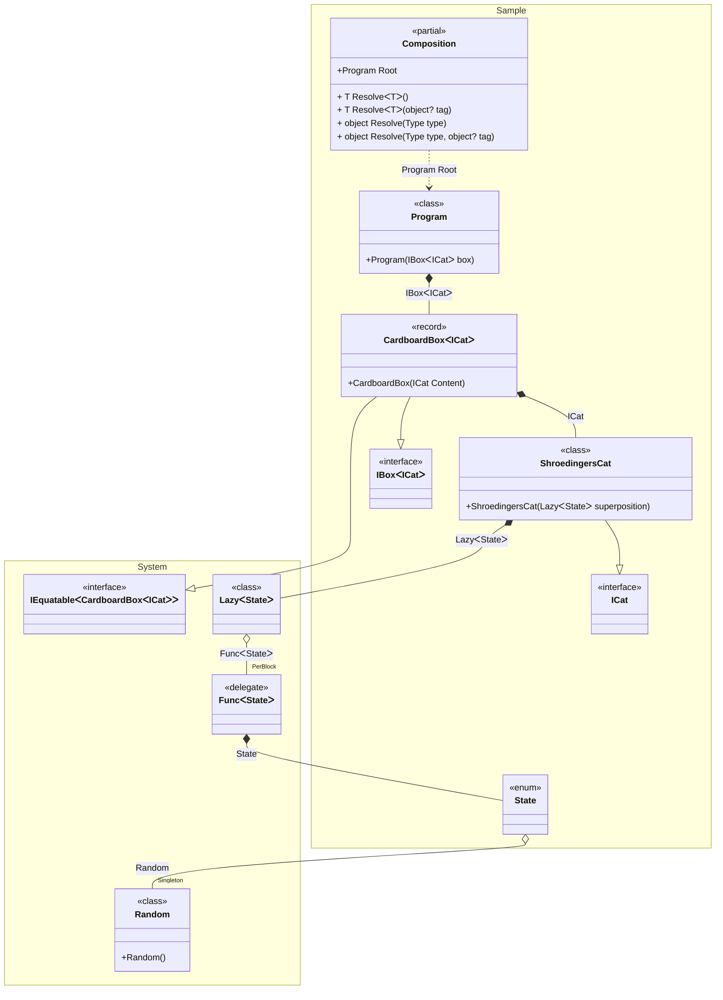
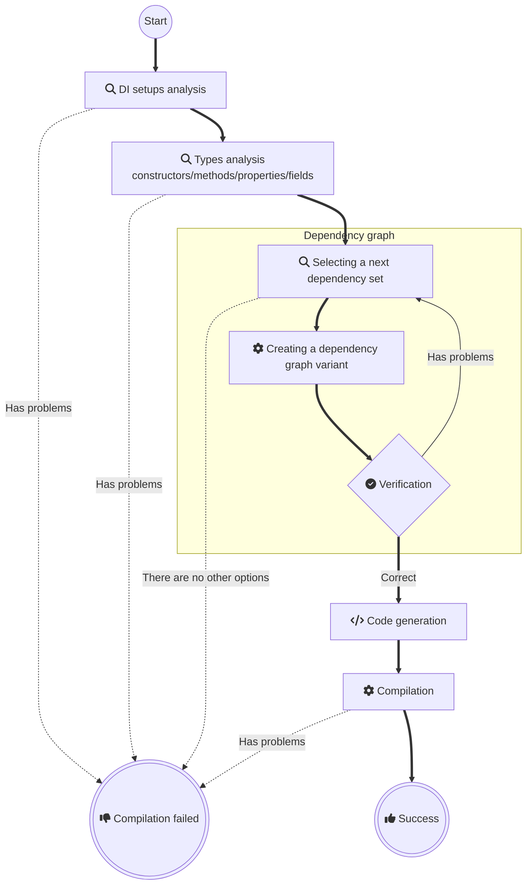

# Pure DI for .NET

<a href="https://t.me/pure_di"></a>
[](https://www.nuget.org/packages/Pure.DI)
[](LICENSE)


**Pure.DI is a compile-time dependency injection (DI) code generator**. _Supports .NET starting with [.NET Framework 2.0](https://www.microsoft.com/en-us/download/details.aspx?id=6041), released 2005-10-27, and all newer versions._

## Usage Requirements

- **[.NET SDK 6.0.4+](https://dotnet.microsoft.com/download/dotnet/6.0)**  
  Required for compilation. Projects can target older frameworks (e.g., .NET Framework 2.0).
- **[C# 8+](https://docs.microsoft.com/en-us/dotnet/csharp/whats-new/csharp-version-history#c-version-80)**  
  Only required for projects using the Pure.DI source generator. Other projects support any C# version.

## Key Features

### ✔️ Zero Overhead
Pure.DI is a .NET code generator designed to produce clean, efficient dependency injection logic. By leveraging basic language constructs, it generates straightforward code indistinguishable from manual implementation—essentially composing objects through nested constructor invocations. Unlike traditional DI frameworks, Pure.DI avoids reflection and dynamic instantiation entirely, eliminating performance penalties associated with runtime overhead.
### ✔️ Compile-Time Validation
All analysis of object, constructor, and method graphs occurs at compile time. Pure.DI proactively detects and alerts developers to issues such as missing dependencies, cyclic references, or dependencies unsuitable for injection—ensuring these errors are resolved before execution. This approach guarantees that developers cannot produce a program vulnerable to runtime crashes caused by faulty dependency wiring. The validation process operates seamlessly alongside code development, creating an immediate feedback loop: as you modify your code, Pure.DI verifies its integrity in real time, effectively delivering tested, production-ready logic the moment changes are implemented.
### ✔️ Works everywhere
The pure dependency injection approach introduces no runtime dependencies and avoids .NET reflection , ensuring consistent execution across all supported platforms. This includes the Full .NET Framework 2.0+, .NET Core, .NET 5+, UWP/Xbox, .NET IoT, Unity, Xamarin, Native AOT, and beyond. By decoupling runtime constraints, it preserves predictable behavior regardless of the target environment.
### ✔️ Familiar Syntax
The Pure.DI API is intentionally designed to closely mirror the APIs of mainstream IoC/DI frameworks. This approach ensures developers can leverage their existing knowledge of dependency injection patterns without requiring significant adaptation to a proprietary syntax.
### ✔️ Precise Generics
Pure.DI recommends utilizing dedicated marker types rather than relying on open generics. This approach enables more precise construction of object graphs while allowing developers to fully leverage the capabilities of generic types.
### ✔️ Transparency
Pure.DI allows to view and debug the generated code, making debugging and testing easier.
### ✔️ Built-in BCL Support
Pure.DI provides native [support](#base-class-library) for numerous [Base Class Library (BCL)](https://docs.microsoft.com/en-us/dotnet/standard/framework-libraries#base-class-libraries) types out of the box without any extra effort.

## When to Use Pure.DI

### ✔️ High-Performance Applications
Pure.DI is designed for high-performance applications where speed and minimal memory consumption are critical.
### ✔️ Projects with a Focus on Clean Code
Pure.DI is suitable for projects where code cleanliness and minimalism are important factors.
### ✔️ Applications with Complex Dependencies
Pure.DI can handle complex dependencies and provides flexible configuration options.
### ✔️ Ideal for Libraries
Its high performance, zero memory consumption/preparation overhead, and lack of dependencies make it ideal for building libraries and frameworks.

## NuGet packages

| NuGet package                                                               | Description                                                         |
|-----------------------------------------------------------------------------|:--------------------------------------------------------------------|
| [Pure.DI](https://www.nuget.org/packages/Pure.DI)                           | DI source code generator                                            |
| [Pure.DI.Abstractions](https://www.nuget.org/packages/Pure.DI.Abstractions) | Abstractions for Pure.DI                                            |
| [Pure.DI.Templates](https://www.nuget.org/packages/Pure.DI.Templates)       | Template package, for creating projects from the shell/command line |
| [Pure.DI.MS](https://www.nuget.org/packages/Pure.DI.MS)                     | Add-ons on Pure.DI to work with Microsoft DI                        |


## Schrödinger's cat will demonstrate how it all works [](samples/ShroedingersCat)

### The reality is


### Let's create an abstraction

```c#
interface IBox<out T>
{
    T Content { get; }
}

interface ICat
{
    State State { get; }
}

enum State { Alive, Dead }
```

### Here's our implementation

```c#
record CardboardBox<T>(T Content): IBox<T>;

class ShroedingersCat(Lazy<State> superposition): ICat
{
    // The decoherence of the superposition
    // at the time of observation via an irreversible process
    public State State => superposition.Value;
}
```

> [!IMPORTANT]
> Our abstraction and implementation knows nothing about the magic of DI or any frameworks.

### Let's glue it all together

Add the Pure.DI package to your project:

[](https://www.nuget.org/packages/Pure.DI)

Let's bind the abstractions to their implementations and set up the creation of the object graph:

```c#
DI.Setup(nameof(Composition))
    // Models a random subatomic event that may or may not occur
    .Bind().As(Singleton).To<Random>()
    // Quantum superposition of two states: Alive or Dead
    .Bind().To((Random random) => (State)random.Next(2))
    .Bind().To<ShroedingersCat>()
    // Cardboard box with any contents
    .Bind().To<CardboardBox<TT>>()
    // Composition Root
    .Root<Program>("Root");
```

> [!NOTE]
> In fact, the `Bind().As(Singleton).To<Random>()` binding is unnecessary since Pure.DI supports many .NET BCL types out of the box, including [Random](https://github.com/DevTeam/Pure.DI/blob/27a1ccd604b2fdd55f6bfec01c24c86428ddfdcb/src/Pure.DI.Core/Features/Default.g.cs#L289). It was added just for the example of using the _Singleton_ lifetime.

The above code specifies the generation of a partial class named *__Composition__*, this name is defined in the `DI.Setup(nameof(Composition))` call. This class contains a *__Root__* property that returns a graph of objects with an object of type *__Program__* as the root. The type and name of the property is defined by calling `Root<Program>("Root")`. The code of the generated class looks as follows:

```c#
partial class Composition
{
    private readonly Lock _lock = new Lock();
    private Random? _random;
    
    public Program Root
    {
      get
      {
        var stateFunc = new Func<State>(() => {
              if (_random is null)
                lock (_lock)
                  if (_random is null)
                    _random = new Random();

              return (State)_random.Next(2)
            });

        return new Program(
          new CardboardBox<ICat>(
            new ShroedingersCat(
              new Lazy<State>(
                stateFunc))));    
      }
    }

    public T Resolve<T>() { ... }
    public T Resolve<T>(object? tag) { ... }

    public object Resolve(Type type) { ... }
    public object Resolve(Type type, object? tag)) { ... }
}
```

<details>
<summary>Class diagram</summary>



You can see the class diagram at any time by following the link in the comment of the generated class:


</details>

Obviously, this code does not depend on other libraries, does not use type reflection or any other tricks that can negatively affect performance and memory consumption. It looks like an efficient code written by hand. At any given time, you can study it and understand how it works.

The `public Program Root { get; }` property here is a [*__Composition Root__*](https://blog.ploeh.dk/2011/07/28/CompositionRoot/), the only place in the application where the composition of the object graph for the application takes place. Each instance is created by only basic language constructs, which compiles with all optimizations with minimal impact on performance and memory consumption. In general, applications may have multiple composition roots and thus such properties. Each composition root must have its own unique name, which is defined when the `Root<T>(string name)` method is called, as shown in the above code.

### Time to open boxes!

```c#
class Program(IBox<ICat> box)
{
  // Composition Root, a single place in an application
  // where the composition of the object graphs
  // for an application take place
  static void Main() => new Composition().Root.Run();

  private void Run() => Console.WriteLine(box);
}
```

Pure.DI creates efficient code in a pure DI paradigm, using only basic language constructs as if you were writing code by hand. This allows you to take full advantage of Dependency Injection everywhere and always, without any compromise!

The full analog of this application with top-level statements can be found [here](samples/ShroedingersCatTopLevelStatements).

<details>
<summary>Just try creating a project from scratch!</summary>

Install the [projects template](https://www.nuget.org/packages/Pure.DI.Templates)

```shell
dotnet new install Pure.DI.Templates
```

In some directory, create a console application

```shell
dotnet new di
```

And run it

```shell
dotnet run
```

</details>


## API


<details><summary>Pure.DI</summary><blockquote>


<details><summary>BindAttribute</summary><blockquote>

Indicates that a property or method can be automatically added as a binding.
            
```c#

internal class DependencyProvider
            {
                [Bind()]
                public Dependency Dep => new Dependency();
            }
            
```


```c#

internal class DependencyProvider
            {
                [Bind(typeof(IDependency<TT>), Lifetime.Singleton)]
                public Dependency GetDep<T>() => new Dependency();
            }
            
```


```c#

internal class DependencyProvider
            {
                [Bind(typeof(IDependency), Lifetime.PerResolve, "some tag")]
                public Dependency GetDep(int id) => new Dependency(id);
            }
            
```


See also _Exposed_.

<details><summary>Constructor BindAttribute(System.Type,Pure.DI.Lifetime,System.Object[])</summary><blockquote>

Creates an attribute instance.
            
</blockquote></details>


</blockquote></details>


<details><summary>Buckets`1</summary><blockquote>

For internal use. 
            
</blockquote></details>


<details><summary>CannotResolveException</summary><blockquote>

Represents an exception thrown when a required composition root cannot be resolved.
            
<details><summary>Constructor CannotResolveException(System.String,System.Type,System.Object)</summary><blockquote>

Initializes a new instance of the _CannotResolveException_ class with a specified error message, type, and optional tag describing the resolution failure.
            
 - parameter _message_ - A user-friendly message that describes the error that occurred during the
            resolution process. The message should be clear and informative, providing
            enough context to understand the nature of the failure.
            

 - parameter _type_ - The _Type_ used to resolve a composition root.
            

 - parameter _tag_ - The tag used to resolve a composition root.
            

</blockquote></details>


<details><summary>Constructor CannotResolveException(System.Runtime.Serialization.SerializationInfo,System.Runtime.Serialization.StreamingContext)</summary><blockquote>

Initializes a new instance of the _CannotResolveException_ class with serialized data.
 - parameter _info_ - The object that holds the serialized object data.

 - parameter _context_ - The contextual information about the source or destination.

</blockquote></details>


<details><summary>Property Type</summary><blockquote>

Gets the type used to resolve a composition root.
            
</blockquote></details>


<details><summary>Property Tag</summary><blockquote>

Gets the tag used to resolve a composition root.
            
</blockquote></details>


</blockquote></details>


<details><summary>CompositionKind</summary><blockquote>

Determines how the partial class will be generated. The _Setup(System.String,Pure.DI.CompositionKind)_ method has an additional argument  `kind` , which defines the type of composition:
            
```c#

DI.Setup("BaseComposition", CompositionKind.Internal);
            
```


See also _Setup(System.String,Pure.DI.CompositionKind)_.

<details><summary>Field Public</summary><blockquote>

This value is used by default. If this value is specified, a normal partial class will be generated.
            
</blockquote></details>


<details><summary>Field Internal</summary><blockquote>

If this value is specified, the class will not be generated, but this setting can be used by other users as a baseline. The API call _DependsOn(System.String[])_ is mandatory.
            
</blockquote></details>


<details><summary>Field Global</summary><blockquote>

No partial classes will be created when this value is specified, but this setting is the baseline for all installations in the current project, and the API call _DependsOn(System.String[])_ is not required.
            
</blockquote></details>


</blockquote></details>


<details><summary>DependencyAttribute</summary><blockquote>

Combines injection tagging and ordering capabilities in a single attribute.
            Allows simultaneous specification of both tag and ordinal for dependency injection points.
            
 - parameter _tag_ - Identifies the specific dependency variation to inject. See also _Tags(System.Object[])_.

 - parameter _ordinal_ - Determines injection order priority (lower values execute first).

See also _OrdinalAttribute_.

See also _TagAttribute_.

<details><summary>Constructor DependencyAttribute(System.Object,System.Int32)</summary><blockquote>

Initializes an attribute instance with optional tag and priority.
            
 - parameter _tag_ - Identifies a specific dependency variation. See also _Tags(System.Object[])_.

 - parameter _ordinal_ - Injection execution priority (0 = highest priority). Default: 0.

</blockquote></details>


</blockquote></details>


<details><summary>DI</summary><blockquote>

An API for a Dependency Injection setup.
            
See also _Setup(System.String,Pure.DI.CompositionKind)_.

<details><summary>Method Setup(System.String,Pure.DI.CompositionKind)</summary><blockquote>

Begins the definitions of the Dependency Injection setup chain.
             
```c#

interface IDependency;
            
             
             class Dependency: IDependency;
            
             
             interface IService;
            
             
             class Service(IDependency dependency): IService;
            
             
             DI.Setup("Composition")
               .Bind<IDependency>().To<Dependency>()
               .Bind<IService>().To<Service>()
               .Root<IService>("Root");
             
```


 - parameter _compositionTypeName_ - An optional argument specifying the partial class name to generate.

 - parameter _kind_ - An optional argument specifying the kind of setup. Please _CompositionKind_ for details. It defaults to  `Public` .

 - returns Reference to the setup continuation chain.

</blockquote></details>


</blockquote></details>


<details><summary>GenericTypeArgumentAttribute</summary><blockquote>

Represents a generic type argument attribute. It allows you to create custom generic type argument such as _TTS_, _TTDictionary`2_, etc.
            
```c#

[GenericTypeArgument]
            internal interface TTMy: IMy { }
            
```


See also _GenericTypeArgumentAttribute``1_.

See also _GenericTypeArgument``1_.

</blockquote></details>


<details><summary>Hint</summary><blockquote>

Provides configuration hints for fine-tuning code generation behavior.
            
```c#

// Resolve = Off
            DI.Setup("Composition")
                .Bind<IDependency>().To<Dependency>();
            
```


            or using the API call _Hint(Pure.DI.Hint,System.String)_:
            
```c#

DI.Setup("Composition")
                .Hint(Hint.Resolve, "Off")
                .Bind<IDependency>().To<Dependency>();
            
```


See also _Hint(Pure.DI.Hint,System.String)_.

<details><summary>Field Resolve</summary><blockquote>

Enables/disables generation of Resolve methods. Default:  `On` .
             
```c#

// Resolve = Off
             DI.Setup("Composition")
                 .Bind<IDependency>().To<Dependency>();
             
```


            
             or using the API call _Hint(Pure.DI.Hint,System.String)_:
             
```c#

DI.Setup("Composition")
                 .Hint(Hint.Resolve, "Off")
                 .Bind<IDependency>().To<Dependency>();
             
```


</blockquote></details>


<details><summary>Field OnNewInstance</summary><blockquote>

Enables/disables generation of OnNewInstance hooks. Default:  `Off` .
             
```c#

// OnNewInstance = On
             DI.Setup("Composition")
                 .Bind<IDependency>().To<Dependency>();
             
```


            
             or using the API call _Hint(Pure.DI.Hint,System.String)_:
             
```c#

DI.Setup("Composition")
                 .Hint(Hint.OnNewInstance, "On")
                 .Bind<IDependency>().To<Dependency>();
             
```


</blockquote></details>


<details><summary>Field OnNewInstancePartial</summary><blockquote>

Enables/disables partial method generation for OnNewInstance. Default:  `On` .
             
```c#

// OnNewInstancePartial = On
             DI.Setup("Composition")
                 .Bind<IDependency>().To<Dependency>();
             
```


            
             or using the API call _Hint(Pure.DI.Hint,System.String)_:
             
```c#

DI.Setup("Composition")
                 .Hint(Hint.OnNewInstancePartial, "On")
                 .Bind<IDependency>().To<Dependency>();
             
```


</blockquote></details>


<details><summary>Field OnNewInstanceImplementationTypeNameRegularExpression</summary><blockquote>

Regex filter for instance types in OnNewInstance hooks. Default:  `.+` .
             
```c#

// OnNewInstanceImplementationTypeNameRegularExpression = Dependency
             DI.Setup("Composition")
                 .Bind<IDependency>().To<Dependency>();
             
```


            
             or using the API call _Hint(Pure.DI.Hint,System.String)_:
             
```c#

DI.Setup("Composition")
                 .Hint(Hint.OnNewInstanceImplementationTypeNameRegularExpression, "Dependency")
                 .Bind<IDependency>().To<Dependency>();
             
```


</blockquote></details>


<details><summary>Field OnNewInstanceImplementationTypeNameWildcard</summary><blockquote>

Wildcard filter for instance types in OnNewInstance hooks. Default:  `*` .
             
```c#

// OnNewInstanceImplementationTypeNameWildcard = *Dependency
             DI.Setup("Composition")
                 .Bind<IDependency>().To<Dependency>();
             
```


            
             or using the API call _Hint(Pure.DI.Hint,System.String)_:
             
```c#

DI.Setup("Composition")
                 .Hint(OnNewInstanceImplementationTypeNameWildcard, "*Dependency")
                 .Bind<IDependency>().To<Dependency>();
             
```


</blockquote></details>


<details><summary>Field OnNewInstanceTagRegularExpression</summary><blockquote>

Regex filter for tags in OnNewInstance hooks. Default:  `.+` .
             
```c#

// OnNewInstanceTagRegularExpression = IDependency
             DI.Setup("Composition")
                 .Bind<IDependency>().To<Dependency>();
             
```


            
             or using the API call _Hint(Pure.DI.Hint,System.String)_:
             
```c#

DI.Setup("Composition")
                 .Hint(Hint.OnNewInstanceTagRegularExpression, "IDependency")
                 .Bind<IDependency>().To<Dependency>();
             
```


</blockquote></details>


<details><summary>Field OnNewInstanceTagWildcard</summary><blockquote>

Wildcard filter for tags in OnNewInstance hooks. Default:  `*` .
             
```c#

// OnNewInstanceTagWildcard = *IDependency
             DI.Setup("Composition")
                 .Bind<IDependency>().To<Dependency>();
             
```


            
             or using the API call _Hint(Pure.DI.Hint,System.String)_:
             
```c#

DI.Setup("Composition")
                 .Hint(Hint.OnNewInstanceTagWildcard, "*IDependency")
                 .Bind<IDependency>().To<Dependency>();
             
```


</blockquote></details>


<details><summary>Field OnNewInstanceLifetimeRegularExpression</summary><blockquote>

Regex filter for lifetimes in OnNewInstance hooks. Default:  `.+` .
             
```c#

// OnNewInstanceLifetimeRegularExpression = Singleton
             DI.Setup("Composition")
                 .Bind<IDependency>().To<Dependency>();
             
```


            
             or using the API call _Hint(Pure.DI.Hint,System.String)_:
             
```c#

DI.Setup("Composition")
                 .Hint(Hint.OnNewInstanceLifetimeRegularExpression, "Singleton")
                 .Bind<IDependency>().To<Dependency>();
             
```


</blockquote></details>


<details><summary>Field OnNewInstanceLifetimeWildcard</summary><blockquote>

Wildcard filter for lifetimes in OnNewInstance hooks. Default:  `*` .
             
```c#

// OnNewInstanceLifetimeWildcard = *Singleton
             DI.Setup("Composition")
                 .Bind<IDependency>().To<Dependency>();
             
```


            
             or using the API call _Hint(Pure.DI.Hint,System.String)_:
             
```c#

DI.Setup("Composition")
                 .Hint(Hint.OnNewInstanceLifetimeWildcard, "*Singleton")
                 .Bind<IDependency>().To<Dependency>();
             
```


</blockquote></details>


<details><summary>Field OnDependencyInjection</summary><blockquote>

Enables/disables dependency injection interception hooks. Default:  `Off` .
             
```c#

// OnDependencyInjection = On
             DI.Setup("Composition")
                 .Bind<IDependency>().To<Dependency>();
             
```


            
             or using the API call _Hint(Pure.DI.Hint,System.String)_:
             
```c#

DI.Setup("Composition")
                 .Hint(Hint.OnDependencyInjection, "On")
                 .Bind<IDependency>().To<Dependency>();
             
```


</blockquote></details>


<details><summary>Field OnDependencyInjectionPartial</summary><blockquote>

Enables/disables partial method generation for dependency injection hooks. Default:  `On` .
             
```c#

// OnDependencyInjectionPartial = On
             DI.Setup("Composition")
                 .Bind<IDependency>().To<Dependency>();
             
```


            
             or using the API call _Hint(Pure.DI.Hint,System.String)_:
             
```c#

DI.Setup("Composition")
                 .Hint(Hint.OnDependencyInjectionPartial, "On")
                 .Bind<IDependency>().To<Dependency>();
             
```


</blockquote></details>


<details><summary>Field OnDependencyInjectionImplementationTypeNameRegularExpression</summary><blockquote>

Regex filter for implementation types in dependency injection hooks. Default:  `.+` .
             
```c#

// OnDependencyInjectionImplementationTypeNameRegularExpression = Dependency
             DI.Setup("Composition")
                 .Bind<IDependency>().To<Dependency>();
             
```


            
             or using the API call _Hint(Pure.DI.Hint,System.String)_:
             
```c#

DI.Setup("Composition")
                 .Hint(Hint.OnDependencyInjectionImplementationTypeNameRegularExpression, "Dependency")
                 .Bind<IDependency>().To<Dependency>();
             
```


</blockquote></details>


<details><summary>Field OnDependencyInjectionImplementationTypeNameWildcard</summary><blockquote>

Wildcard filter for implementation types in dependency injection hooks. Default:  `*` .
             
```c#

// OnDependencyInjectionImplementationTypeNameWildcard = *Dependency
             DI.Setup("Composition")
                 .Bind<IDependency>().To<Dependency>();
             
```


            
             or using the API call _Hint(Pure.DI.Hint,System.String)_:
             
```c#

DI.Setup("Composition")
                 .Hint(Hint.OnDependencyInjectionImplementationTypeNameWildcard, "*Dependency")
                 .Bind<IDependency>().To<Dependency>();
             
```


</blockquote></details>


<details><summary>Field OnDependencyInjectionContractTypeNameRegularExpression</summary><blockquote>

Regex filter for contract types in dependency injection hooks. Default:  `.+` .
             
```c#

// OnDependencyInjectionContractTypeNameRegularExpression = IDependency
             DI.Setup("Composition")
                 .Bind<IDependency>().To<Dependency>();
             
```


            
             or using the API call _Hint(Pure.DI.Hint,System.String)_:
             
```c#

DI.Setup("Composition")
                 .Hint(Hint.OnDependencyInjectionContractTypeNameRegularExpression, "IDependency")
                 .Bind<IDependency>().To<Dependency>();
             
```


</blockquote></details>


<details><summary>Field OnDependencyInjectionContractTypeNameWildcard</summary><blockquote>

Wildcard filter for contract types in dependency injection hooks. Default:  `*` .
             
```c#

// OnDependencyInjectionContractTypeNameWildcard = *IDependency
             DI.Setup("Composition")
                 .Bind<IDependency>().To<Dependency>();
             
```


            
             or using the API call _Hint(Pure.DI.Hint,System.String)_:
             
```c#

DI.Setup("Composition")
                 .Hint(Hint.OnDependencyInjectionContractTypeNameWildcard, "*IDependency")
                 .Bind<IDependency>().To<Dependency>();
             
```


</blockquote></details>


<details><summary>Field OnDependencyInjectionTagRegularExpression</summary><blockquote>

Regex filter for tags in dependency injection hooks. Default:  `.+` .
             
```c#

// OnDependencyInjectionTagRegularExpression = MyTag
             DI.Setup("Composition")
                 .Bind<IDependency>("MyTag").To<Dependency>();
             
```


            
             or using the API call _Hint(Pure.DI.Hint,System.String)_:
             
```c#

DI.Setup("Composition")
                 .Hint(Hint.OnDependencyInjectionTagRegularExpression, "MyTag")
                 .Bind<IDependency>("MyTag").To<Dependency>();
             
```


</blockquote></details>


<details><summary>Field OnDependencyInjectionTagWildcard</summary><blockquote>

Wildcard filter for tags in dependency injection hooks. Default:  `*` .
             
```c#

// OnDependencyInjectionTagWildcard = MyTag
             DI.Setup("Composition")
                 .Bind<IDependency>("MyTag").To<Dependency>();
             
```


            
             or using the API call _Hint(Pure.DI.Hint,System.String)_:
             
```c#

DI.Setup("Composition")
                 .Hint(Hint.OnDependencyInjectionTagWildcard, "MyTag")
                 .Bind<IDependency>("MyTag").To<Dependency>();
             
```


</blockquote></details>


<details><summary>Field OnDependencyInjectionLifetimeRegularExpression</summary><blockquote>

Regex filter for lifetimes in dependency injection hooks. Default:  `.+` .
             
```c#

// OnDependencyInjectionLifetimeRegularExpression = Singleton
             DI.Setup("Composition")
                 .Bind<IDependency>().To<Dependency>();
             
```


            
             or using the API call _Hint(Pure.DI.Hint,System.String)_:
             
```c#

DI.Setup("Composition")
                 .Hint(Hint.OnDependencyInjectionLifetimeRegularExpression, "Singleton")
                 .Bind<IDependency>().To<Dependency>();
             
```


</blockquote></details>


<details><summary>Field OnDependencyInjectionLifetimeWildcard</summary><blockquote>

Wildcard filter for lifetimes in dependency injection hooks. Default:  `*` .
             
```c#

// OnDependencyInjectionLifetimeWildcard = *Singleton
             DI.Setup("Composition")
                 .Bind<IDependency>().To<Dependency>();
             
```


            
             or using the API call _Hint(Pure.DI.Hint,System.String)_:
             
```c#

DI.Setup("Composition")
                 .Hint(Hint.OnDependencyInjectionLifetimeWildcard, "*Singleton")
                 .Bind<IDependency>().To<Dependency>();
             
```


</blockquote></details>


<details><summary>Field OnCannotResolve</summary><blockquote>

Enables/disables unresolved dependency handlers. Default:  `Off` .
             
```c#

// OnCannotResolve = On
             DI.Setup("Composition")
                 .Bind<IDependency>().To<Dependency>();
             
```


            
             or using the API call _Hint(Pure.DI.Hint,System.String)_:
             
```c#

DI.Setup("Composition")
                 .Hint(Hint.OnCannotResolve, "On")
                 .Bind<IDependency>().To<Dependency>();
             
```


</blockquote></details>


<details><summary>Field OnCannotResolvePartial</summary><blockquote>

Enables/disables partial method generation for unresolved dependency handlers. Default:  `On` .
             
```c#

// OnCannotResolvePartial = On
             DI.Setup("Composition")
                 .Bind<IDependency>().To<Dependency>();
             
```


            
             or using the API call _Hint(Pure.DI.Hint,System.String)_:
             
```c#

DI.Setup("Composition")
                 .Hint(Hint.OnCannotResolvePartial, "On")
                 .Bind<IDependency>().To<Dependency>();
             
```


</blockquote></details>


<details><summary>Field OnCannotResolveContractTypeNameRegularExpression</summary><blockquote>

Regex filter for contract types in unresolved dependency handlers. Default:  `.+` .
             
```c#

// OnCannotResolveContractTypeNameRegularExpression = OtherType
             DI.Setup("Composition")
                 .Bind<IDependency>().To<Dependency>();
             
```


            
             or using the API call _Hint(Pure.DI.Hint,System.String)_:
             
```c#

DI.Setup("Composition")
                 .Hint(Hint.OnCannotResolveContractTypeNameRegularExpression, "OtherType")
                 .Bind<IDependency>().To<Dependency>();
             
```


</blockquote></details>


<details><summary>Field OnCannotResolveContractTypeNameWildcard</summary><blockquote>

Wildcard filter for contract types in unresolved dependency handlers. Default:  `*` .
             
```c#

// OnCannotResolveContractTypeNameWildcard = *OtherType
             DI.Setup("Composition")
                 .Bind<IDependency>().To<Dependency>();
             
```


            
             or using the API call _Hint(Pure.DI.Hint,System.String)_:
             
```c#

DI.Setup("Composition")
                 .Hint(Hint.OnCannotResolveContractTypeNameWildcard, "*OtherType")
                 .Bind<IDependency>().To<Dependency>();
             
```


</blockquote></details>


<details><summary>Field OnCannotResolveTagRegularExpression</summary><blockquote>

Regex filter for tags in unresolved dependency handlers. Default:  `.+` .
             
```c#

// OnCannotResolveTagRegularExpression = MyTag
             DI.Setup("Composition")
                 .Bind<IDependency>().To<Dependency>();
             
```


            
             or using the API call _Hint(Pure.DI.Hint,System.String)_:
             
```c#

DI.Setup("Composition")
                 .Hint(Hint.OnCannotResolveTagRegularExpression, "MyTag")
                 .Bind<IDependency>().To<Dependency>();
             
```


</blockquote></details>


<details><summary>Field OnCannotResolveTagWildcard</summary><blockquote>

Wildcard filter for tags in unresolved dependency handlers. Default:  `*` .
             
```c#

// OnCannotResolveTagWildcard = MyTag
             DI.Setup("Composition")
                 .Bind<IDependency>().To<Dependency>();
             
```


            
             or using the API call _Hint(Pure.DI.Hint,System.String)_:
             
```c#

DI.Setup("Composition")
                 .Hint(Hint.OnCannotResolveTagWildcard, "MyTag")
                 .Bind<IDependency>().To<Dependency>();
             
```


</blockquote></details>


<details><summary>Field OnCannotResolveLifetimeRegularExpression</summary><blockquote>

Regex filter for lifetimes in unresolved dependency handlers. Default:  `.+` .
             
```c#

// OnCannotResolveLifetimeRegularExpression = Singleton
             DI.Setup("Composition")
                 .Bind<IDependency>().To<Dependency>();
             
```


            
             or using the API call _Hint(Pure.DI.Hint,System.String)_:
             
```c#

DI.Setup("Composition")
                 .Hint(Hint.OnCannotResolveLifetimeRegularExpression, "Singleton")
                 .Bind<IDependency>().To<Dependency>();
             
```


</blockquote></details>


<details><summary>Field OnCannotResolveLifetimeWildcard</summary><blockquote>

Wildcard filter for lifetimes in unresolved dependency handlers. Default:  `*` .
             
```c#

// OnCannotResolveLifetimeWildcard = *Singleton
             DI.Setup("Composition")
                 .Bind<IDependency>().To<Dependency>();
             
```


            
             or using the API call _Hint(Pure.DI.Hint,System.String)_:
             
```c#

DI.Setup("Composition")
                 .Hint(Hint.OnCannotResolveLifetimeWildcard, "*Singleton")
                 .Bind<IDependency>().To<Dependency>();
             
```


</blockquote></details>


<details><summary>Field OnNewRoot</summary><blockquote>

Enables/disables composition root registration event handlers. Default:  `Off` .
             
```c#

// OnNewRoot = On
             DI.Setup("Composition")
                 .Bind<IDependency>().To<Dependency>();
             
```


            
             or using the API call _Hint(Pure.DI.Hint,System.String)_:
             
```c#

DI.Setup("Composition")
                 .Hint(Hint.OnNewRoot, "On")
                 .Bind<IDependency>().To<Dependency>();
             
```


</blockquote></details>


<details><summary>Field OnNewRootPartial</summary><blockquote>

Enables/disables partial method generation for composition root events. Default:  `Off` .
             
```c#

// OnNewRootPartial = On
             DI.Setup("Composition")
                 .Bind<IDependency>().To<Dependency>();
             
```


            
             or using the API call _Hint(Pure.DI.Hint,System.String)_:
             
```c#

DI.Setup("Composition")
                 .Hint(Hint.OnNewRootPartial, "On")
                 .Bind<IDependency>().To<Dependency>();
             
```


</blockquote></details>


<details><summary>Field ToString</summary><blockquote>

Enables/disables generation of mermaid-format class diagram via ToString(). Default:  `Off` .
             
```c#

// ToString = On
             DI.Setup("Composition")
                 .Bind<IDependency>().To<Dependency>();
             
```


            
             or using the API call _Hint(Pure.DI.Hint,System.String)_:
             
```c#

DI.Setup("Composition")
                 .Hint(Hint.ToString, "On")
                 .Bind<IDependency>().To<Dependency>();
             
```


</blockquote></details>


<details><summary>Field ThreadSafe</summary><blockquote>

Enables/disables thread-safe composition object creation. Default:  `On` .
             
```c#

// ThreadSafe = Off
             DI.Setup("Composition")
                 .Bind<IDependency>().To<Dependency>();
             
```


            
             or using the API call _Hint(Pure.DI.Hint,System.String)_:
             
```c#

DI.Setup("Composition")
                 .Hint(Hint.ThreadSafe, "Off")
                 .Bind<IDependency>().To<Dependency>();
             
```


</blockquote></details>


<details><summary>Field ResolveMethodModifiers</summary><blockquote>

Modifier override for Resolve<T>() method. Default:  `public` .
             
```c#

// ResolveMethodModifiers = internal
             DI.Setup("Composition")
                 .Bind<IDependency>().To<Dependency>();
             
```


            
             or using the API call _Hint(Pure.DI.Hint,System.String)_:
             
```c#

DI.Setup("Composition")
                 .Hint(Hint.ResolveMethodModifiers, "internal")
                 .Bind<IDependency>().To<Dependency>();
             
```


</blockquote></details>


<details><summary>Field ResolveMethodName</summary><blockquote>

Name override for Resolve<T>() method. Default:  `Resolve` .
             
```c#

// ResolveMethodName = GetService
             DI.Setup("Composition")
                 .Bind<IDependency>().To<Dependency>();
             
```


            
             or using the API call _Hint(Pure.DI.Hint,System.String)_:
             
```c#

DI.Setup("Composition")
                 .Hint(Hint.ResolveMethodName, "GetService")
                 .Bind<IDependency>().To<Dependency>();
             
```


</blockquote></details>


<details><summary>Field ResolveByTagMethodModifiers</summary><blockquote>

Modifier override for Resolve<T>(tag) method. Default:  `public` .
             
```c#

// ResolveByTagMethodModifiers = internal
             DI.Setup("Composition")
                 .Bind<IDependency>().To<Dependency>();
             
```


            
             or using the API call _Hint(Pure.DI.Hint,System.String)_:
             
```c#

DI.Setup("Composition")
                 .Hint(Hint.ResolveByTagMethodModifiers, "internal")
                 .Bind<IDependency>().To<Dependency>();
             
```


</blockquote></details>


<details><summary>Field ResolveByTagMethodName</summary><blockquote>

Name override for Resolve<T>(tag) method. Default:  `Resolve` .
             For example
             
```c#

// ResolveByTagMethodName = GetService
             DI.Setup("Composition")
                 .Bind<IDependency>().To<Dependency>();
             
```


            
             or using the API call _Hint(Pure.DI.Hint,System.String)_:
             
```c#

DI.Setup("Composition")
                 .Hint(Hint.ResolveByTagMethodName, "GetService")
                 .Bind<IDependency>().To<Dependency>();
             
```


</blockquote></details>


<details><summary>Field ObjectResolveMethodModifiers</summary><blockquote>

Modifier override for Resolve(Type) method. Default:  `public` .
             
```c#

// ObjectResolveMethodModifiers = internal
             DI.Setup("Composition")
                 .Bind<IDependency>().To<Dependency>();
             
```


            
             or using the API call _Hint(Pure.DI.Hint,System.String)_:
             
```c#

DI.Setup("Composition")
                 .Hint(Hint.ObjectResolveMethodModifiers, "internal")
                 .Bind<IDependency>().To<Dependency>();
             
```


</blockquote></details>


<details><summary>Field ObjectResolveMethodName</summary><blockquote>

Name override for Resolve(Type) method. Default:  `Resolve` .
             
```c#

// ObjectResolveMethodName = GetService
             DI.Setup("Composition")
                 .Bind<IDependency>().To<Dependency>();
             
```


            
             or using the API call _Hint(Pure.DI.Hint,System.String)_:
             
```c#

DI.Setup("Composition")
                 .Hint(Hint.ObjectResolveMethodName, "GetService")
                 .Bind<IDependency>().To<Dependency>();
             
```


</blockquote></details>


<details><summary>Field ObjectResolveByTagMethodModifiers</summary><blockquote>

Modifier override for Resolve(Type, tag) method. Default:  `public` .
             
```c#

// ObjectResolveByTagMethodModifiers = internal
             DI.Setup("Composition")
                 .Bind<IDependency>().To<Dependency>();
             
```


            
             or using the API call _Hint(Pure.DI.Hint,System.String)_:
             
```c#

DI.Setup("Composition")
                 .Hint(Hint.ObjectResolveByTagMethodModifiers, "internal")
                 .Bind<IDependency>().To<Dependency>();
             
```


</blockquote></details>


<details><summary>Field ObjectResolveByTagMethodName</summary><blockquote>

Name override for Resolve(Type, tag) method. Default:  `Resolve` .
             
```c#

// ObjectResolveByTagMethodName = GetService
             DI.Setup("Composition")
                 .Bind<IDependency>().To<Dependency>();
             
```


            
             or using the API call _Hint(Pure.DI.Hint,System.String)_:
             
```c#

DI.Setup("Composition")
                 .Hint(Hint.ObjectResolveByTagMethodName, "GetService")
                 .Bind<IDependency>().To<Dependency>();
             
```


</blockquote></details>


<details><summary>Field DisposeMethodModifiers</summary><blockquote>

Modifier override for Dispose() method. Default:  `public` .
             
```c#

// DisposeMethodModifiers = internal
             DI.Setup("Composition")
                 .Bind<IDependency>().To<Dependency>();
             
```


            
             or using the API call _Hint(Pure.DI.Hint,System.String)_:
             
```c#

DI.Setup("Composition")
                 .Hint(Hint.DisposeMethodModifiers, "internal")
                 .Bind<IDependency>().To<Dependency>();
             
```


</blockquote></details>


<details><summary>Field DisposeAsyncMethodModifiers</summary><blockquote>

Modifier override for DisposeAsync() method. Default:  `public` .
             
```c#

// DisposeAsyncMethodModifiers = internal
             DI.Setup("Composition")
                 .Bind<IDependency>().To<Dependency>();
             
```


            
             or using the API call _Hint(Pure.DI.Hint,System.String)_:
             
```c#

DI.Setup("Composition")
                 .Hint(Hint.DisposeAsyncMethodModifiers, "internal")
                 .Bind<IDependency>().To<Dependency>();
             
```


</blockquote></details>


<details><summary>Field FormatCode</summary><blockquote>

Enables/disables code formatting (CPU intensive). Default:  `Off` .
             
```c#

// FormatCode = On
             DI.Setup("Composition")
                 .Bind<IDependency>().To<Dependency>();
             
```


            
             or using the API call _Hint(Pure.DI.Hint,System.String)_:
             
```c#

DI.Setup("Composition")
                 .Hint(Hint.FormatCode, "On")
                 .Bind<IDependency>().To<Dependency>();
             
```


</blockquote></details>


<details><summary>Field SeverityOfNotImplementedContract</summary><blockquote>

Severity level for unimplemented contract errors. Default:  `Error` .
             
```c#

// SeverityOfNotImplementedContract = Warning
             DI.Setup("Composition")
                 .Bind<IDependency>().To<Dependency>();
             
```


            
             or using the API call _Hint(Pure.DI.Hint,System.String)_:
             
```c#

DI.Setup("Composition")
                 .Hint(Hint.SeverityOfNotImplementedContract, "Warning")
                 .Bind<IDependency>().To<Dependency>();
             
```


</blockquote></details>


<details><summary>Field Comments</summary><blockquote>

Enables/disables generated code comments. Default:  `On` .
             
```c#

// Comments = Off
             DI.Setup("Composition")
                 .Bind<IDependency>().To<Dependency>();
             
```


            
             or using the API call _Hint(Pure.DI.Hint,System.String)_:
             
```c#

DI.Setup("Composition")
                 .Hint(Hint.Comments, "Off")
                 .Bind<IDependency>().To<Dependency>();
             
```


</blockquote></details>


<details><summary>Field SkipDefaultConstructor</summary><blockquote>

Enables/disables skipping the default constructor. Default:  `Off`  (meaning the default constructor is used when available).
             
```c#

// SkipDefaultConstructor = On
             DI.Setup("Composition")
                 .Bind<IDependency>().To<Dependency>();
             
```


            
             or using the API call _Hint(Pure.DI.Hint,System.String)_:
             
```c#

DI.Setup("Composition")
                 .Hint(Hint.UseDefaultConstructor, "Off")
                 .Bind<IDependency>().To<Dependency>();
             
```


</blockquote></details>


<details><summary>Field SkipDefaultConstructorImplementationTypeNameRegularExpression</summary><blockquote>

Regex filter for types to skip default constructors. Default:  `.+` .
             
```c#

// SkipDefaultConstructorImplementationTypeNameRegularExpression = Dependency
             DI.Setup("Composition")
                 .Bind<IDependency>().To<Dependency>();
             
```


            
             or using the API call _Hint(Pure.DI.Hint,System.String)_:
             
```c#

DI.Setup("Composition")
                 .Hint(Hint.SkipDefaultConstructorImplementationTypeNameRegularExpression, "Dependency")
                 .Bind<IDependency>().To<Dependency>();
             
```


</blockquote></details>


<details><summary>Field SkipDefaultConstructorImplementationTypeNameWildcard</summary><blockquote>

Wildcard filter for types to skip default constructors. Default:  `*` .
             
```c#

// SkipDefaultConstructorImplementationTypeNameWildcard = *Dependency
             DI.Setup("Composition")
                 .Bind<IDependency>().To<Dependency>();
             
```


            
             or using the API call _Hint(Pure.DI.Hint,System.String)_:
             
```c#

DI.Setup("Composition")
                 .Hint(Hint.SkipDefaultConstructorImplementationTypeNameWildcard, "*Dependency")
                 .Bind<IDependency>().To<Dependency>();
             
```


</blockquote></details>


<details><summary>Field SkipDefaultConstructorLifetimeRegularExpression</summary><blockquote>

Regex filter for lifetimes to skip default constructors. Default:  `.+` .
             
```c#

// SkipDefaultConstructorLifetimeRegularExpression = Singleton
             DI.Setup("Composition")
                 .Bind<IDependency>().To<Dependency>();
             
```


            
             or using the API call _Hint(Pure.DI.Hint,System.String)_:
             
```c#

DI.Setup("Composition")
                 .Hint(Hint.SkipDefaultConstructorLifetimeRegularExpression, "Singleton")
                 .Bind<IDependency>().To<Dependency>();
             
```


</blockquote></details>


<details><summary>Field SkipDefaultConstructorLifetimeWildcard</summary><blockquote>

Wildcard filter for lifetimes to skip default constructors. Default:  `*` .
             
```c#

// SkipDefaultConstructorLifetimeWildcard = *Singleton
             DI.Setup("Composition")
                 .Bind<IDependency>().To<Dependency>();
             
```


            
             or using the API call _Hint(Pure.DI.Hint,System.String)_:
             
```c#

DI.Setup("Composition")
                 .Hint(Hint.SkipDefaultConstructorLifetimeWildcard, "*Singleton")
                 .Bind<IDependency>().To<Dependency>();
             
```


</blockquote></details>


<details><summary>Field DisableAutoBinding</summary><blockquote>

Disables automatic binding when no explicit binding exists. Default:  `Off` .
             
```c#

// DisableAutoBinding = On
             DI.Setup("Composition")
                 .Bind<IDependency>().To<Dependency>();
             
```


            
             or using the API call _Hint(Pure.DI.Hint,System.String)_:
             
```c#

DI.Setup("Composition")
                 .Hint(Hint.DisableAutoBinding, "Off")
                 .Bind<IDependency>().To<Dependency>();
             
```


</blockquote></details>


<details><summary>Field DisableAutoBindingImplementationTypeNameRegularExpression</summary><blockquote>

Regex filter for implementation types to disable auto-binding. Default:  `.+` .
             
```c#

// DisableAutoBindingImplementationTypeNameRegularExpression = Dependency
             DI.Setup("Composition")
                 .Hint(Hint.DisableAutoBinding, "Off")
                 .Bind<IDependency>().To<Dependency>();
             
```


            
             or using the API call _Hint(Pure.DI.Hint,System.String)_:
             
```c#

DI.Setup("Composition")
                 .Hint(Hint.DisableAutoBinding, "Off")
                 .Hint(Hint.DisableAutoBindingImplementationTypeNameRegularExpression, "Dependency")
                 .Bind<IDependency>().To<Dependency>();
             
```


</blockquote></details>


<details><summary>Field DisableAutoBindingImplementationTypeNameWildcard</summary><blockquote>

Wildcard filter for implementation types to disable auto-binding. Default:  `*` .
             
```c#

// DisableAutoBindingImplementationTypeNameWildcard = *Dependency
             DI.Setup("Composition")
                 .Hint(Hint.DisableAutoBinding, "Off")
                 .Bind<IDependency>().To<Dependency>();
             
```


            
             or using the API call _Hint(Pure.DI.Hint,System.String)_:
             
```c#

DI.Setup("Composition")
                 .Hint(Hint.DisableAutoBinding, "Off")
                 .Hint(Hint.DisableAutoBindingImplementationTypeNameWildcard, "*Dependency")
                 .Bind<IDependency>().To<Dependency>();
             
```


</blockquote></details>


<details><summary>Field DisableAutoBindingLifetimeRegularExpression</summary><blockquote>

Regex filter for lifetimes to disable auto-binding. Default:  `.+` .
             
```c#

// DisableAutoBindingLifetimeRegularExpression = Singleton
             DI.Setup("Composition")
                 .Hint(Hint.DisableAutoBinding, "Off")
                 .Bind<IDependency>().To<Dependency>();
             
```


            
             or using the API call _Hint(Pure.DI.Hint,System.String)_:
             
```c#

DI.Setup("Composition")
                 .Hint(Hint.DisableAutoBinding, "Off")
                 .Hint(Hint.DisableAutoBindingLifetimeRegularExpression, "Singleton")
                 .Bind<IDependency>().To<Dependency>();
             
```


</blockquote></details>


<details><summary>Field DisableAutoBindingLifetimeWildcard</summary><blockquote>

Wildcard filter for lifetimes to disable auto-binding. Default:  `*` .
             
```c#

// DisableAutoBindingLifetimeWildcard = *Singleton
             DI.Setup("Composition")
                 .Hint(Hint.DisableAutoBinding, "Off")
                 .Bind<IDependency>().To<Dependency>();
             
```


            
             or using the API call _Hint(Pure.DI.Hint,System.String)_:
             
```c#

DI.Setup("Composition")
                 .Hint(Hint.DisableAutoBinding, "Off")
                 .Hint(Hint.DisableAutoBindingLifetimeWildcard, "*Singleton")
                 .Bind<IDependency>().To<Dependency>();
             
```


</blockquote></details>


</blockquote></details>


<details><summary>IBinding</summary><blockquote>

Defines the API for configuring dependency bindings in the composition.
            
<details><summary>Method Bind(System.Object[])</summary><blockquote>

Starts binding definition for the implementation type itself. Also binds all directly implemented abstract types excluding special system interfaces.
            Special system interfaces are excluded from binding:
            System.ObjectSystem.EnumSystem.MulticastDelegateSystem.DelegateSystem.Collections.IEnumerableSystem.Collections.Generic.IEnumerable<T>System.Collections.Generic.Iist<T>System.Collections.Generic.ICollection<T>System.Collections.IEnumeratorSystem.Collections.Generic.IEnumerator<T>System.Collections.Generic.IIReadOnlyList<T>System.Collections.Generic.IReadOnlyCollection<T>System.IDisposableSystem.IAsyncResultSystem.AsyncCallback
```c#

DI.Setup("Composition")
                .Bind().To<Service>();
            
```


 - parameter _tags_ - Optional tags to associate with this binding.

 - returns Binding configuration interface for method chaining.

See also _To``1_.

See also _To``1(System.Func{Pure.DI.IContext,``0})_.

See also _!:To<T1,T>()_.

See also _!:To<T1,T2,T>()_.

See also _Tags(System.Object[])_.

See also _As(Pure.DI.Lifetime)_.

</blockquote></details>


<details><summary>Method Bind``1(System.Object[])</summary><blockquote>

Starts binding definition for a specific dependency type.
            
```c#

DI.Setup("Composition")
                .Bind<IDependency>().To<Dependency>();
            
```

Dependency type to bind. Supports type markers like _TT_ and _TTList`1_.
 - parameter _tags_ - Optional tags to associate with this binding.

 - returns Binding configuration interface for method chaining.

See also _To``1_.

See also _To``1(System.Func{Pure.DI.IContext,``0})_.

See also _!:To<T1,T>()_.

See also _!:To<T1,T2,T>()_.

See also _Tags(System.Object[])_.

See also _As(Pure.DI.Lifetime)_.

</blockquote></details>


<details><summary>Method Bind``2(System.Object[])</summary><blockquote>

Starts binding definition for multiple dependency types simultaneously.
            See _Bind``1(System.Object[])_ for detailed usage.
            First dependency type to bind.Second dependency type to bind.
 - parameter _tags_ - Optional tags to associate with these bindings.

 - returns Binding configuration interface for method chaining.

See also _To``1_.

See also _To``1(System.Func{Pure.DI.IContext,``0})_.

See also _!:To<T1,T>()_.

See also _!:To<T1,T2,T>()_.

See also _Tags(System.Object[])_.

See also _As(Pure.DI.Lifetime)_.

</blockquote></details>


<details><summary>Method Bind``3(System.Object[])</summary><blockquote>

Starts binding definition for multiple dependency types simultaneously.
            See _Bind``1(System.Object[])_ for detailed usage.
            First dependency type to bind.Second dependency type to bind.Third dependency type to bind.
 - parameter _tags_ - Optional tags to associate with these bindings.

 - returns Binding configuration interface for method chaining.

See also _To``1_.

See also _To``1(System.Func{Pure.DI.IContext,``0})_.

See also _!:To<T1,T>()_.

See also _!:To<T1,T2,T>()_.

See also _Tags(System.Object[])_.

See also _As(Pure.DI.Lifetime)_.

</blockquote></details>


<details><summary>Method Bind``4(System.Object[])</summary><blockquote>

Starts binding definition for multiple dependency types simultaneously.
            See _Bind``1(System.Object[])_ for detailed usage.
            First dependency type to bind.Second dependency type to bind.Third dependency type to bind.Fourth dependency type to bind.
 - parameter _tags_ - Optional tags to associate with these bindings.

 - returns Binding configuration interface for method chaining.

See also _To``1_.

See also _To``1(System.Func{Pure.DI.IContext,``0})_.

See also _!:To<T1,T>()_.

See also _!:To<T1,T2,T>()_.

See also _Tags(System.Object[])_.

See also _As(Pure.DI.Lifetime)_.

</blockquote></details>


<details><summary>Method As(Pure.DI.Lifetime)</summary><blockquote>

Specifies the lifetime scope for the binding.
            
```c#

DI.Setup("Composition")
                .Bind<IDependency>().As(Lifetime.Singleton).To<Dependency>();
            
```


 - parameter _lifetime_ - Lifetime scope for the binding.

 - returns Binding configuration interface for method chaining.

See also _Bind``1(System.Object[])_.

See also _To``1_.

See also _To``1(System.Func{Pure.DI.IContext,``0})_.

See also _!:To<T1,T>()_.

See also _!:To<T1,T2,T>()_.

See also _Tags(System.Object[])_.

</blockquote></details>


<details><summary>Method Tags(System.Object[])</summary><blockquote>

Specifies binding tags to differentiate between multiple implementations of the same interface.
             
```c#

interface IDependency { }
            
             class AbcDependency: IDependency { }
            
             class XyzDependency: IDependency { }
            
             class Dependency: IDependency { }
            
             interface IService
             {
                 IDependency Dependency1 { get; }
                 IDependency Dependency2 { get; }
             }
            
             class Service: IService
             {
                 public Service(
                     [Tag("Abc")] IDependency dependency1,
                     [Tag("Xyz")] IDependency dependency2)
                 {
                     Dependency1 = dependency1;
                     Dependency2 = dependency2;
                 }
            
                 public IDependency Dependency1 { get; }
                 public IDependency Dependency2 { get; }
             }
            
             DI.Setup("Composition")
                 .Bind<IDependency>().Tags("Abc").To<AbcDependency>()
                 .Bind<IDependency>().Tags("Xyz").To<XyzDependency>()
                 .Bind<IService>().To<Service>().Root<IService>("Root");
             
```


 - parameter _tags_ - Tags to associate with this binding.

 - returns Binding configuration interface for method chaining.

See also _Bind``1(System.Object[])_.

See also _To``1_.

See also _To``1(System.Func{Pure.DI.IContext,``0})_.

See also _!:To<T1,T>()_.

See also _!:To<T1,T2,T>()_.

See also _As(Pure.DI.Lifetime)_.

</blockquote></details>


<details><summary>Method To``1</summary><blockquote>

Specifies the implementation type for the binding.
            
```c#

DI.Setup("Composition")
                .Bind<IDependency>().To<Dependency>();
            
```

Implementation type. Supports generic type markers.
 - returns Configuration interface for method chaining.

See also _Bind``1(System.Object[])_.

See also _To``1(System.Func{Pure.DI.IContext,``0})_.

See also _!:To<T1,T>()_.

See also _!:To<T1,T2,T>()_.

See also _Tags(System.Object[])_.

See also _As(Pure.DI.Lifetime)_.

</blockquote></details>


<details><summary>Method To``1(System.Func{Pure.DI.IContext,``0})</summary><blockquote>

Specifies a factory method to create the implementation instance.
             
```c#

DI.Setup("Composition")
                 .Bind<IService>()
                 To(_ =>
                 {
                     var service = new Service("My Service");
                     service.Initialize();
                     return service;
                 })
            
             // Another example:
             DI.Setup("Composition")
                 .Bind<IService>()
                 To(ctx =>
                 {
                     ctx.Inject<IDependency>(out var dependency);
                     return new Service(dependency);
                 })
            
             // And another example:
             DI.Setup("Composition")
                 .Bind<IService>()
                 To(ctx =>
                 {
                     // Builds up an instance with all necessary dependencies
                     ctx.Inject<Service>(out var service);
                     service.Initialize();
                     return service;
                 })
             
```


 - parameter _factory_ - Factory method to create and initialize the instance.
Implementation type.
 - returns Configuration interface for method chaining.

See also _Bind``1(System.Object[])_.

See also _To``1_.

See also _!:To<T1,T>()_.

See also _!:To<T1,T2,T>()_.

See also _Tags(System.Object[])_.

See also _As(Pure.DI.Lifetime)_.
This method is useful for creating and initializing an instance manually.
             At the compilation stage, the set of dependencies that the object to be created needs is determined.
             In most cases, this happens automatically, according to the set of constructors and their arguments, and does not require additional customization efforts.
             But sometimes it is necessary to manually create and/or initialize an object.
             There are scenarios where manual control over the creation process is required, such as
             when additional initialization logic is neededwhen complex construction steps are requiredwhen specific object states need to be set during creation
</blockquote></details>


<details><summary>Method To``1(System.String)</summary><blockquote>

Specifies a source code statement to create the implementation.
            
```c#

DI.Setup("Composition")
                .Bind<int>().To<int>("dependencyId")
                .Bind<Func<int, IDependency>>()
                    .To<Func<int, IDependency>>(ctx =>
                        dependencyId =>
                        {
                            ctx.Inject<Dependency>(out var dependency);
                            return dependency;
                        });
            
```


 - parameter _sourceCodeStatement_ - Source code expression to create the instance.
Implementation type.
 - returns Configuration interface for method chaining.

See also _Bind``1(System.Object[])_.

</blockquote></details>


<details><summary>Method To``2(System.Func{``0,``1})</summary><blockquote>

Specifies a simplified factory method with dependency parameters.
             
```c#

DI.Setup(nameof(Composition))
                 .Bind<IDependency>().To((
                     Dependency dependency) =>
                 {
                     dependency.Initialize();
                     return dependency;
                 });
            
             // Variant using TagAttribute:
             DI.Setup(nameof(Composition))
                 .Bind<IDependency>().To((
                     [Tag("some tag")] Dependency dependency) =>
                 {
                     dependency.Initialize();
                     return dependency;
                 });
             
```


 - parameter _factory_ - Factory method with injected dependencies.
Type of the first dependency parameter.Implementation type.
 - returns Configuration interface for method chaining.

See also _Bind``1(System.Object[])_.

See also _To``1(System.Func{Pure.DI.IContext,``0})_.

See also _To``1_.

See also _Tags(System.Object[])_.

See also _As(Pure.DI.Lifetime)_.

</blockquote></details>


<details><summary>Method To``3(System.Func{``0,``1,``2})</summary><blockquote>

Specifies a simplified factory method with multiple dependency parameters.
             
```c#

DI.Setup(nameof(Composition))
                 .Bind<IDependency>().To((
                     Dependency dependency,
                     DateTimeOffset time) =>
                 {
                     dependency.Initialize(time);
                     return dependency;
                 });
            
             // Variant using TagAttribute:
             DI.Setup(nameof(Composition))
                 .Bind("now datetime").To(_ => DateTimeOffset.Now)
                 .Bind<IDependency>().To((
                     Dependency dependency,
                     [Tag("now datetime")] DateTimeOffset time) =>
                 {
                     dependency.Initialize(time);
                     return dependency;
                 });
             
```


 - parameter _factory_ - Factory method with injected dependencies.
Type of the first dependency parameter.Type of second dependency parameter.Implementation type.
 - returns Configuration interface for method chaining.

See also _Bind``1(System.Object[])_.

See also _To``1(System.Func{Pure.DI.IContext,``0})_.

See also _To``1_.

See also _Tags(System.Object[])_.

See also _As(Pure.DI.Lifetime)_.

</blockquote></details>


<details><summary>Method To``4(System.Func{``0,``1,``2,``3})</summary><blockquote>

Specifies a simplified factory method with multiple dependency parameters.
            
 - parameter _factory_ - Factory method with injected dependencies.
Type of the first dependency parameter.Type of the second dependency parameter.Type of the third dependency parameter.Implementation type.
 - returns Configuration interface for method chaining.

See also _Bind``1(System.Object[])_.

See also _To``1(System.Func{Pure.DI.IContext,``0})_.

See also _To``1_.

See also _Tags(System.Object[])_.

See also _As(Pure.DI.Lifetime)_.

</blockquote></details>


</blockquote></details>


<details><summary>IConfiguration</summary><blockquote>

Defines an API for configuring Dependency Injection bindings.
            
See also _Setup(System.String,Pure.DI.CompositionKind)_.

<details><summary>Method Bind(System.Object[])</summary><blockquote>

Starts binding definition for the implementation type itself. Also binds all directly implemented abstract types excluding special system interfaces.
            Special system interfaces are excluded from binding:
            System.ObjectSystem.EnumSystem.MulticastDelegateSystem.DelegateSystem.Collections.IEnumerableSystem.Collections.Generic.IEnumerable<T>System.Collections.Generic.IList<T>System.Collections.Generic.ICollection<T>System.Collections.IEnumeratorSystem.Collections.Generic.IEnumerator<T>System.Collections.Generic.IIReadOnlyList<T>System.Collections.Generic.IReadOnlyCollection<T>System.IDisposableSystem.IAsyncResultSystem.AsyncCallback
```c#

DI.Setup("Composition")
                .Bind().To<Service>();
            
```


 - parameter _tags_ - Optional tags to associate with the binding.

 - returns Binding configuration interface for method chaining.

See also _To``1_.

See also _To``1(System.Func{Pure.DI.IContext,``0})_.

See also _To<T1,T>()_.

See also _To<T1,T2,T>()_.

See also _Tags(System.Object[])_.

See also _As(Pure.DI.Lifetime)_.

</blockquote></details>


<details><summary>Method Bind``1(System.Object[])</summary><blockquote>

Starts binding definition for a specific dependency type.
            
```c#

DI.Setup("Composition")
                .Bind<IService>().To<Service>();
            
```

Dependency type to bind.
 - parameter _tags_ - Optional tags to associate with the binding.

 - returns Binding configuration interface for method chaining.

See also _To``1_.

See also _To``1(System.Func{Pure.DI.IContext,``0})_.

See also _To<T1,T>()_.

See also _To<T1,T2,T>()_.

See also _Tags(System.Object[])_.

See also _As(Pure.DI.Lifetime)_.

</blockquote></details>


<details><summary>Method Bind``2(System.Object[])</summary><blockquote>

Starts binding definition for multiple dependency types simultaneously.
             See _Bind``1(System.Object[])_ for detailed usage.
             First dependency type to bind.Second dependency type to bind.
 - parameter _tags_ - Optional tags to associate with the binding.

 - returns Binding configuration interface for method chaining.

See also _To``1_.

See also _To``1(System.Func{Pure.DI.IContext,``0})_.

See also _To<T1,T>()_.

See also _To<T1,T2,T>()_.

See also _Tags(System.Object[])_.

            seealso cref="IBinding.As"/>
        
</blockquote></details>


<details><summary>Method Bind``3(System.Object[])</summary><blockquote>

Starts binding definition for multiple dependency types simultaneously.
            See _Bind``1(System.Object[])_ for detailed usage.
            First dependency type to bind.Second dependency type to bind.Third dependency type to bind.
 - parameter _tags_ - Optional tags to associate with the binding.

 - returns Binding configuration interface for method chaining.

See also _To``1_.

See also _To``1(System.Func{Pure.DI.IContext,``0})_.

See also _To<T1,T>()_.

See also _To<T1,T2,T>()_.

See also _Tags(System.Object[])_.

See also _As(Pure.DI.Lifetime)_.

</blockquote></details>


<details><summary>Method Bind``4(System.Object[])</summary><blockquote>

Starts binding definition for multiple dependency types simultaneously.
            See _Bind``1(System.Object[])_ for detailed usage.
            First dependency type to bind.Second dependency type to bind.Third dependency type to bind.Fourth dependency type to bind.
 - parameter _tags_ - Optional tags to associate with the binding.

 - returns Binding configuration interface for method chaining.

See also _To``1_.

See also _To``1(System.Func{Pure.DI.IContext,``0})_.

See also _To<T1,T>()_.

See also _To<T1,T2,T>()_.

See also _Tags(System.Object[])_.

See also _As(Pure.DI.Lifetime)_.

</blockquote></details>


<details><summary>Method RootBind``1(System.String,Pure.DI.RootKinds,System.Object[])</summary><blockquote>

Starts binding definition with automatic root creation for a dependency type.
            
```c#

DI.Setup("Composition")
                .RootBind<IService>();
            
```

Dependency type to bind and expose as root.
 - parameter _name_ - Root name template (supports {type}, {TYPE}, {tag} placeholders).
            Empty name creates a private root accessible only via Resolve methods.
            

 - parameter _kind_ - Specifies root accessibility and creation method.

 - parameter _tags_ - Tags for binding (first tag used for {tag} placeholder).

 - returns Binding configuration interface for method chaining.

See also _To``1_.

See also _To``1(System.Func{Pure.DI.IContext,``0})_.

See also _To<T1,T>()_.

See also _To<T1,T2,T>()_.

See also _Tags(System.Object[])_.

See also _As(Pure.DI.Lifetime)_.

</blockquote></details>


<details><summary>Method DependsOn(System.String[])</summary><blockquote>

Specifies base setups to inherit bindings from.
            
```c#

DI.Setup("Composition")
                .DependsOn(nameof(CompositionBase));
            
```


 - parameter _setupNames_ - Names of base composition setups.

 - returns Configuration interface for method chaining.

See also _Setup(System.String,Pure.DI.CompositionKind)_.

</blockquote></details>


<details><summary>Method GenericTypeArgumentAttribute``1</summary><blockquote>

Registers custom generic type markers.
             
```c#

[AttributeUsage(AttributeTargets.Interface | AttributeTargets.Class | AttributeTargets.Struct)]
             class MyGenericTypeArgumentAttribute: Attribute;
            
             [MyGenericTypeArgument]
             interface TTMy;
            
             DI.Setup("Composition")
                 .GenericTypeAttribute<MyGenericTypeArgumentAttribute>()
                 .Bind<IDependency<TTMy>>().To<Dependency<TTMy>>();
             
```

Custom attribute type.
 - returns Configuration interface for method chaining.

See also _GenericTypeArgumentAttribute``1_.

</blockquote></details>


<details><summary>Method TypeAttribute``1(System.Int32)</summary><blockquote>

Registers a custom attribute to override injection types.
            
```c#

DI.Setup("Composition")
                .TypeAttribute<MyTypeAttribute>();
            
```


 - parameter _typeArgumentPosition_ - Position of type parameter in attribute constructor (default: 0).
Custom attribute type.
 - returns Configuration interface for method chaining.

See also _TypeAttribute_.

</blockquote></details>


<details><summary>Method TagAttribute``1(System.Int32)</summary><blockquote>

Registers a custom attribute to override injection tags.
            
```c#

DI.Setup("Composition")
                .TagAttribute<MyTagAttribute>();
            
```


 - parameter _tagArgumentPosition_ - Position of tag parameter in attribute constructor (default: 0).
Custom attribute type.
 - returns Configuration interface for method chaining.

See also _TagAttribute_.

</blockquote></details>


<details><summary>Method OrdinalAttribute``1(System.Int32)</summary><blockquote>

Registers a custom attribute to override injection priority.
            
```c#

DI.Setup("Composition")
                .OrdinalAttribute<MyOrdinalAttribute>();
            
```


 - parameter _ordinalArgumentPosition_ - Position of ordinal parameter in attribute constructor (default: 0).
Custom attribute type.
 - returns Configuration interface for method chaining.

See also _OrdinalAttribute_.

</blockquote></details>


<details><summary>Method DefaultLifetime(Pure.DI.Lifetime)</summary><blockquote>

Sets the default lifetime for the following bindings.
            
```c#

DI.Setup("Composition")
                .DefaultLifetime(Lifetime.Singleton);
            
```


 - parameter _lifetime_ - Default lifetime to apply.

 - returns Configuration interface for method chaining.

See also _Lifetime_.

See also _As(Pure.DI.Lifetime)_.

</blockquote></details>


<details><summary>Method DefaultLifetime``1(Pure.DI.Lifetime,System.Object[])</summary><blockquote>

Sets the default lifetime for bindings of specific types for the following bindings.
            
```c#

DI.Setup("Composition")
                .DefaultLifetime<IMySingleton>(Lifetime.Singleton);
            
```


```c#

DI.Setup("Composition")
                .DefaultLifetime<IMySingleton>(Lifetime.Singleton, "my tag");
            
```


 - parameter _lifetime_ - Default lifetime to apply.

 - parameter _tags_ - Tags specifying which bindings to apply this lifetime to.
Type filter for applicable bindings.
 - returns Configuration interface for method chaining.

See also _Lifetime_.

See also _As(Pure.DI.Lifetime)_.

</blockquote></details>


<details><summary>Method Arg``1(System.String,System.Object[])</summary><blockquote>

Adds a composition argument to be injected.
            
```c#

DI.Setup("Composition")
                .Arg<int>("id");
            
```

Argument type.
 - parameter _name_ - Argument name template (supports {type}, {TYPE}, {tag} placeholders).
            

 - parameter _tags_ - Tags to associate with the argument.

 - returns Configuration interface for method chaining.

See also _RootArg``1(System.String,System.Object[])_.

</blockquote></details>


<details><summary>Method RootArg``1(System.String,System.Object[])</summary><blockquote>

Adds a root argument to be injected.
            
```c#

DI.Setup("Composition")
                .RootArg<int>("id");
            
```

Argument type.
 - parameter _name_ - Argument name template (supports {type}, {TYPE}, {tag} placeholders).
            

 - parameter _tags_ - Tags to associate with the argument.

 - returns Configuration interface for method chaining.

See also _Arg``1(System.String,System.Object[])_.

</blockquote></details>


<details><summary>Method Root``1(System.String,System.Object,Pure.DI.RootKinds)</summary><blockquote>

Defines the composition root.
            
```c#

DI.Setup("Composition")
                .Root<Service>("MyService");
            
```


```c#

DI.Setup("Composition")
                .Root<Service>("My{type}");
            
```

Root type to expose.
 - parameter _name_ - Root name template (supports {type}, {TYPE}, {tag} placeholders).
            Empty name creates the private root accessible only via  `Resolve`  methods.
            

 - parameter _tag_ - Tag to associate with the root.

 - parameter _kind_ - Specifies root accessibility and creation method.

 - returns Configuration interface for method chaining.

See also _RootBind``1(System.String,Pure.DI.RootKinds,System.Object[])_.

See also _Roots``1(System.String,Pure.DI.RootKinds,System.String)_.

</blockquote></details>


<details><summary>Method Roots``1(System.String,Pure.DI.RootKinds,System.String)</summary><blockquote>

Automatically creates roots for all base type implementations found at the time the method is called.
            
```c#

DI.Setup("Composition")
                .Roots<IService>();
            
```


```c#

DI.Setup("Composition")
                .Roots<IService>("Root{type}", filter: "*MyService");
            
```

Base type for auto-root discovery.
 - parameter _name_ - Root name template (supports {type}, {TYPE} placeholders).
            Empty name creates private roots accessible only via Resolve methods.
            

 - parameter _kind_ - Specifies root accessibility and creation method.

 - parameter _filter_ - Wildcard pattern to filter types by full name.

 - returns Configuration interface for method chaining.

See also _Root``1(System.String,System.Object,Pure.DI.RootKinds)_.

</blockquote></details>


<details><summary>Method Builder``1(System.String,Pure.DI.RootKinds)</summary><blockquote>

Defines a builder method for initializing instances post-creation.
            
```c#

DI.Setup("Composition")
                .Builder<Service>("BuildUpMyService");
            
```

Type the builder method applies to.
 - parameter _name_ - Builder method name template (supports {type}, {TYPE} placeholders).
            Default: "BuildUp".
            

 - parameter _kind_ - Specifies builder accessibility.

 - returns Configuration interface for method chaining.

See also _Builders``1(System.String,Pure.DI.RootKinds,System.String)_.

</blockquote></details>


<details><summary>Method Builders``1(System.String,Pure.DI.RootKinds,System.String)</summary><blockquote>

Automatically creates builders for all discoverable implementations of a base type found at the time the method is called.
            
```c#

DI.Setup("Composition")
                .Builders<Service>();
            
```


```c#

DI.Setup("Composition")
                .Builder<Service>("BuildUp");
            
```


```c#

DI.Setup("Composition")
                .Builder<Service>("BuildUp{type}", filter: "*MyService");
            
```

Base type for builder discovery.
 - parameter _name_ - Builder method name template (supports {type}, {TYPE} placeholders).
            Default: "BuildUp".
            

 - parameter _kind_ - Specifies builder accessibility.

 - parameter _filter_ - Wildcard pattern to filter types by full name.

 - returns Configuration interface for method chaining.

See also _Builder``1(System.String,Pure.DI.RootKinds)_.

</blockquote></details>


<details><summary>Method Hint(Pure.DI.Hint,System.String)</summary><blockquote>

Configures code generation options.
            
```c#

DI.Setup("Composition")
                .Hint(Resolve, "Off");
            
```


 - parameter _hint_ - Hint type to configure.

 - parameter _value_ - Value to set for the hint.

 - returns Configuration interface for method chaining.

See also _Hint_.

</blockquote></details>


<details><summary>Method Accumulate``2(Pure.DI.Lifetime[])</summary><blockquote>

Registers an accumulator for collecting instances of specific lifetimes. If no lifetime is specified, it works for all.
            
```c#

DI.Setup("Composition")
                .Accumulate<IDisposable, MyAccumulator>(Lifetime.Transient);
            
```


 - parameter _lifetimes_ - Lifetimes of instances to accumulate.
Type of instances to collect.Accumulator type (requires parameterless constructor and Add(T) method).
            
 - returns Configuration interface for method chaining.

See also _Lifetime_.

</blockquote></details>


<details><summary>Method GenericTypeArgument``1</summary><blockquote>

Defines a generic type marker for generic bindings.
             
```c#

interface TTMy;
            
             DI.Setup("Composition")
                 .GenericTypeArgument<TTMy>()
                 .Bind<IDependency<TTMy>>().To<Dependency<TTMy>>();
             
```

Generic type marker.
 - returns Configuration interface for method chaining.

See also _GenericTypeArgumentAttribute``1_.

</blockquote></details>


</blockquote></details>


<details><summary>IContext</summary><blockquote>

Injection context. Cannot be used outside the binding setup.
            
<details><summary>Property Tag</summary><blockquote>

The tag that was used to inject the current object in the object graph. Cannot be used outside the binding setup. See also _Tags(System.Object[])_
```c#

DI.Setup("Composition")
                .Bind<Lazy<TT>>()
                .To(ctx =>
                {
                    ctx.Inject<Func<TT>>(ctx.Tag, out var func);
                    return new Lazy<TT>(func, false);
                };
            
```


See also _To``1(System.Func{Pure.DI.IContext,``0})_.

See also _Tags(System.Object[])_.

</blockquote></details>


<details><summary>Property ConsumerTypes</summary><blockquote>

The chain of consumer types for which an instance is created, from the immediate consumer down to the composition type. Cannot be used outside the binding setup. Guaranteed to contain at least one element.
             
```c#

var box = new Composition().Box;
             // Output: ShroedingersCat, CardboardBox`1, Composition
            
             static void Setup() =>
                 DI.Setup(nameof(Composition))
                 .Bind().To(ctx => new Log(ctx.ConsumerTypes))
                 .Bind().To<ShroedingersCat>()
                 .Bind().To<CardboardBox<TT>>()
                 .Root<CardboardBox<ShroedingersCat>>("Box");
            
             public class Log
             {
                 public Log(Type[] types) =>
                     Console.WriteLine(string.Join(", ", types.Select(type => type.Name)));
             }
            
             public record CardboardBox<T>(T Content);
            
             public record ShroedingersCat(Log log);
             
```


See also _ConsumerType_.

See also _To``1(System.Func{Pure.DI.IContext,``0})_.

</blockquote></details>


<details><summary>Property ConsumerType</summary><blockquote>

The immediate consumer type for which the instance is created. Cannot be used outside the binding setup.
             
```c#

var box = new Composition().Box;
             // Output: ShroedingersCat
            
             static void Setup() =>
                 DI.Setup(nameof(Composition))
                 .Bind().To(ctx => new Log(ctx.ConsumerType))
                 .Bind().To<ShroedingersCat>()
                 .Bind().To<CardboardBox<TT>>()
                 .Root<CardboardBox<ShroedingersCat>>("Box");
            
             public class Log
             {
                 public Log(Type type) =>
                     Console.WriteLine(type.Name);
             }
            
             public record CardboardBox<T>(T Content);
            
             public record ShroedingersCat(Log log);
             
```


See also _ConsumerTypes_.

See also _To``1(System.Func{Pure.DI.IContext,``0})_.

</blockquote></details>


<details><summary>Property Lock</summary><blockquote>

Gets the synchronization object used to control thread-safe access during composition.
            Used to prevent race conditions during dependency resolution and override operations.
            
```c#

DI.Setup(nameof(Composition))
                .Bind<IDependency>().To<IDependency>(ctx =>
                {
                    lock (ctx.Lock)
                    {
                        ctx.Inject(out Dependency dependency);
                        dependency.Initialize();
                        return dependency;
                    }
                })
            
```


</blockquote></details>


<details><summary>Method Inject``1(``0@)</summary><blockquote>

Injects an instance of type  `T` . Cannot be used outside the binding setup.
             
```c#

DI.Setup("Composition")
                 .Bind<IService>()
                 To(ctx =>
                 {
                     ctx.Inject<IDependency>(out var dependency);
                     return new Service(dependency);
                 })
             
```


             and another example:
```c#

DI.Setup("Composition")
                 .Bind<IService>()
                 To(ctx =>
                 {
                     // Builds up an instance with all necessary dependencies
                     ctx.Inject<Service>(out var service);
            
                     service.Initialize();
                     return service;
                 })
             
```


 - parameter _value_ - Injectable instance.
.
             Instance type.
See also _To``1(System.Func{Pure.DI.IContext,``0})_.

</blockquote></details>


<details><summary>Method Inject``1(System.Object,``0@)</summary><blockquote>

Injects an instance of type  `T`  marked with a tag. Cannot be used outside the binding setup.
            
```c#

DI.Setup("Composition")
                .Bind<IService>()
                To(ctx =>
                {
                    ctx.Inject<IDependency>("MyTag", out var dependency);
                    return new Service(dependency);
                })
            
```


 - parameter _tag_ - The injection tag. See also _Tags(System.Object[])_
.
            
 - parameter _value_ - Injectable instance.
.
            Instance type.
See also _To``1(System.Func{Pure.DI.IContext,``0})_.

</blockquote></details>


<details><summary>Method BuildUp``1(``0)</summary><blockquote>

Builds up of an existing object. In other words, injects the necessary dependencies via methods, properties, or fields into an existing object. Cannot be used outside the binding setup.
            
```c#

DI.Setup("Composition")
                .Bind<IService>()
                To(ctx =>
                {
                    var service = new Service();
                    // Initialize an instance with all necessary dependencies
                    ctx.BuildUp(service);
                    return service;
                })
            
```


 - parameter _value_ - An existing object for which the injection(s) is to be performed.
Object type.
See also _To``1(System.Func{Pure.DI.IContext,``0})_.

</blockquote></details>


<details><summary>Method Override``1(``0,System.Object[])</summary><blockquote>

Overrides the binding with the specified value. Cannot be used outside the binding setup.
            
```c#

DI.Setup("Composition")
                .Bind().To<Func<int, int, IDependency>>(ctx =>
                    (dependencyId, subId) =>
                    {
                        // Overrides with a lambda argument
                        ctx.Override(dependencyId);
                        // Overrides with tag using lambda argument
                        ctx.Override(subId, "sub");
                        // Overrides with some value
                        ctx.Override($"Dep {dependencyId} {subId}");
                        // Overrides with injected value
                        ctx.Inject(Tag.Red, out Color red);
                        ctx.Override(red);
                        ctx.Inject<Dependency>(out var dependency);
                        return dependency;
                    })
            
```


            Overrides uses a shared state to override values. And if this code is supposed to run in multiple threads at once, then you need to ensure their synchronization, for example
            
```c#

DI.Setup("Composition")
                .Bind().To<Func<int, int, IDependency>>(ctx =>
                    (dependencyId, subId) =>
                    {
                        lock (ctx.Lock)
                        {
                            // Overrides with a lambda argument
                            ctx.Override(dependencyId);
                            // Overrides with tag using lambda argument
                            ctx.Override(subId, "sub");
                            // Overrides with some value
                            ctx.Override($"Dep {dependencyId} {subId}");
                            // Overrides with injected value
                            ctx.Inject(Tag.Red, out Color red);
                            ctx.Override(red);
                            ctx.Inject<Dependency>(out var dependency);
                            return dependency;
                        }
                    })
            
```


            An alternative to synchronizing thread yourself is to use types like _Func`3_this. There, threads synchronization is performed automatically.
            
 - parameter _value_ - The object that will be used to override a binding.
Object type that will be used to override a binding.
 - parameter _tags_ - Injection tags that will be used to override a binding. See also _Tags(System.Object[])_
.
            
See also _To<T>(System.Func<TArg1,T>)_.

</blockquote></details>


</blockquote></details>


<details><summary>IOwned</summary><blockquote>

Represents an owned resource whose lifetime is managed by its owner.
            Provides both synchronous and asynchronous disposal capabilities for proper resource cleanup.
            
See also _Owned_.

See also _Accumulate``2(Pure.DI.Lifetime[])_.

</blockquote></details>


<details><summary>Lifetime</summary><blockquote>

Defines binding lifetimes for dependencies.
            Binding as Singleton:
            
```c#

DI.Setup("Composition")
                .Bind<IDependency>().As(Lifetime.Singleton).To<Dependency>();
            
```


See also _Setup(System.String,Pure.DI.CompositionKind)_.

See also _As(Pure.DI.Lifetime)_.

See also _DefaultLifetime(Pure.DI.Lifetime)_.

See also _DefaultLifetime``1(Pure.DI.Lifetime,System.Object[])_.

<details><summary>Field Transient</summary><blockquote>

Creates a new dependency instance for each injection (default behavior). Default behavior can be changed by _DefaultLifetime(Pure.DI.Lifetime)_ and _DefaultLifetime``1(Pure.DI.Lifetime,System.Object[])_.
            Explicit transient binding:
            
```c#

DI.Setup("Composition")
                .Bind<IDependency>().As(Lifetime.Transient).To<Dependency>();
            
```


            Default behavior (equivalent):
            
```c#

DI.Setup("Composition")
                .Bind<IDependency>().To<Dependency>();
            
```


See also _DefaultLifetime(Pure.DI.Lifetime)_.

See also _DefaultLifetime``1(Pure.DI.Lifetime,System.Object[])_.

</blockquote></details>


<details><summary>Field Singleton</summary><blockquote>

Maintains a single instance per composition.
            Singleton binding:
            
```c#

DI.Setup("Composition")
                .Bind<IService>().As(Lifetime.Singleton).To<Service>();
            
```


</blockquote></details>


<details><summary>Field PerResolve</summary><blockquote>

Single instance per composition root.
            Per-resolve binding:
            
```c#

DI.Setup("Composition")
                .Bind<IProcessor>().As(Lifetime.PerResolve).To<Processor>();
            
```


</blockquote></details>


<details><summary>Field PerBlock</summary><blockquote>

Reuses instances within code blocks to reduce allocations.
            Per-block binding:
            
```c#

DI.Setup("Composition")
                .Bind<ILogger>().As(Lifetime.PerBlock).To<Logger>();
            
```


</blockquote></details>


<details><summary>Field Scoped</summary><blockquote>

Single instance per dependency scope.
            Scoped binding:
            
```c#

DI.Setup("Composition")
                .Bind<IDatabase>().As(Lifetime.Scoped).To<Database>();
            
```


</blockquote></details>


</blockquote></details>


<details><summary>Name</summary><blockquote>

Provides well-known names used throughout the dependency injection configuration.
            These names serve as standardized identifiers for common DI components and behaviors.
            
</blockquote></details>


<details><summary>OrdinalAttribute</summary><blockquote>

Specifies injection order priority for constructors, methods, properties, and fields.
             While this attribute is part of the DI API, you can implement custom ordering attributes in any namespace.
             For constructors, it defines the sequence of attempts to use a particular constructor to create an object:
             
```c#

class Service: IService
             {
                 private readonly string _name;
            
                 [Ordinal(1)]
                 public Service(IDependency dependency) =>
                     _name = "with dependency";
            
                 [Ordinal(0)]
                 public Service(string name) => _name = name;
             }
             
```


            
             For fields, properties and methods, it specifies to perform dependency injection and defines the sequence:
             
```c#

class Person: IPerson
             {
                 private readonly string _name = "";
            
                 [Ordinal(0)]
                 public int Id;
            
                 [Ordinal(1)]
                 public string FirstName
                 {
                     set
                     {
                         _name = value;
                     }
                 }
            
                 public IDependency? Dependency { get; private set; }
            
                 [Ordinal(2)]
                 public void SetDependency(IDependency dependency) =>
                     Dependency = dependency;
             }
             
```


See also _DependencyAttribute_.

See also _TagAttribute_.

See also _TypeAttribute_.

<details><summary>Constructor OrdinalAttribute(System.Int32)</summary><blockquote>

Initializes an attribute instance with the specified injection priority.
            
 - parameter _ordinal_ - Lower values indicate higher priority (0 executes before 1). Default: 0.

</blockquote></details>


</blockquote></details>


<details><summary>Owned</summary><blockquote>

Manages lifetime of disposable objects by accumulating them and providing deterministic disposal.
            Implements both synchronous and asynchronous disposal patterns for comprehensive resource cleanup.
            
See also _IOwned_.

See also _Accumulate``2(Pure.DI.Lifetime[])_.

<details><summary>Method Dispose</summary><blockquote>


</blockquote></details>


</blockquote></details>


<details><summary>Owned`1</summary><blockquote>

Represents an owned resource of type  that combines a value with its disposal mechanism.
            Provides deterministic lifetime management through both synchronous and asynchronous disposal patterns.
            The type of the owned value.
See also _IOwned_.

See also _Owned_.

See also _Accumulate``2(Pure.DI.Lifetime[])_.

<details><summary>Field Value</summary><blockquote>

The owned value instance.
            
</blockquote></details>


<details><summary>Constructor Owned`1(`0,Pure.DI.IOwned)</summary><blockquote>

Initializes a new owned value with its associated disposal mechanism.
            
 - parameter _value_ - The value to be owned and managed.

 - parameter _owned_ - The disposal mechanism responsible for cleaning up the owned value.

</blockquote></details>


<details><summary>Method Dispose</summary><blockquote>


</blockquote></details>


</blockquote></details>


<details><summary>Pair`1</summary><blockquote>

For internal use.
            
</blockquote></details>


<details><summary>RootKinds</summary><blockquote>

Specifies configuration flags for composition root members, controlling their access level, modifiers, and representation.
            Flags can be combined to define complex root behaviors.
            
See also _Root``1(System.String,System.Object,Pure.DI.RootKinds)_.

See also _RootBind``1(System.String,Pure.DI.RootKinds,System.Object[])_.

See also _Roots``1(System.String,Pure.DI.RootKinds,System.String)_.

See also _Builder``1(System.String,Pure.DI.RootKinds)_.

See also _Builders``1(System.String,Pure.DI.RootKinds,System.String)_.

<details><summary>Field Default</summary><blockquote>

Default configuration: Public access modifier and property representation.
            
</blockquote></details>


<details><summary>Field Public</summary><blockquote>

Public access modifier for the composition root.
            
</blockquote></details>


<details><summary>Field Internal</summary><blockquote>

Internal access modifier for the composition root.
            
</blockquote></details>


<details><summary>Field Private</summary><blockquote>

Private access modifier for the composition root.
            
</blockquote></details>


<details><summary>Field Property</summary><blockquote>

Represents the composition root as a property.
            
</blockquote></details>


<details><summary>Field Method</summary><blockquote>

Represents the composition root as a method.
             
</blockquote></details>


<details><summary>Field Static</summary><blockquote>

Defines the composition root as static.
            
</blockquote></details>


<details><summary>Field Partial</summary><blockquote>

Defines the composition root as partial.
            
</blockquote></details>


<details><summary>Field Exposed</summary><blockquote>

Exposes the root for external binding via attributes.
            
See also _BindAttribute_.

</blockquote></details>


<details><summary>Field Protected</summary><blockquote>

Protected access modifier for the composition root.
            
</blockquote></details>


<details><summary>Field Virtual</summary><blockquote>

Applies virtual modifier to enable overriding in derived classes.
            
</blockquote></details>


<details><summary>Field Override</summary><blockquote>

Applies override modifier to redefine a base implementation.
            
</blockquote></details>


</blockquote></details>


<details><summary>Tag</summary><blockquote>

Provides standardized tags for dependency binding scenarios, including special tags for unique bindings, type-based identification, and injection targeting.
            
See also _Bind``1(System.Object[])_.

See also _Tags(System.Object[])_.

<details><summary>Field Unique</summary><blockquote>

Enables multiple distinct bindings for the same instance type. Used for collection injection.
            
```c#

DI.Setup("Composition")
                .Bind<IService>(Tag.Unique).To<Service1>()
                .Bind<IService>(Tag.Unique).To<Service1>()
                .Root<IEnumerable<IService>>("Root");
            
```


</blockquote></details>


<details><summary>Field Type</summary><blockquote>

Tags bindings by their implementation type for explicit injection.
            
```c#

DI.Setup("Composition")
                .Bind<IService>(Tag.Type).To<Service>()
                .Root<IService>("Root", typeof(Service));
            
```


</blockquote></details>


<details><summary>Field Any</summary><blockquote>

Matches any tag during resolution. Used for conditional bindings that accept any tag.
            
```c#

DI.Setup("Composition")
             DI.Setup(nameof(Composition))
                 .Bind<IDependency>(Tag.Any).To(ctx => new Dependency(ctx.Tag))
                 .Bind<IService>().To<Service>()
            
```


</blockquote></details>


<details><summary>Method On(System.String[])</summary><blockquote>

Creates a tag targeting specific injection sites using member identifiers.
            
```c#

DI.Setup("Composition")
                .Bind(Tag.On("MyNamespace.Service.Service:dep"))
                    .To<Dependency>()
                .Bind().To<Service>()
                .Root<<IService>("Root");
            
```


 - parameter _injectionSites_ - Member identifiers in format: [namespace].[type].[member][:argument]. Case-sensitive. Wildcards (*, ?) supported. Omit 'global::'.

</blockquote></details>


<details><summary>Method OnConstructorArg``1(System.String)</summary><blockquote>

Creates a tag targeting a specific constructor parameter by name.
            
```c#

DI.Setup("Composition")
                .Bind(Tag.OnConstructorArg<Service>("dep"))
                    .To<Dependency>()
                .Bind().To<Service>()
                .Root<IService>("Root");
            
```


 - parameter _argName_ - Constructor parameter name

</blockquote></details>


<details><summary>Method OnMember``1(System.String)</summary><blockquote>

Creates a tag targeting a specific field or property by name.
            
```c#

DI.Setup("Composition")
                .Bind(Tag.OnMember<Service>("DepProperty"))
                    .To<Dependency>()
                .Bind().To<Service>()
                .Root<IService>("Root");
            
```


 - parameter _memberName_ - Field or property name

</blockquote></details>


<details><summary>Method OnMethodArg``1(System.String,System.String)</summary><blockquote>

Creates a tag targeting a specific method parameter by method and argument names.
            
```c#

DI.Setup("Composition")
                .Bind(Tag.OnMethodArg<Service>("DoSomething", "state"))
                    .To<Dependency>()
                .Bind().To<Service>()
                .Root<IService>("Root");
            
```


 - parameter _methodName_ - Method name

 - parameter _argName_ - Parameter name

</blockquote></details>


<details><summary>Field UsingDeclarations</summary><blockquote>

Atomically generated smart tag with value "UsingDeclarations".
            It's used for:
            
            class _Generator__CompositionClassBuilder_ <-- _IBuilder{TData, T}_(UsingDeclarations) -- _UsingDeclarationsBuilder_ as _PerBlock_
</blockquote></details>


<details><summary>Field VarName</summary><blockquote>

Atomically generated smart tag with value "VarName".
            It's used for:
            
            class _Generator__VarsMap_ <-- _IIdGenerator_(VarName) -- _IdGenerator_ as _Transient_
</blockquote></details>


<details><summary>Field Overrider</summary><blockquote>

Atomically generated smart tag with value "Overrider".
            It's used for:
            
            class _Generator__DependencyGraphBuilder_ <-- _IGraphRewriter_(Overrider) -- _GraphOverrider_ as _PerBlock_
</blockquote></details>


<details><summary>Field Cleaner</summary><blockquote>

Atomically generated smart tag with value "Cleaner".
            It's used for:
            
            class _Generator__DependencyGraphBuilder_ <-- _IGraphRewriter_(Cleaner) -- _GraphCleaner_ as _PerBlock_
</blockquote></details>


<details><summary>Field UniqueTag</summary><blockquote>

Atomically generated smart tag with value "UniqueTag".
            It's used for:
            
            class _Generator__ApiInvocationProcessor_ <-- _IIdGenerator_(UniqueTag) -- _IdGenerator_ as _PerResolve__BindingBuilder_ <-- _IIdGenerator_(UniqueTag) -- _IdGenerator_ as _PerResolve_
</blockquote></details>


<details><summary>Field Override</summary><blockquote>

Atomically generated smart tag with value "Override".
            It's used for:
            
            class _Generator__OverrideIdProvider_ <-- _IIdGenerator_(Override) -- _IdGenerator_ as _PerResolve_
</blockquote></details>


<details><summary>Field SpecialBinding</summary><blockquote>

Atomically generated smart tag with value "SpecialBinding".
            It's used for:
            
            class _Generator__BindingBuilder_ <-- _IIdGenerator_(SpecialBinding) -- _IdGenerator_ as _PerResolve_
</blockquote></details>


<details><summary>Field CompositionClass</summary><blockquote>

Atomically generated smart tag with value "CompositionClass".
            It's used for:
            
            class _Generator__CodeBuilder_ <-- _IBuilder{TData, T}_(CompositionClass) -- _CompositionClassBuilder_ as _PerBlock_
</blockquote></details>


</blockquote></details>


<details><summary>TagAttribute</summary><blockquote>

Represents a tag attribute overriding an injection tag. The tag can be a constant, a type, or a value of an enumerated type.
             This attribute is part of the API, but you can use your own attribute at any time, and this allows you to define them in the assembly and namespace you want.
             Sometimes it's important to take control of building a dependency graph. For example, when there are multiple implementations of the same contract. In this case, tags will help:
             
```c#

interface IDependency { }
             
            
             class AbcDependency: IDependency { }
             
            
             class XyzDependency: IDependency { }
             
            
             class Dependency: IDependency { }
             
            
             interface IService
             {
                 IDependency Dependency1 { get; }
             
            
                 IDependency Dependency2 { get; }
             }
            
             
             class Service: IService
             {
                 public Service(
                     [Tag("Abc")] IDependency dependency1,
                     [Tag("Xyz")] IDependency dependency2)
                 {
                     Dependency1 = dependency1;
                     Dependency2 = dependency2;
                 }
            
                 public IDependency Dependency1 { get; }
            
             
                 public IDependency Dependency2 { get; }
             }
            
             
             DI.Setup("Composition")
                 .Bind<IDependency>("Abc").To<AbcDependency>()
                 .Bind<IDependency>("Xyz").To<XyzDependency>()
                 .Bind<IService>().To<Service>().Root<IService>("Root");
             
```


See also _DependencyAttribute_.

See also _OrdinalAttribute_.

See also _TypeAttribute_.

<details><summary>Constructor TagAttribute(System.Object)</summary><blockquote>

Creates an attribute instance.
            
 - parameter _tag_ - The injection tag. See also _Tags(System.Object[])_
.
        
</blockquote></details>


</blockquote></details>


<details><summary>TT</summary><blockquote>

Represents the generic type arguments marker for a reference type.
            
```c#

DI.Setup("Composition")
                .Bind<IDependency<TT>>().To<Dependency<TT>>();
            
```


</blockquote></details>


<details><summary>TT1</summary><blockquote>

Represents the generic type arguments marker for a reference type.
            
```c#

DI.Setup("Composition")
                .Bind<IDependency<TT1>>().To<Dependency<TT1>>();
            
```


</blockquote></details>


<details><summary>TT2</summary><blockquote>

Represents the generic type arguments marker for a reference type.
            
```c#

DI.Setup("Composition")
                .Bind<IDependency<TT2>>().To<Dependency<TT2>>();
            
```


</blockquote></details>


<details><summary>TT3</summary><blockquote>

Represents the generic type arguments marker for a reference type.
            
```c#

DI.Setup("Composition")
                .Bind<IDependency<TT3>>().To<Dependency<TT3>>();
            
```


</blockquote></details>


<details><summary>TT4</summary><blockquote>

Represents the generic type arguments marker for a reference type.
            
```c#

DI.Setup("Composition")
                .Bind<IDependency<TT4>>().To<Dependency<TT4>>();
            
```


</blockquote></details>


<details><summary>TTCollection`1</summary><blockquote>

Represents the generic type arguments marker for _ICollection`1_.
            
```c#

DI.Setup("Composition")
                .Bind<IDependency<TTCollection<TT>>>().To<Dependency<TTCollection<TT>>>();
            
```


</blockquote></details>


<details><summary>TTCollection1`1</summary><blockquote>

Represents the generic type arguments marker for _ICollection`1_.
            
```c#

DI.Setup("Composition")
                .Bind<IDependency<TTCollection1<TT>>>().To<Dependency<TTCollection1<TT>>>();
            
```


</blockquote></details>


<details><summary>TTCollection2`1</summary><blockquote>

Represents the generic type arguments marker for _ICollection`1_.
            
```c#

DI.Setup("Composition")
                .Bind<IDependency<TTCollection2<TT>>>().To<Dependency<TTCollection2<TT>>>();
            
```


</blockquote></details>


<details><summary>TTCollection3`1</summary><blockquote>

Represents the generic type arguments marker for _ICollection`1_.
            
```c#

DI.Setup("Composition")
                .Bind<IDependency<TTCollection3<TT>>>().To<Dependency<TTCollection3<TT>>>();
            
```


</blockquote></details>


<details><summary>TTCollection4`1</summary><blockquote>

Represents the generic type arguments marker for _ICollection`1_.
            
```c#

DI.Setup("Composition")
                .Bind<IDependency<TTCollection4<TT>>>().To<Dependency<TTCollection4<TT>>>();
            
```


</blockquote></details>


<details><summary>TTComparable</summary><blockquote>

Represents the generic type arguments marker for _IComparable_.
            
```c#

DI.Setup("Composition")
                .Bind<IDependency<TTComparable>>().To<Dependency<TTComparable>>();
            
```


</blockquote></details>


<details><summary>TTComparable`1</summary><blockquote>

Represents the generic type arguments marker for _IComparable`1_.
            
```c#

DI.Setup("Composition")
                .Bind<IDependency<TTComparable<TT>>>().To<Dependency<TTComparable<TT>>>();
            
```


</blockquote></details>


<details><summary>TTComparable1</summary><blockquote>

Represents the generic type arguments marker for _IComparable_.
            
```c#

DI.Setup("Composition")
                .Bind<IDependency<TTComparable1>>().To<Dependency<TTComparable1>>();
            
```


</blockquote></details>


<details><summary>TTComparable1`1</summary><blockquote>

Represents the generic type arguments marker for _IComparable`1_.
            
```c#

DI.Setup("Composition")
                .Bind<IDependency<TTComparable1<TT>>>().To<Dependency<TTComparable1<TT>>>();
            
```


</blockquote></details>


<details><summary>TTComparable2</summary><blockquote>

Represents the generic type arguments marker for _IComparable_.
            
```c#

DI.Setup("Composition")
                .Bind<IDependency<TTComparable2>>().To<Dependency<TTComparable2>>();
            
```


</blockquote></details>


<details><summary>TTComparable2`1</summary><blockquote>

Represents the generic type arguments marker for _IComparable`1_.
            
```c#

DI.Setup("Composition")
                .Bind<IDependency<TTComparable2<TT>>>().To<Dependency<TTComparable2<TT>>>();
            
```


</blockquote></details>


<details><summary>TTComparable3</summary><blockquote>

Represents the generic type arguments marker for _IComparable_.
            
```c#

DI.Setup("Composition")
                .Bind<IDependency<TTComparable3>>().To<Dependency<TTComparable3>>();
            
```


</blockquote></details>


<details><summary>TTComparable3`1</summary><blockquote>

Represents the generic type arguments marker for _IComparable`1_.
            
```c#

DI.Setup("Composition")
                .Bind<IDependency<TTComparable3<TT>>>().To<Dependency<TTComparable3<TT>>>();
            
```


</blockquote></details>


<details><summary>TTComparable4</summary><blockquote>

Represents the generic type arguments marker for _IComparable_.
            
```c#

DI.Setup("Composition")
                .Bind<IDependency<TTComparable4>>().To<Dependency<TTComparable4>>();
            
```


</blockquote></details>


<details><summary>TTComparable4`1</summary><blockquote>

Represents the generic type arguments marker for _IComparable`1_.
            
```c#

DI.Setup("Composition")
                .Bind<IDependency<TTComparable4<TT>>>().To<Dependency<TTComparable4<TT>>>();
            
```


</blockquote></details>


<details><summary>TTComparer`1</summary><blockquote>

Represents the generic type arguments marker for _IComparer`1_.
            
```c#

DI.Setup("Composition")
                .Bind<IDependency<TTComparer<TT>>>().To<Dependency<TTComparer<TT>>>();
            
```


</blockquote></details>


<details><summary>TTComparer1`1</summary><blockquote>

Represents the generic type arguments marker for _IComparer`1_.
            
```c#

DI.Setup("Composition")
                .Bind<IDependency<TTComparer1<TT>>>().To<Dependency<TTComparer1<TT>>>();
            
```


</blockquote></details>


<details><summary>TTComparer2`1</summary><blockquote>

Represents the generic type arguments marker for _IComparer`1_.
            
```c#

DI.Setup("Composition")
                .Bind<IDependency<TTComparer2<TT>>>().To<Dependency<TTComparer2<TT>>>();
            
```


</blockquote></details>


<details><summary>TTComparer3`1</summary><blockquote>

Represents the generic type arguments marker for _IComparer`1_.
            
```c#

DI.Setup("Composition")
                .Bind<IDependency<TTComparer3<TT>>>().To<Dependency<TTComparer3<TT>>>();
            
```


</blockquote></details>


<details><summary>TTComparer4`1</summary><blockquote>

Represents the generic type arguments marker for _IComparer`1_.
            
```c#

DI.Setup("Composition")
                .Bind<IDependency<TTComparer4<TT>>>().To<Dependency<TTComparer4<TT>>>();
            
```


</blockquote></details>


<details><summary>TTDisposable</summary><blockquote>

Represents the generic type arguments marker for _IDisposable_.
            
```c#

DI.Setup("Composition")
                .Bind<IDependency<TTDisposable>>().To<Dependency<TTDisposable>>();
            
```


</blockquote></details>


<details><summary>TTDisposable1</summary><blockquote>

Represents the generic type arguments marker for _IDisposable_.
            
```c#

DI.Setup("Composition")
                .Bind<IDependency<TTDisposable1>>().To<Dependency<TTDisposable1>>();
            
```


</blockquote></details>


<details><summary>TTDisposable2</summary><blockquote>

Represents the generic type arguments marker for _IDisposable_.
            
```c#

DI.Setup("Composition")
                .Bind<IDependency<TTDisposable2>>().To<Dependency<TTDisposable2>>();
            
```


</blockquote></details>


<details><summary>TTDisposable3</summary><blockquote>

Represents the generic type arguments marker for _IDisposable_.
            
```c#

DI.Setup("Composition")
                .Bind<IDependency<TTDisposable3>>().To<Dependency<TTDisposable3>>();
            
```


</blockquote></details>


<details><summary>TTDisposable4</summary><blockquote>

Represents the generic type arguments marker for _IDisposable_.
            
```c#

DI.Setup("Composition")
                .Bind<IDependency<TTDisposable4>>().To<Dependency<TTDisposable4>>();
            
```


</blockquote></details>


<details><summary>TTE</summary><blockquote>

Represents the generic type arguments marker for a enum type.
            
```c#

DI.Setup("Composition")
                .Bind<IDependency<TTE>>().To<Dependency<TTE>>();
            
```


</blockquote></details>


<details><summary>TTE1</summary><blockquote>

Represents the generic type arguments marker for a enum type.
            
```c#

DI.Setup("Composition")
                .Bind<IDependency<TTE1>>().To<Dependency<TTE1>>();
            
```


</blockquote></details>


<details><summary>TTE2</summary><blockquote>

Represents the generic type arguments marker for a enum type.
            
```c#

DI.Setup("Composition")
                .Bind<IDependency<TTE2>>().To<Dependency<TTE2>>();
            
```


</blockquote></details>


<details><summary>TTE3</summary><blockquote>

Represents the generic type arguments marker for a enum type.
            
```c#

DI.Setup("Composition")
                .Bind<IDependency<TTE3>>().To<Dependency<TTE3>>();
            
```


</blockquote></details>


<details><summary>TTE4</summary><blockquote>

Represents the generic type arguments marker for a enum type.
            
```c#

DI.Setup("Composition")
                .Bind<IDependency<TTE4>>().To<Dependency<TTE4>>();
            
```


</blockquote></details>


<details><summary>TTEnumerable`1</summary><blockquote>

Represents the generic type arguments marker for _IEnumerable`1_.
            
```c#

DI.Setup("Composition")
                .Bind<IDependency<TTEnumerable<TT>>>().To<Dependency<TTEnumerable<TT>>>();
            
```


</blockquote></details>


<details><summary>TTEnumerable1`1</summary><blockquote>

Represents the generic type arguments marker for _IEnumerable`1_.
            
```c#

DI.Setup("Composition")
                .Bind<IDependency<TTEnumerable1<TT>>>().To<Dependency<TTEnumerable1<TT>>>();
            
```


</blockquote></details>


<details><summary>TTEnumerable2`1</summary><blockquote>

Represents the generic type arguments marker for _IEnumerable`1_.
            
```c#

DI.Setup("Composition")
                .Bind<IDependency<TTEnumerable2<TT>>>().To<Dependency<TTEnumerable2<TT>>>();
            
```


</blockquote></details>


<details><summary>TTEnumerable3`1</summary><blockquote>

Represents the generic type arguments marker for _IEnumerable`1_.
            
```c#

DI.Setup("Composition")
                .Bind<IDependency<TTEnumerable3<TT>>>().To<Dependency<TTEnumerable3<TT>>>();
            
```


</blockquote></details>


<details><summary>TTEnumerable4`1</summary><blockquote>

Represents the generic type arguments marker for _IEnumerable`1_.
            
```c#

DI.Setup("Composition")
                .Bind<IDependency<TTEnumerable4<TT>>>().To<Dependency<TTEnumerable4<TT>>>();
            
```


</blockquote></details>


<details><summary>TTEnumerator`1</summary><blockquote>

Represents the generic type arguments marker for _IEnumerator`1_.
            
```c#

DI.Setup("Composition")
                .Bind<IDependency<TTEnumerator<TT>>>().To<Dependency<TTEnumerator<TT>>>();
            
```


</blockquote></details>


<details><summary>TTEnumerator1`1</summary><blockquote>

Represents the generic type arguments marker for _IEnumerator`1_.
            
```c#

DI.Setup("Composition")
                .Bind<IDependency<TTEnumerator1<TT>>>().To<Dependency<TTEnumerator1<TT>>>();
            
```


</blockquote></details>


<details><summary>TTEnumerator2`1</summary><blockquote>

Represents the generic type arguments marker for _IEnumerator`1_.
            
```c#

DI.Setup("Composition")
                .Bind<IDependency<TTEnumerator2<TT>>>().To<Dependency<TTEnumerator2<TT>>>();
            
```


</blockquote></details>


<details><summary>TTEnumerator3`1</summary><blockquote>

Represents the generic type arguments marker for _IEnumerator`1_.
            
```c#

DI.Setup("Composition")
                .Bind<IDependency<TTEnumerator3<TT>>>().To<Dependency<TTEnumerator3<TT>>>();
            
```


</blockquote></details>


<details><summary>TTEnumerator4`1</summary><blockquote>

Represents the generic type arguments marker for _IEnumerator`1_.
            
```c#

DI.Setup("Composition")
                .Bind<IDependency<TTEnumerator4<TT>>>().To<Dependency<TTEnumerator4<TT>>>();
            
```


</blockquote></details>


<details><summary>TTEqualityComparer`1</summary><blockquote>

Represents the generic type arguments marker for _IEqualityComparer`1_.
            
```c#

DI.Setup("Composition")
                .Bind<IDependency<TTEqualityComparer<TT>>>().To<Dependency<TTEqualityComparer<TT>>>();
            
```


</blockquote></details>


<details><summary>TTEqualityComparer1`1</summary><blockquote>

Represents the generic type arguments marker for _IEqualityComparer`1_.
            
```c#

DI.Setup("Composition")
                .Bind<IDependency<TTEqualityComparer1<TT>>>().To<Dependency<TTEqualityComparer1<TT>>>();
            
```


</blockquote></details>


<details><summary>TTEqualityComparer2`1</summary><blockquote>

Represents the generic type arguments marker for _IEqualityComparer`1_.
            
```c#

DI.Setup("Composition")
                .Bind<IDependency<TTEqualityComparer2<TT>>>().To<Dependency<TTEqualityComparer2<TT>>>();
            
```


</blockquote></details>


<details><summary>TTEqualityComparer3`1</summary><blockquote>

Represents the generic type arguments marker for _IEqualityComparer`1_.
            
```c#

DI.Setup("Composition")
                .Bind<IDependency<TTEqualityComparer3<TT>>>().To<Dependency<TTEqualityComparer3<TT>>>();
            
```


</blockquote></details>


<details><summary>TTEqualityComparer4`1</summary><blockquote>

Represents the generic type arguments marker for _IEqualityComparer`1_.
            
```c#

DI.Setup("Composition")
                .Bind<IDependency<TTEqualityComparer4<TT>>>().To<Dependency<TTEqualityComparer4<TT>>>();
            
```


</blockquote></details>


<details><summary>TTEquatable`1</summary><blockquote>

Represents the generic type arguments marker for _IEquatable`1_.
            
```c#

DI.Setup("Composition")
                .Bind<IDependency<TTEquatable<TT>>>().To<Dependency<TTEquatable<TT>>>();
            
```


</blockquote></details>


<details><summary>TTEquatable1`1</summary><blockquote>

Represents the generic type arguments marker for _IEquatable`1_.
            
```c#

DI.Setup("Composition")
                .Bind<IDependency<TTEquatable1<TT>>>().To<Dependency<TTEquatable1<TT>>>();
            
```


</blockquote></details>


<details><summary>TTEquatable2`1</summary><blockquote>

Represents the generic type arguments marker for _IEquatable`1_.
            
```c#

DI.Setup("Composition")
                .Bind<IDependency<TTEquatable2<TT>>>().To<Dependency<TTEquatable2<TT>>>();
            
```


</blockquote></details>


<details><summary>TTEquatable3`1</summary><blockquote>

Represents the generic type arguments marker for _IEquatable`1_.
            
```c#

DI.Setup("Composition")
                .Bind<IDependency<TTEquatable3<TT>>>().To<Dependency<TTEquatable3<TT>>>();
            
```


</blockquote></details>


<details><summary>TTEquatable4`1</summary><blockquote>

Represents the generic type arguments marker for _IEquatable`1_.
            
```c#

DI.Setup("Composition")
                .Bind<IDependency<TTEquatable4<TT>>>().To<Dependency<TTEquatable4<TT>>>();
            
```


</blockquote></details>


<details><summary>TTList`1</summary><blockquote>

Represents the generic type arguments marker for _IList`1_.
            
```c#

DI.Setup("Composition")
                .Bind<IDependency<TTList<TT>>>().To<Dependency<TTList<TT>>>();
            
```


</blockquote></details>


<details><summary>TTList1`1</summary><blockquote>

Represents the generic type arguments marker for _IList`1_.
            
```c#

DI.Setup("Composition")
                .Bind<IDependency<TTList1<TT>>>().To<Dependency<TTList1<TT>>>();
            
```


</blockquote></details>


<details><summary>TTList2`1</summary><blockquote>

Represents the generic type arguments marker for _IList`1_.
            
```c#

DI.Setup("Composition")
                .Bind<IDependency<TTList2<TT>>>().To<Dependency<TTList2<TT>>>();
            
```


</blockquote></details>


<details><summary>TTList3`1</summary><blockquote>

Represents the generic type arguments marker for _IList`1_.
            
```c#

DI.Setup("Composition")
                .Bind<IDependency<TTList3<TT>>>().To<Dependency<TTList3<TT>>>();
            
```


</blockquote></details>


<details><summary>TTList4`1</summary><blockquote>

Represents the generic type arguments marker for _IList`1_.
            
```c#

DI.Setup("Composition")
                .Bind<IDependency<TTList4<TT>>>().To<Dependency<TTList4<TT>>>();
            
```


</blockquote></details>


<details><summary>TTObservable`1</summary><blockquote>

Represents the generic type arguments marker for _IObservable`1_.
            
```c#

DI.Setup("Composition")
                .Bind<IDependency<TTObservable<TT>>>().To<Dependency<TTObservable<TT>>>();
            
```


</blockquote></details>


<details><summary>TTObservable1`1</summary><blockquote>

Represents the generic type arguments marker for _IObservable`1_.
            
```c#

DI.Setup("Composition")
                .Bind<IDependency<TTObservable1<TT>>>().To<Dependency<TTObservable1<TT>>>();
            
```


</blockquote></details>


<details><summary>TTObservable2`1</summary><blockquote>

Represents the generic type arguments marker for _IObservable`1_.
            
```c#

DI.Setup("Composition")
                .Bind<IDependency<TTObservable2<TT>>>().To<Dependency<TTObservable2<TT>>>();
            
```


</blockquote></details>


<details><summary>TTObservable3`1</summary><blockquote>

Represents the generic type arguments marker for _IObservable`1_.
            
```c#

DI.Setup("Composition")
                .Bind<IDependency<TTObservable3<TT>>>().To<Dependency<TTObservable3<TT>>>();
            
```


</blockquote></details>


<details><summary>TTObservable4`1</summary><blockquote>

Represents the generic type arguments marker for _IObservable`1_.
            
```c#

DI.Setup("Composition")
                .Bind<IDependency<TTObservable4<TT>>>().To<Dependency<TTObservable4<TT>>>();
            
```


</blockquote></details>


<details><summary>TTObserver`1</summary><blockquote>

Represents the generic type arguments marker for _IObserver`1_.
            
```c#

DI.Setup("Composition")
                .Bind<IDependency<TTObserver<TT>>>().To<Dependency<TTObserver<TT>>>();
            
```


</blockquote></details>


<details><summary>TTObserver1`1</summary><blockquote>

Represents the generic type arguments marker for _IObserver`1_.
            
```c#

DI.Setup("Composition")
                .Bind<IDependency<TTObserver1<TT>>>().To<Dependency<TTObserver1<TT>>>();
            
```


</blockquote></details>


<details><summary>TTObserver2`1</summary><blockquote>

Represents the generic type arguments marker for _IObserver`1_.
            
```c#

DI.Setup("Composition")
                .Bind<IDependency<TTObserver2<TT>>>().To<Dependency<TTObserver2<TT>>>();
            
```


</blockquote></details>


<details><summary>TTObserver3`1</summary><blockquote>

Represents the generic type arguments marker for _IObserver`1_.
            
```c#

DI.Setup("Composition")
                .Bind<IDependency<TTObserver3<TT>>>().To<Dependency<TTObserver3<TT>>>();
            
```


</blockquote></details>


<details><summary>TTObserver4`1</summary><blockquote>

Represents the generic type arguments marker for _IObserver`1_.
            
```c#

DI.Setup("Composition")
                .Bind<IDependency<TTObserver4<TT>>>().To<Dependency<TTObserver4<TT>>>();
            
```


</blockquote></details>


<details><summary>TTReadOnlyCollection`1</summary><blockquote>

Represents the generic type arguments marker for _IReadOnlyCollection`1_.
            
</blockquote></details>


<details><summary>TTReadOnlyCollection1`1</summary><blockquote>

Represents the generic type arguments marker for _IReadOnlyCollection`1_.
            
</blockquote></details>


<details><summary>TTReadOnlyCollection2`1</summary><blockquote>

Represents the generic type arguments marker for _IReadOnlyCollection`1_.
            
</blockquote></details>


<details><summary>TTReadOnlyCollection3`1</summary><blockquote>

Represents the generic type arguments marker for _IReadOnlyCollection`1_.
            
</blockquote></details>


<details><summary>TTReadOnlyCollection4`1</summary><blockquote>

Represents the generic type arguments marker for _IReadOnlyCollection`1_.
            
</blockquote></details>


<details><summary>TTReadOnlyList`1</summary><blockquote>

Represents the generic type arguments marker for _IReadOnlyList`1_.
            
</blockquote></details>


<details><summary>TTReadOnlyList1`1</summary><blockquote>

Represents the generic type arguments marker for _IReadOnlyList`1_.
            
</blockquote></details>


<details><summary>TTReadOnlyList2`1</summary><blockquote>

Represents the generic type arguments marker for _IReadOnlyList`1_.
            
</blockquote></details>


<details><summary>TTReadOnlyList3`1</summary><blockquote>

Represents the generic type arguments marker for _IReadOnlyList`1_.
            
</blockquote></details>


<details><summary>TTReadOnlyList4`1</summary><blockquote>

Represents the generic type arguments marker for _IReadOnlyList`1_.
            
</blockquote></details>


<details><summary>TTS</summary><blockquote>

Represents the generic type arguments marker for a value type.
            
```c#

DI.Setup("Composition")
                .Bind<IDependency<TTS>>().To<Dependency<TTS>>();
            
```


</blockquote></details>


<details><summary>TTS1</summary><blockquote>

Represents the generic type arguments marker for a value type.
            
```c#

DI.Setup("Composition")
                .Bind<IDependency<TTS1>>().To<Dependency<TTS1>>();
            
```


</blockquote></details>


<details><summary>TTS2</summary><blockquote>

Represents the generic type arguments marker for a value type.
            
```c#

DI.Setup("Composition")
                .Bind<IDependency<TTS2>>().To<Dependency<TTS2>>();
            
```


</blockquote></details>


<details><summary>TTS3</summary><blockquote>

Represents the generic type arguments marker for a value type.
            
```c#

DI.Setup("Composition")
                .Bind<IDependency<TTS3>>().To<Dependency<TTS3>>();
            
```


</blockquote></details>


<details><summary>TTS4</summary><blockquote>

Represents the generic type arguments marker for a value type.
            
```c#

DI.Setup("Composition")
                .Bind<IDependency<TTS4>>().To<Dependency<TTS4>>();
            
```


</blockquote></details>


<details><summary>TTSet`1</summary><blockquote>

Represents the generic type arguments marker for _ISet`1_.
            
```c#

DI.Setup("Composition")
                .Bind<IDependency<TTSet<TT>>>().To<Dependency<TTSet<TT>>>();
            
```


</blockquote></details>


<details><summary>TTSet1`1</summary><blockquote>

Represents the generic type arguments marker for _ISet`1_.
            
```c#

DI.Setup("Composition")
                .Bind<IDependency<TTSet1<TT>>>().To<Dependency<TTSet1<TT>>>();
            
```


</blockquote></details>


<details><summary>TTSet2`1</summary><blockquote>

Represents the generic type arguments marker for _ISet`1_.
            
```c#

DI.Setup("Composition")
                .Bind<IDependency<TTSet2<TT>>>().To<Dependency<TTSet2<TT>>>();
            
```


</blockquote></details>


<details><summary>TTSet3`1</summary><blockquote>

Represents the generic type arguments marker for _ISet`1_.
            
```c#

DI.Setup("Composition")
                .Bind<IDependency<TTSet3<TT>>>().To<Dependency<TTSet3<TT>>>();
            
```


</blockquote></details>


<details><summary>TTSet4`1</summary><blockquote>

Represents the generic type arguments marker for _ISet`1_.
            
```c#

DI.Setup("Composition")
                .Bind<IDependency<TTSet4<TT>>>().To<Dependency<TTSet4<TT>>>();
            
```


</blockquote></details>


<details><summary>TypeAttribute</summary><blockquote>

The injection type can be defined manually using the  `Type`  attribute. This attribute explicitly overrides an injected type, otherwise it would be determined automatically based on the type of the constructor/method, property, or field parameter.
             This attribute is part of the API, but you can use your own attribute at any time, and this allows you to define them in the assembly and namespace you want.
             
```c#

interface IDependency { }
             
            
             class AbcDependency: IDependency { }
            
            
             class XyzDependency: IDependency { }
            
            
             interface IService
             {
                 IDependency Dependency1 { get; }
            
                 IDependency Dependency2 { get; }
             }
            
            
             class Service: IService
             {
                 public Service(
                     [Type(typeof(AbcDependency))] IDependency dependency1,
                     [Type(typeof(XyzDependency))] IDependency dependency2)
                 {
                     Dependency1 = dependency1;
                     Dependency2 = dependency2;
                 }
            
            
                 public IDependency Dependency1 { get; }
            
            
                 public IDependency Dependency2 { get; }
             }
            
            
             DI.Setup("Composition")
                 .Bind<IService>().To<Service>().Root<IService>("Root");
             
```


See also _DependencyAttribute_.

See also _TagAttribute_.

See also _OrdinalAttribute_.

<details><summary>Constructor TypeAttribute(System.Type)</summary><blockquote>

Creates an attribute instance.
            
 - parameter _type_ - The injection type. See also _Bind``1(System.Object[])_ and _Bind``1(System.Object[])_.

</blockquote></details>


</blockquote></details>


</blockquote></details>


## Examples

### Basics
- [Auto-bindings](readme/auto-bindings.md)
- [Injections of abstractions](readme/injections-of-abstractions.md)
- [Composition roots](readme/composition-roots.md)
- [Resolve methods](readme/resolve-methods.md)
- [Simplified binding](readme/simplified-binding.md)
- [Factory](readme/factory.md)
- [Simplified factory](readme/simplified-factory.md)
- [Injection on demand](readme/injection-on-demand.md)
- [Injections on demand with arguments](readme/injections-on-demand-with-arguments.md)
- [Class arguments](readme/class-arguments.md)
- [Root arguments](readme/root-arguments.md)
- [Tags](readme/tags.md)
- [Smart tags](readme/smart-tags.md)
- [Build up of an existing object](readme/build-up-of-an-existing-object.md)
- [Builder](readme/builder.md)
- [Builder with arguments](readme/builder-with-arguments.md)
- [Builders](readme/builders.md)
- [Builders with a name template](readme/builders-with-a-name-template.md)
- [Field injection](readme/field-injection.md)
- [Method injection](readme/method-injection.md)
- [Property injection](readme/property-injection.md)
- [Default values](readme/default-values.md)
- [Required properties or fields](readme/required-properties-or-fields.md)
- [Overrides](readme/overrides.md)
- [Root binding](readme/root-binding.md)
- [Static root](readme/static-root.md)
- [Async Root](readme/async-root.md)
- [Consumer type](readme/consumer-type.md)
- [Ref dependencies](readme/ref-dependencies.md)
- [Roots](readme/roots.md)
- [Roots with filter](readme/roots-with-filter.md)
### Lifetimes
- [Transient](readme/transient.md)
- [Singleton](readme/singleton.md)
- [PerResolve](readme/perresolve.md)
- [PerBlock](readme/perblock.md)
- [Scope](readme/scope.md)
- [Default lifetime](readme/default-lifetime.md)
- [Default lifetime for a type](readme/default-lifetime-for-a-type.md)
- [Default lifetime for a type and a tag](readme/default-lifetime-for-a-type-and-a-tag.md)
- [Disposable singleton](readme/disposable-singleton.md)
- [Async disposable singleton](readme/async-disposable-singleton.md)
- [Async disposable scope](readme/async-disposable-scope.md)
### Base Class Library
- [Func](readme/func.md)
- [Enumerable](readme/enumerable.md)
- [Enumerable generics](readme/enumerable-generics.md)
- [Array](readme/array.md)
- [Lazy](readme/lazy.md)
- [Task](readme/task.md)
- [ValueTask](readme/valuetask.md)
- [Manually started tasks](readme/manually-started-tasks.md)
- [Span and ReadOnlySpan](readme/span-and-readonlyspan.md)
- [Tuple](readme/tuple.md)
- [Weak Reference](readme/weak-reference.md)
- [Async Enumerable](readme/async-enumerable.md)
- [Service collection](readme/service-collection.md)
- [Func with arguments](readme/func-with-arguments.md)
- [Func with tag](readme/func-with-tag.md)
- [Keyed service provider](readme/keyed-service-provider.md)
- [Service provider](readme/service-provider.md)
- [Service provider with scope](readme/service-provider-with-scope.md)
- [Overriding the BCL binding](readme/overriding-the-bcl-binding.md)
### Generics
- [Generics](readme/generics.md)
- [Generic composition roots](readme/generic-composition-roots.md)
- [Complex generics](readme/complex-generics.md)
- [Generic composition roots with constraints](readme/generic-composition-roots-with-constraints.md)
- [Generic async composition roots with constraints](readme/generic-async-composition-roots-with-constraints.md)
- [Custom generic argument](readme/custom-generic-argument.md)
- [Build up of an existing generic object](readme/build-up-of-an-existing-generic-object.md)
- [Generic root arguments](readme/generic-root-arguments.md)
- [Complex generic root arguments](readme/complex-generic-root-arguments.md)
- [Generic builder](readme/generic-builder.md)
- [Generic builders](readme/generic-builders.md)
- [Generic roots](readme/generic-roots.md)
- [Generic injections on demand](readme/generic-injections-on-demand.md)
- [Generic injections on demand with arguments](readme/generic-injections-on-demand-with-arguments.md)
### Attributes
- [Constructor ordinal attribute](readme/constructor-ordinal-attribute.md)
- [Dependency attribute](readme/dependency-attribute.md)
- [Member ordinal attribute](readme/member-ordinal-attribute.md)
- [Tag attribute](readme/tag-attribute.md)
- [Type attribute](readme/type-attribute.md)
- [Inject attribute](readme/inject-attribute.md)
- [Custom attributes](readme/custom-attributes.md)
- [Custom universal attribute](readme/custom-universal-attribute.md)
- [Custom generic argument attribute](readme/custom-generic-argument-attribute.md)
- [Bind attribute](readme/bind-attribute.md)
- [Bind attribute with lifetime and tag](readme/bind-attribute-with-lifetime-and-tag.md)
- [Bind attribute for a generic type](readme/bind-attribute-for-a-generic-type.md)
### Interception
- [Decorator](readme/decorator.md)
- [Interception](readme/interception.md)
- [Advanced interception](readme/advanced-interception.md)
### Hints
- [Resolve hint](readme/resolve-hint.md)
- [ThreadSafe hint](readme/threadsafe-hint.md)
- [OnDependencyInjection regular expression hint](readme/ondependencyinjection-regular-expression-hint.md)
- [OnDependencyInjection wildcard hint](readme/ondependencyinjection-wildcard-hint.md)
- [OnCannotResolve regular expression hint](readme/oncannotresolve-regular-expression-hint.md)
- [OnCannotResolve wildcard hint](readme/oncannotresolve-wildcard-hint.md)
- [OnNewInstance regular expression hint](readme/onnewinstance-regular-expression-hint.md)
- [OnNewInstance wildcard hint](readme/onnewinstance-wildcard-hint.md)
- [ToString hint](readme/tostring-hint.md)
- [Check for a root](readme/check-for-a-root.md)
### Advanced
- [Composition root kinds](readme/composition-root-kinds.md)
- [Factory with thread synchronization](readme/factory-with-thread-synchronization.md)
- [Root with name template](readme/root-with-name-template.md)
- [Tag Any](readme/tag-any.md)
- [Tag Type](readme/tag-type.md)
- [Tag Unique](readme/tag-unique.md)
- [Tag on injection site](readme/tag-on-injection-site.md)
- [Tag on a constructor argument](readme/tag-on-a-constructor-argument.md)
- [Tag on a member](readme/tag-on-a-member.md)
- [Tag on a method argument](readme/tag-on-a-method-argument.md)
- [Tag on injection site with wildcards](readme/tag-on-injection-site-with-wildcards.md)
- [Dependent compositions](readme/dependent-compositions.md)
- [Inheritance of compositions](readme/inheritance-of-compositions.md)
- [Accumulators](readme/accumulators.md)
- [Global compositions](readme/global-compositions.md)
- [Partial class](readme/partial-class.md)
- [A few partial classes](readme/a-few-partial-classes.md)
- [Thread-safe overrides](readme/thread-safe-overrides.md)
- [Consumer types](readme/consumer-types.md)
- [Tracking disposable instances per a composition root](readme/tracking-disposable-instances-per-a-composition-root.md)
- [Tracking disposable instances in delegates](readme/tracking-disposable-instances-in-delegates.md)
- [Tracking disposable instances using pre-built classes](readme/tracking-disposable-instances-using-pre-built-classes.md)
- [Tracking disposable instances with different lifetimes](readme/tracking-disposable-instances-with-different-lifetimes.md)
- [Tracking async disposable instances per a composition root](readme/tracking-async-disposable-instances-per-a-composition-root.md)
- [Tracking async disposable instances in delegates](readme/tracking-async-disposable-instances-in-delegates.md)
- [Exposed roots](readme/exposed-roots.md)
- [Exposed roots with tags](readme/exposed-roots-with-tags.md)
- [Exposed roots via arg](readme/exposed-roots-via-arg.md)
- [Exposed roots via root arg](readme/exposed-roots-via-root-arg.md)
- [Exposed generic roots](readme/exposed-generic-roots.md)
- [Exposed generic roots with args](readme/exposed-generic-roots-with-args.md)
### Use Cases
- [AutoMapper](readme/automapper.md)
- [JSON serialization](readme/json-serialization.md)
- [Serilog](readme/serilog.md)
### Unity
- [Basic Unity use case](readme/basic-unity-use-case.md)
- [Unity MonoBehaviours](readme/unity-monobehaviours.md)
### Applications
- Console
  - [Schrödinger's cat](readme/Console.md)
  - [Top level statements](readme/ConsoleTopLevelStatements.md)
  - [Native AOT](readme/ConsoleNativeAOT.md)
  - [Entity Framework](readme/EntityFramework.md)
- [Unity](readme/Unity.md) 
- UI
  - [MAUI](readme/Maui.md)
  - [WPF](readme/Wpf.md)
  - [Avalonia](readme/Avalonia.md)
  - [Win Forms Net Core](readme/WinFormsAppNetCore.md)
  - [Win Forms](readme/WinFormsApp.md)
- Web
  - [Web](readme/WebApp.md)
  - [Minimal Web API](readme/MinimalWebAPI.md)
  - [Web API](readme/WebAPI.md)
  - [gRPC service](readme/GrpcService.md)
  - [Blazor Server](readme/BlazorServerApp.md)
  - [Blazor WebAssembly](readme/BlazorWebAssemblyApp.md)
    - [https://devteam.github.io/Pure.DI/](https://devteam.github.io/Pure.DI/)
- Git repo with examples
  - [Schrödinger's cat](https://github.com/DevTeam/Pure.DI.Example) 
  - [How to use Pure.DI to create and test libraries](https://github.com/DevTeam/Pure.DI.Solution) 

## Generated Code

Each generated class, hereafter called a _composition_, must be customized. Setup starts with a call to the `Setup(string compositionTypeName)` method:

```c#
DI.Setup("Composition")
    .Bind<IDependency>().To<Dependency>()
    .Bind<IService>().To<Service>()
    .Root<IService>("Root");
```

<details>
<summary>The following class will be generated</summary>

```c#
partial class Composition
{
    // Default constructor
    public Composition() { }

    // Scope constructor
    internal Composition(Composition parentScope) { }

    // Composition root
    public IService Root
    {
        get
        {
            return new Service(new Dependency());
        }
    }

    public T Resolve<T>()  { ... }

    public T Resolve<T>(object? tag)  { ... }

    public object Resolve(Type type) { ... }

    public object Resolve(Type type, object? tag) { ... }
}
```

The _compositionTypeName_ parameter can be omitted

- if the setup is performed inside a partial class, then the composition will be created for this partial class
- for the case of a class with composition kind `CompositionKind.Global`, see [this example](readme/global-compositions.md)

</details>

<details>
<summary>Setup arguments</summary>

The first parameter is used to specify the name of the composition class. All sets with the same name will be combined to create one composition class. Alternatively, this name may contain a namespace, e.g. a composition class is generated for `Sample.Composition`:

```c#
namespace Sample
{
    partial class Composition
    {
        ...
    }
}
```

The second optional parameter may have multiple values to determine the kind of composition.

### CompositionKind.Public

This value is used by default. If this value is specified, a normal composition class will be created.

### CompositionKind.Internal

If you specify this value, the class will not be generated, but this setup can be used by others as a base setup. For example:

```c#
DI.Setup("BaseComposition", CompositionKind.Internal)
    .Bind().To<Dependency>();

DI.Setup("Composition").DependsOn("BaseComposition")
    .Bind().To<Service>();    
```

If the _CompositionKind.Public_ flag is set in the composition setup, it can also be the base for other compositions, as in the example above.

### CompositionKind.Global

No composition class will be created when this value is specified, but this setup is the base setup for all setups in the current project, and `DependsOn(...)` is not required.

</details>

<details>
<summary>Constructors</summary>

### Default constructor

It's quite trivial, this constructor simply initializes the internal state.

### Parameterized constructor

It replaces the default constructor and is only created if at least one argument is specified. For example:

```c#
DI.Setup("Composition")
    .Arg<string>("name")
    .Arg<int>("id")
    ...
```

In this case, the constructor with arguments is as follows:

```c#
public Composition(string name, int id) { ... }
```

and there is no default constructor. It is important to remember that only those arguments that are used in the object graph will appear in the constructor. Arguments that are not involved cannot be defined, as they are omitted from the constructor parameters to save resources.

### Scope constructor

This constructor creates a composition instance for the new scope. This allows ``Lifetime.Scoped`` to be applied. See [this](readme/scope.md) example for details.

</details>

<details>
<summary>Composition Roots</summary>

### Regular Composition Roots

To create an object graph quickly and conveniently, a set of properties (or a methods) is formed. These properties/methods are here called roots of compositions. The type of a property/method is the type of the root object created by the composition. Accordingly, each invocation of a property/method leads to the creation of a composition with a root element of this type.

```c#
DI.Setup("Composition")
    .Bind<IService>().To<Service>()
    .Root<IService>("MyService");

var composition = new Composition();
var service = composition.MyService;
service = composition.Resolve<IService>();
service = composition.Resolve(typeof(IService));
```

In this case, the property for the _IService_ type will be named _MyService_ and will be available for direct use. The result of its use will be the creation of a composition of objects with the root of _IService_ type:

```c#
public IService MyService
{
    get
    { 
        ...
        return new Service(...);
    }
}
```

This is [recommended way](https://blog.ploeh.dk/2011/07/28/CompositionRoot/) to create a composition root. A composition class can contain any number of roots.

In addition, the composition  roots can be resolved using the `Resolve()` methods:

```c#
service = composition.Resolve<IService>();
service = composition.Resolve(typeof(IService));
```

>![TIP]
>- There is no limit to the number of roots, but you should consider limiting the number of roots. Ideally, an application should have a single composition root
>- The name of the composition root is arbitrarily chosen depending on its purpose, but should be restricted by the property naming conventions in C# since it is the same name as a property in the composition class
>- It is recommended that composition roots be resolved using normal properties or methods instead of methods of type `Resolve()`.

### Anonymous Composition Roots

If the root name is empty, an anonymous composition root with a random name is created:

```c#
private IService RootM07D16di_0001
{
    get { ... }
}
```

These properties (or methods) have an arbitrary name and access modifier `private` and cannot be used directly from the code. Do not attempt to use them, as their names are arbitrarily changed. Anonymous composition roots can be resolved by `Resolve` methods:

```c#
DI.Setup("Composition")
    .Bind<IService>().To<Service>()
    .Root<IService>();

var composition = new Composition();
var service = composition.Resolve<IService>();
service = composition.Resolve(typeof(IService));
```

</details>

<details>
<summary>Methods "Resolve"</summary>

### Methods "Resolve"

By default, a set of four _Resolve_ methods is generated:

```c#
public T Resolve<T>() { ... }

public T Resolve<T>(object? tag) { ... }

public object Resolve(Type type) { ... }

public object Resolve(Type type, object? tag) { ... }
```

These methods can resolve both public and anonymous composition roots that do not depend on any arguments of the composition roots. They are useful when using the [Service Locator](https://martinfowler.com/articles/injection.html) approach, where the code resolves composition roots in place:

```c#
var composition = new Composition();

composition.Resolve<IService>();
```

This is a [not recommended](https://blog.ploeh.dk/2010/02/03/ServiceLocatorisanAnti-Pattern/) way to create composition roots because _Resolve_ methods have a number of disadvantages:
- They provide access to an unlimited set of dependencies.
- Their use can potentially lead to runtime exceptions, for example, when the corresponding root has not been defined.
- Lead to performance degradation because they search for the root of a composition based on its type.

To control the generation of these methods, see the [Resolve](#resolve-hint) hint.

### Dispose and DisposeAsync

Provides a mechanism to release unmanaged resources. These methods are generated only if the composition contains at least one singleton/scoped instance that implements either the [IDisposable](https://learn.microsoft.com/en-us/dotnet/api/system.idisposable) and/or [DisposeAsync](https://learn.microsoft.com/en-us/dotnet/api/system.iasyncdisposable.disposeasync) interface. The `Dispose()` or `DisposeAsync()` method of the composition should be called to dispose of all created singleton/scoped objects:

```c#
using var composition = new Composition();
```

or

```c#
await using var composition = new Composition();
```

To dispose objects of other lifetimes please see [this](readme/tracking-disposable-instances-per-a-composition-root.md) or [this](readme/tracking-disposable-instances-in-delegates.md) examples.

</details>

<details>
<summary>Setup hints</summary>

## Setup hints

Hints are used to fine-tune code generation. Setup hints can be used as shown in the following example:

```c#
DI.Setup("Composition")
    .Hint(Hint.Resolve, "Off")
    .Hint(Hint.ThreadSafe, "Off")
    .Hint(Hint.ToString, "On")
    ...
```

In addition, setup hints can be commented out before the _Setup_ method as `hint = value`. For example:

```c#
// Resolve = Off
// ThreadSafe = Off
DI.Setup("Composition")
    ...
```

Both approaches can be mixed:

```c#
// Resolve = Off
DI.Setup("Composition")
    .Hint(Hint.ThreadSafe, "Off")
    ...
```

| Hint                                                                                                                               | Values                                     | C# version | Default   |
|------------------------------------------------------------------------------------------------------------------------------------|--------------------------------------------|------------|-----------|
| [Resolve](#resolve-hint)                                                                                                           | _On_ or _Off_                              |            | _On_      |
| [OnNewInstance](#onnewinstance-hint)                                                                                               | _On_ or _Off_                              | 9.0        | _Off_     |
| [OnNewInstancePartial](#onnewinstance-hint)                                                                                        | _On_ or _Off_                              |            | _On_      |
| [OnNewInstanceImplementationTypeNameRegularExpression](#onnewinstanceimplementationtypenameregularexpression-hint)                 | Regular expression                         |            | .+        |
| [OnNewInstanceImplementationTypeNameWildcard](#onnewinstanceimplementationtypenamewildcard-hint)                                   | Wildcard                                   |            | *         |
| [OnNewInstanceTagRegularExpression](#onnewinstancetagregularexpression-hint)                                                       | Regular expression                         |            | .+        |
| [OnNewInstanceTagWildcard](#onnewinstancetagwildcard-hint)                                                                         | Wildcard                                   |            | *         |
| [OnNewInstanceLifetimeRegularExpression](#onnewinstancelifetimeregularexpression-hint)                                             | Regular expression                         |            | .+        |
| [OnNewInstanceLifetimeWildcard](#onnewinstancelifetimewildcard-hint)                                                               | Wildcard                                   |            | *         |
| [OnDependencyInjection](#ondependencyinjection-hint)                                                                               | _On_ or _Off_                              | 9.0        | _Off_     | 
| [OnDependencyInjectionPartial](#ondependencyinjectionpartial-hint)                                                                 | _On_ or _Off_                              |            | _On_      |
| [OnDependencyInjectionImplementationTypeNameRegularExpression](#OnDependencyInjectionImplementationTypeNameRegularExpression-Hint) | Regular expression                         |            | .+        |
| [OnDependencyInjectionImplementationTypeNameWildcard](#OnDependencyInjectionImplementationTypeNameWildcard-Hint)                   | Wildcard                                   |            | *         |
| [OnDependencyInjectionContractTypeNameRegularExpression](#ondependencyinjectioncontracttypenameregularexpression-hint)             | Regular expression                         |            | .+        |
| [OnDependencyInjectionContractTypeNameWildcard](#ondependencyinjectioncontracttypenameWildcard-hint)                               | Wildcard                                   |            | *         |
| [OnDependencyInjectionTagRegularExpression](#ondependencyinjectiontagregularexpression-hint)                                       | Regular expression                         |            | .+        |
| [OnDependencyInjectionTagWildcard](#ondependencyinjectiontagWildcard-hint)                                                         | Wildcard                                   |            | *         |
| [OnDependencyInjectionLifetimeRegularExpression](#ondependencyinjectionlifetimeregularexpression-hint)                             | Regular expression                         |            | .+        |
| [OnDependencyInjectionLifetimeWildcard](#ondependencyinjectionlifetimeWildcard-hint)                                               | Wildcard                                   |            | *         |
| [OnCannotResolve](#oncannotresolve-hint)                                                                                           | _On_ or _Off_                              | 9.0        | _Off_     |
| [OnCannotResolvePartial](#oncannotresolvepartial-hint)                                                                             | _On_ or _Off_                              |            | _On_      |
| [OnCannotResolveContractTypeNameRegularExpression](#oncannotresolvecontracttypenameregularexpression-hint)                         | Regular expression                         |            | .+        |
| [OnCannotResolveContractTypeNameWildcard](#oncannotresolvecontracttypenameцildcard-hint)                                           | Wildcard                                   |            | *         |
| [OnCannotResolveTagRegularExpression](#oncannotresolvetagregularexpression-hint)                                                   | Regular expression                         |            | .+        |
| [OnCannotResolveTagWildcard](#oncannotresolvetagWildcard-hint)                                                                     | Wildcard                                   |            | *         |
| [OnCannotResolveLifetimeRegularExpression](#oncannotresolvelifetimeregularexpression-hint)                                         | Regular expression                         |            | .+        |
| [OnCannotResolveLifetimeWildcard](#oncannotresolvelifetimeWildcard-hint)                                                           | Wildcard                                   |            | *         |
| [OnNewRoot](#onnewroot-hint)                                                                                                       | _On_ or _Off_                              |            | _Off_     |
| [OnNewRootPartial](#onnewrootpartial-hint)                                                                                         | _On_ or _Off_                              |            | _On_      |
| [ToString](#tostring-hint)                                                                                                         | _On_ or _Off_                              |            | _Off_     |
| [ThreadSafe](#threadsafe-hint)                                                                                                     | _On_ or _Off_                              |            | _On_      |
| [ResolveMethodModifiers](#resolvemethodmodifiers-hint)                                                                             | Method modifier                            |            | _public_  |
| [ResolveMethodName](#resolvemethodname-hint)                                                                                       | Method name                                |            | _Resolve_ |
| [ResolveByTagMethodModifiers](#resolvebytagmethodmodifiers-hint)                                                                   | Method modifier                            |            | _public_  |
| [ResolveByTagMethodName](#resolvebytagmethodname-hint)                                                                             | Method name                                |            | _Resolve_ |
| [ObjectResolveMethodModifiers](#objectresolvemethodmodifiers-hint)                                                                 | Method modifier                            |            | _public_  |
| [ObjectResolveMethodName](#objectresolvemethodname-hint)                                                                           | Method name                                |            | _Resolve_ |
| [ObjectResolveByTagMethodModifiers](#objectresolvebytagmethodmodifiers-hint)                                                       | Method modifier                            |            | _public_  |
| [ObjectResolveByTagMethodName](#objectresolvebytagmethodname-hint)                                                                 | Method name                                |            | _Resolve_ |
| [DisposeMethodModifiers](#disposemethodmodifiers-hint)                                                                             | Method modifier                            |            | _public_  |
| [DisposeAsyncMethodModifiers](#disposeasyncmethodmodifiers-hint)                                                                   | Method modifier                            |            | _public_  |
| [FormatCode](#formatcode-hint)                                                                                                     | _On_ or _Off_                              |            | _Off_     |
| [SeverityOfNotImplementedContract](#severityofnotimplementedcontract-hint)                                                         | _Error_ or _Warning_ or _Info_ or _Hidden_ |            | _Error_   |
| [Comments](#comments-hint)                                                                                                         | _On_ or _Off_                              |            | _On_      |
| SkipDefaultConstructor                                                                                                             | _On_ or _Off_                              |            | _Off_     | 
| SkipDefaultConstructorImplementationTypeNameRegularExpression                                                                      | Regular expression                         |            | .+        |
| SkipDefaultConstructorImplementationTypeNameWildcard                                                                               | Wildcard                                   |            | *         |
| SkipDefaultConstructorLifetimeRegularExpression                                                                                    | Regular expression                         |            | .+        |
| SkipDefaultConstructorLifetimeWildcard                                                                                             | Wildcard                                   |            | *         |
| DisableAutoBinding                                                                                                                 | _On_ or _Off_                              |            | _Off_     | 
| DisableAutoBindingImplementationTypeNameRegularExpression                                                                          | Regular expression                         |            | .+        |
| DisableAutoBindingImplementationTypeNameWildcard                                                                                   | Wildcard                                   |            | *         |
| DisableAutoBindingLifetimeRegularExpression                                                                                        | Regular expression                         |            | .+        |
| DisableAutoBindingLifetimeWildcard                                                                                                 | Wildcard                                   |            | *         |

The list of hints will be gradually expanded to meet the needs and desires for fine-tuning code generation. Please feel free to add your ideas.

### Resolve Hint

Determines whether to generate [_Resolve_ methods](#resolve). By default, a set of four _Resolve_ methods are generated. Set this hint to _Off_ to disable the generation of resolve methods. This will reduce the generation time of the class composition, and in this case no [anonymous composition roots](#private-composition-roots) will be generated. The class composition will be smaller and will only have [public roots](#public-composition-roots). When the _Resolve_ hint is disabled, only the public roots properties are available, so be sure to explicitly define them using the `Root<T>(string name)` method with an explicit composition root name.

### OnNewInstance Hint

Determines whether to use the _OnNewInstance_ partial method. By default, this partial method is not generated. This can be useful, for example, for logging purposes:

```c#
internal partial class Composition
{
    partial void OnNewInstance<T>(ref T value, object? tag, object lifetime) =>
        Console.WriteLine($"'{typeof(T)}'('{tag}') created.");
}
```

You can also replace the created instance with a `T` type, where `T` is the actual type of the created instance. To minimize performance loss when calling _OnNewInstance_, use the three hints below.

### OnNewInstancePartial Hint

Determines whether to generate the _OnNewInstance_ partial method. By default, this partial method is generated when the _OnNewInstance_ hint is ```On```.

### OnNewInstanceImplementationTypeNameRegularExpression Hint

This is a regular expression for filtering by instance type name. This hint is useful when _OnNewInstance_ is in _On_ state and it is necessary to limit the set of types for which the _OnNewInstance_ method will be called.

### OnNewInstanceImplementationTypeNameWildcard Hint

This is a Wildcard for filtering by instance type name. This hint is useful when _OnNewInstance_ is in _On_ state and it is necessary to limit the set of types for which the _OnNewInstance_ method will be called.

### OnNewInstanceTagRegularExpression Hint

This is a regular expression for filtering by _tag_. This hint is also useful when _OnNewInstance_ is in _On_ state and it is necessary to limit the set of _tags_ for which the _OnNewInstance_ method will be called.

### OnNewInstanceTagWildcard Hint

This is a wildcard for filtering by _tag_. This hint is also useful when _OnNewInstance_ is in _On_ state and it is necessary to limit the set of _tags_ for which the _OnNewInstance_ method will be called.

### OnNewInstanceLifetimeRegularExpression Hint

This is a regular expression for filtering by _lifetime_. This hint is also useful when _OnNewInstance_ is in _On_ state and it is necessary to restrict the set of _life_ times for which the _OnNewInstance_ method will be called.

### OnNewInstanceLifetimeWildcard Hint

This is a wildcard for filtering by _lifetime_. This hint is also useful when _OnNewInstance_ is in _On_ state and it is necessary to restrict the set of _life_ times for which the _OnNewInstance_ method will be called.

### OnDependencyInjection Hint

Determines whether to use the _OnDependencyInjection_ partial method when the _OnDependencyInjection_ hint is ```On``` to control dependency injection. By default it is ```On```.

```c#
// OnDependencyInjection = On
// OnDependencyInjectionPartial = Off
// OnDependencyInjectionContractTypeNameRegularExpression = ICalculator[\d]{1}
// OnDependencyInjectionTagRegularExpression = Abc
DI.Setup("Composition")
    ...
```

### OnDependencyInjectionPartial Hint

Determines whether to generate the _OnDependencyInjection_ partial method to control dependency injection. By default, this partial method is not generated. It cannot have an empty body because of the return value. It must be overridden when it is generated. This may be useful, for example, for [Interception Scenario](readme/interception.md).

```c#
// OnDependencyInjection = On
// OnDependencyInjectionContractTypeNameRegularExpression = ICalculator[\d]{1}
// OnDependencyInjectionTagRegularExpression = Abc
DI.Setup("Composition")
    ...
```

To minimize performance loss when calling _OnDependencyInjection_, use the three tips below.

### OnDependencyInjectionImplementationTypeNameRegularExpression Hint

This is a regular expression for filtering by instance type name. This hint is useful when _OnDependencyInjection_ is in _On_ state and it is necessary to restrict the set of types for which the _OnDependencyInjection_ method will be called.

### OnDependencyInjectionImplementationTypeNameWildcard Hint

This is a wildcard for filtering by instance type name. This hint is useful when _OnDependencyInjection_ is in _On_ state and it is necessary to restrict the set of types for which the _OnDependencyInjection_ method will be called.

### OnDependencyInjectionContractTypeNameRegularExpression Hint

This is a regular expression for filtering by the name of the resolving type. This hint is also useful when _OnDependencyInjection_ is in _On_ state and it is necessary to limit the set of permissive types for which the _OnDependencyInjection_ method will be called.

### OnDependencyInjectionContractTypeNameWildcard Hint

This is a wildcard for filtering by the name of the resolving type. This hint is also useful when _OnDependencyInjection_ is in _On_ state and it is necessary to limit the set of permissive types for which the _OnDependencyInjection_ method will be called.

### OnDependencyInjectionTagRegularExpression Hint

This is a regular expression for filtering by _tag_. This hint is also useful when _OnDependencyInjection_ is in the _On_ state and you want to limit the set of _tags_ for which the _OnDependencyInjection_ method will be called.

### OnDependencyInjectionTagWildcard Hint

This is a wildcard for filtering by _tag_. This hint is also useful when _OnDependencyInjection_ is in the _On_ state and you want to limit the set of _tags_ for which the _OnDependencyInjection_ method will be called.

### OnDependencyInjectionLifetimeRegularExpression Hint

This is a regular expression for filtering by _lifetime_. This hint is also useful when _OnDependencyInjection_ is in _On_ state and it is necessary to restrict the set of _lifetime_ for which the _OnDependencyInjection_ method will be called.

### OnDependencyInjectionLifetimeWildcard Hint

This is a wildcard for filtering by _lifetime_. This hint is also useful when _OnDependencyInjection_ is in _On_ state and it is necessary to restrict the set of _lifetime_ for which the _OnDependencyInjection_ method will be called.

### OnCannotResolve Hint

Determines whether to use the `OnCannotResolve<T>(...)` partial method to handle a scenario in which an instance cannot be resolved. By default, this partial method is not generated. Because of the return value, it cannot have an empty body and must be overridden at creation.

```c#
// OnCannotResolve = On
// OnCannotResolveContractTypeNameRegularExpression = string|DateTime
// OnDependencyInjectionTagRegularExpression = null
DI.Setup("Composition")
    ...
```

To avoid missing failed bindings by mistake, use the two relevant hints below.

### OnCannotResolvePartial Hint

Determines whether to generate the `OnCannotResolve<T>(...)` partial method when the _OnCannotResolve_ hint is <c>On</c> to handle a scenario in which an instance cannot be resolved. By default it is ```On```.

```c#
// OnCannotResolve = On
// OnCannotResolvePartial = Off
// OnCannotResolveContractTypeNameRegularExpression = string|DateTime
// OnDependencyInjectionTagRegularExpression = null
DI.Setup("Composition")
    ...
```

To avoid missing failed bindings by mistake, use the two relevant hints below.

### OnNewRoot Hint

Determines whether to use a static partial method `OnNewRoot<TContract, T>(...)` to handle the new composition root registration event.

```c#
// OnNewRoot = On
DI.Setup("Composition")
    ...
```

Be careful, this hint disables checks for the ability to resolve dependencies!

### OnNewRootPartial Hint

Determines whether to generate a static partial method `OnNewRoot<TContract, T>(...)` when the _OnNewRoot_ hint is ```On``` to handle the new composition root registration event.

```c#
// OnNewRootPartial = Off
DI.Setup("Composition")
    ...
```

### OnCannotResolveContractTypeNameRegularExpression Hint

This is a regular expression for filtering by the name of the resolving type. This hint is also useful when _OnCannotResolve_ is in _On_ state and it is necessary to limit the set of resolving types for which the _OnCannotResolve_ method will be called.

### OnCannotResolveContractTypeNameWildcard Hint

This is a wildcard for filtering by the name of the resolving type. This hint is also useful when _OnCannotResolve_ is in _On_ state and it is necessary to limit the set of resolving types for which the _OnCannotResolve_ method will be called.

### OnCannotResolveTagRegularExpression Hint

This is a regular expression for filtering by _tag_. This hint is also useful when _OnCannotResolve_ is in _On_ state and it is necessary to limit the set of _tags_ for which the _OnCannotResolve_ method will be called.

### OnCannotResolveTagWildcard Hint

This is a wildcard for filtering by _tag_. This hint is also useful when _OnCannotResolve_ is in _On_ state and it is necessary to limit the set of _tags_ for which the _OnCannotResolve_ method will be called.

### OnCannotResolveLifetimeRegularExpression Hint

This is a regular expression for filtering by _lifetime_. This hint is also useful when _OnCannotResolve_ is in the _On_ state and it is necessary to restrict the set of _lives_ for which the _OnCannotResolve_ method will be called.

### OnCannotResolveLifetimeWildcard Hint

This is a wildcard for filtering by _lifetime_. This hint is also useful when _OnCannotResolve_ is in the _On_ state and it is necessary to restrict the set of _lives_ for which the _OnCannotResolve_ method will be called.

### ToString Hint

Determines whether to generate the _ToString()_ method. This method provides a class diagram in [mermaid](https://mermaid.js.org/) format. To see this diagram, just call the ToString method and copy the text to [this site](https://mermaid.live/).

```c#
// ToString = On
DI.Setup("Composition")
    .Bind<IService>().To<Service>()
    .Root<IService>("MyService");
    
var composition = new Composition();
string classDiagram = composition.ToString(); 
```

### ThreadSafe Hint

This hint determines whether the composition of objects will be created in a thread-safe way. The default value of this hint is _On_. It is a good practice not to use threads when creating an object graph, in this case the hint can be disabled, which will result in a small performance gain. For example:

```c#
// ThreadSafe = Off
DI.Setup("Composition")
    .Bind<IService>().To<Service>()
    .Root<IService>("MyService");
```

### ResolveMethodModifiers Hint

Overrides the modifiers of the `public T Resolve<T>()` method.

### ResolveMethodName Hint

Overrides the method name for `public T Resolve<T>()`.

### ResolveByTagMethodModifiers Hint

Overrides the modifiers of the `public T Resolve<T>(object? tag)` method.

### ResolveByTagMethodName Hint

Overrides the method name for `public T Resolve<T>(object? tag)`.

### ObjectResolveMethodModifiers Hint

Overrides the modifiers of the `public object Resolve(Type type)` method.

### ObjectResolveMethodName Hint

Overrides the method name for `public object Resolve(Type type)`.

### ObjectResolveByTagMethodModifiers Hint

Overrides the modifiers of the `public object Resolve(Type type, object? tag)` method.

### ObjectResolveByTagMethodName Hint

Overrides the method name for `public object Resolve(Type type, object? tag)`.

### DisposeMethodModifiers Hint

Overrides the modifiers of the `public void Dispose()` method.

### DisposeAsyncMethodModifiers Hint

Overrides the modifiers of the `public ValueTask DisposeAsync()` method.

### FormatCode Hint

Specifies whether the generated code should be formatted. This option consumes a lot of CPU resources. This hint may be useful when studying the generated code or, for example, when making presentations.

### SeverityOfNotImplementedContract Hint

Indicates the severity level of the situation when, in the binding, an implementation does not implement a contract. Possible values:

- _"Error"_, it is default value.
- _"Warning"_ - something suspicious but allowed.
- _"Info"_ - information that does not indicate a problem.
- _"Hidden"_ - what's not a problem.

### Comments Hint

Specifies whether the generated code should be commented.

```c#
// Represents the composition class
DI.Setup(nameof(Composition))
    .Bind<IService>().To<Service>()
    // Provides a composition root of my service
    .Root<IService>("MyService");
```

Appropriate comments will be added to the generated ```Composition``` class and the documentation for the class, depending on the IDE used, will look something like this:

### SystemThreadingLock Hint

Indicates whether `System.Threading.Lock` should be used whenever possible instead of the classic approach of synchronizing object access using `System.Threading.Monitor1. `On` by default.

```c#
DI.Setup(nameof(Composition))
    .Hint(Hint.SystemThreadingLock, "Off")
    .Bind().To<Service>()
    .Root<Service>("MyService");
```


Then documentation for the composition root:


</details>

<details>
<summary>Code generation workflow</summary>



</details>

## Project template

Install the DI template [Pure.DI.Templates](https://www.nuget.org/packages/Pure.DI.Templates)

```shell
dotnet new install Pure.DI.Templates
```

Create a "Sample" console application from the template *__di__*

```shell
dotnet new di -o ./Sample
```

And run it

```shell
dotnet run --project Sample
```

For more information about the template, please see [this page](https://github.com/DevTeam/Pure.DI/wiki/Project-templates).

## Troubleshooting

<details>
<summary>Version update</summary>

When updating the version, it is possible that the previous version of the code generator remains active and is used by compilation services. In this case, the old and new versions of the generator may conflict. For a project where the code generator is used, it is recommended to do the following:
- After updating the version, close the IDE if it is open
- Delete the _obj_ and _bin_ directories
- Execute the following commands one by one

```shell
dotnet build-server shutdown
```

```shell
dotnet restore
```

```shell
dotnet build
```

</details>

<details>
<summary>Disabling API generation</summary>

Pure.DI automatically generates its API. If an assembly already has the Pure.DI API, for example, from another assembly, it is sometimes necessary to disable its automatic generation to avoid ambiguity. To do this, you need to add a _DefineConstants_ element to the project files of these modules. For example:

```xml
<PropertyGroup>
    <DefineConstants>$(DefineConstants);PUREDI_API_SUPPRESSION</DefineConstants>
</PropertyGroup>
```

</details>

<details>
<summary>Display generated files</summary>

You can set project properties to save generated files and control their storage location. In the project file, add the `<EmitCompilerGeneratedFiles>` element to the `<PropertyGroup>` group and set its value to `true`. Build the project again. The generated files are now created in the _obj/Debug/netX.X/generated/Pure.DI/Pure.DI/Pure.DI.SourceGenerator_ directory. The path components correspond to the build configuration, the target framework, the source generator project name, and the full name of the generator type. You can choose a more convenient output folder by adding the `<CompilerGeneratedFilesOutputPath>` element to the application project file. For example:

```xml
<Project Sdk="Microsoft.NET.Sdk">
    
    <PropertyGroup>
        <EmitCompilerGeneratedFiles>true</EmitCompilerGeneratedFiles>
        <CompilerGeneratedFilesOutputPath>$(BaseIntermediateOutputPath)Generated</CompilerGeneratedFilesOutputPath>
    </PropertyGroup>
    
</Project>
```

</details>

<details>
<summary>Performance profiling</summary>

Please install the [JetBrains.dotTrace.GlobalTools](https://www.nuget.org/packages/JetBrains.dotTrace.GlobalTools) dotnet tool globally, for example:

```shell
dotnet tool install --global JetBrains.dotTrace.GlobalTools --version 2024.3.3
```

Or make sure it is installed. Add the following sections to the project:

```xml
<Project Sdk="Microsoft.NET.Sdk">

  <PropertyGroup>
    <PureDIProfilePath>c:\profiling</PureDIProfilePath>
  </PropertyGroup>

  <ItemGroup>
    <CompilerVisibleProperty Include="PureDIProfilePath" />
  </ItemGroup>

</Project>
```

Replace the path like *c:\profiling* with the path where the profiling results will be saved.

Start the project build and wait until a file like *c:\profiling\pure_di_????.dtt* appears in the directory.

</details>

## Additional resources

Examples of how to set up a composition
- [Pure.DI](https://github.com/DevTeam/Pure.DI/blob/master/src/Pure.DI.Core/Generator.cs)
- [C# interactive](https://github.com/DevTeam/csharp-interactive/blob/master/CSharpInteractive/Composition.cs)
- [Immutype](https://github.com/DevTeam/Immutype/blob/master/Immutype/Composition.cs)
- [MSBuild logger](https://github.com/JetBrains/teamcity-msbuild-logger/blob/master/TeamCity.MSBuild.Logger/Composition.cs)

Articles
- [RU New in Pure.DI by the end of 2024](https://habr.com/ru/articles/868744/)
- [RU New in Pure.DI](https://habr.com/ru/articles/808297/)
- [RU Pure.DI v2.1](https://habr.com/ru/articles/795809/)
- [RU Pure.DI next step](https://habr.com/ru/articles/554236/)
- [RU Pure.DI for .NET](https://habr.com/ru/articles/552858/)

RU DotNext video

<a href="http://www.youtube.com/watch?feature=player_embedded&v=nrp9SH-gLqg" target="_blank"></a>

## AI Context

AI needs to understand the situation it’s in (context). This means knowing details like API, usage scenarios, etc. This helps the AI give more relevant and personalized responses. So Markdown docs below can be useful if you or your team rely on an AI assistant to write code using Pure.DI:

| AI context file | Size | Tokens |
| --------------- | ---- | ------ |
| [AGENTS_SMALL.md](AGENTS_SMALL.md) | 33KB | 8K |
| [AGENTS_MEDIUM.md](AGENTS_MEDIUM.md) | 119KB | 30K |
| [AGENTS.md](AGENTS.md) | 449KB | 115K |

For different IDEs, you can use the _AGENTS.md_ file as is by simply copying it to the root directory. For use with _JetBrains Rider_ and _Junie_, please refer to [these instructions](https://www.jetbrains.com/help/junie/customize-guidelines.html). For example, you can copy any _AGENTS.md_ file into your project (using _Pure.DI_) as _.junie/guidelines.md._
## How to contribute to Pure.DI

Thank you for your interest in contributing to the Pure.DI project! First of all, if you are going to make a big change or feature, please open a problem first. That way, we can coordinate and understand if the change you're going to work on fits with current priorities and if we can commit to reviewing and merging it within a reasonable timeframe. We don't want you to waste a lot of your valuable time on something that may not align with what we want for Pure.DI.

Contribution prerequisites: [.NET SDK 10.0](https://dotnet.microsoft.com/en-us/download/dotnet/10.0) or later is installed.

This repository contains the following directories and files:

```
📁 .github                       GitHub related files and main.yml for building using GitGub actions
📁 .logs                         temporary files for generating the README.md file
📁 .run                          configuration files for the Rider IDE
📁 benchmarks                    projects for performance measurement
📁 build                         application for building locally and using CI/CD
📁 docs                          resources for the README.md file
📁 readme                        sample scripts and examples of application implementations
📁 samples                       sample projects
📁 src                           source codes of the code generator and all libraries
|- 📂 Pure.DI                    source code generator project
|- 📂 Pure.DI.Abstractions       abstraction library for Pure.DI
|- 📂 Pure.DI.Core               basic implementation of the source code generator
|- 📂 Pure.DI.MS                 project for integration with Microsoft DI
|- 📂 Pure.DI.Templates          project templates for creating .NET projects using Pure.DI
|- 📄 Directory.Build.props      common MSBUILD properties for all source code generator projects
|- 📄 Library.props              common MSBUILD properties for library projects such as Pure.DI.Abstractions
📁 tests                         contains projects for testing
|- 📂 Pure.DI.Example            project for testing some integration scenarios
|- 📂 Pure.DI.IntegrationTests   integration tests
|- 📂 Pure.DI.Tests              unit tests for basic functionality
|- 📂 Pure.DI.UsageTests         usage tests, used for examples in README.md
|- 📄 Directory.Build.props      common MSBUILD properties for all test projects
📄 LICENSE                       license file
📄 build.cmd                     Windows script file to run one of the build steps, see description below
📄 build.sh                      Linux/Mac OS script file to run one of the build steps, see description below
📄 .space.kts                    build file using JetBrains space actions
📄 README.md                     this README.md file
📄 SECURITY.md                   policy file for handling security bugs and vulnerabilities
📄 Directory.Build.props         basic MSBUILD properties for all projects
📄 Pure.DI.sln                   .NET solution file
```

The entire build logic is a regular [console .NET application](/build). You can use the [build.cmd](/build.cmd) and [build.sh](/build.sh) files with the appropriate command in the parameters to perform all basic actions on the project, e.g:

| Commands | Description |
|----------|-------------|
|  | Generate AI context |
| bm | Run benchmarks |
| c | Compatibility checks |
| dp | Package deployment |
| e | Create examples |
| g | Build and test the source code generator |
| i | Install templates |
| l | Build and test libraries |
| p | Create NuGet packages |
| perf | Performance tests |
| pb | Publish the balazor web sssembly example |
| r | Generate README.md |
| t | Create and deploy templates |
| te | Test examples |
| u | Upgrading the internal version of DI to the latest public version |

For example, to build and test the source code generator: 

```shell
./build.sh generator
```

or to run benchmarks:

```shell
./build.cmd benchmarks
```

If you are using the Rider IDE, it already has a set of configurations to run these commands. This project uses [C# interactive](https://github.com/DevTeam/csharp-interactive) build automation system for .NET. This tool helps to make .NET builds more efficient.


### State of build

| Tests                                                                                                                                                                                                                                                                  | Examples                                                                                                                                                                                                                                                | Performance                                                                                                                                                                                                                                                        |
|------------------------------------------------------------------------------------------------------------------------------------------------------------------------------------------------------------------------------------------------------------------------|---------------------------------------------------------------------------------------------------------------------------------------------------------------------------------------------------------------------------------------------------------|--------------------------------------------------------------------------------------------------------------------------------------------------------------------------------------------------------------------------------------------------------------------|
| [/statusIcon)](https://teamcity.jetbrains.com/viewType.html?buildTypeId=OpenSourceProjects_DevTeam_PureDi_BuildAndTestBuildType&guest=1) | [/statusIcon)](https://teamcity.jetbrains.com/viewType.html?buildTypeId=OpenSourceProjects_DevTeam_PureDi_TestExamples&guest=1) | [/statusIcon)](https://teamcity.jetbrains.com/viewType.html?buildTypeId=OpenSourceProjects_DevTeam_PureDi_PerformanceTests&guest=1) |

Thanks!

## Benchmarks

BenchmarkDotNet v0.15.0, Windows 10 (10.0.19045.6332/22H2/2022Update)
AMD Ryzen 9 5900X 4.20GHz, 1 CPU, 24 logical and 12 physical cores
.NET SDK 10.0.100

<details>
<summary>Transient</summary>

| Method |                                            Mean | Error | StdDev | Ratio | RatioSD | Gen0 | Gen1 | Allocated | Alloc Ratio |
|--:|--:|--:|--:|--:|--:|--:|--:|--:|--:|
| Pure.DI composition root | 2.671 ns | 0.0225 ns | 0.0188 ns | 0.98 | 0.01 | 0.0014 | 0.0000 | 24 B | 1.00 |
| Hand Coded | 2.723 ns | 0.0266 ns | 0.0235 ns | 1.00 | 0.01 | 0.0014 | 0.0000 | 24 B | 1.00 |
| Pure.DI Resolve<T>() | 2.776 ns | 0.0801 ns | 0.0710 ns | 1.02 | 0.03 | 0.0014 | 0.0000 | 24 B | 1.00 |
| Pure.DI Resolve(Type) | 6.154 ns | 0.1737 ns | 0.3428 ns | 2.26 | 0.13 | 0.0014 | 0.0000 | 24 B | 1.00 |
| LightInject | 6.880 ns | 0.0203 ns | 0.0180 ns | 2.53 | 0.02 | 0.0014 | 0.0000 | 24 B | 1.00 |
| Microsoft DI | 8.603 ns | 0.0174 ns | 0.0136 ns | 3.16 | 0.03 | 0.0014 | 0.0000 | 24 B | 1.00 |
| Simple Injector | 10.257 ns | 0.0308 ns | 0.0241 ns | 3.77 | 0.03 | 0.0014 | 0.0000 | 24 B | 1.00 |
| DryIoc | 11.148 ns | 0.0579 ns | 0.0484 ns | 4.09 | 0.04 | 0.0014 | 0.0000 | 24 B | 1.00 |
| Unity | 3,377.572 ns | 28.4610 ns | 26.6225 ns | 1,240.29 | 13.99 | 0.3090 | 0.0000 | 5176 B | 215.67 |
| Autofac | 12,655.059 ns | 50.4007 ns | 47.1448 ns | 4,647.11 | 42.06 | 1.8158 | 0.0916 | 30424 B | 1,267.67 |
| Castle Windsor | 26,703.771 ns | 136.6734 ns | 127.8444 ns | 9,805.98 | 93.24 | 3.0518 | 0.0305 | 51520 B | 2,146.67 |
| Ninject | 134,273.557 ns | 3,863.1979 ns | 11,084.2398 ns | 49,307.06 | 4,071.01 | 7.0801 | 1.3428 | 119712 B | 4,988.00 |

[Transient details](readme/TransientDetails.md)

</details>

<details>
<summary>Singleton</summary>

| Method |                                            Mean | Error | StdDev | Ratio | RatioSD | Gen0 | Gen1 | Allocated | Alloc Ratio |
|--:|--:|--:|--:|--:|--:|--:|--:|--:|--:|
| Pure.DI Resolve<T>() | 3.032 ns | 0.0612 ns | 0.0543 ns | 0.94 | 0.02 | 0.0014 | 0.0000 | 24 B | 1.00 |
| Pure.DI composition root | 3.046 ns | 0.1022 ns | 0.0906 ns | 0.94 | 0.03 | 0.0014 | 0.0000 | 24 B | 1.00 |
| Hand Coded | 3.238 ns | 0.0278 ns | 0.0260 ns | 1.00 | 0.01 | 0.0014 | 0.0000 | 24 B | 1.00 |
| Pure.DI Resolve(Type) | 6.391 ns | 0.1792 ns | 0.4188 ns | 1.97 | 0.13 | 0.0014 | 0.0000 | 24 B | 1.00 |
| Microsoft DI | 9.289 ns | 0.1147 ns | 0.1073 ns | 2.87 | 0.04 | 0.0014 | 0.0000 | 24 B | 1.00 |
| DryIoc | 11.405 ns | 0.0624 ns | 0.0487 ns | 3.52 | 0.03 | 0.0014 | 0.0000 | 24 B | 1.00 |
| Simple Injector | 12.485 ns | 0.2894 ns | 0.3445 ns | 3.86 | 0.11 | 0.0014 | 0.0000 | 24 B | 1.00 |
| LightInject | 364.238 ns | 6.9542 ns | 6.5050 ns | 112.48 | 2.14 | 0.0014 | 0.0000 | 24 B | 1.00 |
| Unity | 2,371.937 ns | 16.5860 ns | 15.5145 ns | 732.48 | 7.39 | 0.1869 | 0.0000 | 3184 B | 132.67 |
| Autofac | 8,264.212 ns | 118.6169 ns | 99.0505 ns | 2,552.09 | 35.63 | 1.3123 | 0.0458 | 22048 B | 918.67 |
| Castle Windsor | 13,758.214 ns | 232.7438 ns | 206.3213 ns | 4,248.70 | 70.00 | 1.3733 | 0.0000 | 23112 B | 963.00 |
| Ninject | 62,474.870 ns | 1,292.3985 ns | 3,728.8654 ns | 19,292.98 | 1,155.86 | 3.9673 | 0.9766 | 67040 B | 2,793.33 |

[Singleton details](readme/SingletonDetails.md)

</details>

<details>
<summary>Func</summary>

| Method |                                            Mean | Error | StdDev | Ratio | RatioSD | Gen0 | Gen1 | Allocated | Alloc Ratio |
|--:|--:|--:|--:|--:|--:|--:|--:|--:|--:|
| Hand Coded | 2.866 ns | 0.1032 ns | 0.1147 ns | 1.00 | 0.05 | 0.0014 | 0.0000 | 24 B | 1.00 |
| Pure.DI Resolve<T>() | 3.055 ns | 0.0520 ns | 0.0434 ns | 1.07 | 0.04 | 0.0014 | 0.0000 | 24 B | 1.00 |
| Pure.DI composition root | 3.084 ns | 0.1107 ns | 0.0925 ns | 1.08 | 0.05 | 0.0014 | 0.0000 | 24 B | 1.00 |
| Pure.DI Resolve(Type) | 4.861 ns | 0.1193 ns | 0.1057 ns | 1.70 | 0.07 | 0.0014 | 0.0000 | 24 B | 1.00 |
| DryIoc | 22.473 ns | 0.3504 ns | 0.3277 ns | 7.85 | 0.32 | 0.0072 | 0.0000 | 120 B | 5.00 |
| LightInject | 98.988 ns | 0.8830 ns | 0.7373 ns | 34.60 | 1.34 | 0.0148 | 0.0000 | 248 B | 10.33 |
| Unity | 1,390.493 ns | 14.1015 ns | 12.5006 ns | 485.97 | 19.00 | 0.1507 | 0.0000 | 2552 B | 106.33 |
| Autofac | 4,863.464 ns | 55.1501 ns | 48.8891 ns | 1,699.75 | 66.85 | 0.7782 | 0.0076 | 13128 B | 547.00 |

[Func details](readme/FuncDetails.md)

</details>

<details>
<summary>Enum</summary>

| Method |                                            Mean | Error | StdDev | Ratio | RatioSD | Gen0 | Gen1 | Allocated | Alloc Ratio |
|--:|--:|--:|--:|--:|--:|--:|--:|--:|--:|
| Hand Coded | 8.269 ns | 0.1261 ns | 0.1179 ns | 1.00 | 0.02 | 0.0014 | 0.0000 | 24 B | 1.00 |
| Pure.DI Resolve<T>() | 8.587 ns | 0.1281 ns | 0.1198 ns | 1.04 | 0.02 | 0.0014 | 0.0000 | 24 B | 1.00 |
| Pure.DI composition root | 8.698 ns | 0.1473 ns | 0.1378 ns | 1.05 | 0.02 | 0.0014 | 0.0000 | 24 B | 1.00 |
| Pure.DI Resolve(Type) | 10.261 ns | 0.1868 ns | 0.1656 ns | 1.24 | 0.03 | 0.0014 | 0.0000 | 24 B | 1.00 |
| Microsoft DI | 20.245 ns | 0.4555 ns | 0.4038 ns | 2.45 | 0.06 | 0.0072 | 0.0000 | 120 B | 5.00 |
| LightInject | 53.336 ns | 0.7231 ns | 0.6410 ns | 6.45 | 0.12 | 0.0244 | 0.0000 | 408 B | 17.00 |
| DryIoc | 57.240 ns | 1.1981 ns | 1.9686 ns | 6.92 | 0.25 | 0.0243 | 0.0000 | 408 B | 17.00 |
| Unity | 1,509.864 ns | 13.7627 ns | 12.8737 ns | 182.62 | 2.93 | 0.1278 | 0.0000 | 2168 B | 90.33 |
| Autofac | 11,990.057 ns | 59.8834 ns | 46.7530 ns | 1,450.21 | 20.65 | 1.5717 | 0.0610 | 26496 B | 1,104.00 |

[Enum details](readme/EnumDetails.md)

</details>

<details>
<summary>Array</summary>

| Method |                                            Mean | Error | StdDev | Ratio | RatioSD | Gen0 | Gen1 | Allocated | Alloc Ratio |
|--:|--:|--:|--:|--:|--:|--:|--:|--:|--:|
| Hand Coded | 49.22 ns | 0.915 ns | 0.811 ns | 1.00 | 0.02 | 0.0244 | 0.0000 | 408 B | 1.00 |
| Pure.DI composition root | 49.45 ns | 0.897 ns | 1.258 ns | 1.00 | 0.03 | 0.0244 | 0.0000 | 408 B | 1.00 |
| Pure.DI Resolve<T>() | 49.70 ns | 1.031 ns | 1.304 ns | 1.01 | 0.03 | 0.0244 | 0.0000 | 408 B | 1.00 |
| Pure.DI Resolve(Type) | 51.40 ns | 0.974 ns | 1.627 ns | 1.04 | 0.04 | 0.0244 | 0.0000 | 408 B | 1.00 |
| LightInject | 55.91 ns | 1.129 ns | 1.207 ns | 1.14 | 0.03 | 0.0244 | 0.0000 | 408 B | 1.00 |
| DryIoc | 56.44 ns | 0.834 ns | 0.739 ns | 1.15 | 0.02 | 0.0243 | 0.0000 | 408 B | 1.00 |
| Unity | 3,249.01 ns | 30.386 ns | 28.423 ns | 66.03 | 1.18 | 0.8659 | 0.0076 | 14520 B | 35.59 |
| Autofac | 12,395.24 ns | 155.505 ns | 121.408 ns | 251.91 | 4.64 | 1.5717 | 0.0610 | 26496 B | 64.94 |

[Array details](readme/ArrayDetails.md)

</details>

