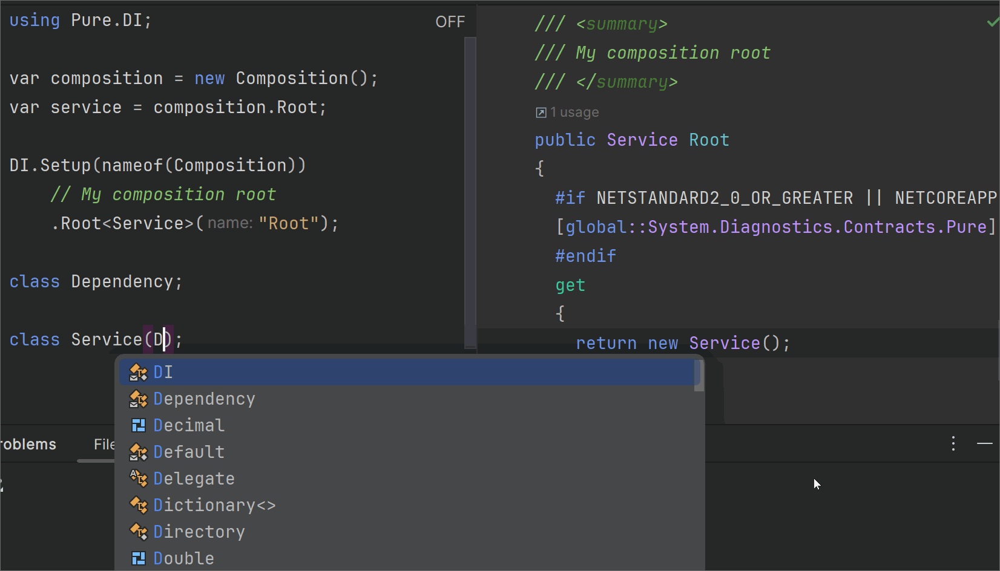
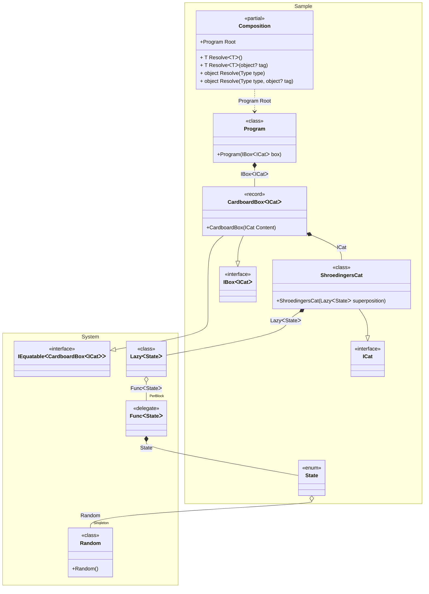
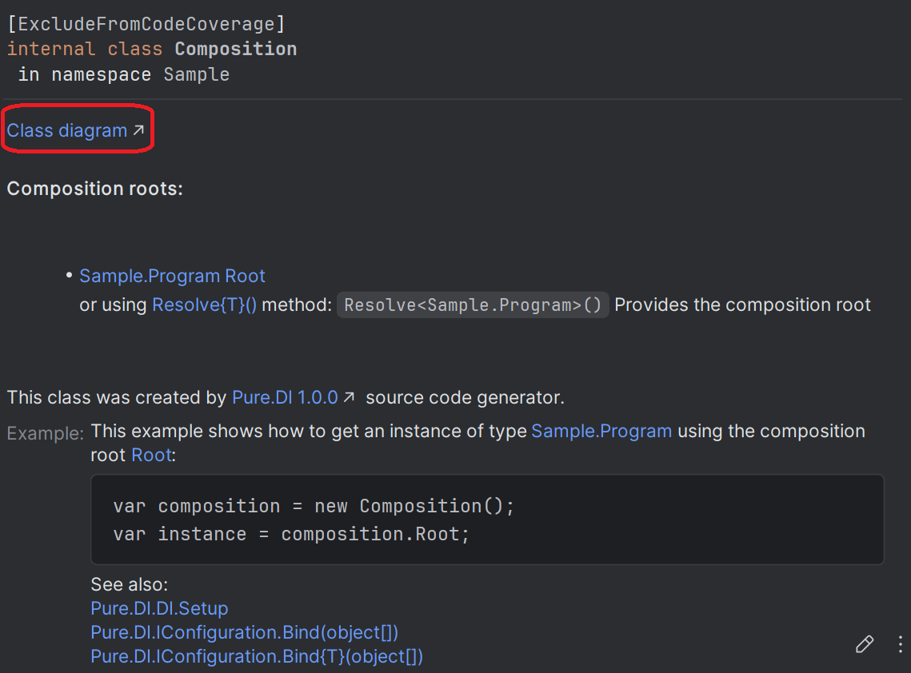
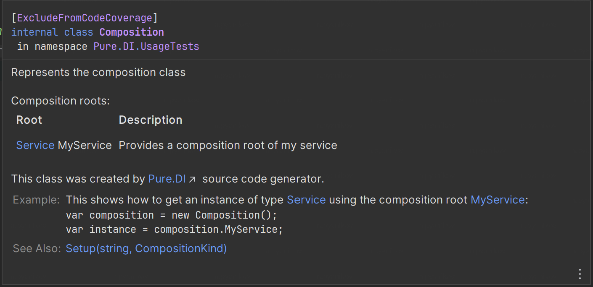
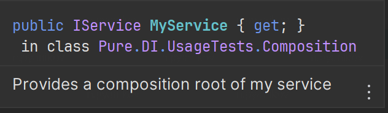
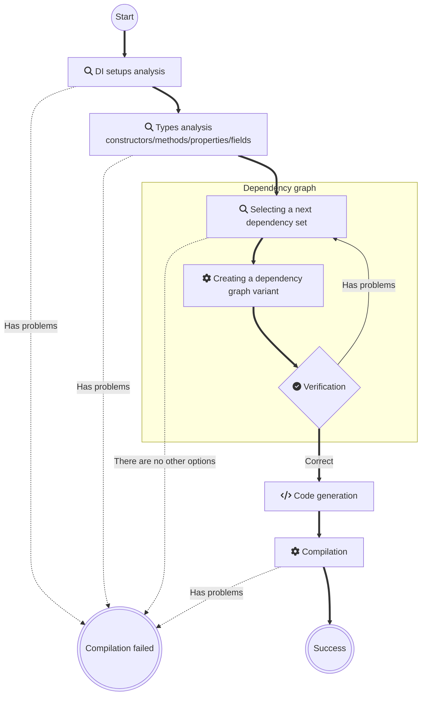

# Pure.DI for .NET

<a href="https://t.me/pure_di"></a>
[](https://www.nuget.org/packages/Pure.DI)
[](LICENSE)




**Pure.DI is a compile-time dependency injection (DI) code generator**. _Supports .NET starting with [.NET Framework 2.0](https://www.microsoft.com/en-us/download/details.aspx?id=6041), released 2005-10-27, and all newer versions._

## Usage Requirements

- **[.NET SDK 6.0.4+](https://dotnet.microsoft.com/download/dotnet/6.0)**  
  Required for compilation. Projects can target older frameworks (e.g., .NET Framework 2.0).
- **[C# 8+](https://docs.microsoft.com/en-us/dotnet/csharp/whats-new/csharp-version-history#c-version-80)**  
  Only required for projects using the Pure.DI source generator. Other projects support any C# version.

## Key Features

### ✔️ Zero Overhead
Pure.DI is a .NET code generator designed to produce clean, efficient dependency injection logic. By leveraging basic language constructs, it generates straightforward code indistinguishable from manual implementation—essentially composing objects through nested constructor invocations. Unlike traditional DI frameworks, Pure.DI avoids reflection and dynamic instantiation entirely, eliminating performance penalties associated with runtime overhead.
### ✔️ Compile-Time Validation
All analysis of object, constructor, and method graphs occurs at compile time. Pure.DI proactively detects and alerts developers to issues such as missing dependencies, cyclic references, or dependencies unsuitable for injection—ensuring these errors are resolved before execution. This approach guarantees that developers cannot produce a program vulnerable to runtime crashes caused by faulty dependency wiring. The validation process operates seamlessly alongside code development, creating an immediate feedback loop: as you modify your code, Pure.DI verifies its integrity in real time, effectively delivering tested, production-ready logic the moment changes are implemented.
### ✔️ Works everywhere
The pure dependency injection approach introduces no runtime dependencies and avoids .NET reflection , ensuring consistent execution across all supported platforms. This includes the Full .NET Framework 2.0+, .NET Core, .NET 5+, UWP/Xbox, .NET IoT, Unity, Xamarin, Native AOT, and beyond. By decoupling runtime constraints, it preserves predictable behavior regardless of the target environment.
### ✔️ Familiar Syntax
The Pure.DI API is intentionally designed to closely mirror the APIs of mainstream IoC/DI frameworks. This approach ensures developers can leverage their existing knowledge of dependency injection patterns without requiring significant adaptation to a proprietary syntax.
### ✔️ Precise Generics
Pure.DI recommends utilizing dedicated marker types rather than relying on open generics. This approach enables more precise construction of object graphs while allowing developers to fully leverage the capabilities of generic types.
### ✔️ Transparency
Pure.DI allows to view and debug the generated code, making debugging and testing easier.
### ✔️ Built-in BCL Support
Pure.DI provides native [support](#base-class-library) for numerous [Base Class Library (BCL)](https://docs.microsoft.com/en-us/dotnet/standard/framework-libraries#base-class-libraries) types out of the box without any extra effort.

## When to Use Pure.DI

### ✔️ High-Performance Applications
Pure.DI is designed for high-performance applications where speed and minimal memory consumption are critical.
### ✔️ Projects with a Focus on Clean Code
Pure.DI is suitable for projects where code cleanliness and minimalism are important factors.
### ✔️ Applications with Complex Dependencies
Pure.DI can handle complex dependencies and provides flexible configuration options.
### ✔️ Ideal for Libraries
Its high performance, zero memory consumption/preparation overhead, and lack of dependencies make it ideal for building libraries and frameworks.

## NuGet packages

| NuGet package                                                               | Description                                                         |
|-----------------------------------------------------------------------------|:--------------------------------------------------------------------|
| [Pure.DI](https://www.nuget.org/packages/Pure.DI)                           | DI source code generator                                            |
| [Pure.DI.Abstractions](https://www.nuget.org/packages/Pure.DI.Abstractions) | Abstractions for Pure.DI                                            |
| [Pure.DI.Templates](https://www.nuget.org/packages/Pure.DI.Templates)       | Template package, for creating projects from the shell/command line |
| [Pure.DI.MS](https://www.nuget.org/packages/Pure.DI.MS)                     | Add-ons for Pure.DI to work with Microsoft DI                       |


## Schrödinger's cat demonstrates how it all works [](samples/ShroedingersCat)

### The reality is


### Let's create an abstraction

```c#
interface IBox<out T>
{
    T Content { get; }
}

interface ICat
{
    State State { get; }
}

enum State { Alive, Dead }
```

### Here's our implementation

```c#
record CardboardBox<T>(T Content) : IBox<T>;

class ShroedingersCat(Lazy<State> superposition): ICat
{
    // The decoherence of the superposition
    // at the time of observation via an irreversible process
    public State State => superposition.Value;
}
```

> [!IMPORTANT]
> Our abstraction and implementation know nothing about the magic of DI or any frameworks.

### Let's glue it all together

Add the Pure.DI package to your project:

[](https://www.nuget.org/packages/Pure.DI)

Let's bind the abstractions to their implementations and set up the creation of the object graph:

```c#
DI.Setup(nameof(Composition))
    // Models a random subatomic event that may or may not occur
    .Bind().As(Singleton).To<Random>()
    // Represents a quantum superposition of two states: Alive or Dead
    .Bind().To((Random random) => (State)random.Next(2))
    .Bind().To<ShroedingersCat>()
    // Cardboard box with any contents
    .Bind().To<CardboardBox<TT>>()
    // Composition Root
    .Root<Program>("Root");
```

> [!NOTE]
> In fact, the `Bind().As(Singleton).To<Random>()` binding is unnecessary since Pure.DI supports many .NET BCL types out of the box, including [Random](https://github.com/DevTeam/Pure.DI/blob/27a1ccd604b2fdd55f6bfec01c24c86428ddfdcb/src/Pure.DI.Core/Features/Default.g.cs#L289). It was added just for the example of using the _Singleton_ lifetime.

The code above specifies the generation of a partial class named *__Composition__*. This name is defined in the `DI.Setup(nameof(Composition))` call. The class contains a *__Root__* property that returns an object graph with an object of type *__Program__* as the root. The type and name of the property are defined by calling `Root<Program>("Root")`. The generated code looks like this:

```c#
partial class Composition
{
    private readonly Lock _lock = new Lock();
    private Random? _random;
    
    public Program Root
    {
      get
      {
        var stateFunc = new Func<State>(() => {
              if (_random is null)
                lock (_lock)
                  if (_random is null)
                    _random = new Random();

              return (State)_random.Next(2)
            });

        return new Program(
          new CardboardBox<ICat>(
            new ShroedingersCat(
              new Lazy<State>(
                stateFunc))));    
      }
    }

    public T Resolve<T>() { ... }
    public T Resolve<T>(object? tag) { ... }

    public object Resolve(Type type) { ... }
    public object Resolve(Type type, object? tag) { ... }
}
```

<details>
<summary>Class diagram</summary>


```mermaid
classDiagram
    ShroedingersCat --|> ICat
    CardboardBoxᐸICatᐳ --|> IBoxᐸICatᐳ
    CardboardBoxᐸICatᐳ --|> IEquatableᐸCardboardBoxᐸICatᐳᐳ
    Composition ..> Program : Program Root
    State o-- "Singleton" Random : Random
    ShroedingersCat *--  LazyᐸStateᐳ : LazyᐸStateᐳ
    Program *--  CardboardBoxᐸICatᐳ : IBoxᐸICatᐳ
    CardboardBoxᐸICatᐳ *--  ShroedingersCat : ICat
    LazyᐸStateᐳ o-- "PerBlock" FuncᐸStateᐳ : FuncᐸStateᐳ
    FuncᐸStateᐳ *--  State : State
    
namespace Sample {
    class CardboardBoxᐸICatᐳ {
        <<record>>
        +CardboardBox(ICat Content)
    }
    
    class Composition {
        <<partial>>
        +Program Root
        + T ResolveᐸTᐳ()
        + T ResolveᐸTᐳ(object? tag)
        + object Resolve(Type type)
        + object Resolve(Type type, object? tag)
    }
    
    class IBoxᐸICatᐳ {
        <<interface>>
    }
    
    class ICat {
        <<interface>>
    }
    
    class Program {
        <<class>>
        +Program(IBoxᐸICatᐳ box)
    }
    
    class ShroedingersCat {
    <<class>>
        +ShroedingersCat(LazyᐸStateᐳ superposition)
    }
    
    class State {
        <<enum>>
    }
}
    
namespace System {
    class FuncᐸStateᐳ {
        <<delegate>>
    }
    
    class IEquatableᐸCardboardBoxᐸICatᐳᐳ {
        <<interface>>
    }
    
    class LazyᐸStateᐳ {
        <<class>>
    }
    
    class Random {
        <<class>>
        +Random()
    }
}
```

You can see the class diagram at any time by following the link in the comment of the generated class:


</details>

This code does not depend on other libraries, does not use type reflection, and avoids tricks that can negatively affect performance and memory consumption. It looks like efficient code written by hand. At any given time, you can study it and understand how it works.

The `public Program Root { get; }` property is a [*__Composition Root__*](https://blog.ploeh.dk/2011/07/28/CompositionRoot/), the only place in the application where the composition of the object graph takes place. Each instance is created using basic language constructs, which compile with all optimizations and minimal impact on performance and memory consumption. In general, applications may have multiple composition roots and thus such properties. Each composition root must have its own unique name, which is defined when the `Root<T>(string name)` method is called, as shown in the code above.

### Time to open boxes!

```c#
class Program(IBox<ICat> box)
{
  // Composition Root, a single place in an application
  // where the composition of the object graphs
  // for an application takes place
  static void Main() => new Composition().Root.Run();

  private void Run() => Console.WriteLine(box);
}
```

Pure.DI creates efficient code in a pure DI paradigm, using only basic language constructs as if you were writing code by hand. This allows you to take full advantage of Dependency Injection everywhere and always, without any compromise!

The full equivalent of this application with top-level statements can be found [here](samples/ShroedingersCatTopLevelStatements).

<details>
<summary>Just try creating a project from scratch!</summary>

Install the [project template](https://www.nuget.org/packages/Pure.DI.Templates)

```shell
dotnet new install Pure.DI.Templates
```

In a directory, create a console application

```shell
dotnet new di
```

Run it

```shell
dotnet run
```

</details>

## Examples

### Basics
- [Auto-bindings](readme/auto-bindings.md)
- [Injections of abstractions](readme/injections-of-abstractions.md)
- [Composition roots](readme/composition-roots.md)
- [Resolve methods](readme/resolve-methods.md)
- [Simplified binding](readme/simplified-binding.md)
- [Factory](readme/factory.md)
- [Simplified factory](readme/simplified-factory.md)
- [Injection on demand](readme/injection-on-demand.md)
- [Injections on demand with arguments](readme/injections-on-demand-with-arguments.md)
- [Composition arguments](readme/composition-arguments.md)
- [Root arguments](readme/root-arguments.md)
- [Tags](readme/tags.md)
- [Smart tags](readme/smart-tags.md)
- [Simplified lifetime-specific bindings](readme/simplified-lifetime-specific-bindings.md)
- [Simplified lifetime-specific factory](readme/simplified-lifetime-specific-factory.md)
- [Build up of an existing object](readme/build-up-of-an-existing-object.md)
- [Builder](readme/builder.md)
- [Builder with arguments](readme/builder-with-arguments.md)
- [Builders](readme/builders.md)
- [Builders with a name template](readme/builders-with-a-name-template.md)
- [Field injection](readme/field-injection.md)
- [Method injection](readme/method-injection.md)
- [Property injection](readme/property-injection.md)
- [Default values](readme/default-values.md)
- [Required properties or fields](readme/required-properties-or-fields.md)
- [Overrides](readme/overrides.md)
- [Root binding](readme/root-binding.md)
- [Static root](readme/static-root.md)
- [Async Root](readme/async-root.md)
- [Consumer type](readme/consumer-type.md)
- [Ref dependencies](readme/ref-dependencies.md)
- [Roots](readme/roots.md)
- [Roots with filter](readme/roots-with-filter.md)
### Lifetimes
- [Transient](readme/transient.md)
- [Singleton](readme/singleton.md)
- [PerResolve](readme/perresolve.md)
- [PerBlock](readme/perblock.md)
- [Scope](readme/scope.md)
- [Auto scoped](readme/auto-scoped.md)
- [Default lifetime](readme/default-lifetime.md)
- [Default lifetime for a type](readme/default-lifetime-for-a-type.md)
- [Default lifetime for a type and a tag](readme/default-lifetime-for-a-type-and-a-tag.md)
- [Disposable singleton](readme/disposable-singleton.md)
- [Async disposable singleton](readme/async-disposable-singleton.md)
- [Async disposable scope](readme/async-disposable-scope.md)
### Base Class Library
- [Func](readme/func.md)
- [Enumerable](readme/enumerable.md)
- [Enumerable generics](readme/enumerable-generics.md)
- [Array](readme/array.md)
- [Lazy](readme/lazy.md)
- [Task](readme/task.md)
- [ValueTask](readme/valuetask.md)
- [Manually started tasks](readme/manually-started-tasks.md)
- [Span and ReadOnlySpan](readme/span-and-readonlyspan.md)
- [Tuple](readme/tuple.md)
- [Weak Reference](readme/weak-reference.md)
- [Async Enumerable](readme/async-enumerable.md)
- [Service collection](readme/service-collection.md)
- [Func with arguments](readme/func-with-arguments.md)
- [Func with tag](readme/func-with-tag.md)
- [Keyed service provider](readme/keyed-service-provider.md)
- [Service provider](readme/service-provider.md)
- [Service provider with scope](readme/service-provider-with-scope.md)
- [Overriding the BCL binding](readme/overriding-the-bcl-binding.md)
### Generics
- [Generics](readme/generics.md)
- [Generic composition roots](readme/generic-composition-roots.md)
- [Complex generics](readme/complex-generics.md)
- [Generic composition roots with constraints](readme/generic-composition-roots-with-constraints.md)
- [Generic async composition roots with constraints](readme/generic-async-composition-roots-with-constraints.md)
- [Custom generic argument](readme/custom-generic-argument.md)
- [Build up of an existing generic object](readme/build-up-of-an-existing-generic-object.md)
- [Generic root arguments](readme/generic-root-arguments.md)
- [Complex generic root arguments](readme/complex-generic-root-arguments.md)
- [Generic builder](readme/generic-builder.md)
- [Generic builders](readme/generic-builders.md)
- [Generic roots](readme/generic-roots.md)
- [Generic injections on demand](readme/generic-injections-on-demand.md)
- [Generic injections on demand with arguments](readme/generic-injections-on-demand-with-arguments.md)
### Attributes
- [Constructor ordinal attribute](readme/constructor-ordinal-attribute.md)
- [Dependency attribute](readme/dependency-attribute.md)
- [Member ordinal attribute](readme/member-ordinal-attribute.md)
- [Tag attribute](readme/tag-attribute.md)
- [Type attribute](readme/type-attribute.md)
- [Inject attribute](readme/inject-attribute.md)
- [Custom attributes](readme/custom-attributes.md)
- [Custom universal attribute](readme/custom-universal-attribute.md)
- [Custom generic argument attribute](readme/custom-generic-argument-attribute.md)
- [Bind attribute](readme/bind-attribute.md)
- [Bind attribute with lifetime and tag](readme/bind-attribute-with-lifetime-and-tag.md)
- [Bind attribute for a generic type](readme/bind-attribute-for-a-generic-type.md)
### Interception
- [Decorator](readme/decorator.md)
- [Interception](readme/interception.md)
- [Advanced interception](readme/advanced-interception.md)
### Hints
- [Resolve hint](readme/resolve-hint.md)
- [ThreadSafe hint](readme/threadsafe-hint.md)
- [OnDependencyInjection regular expression hint](readme/ondependencyinjection-regular-expression-hint.md)
- [OnDependencyInjection wildcard hint](readme/ondependencyinjection-wildcard-hint.md)
- [OnCannotResolve regular expression hint](readme/oncannotresolve-regular-expression-hint.md)
- [OnCannotResolve wildcard hint](readme/oncannotresolve-wildcard-hint.md)
- [OnNewInstance regular expression hint](readme/onnewinstance-regular-expression-hint.md)
- [OnNewInstance wildcard hint](readme/onnewinstance-wildcard-hint.md)
- [ToString hint](readme/tostring-hint.md)
- [Check for a root](readme/check-for-a-root.md)
### Advanced
- [Composition root kinds](readme/composition-root-kinds.md)
- [Factory with thread synchronization](readme/factory-with-thread-synchronization.md)
- [Root with name template](readme/root-with-name-template.md)
- [Tag Any](readme/tag-any.md)
- [Tag Type](readme/tag-type.md)
- [Tag Unique](readme/tag-unique.md)
- [Tag on injection site](readme/tag-on-injection-site.md)
- [Tag on a constructor argument](readme/tag-on-a-constructor-argument.md)
- [Tag on a member](readme/tag-on-a-member.md)
- [Tag on a method argument](readme/tag-on-a-method-argument.md)
- [Tag on injection site with wildcards](readme/tag-on-injection-site-with-wildcards.md)
- [Dependent compositions](readme/dependent-compositions.md)
- [Dependent compositions with setup context](readme/dependent-compositions-with-setup-context.md)
- [Dependent compositions with setup context members](readme/dependent-compositions-with-setup-context-members.md)
- [Dependent compositions with setup context members and property accessors](readme/dependent-compositions-with-setup-context-members-and-property-accessors.md)
- [Dependent compositions with setup context root argument](readme/dependent-compositions-with-setup-context-root-argument.md)
- [Inheritance of compositions](readme/inheritance-of-compositions.md)
- [Accumulators](readme/accumulators.md)
- [Global compositions](readme/global-compositions.md)
- [Light roots](readme/light-roots.md)
- [Partial class](readme/partial-class.md)
- [A few partial classes](readme/a-few-partial-classes.md)
- [Thread-safe overrides](readme/thread-safe-overrides.md)
- [Override depth](readme/override-depth.md)
- [Consumer types](readme/consumer-types.md)
- [Tracking disposable instances per a composition root](readme/tracking-disposable-instances-per-a-composition-root.md)
- [Tracking disposable instances in delegates](readme/tracking-disposable-instances-in-delegates.md)
- [Tracking disposable instances using pre-built classes](readme/tracking-disposable-instances-using-pre-built-classes.md)
- [Tracking disposable instances with different lifetimes](readme/tracking-disposable-instances-with-different-lifetimes.md)
- [Tracking async disposable instances per a composition root](readme/tracking-async-disposable-instances-per-a-composition-root.md)
- [Tracking async disposable instances in delegates](readme/tracking-async-disposable-instances-in-delegates.md)
- [Exposed roots](readme/exposed-roots.md)
- [Exposed roots with tags](readme/exposed-roots-with-tags.md)
- [Exposed roots via arg](readme/exposed-roots-via-arg.md)
- [Exposed roots via root arg](readme/exposed-roots-via-root-arg.md)
- [Exposed generic roots](readme/exposed-generic-roots.md)
- [Exposed generic roots with args](readme/exposed-generic-roots-with-args.md)
### Use Cases
- [AutoMapper](readme/automapper.md)
- [JSON serialization](readme/json-serialization.md)
- [Serilog](readme/serilog.md)
- [Request overrides](readme/request-overrides.md)
### Unity
- [Unity Basics](readme/unity-basics.md)
- [Unity with prefabs](readme/unity-with-prefabs.md)
### Applications
- Console
  - [Schrodinger's cat](readme/Console.md)
  - [Top-level statements](readme/ConsoleTopLevelStatements.md)
  - [Native AOT](readme/ConsoleNativeAOT.md)
  - [Entity Framework](readme/EntityFramework.md)
- [Unity](readme/Unity.md)
- UI
  - [MAUI](readme/Maui.md)
  - [WPF](readme/Wpf.md)
  - [Avalonia](readme/Avalonia.md)
  - [Win Forms Net Core](readme/WinFormsAppNetCore.md)
  - [Win Forms](readme/WinFormsApp.md)
- Web
  - [Web](readme/WebApp.md)
  - [Minimal Web API](readme/MinimalWebAPI.md)
  - [Web API](readme/WebAPI.md)
  - [gRPC service](readme/GrpcService.md)
  - [Blazor Server](readme/BlazorServerApp.md)
  - [Blazor WebAssembly](readme/BlazorWebAssemblyApp.md)
    - [https://devteam.github.io/Pure.DI/](https://devteam.github.io/Pure.DI/)
- GitHub repos with examples
  - [Schrodinger's cat](https://github.com/DevTeam/Pure.DI.Example)
  - [How to use Pure.DI to create and test libraries](https://github.com/DevTeam/Pure.DI.Solution)

## Generated Code

Each generated class (a _composition_) is configured via `Setup(string compositionTypeName)`:

```c#
DI.Setup("Composition")
    .Bind<IDependency>().To<Dependency>()
    .Bind<IService>().To<Service>()
    .Root<IService>("Root");
```

<details>
<summary>The following class will be generated</summary>

```c#
partial class Composition
{
    // Composition root
    public IService Root
    {
        get
        {
            return new Service(new Dependency());
        }
    }
}
```

The _compositionTypeName_ parameter can be omitted:

- If the setup is performed inside a partial class, the composition will be created for that partial class.
- For a class with composition kind `CompositionKind.Global`, see [this example](readme/global-compositions.md).

</details>

<details>
<summary>Setup arguments</summary>

The first parameter is used to specify the name of the composition class. All sets with the same name will be combined to create one composition class. Alternatively, this name may contain a namespace, e.g. a composition class is generated for `Sample.Composition`:

```c#
namespace Sample
{
    partial class Composition
    {
        ...
    }
}
```

The second optional parameter may have multiple values to determine the kind of composition.

### CompositionKind.Public

This value is used by default. If this value is specified, a normal composition class will be created.

### CompositionKind.Internal

If you specify this value, the class will not be generated, but this setup can be used by others as a base setup. For example:

```c#
DI.Setup("BaseComposition", CompositionKind.Internal)
    .Bind().To<Dependency>();

DI.Setup("Composition").DependsOn("BaseComposition")
    .Bind().To<Service>();
```

If the _CompositionKind.Public_ flag is set in the composition setup, it can also serve as the base for other compositions, as in the example above.

### CompositionKind.Global

No composition class will be created when this value is specified, but this setup is the base setup for all setups in the current project, and `DependsOn(...)` is not required.

</details>

<details>
<summary>Constructors</summary>

By default, starting with version 2.3.0, no constructors are generated for a composition. The actual set of constructors depends on the composition arguments and lifetime scopes.

#### Parameterized constructor (automatic generation)

If the composition has any arguments defined, Pure.DI automatically generates a public parameterized constructor that includes all specified arguments. Setup contexts passed via `DependsOn(..., kind, name)` with `SetupContextKind.Argument` are treated as arguments and also appear in this constructor.

Example configuration:

```c#
DI.Setup("Composition")
  .Arg<string>("name")
  .Arg<int>("id")
  // ...
```

Resulting constructor:

```c#
public Composition(string name, int id) { /* ... */ }
```

Important notes:

- Only arguments that are actually used in the object graph appear in the constructor.
- Unused arguments are omitted to optimize resource usage.
- If no arguments (including setup context arguments) are specified, no parameterized constructor is created.

#### Setup context storage

When a dependent setup needs instance state from another setup, you can pass an explicit setup context via `DependsOn`:

- `SetupContextKind.Argument`: adds the setup context as a constructor argument.
- `SetupContextKind.RootArgument`: adds the setup context to root methods that require it, no constructor argument.
- `SetupContextKind.Members`: copies referenced setup members into the dependent composition, no constructor argument. The `name` parameter is optional.

  - **Public and protected members** are copied to the dependent composition.
  - **Properties without custom logic** (simple field-backed accessors) are copied without requiring partial methods.
  - **Properties with custom logic** require implementation of partial accessor methods. Referenced methods are declared partial without bodies. Properties with custom accessors use partial `get_`/`set_` methods (for example, `get__MyProperty()` for properties, note the double underscore prefix).

This is useful for Unity/MonoBehaviour scenarios where the composition must remain parameterless and the host sets fields or properties.

<details>
<summary>Example: Simple field-backed property</summary>

```c#
// BaseComposition
internal partial class BaseComposition
{
    // Simple property without custom logic
    public string ConnectionString { get; set; } = "";
}

// Composition - the property is automatically copied, no partial methods needed
internal partial class Composition
{
    // ConnectionString is automatically available here
}
```

</details>

<details>
<summary>Example: Property with custom accessor logic</summary>

```c#
// BaseComposition
internal partial class BaseComposition
{
    private int _maxConnections = 100;

    // Property with custom getter logic
    public int MaxConnections
    {
        get => _maxConnections;
        set => _maxConnections = value;
    }
}

// Composition - implements custom accessor logic
internal partial class Composition
{
    private int _maxConnections = 100;

    // Implement custom getter logic (note the double underscore prefix)
    private partial int get__MaxConnections() => _maxConnections + 1;

    public void SetMaxConnections(int value) => _maxConnections = value;
}
```

</details>

<details>
<summary>Example: Protected field access</summary>

```c#
// BaseComposition
internal partial class BaseComposition
{
    // Protected field accessible in derived compositions
    protected bool EnableDiagnostics = false;

    private void Setup()
    {
        DI.Setup(nameof(BaseComposition), CompositionKind.Internal)
            .Bind("enableDiagnostics").To(_ => EnableDiagnostics);
    }
}

// Composition - can access and modify protected fields
internal partial class Composition
{
    public Composition() => EnableDiagnostics = true; // Access protected field
}
```

</details>

#### Scope-related constructors (conditional generation)

If there is at least one binding with `Lifetime.Scoped`, Pure.DI generates two constructors:

1. Public default constructor

> Used for creating the root scope instance.
>  ```c#
> public Composition() { /* ... */ }
> ```

2. Internal constructor with parent scope

> Used for creating child scope instances. This constructor is internal and accepts a single parameter � the parent scope.
> ```c#
> internal Composition(Composition parentScope) { /* ... */ }
> ```
> Important notes:
> - The public default constructor enables initialization of the root composition.
> - The internal constructor with parent reference enables proper scoping hierarchy for `Lifetime.Scoped` dependencies.
> - These constructors are only generated when `Lifetime.Scoped` bindings exist in the composition.
> - Setup contexts with `SetupContextKind.Field` or `SetupContextKind.Property` do not require constructors and can be set by the host (for example, Unity).

#### Summary of constructor generation rules

- No arguments + no _Scoped_ lifetimes: no constructors generated.
- Arguments present (including setup context arguments): public parameterized constructor with all used arguments.
- At least one _Scoped_ lifetime: two constructors (public default + internal with parent).
- Both arguments and Scoped lifetimes: all three constructors (parameterized, public default, internal with parent).
- Setup context with `SetupContextKind.Argument` behaves like an argument and can add a constructor parameter.
- Setup context with `SetupContextKind.Field`, `SetupContextKind.Property`, `SetupContextKind.RootArgument`, or `SetupContextKind.Members` does not add constructor parameters.
</details>

<details>
<summary>Composition Roots</summary>

### Regular Composition Roots

To create an object graph quickly and conveniently, a set of properties (or methods) is formed. These properties/methods are here called composition roots. The type of a property/method is the type of the root object created by the composition. Accordingly, each invocation of a property/method leads to the creation of an object graph with a root element of this type.

```c#
DI.Setup("Composition")
    .Bind<IService>().To<Service>()
    .Root<IService>("MyService");

var composition = new Composition();
var service = composition.MyService;
service = composition.Resolve<IService>();
service = composition.Resolve(typeof(IService));
```

In this case, the property for the _IService_ type will be named _MyService_ and will be available for direct use. The result of its use will be the creation of an object graph with the root of _IService_ type:

```c#
public IService MyService
{
    get
    {
        ...
        return new Service(...);
    }
}
```

This is the [recommended way](https://blog.ploeh.dk/2011/07/28/CompositionRoot/) to create a composition root. A composition class can contain any number of roots.

In addition, the composition roots can be resolved using the `Resolve`/`ResolveByTag` methods:

```c#
service = composition.Resolve<IService>();
service = composition.Resolve(typeof(IService));
```

> [!TIP]
>- There is no limit to the number of roots, but you should consider limiting the number of roots. Ideally, an application should have a single composition root.
>- The name of the composition root is arbitrarily chosen depending on its purpose, but should follow C# property naming conventions since it becomes a property name in the composition class.
>- It is recommended that composition roots be resolved using normal properties or methods instead of `Resolve`/`ResolveByTag` methods.

### Anonymous Composition Roots

If the root name is empty, an anonymous composition root with a random name is created:

```c#
private IService RootM07D16di_0001
{
    get { ... }
}
```

These properties (or methods) have an arbitrary name and access modifier `private` and cannot be used directly from the code. Do not attempt to use them, as their names can change between builds. Anonymous composition roots can be resolved by `Resolve`/`ResolveByTag` methods:

```c#
DI.Setup("Composition")
    .Bind<IService>().To<Service>()
    .Root<IService>();

var composition = new Composition();
var service = composition.Resolve<IService>();
service = composition.Resolve(typeof(IService));
```

</details>

<details>
<summary>Resolve/ResolveByTag methods</summary>

### Resolve/ResolveByTag methods

By default, a set of four _Resolve_/_ResolveByTag_ methods is generated:

```c#
public T Resolve<T>() { ... }

public T Resolve<T>(object? tag) { ... }

public object Resolve(Type type) { ... }

public object Resolve(Type type, object? tag) { ... }
```

These methods can resolve both public and anonymous composition roots that do not depend on root arguments. They are useful when using the [Service Locator](https://martinfowler.com/articles/injection.html) approach, where the code resolves composition roots in place:

```c#
var composition = new Composition();

composition.Resolve<IService>();
```

This is [not recommended](https://blog.ploeh.dk/2010/02/03/ServiceLocatorisanAnti-Pattern/) because _Resolve_/_ResolveByTag_ methods have a number of disadvantages:
- They provide access to an unlimited set of dependencies.
- Their use can potentially lead to runtime exceptions, for example, when the corresponding root has not been defined.
- Can be slower because they perform a lookup by type and tag.

To control the generation of these methods, see the [Resolve](#resolve-hint) hint.

### Dispose and DisposeAsync

Provides a mechanism to release unmanaged resources. These methods are generated only if the composition contains at least one singleton/scoped instance that implements either [IDisposable](https://learn.microsoft.com/en-us/dotnet/api/system.idisposable) or [IAsyncDisposable](https://learn.microsoft.com/en-us/dotnet/api/system.iasyncdisposable). The `Dispose()` or `DisposeAsync()` method of the composition should be called to dispose of all created singleton/scoped objects:

```c#
using var composition = new Composition();
```

or

```c#
await using var composition = new Composition();
```

To dispose objects of other lifetimes, see [this](readme/tracking-disposable-instances-per-a-composition-root.md) or [this](readme/tracking-disposable-instances-in-delegates.md) example.

</details>

<details>

<summary>Bindings</summary>

## Bindings

Bindings are the core mechanism of Pure.DI, used to define how types are created and which contracts they fulfill.

### Overview

#### For Implementations

To bind a contract to a specific implementation:

```c#
.Bind<Contract1>(tags).Bind<ContractN>(tags)
    .Tags(tags)
    .As(Lifetime)
    .To<Implementation>()
```

Alternatively, you can bind multiple contracts at once:

```c#
.Bind<Contract1, Contract2>(tags)
    .To<Implementation>()
```

Example:

```c#
.Bind<IService>().To<Service>()
```

#### For Factories

To use a custom factory logic via `IContext`:

```c#
.Bind<Contract1>(tags).Bind<ContractN>(tags)
    .Tags(tags)
    .As(Lifetime)
    .To(ctx => new Implementation(ctx.Resolve<Dependency>()))
```

Example:

```c#
.Bind<IService>().To(ctx => new Service(ctx.Resolve<IDependency>()))
```

#### Override Depth in Factories

Use `Let` to keep an override at the current injection level:

```c#
DI.Setup(nameof(Composition))
    .Bind().To<int>(_ => 7)
    .Bind().To<Dependency>()
    .Bind().To<Service>(ctx =>
    {
        // Override only the immediate injection
        ctx.Let(42);
        ctx.Inject(out Service service);
        return service;
    })
    .Root<Service>("Service");
```

Override precedence:
- The nearest override wins for nested dependencies.
- If multiple overrides target the same type and tag in one factory, the last call wins.
- `Let` applies only to the current injection level.

#### For Simplified Factories

When you only need to inject specific dependencies without accessing the full context:

```c#
.Bind<Contract1>(tags).Bind<ContractN>(tags)
    .Tags(tags)
    .As(Lifetime)
    .To<Implementation>((Dependency1 dep1, Dependency2 dep2) => new Implementation(dep1, dep2))
```

Example:

```c#
.Bind<IService>().To((IDependency dep) => new Service(dep))
```

### Lifetimes

Lifetimes control how long an object lives and how it is reused:
- **Transient**: A new instance is created for every injection (default).
- **Singleton**: A single instance is created for the entire composition.
- **PerResolve**: A single instance is reused within a single composition root (or a `Resolve`/`ResolveByTag` call).
- **PerBlock**: Reuses instances within a code block to reduce allocations.
- **Scoped**: A single instance is reused within a specific scope.

### Default Lifetimes

You can set a default lifetime for all subsequent bindings in a setup:

```c#
.DefaultLifetime(Lifetime.Singleton)
// This will be a Singleton
.Bind<IInterface>().To<Implementation>()
```

Alternatively, you can set a default lifetime for a specific contract type:

```c#
.DefaultLifetime<IDisposable>(Lifetime.Singleton)
```

### Tags

Tags allow you to distinguish between multiple implementations of the same contract.

- Use `.Bind<T>(tags)` or `.Tags(tags)` to apply tags to a binding.
- Use the `[Tag(tag)]` attribute or `ctx.Resolve<T>(tag)` to consume a tagged dependency.

Example:

```c#
.Bind<IService>("MyTag").To<Service>()
```

## Implementation Bindings

Implementation bindings allow for a more concise syntax where the implementation type itself serves as the contract or where you want the binder to automatically infer suitable base types and interfaces.

### For Implementations

```c#
// Infers all suitable base types and interfaces automatically
.Bind(tags).Tags(tags).As(Lifetime).To<Implementation>()
```

Alternatively, you can use the implementation type as the contract:

```c#
.Bind().To<Implementation>()
```

Example:

```c#
.Bind().To<Service>()
```

### For Factories

```c#
.Bind(tags).Tags(tags).To(ctx => new Implementation())
```

Example:

```c#
.Bind().To(ctx => new Service())
```

### For Simplified Factories

```c#
.Bind(tags).Tags(tags).To((Dependency dep) => new Implementation(dep))
```

Example:

```c#
.Bind().To((IDependency dep) => new Service(dep))
```

## Special types will not be added to bindings

By default, Pure.DI avoids binding to special types during auto-inference to prevent polluting the container with unintended bindings for types like `IDisposable`, `IEnumerable`, or `object`. Special types will not be added to bindings by default:

- `System.Object`
- `System.Enum`
- `System.MulticastDelegate`
- `System.Delegate`
- `System.Collections.IEnumerable`
- `System.Collections.Generic.IEnumerable<T>`
- `System.Collections.Generic.IList<T>`
- `System.Collections.Generic.ICollection<T>`
- `System.Collections.IEnumerator`
- `System.Collections.Generic.IEnumerator<T>`
- `System.Collections.Generic.IReadOnlyList<T>`
- `System.Collections.Generic.IReadOnlyCollection<T>`
- `System.IDisposable`
- `System.IAsyncResult`
- `System.AsyncCallback`

If you want to add your own special type, use the `SpecialType<T>()` call, for example:

```c#
.SpecialType<MonoBehaviour>()
.Bind().To<MyMonoBehaviourImplementation>()
// Now MonoBehaviour will not be added to the contracts
```

## Simplified Lifetime-Specific Bindings

Pure.DI provides syntactic sugar for common lifetimes. These methods combine `Bind()`, `.Tags(tags)`, `As(Lifetime)`, and `To()` into a single call.

### For Implementations

```c#
// Equivalent to Bind<T, T1, ...>(tags).As(Lifetime.Transient).To<Implementation>()
.Transient<T>(tags)
// or multiple types at once
.PerResolve<T, T1, ...>(tags)
```

Example:

```c#
.Transient<Service>()
.Singleton<Service2, Service3, Service4>()
```

### For Factories

```c#
// Equivalent to Bind(tags).As(Lifetime.Singleton).To(ctx => ...)
.Singleton<Implementation>(ctx => new Implementation(), tags)
```

Example:

```c#
.Singleton<IService>(ctx => new Service())
```

### For Simplified Factories

```c#
// Equivalent to Bind(tags).As(Lifetime.PerResolve).To((Dependency dep) => ...)
.PerResolve((Dependency dep) => new Implementation(dep), tags)
```

Example:

```c#
.PerResolve((IDependency dep) => new Service(dep))
```

Equivalent shortcuts exist for all lifetimes:

- `Transient<T>(...)`
- `Singleton<T>(...)`
- `Scoped<T>(...)`
- `PerResolve<T>(...)`
- `PerBlock<T>(...)`

</details>

<details>

<summary>Setup hints</summary>

## Setup hints

Hints are per-setup switches and filters that control how the composition code is generated (for example, whether `Resolve` methods are emitted, thread-safety, diagnostics hooks, or `ToString()` diagrams). Think of them as generator settings that let you trade off features, diagnostics, and compile-time cost.

Guidelines:
- Prefer the fluent API for discoverability and refactoring safety; use comment directives for quick local overrides.
- Hints affect only the `DI.Setup(...)` they are attached to (unless you use a global composition).
- If you set the same hint multiple times, the last value wins.

```c#
DI.Setup("Composition")
    .Hint(Hint.Resolve, "Off")
    .Hint(Hint.ThreadSafe, "Off")
    .Hint(Hint.ToString, "On")
    ...
```

As an alternative to the fluent API, you can place comment directives before the _Setup_ method in the form `hint = value`. For example:

```c#
// Resolve = Off
// ThreadSafe = Off
DI.Setup("Composition")
    ...
```

Both approaches can be mixed when it improves readability:

```c#
// Resolve = Off
DI.Setup("Composition")
    .Hint(Hint.ThreadSafe, "Off")
    ...
```

| Hint                                                                                                                                 | Values                                     | C# version | Default   |
|--------------------------------------------------------------------------------------------------------------------------------------|--------------------------------------------|------------|-----------|
| [Resolve](#resolve-hint)                                                                                                             | _On_ or _Off_                              |            | _On_      |
| [OnNewInstance](#onnewinstance-hint)                                                                                                 | _On_ or _Off_                              | 9.0        | _Off_     |
| [OnNewInstancePartial](#onnewinstance-hint)                                                                                          | _On_ or _Off_                              |            | _On_      |
| [OnNewInstanceImplementationTypeNameRegularExpression](#onnewinstanceimplementationtypenameregularexpression-hint)                   | Regular expression                         |            | .+        |
| [OnNewInstanceImplementationTypeNameWildcard](#onnewinstanceimplementationtypenamewildcard-hint)                                     | Wildcard                                   |            | *         |
| [OnNewInstanceTagRegularExpression](#onnewinstancetagregularexpression-hint)                                                         | Regular expression                         |            | .+        |
| [OnNewInstanceTagWildcard](#onnewinstancetagwildcard-hint)                                                                           | Wildcard                                   |            | *         |
| [OnNewInstanceLifetimeRegularExpression](#onnewinstancelifetimeregularexpression-hint)                                               | Regular expression                         |            | .+        |
| [OnNewInstanceLifetimeWildcard](#onnewinstancelifetimewildcard-hint)                                                                 | Wildcard                                   |            | *         |
| [OnDependencyInjection](#ondependencyinjection-hint)                                                                                 | _On_ or _Off_                              | 9.0        | _Off_     |
| [OnDependencyInjectionPartial](#ondependencyinjectionpartial-hint)                                                                   | _On_ or _Off_                              |            | _On_      |
| [OnDependencyInjectionImplementationTypeNameRegularExpression](#ondependencyinjectionimplementationtypenameregularexpression-hint)   | Regular expression                         |            | .+        |
| [OnDependencyInjectionImplementationTypeNameWildcard](#ondependencyinjectionimplementationtypenamewildcard-hint)                     | Wildcard                                   |            | *         |
| [OnDependencyInjectionContractTypeNameRegularExpression](#ondependencyinjectioncontracttypenameregularexpression-hint)               | Regular expression                         |            | .+        |
| [OnDependencyInjectionContractTypeNameWildcard](#ondependencyinjectioncontracttypenamewildcard-hint)                                 | Wildcard                                   |            | *         |
| [OnDependencyInjectionTagRegularExpression](#ondependencyinjectiontagregularexpression-hint)                                         | Regular expression                         |            | .+        |
| [OnDependencyInjectionTagWildcard](#ondependencyinjectiontagwildcard-hint)                                                           | Wildcard                                   |            | *         |
| [OnDependencyInjectionLifetimeRegularExpression](#ondependencyinjectionlifetimeregularexpression-hint)                               | Regular expression                         |            | .+        |
| [OnDependencyInjectionLifetimeWildcard](#ondependencyinjectionlifetimewildcard-hint)                                                 | Wildcard                                   |            | *         |
| [OnCannotResolve](#oncannotresolve-hint)                                                                                             | _On_ or _Off_                              | 9.0        | _Off_     |
| [OnCannotResolvePartial](#oncannotresolvepartial-hint)                                                                               | _On_ or _Off_                              |            | _On_      |
| [OnCannotResolveContractTypeNameRegularExpression](#oncannotresolvecontracttypenameregularexpression-hint)                           | Regular expression                         |            | .+        |
| [OnCannotResolveContractTypeNameWildcard](#oncannotresolvecontracttypenamewildcard-hint)                                             | Wildcard                                   |            | *         |
| [OnCannotResolveTagRegularExpression](#oncannotresolvetagregularexpression-hint)                                                     | Regular expression                         |            | .+        |
| [OnCannotResolveTagWildcard](#oncannotresolvetagwildcard-hint)                                                                       | Wildcard                                   |            | *         |
| [OnCannotResolveLifetimeRegularExpression](#oncannotresolvelifetimeregularexpression-hint)                                           | Regular expression                         |            | .+        |
| [OnCannotResolveLifetimeWildcard](#oncannotresolvelifetimewildcard-hint)                                                             | Wildcard                                   |            | *         |
| [OnNewRoot](#onnewroot-hint)                                                                                                         | _On_ or _Off_                              |            | _Off_     |
| [OnNewRootPartial](#onnewrootpartial-hint)                                                                                           | _On_ or _Off_                              |            | _On_      |
| [ToString](#tostring-hint)                                                                                                           | _On_ or _Off_                              |            | _Off_     |
| [ThreadSafe](#threadsafe-hint)                                                                                                       | _On_ or _Off_                              |            | _On_      |
| [ResolveMethodModifiers](#resolvemethodmodifiers-hint)                                                                               | Method modifier                            |            | _public_  |
| [ResolveMethodName](#resolvemethodname-hint)                                                                                         | Method name                                |            | _Resolve_ |
| [ResolveByTagMethodModifiers](#resolvebytagmethodmodifiers-hint)                                                                     | Method modifier                            |            | _public_  |
| [ResolveByTagMethodName](#resolvebytagmethodname-hint)                                                                               | Method name                                |            | _Resolve_ |
| [ObjectResolveMethodModifiers](#objectresolvemethodmodifiers-hint)                                                                   | Method modifier                            |            | _public_  |
| [ObjectResolveMethodName](#objectresolvemethodname-hint)                                                                             | Method name                                |            | _Resolve_ |
| [ObjectResolveByTagMethodModifiers](#objectresolvebytagmethodmodifiers-hint)                                                         | Method modifier                            |            | _public_  |
| [ObjectResolveByTagMethodName](#objectresolvebytagmethodname-hint)                                                                   | Method name                                |            | _Resolve_ |
| [DisposeMethodModifiers](#disposemethodmodifiers-hint)                                                                               | Method modifier                            |            | _public_  |
| [DisposeAsyncMethodModifiers](#disposeasyncmethodmodifiers-hint)                                                                     | Method modifier                            |            | _public_  |
| [FormatCode](#formatcode-hint)                                                                                                       | _On_ or _Off_                              |            | _Off_     |
| [SeverityOfNotImplementedContract](#severityofnotimplementedcontract-hint)                                                           | _Error_ or _Warning_ or _Info_ or _Hidden_ |            | _Error_   |
| [Comments](#comments-hint)                                                                                                           | _On_ or _Off_                              |            | _On_      |
| [SkipDefaultConstructor](#skipdefaultconstructor-hint)                                                                               | _On_ or _Off_                              |            | _Off_     |
| [SkipDefaultConstructorImplementationTypeNameRegularExpression](#skipdefaultconstructorimplementationtypenameregularexpression-hint) | Regular expression                         |            | .+        |
| [SkipDefaultConstructorImplementationTypeNameWildcard](#skipdefaultconstructorimplementationtypenamewildcard-hint)                   | Wildcard                                   |            | *         |
| [SkipDefaultConstructorLifetimeRegularExpression](#skipdefaultconstructorlifetimeregularexpression-hint)                             | Regular expression                         |            | .+        |
| [SkipDefaultConstructorLifetimeWildcard](#skipdefaultconstructorlifetimewildcard-hint)                                               | Wildcard                                   |            | *         |
| [DisableAutoBinding](#disableautobinding-hint)                                                                                       | _On_ or _Off_                              |            | _Off_     |
| [DisableAutoBindingImplementationTypeNameRegularExpression](#disableautobindingimplementationtypenameregularexpression-hint)         | Regular expression                         |            | .+        |
| [DisableAutoBindingImplementationTypeNameWildcard](#disableautobindingimplementationtypenamewildcard-hint)                           | Wildcard                                   |            | *         |
| [DisableAutoBindingLifetimeRegularExpression](#disableautobindinglifetimeregularexpression-hint)                                     | Regular expression                         |            | .+        |
| [DisableAutoBindingLifetimeWildcard](#disableautobindinglifetimewildcard-hint)                                                       | Wildcard                                   |            | *         |
| [LightweightAnonymousRoot](#lightweightanonymousroot-hint)                                                                           | _On_ or _Off_                              |            | _On_      |

The list of hints will be gradually expanded to meet the needs and desires for fine-tuning code generation. Please feel free to add your ideas.

### Resolve Hint

Controls whether [_Resolve_/_ResolveByTag_ methods](#resolve-resolvebytag-methods) are generated. By default they are enabled. Turn this _Off_ to reduce generated code size and compilation time, but note that anonymous roots are not created and only explicitly named roots are available. When disabled, always define public roots via `Root<T>(string name)`.

```c#
// Resolve = Off
DI.Setup("Composition")
    .Bind<IService>().To<Service>()
    .Root<IService>("Root");
```

### OnNewInstance Hint

Enables the `OnNewInstance` callback to observe or replace newly created instances (for example, logging, diagnostics, or decoration). It is _Off_ by default to avoid overhead.

```c#
internal partial class Composition
{
    partial void OnNewInstance<T>(ref T value, object? tag, object lifetime) =>
        Console.WriteLine($"'{typeof(T)}'('{tag}') created.");
}
```

You can also replace the created instance with a `T` type, where `T` is the actual type of the created instance. To minimize performance loss when calling _OnNewInstance_, use the three hints below.

### OnNewInstancePartial Hint

Controls whether the `OnNewInstance` partial method signature is generated when `OnNewInstance` is enabled. Turn it _Off_ if you want to enable filtering hints without emitting the partial method.

```c#
// OnNewInstance = On
// OnNewInstancePartial = Off
DI.Setup("Composition")
    .Bind<IService>().To<Service>();
```

### OnNewInstanceImplementationTypeNameRegularExpression Hint

This is a regular expression for filtering by instance type name. This hint is useful when _OnNewInstance_ is in _On_ state and it is necessary to limit the set of types for which the _OnNewInstance_ method will be called.

```c#
// OnNewInstance = On
// OnNewInstanceImplementationTypeNameRegularExpression = .*Service
DI.Setup("Composition")
    .Bind<IService>().To<Service>();
```

### OnNewInstanceImplementationTypeNameWildcard Hint

This is a Wildcard for filtering by instance type name. This hint is useful when _OnNewInstance_ is in _On_ state and it is necessary to limit the set of types for which the _OnNewInstance_ method will be called.

```c#
// OnNewInstance = On
// OnNewInstanceImplementationTypeNameWildcard = *Service
DI.Setup("Composition")
    .Bind<IService>().To<Service>();
```

### OnNewInstanceTagRegularExpression Hint

This is a regular expression for filtering by _tag_. This hint is also useful when _OnNewInstance_ is in _On_ state and it is necessary to limit the set of _tags_ for which the _OnNewInstance_ method will be called.

```c#
// OnNewInstance = On
// OnNewInstanceTagRegularExpression = Internal|Public
DI.Setup("Composition")
    .Bind<IService>("Internal").To<Service>();
```

### OnNewInstanceTagWildcard Hint

This is a wildcard for filtering by _tag_. This hint is also useful when _OnNewInstance_ is in _On_ state and it is necessary to limit the set of _tags_ for which the _OnNewInstance_ method will be called.

```c#
// OnNewInstance = On
// OnNewInstanceTagWildcard = *Internal
DI.Setup("Composition")
    .Bind<IService>("Internal").To<Service>();
```

### OnNewInstanceLifetimeRegularExpression Hint

This is a regular expression for filtering by _lifetime_. This hint is also useful when _OnNewInstance_ is in _On_ state and it is necessary to restrict the set of _lifetimes_ for which the _OnNewInstance_ method will be called.

```c#
// OnNewInstance = On
// OnNewInstanceLifetimeRegularExpression = Singleton|Scoped
DI.Setup("Composition")
    .Bind<IService>().As(Lifetime.Singleton).To<Service>();
```

### OnNewInstanceLifetimeWildcard Hint

This is a wildcard for filtering by _lifetime_. This hint is also useful when _OnNewInstance_ is in _On_ state and it is necessary to restrict the set of _lifetimes_ for which the _OnNewInstance_ method will be called.

```c#
// OnNewInstance = On
// OnNewInstanceLifetimeWildcard = *Singleton
DI.Setup("Composition")
    .Bind<IService>().As(Lifetime.Singleton).To<Service>();
```

### OnDependencyInjection Hint

Enables the `OnDependencyInjection` callback that can intercept dependency injection and return an alternative instance. Use for advanced scenarios like interception, conditional injection, or diagnostics. It is _Off_ by default.

```c#
// OnDependencyInjection = On
// OnDependencyInjectionPartial = Off
// OnDependencyInjectionContractTypeNameRegularExpression = ICalculator[\d]{1}
// OnDependencyInjectionTagRegularExpression = Abc
DI.Setup("Composition")
    ...
```

### OnDependencyInjectionPartial Hint

Controls whether the `OnDependencyInjection` partial method is generated. Because it returns a value, the method must be implemented when generated. Turn it _Off_ to rely on filters without emitting the method body.

```c#
// OnDependencyInjection = On
// OnDependencyInjectionContractTypeNameRegularExpression = ICalculator[\d]{1}
// OnDependencyInjectionTagRegularExpression = Abc
DI.Setup("Composition")
    ...
```

To minimize performance loss when calling _OnDependencyInjection_, use the three tips below.

### OnDependencyInjectionImplementationTypeNameRegularExpression Hint

This is a regular expression for filtering by instance type name. This hint is useful when _OnDependencyInjection_ is in _On_ state and it is necessary to restrict the set of types for which the _OnDependencyInjection_ method will be called.

```c#
// OnDependencyInjection = On
// OnDependencyInjectionImplementationTypeNameRegularExpression = .*Service
DI.Setup("Composition")
    .Bind<IService>().To<Service>();
```

### OnDependencyInjectionImplementationTypeNameWildcard Hint

This is a wildcard for filtering by instance type name. This hint is useful when _OnDependencyInjection_ is in _On_ state and it is necessary to restrict the set of types for which the _OnDependencyInjection_ method will be called.

```c#
// OnDependencyInjection = On
// OnDependencyInjectionImplementationTypeNameWildcard = *Service
DI.Setup("Composition")
    .Bind<IService>().To<Service>();
```

### OnDependencyInjectionContractTypeNameRegularExpression Hint

This is a regular expression for filtering by the name of the resolving type. This hint is also useful when _OnDependencyInjection_ is in _On_ state and it is necessary to limit the set of permissive types for which the _OnDependencyInjection_ method will be called.

```c#
// OnDependencyInjection = On
// OnDependencyInjectionContractTypeNameRegularExpression = I.*Service
DI.Setup("Composition")
    .Bind<IService>().To<Service>();
```

### OnDependencyInjectionContractTypeNameWildcard Hint

This is a wildcard for filtering by the name of the resolving type. This hint is also useful when _OnDependencyInjection_ is in _On_ state and it is necessary to limit the set of permissive types for which the _OnDependencyInjection_ method will be called.

```c#
// OnDependencyInjection = On
// OnDependencyInjectionContractTypeNameWildcard = I*Service
DI.Setup("Composition")
    .Bind<IService>().To<Service>();
```

### OnDependencyInjectionTagRegularExpression Hint

This is a regular expression for filtering by _tag_. This hint is also useful when _OnDependencyInjection_ is in the _On_ state and you want to limit the set of _tags_ for which the _OnDependencyInjection_ method will be called.

```c#
// OnDependencyInjection = On
// OnDependencyInjectionTagRegularExpression = Internal|Public
DI.Setup("Composition")
    .Bind<IService>("Internal").To<Service>();
```

### OnDependencyInjectionTagWildcard Hint

This is a wildcard for filtering by _tag_. This hint is also useful when _OnDependencyInjection_ is in the _On_ state and you want to limit the set of _tags_ for which the _OnDependencyInjection_ method will be called.

```c#
// OnDependencyInjection = On
// OnDependencyInjectionTagWildcard = *Internal
DI.Setup("Composition")
    .Bind<IService>("Internal").To<Service>();
```

### OnDependencyInjectionLifetimeRegularExpression Hint

This is a regular expression for filtering by _lifetime_. This hint is also useful when _OnDependencyInjection_ is in _On_ state and it is necessary to restrict the set of _lifetime_ for which the _OnDependencyInjection_ method will be called.

```c#
// OnDependencyInjection = On
// OnDependencyInjectionLifetimeRegularExpression = Singleton|Scoped
DI.Setup("Composition")
    .Bind<IService>().As(Lifetime.Singleton).To<Service>();
```

### OnDependencyInjectionLifetimeWildcard Hint

This is a wildcard for filtering by _lifetime_. This hint is also useful when _OnDependencyInjection_ is in _On_ state and it is necessary to restrict the set of _lifetime_ for which the _OnDependencyInjection_ method will be called.

```c#
// OnDependencyInjection = On
// OnDependencyInjectionLifetimeWildcard = *Singleton
DI.Setup("Composition")
    .Bind<IService>().As(Lifetime.Singleton).To<Service>();
```

### OnCannotResolve Hint

Enables the `OnCannotResolve<T>(...)` callback, allowing you to provide a fallback instance or custom error handling when a root cannot be resolved. It is _Off_ by default. The generated method must be implemented because it returns a value.

```c#
// OnCannotResolve = On
// OnCannotResolveContractTypeNameRegularExpression = string|DateTime
// OnDependencyInjectionTagRegularExpression = null
DI.Setup("Composition")
    ...
```

To avoid missing failed bindings by mistake, use the two relevant hints below.

### OnCannotResolvePartial Hint

Controls whether the `OnCannotResolve<T>(...)` partial method is generated when `OnCannotResolve` is enabled. Turn it _Off_ to enable filters without emitting the partial method.

```c#
// OnCannotResolve = On
// OnCannotResolvePartial = Off
// OnCannotResolveContractTypeNameRegularExpression = string|DateTime
// OnDependencyInjectionTagRegularExpression = null
DI.Setup("Composition")
    ...
```

To avoid missing failed bindings by mistake, use the two relevant hints below.

### OnNewRoot Hint

Enables the static `OnNewRoot<TContract, T>(...)` callback that runs when a new root is registered. This is useful for logging or custom validation, but it bypasses some dependency resolution checks.

```c#
// OnNewRoot = On
DI.Setup("Composition")
    ...
```

Be careful, this hint disables checks for the ability to resolve dependencies!

### OnNewRootPartial Hint

Controls whether the `OnNewRoot<TContract, T>(...)` partial method is generated when `OnNewRoot` is enabled.

```c#
// OnNewRootPartial = Off
DI.Setup("Composition")
    ...
```

### OnCannotResolveContractTypeNameRegularExpression Hint

This is a regular expression for filtering by the name of the resolving type. This hint is also useful when _OnCannotResolve_ is in _On_ state and it is necessary to limit the set of resolving types for which the _OnCannotResolve_ method will be called.

```c#
// OnCannotResolve = On
// OnCannotResolveContractTypeNameRegularExpression = string|DateTime
DI.Setup("Composition")
    .Bind<IService>().To<Service>();
```

### OnCannotResolveContractTypeNameWildcard Hint

This is a wildcard for filtering by the name of the resolving type. This hint is also useful when _OnCannotResolve_ is in _On_ state and it is necessary to limit the set of resolving types for which the _OnCannotResolve_ method will be called.

```c#
// OnCannotResolve = On
// OnCannotResolveContractTypeNameWildcard = *Service
DI.Setup("Composition")
    .Bind<IService>().To<Service>();
```

### OnCannotResolveTagRegularExpression Hint

This is a regular expression for filtering by _tag_. This hint is also useful when _OnCannotResolve_ is in _On_ state and it is necessary to limit the set of _tags_ for which the _OnCannotResolve_ method will be called.

```c#
// OnCannotResolve = On
// OnCannotResolveTagRegularExpression = Internal|Public
DI.Setup("Composition")
    .Bind<IService>("Internal").To<Service>();
```

### OnCannotResolveTagWildcard Hint

This is a wildcard for filtering by _tag_. This hint is also useful when _OnCannotResolve_ is in _On_ state and it is necessary to limit the set of _tags_ for which the _OnCannotResolve_ method will be called.

```c#
// OnCannotResolve = On
// OnCannotResolveTagWildcard = *Internal
DI.Setup("Composition")
    .Bind<IService>("Internal").To<Service>();
```

### OnCannotResolveLifetimeRegularExpression Hint

This is a regular expression for filtering by _lifetime_. This hint is also useful when _OnCannotResolve_ is in the _On_ state and it is necessary to restrict the set of _lifetimes_ for which the _OnCannotResolve_ method will be called.

```c#
// OnCannotResolve = On
// OnCannotResolveLifetimeRegularExpression = Singleton|Scoped
DI.Setup("Composition")
    .Bind<IService>().As(Lifetime.Singleton).To<Service>();
```

### OnCannotResolveLifetimeWildcard Hint

This is a wildcard for filtering by _lifetime_. This hint is also useful when _OnCannotResolve_ is in the _On_ state and it is necessary to restrict the set of _lifetimes_ for which the _OnCannotResolve_ method will be called.

```c#
// OnCannotResolve = On
// OnCannotResolveLifetimeWildcard = *Singleton
DI.Setup("Composition")
    .Bind<IService>().As(Lifetime.Singleton).To<Service>();
```

### ToString Hint

Controls generation of `ToString()` that returns a Mermaid class diagram of the composition. Useful for documentation and debugging, but disabled by default to reduce generated code.

```c#
// ToString = On
DI.Setup("Composition")
    .Bind<IService>().To<Service>()
    .Root<IService>("MyService");

var composition = new Composition();
string classDiagram = composition.ToString();
```

### ThreadSafe Hint

Controls whether object graph creation uses synchronization. It is _On_ by default for safety. Turn it _Off_ if you know composition creation is single-threaded and want a small performance gain.

```c#
// ThreadSafe = Off
DI.Setup("Composition")
    .Bind<IService>().To<Service>()
    .Root<IService>("MyService");
```

### ResolveMethodModifiers Hint

Overrides the modifiers of the `public T Resolve<T>()` method.

```c#
DI.Setup("Composition")
    .Hint(Hint.ResolveMethodModifiers, "internal")
    .Bind<IService>().To<Service>()
    .Root<IService>("Root");
```

### ResolveMethodName Hint

Overrides the method name for `public T Resolve<T>()`.

```c#
DI.Setup("Composition")
    .Hint(Hint.ResolveMethodName, "GetRoot")
    .Bind<IService>().To<Service>()
    .Root<IService>("Root");
```

### ResolveByTagMethodModifiers Hint

Overrides the modifiers of the `public T Resolve<T>(object? tag)` method.

```c#
DI.Setup("Composition")
    .Hint(Hint.ResolveByTagMethodModifiers, "internal")
    .Bind<IService>().To<Service>()
    .Root<IService>("Root");
```

### ResolveByTagMethodName Hint

Overrides the method name for `public T Resolve<T>(object? tag)`.

```c#
DI.Setup("Composition")
    .Hint(Hint.ResolveByTagMethodName, "GetRootByTag")
    .Bind<IService>().To<Service>()
    .Root<IService>("Root");
```

### ObjectResolveMethodModifiers Hint

Overrides the modifiers of the `public object Resolve(Type type)` method.

```c#
DI.Setup("Composition")
    .Hint(Hint.ObjectResolveMethodModifiers, "internal")
    .Bind<IService>().To<Service>()
    .Root<IService>("Root");
```

### ObjectResolveMethodName Hint

Overrides the method name for `public object Resolve(Type type)`.

```c#
DI.Setup("Composition")
    .Hint(Hint.ObjectResolveMethodName, "GetObject")
    .Bind<IService>().To<Service>()
    .Root<IService>("Root");
```

### ObjectResolveByTagMethodModifiers Hint

Overrides the modifiers of the `public object Resolve(Type type, object? tag)` method.

```c#
DI.Setup("Composition")
    .Hint(Hint.ObjectResolveByTagMethodModifiers, "internal")
    .Bind<IService>().To<Service>()
    .Root<IService>("Root");
```

### ObjectResolveByTagMethodName Hint

Overrides the method name for `public object Resolve(Type type, object? tag)`.

```c#
DI.Setup("Composition")
    .Hint(Hint.ObjectResolveByTagMethodName, "GetObjectByTag")
    .Bind<IService>().To<Service>()
    .Root<IService>("Root");
```

### DisposeMethodModifiers Hint

Overrides the modifiers of the `public void Dispose()` method.

```c#
DI.Setup("Composition")
    .Hint(Hint.DisposeMethodModifiers, "internal")
    .Bind<IService>().To<Service>()
    .Root<IService>("Root");
```

### DisposeAsyncMethodModifiers Hint

Overrides the modifiers of the `public ValueTask DisposeAsync()` method.

```c#
DI.Setup("Composition")
    .Hint(Hint.DisposeAsyncMethodModifiers, "internal")
    .Bind<IService>().To<Service>()
    .Root<IService>("Root");
```

### FormatCode Hint

Enables formatting of generated code. This can significantly increase compilation time and memory usage, so it is best reserved for debugging or presentation scenarios.

```c#
// FormatCode = On
DI.Setup("Composition")
    .Bind<IService>().To<Service>();
```

### SeverityOfNotImplementedContract Hint

Controls the diagnostic severity emitted when a binding declares a contract that the implementation does not actually implement. Possible values:

- _"Error"_ - this is the default value.
- _"Warning"_ - something suspicious but allowed.
- _"Info"_ - information that does not indicate a problem.
- _"Hidden"_ - not a problem.

```c#
DI.Setup("Composition")
    .Hint(Hint.SeverityOfNotImplementedContract, "Warning")
    .Bind<IService>().To<Service>();
```

### Comments Hint

Specifies whether the generated code should be commented.

```c#
// Represents the composition class
DI.Setup(nameof(Composition))
    .Bind<IService>().To<Service>()
    // Provides a composition root of my service
    .Root<IService>("MyService");
```

Appropriate comments will be added to the generated ```Composition``` class and the documentation for the class, depending on the IDE used, will look something like this:



Then documentation for the composition root:



### SkipDefaultConstructor Hint

Enables/disables skipping the default constructor. Default: `Off` (meaning the default constructor is used when available).

```c#
// SkipDefaultConstructor = On
DI.Setup("Composition")
    .Bind<IDependency>().To<Dependency>();
```

### SkipDefaultConstructorImplementationTypeNameRegularExpression Hint

Regular expression filter for implementation type names when skipping default constructors. Default: `.+`.

```c#
// SkipDefaultConstructor = On
// SkipDefaultConstructorImplementationTypeNameRegularExpression = .*Repository
DI.Setup("Composition")
    .Bind().To<OrderRepository>();
```

### SkipDefaultConstructorImplementationTypeNameWildcard Hint

Wildcard filter for implementation type names when skipping default constructors. Default: `*`.

```c#
// SkipDefaultConstructor = On
// SkipDefaultConstructorImplementationTypeNameWildcard = *Repository
DI.Setup("Composition")
    .Bind().To<OrderRepository>();
```

### SkipDefaultConstructorLifetimeRegularExpression Hint

Regular expression filter for lifetimes when skipping default constructors. Default: `.+`.

```c#
// SkipDefaultConstructor = On
// SkipDefaultConstructorLifetimeRegularExpression = Singleton|Scoped
DI.Setup("Composition")
    .Bind().As(Lifetime.Singleton).To<OrderRepository>();
```

### SkipDefaultConstructorLifetimeWildcard Hint

Wildcard filter for lifetimes when skipping default constructors. Default: `*`.

```c#
// SkipDefaultConstructor = On
// SkipDefaultConstructorLifetimeWildcard = *Singleton
DI.Setup("Composition")
    .Bind().As(Lifetime.Singleton).To<OrderRepository>();
```

Use these filters to restrict which implementation types or lifetimes are affected when `SkipDefaultConstructor` is enabled. You can apply them as comment directives or via the fluent API:

```c#
// SkipDefaultConstructor = On
// SkipDefaultConstructorImplementationTypeNameWildcard = *Repository
// SkipDefaultConstructorLifetimeRegularExpression = Singleton|Scoped
DI.Setup("Composition")
    .Bind().To<OrderRepository>()
    .Bind().To<CachedRepository>();
```

### DisableAutoBinding Hint

Disables automatic binding when no explicit binding exists. Default: `Off`.

```c#
// DisableAutoBinding = On
DI.Setup("Composition")
    .Bind<IDependency>().To<Dependency>();
```

### DisableAutoBindingImplementationTypeNameRegularExpression Hint

Regular expression filter for implementation type names to disable auto-binding. Default: `.+`.

```c#
// DisableAutoBinding = On
// DisableAutoBindingImplementationTypeNameRegularExpression = .*Service
DI.Setup("Composition")
    .Bind().To<OrderService>();
```

### DisableAutoBindingImplementationTypeNameWildcard Hint

Wildcard filter for implementation type names to disable auto-binding. Default: `*`.

```c#
// DisableAutoBinding = On
// DisableAutoBindingImplementationTypeNameWildcard = *Service
DI.Setup("Composition")
    .Bind().To<OrderService>();
```

### DisableAutoBindingLifetimeRegularExpression Hint

Regular expression filter for lifetimes to disable auto-binding. Default: `.+`.

```c#
// DisableAutoBinding = On
// DisableAutoBindingLifetimeRegularExpression = Singleton|Scoped
DI.Setup("Composition")
    .Bind().As(Lifetime.Singleton).To<OrderService>();
```

### DisableAutoBindingLifetimeWildcard Hint

Wildcard filter for lifetimes to disable auto-binding. Default: `*`.

```c#
// DisableAutoBinding = On
// DisableAutoBindingLifetimeWildcard = *Singleton
DI.Setup("Composition")
    .Bind().As(Lifetime.Singleton).To<OrderService>();
```

Use these filters to narrow which types or lifetimes are excluded from auto-binding when `DisableAutoBinding` is enabled:

```c#
// DisableAutoBinding = On
// DisableAutoBindingImplementationTypeNameRegularExpression = .*Service
DI.Setup("Composition")
    .Bind().To<OrderService>()
    .Bind().To<PaymentService>();
```

### SystemThreadingLock Hint

Indicates whether `System.Threading.Lock` should be used whenever possible instead of the classic approach of synchronizing object access using `System.Threading.Monitor`. `On` by default.

```c#
DI.Setup(nameof(Composition))
    .Hint(Hint.SystemThreadingLock, "Off")
    .Bind().To<Service>()
    .Root<Service>("MyService");
```

### LightweightAnonymousRoot Hint

Controls whether anonymous composition roots are generated in a lightweight manner. When _On_ (default), anonymous roots are optimized for minimal overhead. Set to _Off_ if you need full debugging capabilities for anonymous roots.

```c#
// LightweightAnonymousRoot = Off
DI.Setup("Composition")
    .Bind<IService>().To<Service>();
```

</details>

<details>
<summary>Code generation workflow</summary>


```mermaid
flowchart TD
    start@{ shape: circle, label: Start }
    setups[fa:fa-search DI setups analysis]
    types["`fa:fa-search Types analysis
    constructors/methods/properties/fields`"]
    subgraph dep[Dependency graph]
    option[fa:fa-search Selecting a next dependency set]
    creating[fa:fa-cog Creating a dependency graph variant]
    verification{fa:fa-check-circle Verification}
    end
    codeGeneration[fa:fa-code Code generation]
    compilation[fa:fa-cog Compilation]
    failed@{ shape: dbl-circ, label: Compilation failed }
    success@{ shape: dbl-circ, label: Success }

    start ==> setups
    setups -.->|Has problems| failed
    setups ==> types
    types -.-> |Has problems| failed
    types ==> option
    option ==> creating
    option -.-> |There are no other options| failed
    creating ==> verification
    verification -->|Has problems| option
    verification ==>|Correct| codeGeneration
    codeGeneration ==> compilation
    compilation -.-> |Has problems| failed
    compilation ==> success
```

</details>

## Project template

Install the DI template [Pure.DI.Templates](https://www.nuget.org/packages/Pure.DI.Templates)

```shell
dotnet new install Pure.DI.Templates
```

Create a "Sample" console application from the __di__ template

```shell
dotnet new di -o ./Sample
```

Run it

```shell
dotnet run --project Sample
```

For more information about the template, please see [this page](https://github.com/DevTeam/Pure.DI/wiki/Project-templates).

## Troubleshooting

<details>
<summary>Version update</summary>

When updating the version, it is possible that the previous version of the code generator remains active and is used by compilation services. In this case, the old and new versions of the generator may conflict. For a project where the code generator is used, it is recommended to do the following:
- After updating the version, close the IDE if it is open
- Delete the _obj_ and _bin_ directories
- Run the following commands one by one

```shell
dotnet build-server shutdown
```

```shell
dotnet restore
```

```shell
dotnet build
```

</details>

<details>
<summary>Disabling API generation</summary>

Pure.DI automatically generates its API. If an assembly already has the Pure.DI API, for example, from another assembly, it is sometimes necessary to disable its automatic generation to avoid ambiguity. To do this, you need to add a _DefineConstants_ element to the project files of these modules. For example:

```xml
<PropertyGroup>
    <DefineConstants>$(DefineConstants);PUREDI_API_SUPPRESSION</DefineConstants>
</PropertyGroup>
```

</details>

<details>
<summary>Display generated files</summary>

You can set project properties to save generated files and control their storage location. In the project file, add the `<EmitCompilerGeneratedFiles>` element to the `<PropertyGroup>` group and set its value to `true`. Build the project again. The generated files are now created in the _obj/Debug/netX.X/generated/Pure.DI/Pure.DI/Pure.DI.SourceGenerator_ directory. The path components correspond to the build configuration, the target framework, the source generator project name, and the full name of the generator type. You can choose a more convenient output folder by adding the `<CompilerGeneratedFilesOutputPath>` element to the application project file. For example:

```xml
<Project Sdk="Microsoft.NET.Sdk">

    <PropertyGroup>
        <EmitCompilerGeneratedFiles>true</EmitCompilerGeneratedFiles>
        <CompilerGeneratedFilesOutputPath>$(BaseIntermediateOutputPath)Generated</CompilerGeneratedFilesOutputPath>
    </PropertyGroup>

</Project>
```

</details>

<details>
<summary>Performance profiling</summary>

Please install the [JetBrains.dotTrace.GlobalTools](https://www.nuget.org/packages/JetBrains.dotTrace.GlobalTools) dotnet tool globally, for example:

```shell
dotnet tool install --global JetBrains.dotTrace.GlobalTools --version 2024.3.3
```

Or make sure it is installed. Add the following sections to the project:

```xml
<Project Sdk="Microsoft.NET.Sdk">

  <PropertyGroup>
    <PureDIProfilePath>c:\profiling</PureDIProfilePath>
  </PropertyGroup>

  <ItemGroup>
    <CompilerVisibleProperty Include="PureDIProfilePath" />
  </ItemGroup>

</Project>
```

Replace a path like *c:\profiling* with the path where the profiling results will be saved.

Start a build and wait until a file like *c:\profiling\pure_di_????.dtt* appears in the directory.

</details>

## Additional resources

Examples of how to set up a composition
- [Pure.DI](https://github.com/DevTeam/Pure.DI/blob/master/src/Pure.DI.Core/Generator.cs)
- [C# interactive](https://github.com/DevTeam/csharp-interactive/blob/master/CSharpInteractive/Composition.cs)
- [Immutype](https://github.com/DevTeam/Immutype/blob/master/Immutype/Composition.cs)
- [MSBuild logger](https://github.com/JetBrains/teamcity-msbuild-logger/blob/master/TeamCity.MSBuild.Logger/Composition.cs)

Articles
- [RU New in Pure.DI by the end of 2024](https://habr.com/ru/articles/868744/)
- [RU New in Pure.DI](https://habr.com/ru/articles/808297/)
- [RU Pure.DI v2.1](https://habr.com/ru/articles/795809/)
- [RU Pure.DI next step](https://habr.com/ru/articles/554236/)
- [RU Pure.DI for .NET](https://habr.com/ru/articles/552858/)

RU DotNext video

<a href="http://www.youtube.com/watch?feature=player_embedded&v=nrp9SH-gLqg" target="_blank"></a>

## AI Context

AI needs to understand the situation it’s in (context). This means knowing details like API, usage scenarios, etc. This helps the AI give more relevant and personalized responses. So Markdown docs below can be useful if you or your team rely on an AI assistant to write code using Pure.DI:

| AI context file | Size | Tokens |
| --------------- | ---- | ------ |
| [AGENTS_SMALL.md](AGENTS_SMALL.md) | 52KB | 13K |
| [AGENTS_MEDIUM.md](AGENTS_MEDIUM.md) | 100KB | 25K |
| [AGENTS.md](AGENTS.md) | 365KB | 93K |

For different IDEs, you can use the _AGENTS.md_ file as is by simply copying it to the root directory. For use with _JetBrains Rider_ and _Junie_, please refer to [these instructions](https://www.jetbrains.com/help/junie/customize-guidelines.html). For example, you can copy any _AGENTS.md_ file into your project (using _Pure.DI_) as _.junie/guidelines.md._
## How to contribute to Pure.DI

Thank you for your interest in contributing to the Pure.DI project! If you are planning a big change or feature, please open an issue first. That way, we can coordinate and understand whether the change fits current priorities and whether we can commit to reviewing and merging it within a reasonable timeframe. We do not want you to spend your valuable time on something that may not align with the direction of Pure.DI.

Contribution prerequisites: [.NET SDK 10.0](https://dotnet.microsoft.com/en-us/download/dotnet/10.0) or later installed.

This repository contains the following directories and files:

```
📁 .github                       GitHub related files and main.yml for building using GitGub actions
📁 .logs                         temporary files for generating the README.md file
📁 .run                          configuration files for the Rider IDE
📁 benchmarks                    projects for performance measurement
📁 build                         application for building locally and using CI/CD
📁 docs                          resources for the README.md file
📁 readme                        sample scripts and examples of application implementations
📁 samples                       sample projects
📁 src                           source codes of the code generator and all libraries
|- 📂 Pure.DI                    source code generator project
|- 📂 Pure.DI.Abstractions       abstraction library for Pure.DI
|- 📂 Pure.DI.Core               basic implementation of the source code generator
|- 📂 Pure.DI.MS                 project for integration with Microsoft DI
|- 📂 Pure.DI.Templates          project templates for creating .NET projects using Pure.DI
|- 📄 Directory.Build.props      common MSBUILD properties for all source code generator projects
|- 📄 Library.props              common MSBUILD properties for library projects such as Pure.DI.Abstractions
📁 tests                         contains projects for testing
|- 📂 Pure.DI.Example            project for testing some integration scenarios
|- 📂 Pure.DI.IntegrationTests   integration tests
|- 📂 Pure.DI.Tests              unit tests for basic functionality
|- 📂 Pure.DI.UsageTests         usage tests, used for examples in README.md
|- 📄 Directory.Build.props      common MSBUILD properties for all test projects
📄 LICENSE                       license file
📄 build.cmd                     Windows script file to run one of the build steps, see description below
📄 build.sh                      Linux/Mac OS script file to run one of the build steps, see description below
📄 .space.kts                    build file using JetBrains space actions
📄 README.md                     this README.md file
📄 SECURITY.md                   policy file for handling security bugs and vulnerabilities
📄 Directory.Build.props         basic MSBUILD properties for all projects
📄 Pure.DI.sln                   .NET solution file
```

The build logic is a regular [.NET console application](/build). You can use [build.cmd](/build.cmd) and [build.sh](/build.sh) with the appropriate command parameters to perform all basic actions on the project, for example:

| Commands | Description |
|----------|-------------|
|  | Generate AI context |
| bm | Run benchmarks |
| c | Compatibility checks |
| dp | Package deployment |
| e | Create examples |
| g | Build and test the source code generator |
| i | Install templates |
| l | Build and test libraries |
| p | Create NuGet packages |
| perf | Performance tests |
| pb | Publish the balazor web sssembly example |
| r | Generate README.md |
| t | Create and deploy templates |
| te | Test examples |
| u | Upgrading the internal version of DI to the latest public version |

For example, to build and test the source code generator: 

```shell
./build.sh generator
```

or to run benchmarks:

```shell
./build.cmd benchmarks
```

If you are using the Rider IDE, it already has a set of configurations to run these commands. This project uses [C# interactive](https://github.com/DevTeam/csharp-interactive) build automation system for .NET. This tool helps to make .NET builds more efficient.


### State of build

| Tests                                                                                                                                                                                                                                                                  | Examples                                                                                                                                                                                                                                                | Performance                                                                                                                                                                                                                                                        |
|------------------------------------------------------------------------------------------------------------------------------------------------------------------------------------------------------------------------------------------------------------------------|---------------------------------------------------------------------------------------------------------------------------------------------------------------------------------------------------------------------------------------------------------|--------------------------------------------------------------------------------------------------------------------------------------------------------------------------------------------------------------------------------------------------------------------|
| [/statusIcon)](https://teamcity.jetbrains.com/viewType.html?buildTypeId=OpenSourceProjects_DevTeam_PureDi_BuildAndTestBuildType&guest=1) | [/statusIcon)](https://teamcity.jetbrains.com/viewType.html?buildTypeId=OpenSourceProjects_DevTeam_PureDi_TestExamples&guest=1) | [/statusIcon)](https://teamcity.jetbrains.com/viewType.html?buildTypeId=OpenSourceProjects_DevTeam_PureDi_PerformanceTests&guest=1) |

Thanks!

## Benchmarks

BenchmarkDotNet v0.15.8, Windows 10 (10.0.19045.6456/22H2/2022Update)
AMD Ryzen 9 5900X 4.20GHz, 1 CPU, 24 logical and 12 physical cores
.NET SDK 10.0.102

<details>
<summary>Transient</summary>

| Method |                                            Mean | Error | StdDev |  Ratio | RatioSD | Gen0 | Gen1 | Allocated | Alloc Ratio |
|--:|--:|--:|--:|--:|--:|--:|--:|--:|--:|
| Hand Coded | 2.820 ns | 0.0419 ns | 0.0350 ns | 1.00 | 0.02 | 0.0014 | 0.0000 | 24 B | 1.00 |
| Pure.DI composition root | 3.088 ns | 0.0493 ns | 0.0461 ns | 1.10 | 0.02 | 0.0014 | 0.0000 | 24 B | 1.00 |
| Pure.DI Resolve<T>() | 3.099 ns | 0.0666 ns | 0.0556 ns | 1.10 | 0.02 | 0.0014 | 0.0000 | 24 B | 1.00 |
| Pure.DI Resolve(Type) | 6.624 ns | 0.3614 ns | 1.0656 ns | 2.35 | 0.38 | 0.0014 | 0.0000 | 24 B | 1.00 |
| LightInject | 6.817 ns | 0.0597 ns | 0.0558 ns | 2.42 | 0.03 | 0.0014 | 0.0000 | 24 B | 1.00 |
| Microsoft DI | 8.662 ns | 0.0450 ns | 0.0420 ns | 3.07 | 0.04 | 0.0014 | 0.0000 | 24 B | 1.00 |
| Simple Injector | 10.092 ns | 0.0394 ns | 0.0307 ns | 3.58 | 0.04 | 0.0014 | 0.0000 | 24 B | 1.00 |
| DryIoc | 10.987 ns | 0.0503 ns | 0.0471 ns | 3.90 | 0.05 | 0.0014 | 0.0000 | 24 B | 1.00 |
| Unity | 3,393.989 ns | 45.3389 ns | 42.4101 ns | 1,203.77 | 20.37 | 0.3090 | 0.0000 | 5176 B | 215.67 |
| Autofac | 13,207.209 ns | 85.5680 ns | 80.0403 ns | 4,684.30 | 61.85 | 1.8158 | 0.0916 | 30424 B | 1,267.67 |
| Castle Windsor | 25,027.822 ns | 101.3300 ns | 94.7841 ns | 8,876.81 | 109.92 | 3.0518 | 0.0305 | 51520 B | 2,146.67 |
| Ninject | 128,400.442 ns | 3,583.9720 ns | 10,225.2745 ns | 45,540.77 | 3,648.86 | 6.9580 | 1.3428 | 116912 B | 4,871.33 |

[Transient details](readme/TransientDetails.md)

</details>

<details>
<summary>Singleton</summary>

| Method |                                            Mean | Error | StdDev | Ratio | RatioSD | Gen0 | Gen1 | Allocated | Alloc Ratio |
|--:|--:|--:|--:|--:|--:|--:|--:|--:|--:|
| Hand Coded | 2.745 ns | 0.0343 ns | 0.0321 ns | 1.00 | 0.02 | 0.0014 | 0.0000 | 24 B | 1.00 |
| Pure.DI composition root | 2.805 ns | 0.0680 ns | 0.0636 ns | 1.02 | 0.03 | 0.0014 | 0.0000 | 24 B | 1.00 |
| Pure.DI Resolve<T>() | 3.035 ns | 0.0303 ns | 0.0253 ns | 1.11 | 0.02 | 0.0014 | 0.0000 | 24 B | 1.00 |
| Pure.DI Resolve(Type) | 6.552 ns | 0.1817 ns | 0.2719 ns | 2.39 | 0.10 | 0.0014 | 0.0000 | 24 B | 1.00 |
| Microsoft DI | 9.770 ns | 0.0539 ns | 0.0504 ns | 3.56 | 0.04 | 0.0014 | 0.0000 | 24 B | 1.00 |
| DryIoc | 10.695 ns | 0.0397 ns | 0.0372 ns | 3.90 | 0.05 | 0.0014 | 0.0000 | 24 B | 1.00 |
| Simple Injector | 11.548 ns | 0.0561 ns | 0.0525 ns | 4.21 | 0.05 | 0.0014 | 0.0000 | 24 B | 1.00 |
| LightInject | 365.712 ns | 1.0748 ns | 0.8391 ns | 133.26 | 1.53 | 0.0014 | 0.0000 | 24 B | 1.00 |
| Unity | 2,235.283 ns | 16.7074 ns | 14.8106 ns | 814.51 | 10.53 | 0.1869 | 0.0000 | 3184 B | 132.67 |
| Autofac | 8,143.869 ns | 55.7270 ns | 49.4005 ns | 2,967.51 | 37.58 | 1.3123 | 0.0458 | 22048 B | 918.67 |
| Castle Windsor | 12,680.576 ns | 50.3451 ns | 47.0928 ns | 4,620.62 | 54.47 | 1.3733 | 0.0000 | 23112 B | 963.00 |
| Ninject | 65,921.823 ns | 856.5931 ns | 759.3474 ns | 24,020.97 | 379.71 | 3.9063 | 0.9766 | 67040 B | 2,793.33 |

[Singleton details](readme/SingletonDetails.md)

</details>

<details>
<summary>Func</summary>

| Method |                                            Mean | Error | StdDev | Ratio | RatioSD | Gen0 | Gen1 | Allocated | Alloc Ratio |
|--:|--:|--:|--:|--:|--:|--:|--:|--:|--:|
| Pure.DI composition root | 2.774 ns | 0.0205 ns | 0.0192 ns | 0.90 | 0.01 | 0.0014 | 0.0000 | 24 B | 1.00 |
| Hand Coded | 3.089 ns | 0.0514 ns | 0.0480 ns | 1.00 | 0.02 | 0.0014 | 0.0000 | 24 B | 1.00 |
| Pure.DI Resolve<T>() | 3.265 ns | 0.0588 ns | 0.0491 ns | 1.06 | 0.02 | 0.0014 | 0.0000 | 24 B | 1.00 |
| Pure.DI Resolve(Type) | 4.355 ns | 0.0301 ns | 0.0281 ns | 1.41 | 0.02 | 0.0014 | 0.0000 | 24 B | 1.00 |
| DryIoc | 21.244 ns | 0.1662 ns | 0.1473 ns | 6.88 | 0.11 | 0.0072 | 0.0000 | 120 B | 5.00 |
| LightInject | 97.412 ns | 0.3602 ns | 0.3369 ns | 31.54 | 0.49 | 0.0148 | 0.0000 | 248 B | 10.33 |
| Unity | 1,389.847 ns | 8.7991 ns | 7.8002 ns | 449.97 | 7.21 | 0.1507 | 0.0000 | 2552 B | 106.33 |
| Autofac | 4,800.897 ns | 15.6675 ns | 13.8888 ns | 1,554.31 | 23.83 | 0.7782 | 0.0076 | 13128 B | 547.00 |

[Func details](readme/FuncDetails.md)

</details>

<details>
<summary>Enum</summary>

| Method |                                            Mean | Error | StdDev | Ratio | RatioSD | Gen0 | Gen1 | Allocated | Alloc Ratio |
|--:|--:|--:|--:|--:|--:|--:|--:|--:|--:|
| Pure.DI composition root | 8.284 ns | 0.0358 ns | 0.0335 ns | 0.97 | 0.01 | 0.0014 | 0.0000 | 24 B | 1.00 |
| Hand Coded | 8.531 ns | 0.0436 ns | 0.0364 ns | 1.00 | 0.01 | 0.0014 | 0.0000 | 24 B | 1.00 |
| Pure.DI Resolve<T>() | 8.599 ns | 0.1092 ns | 0.0912 ns | 1.01 | 0.01 | 0.0014 | 0.0000 | 24 B | 1.00 |
| Pure.DI Resolve(Type) | 9.931 ns | 0.0740 ns | 0.0618 ns | 1.16 | 0.01 | 0.0014 | 0.0000 | 24 B | 1.00 |
| Microsoft DI | 19.950 ns | 0.1708 ns | 0.2280 ns | 2.34 | 0.03 | 0.0072 | 0.0000 | 120 B | 5.00 |
| LightInject | 54.081 ns | 0.4381 ns | 0.3658 ns | 6.34 | 0.05 | 0.0244 | 0.0000 | 408 B | 17.00 |
| DryIoc | 57.213 ns | 0.5495 ns | 0.4290 ns | 6.71 | 0.06 | 0.0244 | 0.0000 | 408 B | 17.00 |
| Unity | 1,516.437 ns | 8.2701 ns | 7.3313 ns | 177.76 | 1.11 | 0.1278 | 0.0000 | 2168 B | 90.33 |
| Autofac | 12,752.668 ns | 47.7926 ns | 42.3669 ns | 1,494.91 | 7.83 | 1.5717 | 0.0610 | 26496 B | 1,104.00 |

[Enum details](readme/EnumDetails.md)

</details>

<details>
<summary>Array</summary>

| Method |                                            Mean | Error | StdDev | Ratio | RatioSD | Gen0 | Gen1 | Allocated | Alloc Ratio |
|--:|--:|--:|--:|--:|--:|--:|--:|--:|--:|
| Hand Coded | 49.80 ns | 0.313 ns | 0.293 ns | 1.00 | 0.01 | 0.0244 | 0.0000 | 408 B | 1.00 |
| Pure.DI Resolve(Type) | 51.19 ns | 0.426 ns | 0.398 ns | 1.03 | 0.01 | 0.0244 | 0.0000 | 408 B | 1.00 |
| Pure.DI composition root | 51.32 ns | 0.426 ns | 0.398 ns | 1.03 | 0.01 | 0.0244 | 0.0000 | 408 B | 1.00 |
| Pure.DI Resolve<T>() | 52.24 ns | 1.072 ns | 1.003 ns | 1.05 | 0.02 | 0.0244 | 0.0000 | 408 B | 1.00 |
| LightInject | 58.74 ns | 1.209 ns | 1.734 ns | 1.18 | 0.03 | 0.0243 | 0.0000 | 408 B | 1.00 |
| DryIoc | 59.59 ns | 1.230 ns | 2.121 ns | 1.20 | 0.04 | 0.0243 | 0.0000 | 408 B | 1.00 |
| Unity | 3,257.81 ns | 64.417 ns | 138.665 ns | 65.42 | 2.79 | 0.8659 | 0.0076 | 14520 B | 35.59 |
| Autofac | 13,300.06 ns | 219.742 ns | 194.795 ns | 267.08 | 4.07 | 1.5717 | 0.0610 | 26496 B | 64.94 |

[Array details](readme/ArrayDetails.md)

</details>

