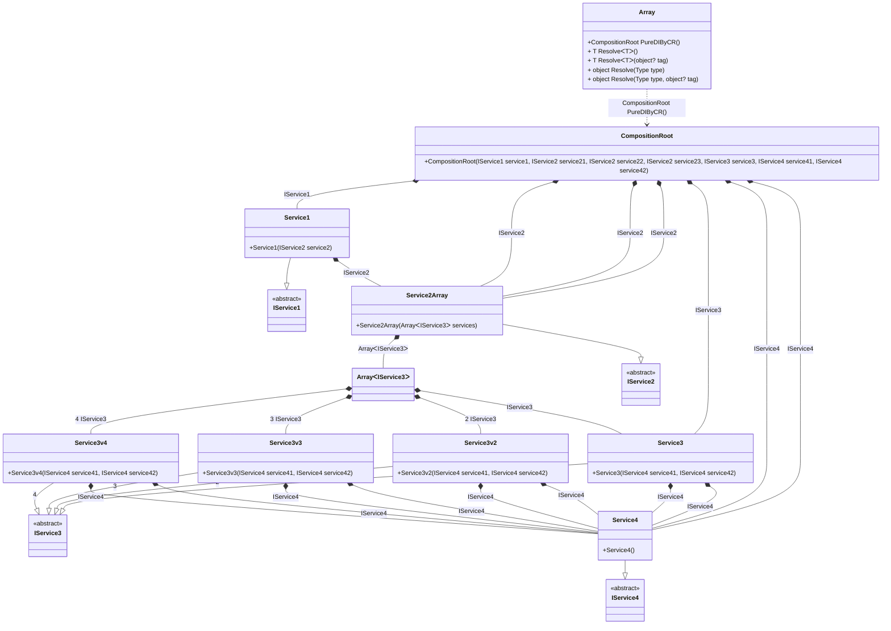

## Array details

Creating an object graph of 27 transient objects, including 4 transient array objects.

### Class diagram


### Generated code

<details>
<summary>Pure.DI-generated partial class Array</summary><blockquote>

```c#
/// <para>
/// <b>Composition roots</b><br/>
/// <list type="table">
/// <listheader>
/// <term>Root</term>
/// <description>Description</description>
/// </listheader>
/// <item>
/// <term>
/// <see cref="Pure.DI.Benchmarks.Model.CompositionRoot"/> <see cref="PureDIByCR()"/><br/>or using <see cref="Resolve{T}()"/> method: <c>Resolve&lt;Pure.DI.Benchmarks.Model.CompositionRoot&gt;()</c>
/// </term>
/// <description>
/// Provides a composition root of type <see cref="Pure.DI.Benchmarks.Model.CompositionRoot"/>.
/// </description>
/// </item>
/// </list>
/// </para>
/// </summary>
/// <example>
/// This shows how to get an instance of type <see cref="Pure.DI.Benchmarks.Model.CompositionRoot"/> using the composition root <see cref="PureDIByCR()"/>:
/// <code>
/// var composition = new Array();
/// var instance = composition.PureDIByCR();
/// </code>
/// </example>
/// <a href="https://mermaid.live/view#pako:eNrVV0tuwjAQvYrldRfUtkTLDhIqsasoy2wMWG1aQpATIiHEHbhLN70ON2l-dj61A04ipG6swJt58zwzGTtHuPLXDI7gakODwHbpO6eew51t-huMOacH4OwHg-Ek-Td5QhPL93Z-4Iauv537fghe95zZs8nBmqf4U7o-F_ZgAeYs8DcRu5x_Fpfzt5GZv_xkqzB5xi8gpO9_3DID4Zs5LQ47BsJ4aWFtgeaQQ7tIUD0VV1KVhZu9MR65K_YIgvwhjysAJACkR5AWwTUEC6QOEAGQepgCQfq9p80Rl0rGSUoWo3J3qatdrEMrTelUhslM8BgUpBWknEkBVFNY7FqlUxgVbdwoB2nllBgUmjI0E6ZKitAYNGjE1-VhrTysU4ar2WpdcEEXIQOZSCE0J1BJjVDfYk1yilVi9XmNes8sMRBLVGKJXizpV-wNUom2V7Uyc5H6eVOdGgUDzoJbdBmEnOZze5qvDTz1VmzLU--StjykNY_qFELjcpFAdbDGhZHZNCQojcISC_rHLPK1kgU1JJDNLivZC4HyKDHehzFLPqLTAd6VqjReu1LJHJEaVfW6YdwoijtCjUOrNaa6cgfC5lXv7ikO6bv7dtHcxTc_j-7lW-qUdBpna3z4qd742Pn2zyX4AD3GPequ4y-yowPDD-YxB44cuKb8y4EnePoFSCaMCw">Class diagram</a><br/>
/// This class was created by <a href="https://github.com/DevTeam/Pure.DI">Pure.DI</a> source code generator.
/// <seealso cref="Pure.DI.DI.Setup"/>
/// <seealso cref="Pure.DI.IConfiguration.Bind(object[])"/>
/// <seealso cref="Pure.DI.IConfiguration.Bind{T}(object[])"/>
[global::System.Diagnostics.CodeAnalysis.ExcludeFromCodeCoverage]
partial class Array
{
  private readonly Array _rootM03D15di;
  
  /// <summary>
  /// This constructor creates a new instance of <see cref="Array"/>.
  /// </summary>
  public Array()
  {
    _rootM03D15di = this;
  }
  
  /// <summary>
  /// This constructor creates a new instance of <see cref="Array"/> scope based on <paramref name="baseComposition"/>. This allows the <see cref="Lifetime.Scoped"/> life time to be applied.
  /// </summary>
  /// <param name="baseComposition">Base composition.</param>
  internal Array(Array baseComposition)
  {
    _rootM03D15di = baseComposition._rootM03D15di;
  }
  
  #region Composition Roots
  /// <summary>
  /// Provides a composition root of type <see cref="Pure.DI.Benchmarks.Model.CompositionRoot"/>.
  /// </summary>
  /// <example>
  /// This shows how to get an instance of type <see cref="Pure.DI.Benchmarks.Model.CompositionRoot"/>:
  /// <code>
  /// var composition = new Array();
  /// var instance = composition.PureDIByCR();
  /// </code>
  /// </example>
  #if NETSTANDARD2_0_OR_GREATER || NETCOREAPP || NET40_OR_GREATER || NET
  [global::System.Diagnostics.Contracts.Pure]
  #endif
  public partial Pure.DI.Benchmarks.Model.CompositionRoot PureDIByCR()
  {
    return new Pure.DI.Benchmarks.Model.CompositionRoot(new Pure.DI.Benchmarks.Model.Service1(new Pure.DI.Benchmarks.Model.Service2Array(new Pure.DI.Benchmarks.Model.IService3[4] { new Pure.DI.Benchmarks.Model.Service3(new Pure.DI.Benchmarks.Model.Service4(), new Pure.DI.Benchmarks.Model.Service4()), new Pure.DI.Benchmarks.Model.Service3v2(new Pure.DI.Benchmarks.Model.Service4(), new Pure.DI.Benchmarks.Model.Service4()), new Pure.DI.Benchmarks.Model.Service3v3(new Pure.DI.Benchmarks.Model.Service4(), new Pure.DI.Benchmarks.Model.Service4()), new Pure.DI.Benchmarks.Model.Service3v4(new Pure.DI.Benchmarks.Model.Service4(), new Pure.DI.Benchmarks.Model.Service4()) })), new Pure.DI.Benchmarks.Model.Service2Array(new Pure.DI.Benchmarks.Model.IService3[4] { new Pure.DI.Benchmarks.Model.Service3(new Pure.DI.Benchmarks.Model.Service4(), new Pure.DI.Benchmarks.Model.Service4()), new Pure.DI.Benchmarks.Model.Service3v2(new Pure.DI.Benchmarks.Model.Service4(), new Pure.DI.Benchmarks.Model.Service4()), new Pure.DI.Benchmarks.Model.Service3v3(new Pure.DI.Benchmarks.Model.Service4(), new Pure.DI.Benchmarks.Model.Service4()), new Pure.DI.Benchmarks.Model.Service3v4(new Pure.DI.Benchmarks.Model.Service4(), new Pure.DI.Benchmarks.Model.Service4()) }), new Pure.DI.Benchmarks.Model.Service2Array(new Pure.DI.Benchmarks.Model.IService3[4] { new Pure.DI.Benchmarks.Model.Service3(new Pure.DI.Benchmarks.Model.Service4(), new Pure.DI.Benchmarks.Model.Service4()), new Pure.DI.Benchmarks.Model.Service3v2(new Pure.DI.Benchmarks.Model.Service4(), new Pure.DI.Benchmarks.Model.Service4()), new Pure.DI.Benchmarks.Model.Service3v3(new Pure.DI.Benchmarks.Model.Service4(), new Pure.DI.Benchmarks.Model.Service4()), new Pure.DI.Benchmarks.Model.Service3v4(new Pure.DI.Benchmarks.Model.Service4(), new Pure.DI.Benchmarks.Model.Service4()) }), new Pure.DI.Benchmarks.Model.Service2Array(new Pure.DI.Benchmarks.Model.IService3[4] { new Pure.DI.Benchmarks.Model.Service3(new Pure.DI.Benchmarks.Model.Service4(), new Pure.DI.Benchmarks.Model.Service4()), new Pure.DI.Benchmarks.Model.Service3v2(new Pure.DI.Benchmarks.Model.Service4(), new Pure.DI.Benchmarks.Model.Service4()), new Pure.DI.Benchmarks.Model.Service3v3(new Pure.DI.Benchmarks.Model.Service4(), new Pure.DI.Benchmarks.Model.Service4()), new Pure.DI.Benchmarks.Model.Service3v4(new Pure.DI.Benchmarks.Model.Service4(), new Pure.DI.Benchmarks.Model.Service4()) }), new Pure.DI.Benchmarks.Model.Service3(new Pure.DI.Benchmarks.Model.Service4(), new Pure.DI.Benchmarks.Model.Service4()), new Pure.DI.Benchmarks.Model.Service4(), new Pure.DI.Benchmarks.Model.Service4());
  }
  #endregion
  
  #region API
  /// <summary>
  /// Resolves the composition root.
  /// </summary>
  /// <typeparam name="T">The type of the composition root.</typeparam>
  /// <returns>A composition root.</returns>
  #if NETSTANDARD2_0_OR_GREATER || NETCOREAPP || NET40_OR_GREATER || NET
  [global::System.Diagnostics.Contracts.Pure]
  #endif
  public T Resolve<T>()
  {
    return ResolverM03D15di<T>.Value.Resolve(this);
  }
  
  /// <summary>
  /// Resolves the composition root by tag.
  /// </summary>
  /// <typeparam name="T">The type of the composition root.</typeparam>
  /// <param name="tag">The tag of a composition root.</param>
  /// <returns>A composition root.</returns>
  #if NETSTANDARD2_0_OR_GREATER || NETCOREAPP || NET40_OR_GREATER || NET
  [global::System.Diagnostics.Contracts.Pure]
  #endif
  public T Resolve<T>(object? tag)
  {
    return ResolverM03D15di<T>.Value.ResolveByTag(this, tag);
  }
  
  /// <summary>
  /// Resolves the composition root.
  /// </summary>
  /// <param name="type">The type of the composition root.</param>
  /// <returns>A composition root.</returns>
  #if NETSTANDARD2_0_OR_GREATER || NETCOREAPP || NET40_OR_GREATER || NET
  [global::System.Diagnostics.Contracts.Pure]
  #endif
  public object Resolve(global::System.Type type)
  {
    var index = (int)(_bucketSizeM03D15di * ((uint)global::System.Runtime.CompilerServices.RuntimeHelpers.GetHashCode(type) % 1));
    var finish = index + _bucketSizeM03D15di;
    do {
      ref var pair = ref _bucketsM03D15di[index];
      if (ReferenceEquals(pair.Key, type))
      {
        return pair.Value.Resolve(this);
      }
    } while (++index < finish);
    
    throw new global::System.InvalidOperationException($"Cannot resolve composition root of type {type}.");
  }
  
  /// <summary>
  /// Resolves the composition root by tag.
  /// </summary>
  /// <param name="type">The type of the composition root.</param>
  /// <param name="tag">The tag of a composition root.</param>
  /// <returns>A composition root.</returns>
  #if NETSTANDARD2_0_OR_GREATER || NETCOREAPP || NET40_OR_GREATER || NET
  [global::System.Diagnostics.Contracts.Pure]
  #endif
  public object Resolve(global::System.Type type, object? tag)
  {
    var index = (int)(_bucketSizeM03D15di * ((uint)global::System.Runtime.CompilerServices.RuntimeHelpers.GetHashCode(type) % 1));
    var finish = index + _bucketSizeM03D15di;
    do {
      ref var pair = ref _bucketsM03D15di[index];
      if (ReferenceEquals(pair.Key, type))
      {
        return pair.Value.ResolveByTag(this, tag);
      }
    } while (++index < finish);
    
    throw new global::System.InvalidOperationException($"Cannot resolve composition root \"{tag}\" of type {type}.");
  }
  #endregion
  
  /// <summary>
  /// This method provides a class diagram in mermaid format. To see this diagram, simply call the method and copy the text to this site https://mermaid.live/.
  /// </summary>
  public override string ToString()
  {
    return
      "classDiagram\n" +
        "  class Array {\n" +
          "    +CompositionRoot PureDIByCR()\n" +
          "    + T ResolveᐸTᐳ()\n" +
          "    + T ResolveᐸTᐳ(object? tag)\n" +
          "    + object Resolve(Type type)\n" +
          "    + object Resolve(Type type, object? tag)\n" +
        "  }\n" +
        "  class CompositionRoot {\n" +
          "    +CompositionRoot(IService1 service1, IService2 service21, IService2 service22, IService2 service23, IService3 service3, IService4 service41, IService4 service42)\n" +
        "  }\n" +
        "  class ArrayᐸIService3ᐳ\n" +
        "  Service1 --|> IService1 : \n" +
        "  class Service1 {\n" +
          "    +Service1(IService2 service2)\n" +
        "  }\n" +
        "  Service2Array --|> IService2 : \n" +
        "  class Service2Array {\n" +
          "    +Service2Array(ArrayᐸIService3ᐳ services)\n" +
        "  }\n" +
        "  Service3 --|> IService3 : \n" +
        "  class Service3 {\n" +
          "    +Service3(IService4 service41, IService4 service42)\n" +
        "  }\n" +
        "  Service3v2 --|> IService3 : 2 \n" +
        "  class Service3v2 {\n" +
          "    +Service3v2(IService4 service41, IService4 service42)\n" +
        "  }\n" +
        "  Service3v3 --|> IService3 : 3 \n" +
        "  class Service3v3 {\n" +
          "    +Service3v3(IService4 service41, IService4 service42)\n" +
        "  }\n" +
        "  Service3v4 --|> IService3 : 4 \n" +
        "  class Service3v4 {\n" +
          "    +Service3v4(IService4 service41, IService4 service42)\n" +
        "  }\n" +
        "  Service4 --|> IService4 : \n" +
        "  class Service4 {\n" +
          "    +Service4()\n" +
        "  }\n" +
        "  class IService1 {\n" +
          "    <<abstract>>\n" +
        "  }\n" +
        "  class IService2 {\n" +
          "    <<abstract>>\n" +
        "  }\n" +
        "  class IService3 {\n" +
          "    <<abstract>>\n" +
        "  }\n" +
        "  class IService4 {\n" +
          "    <<abstract>>\n" +
        "  }\n" +
        "  CompositionRoot *--  Service1 : IService1\n" +
        "  CompositionRoot *--  Service2Array : IService2\n" +
        "  CompositionRoot *--  Service2Array : IService2\n" +
        "  CompositionRoot *--  Service2Array : IService2\n" +
        "  CompositionRoot *--  Service3 : IService3\n" +
        "  CompositionRoot *--  Service4 : IService4\n" +
        "  CompositionRoot *--  Service4 : IService4\n" +
        "  ArrayᐸIService3ᐳ *--  Service3 : IService3\n" +
        "  ArrayᐸIService3ᐳ *--  Service3v2 : 2  IService3\n" +
        "  ArrayᐸIService3ᐳ *--  Service3v3 : 3  IService3\n" +
        "  ArrayᐸIService3ᐳ *--  Service3v4 : 4  IService3\n" +
        "  Service1 *--  Service2Array : IService2\n" +
        "  Service2Array *--  ArrayᐸIService3ᐳ : ArrayᐸIService3ᐳ\n" +
        "  Service3 *--  Service4 : IService4\n" +
        "  Service3 *--  Service4 : IService4\n" +
        "  Service3v2 *--  Service4 : IService4\n" +
        "  Service3v2 *--  Service4 : IService4\n" +
        "  Service3v3 *--  Service4 : IService4\n" +
        "  Service3v3 *--  Service4 : IService4\n" +
        "  Service3v4 *--  Service4 : IService4\n" +
        "  Service3v4 *--  Service4 : IService4\n" +
        "  Array ..> CompositionRoot : CompositionRoot PureDIByCR()";
  }
  
  private readonly static int _bucketSizeM03D15di;
  private readonly static global::Pure.DI.Pair<global::System.Type, global::Pure.DI.IResolver<Array, object>>[] _bucketsM03D15di;
  
  static Array()
  {
    var valResolverM03D15di_0000 = new ResolverM03D15di_0000();
    ResolverM03D15di<Pure.DI.Benchmarks.Model.CompositionRoot>.Value = valResolverM03D15di_0000;
    _bucketsM03D15di = global::Pure.DI.Buckets<global::System.Type, global::Pure.DI.IResolver<Array, object>>.Create(
      1,
      out _bucketSizeM03D15di,
      new global::Pure.DI.Pair<global::System.Type, global::Pure.DI.IResolver<Array, object>>[1]
      {
         new global::Pure.DI.Pair<global::System.Type, global::Pure.DI.IResolver<Array, object>>(typeof(Pure.DI.Benchmarks.Model.CompositionRoot), valResolverM03D15di_0000)
      });
  }
  
  #region Resolvers
  private sealed class ResolverM03D15di<T>: global::Pure.DI.IResolver<Array, T>
  {
    public static global::Pure.DI.IResolver<Array, T> Value = new ResolverM03D15di<T>();
    
    public T Resolve(Array composite)
    {
      throw new global::System.InvalidOperationException($"Cannot resolve composition root of type {typeof(T)}.");
    }
    
    public T ResolveByTag(Array composite, object tag)
    {
      throw new global::System.InvalidOperationException($"Cannot resolve composition root \"{tag}\" of type {typeof(T)}.");
    }
  }
  
  private sealed class ResolverM03D15di_0000: global::Pure.DI.IResolver<Array, Pure.DI.Benchmarks.Model.CompositionRoot>
  {
    public Pure.DI.Benchmarks.Model.CompositionRoot Resolve(Array composition)
    {
      return composition.PureDIByCR();
    }
    
    public Pure.DI.Benchmarks.Model.CompositionRoot ResolveByTag(Array composition, object tag)
    {
      switch (tag)
      {
        case null:
          return composition.PureDIByCR();
      }
      throw new global::System.InvalidOperationException($"Cannot resolve composition root \"{tag}\" of type Pure.DI.Benchmarks.Model.CompositionRoot.");
    }
  }
  #endregion
}
```

</blockquote></details>

