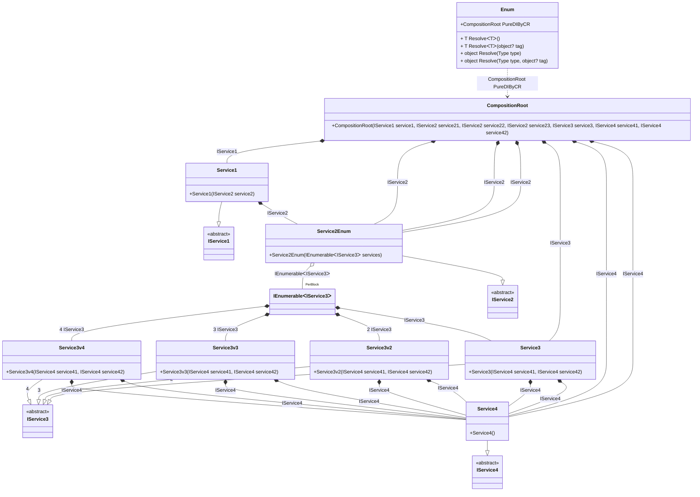

## Enum details

Creating an object graph of 12 transient objects, including 1 transient enumerable object.

### Class diagram


### Generated code

<details>
<summary>Pure.DI-generated partial class Enum</summary><blockquote>

```c#
/// <para>
/// Composition roots:<br/>
/// <list type="table">
/// <listheader>
/// <term>Root</term>
/// <description>Description</description>
/// </listheader>
/// <item>
/// <term>
/// <see cref="Pure.DI.Benchmarks.Model.CompositionRoot"/> PureDIByCR
/// </term>
/// <description>
/// </description>
/// </item>
/// </list>
/// </para>
/// <example>
/// This shows how to get an instance of type <see cref="Pure.DI.Benchmarks.Model.CompositionRoot"/> using the composition root <see cref="PureDIByCR"/>:
/// <code>
/// var composition = new Enum();
/// var instance = composition.PureDIByCR();
/// </code>
/// </example>
/// <a href="https://mermaid.live/view#pako:eNrVV0tuwjAQvYrldRfUtkTLDhIqsUOUZTYmWDQtwSgJkRDiDtylm16HmzQff0gaBxIipG6skDfz5nlmGDsH6PIlgwPormkY2h5dBdR3AmeT_Qbjzc4Hzq7X64_Sl-kTGlnc3_LQizy-mXEegekuYPZktLdm2gbMwYyFfB2z8-lnfj59Z69fsvX1qhlffDI3Sp_xG4jo6o9bbiB9c6f5fstAlCwtrC1QH7Jv65yUt38lPXm4yTsLYs9lzyAUDyKuBJAEkBlBRgSXECyRMkAkQMphNILMe5-kDcECulinBVPR0sIlNmqPGYGt176VJXasguUmeAg0dQG5zKcEionUe69SK41U_9aqQUY1mqBCUQYKVca8SJlhjUx8XSI2SsQmebiYsNaVl3QxaiATVQgVBFVSY9S12CY5xVVizXmNO88saSCWVIklZrGkW7E3SCXGXjXKFCJrBo9hPOA8uEUXYRRQMcDHYq3hKbdiW55yl7TlIa15qo4jNLwsEijO1qQwKpsNCfQ4vCBB_5ZE_adUNRsSqE5XZeyEoOY0abybllxiVmeTvBvCi2nbDaHKHSkRFq8hTfunYMCLzg6csmC05u6XA2vuQor3ltsSbt4f93vKs_zhvvdovsdXHFuP8tX3zmxm52tyRFaNhsS3_osKPsGki3zqLZPvtIMDow_mMwcOHLikQdKJR3j8BZG0lsI">Class diagram</a><br/>
/// This class was created by <a href="https://github.com/DevTeam/Pure.DI">Pure.DI</a> source code generator.
/// </summary>
/// <seealso cref="Pure.DI.DI.Setup"/>
[global::System.Diagnostics.CodeAnalysis.ExcludeFromCodeCoverage]
partial class Enum
{
  private readonly Enum _rootM03D09di;
  
  /// <summary>
  /// This constructor creates a new instance of <see cref="Enum"/>.
  /// </summary>
  public Enum()
  {
    _rootM03D09di = this;
  }
  
  /// <summary>
  /// This constructor creates a new instance of <see cref="Enum"/> scope based on <paramref name="baseComposition"/>. This allows the <see cref="Lifetime.Scoped"/> life time to be applied.
  /// </summary>
  /// <param name="baseComposition">Base composition.</param>
  internal Enum(Enum baseComposition)
  {
    _rootM03D09di = baseComposition._rootM03D09di;
  }
  
  #region Composition Roots
  #if NETSTANDARD2_0_OR_GREATER || NETCOREAPP || NET40_OR_GREATER || NET
  [global::System.Diagnostics.Contracts.Pure]
  #endif
  public partial Pure.DI.Benchmarks.Model.CompositionRoot PureDIByCR()
  {
    [global::System.Runtime.CompilerServices.MethodImpl((global::System.Runtime.CompilerServices.MethodImplOptions)0x200)]
    System.Collections.Generic.IEnumerable<Pure.DI.Benchmarks.Model.IService3> LocalperBlockM03D09di10_IEnumerable()
    {
        yield return new Pure.DI.Benchmarks.Model.Service3(new Pure.DI.Benchmarks.Model.Service4(), new Pure.DI.Benchmarks.Model.Service4());
        yield return new Pure.DI.Benchmarks.Model.Service3v2(new Pure.DI.Benchmarks.Model.Service4(), new Pure.DI.Benchmarks.Model.Service4());
        yield return new Pure.DI.Benchmarks.Model.Service3v3(new Pure.DI.Benchmarks.Model.Service4(), new Pure.DI.Benchmarks.Model.Service4());
        yield return new Pure.DI.Benchmarks.Model.Service3v4(new Pure.DI.Benchmarks.Model.Service4(), new Pure.DI.Benchmarks.Model.Service4());
    }
    var perBlockM03D09di10_IEnumerable = LocalperBlockM03D09di10_IEnumerable();
    return new Pure.DI.Benchmarks.Model.CompositionRoot(new Pure.DI.Benchmarks.Model.Service1(new Pure.DI.Benchmarks.Model.Service2Enum(perBlockM03D09di10_IEnumerable)), new Pure.DI.Benchmarks.Model.Service2Enum(perBlockM03D09di10_IEnumerable), new Pure.DI.Benchmarks.Model.Service2Enum(perBlockM03D09di10_IEnumerable), new Pure.DI.Benchmarks.Model.Service2Enum(perBlockM03D09di10_IEnumerable), new Pure.DI.Benchmarks.Model.Service3(new Pure.DI.Benchmarks.Model.Service4(), new Pure.DI.Benchmarks.Model.Service4()), new Pure.DI.Benchmarks.Model.Service4(), new Pure.DI.Benchmarks.Model.Service4());
  }
  #endregion
  
  #region API
  /// <summary>
  /// Resolves the composition root.
  /// </summary>
  /// <typeparam name="T">The type of the composition root.</typeparam>
  /// <returns>A composition root.</returns>
  #if NETSTANDARD2_0_OR_GREATER || NETCOREAPP || NET40_OR_GREATER || NET
  [global::System.Diagnostics.Contracts.Pure]
  #endif
  public T Resolve<T>()
  {
    return ResolverM03D09di<T>.Value.Resolve(this);
  }
  
  /// <summary>
  /// Resolves the composition root by tag.
  /// </summary>
  /// <typeparam name="T">The type of the composition root.</typeparam>
  /// <param name="tag">The tag of a composition root.</param>
  /// <returns>A composition root.</returns>
  #if NETSTANDARD2_0_OR_GREATER || NETCOREAPP || NET40_OR_GREATER || NET
  [global::System.Diagnostics.Contracts.Pure]
  #endif
  public T Resolve<T>(object? tag)
  {
    return ResolverM03D09di<T>.Value.ResolveByTag(this, tag);
  }
  
  /// <summary>
  /// Resolves the composition root.
  /// </summary>
  /// <param name="type">The type of the composition root.</param>
  /// <returns>A composition root.</returns>
  #if NETSTANDARD2_0_OR_GREATER || NETCOREAPP || NET40_OR_GREATER || NET
  [global::System.Diagnostics.Contracts.Pure]
  #endif
  public object Resolve(global::System.Type type)
  {
    var index = (int)(_bucketSizeM03D09di * ((uint)global::System.Runtime.CompilerServices.RuntimeHelpers.GetHashCode(type) % 1));
    var finish = index + _bucketSizeM03D09di;
    do {
      ref var pair = ref _bucketsM03D09di[index];
      if (ReferenceEquals(pair.Key, type))
      {
        return pair.Value.Resolve(this);
      }
    } while (++index < finish);
    
    throw new global::System.InvalidOperationException($"Cannot resolve composition root of type {type}.");
  }
  
  /// <summary>
  /// Resolves the composition root by tag.
  /// </summary>
  /// <param name="type">The type of the composition root.</param>
  /// <param name="tag">The tag of a composition root.</param>
  /// <returns>A composition root.</returns>
  #if NETSTANDARD2_0_OR_GREATER || NETCOREAPP || NET40_OR_GREATER || NET
  [global::System.Diagnostics.Contracts.Pure]
  #endif
  public object Resolve(global::System.Type type, object? tag)
  {
    var index = (int)(_bucketSizeM03D09di * ((uint)global::System.Runtime.CompilerServices.RuntimeHelpers.GetHashCode(type) % 1));
    var finish = index + _bucketSizeM03D09di;
    do {
      ref var pair = ref _bucketsM03D09di[index];
      if (ReferenceEquals(pair.Key, type))
      {
        return pair.Value.ResolveByTag(this, tag);
      }
    } while (++index < finish);
    
    throw new global::System.InvalidOperationException($"Cannot resolve composition root \"{tag}\" of type {type}.");
  }
  #endregion
  
  /// <summary>
  /// This method provides a class diagram in mermaid format. To see this diagram, simply call the method and copy the text to this site https://mermaid.live/.
  /// </summary>
  public override string ToString()
  {
    return
      "classDiagram\n" +
        "  class Enum {\n" +
          "    +CompositionRoot PureDIByCR\n" +
          "    + T ResolveᐸTᐳ()\n" +
          "    + T ResolveᐸTᐳ(object? tag)\n" +
          "    + object Resolve(Type type)\n" +
          "    + object Resolve(Type type, object? tag)\n" +
        "  }\n" +
        "  class CompositionRoot {\n" +
          "    +CompositionRoot(IService1 service1, IService2 service21, IService2 service22, IService2 service23, IService3 service3, IService4 service41, IService4 service42)\n" +
        "  }\n" +
        "  class IEnumerableᐸIService3ᐳ\n" +
        "  Service1 --|> IService1 : \n" +
        "  class Service1 {\n" +
          "    +Service1(IService2 service2)\n" +
        "  }\n" +
        "  Service2Enum --|> IService2 : \n" +
        "  class Service2Enum {\n" +
          "    +Service2Enum(IEnumerableᐸIService3ᐳ services)\n" +
        "  }\n" +
        "  Service3 --|> IService3 : \n" +
        "  class Service3 {\n" +
          "    +Service3(IService4 service41, IService4 service42)\n" +
        "  }\n" +
        "  Service3v2 --|> IService3 : 2 \n" +
        "  class Service3v2 {\n" +
          "    +Service3v2(IService4 service41, IService4 service42)\n" +
        "  }\n" +
        "  Service3v3 --|> IService3 : 3 \n" +
        "  class Service3v3 {\n" +
          "    +Service3v3(IService4 service41, IService4 service42)\n" +
        "  }\n" +
        "  Service3v4 --|> IService3 : 4 \n" +
        "  class Service3v4 {\n" +
          "    +Service3v4(IService4 service41, IService4 service42)\n" +
        "  }\n" +
        "  Service4 --|> IService4 : \n" +
        "  class Service4 {\n" +
          "    +Service4()\n" +
        "  }\n" +
        "  class IService1 {\n" +
          "    <<abstract>>\n" +
        "  }\n" +
        "  class IService2 {\n" +
          "    <<abstract>>\n" +
        "  }\n" +
        "  class IService3 {\n" +
          "    <<abstract>>\n" +
        "  }\n" +
        "  class IService4 {\n" +
          "    <<abstract>>\n" +
        "  }\n" +
        "  CompositionRoot *--  Service1 : IService1\n" +
        "  CompositionRoot *--  Service2Enum : IService2\n" +
        "  CompositionRoot *--  Service2Enum : IService2\n" +
        "  CompositionRoot *--  Service2Enum : IService2\n" +
        "  CompositionRoot *--  Service3 : IService3\n" +
        "  CompositionRoot *--  Service4 : IService4\n" +
        "  CompositionRoot *--  Service4 : IService4\n" +
        "  IEnumerableᐸIService3ᐳ *--  Service3 : IService3\n" +
        "  IEnumerableᐸIService3ᐳ *--  Service3v2 : 2  IService3\n" +
        "  IEnumerableᐸIService3ᐳ *--  Service3v3 : 3  IService3\n" +
        "  IEnumerableᐸIService3ᐳ *--  Service3v4 : 4  IService3\n" +
        "  Service1 *--  Service2Enum : IService2\n" +
        "  Service2Enum o--  \"PerBlock\" IEnumerableᐸIService3ᐳ : IEnumerableᐸIService3ᐳ\n" +
        "  Service3 *--  Service4 : IService4\n" +
        "  Service3 *--  Service4 : IService4\n" +
        "  Service3v2 *--  Service4 : IService4\n" +
        "  Service3v2 *--  Service4 : IService4\n" +
        "  Service3v3 *--  Service4 : IService4\n" +
        "  Service3v3 *--  Service4 : IService4\n" +
        "  Service3v4 *--  Service4 : IService4\n" +
        "  Service3v4 *--  Service4 : IService4\n" +
        "  Enum ..> CompositionRoot : CompositionRoot PureDIByCR";
  }
  
  private readonly static int _bucketSizeM03D09di;
  private readonly static global::Pure.DI.Pair<global::System.Type, global::Pure.DI.IResolver<Enum, object>>[] _bucketsM03D09di;
  
  static Enum()
  {
    var valResolverM03D09di_0000 = new ResolverM03D09di_0000();
    ResolverM03D09di<Pure.DI.Benchmarks.Model.CompositionRoot>.Value = valResolverM03D09di_0000;
    _bucketsM03D09di = global::Pure.DI.Buckets<global::System.Type, global::Pure.DI.IResolver<Enum, object>>.Create(
      1,
      out _bucketSizeM03D09di,
      new global::Pure.DI.Pair<global::System.Type, global::Pure.DI.IResolver<Enum, object>>[1]
      {
         new global::Pure.DI.Pair<global::System.Type, global::Pure.DI.IResolver<Enum, object>>(typeof(Pure.DI.Benchmarks.Model.CompositionRoot), valResolverM03D09di_0000)
      });
  }
  
  #region Resolvers
  private sealed class ResolverM03D09di<T>: global::Pure.DI.IResolver<Enum, T>
  {
    public static global::Pure.DI.IResolver<Enum, T> Value = new ResolverM03D09di<T>();
    
    public T Resolve(Enum composite)
    {
      throw new global::System.InvalidOperationException($"Cannot resolve composition root of type {typeof(T)}.");
    }
    
    public T ResolveByTag(Enum composite, object tag)
    {
      throw new global::System.InvalidOperationException($"Cannot resolve composition root \"{tag}\" of type {typeof(T)}.");
    }
  }
  
  private sealed class ResolverM03D09di_0000: global::Pure.DI.IResolver<Enum, Pure.DI.Benchmarks.Model.CompositionRoot>
  {
    public Pure.DI.Benchmarks.Model.CompositionRoot Resolve(Enum composition)
    {
      return composition.PureDIByCR();
    }
    
    public Pure.DI.Benchmarks.Model.CompositionRoot ResolveByTag(Enum composition, object tag)
    {
      switch (tag)
      {
        case null:
          return composition.PureDIByCR();
      }
      throw new global::System.InvalidOperationException($"Cannot resolve composition root \"{tag}\" of type Pure.DI.Benchmarks.Model.CompositionRoot.");
    }
  }
  #endregion
}
```

</blockquote></details>

