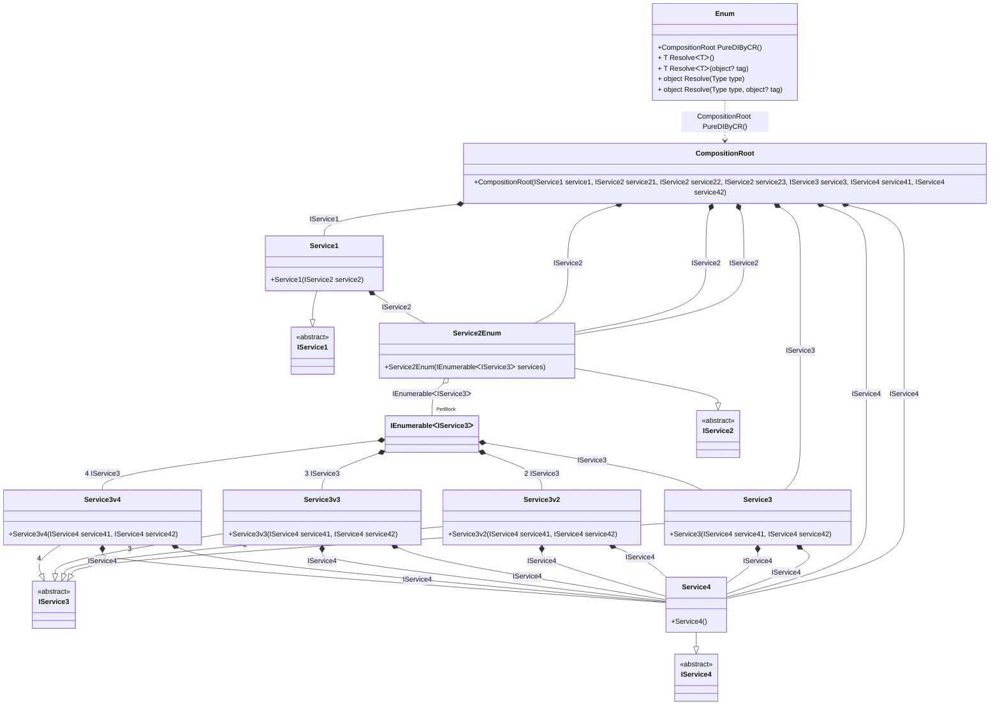

## Enum details

Creating an object graph of 12 transient objects, including 1 transient enumerable object.

### Class diagram


### Generated code

<details>
<summary>Pure.DI-generated partial class Enum</summary><blockquote>

```c#
partial class Enum
{
  private readonly Enum _rootM03D21di;
  
  public Enum()
  {
    _rootM03D21di = this;
  }
  
  internal Enum(Enum baseComposition)
  {
    _rootM03D21di = baseComposition._rootM03D21di;
  }
  
  public partial Pure.DI.Benchmarks.Model.CompositionRoot PureDIByCR()
  {
    [global::System.Runtime.CompilerServices.MethodImpl((global::System.Runtime.CompilerServices.MethodImplOptions)0x200)]
    System.Collections.Generic.IEnumerable<Pure.DI.Benchmarks.Model.IService3> LocalperBlockM03D21di10_IEnumerable()
    {
        yield return new Pure.DI.Benchmarks.Model.Service3(new Pure.DI.Benchmarks.Model.Service4(), new Pure.DI.Benchmarks.Model.Service4());
        yield return new Pure.DI.Benchmarks.Model.Service3v2(new Pure.DI.Benchmarks.Model.Service4(), new Pure.DI.Benchmarks.Model.Service4());
        yield return new Pure.DI.Benchmarks.Model.Service3v3(new Pure.DI.Benchmarks.Model.Service4(), new Pure.DI.Benchmarks.Model.Service4());
        yield return new Pure.DI.Benchmarks.Model.Service3v4(new Pure.DI.Benchmarks.Model.Service4(), new Pure.DI.Benchmarks.Model.Service4());
    }
    System.Collections.Generic.IEnumerable<Pure.DI.Benchmarks.Model.IService3> perBlockM03D21di10_IEnumerable = LocalperBlockM03D21di10_IEnumerable();
    return new Pure.DI.Benchmarks.Model.CompositionRoot(new Pure.DI.Benchmarks.Model.Service1(new Pure.DI.Benchmarks.Model.Service2Enum(perBlockM03D21di10_IEnumerable)), new Pure.DI.Benchmarks.Model.Service2Enum(perBlockM03D21di10_IEnumerable), new Pure.DI.Benchmarks.Model.Service2Enum(perBlockM03D21di10_IEnumerable), new Pure.DI.Benchmarks.Model.Service2Enum(perBlockM03D21di10_IEnumerable), new Pure.DI.Benchmarks.Model.Service3(new Pure.DI.Benchmarks.Model.Service4(), new Pure.DI.Benchmarks.Model.Service4()), new Pure.DI.Benchmarks.Model.Service4(), new Pure.DI.Benchmarks.Model.Service4());
  }
  
  public T Resolve<T>()
  {
    return ResolverM03D21di<T>.Value.Resolve(this);
  }
  
  public T Resolve<T>(object? tag)
  {
    return ResolverM03D21di<T>.Value.ResolveByTag(this, tag);
  }
  
  public object Resolve(global::System.Type type)
  {
    var index = (int)(_bucketSizeM03D21di * ((uint)global::System.Runtime.CompilerServices.RuntimeHelpers.GetHashCode(type) % 1));
    var finish = index + _bucketSizeM03D21di;
    do {
      ref var pair = ref _bucketsM03D21di[index];
      if (ReferenceEquals(pair.Key, type))
      {
        return pair.Value.Resolve(this);
      }
    } while (++index < finish);
    
    throw new global::System.InvalidOperationException($"Cannot resolve composition root of type {type}.");
  }
  
  public object Resolve(global::System.Type type, object? tag)
  {
    var index = (int)(_bucketSizeM03D21di * ((uint)global::System.Runtime.CompilerServices.RuntimeHelpers.GetHashCode(type) % 1));
    var finish = index + _bucketSizeM03D21di;
    do {
      ref var pair = ref _bucketsM03D21di[index];
      if (ReferenceEquals(pair.Key, type))
      {
        return pair.Value.ResolveByTag(this, tag);
      }
    } while (++index < finish);
    
    throw new global::System.InvalidOperationException($"Cannot resolve composition root \"{tag}\" of type {type}.");
  }
  
  public override string ToString()
  {
    return
      "classDiagram\n" +
        "  class Enum {\n" +
          "    +CompositionRoot PureDIByCR()\n" +
          "    + T ResolveᐸTᐳ()\n" +
          "    + T ResolveᐸTᐳ(object? tag)\n" +
          "    + object Resolve(Type type)\n" +
          "    + object Resolve(Type type, object? tag)\n" +
        "  }\n" +
        "  class CompositionRoot {\n" +
          "    +CompositionRoot(IService1 service1, IService2 service21, IService2 service22, IService2 service23, IService3 service3, IService4 service41, IService4 service42)\n" +
        "  }\n" +
        "  class IEnumerableᐸIService3ᐳ\n" +
        "  Service1 --|> IService1 : \n" +
        "  class Service1 {\n" +
          "    +Service1(IService2 service2)\n" +
        "  }\n" +
        "  Service2Enum --|> IService2 : \n" +
        "  class Service2Enum {\n" +
          "    +Service2Enum(IEnumerableᐸIService3ᐳ services)\n" +
        "  }\n" +
        "  Service3 --|> IService3 : \n" +
        "  class Service3 {\n" +
          "    +Service3(IService4 service41, IService4 service42)\n" +
        "  }\n" +
        "  Service3v2 --|> IService3 : 2 \n" +
        "  class Service3v2 {\n" +
          "    +Service3v2(IService4 service41, IService4 service42)\n" +
        "  }\n" +
        "  Service3v3 --|> IService3 : 3 \n" +
        "  class Service3v3 {\n" +
          "    +Service3v3(IService4 service41, IService4 service42)\n" +
        "  }\n" +
        "  Service3v4 --|> IService3 : 4 \n" +
        "  class Service3v4 {\n" +
          "    +Service3v4(IService4 service41, IService4 service42)\n" +
        "  }\n" +
        "  Service4 --|> IService4 : \n" +
        "  class Service4 {\n" +
          "    +Service4()\n" +
        "  }\n" +
        "  class IService1 {\n" +
          "    <<abstract>>\n" +
        "  }\n" +
        "  class IService2 {\n" +
          "    <<abstract>>\n" +
        "  }\n" +
        "  class IService3 {\n" +
          "    <<abstract>>\n" +
        "  }\n" +
        "  class IService4 {\n" +
          "    <<abstract>>\n" +
        "  }\n" +
        "  CompositionRoot *--  Service1 : IService1\n" +
        "  CompositionRoot *--  Service2Enum : IService2\n" +
        "  CompositionRoot *--  Service2Enum : IService2\n" +
        "  CompositionRoot *--  Service2Enum : IService2\n" +
        "  CompositionRoot *--  Service3 : IService3\n" +
        "  CompositionRoot *--  Service4 : IService4\n" +
        "  CompositionRoot *--  Service4 : IService4\n" +
        "  IEnumerableᐸIService3ᐳ *--  Service3 : IService3\n" +
        "  IEnumerableᐸIService3ᐳ *--  Service3v2 : 2  IService3\n" +
        "  IEnumerableᐸIService3ᐳ *--  Service3v3 : 3  IService3\n" +
        "  IEnumerableᐸIService3ᐳ *--  Service3v4 : 4  IService3\n" +
        "  Service1 *--  Service2Enum : IService2\n" +
        "  Service2Enum o--  \"PerBlock\" IEnumerableᐸIService3ᐳ : IEnumerableᐸIService3ᐳ\n" +
        "  Service3 *--  Service4 : IService4\n" +
        "  Service3 *--  Service4 : IService4\n" +
        "  Service3v2 *--  Service4 : IService4\n" +
        "  Service3v2 *--  Service4 : IService4\n" +
        "  Service3v3 *--  Service4 : IService4\n" +
        "  Service3v3 *--  Service4 : IService4\n" +
        "  Service3v4 *--  Service4 : IService4\n" +
        "  Service3v4 *--  Service4 : IService4\n" +
        "  Enum ..> CompositionRoot : CompositionRoot PureDIByCR()";
  }
  
  private readonly static int _bucketSizeM03D21di;
  private readonly static global::Pure.DI.Pair<global::System.Type, global::Pure.DI.IResolver<Enum, object>>[] _bucketsM03D21di;
  
  static Enum()
  {
    var valResolverM03D21di_0000 = new ResolverM03D21di_0000();
    ResolverM03D21di<Pure.DI.Benchmarks.Model.CompositionRoot>.Value = valResolverM03D21di_0000;
    _bucketsM03D21di = global::Pure.DI.Buckets<global::System.Type, global::Pure.DI.IResolver<Enum, object>>.Create(
      1,
      out _bucketSizeM03D21di,
      new global::Pure.DI.Pair<global::System.Type, global::Pure.DI.IResolver<Enum, object>>[1]
      {
         new global::Pure.DI.Pair<global::System.Type, global::Pure.DI.IResolver<Enum, object>>(typeof(Pure.DI.Benchmarks.Model.CompositionRoot), valResolverM03D21di_0000)
      });
  }
  
  private sealed class ResolverM03D21di<T>: global::Pure.DI.IResolver<Enum, T>
  {
    public static global::Pure.DI.IResolver<Enum, T> Value = new ResolverM03D21di<T>();
    
    public T Resolve(Enum composite)
    {
      throw new global::System.InvalidOperationException($"Cannot resolve composition root of type {typeof(T)}.");
    }
    
    public T ResolveByTag(Enum composite, object tag)
    {
      throw new global::System.InvalidOperationException($"Cannot resolve composition root \"{tag}\" of type {typeof(T)}.");
    }
  }
  
  private sealed class ResolverM03D21di_0000: global::Pure.DI.IResolver<Enum, Pure.DI.Benchmarks.Model.CompositionRoot>
  {
    public Pure.DI.Benchmarks.Model.CompositionRoot Resolve(Enum composition)
    {
      return composition.PureDIByCR();
    }
    
    public Pure.DI.Benchmarks.Model.CompositionRoot ResolveByTag(Enum composition, object tag)
    {
      switch (tag)
      {
        case null:
          return composition.PureDIByCR();
      }
      throw new global::System.InvalidOperationException($"Cannot resolve composition root \"{tag}\" of type Pure.DI.Benchmarks.Model.CompositionRoot.");
    }
  }
}
```

</blockquote></details>

