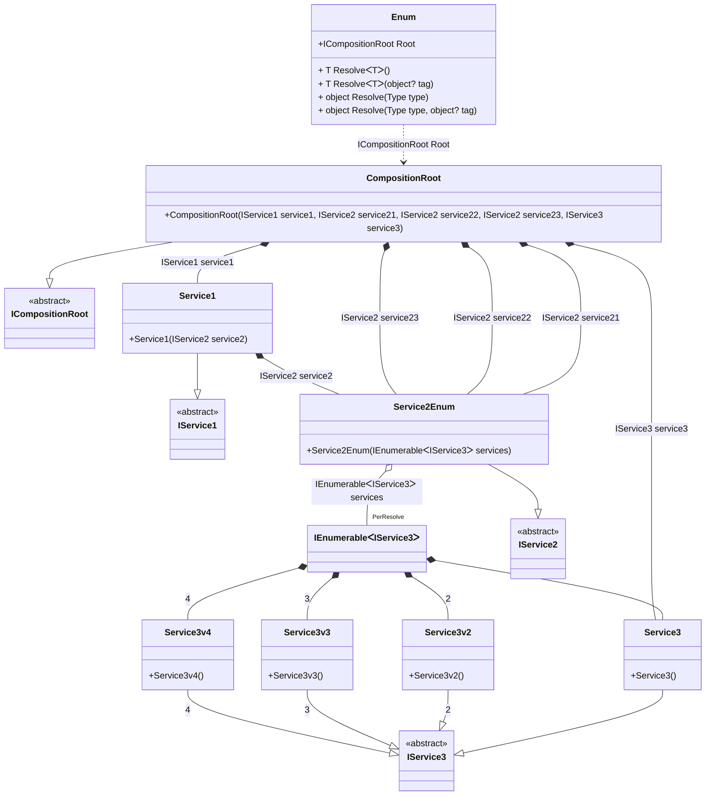

## Enum details

Creating an object graph of 12 transient objects, including 1 transient enumerable object.

### Class diagram


### Generated code

<details>
<summary>Pure.DI-generated partial class Enum</summary><blockquote>

```c#
partial class Enum
{
  public Enum()
  {
  }
  
  internal Enum(Enum parent)
  {
  }
  
  #region Composition Roots
  public Pure.DI.Benchmarks.Model.ICompositionRoot Root
  {
    [global::System.Runtime.CompilerServices.MethodImpl((global::System.Runtime.CompilerServices.MethodImplOptions)0x300)]
    get
    {
      System.Collections.Generic.IEnumerable<Pure.DI.Benchmarks.Model.IService3> LocalFunc_perResolveM08D05di6()
      {
          var transientM08D05di20 = new Pure.DI.Benchmarks.Model.Service3();
          yield return transientM08D05di20;
          var transientM08D05di21 = new Pure.DI.Benchmarks.Model.Service3v2();
          yield return transientM08D05di21;
          var transientM08D05di22 = new Pure.DI.Benchmarks.Model.Service3v3();
          yield return transientM08D05di22;
          var transientM08D05di23 = new Pure.DI.Benchmarks.Model.Service3v4();
          yield return transientM08D05di23;
      }
      var perResolveM08D05di6 = LocalFunc_perResolveM08D05di6();
      var transientM08D05di19 = new Pure.DI.Benchmarks.Model.Service2Enum(perResolveM08D05di6);
      var transientM08D05di1 = new Pure.DI.Benchmarks.Model.Service1(transientM08D05di19);
      var transientM08D05di2 = new Pure.DI.Benchmarks.Model.Service2Enum(perResolveM08D05di6);
      var transientM08D05di3 = new Pure.DI.Benchmarks.Model.Service2Enum(perResolveM08D05di6);
      var transientM08D05di4 = new Pure.DI.Benchmarks.Model.Service2Enum(perResolveM08D05di6);
      var transientM08D05di5 = new Pure.DI.Benchmarks.Model.Service3();
      var transientM08D05di0 = new Pure.DI.Benchmarks.Model.CompositionRoot(transientM08D05di1, transientM08D05di4, transientM08D05di3, transientM08D05di2, transientM08D05di5);
      return transientM08D05di0;
    }
  }
  #endregion
  
  #region API
  #if NETSTANDARD2_0_OR_GREATER || NETCOREAPP || NET40_OR_GREATER
  [global::System.Diagnostics.Contracts.Pure]
  #endif
  [global::System.Runtime.CompilerServices.MethodImpl((global::System.Runtime.CompilerServices.MethodImplOptions)0x300)]
  public T Resolve<T>()
  {
    return ResolverM08D05di<T>.Value.Resolve(this);
  }
  
  #if NETSTANDARD2_0_OR_GREATER || NETCOREAPP || NET40_OR_GREATER
  [global::System.Diagnostics.Contracts.Pure]
  #endif
  [global::System.Runtime.CompilerServices.MethodImpl((global::System.Runtime.CompilerServices.MethodImplOptions)0x300)]
  public T Resolve<T>(object? tag)
  {
    return ResolverM08D05di<T>.Value.ResolveByTag(this, tag);
  }
  
  #if NETSTANDARD2_0_OR_GREATER || NETCOREAPP || NET40_OR_GREATER
  [global::System.Diagnostics.Contracts.Pure]
  #endif
  [global::System.Runtime.CompilerServices.MethodImpl((global::System.Runtime.CompilerServices.MethodImplOptions)0x300)]
  public object Resolve(global::System.Type type)
  {
    var index = (int)(_bucketSizeM08D05di * ((uint)global::System.Runtime.CompilerServices.RuntimeHelpers.GetHashCode(type) % 1));
    var finish = index + _bucketSizeM08D05di;
    do {
      ref var pair = ref _bucketsM08D05di[index];
      if (ReferenceEquals(pair.Key, type))
      {
        return pair.Value.Resolve(this);
      }
    } while (++index < finish);
    
    throw new global::System.InvalidOperationException($"Cannot resolve composition root of type {type}.");
  }
  
  #if NETSTANDARD2_0_OR_GREATER || NETCOREAPP || NET40_OR_GREATER
  [global::System.Diagnostics.Contracts.Pure]
  #endif
  [global::System.Runtime.CompilerServices.MethodImpl((global::System.Runtime.CompilerServices.MethodImplOptions)0x300)]
  public object Resolve(global::System.Type type, object? tag)
  {
    var index = (int)(_bucketSizeM08D05di * ((uint)global::System.Runtime.CompilerServices.RuntimeHelpers.GetHashCode(type) % 1));
    var finish = index + _bucketSizeM08D05di;
    do {
      ref var pair = ref _bucketsM08D05di[index];
      if (ReferenceEquals(pair.Key, type))
      {
        return pair.Value.ResolveByTag(this, tag);
      }
    } while (++index < finish);
    
    throw new global::System.InvalidOperationException($"Cannot resolve composition root \"{tag}\" of type {type}.");
  }
  #endregion
  
  public override string ToString()
  {
    return
      "classDiagram\n" +
        "  class Enum {\n" +
          "    +ICompositionRoot Root\n" +
          "    + T ResolveᐸTᐳ()\n" +
          "    + T ResolveᐸTᐳ(object? tag)\n" +
          "    + object Resolve(Type type)\n" +
          "    + object Resolve(Type type, object? tag)\n" +
        "  }\n" +
        "  class IEnumerableᐸIService3ᐳ\n" +
        "  CompositionRoot --|> ICompositionRoot : \n" +
        "  class CompositionRoot {\n" +
          "    +CompositionRoot(IService1 service1, IService2 service21, IService2 service22, IService2 service23, IService3 service3)\n" +
        "  }\n" +
        "  Service1 --|> IService1 : \n" +
        "  class Service1 {\n" +
          "    +Service1(IService2 service2)\n" +
        "  }\n" +
        "  Service2Enum --|> IService2 : \n" +
        "  class Service2Enum {\n" +
          "    +Service2Enum(IEnumerableᐸIService3ᐳ services)\n" +
        "  }\n" +
        "  Service3 --|> IService3 : \n" +
        "  class Service3 {\n" +
          "    +Service3()\n" +
        "  }\n" +
        "  Service3v2 --|> IService3 : 2 \n" +
        "  class Service3v2 {\n" +
          "    +Service3v2()\n" +
        "  }\n" +
        "  Service3v3 --|> IService3 : 3 \n" +
        "  class Service3v3 {\n" +
          "    +Service3v3()\n" +
        "  }\n" +
        "  Service3v4 --|> IService3 : 4 \n" +
        "  class Service3v4 {\n" +
          "    +Service3v4()\n" +
        "  }\n" +
        "  class ICompositionRoot {\n" +
          "    <<abstract>>\n" +
        "  }\n" +
        "  class IService1 {\n" +
          "    <<abstract>>\n" +
        "  }\n" +
        "  class IService2 {\n" +
          "    <<abstract>>\n" +
        "  }\n" +
        "  class IService3 {\n" +
          "    <<abstract>>\n" +
        "  }\n" +
        "  IEnumerableᐸIService3ᐳ *--  Service3 : \n" +
        "  IEnumerableᐸIService3ᐳ *--  Service3v2 : 2  \n" +
        "  IEnumerableᐸIService3ᐳ *--  Service3v3 : 3  \n" +
        "  IEnumerableᐸIService3ᐳ *--  Service3v4 : 4  \n" +
        "  CompositionRoot *--  Service1 : IService1 service1\n" +
        "  CompositionRoot *--  Service2Enum : IService2 service21\n" +
        "  CompositionRoot *--  Service2Enum : IService2 service22\n" +
        "  CompositionRoot *--  Service2Enum : IService2 service23\n" +
        "  CompositionRoot *--  Service3 : IService3 service3\n" +
        "  Service1 *--  Service2Enum : IService2 service2\n" +
        "  Service2Enum o--  \"PerResolve\" IEnumerableᐸIService3ᐳ : IEnumerableᐸIService3ᐳ services\n" +
        "  Enum ..> CompositionRoot : ICompositionRoot Root";
  }
  
  private readonly static int _bucketSizeM08D05di;
  private readonly static global::Pure.DI.Pair<global::System.Type, global::Pure.DI.IResolver<Enum, object>>[] _bucketsM08D05di;
  
  static Enum()
  {
    var valResolverM08D05di_0000 = new ResolverM08D05di_0000();
    ResolverM08D05di<Pure.DI.Benchmarks.Model.ICompositionRoot>.Value = valResolverM08D05di_0000;
    _bucketsM08D05di = global::Pure.DI.Buckets<global::System.Type, global::Pure.DI.IResolver<Enum, object>>.Create(
      1,
      out _bucketSizeM08D05di,
      new global::Pure.DI.Pair<global::System.Type, global::Pure.DI.IResolver<Enum, object>>[1]
      {
         new global::Pure.DI.Pair<global::System.Type, global::Pure.DI.IResolver<Enum, object>>(typeof(Pure.DI.Benchmarks.Model.ICompositionRoot), valResolverM08D05di_0000)
      });
  }
  
  #region Resolvers
  private sealed class ResolverM08D05di<T>: global::Pure.DI.IResolver<Enum, T>
  {
    public static global::Pure.DI.IResolver<Enum, T> Value = new ResolverM08D05di<T>();
    
    public T Resolve(Enum composite)
    {
      throw new global::System.InvalidOperationException($"Cannot resolve composition root of type {typeof(T)}.");
    }
    
    public T ResolveByTag(Enum composite, object tag)
    {
      throw new global::System.InvalidOperationException($"Cannot resolve composition root \"{tag}\" of type {typeof(T)}.");
    }
  }
  
  private sealed class ResolverM08D05di_0000: global::Pure.DI.IResolver<Enum, Pure.DI.Benchmarks.Model.ICompositionRoot>
  {
    [global::System.Runtime.CompilerServices.MethodImpl((global::System.Runtime.CompilerServices.MethodImplOptions)0x300)]
    public Pure.DI.Benchmarks.Model.ICompositionRoot Resolve(Enum composition)
    {
      return composition.Root;
    }
    
    [global::System.Runtime.CompilerServices.MethodImpl((global::System.Runtime.CompilerServices.MethodImplOptions)0x300)]
    public Pure.DI.Benchmarks.Model.ICompositionRoot ResolveByTag(Enum composition, object tag)
    {
      if (Equals(tag, null)) return composition.Root;
      throw new global::System.InvalidOperationException($"Cannot resolve composition root \"{tag}\" of type Pure.DI.Benchmarks.Model.ICompositionRoot.");
    }
  }
  #endregion
}
```

</blockquote></details>

