## Basics
#### Composition root

[](../tests/Pure.DI.UsageTests/Basics/CompositionRootScenario.cs)

This example demonstrates the most efficient way to create a composition root. There is no limit to the number of roots, but consider limiting this number. Ideally, an application would like to have a single composition root.

```c#
internal interface IDependency { }

internal class Dependency : IDependency { }

internal interface IService { }

internal class Service : IService
{
    public Service(IDependency dependency)
    {
    }
}

DI.Setup("Composition")
    .Bind<IDependency>().To<Dependency>()
    .Bind<IService>().To<Service>()
    .Root<IService>("Root");

var composition = new Composition();
var service = composition.Root;
```

<details open>
<summary>Class Diagram</summary>

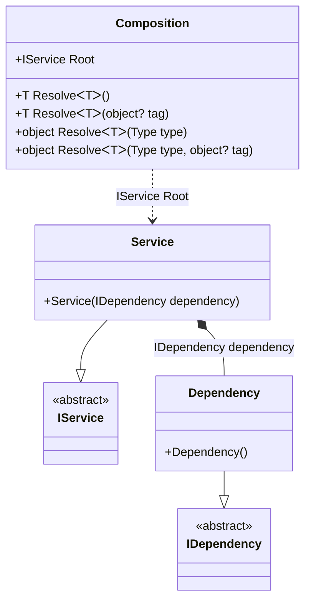
```mermaid
classDiagram
  class Composition {
    +IService Root
    +T ResolveᐸTᐳ()
    +T ResolveᐸTᐳ(object? tag)
    +object ResolveᐸTᐳ(Type type)
    +object ResolveᐸTᐳ(Type type, object? tag)
  }
  Service --|> IService : 
  class Service {
    +Service(IDependency dependency)
  }
  Dependency --|> IDependency : 
  class Dependency {
    +Dependency()
  }
  class IService {
    <<abstract>>
  }
  class IDependency {
    <<abstract>>
  }
  Service *--  Dependency : IDependency dependency
  Composition ..> Service : IService Root
```

</details>

<details>
<summary>Generated Code</summary>

```c#
partial class Composition
{
  public Composition()
  {
  }
  
  internal Composition(Composition parent)
  {
  }
  
  #region Composition Roots
  public Pure.DI.UsageTests.Basics.CompositionRootScenario.IService Root
  {
    [global::System.Runtime.CompilerServices.MethodImpl((global::System.Runtime.CompilerServices.MethodImplOptions)0x300)]
    get
    {
      Pure.DI.UsageTests.Basics.CompositionRootScenario.Dependency v43Local8AFE6F = new Pure.DI.UsageTests.Basics.CompositionRootScenario.Dependency();
      Pure.DI.UsageTests.Basics.CompositionRootScenario.Service v42Local8AFE6F = new Pure.DI.UsageTests.Basics.CompositionRootScenario.Service(v43Local8AFE6F);
      return v42Local8AFE6F;
    }
  }
  #endregion
  
  #region API
  #if NETSTANDARD2_0_OR_GREATER || NETCOREAPP || NET40_OR_GREATER
  [global::System.Diagnostics.Contracts.Pure]
  #endif
  [global::System.Runtime.CompilerServices.MethodImpl((global::System.Runtime.CompilerServices.MethodImplOptions)0x300)]
  public T Resolve<T>()
  {
    return Resolver8AFE6F<T>.Value.Resolve(this);
  }
  
  #if NETSTANDARD2_0_OR_GREATER || NETCOREAPP || NET40_OR_GREATER
  [global::System.Diagnostics.Contracts.Pure]
  #endif
  [global::System.Runtime.CompilerServices.MethodImpl((global::System.Runtime.CompilerServices.MethodImplOptions)0x300)]
  public T Resolve<T>(object? tag)
  {
    return Resolver8AFE6F<T>.Value.ResolveByTag(this, tag);
  }
  
  #if NETSTANDARD2_0_OR_GREATER || NETCOREAPP || NET40_OR_GREATER
  [global::System.Diagnostics.Contracts.Pure]
  #endif
  [global::System.Runtime.CompilerServices.MethodImpl((global::System.Runtime.CompilerServices.MethodImplOptions)0x300)]
  public object Resolve(global::System.Type type)
  {
    int index = (int)(_bucketSize8AFE6F * ((uint)global::System.Runtime.CompilerServices.RuntimeHelpers.GetHashCode(type) % 1));
    ref var pair = ref _buckets8AFE6F[index];
    if (ReferenceEquals(pair.Key, type))
    {
      return pair.Value.Resolve(this);
    }
    
    int maxIndex = index + _bucketSize8AFE6F;
    for (int i = index + 1; i < maxIndex; i++)
    {
      pair = ref _buckets8AFE6F[i];
      if (ReferenceEquals(pair.Key, type))
      {
        return pair.Value.Resolve(this);
      }
    }
    
    throw new global::System.InvalidOperationException($"Cannot resolve composition root of type {type}.");
  }
  
  #if NETSTANDARD2_0_OR_GREATER || NETCOREAPP || NET40_OR_GREATER
  [global::System.Diagnostics.Contracts.Pure]
  #endif
  [global::System.Runtime.CompilerServices.MethodImpl((global::System.Runtime.CompilerServices.MethodImplOptions)0x300)]
  public object Resolve(global::System.Type type, object? tag)
  {
    int index = (int)(_bucketSize8AFE6F * ((uint)global::System.Runtime.CompilerServices.RuntimeHelpers.GetHashCode(type) % 1));
    ref var pair = ref _buckets8AFE6F[index];
    if (ReferenceEquals(pair.Key, type))
    {
      return pair.Value.ResolveByTag(this, tag);
    }
    
    int maxIndex = index + _bucketSize8AFE6F;
    for (int i = index + 1; i < maxIndex; i++)
    {
      pair = ref _buckets8AFE6F[i];
      if (ReferenceEquals(pair.Key, type))
      {
        return pair.Value.ResolveByTag(this, tag);
      }
    }
    
    throw new global::System.InvalidOperationException($"Cannot resolve composition root of type {type}.");
  }
  
  #endregion
  
  public override string ToString()
  {
    return
      "classDiagram\n" +
        "  class Composition {\n" +
          "    +IService Root\n" +
          "    +T ResolveᐸTᐳ()\n" +
          "    +T ResolveᐸTᐳ(object? tag)\n" +
          "    +object ResolveᐸTᐳ(Type type)\n" +
          "    +object ResolveᐸTᐳ(Type type, object? tag)\n" +
        "  }\n" +
        "  Service --|> IService : \n" +
        "  class Service {\n" +
          "    +Service(IDependency dependency)\n" +
        "  }\n" +
        "  Dependency --|> IDependency : \n" +
        "  class Dependency {\n" +
          "    +Dependency()\n" +
        "  }\n" +
        "  class IService {\n" +
          "    <<abstract>>\n" +
        "  }\n" +
        "  class IDependency {\n" +
          "    <<abstract>>\n" +
        "  }\n" +
        "  Service *--  Dependency : IDependency dependency\n" +
        "  Composition ..> Service : IService Root";
  }
  
  private readonly static int _bucketSize8AFE6F;
  private readonly static global::Pure.DI.Pair<global::System.Type, global::Pure.DI.IResolver<Composition, object>>[] _buckets8AFE6F;
  
  static Composition()
  {
    Resolver8AFE6F0 valResolver8AFE6F0 = new Resolver8AFE6F0();
    Resolver8AFE6F<Pure.DI.UsageTests.Basics.CompositionRootScenario.IService>.Value = valResolver8AFE6F0;
    _buckets8AFE6F = global::Pure.DI.Buckets<global::System.Type, global::Pure.DI.IResolver<Composition, object>>.Create(
      1,
      out _bucketSize8AFE6F,
      new global::Pure.DI.Pair<global::System.Type, global::Pure.DI.IResolver<Composition, object>>[1]
      {
         new global::Pure.DI.Pair<global::System.Type, global::Pure.DI.IResolver<Composition, object>>(typeof(Pure.DI.UsageTests.Basics.CompositionRootScenario.IService), valResolver8AFE6F0)
      });
  }
  
  #region Resolvers
  #pragma warning disable CS0649
  private class Resolver8AFE6F<T>
  {
    public static global::Pure.DI.IResolver<Composition, T> Value;
  }
  
  private sealed class Resolver8AFE6F0: global::Pure.DI.IResolver<Composition, Pure.DI.UsageTests.Basics.CompositionRootScenario.IService>
  {
    [global::System.Runtime.CompilerServices.MethodImpl((global::System.Runtime.CompilerServices.MethodImplOptions)0x300)]
    public Pure.DI.UsageTests.Basics.CompositionRootScenario.IService Resolve(Composition composition)
    {
      return composition.Root;
    }
    
    [global::System.Runtime.CompilerServices.MethodImpl((global::System.Runtime.CompilerServices.MethodImplOptions)0x300)]
    public Pure.DI.UsageTests.Basics.CompositionRootScenario.IService ResolveByTag(Composition composition, object tag)
    {
      if (Equals(tag, null)) return composition.Root;
      throw new global::System.InvalidOperationException($"Cannot resolve composition root \"{tag}\" of type Pure.DI.UsageTests.Basics.CompositionRootScenario.IService.");
    }
  }
  #pragma warning restore CS0649
  #endregion
}
```

</details>


The name of the composition root is arbitrarily chosen according to its purpose, but must be limited by C# property naming conventions. Actually, the property _Root_ looks like:
```c#
public IService Root
{
  get
  {
    return new Service(new Dependency());
  }
}
```
To avoid generating _Resolve_ methods just add a comment `// Resolve = Off` before a _Setup_ method:
```c#
// Resolve = Off
DI.Setup("Composition")
  .Bind<IDependency>().To<Dependency>()
  ...
```
This can be done if these methods are not needed, in case only certain composition roots are used. It's not significant then, but it will help save resources during compilation.

#### Resolve methods

[](../tests/Pure.DI.UsageTests/Basics/ResolveScenario.cs)

This example shows how to resolve the composition roots using the _Resolve_ methods.

```c#
internal interface IDependency { }

internal class Dependency : IDependency { }

internal interface IService { }

internal class Service : IService
{
    public Service(IDependency dependency)
    {
    }
}

internal class OtherService : IService
{
}

DI.Setup("Composition")
    .Bind<IDependency>().To<Dependency>()
    .Bind<IService>().To<Service>().Root<IService>("Service")
    .Bind<IService>("Other").To<OtherService>().Root<IService>("OtherService", "Other");

var composition = new Composition();
var service1 = composition.Resolve<IService>();
var service2 = composition.Resolve(typeof(IService));
        
// Resolve by tag
var otherService1 = composition.Resolve<IService>("Other");
var otherService2 = composition.Resolve(typeof(IService),"Other");
```

<details open>
<summary>Class Diagram</summary>

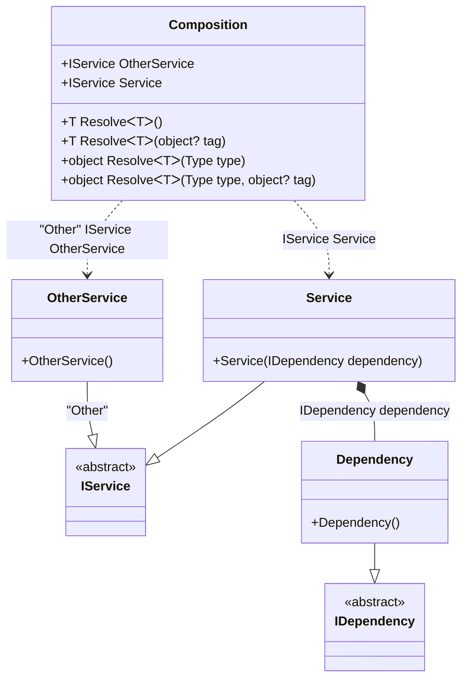
```mermaid
classDiagram
  class Composition {
    +IService OtherService
    +IService Service
    +T ResolveᐸTᐳ()
    +T ResolveᐸTᐳ(object? tag)
    +object ResolveᐸTᐳ(Type type)
    +object ResolveᐸTᐳ(Type type, object? tag)
  }
  Service --|> IService : 
  class Service {
    +Service(IDependency dependency)
  }
  Dependency --|> IDependency : 
  class Dependency {
    +Dependency()
  }
  OtherService --|> IService : "Other" 
  class OtherService {
    +OtherService()
  }
  class IService {
    <<abstract>>
  }
  class IDependency {
    <<abstract>>
  }
  Service *--  Dependency : IDependency dependency
  Composition ..> Service : IService Service
  Composition ..> OtherService : "Other" IService OtherService
```

</details>

<details>
<summary>Generated Code</summary>

```c#
partial class Composition
{
  public Composition()
  {
  }
  
  internal Composition(Composition parent)
  {
  }
  
  #region Composition Roots
  public Pure.DI.UsageTests.Basics.ResolveScenario.IService Service
  {
    [global::System.Runtime.CompilerServices.MethodImpl((global::System.Runtime.CompilerServices.MethodImplOptions)0x300)]
    get
    {
      Pure.DI.UsageTests.Basics.ResolveScenario.Dependency v62Local8AFE6F = new Pure.DI.UsageTests.Basics.ResolveScenario.Dependency();
      Pure.DI.UsageTests.Basics.ResolveScenario.Service v61Local8AFE6F = new Pure.DI.UsageTests.Basics.ResolveScenario.Service(v62Local8AFE6F);
      return v61Local8AFE6F;
    }
  }
  
  public Pure.DI.UsageTests.Basics.ResolveScenario.IService OtherService
  {
    [global::System.Runtime.CompilerServices.MethodImpl((global::System.Runtime.CompilerServices.MethodImplOptions)0x300)]
    get
    {
      Pure.DI.UsageTests.Basics.ResolveScenario.OtherService v63Local8AFE6F = new Pure.DI.UsageTests.Basics.ResolveScenario.OtherService();
      return v63Local8AFE6F;
    }
  }
  #endregion
  
  #region API
  #if NETSTANDARD2_0_OR_GREATER || NETCOREAPP || NET40_OR_GREATER
  [global::System.Diagnostics.Contracts.Pure]
  #endif
  [global::System.Runtime.CompilerServices.MethodImpl((global::System.Runtime.CompilerServices.MethodImplOptions)0x300)]
  public T Resolve<T>()
  {
    return Resolver8AFE6F<T>.Value.Resolve(this);
  }
  
  #if NETSTANDARD2_0_OR_GREATER || NETCOREAPP || NET40_OR_GREATER
  [global::System.Diagnostics.Contracts.Pure]
  #endif
  [global::System.Runtime.CompilerServices.MethodImpl((global::System.Runtime.CompilerServices.MethodImplOptions)0x300)]
  public T Resolve<T>(object? tag)
  {
    return Resolver8AFE6F<T>.Value.ResolveByTag(this, tag);
  }
  
  #if NETSTANDARD2_0_OR_GREATER || NETCOREAPP || NET40_OR_GREATER
  [global::System.Diagnostics.Contracts.Pure]
  #endif
  [global::System.Runtime.CompilerServices.MethodImpl((global::System.Runtime.CompilerServices.MethodImplOptions)0x300)]
  public object Resolve(global::System.Type type)
  {
    int index = (int)(_bucketSize8AFE6F * ((uint)global::System.Runtime.CompilerServices.RuntimeHelpers.GetHashCode(type) % 1));
    ref var pair = ref _buckets8AFE6F[index];
    if (ReferenceEquals(pair.Key, type))
    {
      return pair.Value.Resolve(this);
    }
    
    int maxIndex = index + _bucketSize8AFE6F;
    for (int i = index + 1; i < maxIndex; i++)
    {
      pair = ref _buckets8AFE6F[i];
      if (ReferenceEquals(pair.Key, type))
      {
        return pair.Value.Resolve(this);
      }
    }
    
    throw new global::System.InvalidOperationException($"Cannot resolve composition root of type {type}.");
  }
  
  #if NETSTANDARD2_0_OR_GREATER || NETCOREAPP || NET40_OR_GREATER
  [global::System.Diagnostics.Contracts.Pure]
  #endif
  [global::System.Runtime.CompilerServices.MethodImpl((global::System.Runtime.CompilerServices.MethodImplOptions)0x300)]
  public object Resolve(global::System.Type type, object? tag)
  {
    int index = (int)(_bucketSize8AFE6F * ((uint)global::System.Runtime.CompilerServices.RuntimeHelpers.GetHashCode(type) % 1));
    ref var pair = ref _buckets8AFE6F[index];
    if (ReferenceEquals(pair.Key, type))
    {
      return pair.Value.ResolveByTag(this, tag);
    }
    
    int maxIndex = index + _bucketSize8AFE6F;
    for (int i = index + 1; i < maxIndex; i++)
    {
      pair = ref _buckets8AFE6F[i];
      if (ReferenceEquals(pair.Key, type))
      {
        return pair.Value.ResolveByTag(this, tag);
      }
    }
    
    throw new global::System.InvalidOperationException($"Cannot resolve composition root of type {type}.");
  }
  
  #endregion
  
  public override string ToString()
  {
    return
      "classDiagram\n" +
        "  class Composition {\n" +
          "    +IService OtherService\n" +
          "    +IService Service\n" +
          "    +T ResolveᐸTᐳ()\n" +
          "    +T ResolveᐸTᐳ(object? tag)\n" +
          "    +object ResolveᐸTᐳ(Type type)\n" +
          "    +object ResolveᐸTᐳ(Type type, object? tag)\n" +
        "  }\n" +
        "  Service --|> IService : \n" +
        "  class Service {\n" +
          "    +Service(IDependency dependency)\n" +
        "  }\n" +
        "  Dependency --|> IDependency : \n" +
        "  class Dependency {\n" +
          "    +Dependency()\n" +
        "  }\n" +
        "  OtherService --|> IService : \"Other\" \n" +
        "  class OtherService {\n" +
          "    +OtherService()\n" +
        "  }\n" +
        "  class IService {\n" +
          "    <<abstract>>\n" +
        "  }\n" +
        "  class IDependency {\n" +
          "    <<abstract>>\n" +
        "  }\n" +
        "  Service *--  Dependency : IDependency dependency\n" +
        "  Composition ..> Service : IService Service\n" +
        "  Composition ..> OtherService : \"Other\" IService OtherService";
  }
  
  private readonly static int _bucketSize8AFE6F;
  private readonly static global::Pure.DI.Pair<global::System.Type, global::Pure.DI.IResolver<Composition, object>>[] _buckets8AFE6F;
  
  static Composition()
  {
    Resolver8AFE6F0 valResolver8AFE6F0 = new Resolver8AFE6F0();
    Resolver8AFE6F<Pure.DI.UsageTests.Basics.ResolveScenario.IService>.Value = valResolver8AFE6F0;
    _buckets8AFE6F = global::Pure.DI.Buckets<global::System.Type, global::Pure.DI.IResolver<Composition, object>>.Create(
      1,
      out _bucketSize8AFE6F,
      new global::Pure.DI.Pair<global::System.Type, global::Pure.DI.IResolver<Composition, object>>[1]
      {
         new global::Pure.DI.Pair<global::System.Type, global::Pure.DI.IResolver<Composition, object>>(typeof(Pure.DI.UsageTests.Basics.ResolveScenario.IService), valResolver8AFE6F0)
      });
  }
  
  #region Resolvers
  #pragma warning disable CS0649
  private class Resolver8AFE6F<T>
  {
    public static global::Pure.DI.IResolver<Composition, T> Value;
  }
  
  private sealed class Resolver8AFE6F0: global::Pure.DI.IResolver<Composition, Pure.DI.UsageTests.Basics.ResolveScenario.IService>
  {
    [global::System.Runtime.CompilerServices.MethodImpl((global::System.Runtime.CompilerServices.MethodImplOptions)0x300)]
    public Pure.DI.UsageTests.Basics.ResolveScenario.IService Resolve(Composition composition)
    {
      return composition.Service;
    }
    
    [global::System.Runtime.CompilerServices.MethodImpl((global::System.Runtime.CompilerServices.MethodImplOptions)0x300)]
    public Pure.DI.UsageTests.Basics.ResolveScenario.IService ResolveByTag(Composition composition, object tag)
    {
      if (Equals(tag, "Other")) return composition.OtherService;
      if (Equals(tag, null)) return composition.Service;
      throw new global::System.InvalidOperationException($"Cannot resolve composition root \"{tag}\" of type Pure.DI.UsageTests.Basics.ResolveScenario.IService.");
    }
  }
  #pragma warning restore CS0649
  #endregion
}
```

</details>


#### Factory

[](../tests/Pure.DI.UsageTests/Basics/FactoryScenario.cs)

This example demonstrates how to create and initialize an instance manually.

```c#
internal interface IDependency
{
    DateTimeOffset Time { get; }

    bool IsInitialized { get; }
}

internal class Dependency : IDependency
{
    public Dependency(DateTimeOffset time)
    {
        Time = time;
    }

    public DateTimeOffset Time { get; }

    public bool IsInitialized { get; private set; }

    public void Initialize()
    {
        IsInitialized = true;
    }
}

internal interface IService
{
    IDependency Dependency { get; }
}

internal class Service : IService
{
    public Service(IDependency dependency)
    {
        Dependency = dependency;
    }

    public IDependency Dependency { get; }
}

DI.Setup("Composition")
    .Bind<IDependency>().To(_ =>
    {
        var dependency = new Dependency(DateTimeOffset.Now);
        dependency.Initialize();
        return dependency;
    })
    .Bind<IService>().To<Service>().Root<IService>("Root");

var composition = new Composition();
var service = composition.Root;
service.Dependency.IsInitialized.ShouldBeTrue();
```

<details open>
<summary>Class Diagram</summary>

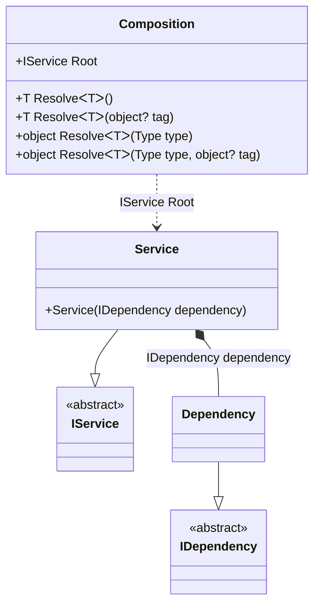
```mermaid
classDiagram
  class Composition {
    +IService Root
    +T ResolveᐸTᐳ()
    +T ResolveᐸTᐳ(object? tag)
    +object ResolveᐸTᐳ(Type type)
    +object ResolveᐸTᐳ(Type type, object? tag)
  }
  Service --|> IService : 
  class Service {
    +Service(IDependency dependency)
  }
  Dependency --|> IDependency : 
  class Dependency
  class IService {
    <<abstract>>
  }
  class IDependency {
    <<abstract>>
  }
  Service *--  Dependency : IDependency dependency
  Composition ..> Service : IService Root
```

</details>

<details>
<summary>Generated Code</summary>

```c#
partial class Composition
{
  public Composition()
  {
  }
  
  internal Composition(Composition parent)
  {
  }
  
  #region Composition Roots
  public Pure.DI.UsageTests.Basics.FactoryScenario.IService Root
  {
    [global::System.Runtime.CompilerServices.MethodImpl((global::System.Runtime.CompilerServices.MethodImplOptions)0x300)]
    get
    {
      Pure.DI.UsageTests.Basics.FactoryScenario.Dependency v45Local8AFE6F;
      {
                      var dependency = new Dependency(DateTimeOffset.Now);
                      dependency.Initialize();
                      { v45Local8AFE6F = dependency; goto label468AFE6F; }            }
      label468AFE6F:
      ;
      Pure.DI.UsageTests.Basics.FactoryScenario.Service v44Local8AFE6F = new Pure.DI.UsageTests.Basics.FactoryScenario.Service(v45Local8AFE6F);
      return v44Local8AFE6F;
    }
  }
  #endregion
  
  #region API
  #if NETSTANDARD2_0_OR_GREATER || NETCOREAPP || NET40_OR_GREATER
  [global::System.Diagnostics.Contracts.Pure]
  #endif
  [global::System.Runtime.CompilerServices.MethodImpl((global::System.Runtime.CompilerServices.MethodImplOptions)0x300)]
  public T Resolve<T>()
  {
    return Resolver8AFE6F<T>.Value.Resolve(this);
  }
  
  #if NETSTANDARD2_0_OR_GREATER || NETCOREAPP || NET40_OR_GREATER
  [global::System.Diagnostics.Contracts.Pure]
  #endif
  [global::System.Runtime.CompilerServices.MethodImpl((global::System.Runtime.CompilerServices.MethodImplOptions)0x300)]
  public T Resolve<T>(object? tag)
  {
    return Resolver8AFE6F<T>.Value.ResolveByTag(this, tag);
  }
  
  #if NETSTANDARD2_0_OR_GREATER || NETCOREAPP || NET40_OR_GREATER
  [global::System.Diagnostics.Contracts.Pure]
  #endif
  [global::System.Runtime.CompilerServices.MethodImpl((global::System.Runtime.CompilerServices.MethodImplOptions)0x300)]
  public object Resolve(global::System.Type type)
  {
    int index = (int)(_bucketSize8AFE6F * ((uint)global::System.Runtime.CompilerServices.RuntimeHelpers.GetHashCode(type) % 1));
    ref var pair = ref _buckets8AFE6F[index];
    if (ReferenceEquals(pair.Key, type))
    {
      return pair.Value.Resolve(this);
    }
    
    int maxIndex = index + _bucketSize8AFE6F;
    for (int i = index + 1; i < maxIndex; i++)
    {
      pair = ref _buckets8AFE6F[i];
      if (ReferenceEquals(pair.Key, type))
      {
        return pair.Value.Resolve(this);
      }
    }
    
    throw new global::System.InvalidOperationException($"Cannot resolve composition root of type {type}.");
  }
  
  #if NETSTANDARD2_0_OR_GREATER || NETCOREAPP || NET40_OR_GREATER
  [global::System.Diagnostics.Contracts.Pure]
  #endif
  [global::System.Runtime.CompilerServices.MethodImpl((global::System.Runtime.CompilerServices.MethodImplOptions)0x300)]
  public object Resolve(global::System.Type type, object? tag)
  {
    int index = (int)(_bucketSize8AFE6F * ((uint)global::System.Runtime.CompilerServices.RuntimeHelpers.GetHashCode(type) % 1));
    ref var pair = ref _buckets8AFE6F[index];
    if (ReferenceEquals(pair.Key, type))
    {
      return pair.Value.ResolveByTag(this, tag);
    }
    
    int maxIndex = index + _bucketSize8AFE6F;
    for (int i = index + 1; i < maxIndex; i++)
    {
      pair = ref _buckets8AFE6F[i];
      if (ReferenceEquals(pair.Key, type))
      {
        return pair.Value.ResolveByTag(this, tag);
      }
    }
    
    throw new global::System.InvalidOperationException($"Cannot resolve composition root of type {type}.");
  }
  
  #endregion
  
  public override string ToString()
  {
    return
      "classDiagram\n" +
        "  class Composition {\n" +
          "    +IService Root\n" +
          "    +T ResolveᐸTᐳ()\n" +
          "    +T ResolveᐸTᐳ(object? tag)\n" +
          "    +object ResolveᐸTᐳ(Type type)\n" +
          "    +object ResolveᐸTᐳ(Type type, object? tag)\n" +
        "  }\n" +
        "  Service --|> IService : \n" +
        "  class Service {\n" +
          "    +Service(IDependency dependency)\n" +
        "  }\n" +
        "  Dependency --|> IDependency : \n" +
        "  class Dependency\n" +
        "  class IService {\n" +
          "    <<abstract>>\n" +
        "  }\n" +
        "  class IDependency {\n" +
          "    <<abstract>>\n" +
        "  }\n" +
        "  Service *--  Dependency : IDependency dependency\n" +
        "  Composition ..> Service : IService Root";
  }
  
  private readonly static int _bucketSize8AFE6F;
  private readonly static global::Pure.DI.Pair<global::System.Type, global::Pure.DI.IResolver<Composition, object>>[] _buckets8AFE6F;
  
  static Composition()
  {
    Resolver8AFE6F0 valResolver8AFE6F0 = new Resolver8AFE6F0();
    Resolver8AFE6F<Pure.DI.UsageTests.Basics.FactoryScenario.IService>.Value = valResolver8AFE6F0;
    _buckets8AFE6F = global::Pure.DI.Buckets<global::System.Type, global::Pure.DI.IResolver<Composition, object>>.Create(
      1,
      out _bucketSize8AFE6F,
      new global::Pure.DI.Pair<global::System.Type, global::Pure.DI.IResolver<Composition, object>>[1]
      {
         new global::Pure.DI.Pair<global::System.Type, global::Pure.DI.IResolver<Composition, object>>(typeof(Pure.DI.UsageTests.Basics.FactoryScenario.IService), valResolver8AFE6F0)
      });
  }
  
  #region Resolvers
  #pragma warning disable CS0649
  private class Resolver8AFE6F<T>
  {
    public static global::Pure.DI.IResolver<Composition, T> Value;
  }
  
  private sealed class Resolver8AFE6F0: global::Pure.DI.IResolver<Composition, Pure.DI.UsageTests.Basics.FactoryScenario.IService>
  {
    [global::System.Runtime.CompilerServices.MethodImpl((global::System.Runtime.CompilerServices.MethodImplOptions)0x300)]
    public Pure.DI.UsageTests.Basics.FactoryScenario.IService Resolve(Composition composition)
    {
      return composition.Root;
    }
    
    [global::System.Runtime.CompilerServices.MethodImpl((global::System.Runtime.CompilerServices.MethodImplOptions)0x300)]
    public Pure.DI.UsageTests.Basics.FactoryScenario.IService ResolveByTag(Composition composition, object tag)
    {
      if (Equals(tag, null)) return composition.Root;
      throw new global::System.InvalidOperationException($"Cannot resolve composition root \"{tag}\" of type Pure.DI.UsageTests.Basics.FactoryScenario.IService.");
    }
  }
  #pragma warning restore CS0649
  #endregion
}
```

</details>


#### Injection

[](../tests/Pure.DI.UsageTests/Basics/InjectScenario.cs)

This example shows how to manually create and initialize an instance by injecting the necessary dependencies.

```c#
internal interface IDependency { }

internal class Dependency : IDependency
{
}

internal interface IService
{
    IDependency Dependency { get; }
}

internal class Service : IService
{
    public Service(IDependency dependency)
    {
        Dependency = dependency;
    }

    public IDependency Dependency { get; }
}

DI.Setup("Composition")
    .Bind<IDependency>().To<Dependency>()
    .Bind<IService>()
        .To(ctx =>
        {
            ctx.Inject<IDependency>(out var dependency);
            return new Service(dependency);
        })
        .Root<IService>("Root");

var composition = new Composition();
var service = composition.Root;
```

<details open>
<summary>Class Diagram</summary>

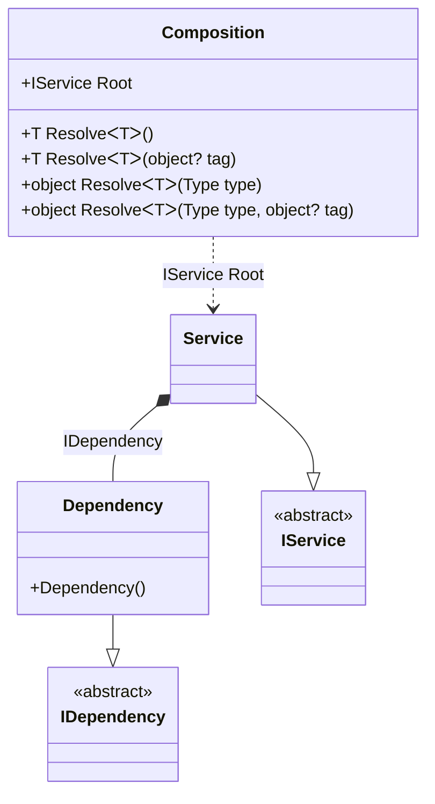
```mermaid
classDiagram
  class Composition {
    +IService Root
    +T ResolveᐸTᐳ()
    +T ResolveᐸTᐳ(object? tag)
    +object ResolveᐸTᐳ(Type type)
    +object ResolveᐸTᐳ(Type type, object? tag)
  }
  Dependency --|> IDependency : 
  class Dependency {
    +Dependency()
  }
  Service --|> IService : 
  class Service
  class IDependency {
    <<abstract>>
  }
  class IService {
    <<abstract>>
  }
  Composition ..> Service : IService Root
  Service *--  Dependency : IDependency
```

</details>

<details>
<summary>Generated Code</summary>

```c#
partial class Composition
{
  public Composition()
  {
  }
  
  internal Composition(Composition parent)
  {
  }
  
  #region Composition Roots
  public Pure.DI.UsageTests.Basics.InjectScenario.IService Root
  {
    [global::System.Runtime.CompilerServices.MethodImpl((global::System.Runtime.CompilerServices.MethodImplOptions)0x300)]
    get
    {
      Pure.DI.UsageTests.Basics.InjectScenario.Service v52Local8AFE6F;
      {
      
      Pure.DI.UsageTests.Basics.InjectScenario.Dependency v55Local8AFE6F = new Pure.DI.UsageTests.Basics.InjectScenario.Dependency();
      Pure.DI.UsageTests.Basics.InjectScenario.IDependency dependency = v55Local8AFE6F;
                          { v52Local8AFE6F = new Service(dependency); goto label548AFE6F; }                }
      label548AFE6F:
      ;
      return v52Local8AFE6F;
    }
  }
  #endregion
  
  #region API
  #if NETSTANDARD2_0_OR_GREATER || NETCOREAPP || NET40_OR_GREATER
  [global::System.Diagnostics.Contracts.Pure]
  #endif
  [global::System.Runtime.CompilerServices.MethodImpl((global::System.Runtime.CompilerServices.MethodImplOptions)0x300)]
  public T Resolve<T>()
  {
    return Resolver8AFE6F<T>.Value.Resolve(this);
  }
  
  #if NETSTANDARD2_0_OR_GREATER || NETCOREAPP || NET40_OR_GREATER
  [global::System.Diagnostics.Contracts.Pure]
  #endif
  [global::System.Runtime.CompilerServices.MethodImpl((global::System.Runtime.CompilerServices.MethodImplOptions)0x300)]
  public T Resolve<T>(object? tag)
  {
    return Resolver8AFE6F<T>.Value.ResolveByTag(this, tag);
  }
  
  #if NETSTANDARD2_0_OR_GREATER || NETCOREAPP || NET40_OR_GREATER
  [global::System.Diagnostics.Contracts.Pure]
  #endif
  [global::System.Runtime.CompilerServices.MethodImpl((global::System.Runtime.CompilerServices.MethodImplOptions)0x300)]
  public object Resolve(global::System.Type type)
  {
    int index = (int)(_bucketSize8AFE6F * ((uint)global::System.Runtime.CompilerServices.RuntimeHelpers.GetHashCode(type) % 1));
    ref var pair = ref _buckets8AFE6F[index];
    if (ReferenceEquals(pair.Key, type))
    {
      return pair.Value.Resolve(this);
    }
    
    int maxIndex = index + _bucketSize8AFE6F;
    for (int i = index + 1; i < maxIndex; i++)
    {
      pair = ref _buckets8AFE6F[i];
      if (ReferenceEquals(pair.Key, type))
      {
        return pair.Value.Resolve(this);
      }
    }
    
    throw new global::System.InvalidOperationException($"Cannot resolve composition root of type {type}.");
  }
  
  #if NETSTANDARD2_0_OR_GREATER || NETCOREAPP || NET40_OR_GREATER
  [global::System.Diagnostics.Contracts.Pure]
  #endif
  [global::System.Runtime.CompilerServices.MethodImpl((global::System.Runtime.CompilerServices.MethodImplOptions)0x300)]
  public object Resolve(global::System.Type type, object? tag)
  {
    int index = (int)(_bucketSize8AFE6F * ((uint)global::System.Runtime.CompilerServices.RuntimeHelpers.GetHashCode(type) % 1));
    ref var pair = ref _buckets8AFE6F[index];
    if (ReferenceEquals(pair.Key, type))
    {
      return pair.Value.ResolveByTag(this, tag);
    }
    
    int maxIndex = index + _bucketSize8AFE6F;
    for (int i = index + 1; i < maxIndex; i++)
    {
      pair = ref _buckets8AFE6F[i];
      if (ReferenceEquals(pair.Key, type))
      {
        return pair.Value.ResolveByTag(this, tag);
      }
    }
    
    throw new global::System.InvalidOperationException($"Cannot resolve composition root of type {type}.");
  }
  
  #endregion
  
  public override string ToString()
  {
    return
      "classDiagram\n" +
        "  class Composition {\n" +
          "    +IService Root\n" +
          "    +T ResolveᐸTᐳ()\n" +
          "    +T ResolveᐸTᐳ(object? tag)\n" +
          "    +object ResolveᐸTᐳ(Type type)\n" +
          "    +object ResolveᐸTᐳ(Type type, object? tag)\n" +
        "  }\n" +
        "  Dependency --|> IDependency : \n" +
        "  class Dependency {\n" +
          "    +Dependency()\n" +
        "  }\n" +
        "  Service --|> IService : \n" +
        "  class Service\n" +
        "  class IDependency {\n" +
          "    <<abstract>>\n" +
        "  }\n" +
        "  class IService {\n" +
          "    <<abstract>>\n" +
        "  }\n" +
        "  Composition ..> Service : IService Root\n" +
        "  Service *--  Dependency : IDependency";
  }
  
  private readonly static int _bucketSize8AFE6F;
  private readonly static global::Pure.DI.Pair<global::System.Type, global::Pure.DI.IResolver<Composition, object>>[] _buckets8AFE6F;
  
  static Composition()
  {
    Resolver8AFE6F0 valResolver8AFE6F0 = new Resolver8AFE6F0();
    Resolver8AFE6F<Pure.DI.UsageTests.Basics.InjectScenario.IService>.Value = valResolver8AFE6F0;
    _buckets8AFE6F = global::Pure.DI.Buckets<global::System.Type, global::Pure.DI.IResolver<Composition, object>>.Create(
      1,
      out _bucketSize8AFE6F,
      new global::Pure.DI.Pair<global::System.Type, global::Pure.DI.IResolver<Composition, object>>[1]
      {
         new global::Pure.DI.Pair<global::System.Type, global::Pure.DI.IResolver<Composition, object>>(typeof(Pure.DI.UsageTests.Basics.InjectScenario.IService), valResolver8AFE6F0)
      });
  }
  
  #region Resolvers
  #pragma warning disable CS0649
  private class Resolver8AFE6F<T>
  {
    public static global::Pure.DI.IResolver<Composition, T> Value;
  }
  
  private sealed class Resolver8AFE6F0: global::Pure.DI.IResolver<Composition, Pure.DI.UsageTests.Basics.InjectScenario.IService>
  {
    [global::System.Runtime.CompilerServices.MethodImpl((global::System.Runtime.CompilerServices.MethodImplOptions)0x300)]
    public Pure.DI.UsageTests.Basics.InjectScenario.IService Resolve(Composition composition)
    {
      return composition.Root;
    }
    
    [global::System.Runtime.CompilerServices.MethodImpl((global::System.Runtime.CompilerServices.MethodImplOptions)0x300)]
    public Pure.DI.UsageTests.Basics.InjectScenario.IService ResolveByTag(Composition composition, object tag)
    {
      if (Equals(tag, null)) return composition.Root;
      throw new global::System.InvalidOperationException($"Cannot resolve composition root \"{tag}\" of type Pure.DI.UsageTests.Basics.InjectScenario.IService.");
    }
  }
  #pragma warning restore CS0649
  #endregion
}
```

</details>


In addition to the dependency type, you can specify the dependency tag in the first parameter. Then the overloaded method `void Inject<T>(object tag, out T value)` is used. Where the first argument is the tag, the second is the dependency instance.

#### Generics

[](../tests/Pure.DI.UsageTests/Basics/GenericsScenario.cs)

Generic types are also supported, this is easy to do by binding generic types and specifying generic markers like `TT`, `TT1` etc. as generic type parameters:

```c#
internal interface IDependency<T> { }

internal class Dependency<T> : IDependency<T> { }

internal interface IService
{
    IDependency<int> IntDependency { get; }

    IDependency<string> StringDependency { get; }
}

internal class Service : IService
{
    public Service(IDependency<int> intDependency, IDependency<string> stringDependency)
    {
        IntDependency = intDependency;
        StringDependency = stringDependency;
    }

    public IDependency<int> IntDependency { get; }

    public IDependency<string> StringDependency { get; }
}

DI.Setup("Composition")
    .Bind<IDependency<TT>>().To<Dependency<TT>>()
    .Bind<IService>().To<Service>().Root<IService>("Root");

var composition = new Composition();
var service = composition.Root;
service.IntDependency.ShouldBeOfType<Dependency<int>>();
service.StringDependency.ShouldBeOfType<Dependency<string>>();
```

<details open>
<summary>Class Diagram</summary>

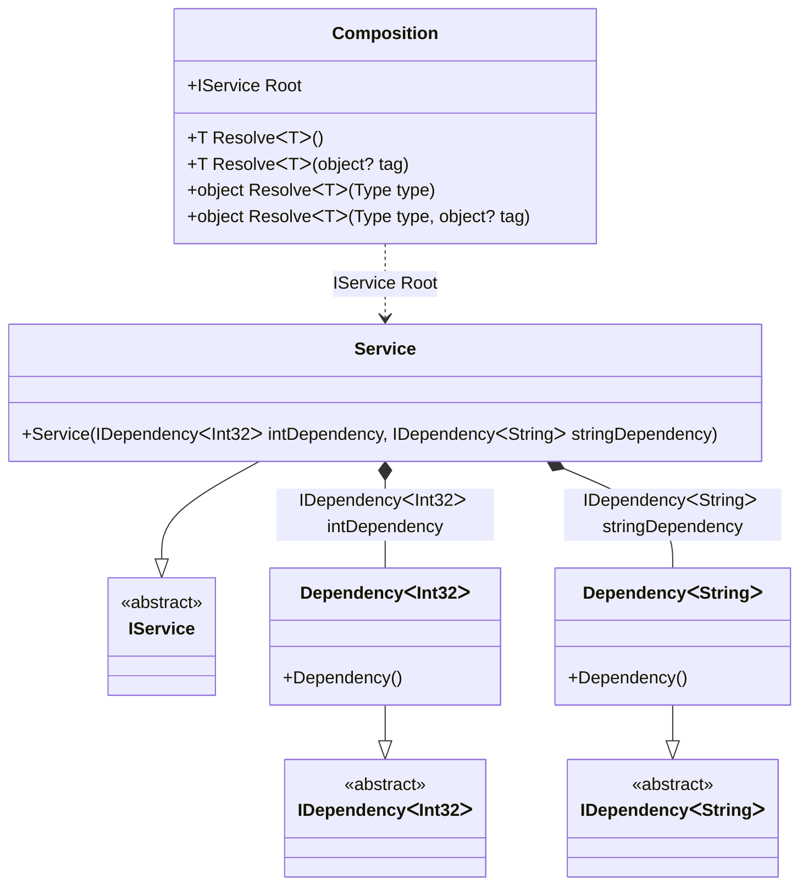
```mermaid
classDiagram
  class Composition {
    +IService Root
    +T ResolveᐸTᐳ()
    +T ResolveᐸTᐳ(object? tag)
    +object ResolveᐸTᐳ(Type type)
    +object ResolveᐸTᐳ(Type type, object? tag)
  }
  Service --|> IService : 
  class Service {
    +Service(IDependencyᐸInt32ᐳ intDependency, IDependencyᐸStringᐳ stringDependency)
  }
  DependencyᐸInt32ᐳ --|> IDependencyᐸInt32ᐳ : 
  class DependencyᐸInt32ᐳ {
    +Dependency()
  }
  DependencyᐸStringᐳ --|> IDependencyᐸStringᐳ : 
  class DependencyᐸStringᐳ {
    +Dependency()
  }
  class IService {
    <<abstract>>
  }
  class IDependencyᐸInt32ᐳ {
    <<abstract>>
  }
  class IDependencyᐸStringᐳ {
    <<abstract>>
  }
  Service *--  DependencyᐸInt32ᐳ : IDependencyᐸInt32ᐳ intDependency
  Service *--  DependencyᐸStringᐳ : IDependencyᐸStringᐳ stringDependency
  Composition ..> Service : IService Root
```

</details>

<details>
<summary>Generated Code</summary>

```c#
partial class Composition
{
  public Composition()
  {
  }
  
  internal Composition(Composition parent)
  {
  }
  
  #region Composition Roots
  public Pure.DI.UsageTests.Basics.GenericsScenario.IService Root
  {
    [global::System.Runtime.CompilerServices.MethodImpl((global::System.Runtime.CompilerServices.MethodImplOptions)0x300)]
    get
    {
      Pure.DI.UsageTests.Basics.GenericsScenario.Dependency<int> v50Local8AFE6F = new Pure.DI.UsageTests.Basics.GenericsScenario.Dependency<int>();
      Pure.DI.UsageTests.Basics.GenericsScenario.Dependency<string> v51Local8AFE6F = new Pure.DI.UsageTests.Basics.GenericsScenario.Dependency<string>();
      Pure.DI.UsageTests.Basics.GenericsScenario.Service v49Local8AFE6F = new Pure.DI.UsageTests.Basics.GenericsScenario.Service(v50Local8AFE6F, v51Local8AFE6F);
      return v49Local8AFE6F;
    }
  }
  #endregion
  
  #region API
  #if NETSTANDARD2_0_OR_GREATER || NETCOREAPP || NET40_OR_GREATER
  [global::System.Diagnostics.Contracts.Pure]
  #endif
  [global::System.Runtime.CompilerServices.MethodImpl((global::System.Runtime.CompilerServices.MethodImplOptions)0x300)]
  public T Resolve<T>()
  {
    return Resolver8AFE6F<T>.Value.Resolve(this);
  }
  
  #if NETSTANDARD2_0_OR_GREATER || NETCOREAPP || NET40_OR_GREATER
  [global::System.Diagnostics.Contracts.Pure]
  #endif
  [global::System.Runtime.CompilerServices.MethodImpl((global::System.Runtime.CompilerServices.MethodImplOptions)0x300)]
  public T Resolve<T>(object? tag)
  {
    return Resolver8AFE6F<T>.Value.ResolveByTag(this, tag);
  }
  
  #if NETSTANDARD2_0_OR_GREATER || NETCOREAPP || NET40_OR_GREATER
  [global::System.Diagnostics.Contracts.Pure]
  #endif
  [global::System.Runtime.CompilerServices.MethodImpl((global::System.Runtime.CompilerServices.MethodImplOptions)0x300)]
  public object Resolve(global::System.Type type)
  {
    int index = (int)(_bucketSize8AFE6F * ((uint)global::System.Runtime.CompilerServices.RuntimeHelpers.GetHashCode(type) % 1));
    ref var pair = ref _buckets8AFE6F[index];
    if (ReferenceEquals(pair.Key, type))
    {
      return pair.Value.Resolve(this);
    }
    
    int maxIndex = index + _bucketSize8AFE6F;
    for (int i = index + 1; i < maxIndex; i++)
    {
      pair = ref _buckets8AFE6F[i];
      if (ReferenceEquals(pair.Key, type))
      {
        return pair.Value.Resolve(this);
      }
    }
    
    throw new global::System.InvalidOperationException($"Cannot resolve composition root of type {type}.");
  }
  
  #if NETSTANDARD2_0_OR_GREATER || NETCOREAPP || NET40_OR_GREATER
  [global::System.Diagnostics.Contracts.Pure]
  #endif
  [global::System.Runtime.CompilerServices.MethodImpl((global::System.Runtime.CompilerServices.MethodImplOptions)0x300)]
  public object Resolve(global::System.Type type, object? tag)
  {
    int index = (int)(_bucketSize8AFE6F * ((uint)global::System.Runtime.CompilerServices.RuntimeHelpers.GetHashCode(type) % 1));
    ref var pair = ref _buckets8AFE6F[index];
    if (ReferenceEquals(pair.Key, type))
    {
      return pair.Value.ResolveByTag(this, tag);
    }
    
    int maxIndex = index + _bucketSize8AFE6F;
    for (int i = index + 1; i < maxIndex; i++)
    {
      pair = ref _buckets8AFE6F[i];
      if (ReferenceEquals(pair.Key, type))
      {
        return pair.Value.ResolveByTag(this, tag);
      }
    }
    
    throw new global::System.InvalidOperationException($"Cannot resolve composition root of type {type}.");
  }
  
  #endregion
  
  public override string ToString()
  {
    return
      "classDiagram\n" +
        "  class Composition {\n" +
          "    +IService Root\n" +
          "    +T ResolveᐸTᐳ()\n" +
          "    +T ResolveᐸTᐳ(object? tag)\n" +
          "    +object ResolveᐸTᐳ(Type type)\n" +
          "    +object ResolveᐸTᐳ(Type type, object? tag)\n" +
        "  }\n" +
        "  Service --|> IService : \n" +
        "  class Service {\n" +
          "    +Service(IDependencyᐸInt32ᐳ intDependency, IDependencyᐸStringᐳ stringDependency)\n" +
        "  }\n" +
        "  DependencyᐸInt32ᐳ --|> IDependencyᐸInt32ᐳ : \n" +
        "  class DependencyᐸInt32ᐳ {\n" +
          "    +Dependency()\n" +
        "  }\n" +
        "  DependencyᐸStringᐳ --|> IDependencyᐸStringᐳ : \n" +
        "  class DependencyᐸStringᐳ {\n" +
          "    +Dependency()\n" +
        "  }\n" +
        "  class IService {\n" +
          "    <<abstract>>\n" +
        "  }\n" +
        "  class IDependencyᐸInt32ᐳ {\n" +
          "    <<abstract>>\n" +
        "  }\n" +
        "  class IDependencyᐸStringᐳ {\n" +
          "    <<abstract>>\n" +
        "  }\n" +
        "  Service *--  DependencyᐸInt32ᐳ : IDependencyᐸInt32ᐳ intDependency\n" +
        "  Service *--  DependencyᐸStringᐳ : IDependencyᐸStringᐳ stringDependency\n" +
        "  Composition ..> Service : IService Root";
  }
  
  private readonly static int _bucketSize8AFE6F;
  private readonly static global::Pure.DI.Pair<global::System.Type, global::Pure.DI.IResolver<Composition, object>>[] _buckets8AFE6F;
  
  static Composition()
  {
    Resolver8AFE6F0 valResolver8AFE6F0 = new Resolver8AFE6F0();
    Resolver8AFE6F<Pure.DI.UsageTests.Basics.GenericsScenario.IService>.Value = valResolver8AFE6F0;
    _buckets8AFE6F = global::Pure.DI.Buckets<global::System.Type, global::Pure.DI.IResolver<Composition, object>>.Create(
      1,
      out _bucketSize8AFE6F,
      new global::Pure.DI.Pair<global::System.Type, global::Pure.DI.IResolver<Composition, object>>[1]
      {
         new global::Pure.DI.Pair<global::System.Type, global::Pure.DI.IResolver<Composition, object>>(typeof(Pure.DI.UsageTests.Basics.GenericsScenario.IService), valResolver8AFE6F0)
      });
  }
  
  #region Resolvers
  #pragma warning disable CS0649
  private class Resolver8AFE6F<T>
  {
    public static global::Pure.DI.IResolver<Composition, T> Value;
  }
  
  private sealed class Resolver8AFE6F0: global::Pure.DI.IResolver<Composition, Pure.DI.UsageTests.Basics.GenericsScenario.IService>
  {
    [global::System.Runtime.CompilerServices.MethodImpl((global::System.Runtime.CompilerServices.MethodImplOptions)0x300)]
    public Pure.DI.UsageTests.Basics.GenericsScenario.IService Resolve(Composition composition)
    {
      return composition.Root;
    }
    
    [global::System.Runtime.CompilerServices.MethodImpl((global::System.Runtime.CompilerServices.MethodImplOptions)0x300)]
    public Pure.DI.UsageTests.Basics.GenericsScenario.IService ResolveByTag(Composition composition, object tag)
    {
      if (Equals(tag, null)) return composition.Root;
      throw new global::System.InvalidOperationException($"Cannot resolve composition root \"{tag}\" of type Pure.DI.UsageTests.Basics.GenericsScenario.IService.");
    }
  }
  #pragma warning restore CS0649
  #endregion
}
```

</details>


Actually, the property _Root_ looks like:
```c#
public IService Root
{
  get
  {
    return new Service(new Dependency<int>(), new Dependency<string>());
  }
}
```

#### Arguments

[](../tests/Pure.DI.UsageTests/Basics/ArgumentsScenario.cs)

```c#
internal interface IDependency { }

internal class Dependency : IDependency { }

internal interface IService
{
    string Name { get; }
}

internal class Service : IService
{
    public Service(string name, IDependency dependency)
    {
        Name = name;
    }

    public string Name { get; }
}

DI.Setup("Composition")
    .Bind<IDependency>().To<Dependency>()
    .Bind<IService>().To<Service>().Root<IService>("Root")
    .Arg<string>("serviceName");

var composition = new Composition("Abc");
var service = composition.Root;
service.Name.ShouldBe("Abc");
```

<details open>
<summary>Class Diagram</summary>

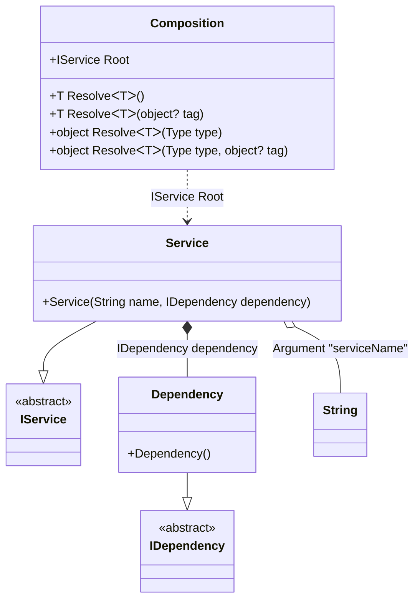
```mermaid
classDiagram
  class Composition {
    +IService Root
    +T ResolveᐸTᐳ()
    +T ResolveᐸTᐳ(object? tag)
    +object ResolveᐸTᐳ(Type type)
    +object ResolveᐸTᐳ(Type type, object? tag)
  }
  Service --|> IService : 
  class Service {
    +Service(String name, IDependency dependency)
  }
  Dependency --|> IDependency : 
  class Dependency {
    +Dependency()
  }
  class String
  class IService {
    <<abstract>>
  }
  class IDependency {
    <<abstract>>
  }
  Service o-- String : Argument "serviceName"
  Service *--  Dependency : IDependency dependency
  Composition ..> Service : IService Root
```

</details>

<details>
<summary>Generated Code</summary>

```c#
partial class Composition
{
  private readonly string _serviceNameArg8AFE6F;
  
  public Composition(string serviceName)
  {
    if (global::System.Object.ReferenceEquals(serviceName, null))
    {
      throw new global::System.ArgumentNullException("serviceName");
    }
    
    _serviceNameArg8AFE6F = serviceName;
  }
  
  internal Composition(Composition parent)
  {
    _serviceNameArg8AFE6F = parent._serviceNameArg8AFE6F;
  }
  
  #region Composition Roots
  public Pure.DI.UsageTests.Basics.ArgumentsScenario.IService Root
  {
    [global::System.Runtime.CompilerServices.MethodImpl((global::System.Runtime.CompilerServices.MethodImplOptions)0x300)]
    get
    {
      Pure.DI.UsageTests.Basics.ArgumentsScenario.Dependency v34Local8AFE6F = new Pure.DI.UsageTests.Basics.ArgumentsScenario.Dependency();
      Pure.DI.UsageTests.Basics.ArgumentsScenario.Service v33Local8AFE6F = new Pure.DI.UsageTests.Basics.ArgumentsScenario.Service(_serviceNameArg8AFE6F, v34Local8AFE6F);
      return v33Local8AFE6F;
    }
  }
  #endregion
  
  #region API
  #if NETSTANDARD2_0_OR_GREATER || NETCOREAPP || NET40_OR_GREATER
  [global::System.Diagnostics.Contracts.Pure]
  #endif
  [global::System.Runtime.CompilerServices.MethodImpl((global::System.Runtime.CompilerServices.MethodImplOptions)0x300)]
  public T Resolve<T>()
  {
    return Resolver8AFE6F<T>.Value.Resolve(this);
  }
  
  #if NETSTANDARD2_0_OR_GREATER || NETCOREAPP || NET40_OR_GREATER
  [global::System.Diagnostics.Contracts.Pure]
  #endif
  [global::System.Runtime.CompilerServices.MethodImpl((global::System.Runtime.CompilerServices.MethodImplOptions)0x300)]
  public T Resolve<T>(object? tag)
  {
    return Resolver8AFE6F<T>.Value.ResolveByTag(this, tag);
  }
  
  #if NETSTANDARD2_0_OR_GREATER || NETCOREAPP || NET40_OR_GREATER
  [global::System.Diagnostics.Contracts.Pure]
  #endif
  [global::System.Runtime.CompilerServices.MethodImpl((global::System.Runtime.CompilerServices.MethodImplOptions)0x300)]
  public object Resolve(global::System.Type type)
  {
    int index = (int)(_bucketSize8AFE6F * ((uint)global::System.Runtime.CompilerServices.RuntimeHelpers.GetHashCode(type) % 1));
    ref var pair = ref _buckets8AFE6F[index];
    if (ReferenceEquals(pair.Key, type))
    {
      return pair.Value.Resolve(this);
    }
    
    int maxIndex = index + _bucketSize8AFE6F;
    for (int i = index + 1; i < maxIndex; i++)
    {
      pair = ref _buckets8AFE6F[i];
      if (ReferenceEquals(pair.Key, type))
      {
        return pair.Value.Resolve(this);
      }
    }
    
    throw new global::System.InvalidOperationException($"Cannot resolve composition root of type {type}.");
  }
  
  #if NETSTANDARD2_0_OR_GREATER || NETCOREAPP || NET40_OR_GREATER
  [global::System.Diagnostics.Contracts.Pure]
  #endif
  [global::System.Runtime.CompilerServices.MethodImpl((global::System.Runtime.CompilerServices.MethodImplOptions)0x300)]
  public object Resolve(global::System.Type type, object? tag)
  {
    int index = (int)(_bucketSize8AFE6F * ((uint)global::System.Runtime.CompilerServices.RuntimeHelpers.GetHashCode(type) % 1));
    ref var pair = ref _buckets8AFE6F[index];
    if (ReferenceEquals(pair.Key, type))
    {
      return pair.Value.ResolveByTag(this, tag);
    }
    
    int maxIndex = index + _bucketSize8AFE6F;
    for (int i = index + 1; i < maxIndex; i++)
    {
      pair = ref _buckets8AFE6F[i];
      if (ReferenceEquals(pair.Key, type))
      {
        return pair.Value.ResolveByTag(this, tag);
      }
    }
    
    throw new global::System.InvalidOperationException($"Cannot resolve composition root of type {type}.");
  }
  
  #endregion
  
  public override string ToString()
  {
    return
      "classDiagram\n" +
        "  class Composition {\n" +
          "    +IService Root\n" +
          "    +T ResolveᐸTᐳ()\n" +
          "    +T ResolveᐸTᐳ(object? tag)\n" +
          "    +object ResolveᐸTᐳ(Type type)\n" +
          "    +object ResolveᐸTᐳ(Type type, object? tag)\n" +
        "  }\n" +
        "  Service --|> IService : \n" +
        "  class Service {\n" +
          "    +Service(String name, IDependency dependency)\n" +
        "  }\n" +
        "  Dependency --|> IDependency : \n" +
        "  class Dependency {\n" +
          "    +Dependency()\n" +
        "  }\n" +
        "  class String\n" +
        "  class IService {\n" +
          "    <<abstract>>\n" +
        "  }\n" +
        "  class IDependency {\n" +
          "    <<abstract>>\n" +
        "  }\n" +
        "  Service o-- String : Argument \"serviceName\"\n" +
        "  Service *--  Dependency : IDependency dependency\n" +
        "  Composition ..> Service : IService Root";
  }
  
  private readonly static int _bucketSize8AFE6F;
  private readonly static global::Pure.DI.Pair<global::System.Type, global::Pure.DI.IResolver<Composition, object>>[] _buckets8AFE6F;
  
  static Composition()
  {
    Resolver8AFE6F0 valResolver8AFE6F0 = new Resolver8AFE6F0();
    Resolver8AFE6F<Pure.DI.UsageTests.Basics.ArgumentsScenario.IService>.Value = valResolver8AFE6F0;
    _buckets8AFE6F = global::Pure.DI.Buckets<global::System.Type, global::Pure.DI.IResolver<Composition, object>>.Create(
      1,
      out _bucketSize8AFE6F,
      new global::Pure.DI.Pair<global::System.Type, global::Pure.DI.IResolver<Composition, object>>[1]
      {
         new global::Pure.DI.Pair<global::System.Type, global::Pure.DI.IResolver<Composition, object>>(typeof(Pure.DI.UsageTests.Basics.ArgumentsScenario.IService), valResolver8AFE6F0)
      });
  }
  
  #region Resolvers
  #pragma warning disable CS0649
  private class Resolver8AFE6F<T>
  {
    public static global::Pure.DI.IResolver<Composition, T> Value;
  }
  
  private sealed class Resolver8AFE6F0: global::Pure.DI.IResolver<Composition, Pure.DI.UsageTests.Basics.ArgumentsScenario.IService>
  {
    [global::System.Runtime.CompilerServices.MethodImpl((global::System.Runtime.CompilerServices.MethodImplOptions)0x300)]
    public Pure.DI.UsageTests.Basics.ArgumentsScenario.IService Resolve(Composition composition)
    {
      return composition.Root;
    }
    
    [global::System.Runtime.CompilerServices.MethodImpl((global::System.Runtime.CompilerServices.MethodImplOptions)0x300)]
    public Pure.DI.UsageTests.Basics.ArgumentsScenario.IService ResolveByTag(Composition composition, object tag)
    {
      if (Equals(tag, null)) return composition.Root;
      throw new global::System.InvalidOperationException($"Cannot resolve composition root \"{tag}\" of type Pure.DI.UsageTests.Basics.ArgumentsScenario.IService.");
    }
  }
  #pragma warning restore CS0649
  #endregion
}
```

</details>


#### Tags

[](../tests/Pure.DI.UsageTests/Basics/TagsScenario.cs)

This example demonstrates the most efficient way to get the root object of a composition without impacting memory consumption or performance.

```c#
internal interface IDependency { }

internal class AbcDependency : IDependency { }

internal class XyzDependency : IDependency { }

internal class Dependency : IDependency { }

internal interface IService
{
    IDependency Dependency1 { get; }

    IDependency Dependency2 { get; }
}

internal class Service : IService
{
    public Service(
        [Tag("Abc")] IDependency dependency1,
        [Tag("Xyz")] IDependency dependency2)
    {
        Dependency1 = dependency1;
        Dependency2 = dependency2;
    }

    public IDependency Dependency1 { get; }

    public IDependency Dependency2 { get; }
}

DI.Setup("Composition")
    .Bind<IDependency>("Abc").To<AbcDependency>()
    .Bind<IDependency>("Xyz").To<XyzDependency>()
    .Bind<IService>().To<Service>().Root<IService>("Root");

var composition = new Composition();
var service = composition.Root;
service.Dependency1.ShouldBeOfType<AbcDependency>();
service.Dependency2.ShouldBeOfType<XyzDependency>();
```

<details open>
<summary>Class Diagram</summary>

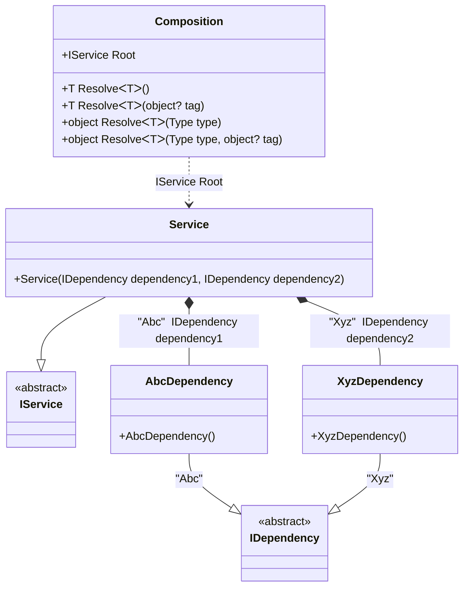
```mermaid
classDiagram
  class Composition {
    +IService Root
    +T ResolveᐸTᐳ()
    +T ResolveᐸTᐳ(object? tag)
    +object ResolveᐸTᐳ(Type type)
    +object ResolveᐸTᐳ(Type type, object? tag)
  }
  Service --|> IService : 
  class Service {
    +Service(IDependency dependency1, IDependency dependency2)
  }
  AbcDependency --|> IDependency : "Abc" 
  class AbcDependency {
    +AbcDependency()
  }
  XyzDependency --|> IDependency : "Xyz" 
  class XyzDependency {
    +XyzDependency()
  }
  class IService {
    <<abstract>>
  }
  class IDependency {
    <<abstract>>
  }
  Service *--  AbcDependency : "Abc"  IDependency dependency1
  Service *--  XyzDependency : "Xyz"  IDependency dependency2
  Composition ..> Service : IService Root
```

</details>

<details>
<summary>Generated Code</summary>

```c#
partial class Composition
{
  public Composition()
  {
  }
  
  internal Composition(Composition parent)
  {
  }
  
  #region Composition Roots
  public Pure.DI.UsageTests.Basics.TagsScenario.IService Root
  {
    [global::System.Runtime.CompilerServices.MethodImpl((global::System.Runtime.CompilerServices.MethodImplOptions)0x300)]
    get
    {
      Pure.DI.UsageTests.Basics.TagsScenario.AbcDependency v65Local8AFE6F = new Pure.DI.UsageTests.Basics.TagsScenario.AbcDependency();
      Pure.DI.UsageTests.Basics.TagsScenario.XyzDependency v66Local8AFE6F = new Pure.DI.UsageTests.Basics.TagsScenario.XyzDependency();
      Pure.DI.UsageTests.Basics.TagsScenario.Service v64Local8AFE6F = new Pure.DI.UsageTests.Basics.TagsScenario.Service(v65Local8AFE6F, v66Local8AFE6F);
      return v64Local8AFE6F;
    }
  }
  #endregion
  
  #region API
  #if NETSTANDARD2_0_OR_GREATER || NETCOREAPP || NET40_OR_GREATER
  [global::System.Diagnostics.Contracts.Pure]
  #endif
  [global::System.Runtime.CompilerServices.MethodImpl((global::System.Runtime.CompilerServices.MethodImplOptions)0x300)]
  public T Resolve<T>()
  {
    return Resolver8AFE6F<T>.Value.Resolve(this);
  }
  
  #if NETSTANDARD2_0_OR_GREATER || NETCOREAPP || NET40_OR_GREATER
  [global::System.Diagnostics.Contracts.Pure]
  #endif
  [global::System.Runtime.CompilerServices.MethodImpl((global::System.Runtime.CompilerServices.MethodImplOptions)0x300)]
  public T Resolve<T>(object? tag)
  {
    return Resolver8AFE6F<T>.Value.ResolveByTag(this, tag);
  }
  
  #if NETSTANDARD2_0_OR_GREATER || NETCOREAPP || NET40_OR_GREATER
  [global::System.Diagnostics.Contracts.Pure]
  #endif
  [global::System.Runtime.CompilerServices.MethodImpl((global::System.Runtime.CompilerServices.MethodImplOptions)0x300)]
  public object Resolve(global::System.Type type)
  {
    int index = (int)(_bucketSize8AFE6F * ((uint)global::System.Runtime.CompilerServices.RuntimeHelpers.GetHashCode(type) % 1));
    ref var pair = ref _buckets8AFE6F[index];
    if (ReferenceEquals(pair.Key, type))
    {
      return pair.Value.Resolve(this);
    }
    
    int maxIndex = index + _bucketSize8AFE6F;
    for (int i = index + 1; i < maxIndex; i++)
    {
      pair = ref _buckets8AFE6F[i];
      if (ReferenceEquals(pair.Key, type))
      {
        return pair.Value.Resolve(this);
      }
    }
    
    throw new global::System.InvalidOperationException($"Cannot resolve composition root of type {type}.");
  }
  
  #if NETSTANDARD2_0_OR_GREATER || NETCOREAPP || NET40_OR_GREATER
  [global::System.Diagnostics.Contracts.Pure]
  #endif
  [global::System.Runtime.CompilerServices.MethodImpl((global::System.Runtime.CompilerServices.MethodImplOptions)0x300)]
  public object Resolve(global::System.Type type, object? tag)
  {
    int index = (int)(_bucketSize8AFE6F * ((uint)global::System.Runtime.CompilerServices.RuntimeHelpers.GetHashCode(type) % 1));
    ref var pair = ref _buckets8AFE6F[index];
    if (ReferenceEquals(pair.Key, type))
    {
      return pair.Value.ResolveByTag(this, tag);
    }
    
    int maxIndex = index + _bucketSize8AFE6F;
    for (int i = index + 1; i < maxIndex; i++)
    {
      pair = ref _buckets8AFE6F[i];
      if (ReferenceEquals(pair.Key, type))
      {
        return pair.Value.ResolveByTag(this, tag);
      }
    }
    
    throw new global::System.InvalidOperationException($"Cannot resolve composition root of type {type}.");
  }
  
  #endregion
  
  public override string ToString()
  {
    return
      "classDiagram\n" +
        "  class Composition {\n" +
          "    +IService Root\n" +
          "    +T ResolveᐸTᐳ()\n" +
          "    +T ResolveᐸTᐳ(object? tag)\n" +
          "    +object ResolveᐸTᐳ(Type type)\n" +
          "    +object ResolveᐸTᐳ(Type type, object? tag)\n" +
        "  }\n" +
        "  Service --|> IService : \n" +
        "  class Service {\n" +
          "    +Service(IDependency dependency1, IDependency dependency2)\n" +
        "  }\n" +
        "  AbcDependency --|> IDependency : \"Abc\" \n" +
        "  class AbcDependency {\n" +
          "    +AbcDependency()\n" +
        "  }\n" +
        "  XyzDependency --|> IDependency : \"Xyz\" \n" +
        "  class XyzDependency {\n" +
          "    +XyzDependency()\n" +
        "  }\n" +
        "  class IService {\n" +
          "    <<abstract>>\n" +
        "  }\n" +
        "  class IDependency {\n" +
          "    <<abstract>>\n" +
        "  }\n" +
        "  Service *--  AbcDependency : \"Abc\"  IDependency dependency1\n" +
        "  Service *--  XyzDependency : \"Xyz\"  IDependency dependency2\n" +
        "  Composition ..> Service : IService Root";
  }
  
  private readonly static int _bucketSize8AFE6F;
  private readonly static global::Pure.DI.Pair<global::System.Type, global::Pure.DI.IResolver<Composition, object>>[] _buckets8AFE6F;
  
  static Composition()
  {
    Resolver8AFE6F0 valResolver8AFE6F0 = new Resolver8AFE6F0();
    Resolver8AFE6F<Pure.DI.UsageTests.Basics.TagsScenario.IService>.Value = valResolver8AFE6F0;
    _buckets8AFE6F = global::Pure.DI.Buckets<global::System.Type, global::Pure.DI.IResolver<Composition, object>>.Create(
      1,
      out _bucketSize8AFE6F,
      new global::Pure.DI.Pair<global::System.Type, global::Pure.DI.IResolver<Composition, object>>[1]
      {
         new global::Pure.DI.Pair<global::System.Type, global::Pure.DI.IResolver<Composition, object>>(typeof(Pure.DI.UsageTests.Basics.TagsScenario.IService), valResolver8AFE6F0)
      });
  }
  
  #region Resolvers
  #pragma warning disable CS0649
  private class Resolver8AFE6F<T>
  {
    public static global::Pure.DI.IResolver<Composition, T> Value;
  }
  
  private sealed class Resolver8AFE6F0: global::Pure.DI.IResolver<Composition, Pure.DI.UsageTests.Basics.TagsScenario.IService>
  {
    [global::System.Runtime.CompilerServices.MethodImpl((global::System.Runtime.CompilerServices.MethodImplOptions)0x300)]
    public Pure.DI.UsageTests.Basics.TagsScenario.IService Resolve(Composition composition)
    {
      return composition.Root;
    }
    
    [global::System.Runtime.CompilerServices.MethodImpl((global::System.Runtime.CompilerServices.MethodImplOptions)0x300)]
    public Pure.DI.UsageTests.Basics.TagsScenario.IService ResolveByTag(Composition composition, object tag)
    {
      if (Equals(tag, null)) return composition.Root;
      throw new global::System.InvalidOperationException($"Cannot resolve composition root \"{tag}\" of type Pure.DI.UsageTests.Basics.TagsScenario.IService.");
    }
  }
  #pragma warning restore CS0649
  #endregion
}
```

</details>


Sometimes it's important to take control of building a dependency graph. In this case, _tags_ help:

#### Auto-bindings

[](../tests/Pure.DI.UsageTests/Basics/AutoBindingScenario.cs)

This approach works great even if DI doesn't have the appropriate bindings. :warning: But it can't be recommended if you follow the dependency inversion principle and want to make sure your types only depend on abstractions.

```c#
internal class Dependency
{
}

internal class Service
{
    public Service(Dependency dependency)
    {
    }
}

DI.Setup("Composition")
    .Root<Service>("Root");

var composition = new Composition();
var service1 = composition.Root;
var service2 = composition.Resolve<Service>();
var service3 = composition.Resolve(typeof(Service));
```

<details open>
<summary>Class Diagram</summary>

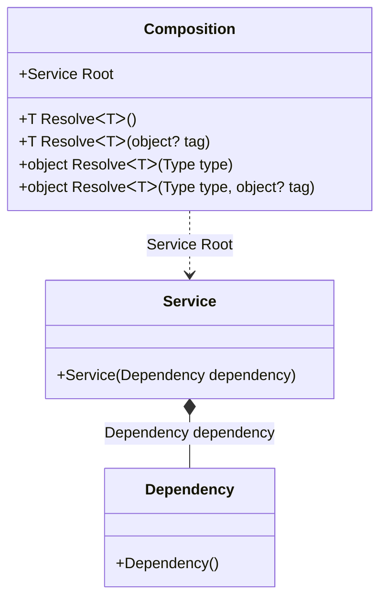
```mermaid
classDiagram
  class Composition {
    +Service Root
    +T ResolveᐸTᐳ()
    +T ResolveᐸTᐳ(object? tag)
    +object ResolveᐸTᐳ(Type type)
    +object ResolveᐸTᐳ(Type type, object? tag)
  }
  class Dependency {
    +Dependency()
  }
  class Service {
    +Service(Dependency dependency)
  }
  Service *--  Dependency : Dependency dependency
  Composition ..> Service : Service Root
```

</details>

<details>
<summary>Generated Code</summary>

```c#
partial class Composition
{
  public Composition()
  {
  }
  
  internal Composition(Composition parent)
  {
  }
  
  #region Composition Roots
  public Pure.DI.UsageTests.Basics.AutoBindingScenario.Service Root
  {
    [global::System.Runtime.CompilerServices.MethodImpl((global::System.Runtime.CompilerServices.MethodImplOptions)0x300)]
    get
    {
      Pure.DI.UsageTests.Basics.AutoBindingScenario.Dependency v36Local8AFE6F = new Pure.DI.UsageTests.Basics.AutoBindingScenario.Dependency();
      Pure.DI.UsageTests.Basics.AutoBindingScenario.Service v35Local8AFE6F = new Pure.DI.UsageTests.Basics.AutoBindingScenario.Service(v36Local8AFE6F);
      return v35Local8AFE6F;
    }
  }
  #endregion
  
  #region API
  #if NETSTANDARD2_0_OR_GREATER || NETCOREAPP || NET40_OR_GREATER
  [global::System.Diagnostics.Contracts.Pure]
  #endif
  [global::System.Runtime.CompilerServices.MethodImpl((global::System.Runtime.CompilerServices.MethodImplOptions)0x300)]
  public T Resolve<T>()
  {
    return Resolver8AFE6F<T>.Value.Resolve(this);
  }
  
  #if NETSTANDARD2_0_OR_GREATER || NETCOREAPP || NET40_OR_GREATER
  [global::System.Diagnostics.Contracts.Pure]
  #endif
  [global::System.Runtime.CompilerServices.MethodImpl((global::System.Runtime.CompilerServices.MethodImplOptions)0x300)]
  public T Resolve<T>(object? tag)
  {
    return Resolver8AFE6F<T>.Value.ResolveByTag(this, tag);
  }
  
  #if NETSTANDARD2_0_OR_GREATER || NETCOREAPP || NET40_OR_GREATER
  [global::System.Diagnostics.Contracts.Pure]
  #endif
  [global::System.Runtime.CompilerServices.MethodImpl((global::System.Runtime.CompilerServices.MethodImplOptions)0x300)]
  public object Resolve(global::System.Type type)
  {
    int index = (int)(_bucketSize8AFE6F * ((uint)global::System.Runtime.CompilerServices.RuntimeHelpers.GetHashCode(type) % 1));
    ref var pair = ref _buckets8AFE6F[index];
    if (ReferenceEquals(pair.Key, type))
    {
      return pair.Value.Resolve(this);
    }
    
    int maxIndex = index + _bucketSize8AFE6F;
    for (int i = index + 1; i < maxIndex; i++)
    {
      pair = ref _buckets8AFE6F[i];
      if (ReferenceEquals(pair.Key, type))
      {
        return pair.Value.Resolve(this);
      }
    }
    
    throw new global::System.InvalidOperationException($"Cannot resolve composition root of type {type}.");
  }
  
  #if NETSTANDARD2_0_OR_GREATER || NETCOREAPP || NET40_OR_GREATER
  [global::System.Diagnostics.Contracts.Pure]
  #endif
  [global::System.Runtime.CompilerServices.MethodImpl((global::System.Runtime.CompilerServices.MethodImplOptions)0x300)]
  public object Resolve(global::System.Type type, object? tag)
  {
    int index = (int)(_bucketSize8AFE6F * ((uint)global::System.Runtime.CompilerServices.RuntimeHelpers.GetHashCode(type) % 1));
    ref var pair = ref _buckets8AFE6F[index];
    if (ReferenceEquals(pair.Key, type))
    {
      return pair.Value.ResolveByTag(this, tag);
    }
    
    int maxIndex = index + _bucketSize8AFE6F;
    for (int i = index + 1; i < maxIndex; i++)
    {
      pair = ref _buckets8AFE6F[i];
      if (ReferenceEquals(pair.Key, type))
      {
        return pair.Value.ResolveByTag(this, tag);
      }
    }
    
    throw new global::System.InvalidOperationException($"Cannot resolve composition root of type {type}.");
  }
  
  #endregion
  
  public override string ToString()
  {
    return
      "classDiagram\n" +
        "  class Composition {\n" +
          "    +Service Root\n" +
          "    +T ResolveᐸTᐳ()\n" +
          "    +T ResolveᐸTᐳ(object? tag)\n" +
          "    +object ResolveᐸTᐳ(Type type)\n" +
          "    +object ResolveᐸTᐳ(Type type, object? tag)\n" +
        "  }\n" +
        "  class Dependency {\n" +
          "    +Dependency()\n" +
        "  }\n" +
        "  class Service {\n" +
          "    +Service(Dependency dependency)\n" +
        "  }\n" +
        "  Service *--  Dependency : Dependency dependency\n" +
        "  Composition ..> Service : Service Root";
  }
  
  private readonly static int _bucketSize8AFE6F;
  private readonly static global::Pure.DI.Pair<global::System.Type, global::Pure.DI.IResolver<Composition, object>>[] _buckets8AFE6F;
  
  static Composition()
  {
    Resolver8AFE6F0 valResolver8AFE6F0 = new Resolver8AFE6F0();
    Resolver8AFE6F<Pure.DI.UsageTests.Basics.AutoBindingScenario.Service>.Value = valResolver8AFE6F0;
    _buckets8AFE6F = global::Pure.DI.Buckets<global::System.Type, global::Pure.DI.IResolver<Composition, object>>.Create(
      1,
      out _bucketSize8AFE6F,
      new global::Pure.DI.Pair<global::System.Type, global::Pure.DI.IResolver<Composition, object>>[1]
      {
         new global::Pure.DI.Pair<global::System.Type, global::Pure.DI.IResolver<Composition, object>>(typeof(Pure.DI.UsageTests.Basics.AutoBindingScenario.Service), valResolver8AFE6F0)
      });
  }
  
  #region Resolvers
  #pragma warning disable CS0649
  private class Resolver8AFE6F<T>
  {
    public static global::Pure.DI.IResolver<Composition, T> Value;
  }
  
  private sealed class Resolver8AFE6F0: global::Pure.DI.IResolver<Composition, Pure.DI.UsageTests.Basics.AutoBindingScenario.Service>
  {
    [global::System.Runtime.CompilerServices.MethodImpl((global::System.Runtime.CompilerServices.MethodImplOptions)0x300)]
    public Pure.DI.UsageTests.Basics.AutoBindingScenario.Service Resolve(Composition composition)
    {
      return composition.Root;
    }
    
    [global::System.Runtime.CompilerServices.MethodImpl((global::System.Runtime.CompilerServices.MethodImplOptions)0x300)]
    public Pure.DI.UsageTests.Basics.AutoBindingScenario.Service ResolveByTag(Composition composition, object tag)
    {
      if (Equals(tag, null)) return composition.Root;
      throw new global::System.InvalidOperationException($"Cannot resolve composition root \"{tag}\" of type Pure.DI.UsageTests.Basics.AutoBindingScenario.Service.");
    }
  }
  #pragma warning restore CS0649
  #endregion
}
```

</details>


#### Child composition

[](../tests/Pure.DI.UsageTests/Basics/ChildCompositionScenario.cs)

```c#
internal interface IDependency
{
    bool IsDisposed { get; }
}

internal class Dependency : IDependency, IDisposable
{
    public bool IsDisposed { get; private set; }

    public void Dispose()
    {
        IsDisposed = true;
    }
}

internal interface IService
{
    IDependency Dependency { get; }
}

internal class Service : IService
{
    public Service(IDependency dependency)
    {
        Dependency = dependency;
    }

    public IDependency Dependency { get; }
}

DI.Setup("Composition")
    .Bind<IDependency>().As(Lifetime.Singleton).To<Dependency>()
    .Bind<IService>().To<Service>().Root<IService>("Root");

var composition = new Composition();
IService serviceFromChild;
using (var childComposition = new Composition(composition))
{
    serviceFromChild = childComposition.Root;
}
        
serviceFromChild.Dependency.IsDisposed.ShouldBeTrue();
        
var service = composition.Root;
using (var childComposition = new Composition(composition))
{
    childComposition.Root.Dependency.ShouldBe(service.Dependency);
}
```

<details open>
<summary>Class Diagram</summary>

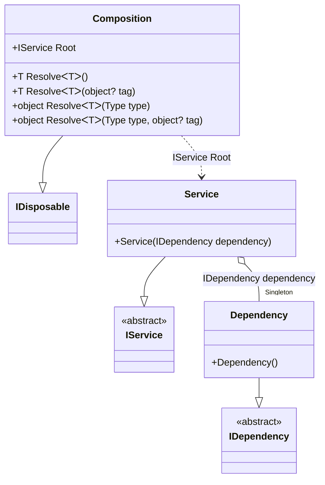
```mermaid
classDiagram
  class Composition {
    +IService Root
    +T ResolveᐸTᐳ()
    +T ResolveᐸTᐳ(object? tag)
    +object ResolveᐸTᐳ(Type type)
    +object ResolveᐸTᐳ(Type type, object? tag)
  }
  Composition --|> IDisposable
  Service --|> IService : 
  class Service {
    +Service(IDependency dependency)
  }
  Dependency --|> IDependency : 
  class Dependency {
    +Dependency()
  }
  class IService {
    <<abstract>>
  }
  class IDependency {
    <<abstract>>
  }
  Service o--  "Singleton" Dependency : IDependency dependency
  Composition ..> Service : IService Root
```

</details>

<details>
<summary>Generated Code</summary>

```c#
partial class Composition: System.IDisposable
{
  private int _disposeIndex8AFE6F;
  private readonly System.IDisposable[] _disposables8AFE6F;
  private Pure.DI.UsageTests.Basics.ChildCompositionScenario.Dependency _f18Singleton8AFE6F;
  
  public Composition()
  {
    _disposables8AFE6F = new System.IDisposable[1];
  }
  
  internal Composition(Composition parent)
  {
    lock (parent._disposables8AFE6F)
    {
      _disposables8AFE6F = new System.IDisposable[1 - parent._disposeIndex8AFE6F];
      _f18Singleton8AFE6F = parent._f18Singleton8AFE6F;
    }
  }
  
  #region Composition Roots
  public Pure.DI.UsageTests.Basics.ChildCompositionScenario.IService Root
  {
    [global::System.Runtime.CompilerServices.MethodImpl((global::System.Runtime.CompilerServices.MethodImplOptions)0x300)]
    get
    {
      if (global::System.Object.ReferenceEquals(_f18Singleton8AFE6F, null))
      {
        lock (_disposables8AFE6F)
        {
          if (global::System.Object.ReferenceEquals(_f18Singleton8AFE6F, null))
          {
            _f18Singleton8AFE6F = new Pure.DI.UsageTests.Basics.ChildCompositionScenario.Dependency();
            _disposables8AFE6F[_disposeIndex8AFE6F++] = _f18Singleton8AFE6F;
          }
        }
      }
      
      Pure.DI.UsageTests.Basics.ChildCompositionScenario.Service v37Local8AFE6F = new Pure.DI.UsageTests.Basics.ChildCompositionScenario.Service(_f18Singleton8AFE6F);
      return v37Local8AFE6F;
    }
  }
  #endregion
  
  #region API
  #if NETSTANDARD2_0_OR_GREATER || NETCOREAPP || NET40_OR_GREATER
  [global::System.Diagnostics.Contracts.Pure]
  #endif
  [global::System.Runtime.CompilerServices.MethodImpl((global::System.Runtime.CompilerServices.MethodImplOptions)0x300)]
  public T Resolve<T>()
  {
    return Resolver8AFE6F<T>.Value.Resolve(this);
  }
  
  #if NETSTANDARD2_0_OR_GREATER || NETCOREAPP || NET40_OR_GREATER
  [global::System.Diagnostics.Contracts.Pure]
  #endif
  [global::System.Runtime.CompilerServices.MethodImpl((global::System.Runtime.CompilerServices.MethodImplOptions)0x300)]
  public T Resolve<T>(object? tag)
  {
    return Resolver8AFE6F<T>.Value.ResolveByTag(this, tag);
  }
  
  #if NETSTANDARD2_0_OR_GREATER || NETCOREAPP || NET40_OR_GREATER
  [global::System.Diagnostics.Contracts.Pure]
  #endif
  [global::System.Runtime.CompilerServices.MethodImpl((global::System.Runtime.CompilerServices.MethodImplOptions)0x300)]
  public object Resolve(global::System.Type type)
  {
    int index = (int)(_bucketSize8AFE6F * ((uint)global::System.Runtime.CompilerServices.RuntimeHelpers.GetHashCode(type) % 1));
    ref var pair = ref _buckets8AFE6F[index];
    if (ReferenceEquals(pair.Key, type))
    {
      return pair.Value.Resolve(this);
    }
    
    int maxIndex = index + _bucketSize8AFE6F;
    for (int i = index + 1; i < maxIndex; i++)
    {
      pair = ref _buckets8AFE6F[i];
      if (ReferenceEquals(pair.Key, type))
      {
        return pair.Value.Resolve(this);
      }
    }
    
    throw new global::System.InvalidOperationException($"Cannot resolve composition root of type {type}.");
  }
  
  #if NETSTANDARD2_0_OR_GREATER || NETCOREAPP || NET40_OR_GREATER
  [global::System.Diagnostics.Contracts.Pure]
  #endif
  [global::System.Runtime.CompilerServices.MethodImpl((global::System.Runtime.CompilerServices.MethodImplOptions)0x300)]
  public object Resolve(global::System.Type type, object? tag)
  {
    int index = (int)(_bucketSize8AFE6F * ((uint)global::System.Runtime.CompilerServices.RuntimeHelpers.GetHashCode(type) % 1));
    ref var pair = ref _buckets8AFE6F[index];
    if (ReferenceEquals(pair.Key, type))
    {
      return pair.Value.ResolveByTag(this, tag);
    }
    
    int maxIndex = index + _bucketSize8AFE6F;
    for (int i = index + 1; i < maxIndex; i++)
    {
      pair = ref _buckets8AFE6F[i];
      if (ReferenceEquals(pair.Key, type))
      {
        return pair.Value.ResolveByTag(this, tag);
      }
    }
    
    throw new global::System.InvalidOperationException($"Cannot resolve composition root of type {type}.");
  }
  
  #endregion
  
  public void Dispose()
  {
    lock (_disposables8AFE6F)
    {
      while (_disposeIndex8AFE6F > 0)
      {
        try
        {
          _disposables8AFE6F[--_disposeIndex8AFE6F].Dispose();
        }
        catch
        {
          // ignored
        }
      }
      
      _f18Singleton8AFE6F = null;
    }
  }
  
  public override string ToString()
  {
    return
      "classDiagram\n" +
        "  class Composition {\n" +
          "    +IService Root\n" +
          "    +T ResolveᐸTᐳ()\n" +
          "    +T ResolveᐸTᐳ(object? tag)\n" +
          "    +object ResolveᐸTᐳ(Type type)\n" +
          "    +object ResolveᐸTᐳ(Type type, object? tag)\n" +
        "  }\n" +
        "  Composition --|> IDisposable\n" +
        "  Service --|> IService : \n" +
        "  class Service {\n" +
          "    +Service(IDependency dependency)\n" +
        "  }\n" +
        "  Dependency --|> IDependency : \n" +
        "  class Dependency {\n" +
          "    +Dependency()\n" +
        "  }\n" +
        "  class IService {\n" +
          "    <<abstract>>\n" +
        "  }\n" +
        "  class IDependency {\n" +
          "    <<abstract>>\n" +
        "  }\n" +
        "  Service o--  \"Singleton\" Dependency : IDependency dependency\n" +
        "  Composition ..> Service : IService Root";
  }
  
  private readonly static int _bucketSize8AFE6F;
  private readonly static global::Pure.DI.Pair<global::System.Type, global::Pure.DI.IResolver<Composition, object>>[] _buckets8AFE6F;
  
  static Composition()
  {
    Resolver8AFE6F0 valResolver8AFE6F0 = new Resolver8AFE6F0();
    Resolver8AFE6F<Pure.DI.UsageTests.Basics.ChildCompositionScenario.IService>.Value = valResolver8AFE6F0;
    _buckets8AFE6F = global::Pure.DI.Buckets<global::System.Type, global::Pure.DI.IResolver<Composition, object>>.Create(
      1,
      out _bucketSize8AFE6F,
      new global::Pure.DI.Pair<global::System.Type, global::Pure.DI.IResolver<Composition, object>>[1]
      {
         new global::Pure.DI.Pair<global::System.Type, global::Pure.DI.IResolver<Composition, object>>(typeof(Pure.DI.UsageTests.Basics.ChildCompositionScenario.IService), valResolver8AFE6F0)
      });
  }
  
  #region Resolvers
  #pragma warning disable CS0649
  private class Resolver8AFE6F<T>
  {
    public static global::Pure.DI.IResolver<Composition, T> Value;
  }
  
  private sealed class Resolver8AFE6F0: global::Pure.DI.IResolver<Composition, Pure.DI.UsageTests.Basics.ChildCompositionScenario.IService>
  {
    [global::System.Runtime.CompilerServices.MethodImpl((global::System.Runtime.CompilerServices.MethodImplOptions)0x300)]
    public Pure.DI.UsageTests.Basics.ChildCompositionScenario.IService Resolve(Composition composition)
    {
      return composition.Root;
    }
    
    [global::System.Runtime.CompilerServices.MethodImpl((global::System.Runtime.CompilerServices.MethodImplOptions)0x300)]
    public Pure.DI.UsageTests.Basics.ChildCompositionScenario.IService ResolveByTag(Composition composition, object tag)
    {
      if (Equals(tag, null)) return composition.Root;
      throw new global::System.InvalidOperationException($"Cannot resolve composition root \"{tag}\" of type Pure.DI.UsageTests.Basics.ChildCompositionScenario.IService.");
    }
  }
  #pragma warning restore CS0649
  #endregion
}
```

</details>


#### Multi-contract bindings

[](../tests/Pure.DI.UsageTests/Basics/MultiContractBindingsScenario.cs)

```c#
internal interface IDependency { }

internal interface IAdvancedDependency { }

internal class Dependency : IDependency, IAdvancedDependency { }

internal interface IService { }

internal class Service : IService
{
    public Service(
        IDependency dependency,
        IAdvancedDependency advancedDependency)
    {
    }
}

DI.Setup("Composition")
    .Bind<IDependency>().Bind<IAdvancedDependency>().To<Dependency>()
    .Bind<IService>().To<Service>().Root<IService>("Root");

var composition = new Composition();
var service = composition.Root;
```

<details open>
<summary>Class Diagram</summary>

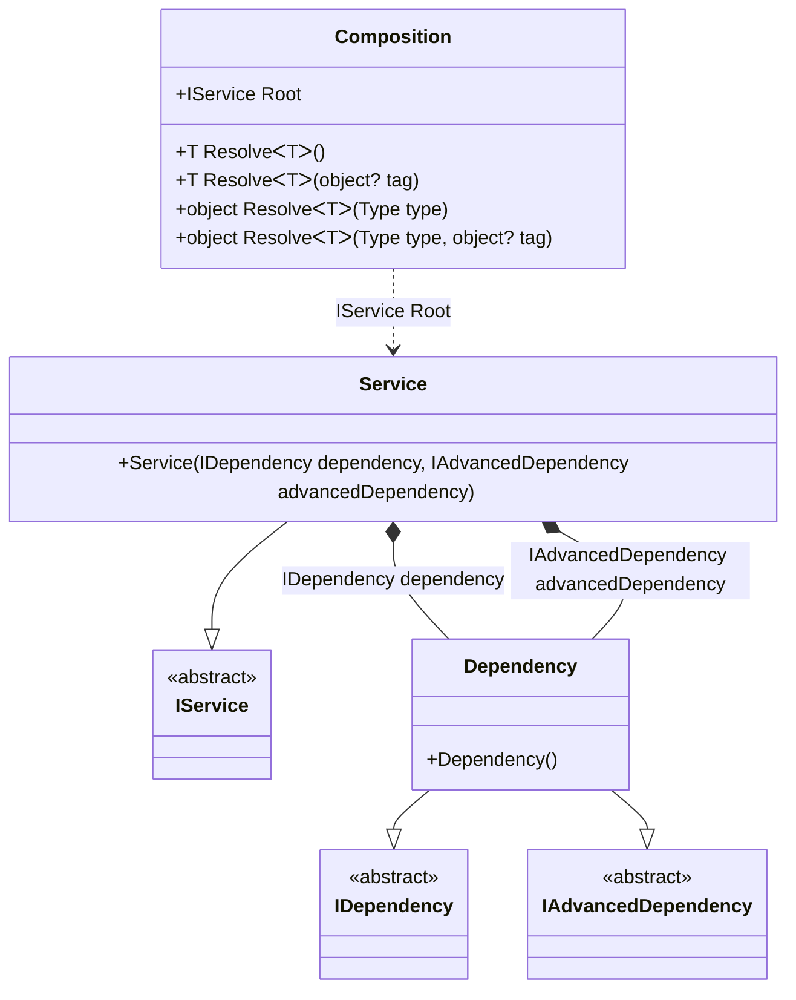
```mermaid
classDiagram
  class Composition {
    +IService Root
    +T ResolveᐸTᐳ()
    +T ResolveᐸTᐳ(object? tag)
    +object ResolveᐸTᐳ(Type type)
    +object ResolveᐸTᐳ(Type type, object? tag)
  }
  Service --|> IService : 
  class Service {
    +Service(IDependency dependency, IAdvancedDependency advancedDependency)
  }
  Dependency --|> IDependency : 
  Dependency --|> IAdvancedDependency : 
  class Dependency {
    +Dependency()
  }
  class IService {
    <<abstract>>
  }
  class IDependency {
    <<abstract>>
  }
  class IAdvancedDependency {
    <<abstract>>
  }
  Service *--  Dependency : IDependency dependency
  Service *--  Dependency : IAdvancedDependency advancedDependency
  Composition ..> Service : IService Root
```

</details>

<details>
<summary>Generated Code</summary>

```c#
partial class Composition
{
  public Composition()
  {
  }
  
  internal Composition(Composition parent)
  {
  }
  
  #region Composition Roots
  public Pure.DI.UsageTests.Basics.MultiContractBindingsScenario.IService Root
  {
    [global::System.Runtime.CompilerServices.MethodImpl((global::System.Runtime.CompilerServices.MethodImplOptions)0x300)]
    get
    {
      Pure.DI.UsageTests.Basics.MultiContractBindingsScenario.Dependency v57Local8AFE6F = new Pure.DI.UsageTests.Basics.MultiContractBindingsScenario.Dependency();
      Pure.DI.UsageTests.Basics.MultiContractBindingsScenario.Dependency v58Local8AFE6F = new Pure.DI.UsageTests.Basics.MultiContractBindingsScenario.Dependency();
      Pure.DI.UsageTests.Basics.MultiContractBindingsScenario.Service v56Local8AFE6F = new Pure.DI.UsageTests.Basics.MultiContractBindingsScenario.Service(v57Local8AFE6F, v58Local8AFE6F);
      return v56Local8AFE6F;
    }
  }
  #endregion
  
  #region API
  #if NETSTANDARD2_0_OR_GREATER || NETCOREAPP || NET40_OR_GREATER
  [global::System.Diagnostics.Contracts.Pure]
  #endif
  [global::System.Runtime.CompilerServices.MethodImpl((global::System.Runtime.CompilerServices.MethodImplOptions)0x300)]
  public T Resolve<T>()
  {
    return Resolver8AFE6F<T>.Value.Resolve(this);
  }
  
  #if NETSTANDARD2_0_OR_GREATER || NETCOREAPP || NET40_OR_GREATER
  [global::System.Diagnostics.Contracts.Pure]
  #endif
  [global::System.Runtime.CompilerServices.MethodImpl((global::System.Runtime.CompilerServices.MethodImplOptions)0x300)]
  public T Resolve<T>(object? tag)
  {
    return Resolver8AFE6F<T>.Value.ResolveByTag(this, tag);
  }
  
  #if NETSTANDARD2_0_OR_GREATER || NETCOREAPP || NET40_OR_GREATER
  [global::System.Diagnostics.Contracts.Pure]
  #endif
  [global::System.Runtime.CompilerServices.MethodImpl((global::System.Runtime.CompilerServices.MethodImplOptions)0x300)]
  public object Resolve(global::System.Type type)
  {
    int index = (int)(_bucketSize8AFE6F * ((uint)global::System.Runtime.CompilerServices.RuntimeHelpers.GetHashCode(type) % 1));
    ref var pair = ref _buckets8AFE6F[index];
    if (ReferenceEquals(pair.Key, type))
    {
      return pair.Value.Resolve(this);
    }
    
    int maxIndex = index + _bucketSize8AFE6F;
    for (int i = index + 1; i < maxIndex; i++)
    {
      pair = ref _buckets8AFE6F[i];
      if (ReferenceEquals(pair.Key, type))
      {
        return pair.Value.Resolve(this);
      }
    }
    
    throw new global::System.InvalidOperationException($"Cannot resolve composition root of type {type}.");
  }
  
  #if NETSTANDARD2_0_OR_GREATER || NETCOREAPP || NET40_OR_GREATER
  [global::System.Diagnostics.Contracts.Pure]
  #endif
  [global::System.Runtime.CompilerServices.MethodImpl((global::System.Runtime.CompilerServices.MethodImplOptions)0x300)]
  public object Resolve(global::System.Type type, object? tag)
  {
    int index = (int)(_bucketSize8AFE6F * ((uint)global::System.Runtime.CompilerServices.RuntimeHelpers.GetHashCode(type) % 1));
    ref var pair = ref _buckets8AFE6F[index];
    if (ReferenceEquals(pair.Key, type))
    {
      return pair.Value.ResolveByTag(this, tag);
    }
    
    int maxIndex = index + _bucketSize8AFE6F;
    for (int i = index + 1; i < maxIndex; i++)
    {
      pair = ref _buckets8AFE6F[i];
      if (ReferenceEquals(pair.Key, type))
      {
        return pair.Value.ResolveByTag(this, tag);
      }
    }
    
    throw new global::System.InvalidOperationException($"Cannot resolve composition root of type {type}.");
  }
  
  #endregion
  
  public override string ToString()
  {
    return
      "classDiagram\n" +
        "  class Composition {\n" +
          "    +IService Root\n" +
          "    +T ResolveᐸTᐳ()\n" +
          "    +T ResolveᐸTᐳ(object? tag)\n" +
          "    +object ResolveᐸTᐳ(Type type)\n" +
          "    +object ResolveᐸTᐳ(Type type, object? tag)\n" +
        "  }\n" +
        "  Service --|> IService : \n" +
        "  class Service {\n" +
          "    +Service(IDependency dependency, IAdvancedDependency advancedDependency)\n" +
        "  }\n" +
        "  Dependency --|> IDependency : \n" +
        "  Dependency --|> IAdvancedDependency : \n" +
        "  class Dependency {\n" +
          "    +Dependency()\n" +
        "  }\n" +
        "  class IService {\n" +
          "    <<abstract>>\n" +
        "  }\n" +
        "  class IDependency {\n" +
          "    <<abstract>>\n" +
        "  }\n" +
        "  class IAdvancedDependency {\n" +
          "    <<abstract>>\n" +
        "  }\n" +
        "  Service *--  Dependency : IDependency dependency\n" +
        "  Service *--  Dependency : IAdvancedDependency advancedDependency\n" +
        "  Composition ..> Service : IService Root";
  }
  
  private readonly static int _bucketSize8AFE6F;
  private readonly static global::Pure.DI.Pair<global::System.Type, global::Pure.DI.IResolver<Composition, object>>[] _buckets8AFE6F;
  
  static Composition()
  {
    Resolver8AFE6F0 valResolver8AFE6F0 = new Resolver8AFE6F0();
    Resolver8AFE6F<Pure.DI.UsageTests.Basics.MultiContractBindingsScenario.IService>.Value = valResolver8AFE6F0;
    _buckets8AFE6F = global::Pure.DI.Buckets<global::System.Type, global::Pure.DI.IResolver<Composition, object>>.Create(
      1,
      out _bucketSize8AFE6F,
      new global::Pure.DI.Pair<global::System.Type, global::Pure.DI.IResolver<Composition, object>>[1]
      {
         new global::Pure.DI.Pair<global::System.Type, global::Pure.DI.IResolver<Composition, object>>(typeof(Pure.DI.UsageTests.Basics.MultiContractBindingsScenario.IService), valResolver8AFE6F0)
      });
  }
  
  #region Resolvers
  #pragma warning disable CS0649
  private class Resolver8AFE6F<T>
  {
    public static global::Pure.DI.IResolver<Composition, T> Value;
  }
  
  private sealed class Resolver8AFE6F0: global::Pure.DI.IResolver<Composition, Pure.DI.UsageTests.Basics.MultiContractBindingsScenario.IService>
  {
    [global::System.Runtime.CompilerServices.MethodImpl((global::System.Runtime.CompilerServices.MethodImplOptions)0x300)]
    public Pure.DI.UsageTests.Basics.MultiContractBindingsScenario.IService Resolve(Composition composition)
    {
      return composition.Root;
    }
    
    [global::System.Runtime.CompilerServices.MethodImpl((global::System.Runtime.CompilerServices.MethodImplOptions)0x300)]
    public Pure.DI.UsageTests.Basics.MultiContractBindingsScenario.IService ResolveByTag(Composition composition, object tag)
    {
      if (Equals(tag, null)) return composition.Root;
      throw new global::System.InvalidOperationException($"Cannot resolve composition root \"{tag}\" of type Pure.DI.UsageTests.Basics.MultiContractBindingsScenario.IService.");
    }
  }
  #pragma warning restore CS0649
  #endregion
}
```

</details>


#### Field Injection

[](../tests/Pure.DI.UsageTests/Basics/FieldInjectionScenario.cs)

To use dependency injection for a field, make sure the field is writable and simply add the _Ordinal_ attribute to that field, specifying an ordinal that will be used to determine the injection order:

```c#
internal interface IDependency { }

internal class Dependency : IDependency { }

internal interface IService
{
    IDependency? Dependency { get; }
}

internal class Service : IService
{
    [Ordinal(0)]
    internal IDependency? DependencyVal;

    public IDependency? Dependency => DependencyVal;
}

DI.Setup("Composition")
    .Bind<IDependency>().To<Dependency>()
    .Bind<IService>().To<Service>().Root<IService>("Root");

var composition = new Composition();
var service = composition.Root;
service.Dependency.ShouldBeOfType<Dependency>();
```

<details open>
<summary>Class Diagram</summary>

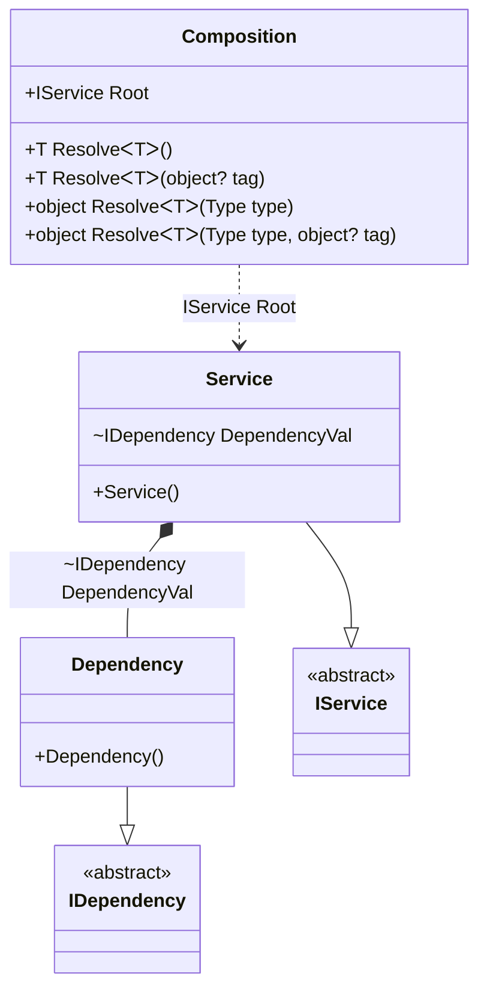
```mermaid
classDiagram
  class Composition {
    +IService Root
    +T ResolveᐸTᐳ()
    +T ResolveᐸTᐳ(object? tag)
    +object ResolveᐸTᐳ(Type type)
    +object ResolveᐸTᐳ(Type type, object? tag)
  }
  Dependency --|> IDependency : 
  class Dependency {
    +Dependency()
  }
  Service --|> IService : 
  class Service {
    +Service()
    ~IDependency DependencyVal
  }
  class IDependency {
    <<abstract>>
  }
  class IService {
    <<abstract>>
  }
  Service *--  Dependency : ~IDependency DependencyVal
  Composition ..> Service : IService Root
```

</details>

<details>
<summary>Generated Code</summary>

```c#
partial class Composition
{
  public Composition()
  {
  }
  
  internal Composition(Composition parent)
  {
  }
  
  #region Composition Roots
  public Pure.DI.UsageTests.Basics.FieldInjectionScenario.IService Root
  {
    [global::System.Runtime.CompilerServices.MethodImpl((global::System.Runtime.CompilerServices.MethodImplOptions)0x300)]
    get
    {
      Pure.DI.UsageTests.Basics.FieldInjectionScenario.Dependency v48Local8AFE6F = new Pure.DI.UsageTests.Basics.FieldInjectionScenario.Dependency();
      Pure.DI.UsageTests.Basics.FieldInjectionScenario.Service v47Local8AFE6F = new Pure.DI.UsageTests.Basics.FieldInjectionScenario.Service();
      v47Local8AFE6F.DependencyVal = v48Local8AFE6F;
      return v47Local8AFE6F;
    }
  }
  #endregion
  
  #region API
  #if NETSTANDARD2_0_OR_GREATER || NETCOREAPP || NET40_OR_GREATER
  [global::System.Diagnostics.Contracts.Pure]
  #endif
  [global::System.Runtime.CompilerServices.MethodImpl((global::System.Runtime.CompilerServices.MethodImplOptions)0x300)]
  public T Resolve<T>()
  {
    return Resolver8AFE6F<T>.Value.Resolve(this);
  }
  
  #if NETSTANDARD2_0_OR_GREATER || NETCOREAPP || NET40_OR_GREATER
  [global::System.Diagnostics.Contracts.Pure]
  #endif
  [global::System.Runtime.CompilerServices.MethodImpl((global::System.Runtime.CompilerServices.MethodImplOptions)0x300)]
  public T Resolve<T>(object? tag)
  {
    return Resolver8AFE6F<T>.Value.ResolveByTag(this, tag);
  }
  
  #if NETSTANDARD2_0_OR_GREATER || NETCOREAPP || NET40_OR_GREATER
  [global::System.Diagnostics.Contracts.Pure]
  #endif
  [global::System.Runtime.CompilerServices.MethodImpl((global::System.Runtime.CompilerServices.MethodImplOptions)0x300)]
  public object Resolve(global::System.Type type)
  {
    int index = (int)(_bucketSize8AFE6F * ((uint)global::System.Runtime.CompilerServices.RuntimeHelpers.GetHashCode(type) % 1));
    ref var pair = ref _buckets8AFE6F[index];
    if (ReferenceEquals(pair.Key, type))
    {
      return pair.Value.Resolve(this);
    }
    
    int maxIndex = index + _bucketSize8AFE6F;
    for (int i = index + 1; i < maxIndex; i++)
    {
      pair = ref _buckets8AFE6F[i];
      if (ReferenceEquals(pair.Key, type))
      {
        return pair.Value.Resolve(this);
      }
    }
    
    throw new global::System.InvalidOperationException($"Cannot resolve composition root of type {type}.");
  }
  
  #if NETSTANDARD2_0_OR_GREATER || NETCOREAPP || NET40_OR_GREATER
  [global::System.Diagnostics.Contracts.Pure]
  #endif
  [global::System.Runtime.CompilerServices.MethodImpl((global::System.Runtime.CompilerServices.MethodImplOptions)0x300)]
  public object Resolve(global::System.Type type, object? tag)
  {
    int index = (int)(_bucketSize8AFE6F * ((uint)global::System.Runtime.CompilerServices.RuntimeHelpers.GetHashCode(type) % 1));
    ref var pair = ref _buckets8AFE6F[index];
    if (ReferenceEquals(pair.Key, type))
    {
      return pair.Value.ResolveByTag(this, tag);
    }
    
    int maxIndex = index + _bucketSize8AFE6F;
    for (int i = index + 1; i < maxIndex; i++)
    {
      pair = ref _buckets8AFE6F[i];
      if (ReferenceEquals(pair.Key, type))
      {
        return pair.Value.ResolveByTag(this, tag);
      }
    }
    
    throw new global::System.InvalidOperationException($"Cannot resolve composition root of type {type}.");
  }
  
  #endregion
  
  public override string ToString()
  {
    return
      "classDiagram\n" +
        "  class Composition {\n" +
          "    +IService Root\n" +
          "    +T ResolveᐸTᐳ()\n" +
          "    +T ResolveᐸTᐳ(object? tag)\n" +
          "    +object ResolveᐸTᐳ(Type type)\n" +
          "    +object ResolveᐸTᐳ(Type type, object? tag)\n" +
        "  }\n" +
        "  Dependency --|> IDependency : \n" +
        "  class Dependency {\n" +
          "    +Dependency()\n" +
        "  }\n" +
        "  Service --|> IService : \n" +
        "  class Service {\n" +
          "    +Service()\n" +
          "    ~IDependency DependencyVal\n" +
        "  }\n" +
        "  class IDependency {\n" +
          "    <<abstract>>\n" +
        "  }\n" +
        "  class IService {\n" +
          "    <<abstract>>\n" +
        "  }\n" +
        "  Service *--  Dependency : ~IDependency DependencyVal\n" +
        "  Composition ..> Service : IService Root";
  }
  
  private readonly static int _bucketSize8AFE6F;
  private readonly static global::Pure.DI.Pair<global::System.Type, global::Pure.DI.IResolver<Composition, object>>[] _buckets8AFE6F;
  
  static Composition()
  {
    Resolver8AFE6F0 valResolver8AFE6F0 = new Resolver8AFE6F0();
    Resolver8AFE6F<Pure.DI.UsageTests.Basics.FieldInjectionScenario.IService>.Value = valResolver8AFE6F0;
    _buckets8AFE6F = global::Pure.DI.Buckets<global::System.Type, global::Pure.DI.IResolver<Composition, object>>.Create(
      1,
      out _bucketSize8AFE6F,
      new global::Pure.DI.Pair<global::System.Type, global::Pure.DI.IResolver<Composition, object>>[1]
      {
         new global::Pure.DI.Pair<global::System.Type, global::Pure.DI.IResolver<Composition, object>>(typeof(Pure.DI.UsageTests.Basics.FieldInjectionScenario.IService), valResolver8AFE6F0)
      });
  }
  
  #region Resolvers
  #pragma warning disable CS0649
  private class Resolver8AFE6F<T>
  {
    public static global::Pure.DI.IResolver<Composition, T> Value;
  }
  
  private sealed class Resolver8AFE6F0: global::Pure.DI.IResolver<Composition, Pure.DI.UsageTests.Basics.FieldInjectionScenario.IService>
  {
    [global::System.Runtime.CompilerServices.MethodImpl((global::System.Runtime.CompilerServices.MethodImplOptions)0x300)]
    public Pure.DI.UsageTests.Basics.FieldInjectionScenario.IService Resolve(Composition composition)
    {
      return composition.Root;
    }
    
    [global::System.Runtime.CompilerServices.MethodImpl((global::System.Runtime.CompilerServices.MethodImplOptions)0x300)]
    public Pure.DI.UsageTests.Basics.FieldInjectionScenario.IService ResolveByTag(Composition composition, object tag)
    {
      if (Equals(tag, null)) return composition.Root;
      throw new global::System.InvalidOperationException($"Cannot resolve composition root \"{tag}\" of type Pure.DI.UsageTests.Basics.FieldInjectionScenario.IService.");
    }
  }
  #pragma warning restore CS0649
  #endregion
}
```

</details>


#### Property Injection

[](../tests/Pure.DI.UsageTests/Basics/PropertyInjectionScenario.cs)

To use dependency injection on a property, make sure the property is writable and simply add the _Ordinal_ attribute to that property, specifying the ordinal that will be used to determine the injection order:

```c#
internal interface IDependency { }

internal class Dependency : IDependency { }

internal interface IService
{
    IDependency? Dependency { get; }
}

internal class Service : IService
{
    [Ordinal(0)]
    public IDependency? Dependency { get; set; }
}

DI.Setup("Composition")
    .Bind<IDependency>().To<Dependency>()
    .Bind<IService>().To<Service>().Root<IService>("Root");

var composition = new Composition();
var service = composition.Root;
service.Dependency.ShouldBeOfType<Dependency>();
```

<details open>
<summary>Class Diagram</summary>

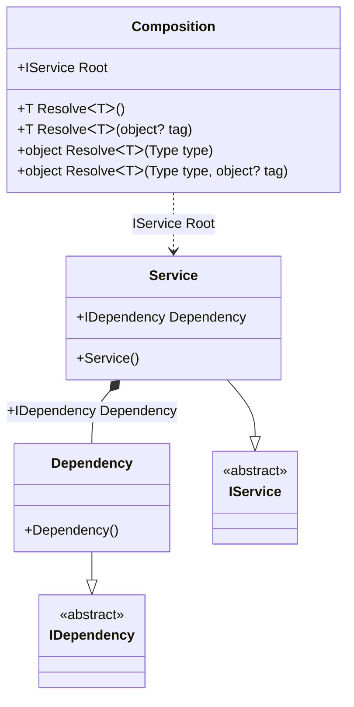
```mermaid
classDiagram
  class Composition {
    +IService Root
    +T ResolveᐸTᐳ()
    +T ResolveᐸTᐳ(object? tag)
    +object ResolveᐸTᐳ(Type type)
    +object ResolveᐸTᐳ(Type type, object? tag)
  }
  Dependency --|> IDependency : 
  class Dependency {
    +Dependency()
  }
  Service --|> IService : 
  class Service {
    +Service()
    +IDependency Dependency
  }
  class IDependency {
    <<abstract>>
  }
  class IService {
    <<abstract>>
  }
  Service *--  Dependency : +IDependency Dependency
  Composition ..> Service : IService Root
```

</details>

<details>
<summary>Generated Code</summary>

```c#
partial class Composition
{
  public Composition()
  {
  }
  
  internal Composition(Composition parent)
  {
  }
  
  #region Composition Roots
  public Pure.DI.UsageTests.Basics.PropertyInjectionScenario.IService Root
  {
    [global::System.Runtime.CompilerServices.MethodImpl((global::System.Runtime.CompilerServices.MethodImplOptions)0x300)]
    get
    {
      Pure.DI.UsageTests.Basics.PropertyInjectionScenario.Dependency v60Local8AFE6F = new Pure.DI.UsageTests.Basics.PropertyInjectionScenario.Dependency();
      Pure.DI.UsageTests.Basics.PropertyInjectionScenario.Service v59Local8AFE6F = new Pure.DI.UsageTests.Basics.PropertyInjectionScenario.Service();
      v59Local8AFE6F.Dependency = v60Local8AFE6F;
      return v59Local8AFE6F;
    }
  }
  #endregion
  
  #region API
  #if NETSTANDARD2_0_OR_GREATER || NETCOREAPP || NET40_OR_GREATER
  [global::System.Diagnostics.Contracts.Pure]
  #endif
  [global::System.Runtime.CompilerServices.MethodImpl((global::System.Runtime.CompilerServices.MethodImplOptions)0x300)]
  public T Resolve<T>()
  {
    return Resolver8AFE6F<T>.Value.Resolve(this);
  }
  
  #if NETSTANDARD2_0_OR_GREATER || NETCOREAPP || NET40_OR_GREATER
  [global::System.Diagnostics.Contracts.Pure]
  #endif
  [global::System.Runtime.CompilerServices.MethodImpl((global::System.Runtime.CompilerServices.MethodImplOptions)0x300)]
  public T Resolve<T>(object? tag)
  {
    return Resolver8AFE6F<T>.Value.ResolveByTag(this, tag);
  }
  
  #if NETSTANDARD2_0_OR_GREATER || NETCOREAPP || NET40_OR_GREATER
  [global::System.Diagnostics.Contracts.Pure]
  #endif
  [global::System.Runtime.CompilerServices.MethodImpl((global::System.Runtime.CompilerServices.MethodImplOptions)0x300)]
  public object Resolve(global::System.Type type)
  {
    int index = (int)(_bucketSize8AFE6F * ((uint)global::System.Runtime.CompilerServices.RuntimeHelpers.GetHashCode(type) % 1));
    ref var pair = ref _buckets8AFE6F[index];
    if (ReferenceEquals(pair.Key, type))
    {
      return pair.Value.Resolve(this);
    }
    
    int maxIndex = index + _bucketSize8AFE6F;
    for (int i = index + 1; i < maxIndex; i++)
    {
      pair = ref _buckets8AFE6F[i];
      if (ReferenceEquals(pair.Key, type))
      {
        return pair.Value.Resolve(this);
      }
    }
    
    throw new global::System.InvalidOperationException($"Cannot resolve composition root of type {type}.");
  }
  
  #if NETSTANDARD2_0_OR_GREATER || NETCOREAPP || NET40_OR_GREATER
  [global::System.Diagnostics.Contracts.Pure]
  #endif
  [global::System.Runtime.CompilerServices.MethodImpl((global::System.Runtime.CompilerServices.MethodImplOptions)0x300)]
  public object Resolve(global::System.Type type, object? tag)
  {
    int index = (int)(_bucketSize8AFE6F * ((uint)global::System.Runtime.CompilerServices.RuntimeHelpers.GetHashCode(type) % 1));
    ref var pair = ref _buckets8AFE6F[index];
    if (ReferenceEquals(pair.Key, type))
    {
      return pair.Value.ResolveByTag(this, tag);
    }
    
    int maxIndex = index + _bucketSize8AFE6F;
    for (int i = index + 1; i < maxIndex; i++)
    {
      pair = ref _buckets8AFE6F[i];
      if (ReferenceEquals(pair.Key, type))
      {
        return pair.Value.ResolveByTag(this, tag);
      }
    }
    
    throw new global::System.InvalidOperationException($"Cannot resolve composition root of type {type}.");
  }
  
  #endregion
  
  public override string ToString()
  {
    return
      "classDiagram\n" +
        "  class Composition {\n" +
          "    +IService Root\n" +
          "    +T ResolveᐸTᐳ()\n" +
          "    +T ResolveᐸTᐳ(object? tag)\n" +
          "    +object ResolveᐸTᐳ(Type type)\n" +
          "    +object ResolveᐸTᐳ(Type type, object? tag)\n" +
        "  }\n" +
        "  Dependency --|> IDependency : \n" +
        "  class Dependency {\n" +
          "    +Dependency()\n" +
        "  }\n" +
        "  Service --|> IService : \n" +
        "  class Service {\n" +
          "    +Service()\n" +
          "    +IDependency Dependency\n" +
        "  }\n" +
        "  class IDependency {\n" +
          "    <<abstract>>\n" +
        "  }\n" +
        "  class IService {\n" +
          "    <<abstract>>\n" +
        "  }\n" +
        "  Service *--  Dependency : +IDependency Dependency\n" +
        "  Composition ..> Service : IService Root";
  }
  
  private readonly static int _bucketSize8AFE6F;
  private readonly static global::Pure.DI.Pair<global::System.Type, global::Pure.DI.IResolver<Composition, object>>[] _buckets8AFE6F;
  
  static Composition()
  {
    Resolver8AFE6F0 valResolver8AFE6F0 = new Resolver8AFE6F0();
    Resolver8AFE6F<Pure.DI.UsageTests.Basics.PropertyInjectionScenario.IService>.Value = valResolver8AFE6F0;
    _buckets8AFE6F = global::Pure.DI.Buckets<global::System.Type, global::Pure.DI.IResolver<Composition, object>>.Create(
      1,
      out _bucketSize8AFE6F,
      new global::Pure.DI.Pair<global::System.Type, global::Pure.DI.IResolver<Composition, object>>[1]
      {
         new global::Pure.DI.Pair<global::System.Type, global::Pure.DI.IResolver<Composition, object>>(typeof(Pure.DI.UsageTests.Basics.PropertyInjectionScenario.IService), valResolver8AFE6F0)
      });
  }
  
  #region Resolvers
  #pragma warning disable CS0649
  private class Resolver8AFE6F<T>
  {
    public static global::Pure.DI.IResolver<Composition, T> Value;
  }
  
  private sealed class Resolver8AFE6F0: global::Pure.DI.IResolver<Composition, Pure.DI.UsageTests.Basics.PropertyInjectionScenario.IService>
  {
    [global::System.Runtime.CompilerServices.MethodImpl((global::System.Runtime.CompilerServices.MethodImplOptions)0x300)]
    public Pure.DI.UsageTests.Basics.PropertyInjectionScenario.IService Resolve(Composition composition)
    {
      return composition.Root;
    }
    
    [global::System.Runtime.CompilerServices.MethodImpl((global::System.Runtime.CompilerServices.MethodImplOptions)0x300)]
    public Pure.DI.UsageTests.Basics.PropertyInjectionScenario.IService ResolveByTag(Composition composition, object tag)
    {
      if (Equals(tag, null)) return composition.Root;
      throw new global::System.InvalidOperationException($"Cannot resolve composition root \"{tag}\" of type Pure.DI.UsageTests.Basics.PropertyInjectionScenario.IService.");
    }
  }
  #pragma warning restore CS0649
  #endregion
}
```

</details>


#### Complex Generics

[](../tests/Pure.DI.UsageTests/Basics/ComplexGenericsScenario.cs)

Defining generic type arguments using particular marker types like ```TT``` in this sample is a distinguishing and outstanding feature. This allows binding complex generic types with nested generic types and with any type constraints. For instance ```IService<T1, T2, TList, TDictionary> where T2: struct where TList: IList<T1> where TDictionary: IDictionary<T1, T2> { }``` and its binding to the some implementation ```.Bind<IService<TT1, TTS2, TTList<TT1>, TTDictionary<TT1, TTS2>>>().To<Service<TT1, TTS2, TTList<TT1>, TTDictionary<TT1, TTS2>>>()``` with all checks and code-generation at the compile time. It is clear that this example is exaggerated, it just demonstrates the ease of working with marker types like ```TT, TTEnumerable, TTSet``` and etc. for binding complex generic types.

```c#
internal interface IDependency<T> { }

internal class Dependency<T> : IDependency<T> { }

internal readonly record struct DependencyStruct<T> : IDependency<T>
    where T: struct;

internal interface IService<T1, T2, TList, TDictionary>
    where T2: struct
    where TList: IList<T1>
    where TDictionary: IDictionary<T1, T2>
{
    IDependency<T1> Dependency1 { get; }

    IDependency<T2> Dependency2 { get; }
}

internal class Service<T1, T2, TList, TDictionary> : IService<T1, T2, TList, TDictionary>
    where T2: struct
    where TList: IList<T1>
    where TDictionary: IDictionary<T1, T2>
{
    public Service(
        IDependency<T1> dependency1,
        [Tag("value type")] IDependency<T2> dependency2)
    {
        Dependency1 = dependency1;
        Dependency2 = dependency2;
    }

    public IDependency<T1> Dependency1 { get; }

    public IDependency<T2> Dependency2 { get; }
}

internal class Program<T> where T : notnull
{
    public IService<T, int, List<T>, Dictionary<T, int>> Service { get; }

    public Program(IService<T, int, List<T>, Dictionary<T, int>> service)
    {
        Service = service;
    }
}

DI.Setup("Composition")
    .Bind<IDependency<TT>>().To<Dependency<TT>>()
    .Bind<IDependency<TTS>>("value type").To<DependencyStruct<TTS>>()
    .Bind<IService<TT1, TTS2, TTList<TT1>, TTDictionary<TT1, TTS2>>>()
        .To<Service<TT1, TTS2, TTList<TT1>, TTDictionary<TT1, TTS2>>>()
    .Root<Program<string>>("Root");

var composition = new Composition();
var program = composition.Root;
var service = program.Service;
service.ShouldBeOfType<Service<string, int, List<string>, Dictionary<string, int>>>();
service.Dependency1.ShouldBeOfType<Dependency<string>>();
service.Dependency2.ShouldBeOfType<DependencyStruct<int>>();
```

<details open>
<summary>Class Diagram</summary>

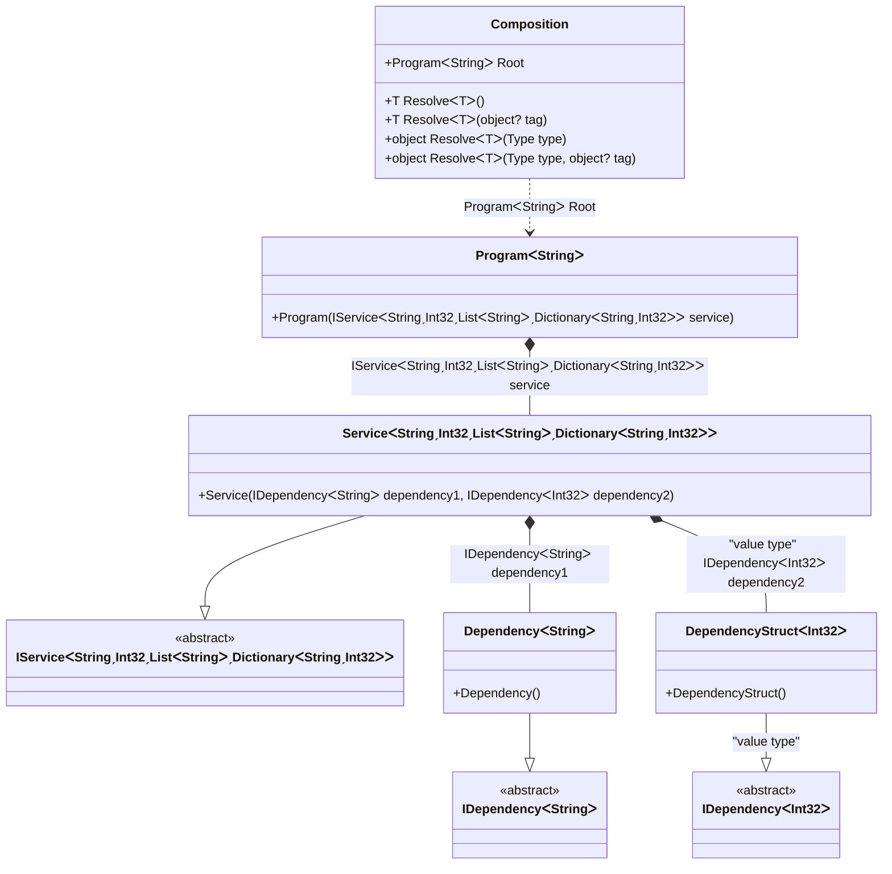
```mermaid
classDiagram
  class Composition {
    +ProgramᐸStringᐳ Root
    +T ResolveᐸTᐳ()
    +T ResolveᐸTᐳ(object? tag)
    +object ResolveᐸTᐳ(Type type)
    +object ResolveᐸTᐳ(Type type, object? tag)
  }
  class ProgramᐸStringᐳ {
    +Program(IServiceᐸStringˏInt32ˏListᐸStringᐳˏDictionaryᐸStringˏInt32ᐳᐳ service)
  }
  ServiceᐸStringˏInt32ˏListᐸStringᐳˏDictionaryᐸStringˏInt32ᐳᐳ --|> IServiceᐸStringˏInt32ˏListᐸStringᐳˏDictionaryᐸStringˏInt32ᐳᐳ : 
  class ServiceᐸStringˏInt32ˏListᐸStringᐳˏDictionaryᐸStringˏInt32ᐳᐳ {
    +Service(IDependencyᐸStringᐳ dependency1, IDependencyᐸInt32ᐳ dependency2)
  }
  DependencyᐸStringᐳ --|> IDependencyᐸStringᐳ : 
  class DependencyᐸStringᐳ {
    +Dependency()
  }
  DependencyStructᐸInt32ᐳ --|> IDependencyᐸInt32ᐳ : "value type" 
  class DependencyStructᐸInt32ᐳ {
    +DependencyStruct()
  }
  class IServiceᐸStringˏInt32ˏListᐸStringᐳˏDictionaryᐸStringˏInt32ᐳᐳ {
    <<abstract>>
  }
  class IDependencyᐸStringᐳ {
    <<abstract>>
  }
  class IDependencyᐸInt32ᐳ {
    <<abstract>>
  }
  ProgramᐸStringᐳ *--  ServiceᐸStringˏInt32ˏListᐸStringᐳˏDictionaryᐸStringˏInt32ᐳᐳ : IServiceᐸStringˏInt32ˏListᐸStringᐳˏDictionaryᐸStringˏInt32ᐳᐳ service
  Composition ..> ProgramᐸStringᐳ : ProgramᐸStringᐳ Root
  ServiceᐸStringˏInt32ˏListᐸStringᐳˏDictionaryᐸStringˏInt32ᐳᐳ *--  DependencyᐸStringᐳ : IDependencyᐸStringᐳ dependency1
  ServiceᐸStringˏInt32ˏListᐸStringᐳˏDictionaryᐸStringˏInt32ᐳᐳ *--  DependencyStructᐸInt32ᐳ : "value type"  IDependencyᐸInt32ᐳ dependency2
```

</details>

<details>
<summary>Generated Code</summary>

```c#
partial class Composition
{
  public Composition()
  {
  }
  
  internal Composition(Composition parent)
  {
  }
  
  #region Composition Roots
  public Pure.DI.UsageTests.Basics.ComplexGenericsScenario.Program<string> Root
  {
    [global::System.Runtime.CompilerServices.MethodImpl((global::System.Runtime.CompilerServices.MethodImplOptions)0x300)]
    get
    {
      Pure.DI.UsageTests.Basics.ComplexGenericsScenario.Dependency<string> v40Local8AFE6F = new Pure.DI.UsageTests.Basics.ComplexGenericsScenario.Dependency<string>();
      Pure.DI.UsageTests.Basics.ComplexGenericsScenario.DependencyStruct<int> v41Local8AFE6F = new Pure.DI.UsageTests.Basics.ComplexGenericsScenario.DependencyStruct<int>();
      Pure.DI.UsageTests.Basics.ComplexGenericsScenario.Service<string, int, System.Collections.Generic.List<string>, System.Collections.Generic.Dictionary<string, int>> v39Local8AFE6F = new Pure.DI.UsageTests.Basics.ComplexGenericsScenario.Service<string, int, System.Collections.Generic.List<string>, System.Collections.Generic.Dictionary<string, int>>(v40Local8AFE6F, v41Local8AFE6F);
      Pure.DI.UsageTests.Basics.ComplexGenericsScenario.Program<string> v38Local8AFE6F = new Pure.DI.UsageTests.Basics.ComplexGenericsScenario.Program<string>(v39Local8AFE6F);
      return v38Local8AFE6F;
    }
  }
  #endregion
  
  #region API
  #if NETSTANDARD2_0_OR_GREATER || NETCOREAPP || NET40_OR_GREATER
  [global::System.Diagnostics.Contracts.Pure]
  #endif
  [global::System.Runtime.CompilerServices.MethodImpl((global::System.Runtime.CompilerServices.MethodImplOptions)0x300)]
  public T Resolve<T>()
  {
    return Resolver8AFE6F<T>.Value.Resolve(this);
  }
  
  #if NETSTANDARD2_0_OR_GREATER || NETCOREAPP || NET40_OR_GREATER
  [global::System.Diagnostics.Contracts.Pure]
  #endif
  [global::System.Runtime.CompilerServices.MethodImpl((global::System.Runtime.CompilerServices.MethodImplOptions)0x300)]
  public T Resolve<T>(object? tag)
  {
    return Resolver8AFE6F<T>.Value.ResolveByTag(this, tag);
  }
  
  #if NETSTANDARD2_0_OR_GREATER || NETCOREAPP || NET40_OR_GREATER
  [global::System.Diagnostics.Contracts.Pure]
  #endif
  [global::System.Runtime.CompilerServices.MethodImpl((global::System.Runtime.CompilerServices.MethodImplOptions)0x300)]
  public object Resolve(global::System.Type type)
  {
    int index = (int)(_bucketSize8AFE6F * ((uint)global::System.Runtime.CompilerServices.RuntimeHelpers.GetHashCode(type) % 1));
    ref var pair = ref _buckets8AFE6F[index];
    if (ReferenceEquals(pair.Key, type))
    {
      return pair.Value.Resolve(this);
    }
    
    int maxIndex = index + _bucketSize8AFE6F;
    for (int i = index + 1; i < maxIndex; i++)
    {
      pair = ref _buckets8AFE6F[i];
      if (ReferenceEquals(pair.Key, type))
      {
        return pair.Value.Resolve(this);
      }
    }
    
    throw new global::System.InvalidOperationException($"Cannot resolve composition root of type {type}.");
  }
  
  #if NETSTANDARD2_0_OR_GREATER || NETCOREAPP || NET40_OR_GREATER
  [global::System.Diagnostics.Contracts.Pure]
  #endif
  [global::System.Runtime.CompilerServices.MethodImpl((global::System.Runtime.CompilerServices.MethodImplOptions)0x300)]
  public object Resolve(global::System.Type type, object? tag)
  {
    int index = (int)(_bucketSize8AFE6F * ((uint)global::System.Runtime.CompilerServices.RuntimeHelpers.GetHashCode(type) % 1));
    ref var pair = ref _buckets8AFE6F[index];
    if (ReferenceEquals(pair.Key, type))
    {
      return pair.Value.ResolveByTag(this, tag);
    }
    
    int maxIndex = index + _bucketSize8AFE6F;
    for (int i = index + 1; i < maxIndex; i++)
    {
      pair = ref _buckets8AFE6F[i];
      if (ReferenceEquals(pair.Key, type))
      {
        return pair.Value.ResolveByTag(this, tag);
      }
    }
    
    throw new global::System.InvalidOperationException($"Cannot resolve composition root of type {type}.");
  }
  
  #endregion
  
  public override string ToString()
  {
    return
      "classDiagram\n" +
        "  class Composition {\n" +
          "    +ProgramᐸStringᐳ Root\n" +
          "    +T ResolveᐸTᐳ()\n" +
          "    +T ResolveᐸTᐳ(object? tag)\n" +
          "    +object ResolveᐸTᐳ(Type type)\n" +
          "    +object ResolveᐸTᐳ(Type type, object? tag)\n" +
        "  }\n" +
        "  class ProgramᐸStringᐳ {\n" +
          "    +Program(IServiceᐸStringˏInt32ˏListᐸStringᐳˏDictionaryᐸStringˏInt32ᐳᐳ service)\n" +
        "  }\n" +
        "  ServiceᐸStringˏInt32ˏListᐸStringᐳˏDictionaryᐸStringˏInt32ᐳᐳ --|> IServiceᐸStringˏInt32ˏListᐸStringᐳˏDictionaryᐸStringˏInt32ᐳᐳ : \n" +
        "  class ServiceᐸStringˏInt32ˏListᐸStringᐳˏDictionaryᐸStringˏInt32ᐳᐳ {\n" +
          "    +Service(IDependencyᐸStringᐳ dependency1, IDependencyᐸInt32ᐳ dependency2)\n" +
        "  }\n" +
        "  DependencyᐸStringᐳ --|> IDependencyᐸStringᐳ : \n" +
        "  class DependencyᐸStringᐳ {\n" +
          "    +Dependency()\n" +
        "  }\n" +
        "  DependencyStructᐸInt32ᐳ --|> IDependencyᐸInt32ᐳ : \"value type\" \n" +
        "  class DependencyStructᐸInt32ᐳ {\n" +
          "    +DependencyStruct()\n" +
        "  }\n" +
        "  class IServiceᐸStringˏInt32ˏListᐸStringᐳˏDictionaryᐸStringˏInt32ᐳᐳ {\n" +
          "    <<abstract>>\n" +
        "  }\n" +
        "  class IDependencyᐸStringᐳ {\n" +
          "    <<abstract>>\n" +
        "  }\n" +
        "  class IDependencyᐸInt32ᐳ {\n" +
          "    <<abstract>>\n" +
        "  }\n" +
        "  ProgramᐸStringᐳ *--  ServiceᐸStringˏInt32ˏListᐸStringᐳˏDictionaryᐸStringˏInt32ᐳᐳ : IServiceᐸStringˏInt32ˏListᐸStringᐳˏDictionaryᐸStringˏInt32ᐳᐳ service\n" +
        "  Composition ..> ProgramᐸStringᐳ : ProgramᐸStringᐳ Root\n" +
        "  ServiceᐸStringˏInt32ˏListᐸStringᐳˏDictionaryᐸStringˏInt32ᐳᐳ *--  DependencyᐸStringᐳ : IDependencyᐸStringᐳ dependency1\n" +
        "  ServiceᐸStringˏInt32ˏListᐸStringᐳˏDictionaryᐸStringˏInt32ᐳᐳ *--  DependencyStructᐸInt32ᐳ : \"value type\"  IDependencyᐸInt32ᐳ dependency2";
  }
  
  private readonly static int _bucketSize8AFE6F;
  private readonly static global::Pure.DI.Pair<global::System.Type, global::Pure.DI.IResolver<Composition, object>>[] _buckets8AFE6F;
  
  static Composition()
  {
    Resolver8AFE6F0 valResolver8AFE6F0 = new Resolver8AFE6F0();
    Resolver8AFE6F<Pure.DI.UsageTests.Basics.ComplexGenericsScenario.Program<string>>.Value = valResolver8AFE6F0;
    _buckets8AFE6F = global::Pure.DI.Buckets<global::System.Type, global::Pure.DI.IResolver<Composition, object>>.Create(
      1,
      out _bucketSize8AFE6F,
      new global::Pure.DI.Pair<global::System.Type, global::Pure.DI.IResolver<Composition, object>>[1]
      {
         new global::Pure.DI.Pair<global::System.Type, global::Pure.DI.IResolver<Composition, object>>(typeof(Pure.DI.UsageTests.Basics.ComplexGenericsScenario.Program<string>), valResolver8AFE6F0)
      });
  }
  
  #region Resolvers
  #pragma warning disable CS0649
  private class Resolver8AFE6F<T>
  {
    public static global::Pure.DI.IResolver<Composition, T> Value;
  }
  
  private sealed class Resolver8AFE6F0: global::Pure.DI.IResolver<Composition, Pure.DI.UsageTests.Basics.ComplexGenericsScenario.Program<string>>
  {
    [global::System.Runtime.CompilerServices.MethodImpl((global::System.Runtime.CompilerServices.MethodImplOptions)0x300)]
    public Pure.DI.UsageTests.Basics.ComplexGenericsScenario.Program<string> Resolve(Composition composition)
    {
      return composition.Root;
    }
    
    [global::System.Runtime.CompilerServices.MethodImpl((global::System.Runtime.CompilerServices.MethodImplOptions)0x300)]
    public Pure.DI.UsageTests.Basics.ComplexGenericsScenario.Program<string> ResolveByTag(Composition composition, object tag)
    {
      if (Equals(tag, null)) return composition.Root;
      throw new global::System.InvalidOperationException($"Cannot resolve composition root \"{tag}\" of type Pure.DI.UsageTests.Basics.ComplexGenericsScenario.Program<string>.");
    }
  }
  #pragma warning restore CS0649
  #endregion
}
```

</details>


It can also be useful in a very simple scenario where, for example, the sequence of type arguments does not match the sequence of arguments of the contract that implements the type.

## Lifetimes
#### Singleton

[](../tests/Pure.DI.UsageTests/Lifetimes/SingletonScenario.cs)

```c#
internal interface IDependency { }

internal class Dependency : IDependency { }

internal interface IService
{
    public IDependency Dependency1 { get; }

    public IDependency Dependency2 { get; }
}

internal class Service : IService
{
    public Service(IDependency dependency1, IDependency dependency2)
    {
        Dependency1 = dependency1;
        Dependency2 = dependency2;
    }

    public IDependency Dependency1 { get; }

    public IDependency Dependency2 { get; }
}

DI.Setup("Composition")
    .Bind<IDependency>().As(Lifetime.Singleton).To<Dependency>()
    .Bind<IService>().To<Service>().Root<IService>("Root");

var composition = new Composition();
var service1 = composition.Root;
var service2 = composition.Root;
service1.Dependency1.ShouldBe(service1.Dependency2);
service2.Dependency1.ShouldBe(service1.Dependency1);
```

<details open>
<summary>Class Diagram</summary>


```mermaid
classDiagram
  class Composition {
    +IService Root
    +T ResolveᐸTᐳ()
    +T ResolveᐸTᐳ(object? tag)
    +object ResolveᐸTᐳ(Type type)
    +object ResolveᐸTᐳ(Type type, object? tag)
  }
  Service --|> IService : 
  class Service {
    +Service(IDependency dependency1, IDependency dependency2)
  }
  Dependency --|> IDependency : 
  class Dependency {
    +Dependency()
  }
  class IService {
    <<abstract>>
  }
  class IDependency {
    <<abstract>>
  }
  Service o--  "Singleton" Dependency : IDependency dependency1
  Service o--  "Singleton" Dependency : IDependency dependency2
  Composition ..> Service : IService Root
```

</details>

<details>
<summary>Generated Code</summary>

```c#
partial class Composition
{
  private readonly System.IDisposable[] _disposables8AFE6F;
  private Pure.DI.UsageTests.Lifetimes.SingletonScenario.Dependency _f18Singleton8AFE6F;
  
  public Composition()
  {
    _disposables8AFE6F = new System.IDisposable[0];
  }
  
  internal Composition(Composition parent)
  {
    _disposables8AFE6F = new System.IDisposable[0];
    lock (parent._disposables8AFE6F)
    {
      _f18Singleton8AFE6F = parent._f18Singleton8AFE6F;
    }
  }
  
  #region Composition Roots
  public Pure.DI.UsageTests.Lifetimes.SingletonScenario.IService Root
  {
    [global::System.Runtime.CompilerServices.MethodImpl((global::System.Runtime.CompilerServices.MethodImplOptions)0x300)]
    get
    {
      if (global::System.Object.ReferenceEquals(_f18Singleton8AFE6F, null))
      {
        lock (_disposables8AFE6F)
        {
          if (global::System.Object.ReferenceEquals(_f18Singleton8AFE6F, null))
          {
            _f18Singleton8AFE6F = new Pure.DI.UsageTests.Lifetimes.SingletonScenario.Dependency();
          }
        }
      }
      
      Pure.DI.UsageTests.Lifetimes.SingletonScenario.Service v93Local8AFE6F = new Pure.DI.UsageTests.Lifetimes.SingletonScenario.Service(_f18Singleton8AFE6F, _f18Singleton8AFE6F);
      return v93Local8AFE6F;
    }
  }
  #endregion
  
  #region API
  #if NETSTANDARD2_0_OR_GREATER || NETCOREAPP || NET40_OR_GREATER
  [global::System.Diagnostics.Contracts.Pure]
  #endif
  [global::System.Runtime.CompilerServices.MethodImpl((global::System.Runtime.CompilerServices.MethodImplOptions)0x300)]
  public T Resolve<T>()
  {
    return Resolver8AFE6F<T>.Value.Resolve(this);
  }
  
  #if NETSTANDARD2_0_OR_GREATER || NETCOREAPP || NET40_OR_GREATER
  [global::System.Diagnostics.Contracts.Pure]
  #endif
  [global::System.Runtime.CompilerServices.MethodImpl((global::System.Runtime.CompilerServices.MethodImplOptions)0x300)]
  public T Resolve<T>(object? tag)
  {
    return Resolver8AFE6F<T>.Value.ResolveByTag(this, tag);
  }
  
  #if NETSTANDARD2_0_OR_GREATER || NETCOREAPP || NET40_OR_GREATER
  [global::System.Diagnostics.Contracts.Pure]
  #endif
  [global::System.Runtime.CompilerServices.MethodImpl((global::System.Runtime.CompilerServices.MethodImplOptions)0x300)]
  public object Resolve(global::System.Type type)
  {
    int index = (int)(_bucketSize8AFE6F * ((uint)global::System.Runtime.CompilerServices.RuntimeHelpers.GetHashCode(type) % 1));
    ref var pair = ref _buckets8AFE6F[index];
    if (ReferenceEquals(pair.Key, type))
    {
      return pair.Value.Resolve(this);
    }
    
    int maxIndex = index + _bucketSize8AFE6F;
    for (int i = index + 1; i < maxIndex; i++)
    {
      pair = ref _buckets8AFE6F[i];
      if (ReferenceEquals(pair.Key, type))
      {
        return pair.Value.Resolve(this);
      }
    }
    
    throw new global::System.InvalidOperationException($"Cannot resolve composition root of type {type}.");
  }
  
  #if NETSTANDARD2_0_OR_GREATER || NETCOREAPP || NET40_OR_GREATER
  [global::System.Diagnostics.Contracts.Pure]
  #endif
  [global::System.Runtime.CompilerServices.MethodImpl((global::System.Runtime.CompilerServices.MethodImplOptions)0x300)]
  public object Resolve(global::System.Type type, object? tag)
  {
    int index = (int)(_bucketSize8AFE6F * ((uint)global::System.Runtime.CompilerServices.RuntimeHelpers.GetHashCode(type) % 1));
    ref var pair = ref _buckets8AFE6F[index];
    if (ReferenceEquals(pair.Key, type))
    {
      return pair.Value.ResolveByTag(this, tag);
    }
    
    int maxIndex = index + _bucketSize8AFE6F;
    for (int i = index + 1; i < maxIndex; i++)
    {
      pair = ref _buckets8AFE6F[i];
      if (ReferenceEquals(pair.Key, type))
      {
        return pair.Value.ResolveByTag(this, tag);
      }
    }
    
    throw new global::System.InvalidOperationException($"Cannot resolve composition root of type {type}.");
  }
  
  #endregion
  
  public override string ToString()
  {
    return
      "classDiagram\n" +
        "  class Composition {\n" +
          "    +IService Root\n" +
          "    +T ResolveᐸTᐳ()\n" +
          "    +T ResolveᐸTᐳ(object? tag)\n" +
          "    +object ResolveᐸTᐳ(Type type)\n" +
          "    +object ResolveᐸTᐳ(Type type, object? tag)\n" +
        "  }\n" +
        "  Service --|> IService : \n" +
        "  class Service {\n" +
          "    +Service(IDependency dependency1, IDependency dependency2)\n" +
        "  }\n" +
        "  Dependency --|> IDependency : \n" +
        "  class Dependency {\n" +
          "    +Dependency()\n" +
        "  }\n" +
        "  class IService {\n" +
          "    <<abstract>>\n" +
        "  }\n" +
        "  class IDependency {\n" +
          "    <<abstract>>\n" +
        "  }\n" +
        "  Service o--  \"Singleton\" Dependency : IDependency dependency1\n" +
        "  Service o--  \"Singleton\" Dependency : IDependency dependency2\n" +
        "  Composition ..> Service : IService Root";
  }
  
  private readonly static int _bucketSize8AFE6F;
  private readonly static global::Pure.DI.Pair<global::System.Type, global::Pure.DI.IResolver<Composition, object>>[] _buckets8AFE6F;
  
  static Composition()
  {
    Resolver8AFE6F0 valResolver8AFE6F0 = new Resolver8AFE6F0();
    Resolver8AFE6F<Pure.DI.UsageTests.Lifetimes.SingletonScenario.IService>.Value = valResolver8AFE6F0;
    _buckets8AFE6F = global::Pure.DI.Buckets<global::System.Type, global::Pure.DI.IResolver<Composition, object>>.Create(
      1,
      out _bucketSize8AFE6F,
      new global::Pure.DI.Pair<global::System.Type, global::Pure.DI.IResolver<Composition, object>>[1]
      {
         new global::Pure.DI.Pair<global::System.Type, global::Pure.DI.IResolver<Composition, object>>(typeof(Pure.DI.UsageTests.Lifetimes.SingletonScenario.IService), valResolver8AFE6F0)
      });
  }
  
  #region Resolvers
  #pragma warning disable CS0649
  private class Resolver8AFE6F<T>
  {
    public static global::Pure.DI.IResolver<Composition, T> Value;
  }
  
  private sealed class Resolver8AFE6F0: global::Pure.DI.IResolver<Composition, Pure.DI.UsageTests.Lifetimes.SingletonScenario.IService>
  {
    [global::System.Runtime.CompilerServices.MethodImpl((global::System.Runtime.CompilerServices.MethodImplOptions)0x300)]
    public Pure.DI.UsageTests.Lifetimes.SingletonScenario.IService Resolve(Composition composition)
    {
      return composition.Root;
    }
    
    [global::System.Runtime.CompilerServices.MethodImpl((global::System.Runtime.CompilerServices.MethodImplOptions)0x300)]
    public Pure.DI.UsageTests.Lifetimes.SingletonScenario.IService ResolveByTag(Composition composition, object tag)
    {
      if (Equals(tag, null)) return composition.Root;
      throw new global::System.InvalidOperationException($"Cannot resolve composition root \"{tag}\" of type Pure.DI.UsageTests.Lifetimes.SingletonScenario.IService.");
    }
  }
  #pragma warning restore CS0649
  #endregion
}
```

</details>


#### PerResolve

[](../tests/Pure.DI.UsageTests/Lifetimes/PerResolveScenario.cs)

```c#
internal interface IDependency { }

internal class Dependency : IDependency { }

internal interface IService
{
    public IDependency Dependency1 { get; }

    public IDependency Dependency2 { get; }
}

internal class Service : IService
{
    public Service(IDependency dependency1, IDependency dependency2)
    {
        Dependency1 = dependency1;
        Dependency2 = dependency2;
    }

    public IDependency Dependency1 { get; }

    public IDependency Dependency2 { get; }
}

DI.Setup("Composition")
    .Bind<IDependency>().As(Lifetime.PerResolve).To<Dependency>()
    .Bind<IService>().To<Service>().Root<IService>("Root");

var composition = new Composition();
var service1 = composition.Root;
var service2 = composition.Root;
service1.Dependency1.ShouldBe(service1.Dependency2);
service2.Dependency1.ShouldNotBe(service1.Dependency1);
```

<details open>
<summary>Class Diagram</summary>

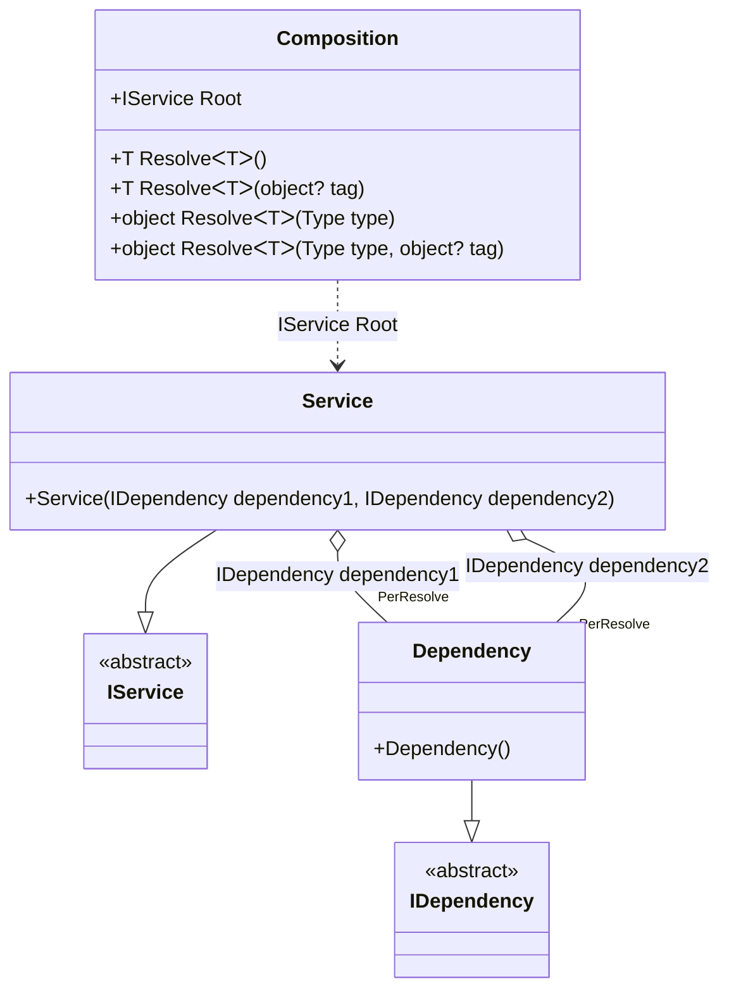
```mermaid
classDiagram
  class Composition {
    +IService Root
    +T ResolveᐸTᐳ()
    +T ResolveᐸTᐳ(object? tag)
    +object ResolveᐸTᐳ(Type type)
    +object ResolveᐸTᐳ(Type type, object? tag)
  }
  Service --|> IService : 
  class Service {
    +Service(IDependency dependency1, IDependency dependency2)
  }
  Dependency --|> IDependency : 
  class Dependency {
    +Dependency()
  }
  class IService {
    <<abstract>>
  }
  class IDependency {
    <<abstract>>
  }
  Service o--  "PerResolve" Dependency : IDependency dependency1
  Service o--  "PerResolve" Dependency : IDependency dependency2
  Composition ..> Service : IService Root
```

</details>

<details>
<summary>Generated Code</summary>

```c#
partial class Composition
{
  public Composition()
  {
  }
  
  internal Composition(Composition parent)
  {
  }
  
  #region Composition Roots
  public Pure.DI.UsageTests.Lifetimes.PerResolveScenario.IService Root
  {
    [global::System.Runtime.CompilerServices.MethodImpl((global::System.Runtime.CompilerServices.MethodImplOptions)0x300)]
    get
    {
      Pure.DI.UsageTests.Lifetimes.PerResolveScenario.Dependency v89PerResolve8AFE6F = new Pure.DI.UsageTests.Lifetimes.PerResolveScenario.Dependency();
      Pure.DI.UsageTests.Lifetimes.PerResolveScenario.Service v88Local8AFE6F = new Pure.DI.UsageTests.Lifetimes.PerResolveScenario.Service(v89PerResolve8AFE6F, v89PerResolve8AFE6F);
      return v88Local8AFE6F;
    }
  }
  #endregion
  
  #region API
  #if NETSTANDARD2_0_OR_GREATER || NETCOREAPP || NET40_OR_GREATER
  [global::System.Diagnostics.Contracts.Pure]
  #endif
  [global::System.Runtime.CompilerServices.MethodImpl((global::System.Runtime.CompilerServices.MethodImplOptions)0x300)]
  public T Resolve<T>()
  {
    return Resolver8AFE6F<T>.Value.Resolve(this);
  }
  
  #if NETSTANDARD2_0_OR_GREATER || NETCOREAPP || NET40_OR_GREATER
  [global::System.Diagnostics.Contracts.Pure]
  #endif
  [global::System.Runtime.CompilerServices.MethodImpl((global::System.Runtime.CompilerServices.MethodImplOptions)0x300)]
  public T Resolve<T>(object? tag)
  {
    return Resolver8AFE6F<T>.Value.ResolveByTag(this, tag);
  }
  
  #if NETSTANDARD2_0_OR_GREATER || NETCOREAPP || NET40_OR_GREATER
  [global::System.Diagnostics.Contracts.Pure]
  #endif
  [global::System.Runtime.CompilerServices.MethodImpl((global::System.Runtime.CompilerServices.MethodImplOptions)0x300)]
  public object Resolve(global::System.Type type)
  {
    int index = (int)(_bucketSize8AFE6F * ((uint)global::System.Runtime.CompilerServices.RuntimeHelpers.GetHashCode(type) % 1));
    ref var pair = ref _buckets8AFE6F[index];
    if (ReferenceEquals(pair.Key, type))
    {
      return pair.Value.Resolve(this);
    }
    
    int maxIndex = index + _bucketSize8AFE6F;
    for (int i = index + 1; i < maxIndex; i++)
    {
      pair = ref _buckets8AFE6F[i];
      if (ReferenceEquals(pair.Key, type))
      {
        return pair.Value.Resolve(this);
      }
    }
    
    throw new global::System.InvalidOperationException($"Cannot resolve composition root of type {type}.");
  }
  
  #if NETSTANDARD2_0_OR_GREATER || NETCOREAPP || NET40_OR_GREATER
  [global::System.Diagnostics.Contracts.Pure]
  #endif
  [global::System.Runtime.CompilerServices.MethodImpl((global::System.Runtime.CompilerServices.MethodImplOptions)0x300)]
  public object Resolve(global::System.Type type, object? tag)
  {
    int index = (int)(_bucketSize8AFE6F * ((uint)global::System.Runtime.CompilerServices.RuntimeHelpers.GetHashCode(type) % 1));
    ref var pair = ref _buckets8AFE6F[index];
    if (ReferenceEquals(pair.Key, type))
    {
      return pair.Value.ResolveByTag(this, tag);
    }
    
    int maxIndex = index + _bucketSize8AFE6F;
    for (int i = index + 1; i < maxIndex; i++)
    {
      pair = ref _buckets8AFE6F[i];
      if (ReferenceEquals(pair.Key, type))
      {
        return pair.Value.ResolveByTag(this, tag);
      }
    }
    
    throw new global::System.InvalidOperationException($"Cannot resolve composition root of type {type}.");
  }
  
  #endregion
  
  public override string ToString()
  {
    return
      "classDiagram\n" +
        "  class Composition {\n" +
          "    +IService Root\n" +
          "    +T ResolveᐸTᐳ()\n" +
          "    +T ResolveᐸTᐳ(object? tag)\n" +
          "    +object ResolveᐸTᐳ(Type type)\n" +
          "    +object ResolveᐸTᐳ(Type type, object? tag)\n" +
        "  }\n" +
        "  Service --|> IService : \n" +
        "  class Service {\n" +
          "    +Service(IDependency dependency1, IDependency dependency2)\n" +
        "  }\n" +
        "  Dependency --|> IDependency : \n" +
        "  class Dependency {\n" +
          "    +Dependency()\n" +
        "  }\n" +
        "  class IService {\n" +
          "    <<abstract>>\n" +
        "  }\n" +
        "  class IDependency {\n" +
          "    <<abstract>>\n" +
        "  }\n" +
        "  Service o--  \"PerResolve\" Dependency : IDependency dependency1\n" +
        "  Service o--  \"PerResolve\" Dependency : IDependency dependency2\n" +
        "  Composition ..> Service : IService Root";
  }
  
  private readonly static int _bucketSize8AFE6F;
  private readonly static global::Pure.DI.Pair<global::System.Type, global::Pure.DI.IResolver<Composition, object>>[] _buckets8AFE6F;
  
  static Composition()
  {
    Resolver8AFE6F0 valResolver8AFE6F0 = new Resolver8AFE6F0();
    Resolver8AFE6F<Pure.DI.UsageTests.Lifetimes.PerResolveScenario.IService>.Value = valResolver8AFE6F0;
    _buckets8AFE6F = global::Pure.DI.Buckets<global::System.Type, global::Pure.DI.IResolver<Composition, object>>.Create(
      1,
      out _bucketSize8AFE6F,
      new global::Pure.DI.Pair<global::System.Type, global::Pure.DI.IResolver<Composition, object>>[1]
      {
         new global::Pure.DI.Pair<global::System.Type, global::Pure.DI.IResolver<Composition, object>>(typeof(Pure.DI.UsageTests.Lifetimes.PerResolveScenario.IService), valResolver8AFE6F0)
      });
  }
  
  #region Resolvers
  #pragma warning disable CS0649
  private class Resolver8AFE6F<T>
  {
    public static global::Pure.DI.IResolver<Composition, T> Value;
  }
  
  private sealed class Resolver8AFE6F0: global::Pure.DI.IResolver<Composition, Pure.DI.UsageTests.Lifetimes.PerResolveScenario.IService>
  {
    [global::System.Runtime.CompilerServices.MethodImpl((global::System.Runtime.CompilerServices.MethodImplOptions)0x300)]
    public Pure.DI.UsageTests.Lifetimes.PerResolveScenario.IService Resolve(Composition composition)
    {
      return composition.Root;
    }
    
    [global::System.Runtime.CompilerServices.MethodImpl((global::System.Runtime.CompilerServices.MethodImplOptions)0x300)]
    public Pure.DI.UsageTests.Lifetimes.PerResolveScenario.IService ResolveByTag(Composition composition, object tag)
    {
      if (Equals(tag, null)) return composition.Root;
      throw new global::System.InvalidOperationException($"Cannot resolve composition root \"{tag}\" of type Pure.DI.UsageTests.Lifetimes.PerResolveScenario.IService.");
    }
  }
  #pragma warning restore CS0649
  #endregion
}
```

</details>


#### Transient

[](../tests/Pure.DI.UsageTests/Lifetimes/TransientScenario.cs)

```c#
internal interface IDependency { }

internal class Dependency : IDependency { }

internal interface IService
{
    public IDependency Dependency1 { get; }

    public IDependency Dependency2 { get; }
}

internal class Service : IService
{
    public Service(IDependency dependency1, IDependency dependency2)
    {
        Dependency1 = dependency1;
        Dependency2 = dependency2;
    }

    public IDependency Dependency1 { get; }

    public IDependency Dependency2 { get; }
}

DI.Setup("Composition")
    .Bind<IDependency>().As(Lifetime.Transient).To<Dependency>()
    .Bind<IService>().To<Service>().Root<IService>("Root");

var composition = new Composition();
var service1 = composition.Root;
var service2 = composition.Root;
service1.Dependency1.ShouldNotBe(service1.Dependency2);
service2.Dependency1.ShouldNotBe(service1.Dependency1);
```

<details open>
<summary>Class Diagram</summary>

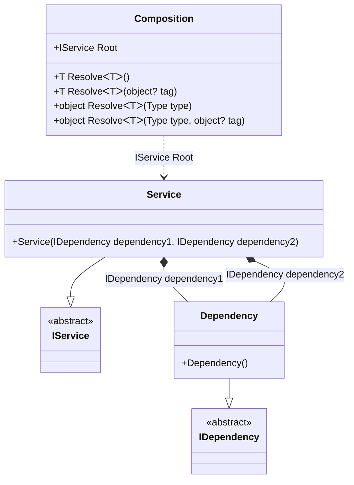
```mermaid
classDiagram
  class Composition {
    +IService Root
    +T ResolveᐸTᐳ()
    +T ResolveᐸTᐳ(object? tag)
    +object ResolveᐸTᐳ(Type type)
    +object ResolveᐸTᐳ(Type type, object? tag)
  }
  Service --|> IService : 
  class Service {
    +Service(IDependency dependency1, IDependency dependency2)
  }
  Dependency --|> IDependency : 
  class Dependency {
    +Dependency()
  }
  class IService {
    <<abstract>>
  }
  class IDependency {
    <<abstract>>
  }
  Service *--  Dependency : IDependency dependency1
  Service *--  Dependency : IDependency dependency2
  Composition ..> Service : IService Root
```

</details>

<details>
<summary>Generated Code</summary>

```c#
partial class Composition
{
  public Composition()
  {
  }
  
  internal Composition(Composition parent)
  {
  }
  
  #region Composition Roots
  public Pure.DI.UsageTests.Lifetimes.TransientScenario.IService Root
  {
    [global::System.Runtime.CompilerServices.MethodImpl((global::System.Runtime.CompilerServices.MethodImplOptions)0x300)]
    get
    {
      Pure.DI.UsageTests.Lifetimes.TransientScenario.Dependency v95Local8AFE6F = new Pure.DI.UsageTests.Lifetimes.TransientScenario.Dependency();
      Pure.DI.UsageTests.Lifetimes.TransientScenario.Dependency v96Local8AFE6F = new Pure.DI.UsageTests.Lifetimes.TransientScenario.Dependency();
      Pure.DI.UsageTests.Lifetimes.TransientScenario.Service v94Local8AFE6F = new Pure.DI.UsageTests.Lifetimes.TransientScenario.Service(v96Local8AFE6F, v95Local8AFE6F);
      return v94Local8AFE6F;
    }
  }
  #endregion
  
  #region API
  #if NETSTANDARD2_0_OR_GREATER || NETCOREAPP || NET40_OR_GREATER
  [global::System.Diagnostics.Contracts.Pure]
  #endif
  [global::System.Runtime.CompilerServices.MethodImpl((global::System.Runtime.CompilerServices.MethodImplOptions)0x300)]
  public T Resolve<T>()
  {
    return Resolver8AFE6F<T>.Value.Resolve(this);
  }
  
  #if NETSTANDARD2_0_OR_GREATER || NETCOREAPP || NET40_OR_GREATER
  [global::System.Diagnostics.Contracts.Pure]
  #endif
  [global::System.Runtime.CompilerServices.MethodImpl((global::System.Runtime.CompilerServices.MethodImplOptions)0x300)]
  public T Resolve<T>(object? tag)
  {
    return Resolver8AFE6F<T>.Value.ResolveByTag(this, tag);
  }
  
  #if NETSTANDARD2_0_OR_GREATER || NETCOREAPP || NET40_OR_GREATER
  [global::System.Diagnostics.Contracts.Pure]
  #endif
  [global::System.Runtime.CompilerServices.MethodImpl((global::System.Runtime.CompilerServices.MethodImplOptions)0x300)]
  public object Resolve(global::System.Type type)
  {
    int index = (int)(_bucketSize8AFE6F * ((uint)global::System.Runtime.CompilerServices.RuntimeHelpers.GetHashCode(type) % 1));
    ref var pair = ref _buckets8AFE6F[index];
    if (ReferenceEquals(pair.Key, type))
    {
      return pair.Value.Resolve(this);
    }
    
    int maxIndex = index + _bucketSize8AFE6F;
    for (int i = index + 1; i < maxIndex; i++)
    {
      pair = ref _buckets8AFE6F[i];
      if (ReferenceEquals(pair.Key, type))
      {
        return pair.Value.Resolve(this);
      }
    }
    
    throw new global::System.InvalidOperationException($"Cannot resolve composition root of type {type}.");
  }
  
  #if NETSTANDARD2_0_OR_GREATER || NETCOREAPP || NET40_OR_GREATER
  [global::System.Diagnostics.Contracts.Pure]
  #endif
  [global::System.Runtime.CompilerServices.MethodImpl((global::System.Runtime.CompilerServices.MethodImplOptions)0x300)]
  public object Resolve(global::System.Type type, object? tag)
  {
    int index = (int)(_bucketSize8AFE6F * ((uint)global::System.Runtime.CompilerServices.RuntimeHelpers.GetHashCode(type) % 1));
    ref var pair = ref _buckets8AFE6F[index];
    if (ReferenceEquals(pair.Key, type))
    {
      return pair.Value.ResolveByTag(this, tag);
    }
    
    int maxIndex = index + _bucketSize8AFE6F;
    for (int i = index + 1; i < maxIndex; i++)
    {
      pair = ref _buckets8AFE6F[i];
      if (ReferenceEquals(pair.Key, type))
      {
        return pair.Value.ResolveByTag(this, tag);
      }
    }
    
    throw new global::System.InvalidOperationException($"Cannot resolve composition root of type {type}.");
  }
  
  #endregion
  
  public override string ToString()
  {
    return
      "classDiagram\n" +
        "  class Composition {\n" +
          "    +IService Root\n" +
          "    +T ResolveᐸTᐳ()\n" +
          "    +T ResolveᐸTᐳ(object? tag)\n" +
          "    +object ResolveᐸTᐳ(Type type)\n" +
          "    +object ResolveᐸTᐳ(Type type, object? tag)\n" +
        "  }\n" +
        "  Service --|> IService : \n" +
        "  class Service {\n" +
          "    +Service(IDependency dependency1, IDependency dependency2)\n" +
        "  }\n" +
        "  Dependency --|> IDependency : \n" +
        "  class Dependency {\n" +
          "    +Dependency()\n" +
        "  }\n" +
        "  class IService {\n" +
          "    <<abstract>>\n" +
        "  }\n" +
        "  class IDependency {\n" +
          "    <<abstract>>\n" +
        "  }\n" +
        "  Service *--  Dependency : IDependency dependency1\n" +
        "  Service *--  Dependency : IDependency dependency2\n" +
        "  Composition ..> Service : IService Root";
  }
  
  private readonly static int _bucketSize8AFE6F;
  private readonly static global::Pure.DI.Pair<global::System.Type, global::Pure.DI.IResolver<Composition, object>>[] _buckets8AFE6F;
  
  static Composition()
  {
    Resolver8AFE6F0 valResolver8AFE6F0 = new Resolver8AFE6F0();
    Resolver8AFE6F<Pure.DI.UsageTests.Lifetimes.TransientScenario.IService>.Value = valResolver8AFE6F0;
    _buckets8AFE6F = global::Pure.DI.Buckets<global::System.Type, global::Pure.DI.IResolver<Composition, object>>.Create(
      1,
      out _bucketSize8AFE6F,
      new global::Pure.DI.Pair<global::System.Type, global::Pure.DI.IResolver<Composition, object>>[1]
      {
         new global::Pure.DI.Pair<global::System.Type, global::Pure.DI.IResolver<Composition, object>>(typeof(Pure.DI.UsageTests.Lifetimes.TransientScenario.IService), valResolver8AFE6F0)
      });
  }
  
  #region Resolvers
  #pragma warning disable CS0649
  private class Resolver8AFE6F<T>
  {
    public static global::Pure.DI.IResolver<Composition, T> Value;
  }
  
  private sealed class Resolver8AFE6F0: global::Pure.DI.IResolver<Composition, Pure.DI.UsageTests.Lifetimes.TransientScenario.IService>
  {
    [global::System.Runtime.CompilerServices.MethodImpl((global::System.Runtime.CompilerServices.MethodImplOptions)0x300)]
    public Pure.DI.UsageTests.Lifetimes.TransientScenario.IService Resolve(Composition composition)
    {
      return composition.Root;
    }
    
    [global::System.Runtime.CompilerServices.MethodImpl((global::System.Runtime.CompilerServices.MethodImplOptions)0x300)]
    public Pure.DI.UsageTests.Lifetimes.TransientScenario.IService ResolveByTag(Composition composition, object tag)
    {
      if (Equals(tag, null)) return composition.Root;
      throw new global::System.InvalidOperationException($"Cannot resolve composition root \"{tag}\" of type Pure.DI.UsageTests.Lifetimes.TransientScenario.IService.");
    }
  }
  #pragma warning restore CS0649
  #endregion
}
```

</details>


#### Disposable Singleton

[](../tests/Pure.DI.UsageTests/Lifetimes/DisposableSingletonScenario.cs)

To dispose all created singleton instances, simply dispose the composition instance:

```c#
internal interface IDependency
{
    bool IsDisposed { get; }
}

internal class Dependency : IDependency, IDisposable
{
    public bool IsDisposed { get; private set; }

    public void Dispose()
    {
        IsDisposed = true;
    }
}

internal interface IService
{
    public IDependency Dependency { get; }
}

internal class Service : IService
{
    public Service(IDependency dependency)
    {
        Dependency = dependency;
    }

    public IDependency Dependency { get; }
}

DI.Setup("Composition")
    .Bind<IDependency>().As(Lifetime.Singleton).To<Dependency>()
    .Bind<IService>().To<Service>().Root<IService>("Root");

IDependency dependency;
using (var composition = new Composition())
{
    var service = composition.Root;
    dependency = service.Dependency;
}

dependency.IsDisposed.ShouldBeTrue();
```

<details open>
<summary>Class Diagram</summary>


```mermaid
classDiagram
  class Composition {
    +IService Root
    +T ResolveᐸTᐳ()
    +T ResolveᐸTᐳ(object? tag)
    +object ResolveᐸTᐳ(Type type)
    +object ResolveᐸTᐳ(Type type, object? tag)
  }
  Composition --|> IDisposable
  Service --|> IService : 
  class Service {
    +Service(IDependency dependency)
  }
  Dependency --|> IDependency : 
  class Dependency {
    +Dependency()
  }
  class IService {
    <<abstract>>
  }
  class IDependency {
    <<abstract>>
  }
  Service o--  "Singleton" Dependency : IDependency dependency
  Composition ..> Service : IService Root
```

</details>

<details>
<summary>Generated Code</summary>

```c#
partial class Composition: System.IDisposable
{
  private int _disposeIndex8AFE6F;
  private readonly System.IDisposable[] _disposables8AFE6F;
  private Pure.DI.UsageTests.Lifetimes.DisposableSingletonScenario.Dependency _f18Singleton8AFE6F;
  
  public Composition()
  {
    _disposables8AFE6F = new System.IDisposable[1];
  }
  
  internal Composition(Composition parent)
  {
    lock (parent._disposables8AFE6F)
    {
      _disposables8AFE6F = new System.IDisposable[1 - parent._disposeIndex8AFE6F];
      _f18Singleton8AFE6F = parent._f18Singleton8AFE6F;
    }
  }
  
  #region Composition Roots
  public Pure.DI.UsageTests.Lifetimes.DisposableSingletonScenario.IService Root
  {
    [global::System.Runtime.CompilerServices.MethodImpl((global::System.Runtime.CompilerServices.MethodImplOptions)0x300)]
    get
    {
      if (global::System.Object.ReferenceEquals(_f18Singleton8AFE6F, null))
      {
        lock (_disposables8AFE6F)
        {
          if (global::System.Object.ReferenceEquals(_f18Singleton8AFE6F, null))
          {
            _f18Singleton8AFE6F = new Pure.DI.UsageTests.Lifetimes.DisposableSingletonScenario.Dependency();
            _disposables8AFE6F[_disposeIndex8AFE6F++] = _f18Singleton8AFE6F;
          }
        }
      }
      
      Pure.DI.UsageTests.Lifetimes.DisposableSingletonScenario.Service v87Local8AFE6F = new Pure.DI.UsageTests.Lifetimes.DisposableSingletonScenario.Service(_f18Singleton8AFE6F);
      return v87Local8AFE6F;
    }
  }
  #endregion
  
  #region API
  #if NETSTANDARD2_0_OR_GREATER || NETCOREAPP || NET40_OR_GREATER
  [global::System.Diagnostics.Contracts.Pure]
  #endif
  [global::System.Runtime.CompilerServices.MethodImpl((global::System.Runtime.CompilerServices.MethodImplOptions)0x300)]
  public T Resolve<T>()
  {
    return Resolver8AFE6F<T>.Value.Resolve(this);
  }
  
  #if NETSTANDARD2_0_OR_GREATER || NETCOREAPP || NET40_OR_GREATER
  [global::System.Diagnostics.Contracts.Pure]
  #endif
  [global::System.Runtime.CompilerServices.MethodImpl((global::System.Runtime.CompilerServices.MethodImplOptions)0x300)]
  public T Resolve<T>(object? tag)
  {
    return Resolver8AFE6F<T>.Value.ResolveByTag(this, tag);
  }
  
  #if NETSTANDARD2_0_OR_GREATER || NETCOREAPP || NET40_OR_GREATER
  [global::System.Diagnostics.Contracts.Pure]
  #endif
  [global::System.Runtime.CompilerServices.MethodImpl((global::System.Runtime.CompilerServices.MethodImplOptions)0x300)]
  public object Resolve(global::System.Type type)
  {
    int index = (int)(_bucketSize8AFE6F * ((uint)global::System.Runtime.CompilerServices.RuntimeHelpers.GetHashCode(type) % 1));
    ref var pair = ref _buckets8AFE6F[index];
    if (ReferenceEquals(pair.Key, type))
    {
      return pair.Value.Resolve(this);
    }
    
    int maxIndex = index + _bucketSize8AFE6F;
    for (int i = index + 1; i < maxIndex; i++)
    {
      pair = ref _buckets8AFE6F[i];
      if (ReferenceEquals(pair.Key, type))
      {
        return pair.Value.Resolve(this);
      }
    }
    
    throw new global::System.InvalidOperationException($"Cannot resolve composition root of type {type}.");
  }
  
  #if NETSTANDARD2_0_OR_GREATER || NETCOREAPP || NET40_OR_GREATER
  [global::System.Diagnostics.Contracts.Pure]
  #endif
  [global::System.Runtime.CompilerServices.MethodImpl((global::System.Runtime.CompilerServices.MethodImplOptions)0x300)]
  public object Resolve(global::System.Type type, object? tag)
  {
    int index = (int)(_bucketSize8AFE6F * ((uint)global::System.Runtime.CompilerServices.RuntimeHelpers.GetHashCode(type) % 1));
    ref var pair = ref _buckets8AFE6F[index];
    if (ReferenceEquals(pair.Key, type))
    {
      return pair.Value.ResolveByTag(this, tag);
    }
    
    int maxIndex = index + _bucketSize8AFE6F;
    for (int i = index + 1; i < maxIndex; i++)
    {
      pair = ref _buckets8AFE6F[i];
      if (ReferenceEquals(pair.Key, type))
      {
        return pair.Value.ResolveByTag(this, tag);
      }
    }
    
    throw new global::System.InvalidOperationException($"Cannot resolve composition root of type {type}.");
  }
  
  #endregion
  
  public void Dispose()
  {
    lock (_disposables8AFE6F)
    {
      while (_disposeIndex8AFE6F > 0)
      {
        try
        {
          _disposables8AFE6F[--_disposeIndex8AFE6F].Dispose();
        }
        catch
        {
          // ignored
        }
      }
      
      _f18Singleton8AFE6F = null;
    }
  }
  
  public override string ToString()
  {
    return
      "classDiagram\n" +
        "  class Composition {\n" +
          "    +IService Root\n" +
          "    +T ResolveᐸTᐳ()\n" +
          "    +T ResolveᐸTᐳ(object? tag)\n" +
          "    +object ResolveᐸTᐳ(Type type)\n" +
          "    +object ResolveᐸTᐳ(Type type, object? tag)\n" +
        "  }\n" +
        "  Composition --|> IDisposable\n" +
        "  Service --|> IService : \n" +
        "  class Service {\n" +
          "    +Service(IDependency dependency)\n" +
        "  }\n" +
        "  Dependency --|> IDependency : \n" +
        "  class Dependency {\n" +
          "    +Dependency()\n" +
        "  }\n" +
        "  class IService {\n" +
          "    <<abstract>>\n" +
        "  }\n" +
        "  class IDependency {\n" +
          "    <<abstract>>\n" +
        "  }\n" +
        "  Service o--  \"Singleton\" Dependency : IDependency dependency\n" +
        "  Composition ..> Service : IService Root";
  }
  
  private readonly static int _bucketSize8AFE6F;
  private readonly static global::Pure.DI.Pair<global::System.Type, global::Pure.DI.IResolver<Composition, object>>[] _buckets8AFE6F;
  
  static Composition()
  {
    Resolver8AFE6F0 valResolver8AFE6F0 = new Resolver8AFE6F0();
    Resolver8AFE6F<Pure.DI.UsageTests.Lifetimes.DisposableSingletonScenario.IService>.Value = valResolver8AFE6F0;
    _buckets8AFE6F = global::Pure.DI.Buckets<global::System.Type, global::Pure.DI.IResolver<Composition, object>>.Create(
      1,
      out _bucketSize8AFE6F,
      new global::Pure.DI.Pair<global::System.Type, global::Pure.DI.IResolver<Composition, object>>[1]
      {
         new global::Pure.DI.Pair<global::System.Type, global::Pure.DI.IResolver<Composition, object>>(typeof(Pure.DI.UsageTests.Lifetimes.DisposableSingletonScenario.IService), valResolver8AFE6F0)
      });
  }
  
  #region Resolvers
  #pragma warning disable CS0649
  private class Resolver8AFE6F<T>
  {
    public static global::Pure.DI.IResolver<Composition, T> Value;
  }
  
  private sealed class Resolver8AFE6F0: global::Pure.DI.IResolver<Composition, Pure.DI.UsageTests.Lifetimes.DisposableSingletonScenario.IService>
  {
    [global::System.Runtime.CompilerServices.MethodImpl((global::System.Runtime.CompilerServices.MethodImplOptions)0x300)]
    public Pure.DI.UsageTests.Lifetimes.DisposableSingletonScenario.IService Resolve(Composition composition)
    {
      return composition.Root;
    }
    
    [global::System.Runtime.CompilerServices.MethodImpl((global::System.Runtime.CompilerServices.MethodImplOptions)0x300)]
    public Pure.DI.UsageTests.Lifetimes.DisposableSingletonScenario.IService ResolveByTag(Composition composition, object tag)
    {
      if (Equals(tag, null)) return composition.Root;
      throw new global::System.InvalidOperationException($"Cannot resolve composition root \"{tag}\" of type Pure.DI.UsageTests.Lifetimes.DisposableSingletonScenario.IService.");
    }
  }
  #pragma warning restore CS0649
  #endregion
}
```

</details>


#### Scope

[](../tests/Pure.DI.UsageTests/Lifetimes/ScopeScenario.cs)

A "scope" scenario can be easily implemented with singleton instances and child composition:

```c#
internal interface IDependency
{
    bool IsDisposed { get; }
}

internal class Dependency : IDependency, IDisposable
{
    public bool IsDisposed { get; private set; }

    public void Dispose()
    {
        IsDisposed = true;
    }
}

internal interface IService
{
    public IDependency Dependency { get; }
}

internal class Service : IService
{
    public Service(IDependency dependency)
    {
        Dependency = dependency;
    }

    public IDependency Dependency { get; }
}

internal interface ISession: IDisposable
{
    IService Service { get; }
}

internal class Session : ISession
{
    private readonly Composition _composition;

    // To make a composition type injectable, don't forget to create a partial class for composition
    public Session(Composition composition)
    {
        // Creates child container that represents a "scope" for this session
        _composition = new Composition(composition);

        // You must be careful not to use the "Service" root before the session is created
        // otherwise one instance will be shared across all sessions
        Service = _composition.Service;
    }

    public IService Service { get; }

    public void Dispose() => _composition.Dispose();
}

internal partial class Composition
{
}

DI.Setup("Composition")
    // In a fact it is "scoped" singleton here
    .Bind<IDependency>().As(Lifetime.Singleton).To<Dependency>()
    .Bind<IService>().To<Service>().Root<IService>("Service")
    .Bind<ISession>().To<Session>().Root<ISession>("Session");

using var composition = new Composition();
        
var session1 = composition.Session;
session1.Service.Dependency.ShouldBe(session1.Service.Dependency);
        
using var session2 = composition.Session;
session1.Service.Dependency.ShouldNotBe(session2.Service.Dependency);
        
session1.Dispose();
session1.Service.Dependency.IsDisposed.ShouldBeTrue();
session2.Service.Dependency.IsDisposed.ShouldBeFalse();
```

<details open>
<summary>Class Diagram</summary>

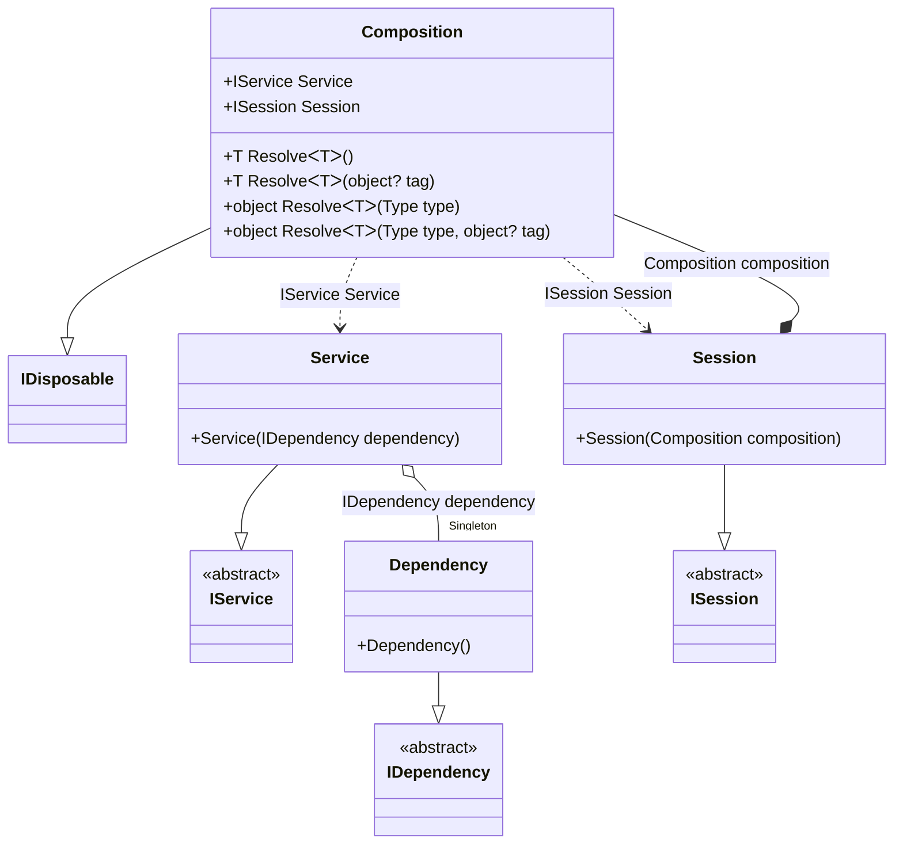
```mermaid
classDiagram
  class Composition {
    +IService Service
    +ISession Session
    +T ResolveᐸTᐳ()
    +T ResolveᐸTᐳ(object? tag)
    +object ResolveᐸTᐳ(Type type)
    +object ResolveᐸTᐳ(Type type, object? tag)
  }
  Composition --|> IDisposable
  class Composition
  Service --|> IService : 
  class Service {
    +Service(IDependency dependency)
  }
  Session --|> ISession : 
  class Session {
    +Session(Composition composition)
  }
  Dependency --|> IDependency : 
  class Dependency {
    +Dependency()
  }
  class IService {
    <<abstract>>
  }
  class ISession {
    <<abstract>>
  }
  class IDependency {
    <<abstract>>
  }
  Service o--  "Singleton" Dependency : IDependency dependency
  Session *--  Composition : Composition composition
  Composition ..> Service : IService Service
  Composition ..> Session : ISession Session
```

</details>

<details>
<summary>Generated Code</summary>

```c#
partial class Composition: System.IDisposable
{
  private int _disposeIndex8AFE6F;
  private readonly System.IDisposable[] _disposables8AFE6F;
  private Pure.DI.UsageTests.Lifetimes.ScopeScenario.Dependency _f18Singleton8AFE6F;
  
  public Composition()
  {
    _disposables8AFE6F = new System.IDisposable[1];
  }
  
  internal Composition(Composition parent)
  {
    lock (parent._disposables8AFE6F)
    {
      _disposables8AFE6F = new System.IDisposable[1 - parent._disposeIndex8AFE6F];
      _f18Singleton8AFE6F = parent._f18Singleton8AFE6F;
    }
  }
  
  #region Composition Roots
  public Pure.DI.UsageTests.Lifetimes.ScopeScenario.IService Service
  {
    [global::System.Runtime.CompilerServices.MethodImpl((global::System.Runtime.CompilerServices.MethodImplOptions)0x300)]
    get
    {
      if (global::System.Object.ReferenceEquals(_f18Singleton8AFE6F, null))
      {
        lock (_disposables8AFE6F)
        {
          if (global::System.Object.ReferenceEquals(_f18Singleton8AFE6F, null))
          {
            _f18Singleton8AFE6F = new Pure.DI.UsageTests.Lifetimes.ScopeScenario.Dependency();
            _disposables8AFE6F[_disposeIndex8AFE6F++] = _f18Singleton8AFE6F;
          }
        }
      }
      
      Pure.DI.UsageTests.Lifetimes.ScopeScenario.Service v90Local8AFE6F = new Pure.DI.UsageTests.Lifetimes.ScopeScenario.Service(_f18Singleton8AFE6F);
      return v90Local8AFE6F;
    }
  }
  
  public Pure.DI.UsageTests.Lifetimes.ScopeScenario.ISession Session
  {
    [global::System.Runtime.CompilerServices.MethodImpl((global::System.Runtime.CompilerServices.MethodImplOptions)0x300)]
    get
    {
      Pure.DI.UsageTests.Lifetimes.ScopeScenario.Composition v92Local8AFE6F = this;
      Pure.DI.UsageTests.Lifetimes.ScopeScenario.Session v91Local8AFE6F = new Pure.DI.UsageTests.Lifetimes.ScopeScenario.Session(v92Local8AFE6F);
      return v91Local8AFE6F;
    }
  }
  #endregion
  
  #region API
  #if NETSTANDARD2_0_OR_GREATER || NETCOREAPP || NET40_OR_GREATER
  [global::System.Diagnostics.Contracts.Pure]
  #endif
  [global::System.Runtime.CompilerServices.MethodImpl((global::System.Runtime.CompilerServices.MethodImplOptions)0x300)]
  public T Resolve<T>()
  {
    return Resolver8AFE6F<T>.Value.Resolve(this);
  }
  
  #if NETSTANDARD2_0_OR_GREATER || NETCOREAPP || NET40_OR_GREATER
  [global::System.Diagnostics.Contracts.Pure]
  #endif
  [global::System.Runtime.CompilerServices.MethodImpl((global::System.Runtime.CompilerServices.MethodImplOptions)0x300)]
  public T Resolve<T>(object? tag)
  {
    return Resolver8AFE6F<T>.Value.ResolveByTag(this, tag);
  }
  
  #if NETSTANDARD2_0_OR_GREATER || NETCOREAPP || NET40_OR_GREATER
  [global::System.Diagnostics.Contracts.Pure]
  #endif
  [global::System.Runtime.CompilerServices.MethodImpl((global::System.Runtime.CompilerServices.MethodImplOptions)0x300)]
  public object Resolve(global::System.Type type)
  {
    int index = (int)(_bucketSize8AFE6F * ((uint)global::System.Runtime.CompilerServices.RuntimeHelpers.GetHashCode(type) % 4));
    ref var pair = ref _buckets8AFE6F[index];
    if (ReferenceEquals(pair.Key, type))
    {
      return pair.Value.Resolve(this);
    }
    
    int maxIndex = index + _bucketSize8AFE6F;
    for (int i = index + 1; i < maxIndex; i++)
    {
      pair = ref _buckets8AFE6F[i];
      if (ReferenceEquals(pair.Key, type))
      {
        return pair.Value.Resolve(this);
      }
    }
    
    throw new global::System.InvalidOperationException($"Cannot resolve composition root of type {type}.");
  }
  
  #if NETSTANDARD2_0_OR_GREATER || NETCOREAPP || NET40_OR_GREATER
  [global::System.Diagnostics.Contracts.Pure]
  #endif
  [global::System.Runtime.CompilerServices.MethodImpl((global::System.Runtime.CompilerServices.MethodImplOptions)0x300)]
  public object Resolve(global::System.Type type, object? tag)
  {
    int index = (int)(_bucketSize8AFE6F * ((uint)global::System.Runtime.CompilerServices.RuntimeHelpers.GetHashCode(type) % 4));
    ref var pair = ref _buckets8AFE6F[index];
    if (ReferenceEquals(pair.Key, type))
    {
      return pair.Value.ResolveByTag(this, tag);
    }
    
    int maxIndex = index + _bucketSize8AFE6F;
    for (int i = index + 1; i < maxIndex; i++)
    {
      pair = ref _buckets8AFE6F[i];
      if (ReferenceEquals(pair.Key, type))
      {
        return pair.Value.ResolveByTag(this, tag);
      }
    }
    
    throw new global::System.InvalidOperationException($"Cannot resolve composition root of type {type}.");
  }
  
  #endregion
  
  public void Dispose()
  {
    lock (_disposables8AFE6F)
    {
      while (_disposeIndex8AFE6F > 0)
      {
        try
        {
          _disposables8AFE6F[--_disposeIndex8AFE6F].Dispose();
        }
        catch
        {
          // ignored
        }
      }
      
      _f18Singleton8AFE6F = null;
    }
  }
  
  public override string ToString()
  {
    return
      "classDiagram\n" +
        "  class Composition {\n" +
          "    +IService Service\n" +
          "    +ISession Session\n" +
          "    +T ResolveᐸTᐳ()\n" +
          "    +T ResolveᐸTᐳ(object? tag)\n" +
          "    +object ResolveᐸTᐳ(Type type)\n" +
          "    +object ResolveᐸTᐳ(Type type, object? tag)\n" +
        "  }\n" +
        "  Composition --|> IDisposable\n" +
        "  class Composition\n" +
        "  Service --|> IService : \n" +
        "  class Service {\n" +
          "    +Service(IDependency dependency)\n" +
        "  }\n" +
        "  Session --|> ISession : \n" +
        "  class Session {\n" +
          "    +Session(Composition composition)\n" +
        "  }\n" +
        "  Dependency --|> IDependency : \n" +
        "  class Dependency {\n" +
          "    +Dependency()\n" +
        "  }\n" +
        "  class IService {\n" +
          "    <<abstract>>\n" +
        "  }\n" +
        "  class ISession {\n" +
          "    <<abstract>>\n" +
        "  }\n" +
        "  class IDependency {\n" +
          "    <<abstract>>\n" +
        "  }\n" +
        "  Service o--  \"Singleton\" Dependency : IDependency dependency\n" +
        "  Session *--  Composition : Composition composition\n" +
        "  Composition ..> Service : IService Service\n" +
        "  Composition ..> Session : ISession Session";
  }
  
  private readonly static int _bucketSize8AFE6F;
  private readonly static global::Pure.DI.Pair<global::System.Type, global::Pure.DI.IResolver<Composition, object>>[] _buckets8AFE6F;
  
  static Composition()
  {
    Resolver8AFE6F0 valResolver8AFE6F0 = new Resolver8AFE6F0();
    Resolver8AFE6F<Pure.DI.UsageTests.Lifetimes.ScopeScenario.IService>.Value = valResolver8AFE6F0;
    Resolver8AFE6F1 valResolver8AFE6F1 = new Resolver8AFE6F1();
    Resolver8AFE6F<Pure.DI.UsageTests.Lifetimes.ScopeScenario.ISession>.Value = valResolver8AFE6F1;
    _buckets8AFE6F = global::Pure.DI.Buckets<global::System.Type, global::Pure.DI.IResolver<Composition, object>>.Create(
      4,
      out _bucketSize8AFE6F,
      new global::Pure.DI.Pair<global::System.Type, global::Pure.DI.IResolver<Composition, object>>[2]
      {
         new global::Pure.DI.Pair<global::System.Type, global::Pure.DI.IResolver<Composition, object>>(typeof(Pure.DI.UsageTests.Lifetimes.ScopeScenario.IService), valResolver8AFE6F0)
        ,new global::Pure.DI.Pair<global::System.Type, global::Pure.DI.IResolver<Composition, object>>(typeof(Pure.DI.UsageTests.Lifetimes.ScopeScenario.ISession), valResolver8AFE6F1)
      });
  }
  
  #region Resolvers
  #pragma warning disable CS0649
  private class Resolver8AFE6F<T>
  {
    public static global::Pure.DI.IResolver<Composition, T> Value;
  }
  
  private sealed class Resolver8AFE6F0: global::Pure.DI.IResolver<Composition, Pure.DI.UsageTests.Lifetimes.ScopeScenario.IService>
  {
    [global::System.Runtime.CompilerServices.MethodImpl((global::System.Runtime.CompilerServices.MethodImplOptions)0x300)]
    public Pure.DI.UsageTests.Lifetimes.ScopeScenario.IService Resolve(Composition composition)
    {
      return composition.Service;
    }
    
    [global::System.Runtime.CompilerServices.MethodImpl((global::System.Runtime.CompilerServices.MethodImplOptions)0x300)]
    public Pure.DI.UsageTests.Lifetimes.ScopeScenario.IService ResolveByTag(Composition composition, object tag)
    {
      if (Equals(tag, null)) return composition.Service;
      throw new global::System.InvalidOperationException($"Cannot resolve composition root \"{tag}\" of type Pure.DI.UsageTests.Lifetimes.ScopeScenario.IService.");
    }
  }
  
  private sealed class Resolver8AFE6F1: global::Pure.DI.IResolver<Composition, Pure.DI.UsageTests.Lifetimes.ScopeScenario.ISession>
  {
    [global::System.Runtime.CompilerServices.MethodImpl((global::System.Runtime.CompilerServices.MethodImplOptions)0x300)]
    public Pure.DI.UsageTests.Lifetimes.ScopeScenario.ISession Resolve(Composition composition)
    {
      return composition.Session;
    }
    
    [global::System.Runtime.CompilerServices.MethodImpl((global::System.Runtime.CompilerServices.MethodImplOptions)0x300)]
    public Pure.DI.UsageTests.Lifetimes.ScopeScenario.ISession ResolveByTag(Composition composition, object tag)
    {
      if (Equals(tag, null)) return composition.Session;
      throw new global::System.InvalidOperationException($"Cannot resolve composition root \"{tag}\" of type Pure.DI.UsageTests.Lifetimes.ScopeScenario.ISession.");
    }
  }
  #pragma warning restore CS0649
  #endregion
}
```

</details>


#### Default lifetime

[](../tests/Pure.DI.UsageTests/Lifetimes/DefaultLifetimeScenario.cs)

```c#
internal interface IDependency { }

internal class Dependency : IDependency { }

internal interface IService
{
    public IDependency Dependency1 { get; }

    public IDependency Dependency2 { get; }
}

internal class Service : IService
{
    public Service(IDependency dependency1, IDependency dependency2)
    {
        Dependency1 = dependency1;
        Dependency2 = dependency2;
    }

    public IDependency Dependency1 { get; }

    public IDependency Dependency2 { get; }
}

DI.Setup("Composition")
    .DefaultLifetime(Lifetime.Singleton)
    .Bind<IDependency>().To<Dependency>()
    .Bind<IService>().To<Service>().Root<IService>("Root");

var composition = new Composition();
var service1 = composition.Root;
var service2 = composition.Root;
service1.ShouldBe(service2);
service1.Dependency1.ShouldBe(service1.Dependency2);
```

<details open>
<summary>Class Diagram</summary>


```mermaid
classDiagram
  class Composition {
    +IService Root
    +T ResolveᐸTᐳ()
    +T ResolveᐸTᐳ(object? tag)
    +object ResolveᐸTᐳ(Type type)
    +object ResolveᐸTᐳ(Type type, object? tag)
  }
  Service --|> IService : 
  class Service {
    +Service(IDependency dependency1, IDependency dependency2)
  }
  Dependency --|> IDependency : 
  class Dependency {
    +Dependency()
  }
  class IService {
    <<abstract>>
  }
  class IDependency {
    <<abstract>>
  }
  Service o--  "Singleton" Dependency : IDependency dependency1
  Service o--  "Singleton" Dependency : IDependency dependency2
  Composition ..> Service : IService Root
```

</details>

<details>
<summary>Generated Code</summary>

```c#
partial class Composition
{
  private readonly System.IDisposable[] _disposables8AFE6F;
  private Pure.DI.UsageTests.Lifetimes.DefaultLifetimeScenario.Dependency _f18Singleton8AFE6F;
  private Pure.DI.UsageTests.Lifetimes.DefaultLifetimeScenario.Service _f19Singleton8AFE6F;
  
  public Composition()
  {
    _disposables8AFE6F = new System.IDisposable[0];
  }
  
  internal Composition(Composition parent)
  {
    _disposables8AFE6F = new System.IDisposable[0];
    lock (parent._disposables8AFE6F)
    {
      _f18Singleton8AFE6F = parent._f18Singleton8AFE6F;
      _f19Singleton8AFE6F = parent._f19Singleton8AFE6F;
    }
  }
  
  #region Composition Roots
  public Pure.DI.UsageTests.Lifetimes.DefaultLifetimeScenario.IService Root
  {
    [global::System.Runtime.CompilerServices.MethodImpl((global::System.Runtime.CompilerServices.MethodImplOptions)0x300)]
    get
    {
      if (global::System.Object.ReferenceEquals(_f18Singleton8AFE6F, null))
      {
        lock (_disposables8AFE6F)
        {
          if (global::System.Object.ReferenceEquals(_f18Singleton8AFE6F, null))
          {
            _f18Singleton8AFE6F = new Pure.DI.UsageTests.Lifetimes.DefaultLifetimeScenario.Dependency();
          }
        }
      }
      
      if (global::System.Object.ReferenceEquals(_f19Singleton8AFE6F, null))
      {
        lock (_disposables8AFE6F)
        {
          if (global::System.Object.ReferenceEquals(_f19Singleton8AFE6F, null))
          {
            _f19Singleton8AFE6F = new Pure.DI.UsageTests.Lifetimes.DefaultLifetimeScenario.Service(_f18Singleton8AFE6F, _f18Singleton8AFE6F);
          }
        }
      }
      
      return _f19Singleton8AFE6F;
    }
  }
  #endregion
  
  #region API
  #if NETSTANDARD2_0_OR_GREATER || NETCOREAPP || NET40_OR_GREATER
  [global::System.Diagnostics.Contracts.Pure]
  #endif
  [global::System.Runtime.CompilerServices.MethodImpl((global::System.Runtime.CompilerServices.MethodImplOptions)0x300)]
  public T Resolve<T>()
  {
    return Resolver8AFE6F<T>.Value.Resolve(this);
  }
  
  #if NETSTANDARD2_0_OR_GREATER || NETCOREAPP || NET40_OR_GREATER
  [global::System.Diagnostics.Contracts.Pure]
  #endif
  [global::System.Runtime.CompilerServices.MethodImpl((global::System.Runtime.CompilerServices.MethodImplOptions)0x300)]
  public T Resolve<T>(object? tag)
  {
    return Resolver8AFE6F<T>.Value.ResolveByTag(this, tag);
  }
  
  #if NETSTANDARD2_0_OR_GREATER || NETCOREAPP || NET40_OR_GREATER
  [global::System.Diagnostics.Contracts.Pure]
  #endif
  [global::System.Runtime.CompilerServices.MethodImpl((global::System.Runtime.CompilerServices.MethodImplOptions)0x300)]
  public object Resolve(global::System.Type type)
  {
    int index = (int)(_bucketSize8AFE6F * ((uint)global::System.Runtime.CompilerServices.RuntimeHelpers.GetHashCode(type) % 1));
    ref var pair = ref _buckets8AFE6F[index];
    if (ReferenceEquals(pair.Key, type))
    {
      return pair.Value.Resolve(this);
    }
    
    int maxIndex = index + _bucketSize8AFE6F;
    for (int i = index + 1; i < maxIndex; i++)
    {
      pair = ref _buckets8AFE6F[i];
      if (ReferenceEquals(pair.Key, type))
      {
        return pair.Value.Resolve(this);
      }
    }
    
    throw new global::System.InvalidOperationException($"Cannot resolve composition root of type {type}.");
  }
  
  #if NETSTANDARD2_0_OR_GREATER || NETCOREAPP || NET40_OR_GREATER
  [global::System.Diagnostics.Contracts.Pure]
  #endif
  [global::System.Runtime.CompilerServices.MethodImpl((global::System.Runtime.CompilerServices.MethodImplOptions)0x300)]
  public object Resolve(global::System.Type type, object? tag)
  {
    int index = (int)(_bucketSize8AFE6F * ((uint)global::System.Runtime.CompilerServices.RuntimeHelpers.GetHashCode(type) % 1));
    ref var pair = ref _buckets8AFE6F[index];
    if (ReferenceEquals(pair.Key, type))
    {
      return pair.Value.ResolveByTag(this, tag);
    }
    
    int maxIndex = index + _bucketSize8AFE6F;
    for (int i = index + 1; i < maxIndex; i++)
    {
      pair = ref _buckets8AFE6F[i];
      if (ReferenceEquals(pair.Key, type))
      {
        return pair.Value.ResolveByTag(this, tag);
      }
    }
    
    throw new global::System.InvalidOperationException($"Cannot resolve composition root of type {type}.");
  }
  
  #endregion
  
  public override string ToString()
  {
    return
      "classDiagram\n" +
        "  class Composition {\n" +
          "    +IService Root\n" +
          "    +T ResolveᐸTᐳ()\n" +
          "    +T ResolveᐸTᐳ(object? tag)\n" +
          "    +object ResolveᐸTᐳ(Type type)\n" +
          "    +object ResolveᐸTᐳ(Type type, object? tag)\n" +
        "  }\n" +
        "  Service --|> IService : \n" +
        "  class Service {\n" +
          "    +Service(IDependency dependency1, IDependency dependency2)\n" +
        "  }\n" +
        "  Dependency --|> IDependency : \n" +
        "  class Dependency {\n" +
          "    +Dependency()\n" +
        "  }\n" +
        "  class IService {\n" +
          "    <<abstract>>\n" +
        "  }\n" +
        "  class IDependency {\n" +
          "    <<abstract>>\n" +
        "  }\n" +
        "  Service o--  \"Singleton\" Dependency : IDependency dependency1\n" +
        "  Service o--  \"Singleton\" Dependency : IDependency dependency2\n" +
        "  Composition ..> Service : IService Root";
  }
  
  private readonly static int _bucketSize8AFE6F;
  private readonly static global::Pure.DI.Pair<global::System.Type, global::Pure.DI.IResolver<Composition, object>>[] _buckets8AFE6F;
  
  static Composition()
  {
    Resolver8AFE6F0 valResolver8AFE6F0 = new Resolver8AFE6F0();
    Resolver8AFE6F<Pure.DI.UsageTests.Lifetimes.DefaultLifetimeScenario.IService>.Value = valResolver8AFE6F0;
    _buckets8AFE6F = global::Pure.DI.Buckets<global::System.Type, global::Pure.DI.IResolver<Composition, object>>.Create(
      1,
      out _bucketSize8AFE6F,
      new global::Pure.DI.Pair<global::System.Type, global::Pure.DI.IResolver<Composition, object>>[1]
      {
         new global::Pure.DI.Pair<global::System.Type, global::Pure.DI.IResolver<Composition, object>>(typeof(Pure.DI.UsageTests.Lifetimes.DefaultLifetimeScenario.IService), valResolver8AFE6F0)
      });
  }
  
  #region Resolvers
  #pragma warning disable CS0649
  private class Resolver8AFE6F<T>
  {
    public static global::Pure.DI.IResolver<Composition, T> Value;
  }
  
  private sealed class Resolver8AFE6F0: global::Pure.DI.IResolver<Composition, Pure.DI.UsageTests.Lifetimes.DefaultLifetimeScenario.IService>
  {
    [global::System.Runtime.CompilerServices.MethodImpl((global::System.Runtime.CompilerServices.MethodImplOptions)0x300)]
    public Pure.DI.UsageTests.Lifetimes.DefaultLifetimeScenario.IService Resolve(Composition composition)
    {
      return composition.Root;
    }
    
    [global::System.Runtime.CompilerServices.MethodImpl((global::System.Runtime.CompilerServices.MethodImplOptions)0x300)]
    public Pure.DI.UsageTests.Lifetimes.DefaultLifetimeScenario.IService ResolveByTag(Composition composition, object tag)
    {
      if (Equals(tag, null)) return composition.Root;
      throw new global::System.InvalidOperationException($"Cannot resolve composition root \"{tag}\" of type Pure.DI.UsageTests.Lifetimes.DefaultLifetimeScenario.IService.");
    }
  }
  #pragma warning restore CS0649
  #endregion
}
```

</details>


## Attributes
#### Constructor Ordinal Attribute

[](../tests/Pure.DI.UsageTests/Attributes/ConstructorOrdinalAttributeScenario.cs)

When applied to any constructor in a type, automatic injection constructor selection is disabled. The selection will only focus on constructors marked with this attribute, in the appropriate order from smallest value to largest.

```c#
internal interface IDependency { }

internal class Dependency : IDependency { }

internal interface IService { }

internal class Service : IService
{
    private readonly string _name;

    [Ordinal(1)]
    public Service(IDependency dependency) => _name = "with dependency";

    [Ordinal(0)]
    internal Service(string name) => _name = name;

    public Service() => _name = "default";

    public override string ToString() => _name;
}

DI.Setup("Composition")
    .Arg<string>("serviceName")
    .Bind<IDependency>().To<Dependency>()
    .Bind<IService>().To<Service>()
    .Root<IService>("Root");

var composition = new Composition("Xyz");
var service = composition.Root;
service.ToString().ShouldBe("Xyz");
```

<details open>
<summary>Class Diagram</summary>

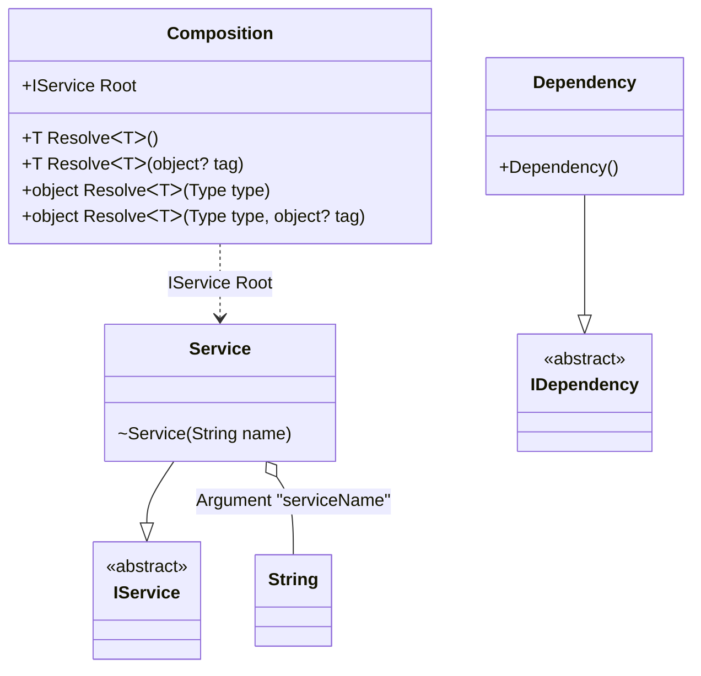
```mermaid
classDiagram
  class Composition {
    +IService Root
    +T ResolveᐸTᐳ()
    +T ResolveᐸTᐳ(object? tag)
    +object ResolveᐸTᐳ(Type type)
    +object ResolveᐸTᐳ(Type type, object? tag)
  }
  Service --|> IService : 
  class Service {
    ~Service(String name)
  }
  Dependency --|> IDependency : 
  class Dependency {
    +Dependency()
  }
  class String
  class IService {
    <<abstract>>
  }
  class IDependency {
    <<abstract>>
  }
  Service o-- String : Argument "serviceName"
  Composition ..> Service : IService Root
```

</details>

<details>
<summary>Generated Code</summary>

```c#
partial class Composition
{
  private readonly string _serviceNameArg8AFE6F;
  
  public Composition(string serviceName)
  {
    if (global::System.Object.ReferenceEquals(serviceName, null))
    {
      throw new global::System.ArgumentNullException("serviceName");
    }
    
    _serviceNameArg8AFE6F = serviceName;
  }
  
  internal Composition(Composition parent)
  {
    _serviceNameArg8AFE6F = parent._serviceNameArg8AFE6F;
  }
  
  #region Composition Roots
  public Pure.DI.UsageTests.Attributes.ConstructorOrdinalAttributeScenario.IService Root
  {
    [global::System.Runtime.CompilerServices.MethodImpl((global::System.Runtime.CompilerServices.MethodImplOptions)0x300)]
    get
    {
      Pure.DI.UsageTests.Attributes.ConstructorOrdinalAttributeScenario.Service v0Local8AFE6F = new Pure.DI.UsageTests.Attributes.ConstructorOrdinalAttributeScenario.Service(_serviceNameArg8AFE6F);
      return v0Local8AFE6F;
    }
  }
  #endregion
  
  #region API
  #if NETSTANDARD2_0_OR_GREATER || NETCOREAPP || NET40_OR_GREATER
  [global::System.Diagnostics.Contracts.Pure]
  #endif
  [global::System.Runtime.CompilerServices.MethodImpl((global::System.Runtime.CompilerServices.MethodImplOptions)0x300)]
  public T Resolve<T>()
  {
    return Resolver8AFE6F<T>.Value.Resolve(this);
  }
  
  #if NETSTANDARD2_0_OR_GREATER || NETCOREAPP || NET40_OR_GREATER
  [global::System.Diagnostics.Contracts.Pure]
  #endif
  [global::System.Runtime.CompilerServices.MethodImpl((global::System.Runtime.CompilerServices.MethodImplOptions)0x300)]
  public T Resolve<T>(object? tag)
  {
    return Resolver8AFE6F<T>.Value.ResolveByTag(this, tag);
  }
  
  #if NETSTANDARD2_0_OR_GREATER || NETCOREAPP || NET40_OR_GREATER
  [global::System.Diagnostics.Contracts.Pure]
  #endif
  [global::System.Runtime.CompilerServices.MethodImpl((global::System.Runtime.CompilerServices.MethodImplOptions)0x300)]
  public object Resolve(global::System.Type type)
  {
    int index = (int)(_bucketSize8AFE6F * ((uint)global::System.Runtime.CompilerServices.RuntimeHelpers.GetHashCode(type) % 1));
    ref var pair = ref _buckets8AFE6F[index];
    if (ReferenceEquals(pair.Key, type))
    {
      return pair.Value.Resolve(this);
    }
    
    int maxIndex = index + _bucketSize8AFE6F;
    for (int i = index + 1; i < maxIndex; i++)
    {
      pair = ref _buckets8AFE6F[i];
      if (ReferenceEquals(pair.Key, type))
      {
        return pair.Value.Resolve(this);
      }
    }
    
    throw new global::System.InvalidOperationException($"Cannot resolve composition root of type {type}.");
  }
  
  #if NETSTANDARD2_0_OR_GREATER || NETCOREAPP || NET40_OR_GREATER
  [global::System.Diagnostics.Contracts.Pure]
  #endif
  [global::System.Runtime.CompilerServices.MethodImpl((global::System.Runtime.CompilerServices.MethodImplOptions)0x300)]
  public object Resolve(global::System.Type type, object? tag)
  {
    int index = (int)(_bucketSize8AFE6F * ((uint)global::System.Runtime.CompilerServices.RuntimeHelpers.GetHashCode(type) % 1));
    ref var pair = ref _buckets8AFE6F[index];
    if (ReferenceEquals(pair.Key, type))
    {
      return pair.Value.ResolveByTag(this, tag);
    }
    
    int maxIndex = index + _bucketSize8AFE6F;
    for (int i = index + 1; i < maxIndex; i++)
    {
      pair = ref _buckets8AFE6F[i];
      if (ReferenceEquals(pair.Key, type))
      {
        return pair.Value.ResolveByTag(this, tag);
      }
    }
    
    throw new global::System.InvalidOperationException($"Cannot resolve composition root of type {type}.");
  }
  
  #endregion
  
  public override string ToString()
  {
    return
      "classDiagram\n" +
        "  class Composition {\n" +
          "    +IService Root\n" +
          "    +T ResolveᐸTᐳ()\n" +
          "    +T ResolveᐸTᐳ(object? tag)\n" +
          "    +object ResolveᐸTᐳ(Type type)\n" +
          "    +object ResolveᐸTᐳ(Type type, object? tag)\n" +
        "  }\n" +
        "  Service --|> IService : \n" +
        "  class Service {\n" +
          "    ~Service(String name)\n" +
        "  }\n" +
        "  Dependency --|> IDependency : \n" +
        "  class Dependency {\n" +
          "    +Dependency()\n" +
        "  }\n" +
        "  class String\n" +
        "  class IService {\n" +
          "    <<abstract>>\n" +
        "  }\n" +
        "  class IDependency {\n" +
          "    <<abstract>>\n" +
        "  }\n" +
        "  Service o-- String : Argument \"serviceName\"\n" +
        "  Composition ..> Service : IService Root";
  }
  
  private readonly static int _bucketSize8AFE6F;
  private readonly static global::Pure.DI.Pair<global::System.Type, global::Pure.DI.IResolver<Composition, object>>[] _buckets8AFE6F;
  
  static Composition()
  {
    Resolver8AFE6F0 valResolver8AFE6F0 = new Resolver8AFE6F0();
    Resolver8AFE6F<Pure.DI.UsageTests.Attributes.ConstructorOrdinalAttributeScenario.IService>.Value = valResolver8AFE6F0;
    _buckets8AFE6F = global::Pure.DI.Buckets<global::System.Type, global::Pure.DI.IResolver<Composition, object>>.Create(
      1,
      out _bucketSize8AFE6F,
      new global::Pure.DI.Pair<global::System.Type, global::Pure.DI.IResolver<Composition, object>>[1]
      {
         new global::Pure.DI.Pair<global::System.Type, global::Pure.DI.IResolver<Composition, object>>(typeof(Pure.DI.UsageTests.Attributes.ConstructorOrdinalAttributeScenario.IService), valResolver8AFE6F0)
      });
  }
  
  #region Resolvers
  #pragma warning disable CS0649
  private class Resolver8AFE6F<T>
  {
    public static global::Pure.DI.IResolver<Composition, T> Value;
  }
  
  private sealed class Resolver8AFE6F0: global::Pure.DI.IResolver<Composition, Pure.DI.UsageTests.Attributes.ConstructorOrdinalAttributeScenario.IService>
  {
    [global::System.Runtime.CompilerServices.MethodImpl((global::System.Runtime.CompilerServices.MethodImplOptions)0x300)]
    public Pure.DI.UsageTests.Attributes.ConstructorOrdinalAttributeScenario.IService Resolve(Composition composition)
    {
      return composition.Root;
    }
    
    [global::System.Runtime.CompilerServices.MethodImpl((global::System.Runtime.CompilerServices.MethodImplOptions)0x300)]
    public Pure.DI.UsageTests.Attributes.ConstructorOrdinalAttributeScenario.IService ResolveByTag(Composition composition, object tag)
    {
      if (Equals(tag, null)) return composition.Root;
      throw new global::System.InvalidOperationException($"Cannot resolve composition root \"{tag}\" of type Pure.DI.UsageTests.Attributes.ConstructorOrdinalAttributeScenario.IService.");
    }
  }
  #pragma warning restore CS0649
  #endregion
}
```

</details>


#### Member Ordinal Attribute

[](../tests/Pure.DI.UsageTests/Attributes/MemberOrdinalAttributeScenario.cs)

When applied to a property or field, these type members will also participate in dependency injection in the appropriate order from smallest value to largest.

```c#
internal interface IPerson
{
    string Name { get; }
}

internal class Person : IPerson
{
    private readonly StringBuilder _name = new();

    public string Name => _name.ToString();

    [Ordinal(0)]
    internal int Id;

    [Ordinal(1)]
    internal string FirstName
    {
        set
        {
            _name.Append(Id);
            _name.Append(' ');
            _name.Append(value);
        }
    }

    [Ordinal(2)]
    internal DateTime Birthday
    {
        set
        {
            _name.Append(' ');
            _name.Append($"{value:yyyy-MM-dd}");
        }
    }
}

DI.Setup("PersonComposition")
    .Arg<int>("personId")
    .Arg<string>("personName")
    .Arg<DateTime>("personBirthday")
    .Bind<IPerson>().To<Person>()
    .Root<IPerson>("Person");

var composition = new PersonComposition(123, "Nik", new DateTime(1977, 11, 16));
var person = composition.Person;
person.Name.ShouldBe("123 Nik 1977-11-16");
```

<details open>
<summary>Class Diagram</summary>

```mermaid
classDiagram
  class PersonComposition {
    +IPerson Person
    +T ResolveᐸTᐳ()
    +T ResolveᐸTᐳ(object? tag)
    +object ResolveᐸTᐳ(Type type)
    +object ResolveᐸTᐳ(Type type, object? tag)
  }
  Person --|> IPerson : 
  class Person {
    +Person()
    ~Int32 Id
    ~String FirstName
    ~DateTime Birthday
  }
  class Int32
  class String
  class DateTime
  class IPerson {
    <<abstract>>
  }
  Person o-- Int32 : Argument "personId"
  Person o-- String : Argument "personName"
  Person o-- DateTime : Argument "personBirthday"
  PersonComposition ..> Person : IPerson Person
```

</details>

<details>
<summary>Generated Code</summary>

```c#
partial class PersonComposition
{
  private readonly int _personIdArg8AFE6F;
  private readonly string _personNameArg8AFE6F;
  private readonly System.DateTime _personBirthdayArg8AFE6F;
  
  public PersonComposition(int personId, string personName, System.DateTime personBirthday)
  {
    if (global::System.Object.ReferenceEquals(personName, null))
    {
      throw new global::System.ArgumentNullException("personName");
    }
    
    _personIdArg8AFE6F = personId;
    _personNameArg8AFE6F = personName;
    _personBirthdayArg8AFE6F = personBirthday;
  }
  
  internal PersonComposition(PersonComposition parent)
  {
    _personIdArg8AFE6F = parent._personIdArg8AFE6F;
    _personNameArg8AFE6F = parent._personNameArg8AFE6F;
    _personBirthdayArg8AFE6F = parent._personBirthdayArg8AFE6F;
  }
  
  #region Composition Roots
  public Pure.DI.UsageTests.Attributes.MemberOrdinalAttributeScenario.IPerson Person
  {
    [global::System.Runtime.CompilerServices.MethodImpl((global::System.Runtime.CompilerServices.MethodImplOptions)0x300)]
    get
    {
      Pure.DI.UsageTests.Attributes.MemberOrdinalAttributeScenario.Person v1Local8AFE6F = new Pure.DI.UsageTests.Attributes.MemberOrdinalAttributeScenario.Person();
      v1Local8AFE6F.Id = _personIdArg8AFE6F;
      v1Local8AFE6F.FirstName = _personNameArg8AFE6F;
      v1Local8AFE6F.Birthday = _personBirthdayArg8AFE6F;
      return v1Local8AFE6F;
    }
  }
  #endregion
  
  #region API
  #if NETSTANDARD2_0_OR_GREATER || NETCOREAPP || NET40_OR_GREATER
  [global::System.Diagnostics.Contracts.Pure]
  #endif
  [global::System.Runtime.CompilerServices.MethodImpl((global::System.Runtime.CompilerServices.MethodImplOptions)0x300)]
  public T Resolve<T>()
  {
    return Resolver8AFE6F<T>.Value.Resolve(this);
  }
  
  #if NETSTANDARD2_0_OR_GREATER || NETCOREAPP || NET40_OR_GREATER
  [global::System.Diagnostics.Contracts.Pure]
  #endif
  [global::System.Runtime.CompilerServices.MethodImpl((global::System.Runtime.CompilerServices.MethodImplOptions)0x300)]
  public T Resolve<T>(object? tag)
  {
    return Resolver8AFE6F<T>.Value.ResolveByTag(this, tag);
  }
  
  #if NETSTANDARD2_0_OR_GREATER || NETCOREAPP || NET40_OR_GREATER
  [global::System.Diagnostics.Contracts.Pure]
  #endif
  [global::System.Runtime.CompilerServices.MethodImpl((global::System.Runtime.CompilerServices.MethodImplOptions)0x300)]
  public object Resolve(global::System.Type type)
  {
    int index = (int)(_bucketSize8AFE6F * ((uint)global::System.Runtime.CompilerServices.RuntimeHelpers.GetHashCode(type) % 1));
    ref var pair = ref _buckets8AFE6F[index];
    if (ReferenceEquals(pair.Key, type))
    {
      return pair.Value.Resolve(this);
    }
    
    int maxIndex = index + _bucketSize8AFE6F;
    for (int i = index + 1; i < maxIndex; i++)
    {
      pair = ref _buckets8AFE6F[i];
      if (ReferenceEquals(pair.Key, type))
      {
        return pair.Value.Resolve(this);
      }
    }
    
    throw new global::System.InvalidOperationException($"Cannot resolve composition root of type {type}.");
  }
  
  #if NETSTANDARD2_0_OR_GREATER || NETCOREAPP || NET40_OR_GREATER
  [global::System.Diagnostics.Contracts.Pure]
  #endif
  [global::System.Runtime.CompilerServices.MethodImpl((global::System.Runtime.CompilerServices.MethodImplOptions)0x300)]
  public object Resolve(global::System.Type type, object? tag)
  {
    int index = (int)(_bucketSize8AFE6F * ((uint)global::System.Runtime.CompilerServices.RuntimeHelpers.GetHashCode(type) % 1));
    ref var pair = ref _buckets8AFE6F[index];
    if (ReferenceEquals(pair.Key, type))
    {
      return pair.Value.ResolveByTag(this, tag);
    }
    
    int maxIndex = index + _bucketSize8AFE6F;
    for (int i = index + 1; i < maxIndex; i++)
    {
      pair = ref _buckets8AFE6F[i];
      if (ReferenceEquals(pair.Key, type))
      {
        return pair.Value.ResolveByTag(this, tag);
      }
    }
    
    throw new global::System.InvalidOperationException($"Cannot resolve composition root of type {type}.");
  }
  
  #endregion
  
  public override string ToString()
  {
    return
      "classDiagram\n" +
        "  class PersonComposition {\n" +
          "    +IPerson Person\n" +
          "    +T ResolveᐸTᐳ()\n" +
          "    +T ResolveᐸTᐳ(object? tag)\n" +
          "    +object ResolveᐸTᐳ(Type type)\n" +
          "    +object ResolveᐸTᐳ(Type type, object? tag)\n" +
        "  }\n" +
        "  Person --|> IPerson : \n" +
        "  class Person {\n" +
          "    +Person()\n" +
          "    ~Int32 Id\n" +
          "    ~String FirstName\n" +
          "    ~DateTime Birthday\n" +
        "  }\n" +
        "  class Int32\n" +
        "  class String\n" +
        "  class DateTime\n" +
        "  class IPerson {\n" +
          "    <<abstract>>\n" +
        "  }\n" +
        "  Person o-- Int32 : Argument \"personId\"\n" +
        "  Person o-- String : Argument \"personName\"\n" +
        "  Person o-- DateTime : Argument \"personBirthday\"\n" +
        "  PersonComposition ..> Person : IPerson Person";
  }
  
  private readonly static int _bucketSize8AFE6F;
  private readonly static global::Pure.DI.Pair<global::System.Type, global::Pure.DI.IResolver<PersonComposition, object>>[] _buckets8AFE6F;
  
  static PersonComposition()
  {
    Resolver8AFE6F0 valResolver8AFE6F0 = new Resolver8AFE6F0();
    Resolver8AFE6F<Pure.DI.UsageTests.Attributes.MemberOrdinalAttributeScenario.IPerson>.Value = valResolver8AFE6F0;
    _buckets8AFE6F = global::Pure.DI.Buckets<global::System.Type, global::Pure.DI.IResolver<PersonComposition, object>>.Create(
      1,
      out _bucketSize8AFE6F,
      new global::Pure.DI.Pair<global::System.Type, global::Pure.DI.IResolver<PersonComposition, object>>[1]
      {
         new global::Pure.DI.Pair<global::System.Type, global::Pure.DI.IResolver<PersonComposition, object>>(typeof(Pure.DI.UsageTests.Attributes.MemberOrdinalAttributeScenario.IPerson), valResolver8AFE6F0)
      });
  }
  
  #region Resolvers
  #pragma warning disable CS0649
  private class Resolver8AFE6F<T>
  {
    public static global::Pure.DI.IResolver<PersonComposition, T> Value;
  }
  
  private sealed class Resolver8AFE6F0: global::Pure.DI.IResolver<PersonComposition, Pure.DI.UsageTests.Attributes.MemberOrdinalAttributeScenario.IPerson>
  {
    [global::System.Runtime.CompilerServices.MethodImpl((global::System.Runtime.CompilerServices.MethodImplOptions)0x300)]
    public Pure.DI.UsageTests.Attributes.MemberOrdinalAttributeScenario.IPerson Resolve(PersonComposition composition)
    {
      return composition.Person;
    }
    
    [global::System.Runtime.CompilerServices.MethodImpl((global::System.Runtime.CompilerServices.MethodImplOptions)0x300)]
    public Pure.DI.UsageTests.Attributes.MemberOrdinalAttributeScenario.IPerson ResolveByTag(PersonComposition composition, object tag)
    {
      if (Equals(tag, null)) return composition.Person;
      throw new global::System.InvalidOperationException($"Cannot resolve composition root \"{tag}\" of type Pure.DI.UsageTests.Attributes.MemberOrdinalAttributeScenario.IPerson.");
    }
  }
  #pragma warning restore CS0649
  #endregion
}
```

</details>


## Base Class Library
#### Func

[](../tests/Pure.DI.UsageTests/BaseClassLibrary/FuncScenario.cs)

_Func<T>_ helps when logic needs to inject instances of some type on demand and multiple times.

```c#
internal interface IDependency { }

internal class Dependency : IDependency { }

internal interface IService
{
    ImmutableArray<IDependency> Dependencies { get; }
}

internal class Service : IService
{
    public Service(Func<IDependency> dependencyFactory)
    {
        Dependencies = Enumerable
            .Range(0, 10)
            .Select(_ => dependencyFactory())
            .ToImmutableArray();
    }

    public ImmutableArray<IDependency> Dependencies { get; }
}

DI.Setup("Composition")
    .Bind<IDependency>().To<Dependency>()
    .Bind<IService>().To<Service>()
    .Root<IService>("Root");

var composition = new Composition();
var service = composition.Root;
service.Dependencies.Length.ShouldBe(10);
```

<details open>
<summary>Class Diagram</summary>

```mermaid
classDiagram
  class Composition {
    +IService Root
    +T ResolveᐸTᐳ()
    +T ResolveᐸTᐳ(object? tag)
    +object ResolveᐸTᐳ(Type type)
    +object ResolveᐸTᐳ(Type type, object? tag)
  }
  Service --|> IService : 
  class Service {
    +Service(FuncᐸIDependencyᐳ dependencyFactory)
  }
  Dependency --|> IDependency : 
  class Dependency {
    +Dependency()
  }
  class FuncᐸIDependencyᐳ
  class IService {
    <<abstract>>
  }
  class IDependency {
    <<abstract>>
  }
  Service o--  "PerResolve" FuncᐸIDependencyᐳ : FuncᐸIDependencyᐳ dependencyFactory
  Composition ..> Service : IService Root
  FuncᐸIDependencyᐳ *--  Dependency : IDependency
```

</details>

<details>
<summary>Generated Code</summary>

```c#
partial class Composition
{
  public Composition()
  {
  }
  
  internal Composition(Composition parent)
  {
  }
  
  #region Composition Roots
  public Pure.DI.UsageTests.BCL.FuncScenario.IService Root
  {
    [global::System.Runtime.CompilerServices.MethodImpl((global::System.Runtime.CompilerServices.MethodImplOptions)0x300)]
    get
    {
      System.Func<Pure.DI.UsageTests.BCL.FuncScenario.IDependency> v11PerResolve8AFE6F;
      v11PerResolve8AFE6F = new System.Func<Pure.DI.UsageTests.BCL.FuncScenario.IDependency>(() =>
                          {
                              Pure.DI.UsageTests.BCL.FuncScenario.IDependency value;
      
      Pure.DI.UsageTests.BCL.FuncScenario.Dependency v14Local8AFE6F = new Pure.DI.UsageTests.BCL.FuncScenario.Dependency();
      value = v14Local8AFE6F;
                              return value;
                          });
      Pure.DI.UsageTests.BCL.FuncScenario.Service v10Local8AFE6F = new Pure.DI.UsageTests.BCL.FuncScenario.Service(v11PerResolve8AFE6F);
      return v10Local8AFE6F;
    }
  }
  #endregion
  
  #region API
  #if NETSTANDARD2_0_OR_GREATER || NETCOREAPP || NET40_OR_GREATER
  [global::System.Diagnostics.Contracts.Pure]
  #endif
  [global::System.Runtime.CompilerServices.MethodImpl((global::System.Runtime.CompilerServices.MethodImplOptions)0x300)]
  public T Resolve<T>()
  {
    return Resolver8AFE6F<T>.Value.Resolve(this);
  }
  
  #if NETSTANDARD2_0_OR_GREATER || NETCOREAPP || NET40_OR_GREATER
  [global::System.Diagnostics.Contracts.Pure]
  #endif
  [global::System.Runtime.CompilerServices.MethodImpl((global::System.Runtime.CompilerServices.MethodImplOptions)0x300)]
  public T Resolve<T>(object? tag)
  {
    return Resolver8AFE6F<T>.Value.ResolveByTag(this, tag);
  }
  
  #if NETSTANDARD2_0_OR_GREATER || NETCOREAPP || NET40_OR_GREATER
  [global::System.Diagnostics.Contracts.Pure]
  #endif
  [global::System.Runtime.CompilerServices.MethodImpl((global::System.Runtime.CompilerServices.MethodImplOptions)0x300)]
  public object Resolve(global::System.Type type)
  {
    int index = (int)(_bucketSize8AFE6F * ((uint)global::System.Runtime.CompilerServices.RuntimeHelpers.GetHashCode(type) % 1));
    ref var pair = ref _buckets8AFE6F[index];
    if (ReferenceEquals(pair.Key, type))
    {
      return pair.Value.Resolve(this);
    }
    
    int maxIndex = index + _bucketSize8AFE6F;
    for (int i = index + 1; i < maxIndex; i++)
    {
      pair = ref _buckets8AFE6F[i];
      if (ReferenceEquals(pair.Key, type))
      {
        return pair.Value.Resolve(this);
      }
    }
    
    throw new global::System.InvalidOperationException($"Cannot resolve composition root of type {type}.");
  }
  
  #if NETSTANDARD2_0_OR_GREATER || NETCOREAPP || NET40_OR_GREATER
  [global::System.Diagnostics.Contracts.Pure]
  #endif
  [global::System.Runtime.CompilerServices.MethodImpl((global::System.Runtime.CompilerServices.MethodImplOptions)0x300)]
  public object Resolve(global::System.Type type, object? tag)
  {
    int index = (int)(_bucketSize8AFE6F * ((uint)global::System.Runtime.CompilerServices.RuntimeHelpers.GetHashCode(type) % 1));
    ref var pair = ref _buckets8AFE6F[index];
    if (ReferenceEquals(pair.Key, type))
    {
      return pair.Value.ResolveByTag(this, tag);
    }
    
    int maxIndex = index + _bucketSize8AFE6F;
    for (int i = index + 1; i < maxIndex; i++)
    {
      pair = ref _buckets8AFE6F[i];
      if (ReferenceEquals(pair.Key, type))
      {
        return pair.Value.ResolveByTag(this, tag);
      }
    }
    
    throw new global::System.InvalidOperationException($"Cannot resolve composition root of type {type}.");
  }
  
  #endregion
  
  public override string ToString()
  {
    return
      "classDiagram\n" +
        "  class Composition {\n" +
          "    +IService Root\n" +
          "    +T ResolveᐸTᐳ()\n" +
          "    +T ResolveᐸTᐳ(object? tag)\n" +
          "    +object ResolveᐸTᐳ(Type type)\n" +
          "    +object ResolveᐸTᐳ(Type type, object? tag)\n" +
        "  }\n" +
        "  Service --|> IService : \n" +
        "  class Service {\n" +
          "    +Service(FuncᐸIDependencyᐳ dependencyFactory)\n" +
        "  }\n" +
        "  Dependency --|> IDependency : \n" +
        "  class Dependency {\n" +
          "    +Dependency()\n" +
        "  }\n" +
        "  class FuncᐸIDependencyᐳ\n" +
        "  class IService {\n" +
          "    <<abstract>>\n" +
        "  }\n" +
        "  class IDependency {\n" +
          "    <<abstract>>\n" +
        "  }\n" +
        "  Service o--  \"PerResolve\" FuncᐸIDependencyᐳ : FuncᐸIDependencyᐳ dependencyFactory\n" +
        "  Composition ..> Service : IService Root\n" +
        "  FuncᐸIDependencyᐳ *--  Dependency : IDependency";
  }
  
  private readonly static int _bucketSize8AFE6F;
  private readonly static global::Pure.DI.Pair<global::System.Type, global::Pure.DI.IResolver<Composition, object>>[] _buckets8AFE6F;
  
  static Composition()
  {
    Resolver8AFE6F0 valResolver8AFE6F0 = new Resolver8AFE6F0();
    Resolver8AFE6F<Pure.DI.UsageTests.BCL.FuncScenario.IService>.Value = valResolver8AFE6F0;
    _buckets8AFE6F = global::Pure.DI.Buckets<global::System.Type, global::Pure.DI.IResolver<Composition, object>>.Create(
      1,
      out _bucketSize8AFE6F,
      new global::Pure.DI.Pair<global::System.Type, global::Pure.DI.IResolver<Composition, object>>[1]
      {
         new global::Pure.DI.Pair<global::System.Type, global::Pure.DI.IResolver<Composition, object>>(typeof(Pure.DI.UsageTests.BCL.FuncScenario.IService), valResolver8AFE6F0)
      });
  }
  
  #region Resolvers
  #pragma warning disable CS0649
  private class Resolver8AFE6F<T>
  {
    public static global::Pure.DI.IResolver<Composition, T> Value;
  }
  
  private sealed class Resolver8AFE6F0: global::Pure.DI.IResolver<Composition, Pure.DI.UsageTests.BCL.FuncScenario.IService>
  {
    [global::System.Runtime.CompilerServices.MethodImpl((global::System.Runtime.CompilerServices.MethodImplOptions)0x300)]
    public Pure.DI.UsageTests.BCL.FuncScenario.IService Resolve(Composition composition)
    {
      return composition.Root;
    }
    
    [global::System.Runtime.CompilerServices.MethodImpl((global::System.Runtime.CompilerServices.MethodImplOptions)0x300)]
    public Pure.DI.UsageTests.BCL.FuncScenario.IService ResolveByTag(Composition composition, object tag)
    {
      if (Equals(tag, null)) return composition.Root;
      throw new global::System.InvalidOperationException($"Cannot resolve composition root \"{tag}\" of type Pure.DI.UsageTests.BCL.FuncScenario.IService.");
    }
  }
  #pragma warning restore CS0649
  #endregion
}
```

</details>


#### IEnumerable

[](../tests/Pure.DI.UsageTests/BaseClassLibrary/EnumerableScenario.cs)

Specifying `IEnumerable<T>` as the injection type allows instances of all bindings that implement type `T` to be injected in a lazy manner - the instances will be provided one by one.

```c#
internal interface IDependency { }

internal class AbcDependency : IDependency { }

internal class XyzDependency : IDependency { }

internal interface IService
{
    ImmutableArray<IDependency> Dependencies { get; }
}

internal class Service : IService
{
    public Service(IEnumerable<IDependency> dependencies)
    {
        Dependencies = dependencies.ToImmutableArray();
    }

    public ImmutableArray<IDependency> Dependencies { get; }
}

DI.Setup("Composition")
    .Bind<IDependency>().To<AbcDependency>()
    .Bind<IDependency>(2).To<XyzDependency>()
    .Bind<IService>().To<Service>()
    .Root<IService>("Root");

var composition = new Composition();
var service = composition.Root;
service.Dependencies.Length.ShouldBe(2);
service.Dependencies[0].ShouldBeOfType<AbcDependency>();
service.Dependencies[1].ShouldBeOfType<XyzDependency>();
```

<details open>
<summary>Class Diagram</summary>

```mermaid
classDiagram
  class Composition {
    +IService Root
    +T ResolveᐸTᐳ()
    +T ResolveᐸTᐳ(object? tag)
    +object ResolveᐸTᐳ(Type type)
    +object ResolveᐸTᐳ(Type type, object? tag)
  }
  class IEnumerableᐸIDependencyᐳ
  Service --|> IService : 
  class Service {
    +Service(IEnumerableᐸIDependencyᐳ dependencies)
  }
  AbcDependency --|> IDependency : 
  class AbcDependency {
    +AbcDependency()
  }
  XyzDependency --|> IDependency : 2 
  class XyzDependency {
    +XyzDependency()
  }
  class IService {
    <<abstract>>
  }
  class IDependency {
    <<abstract>>
  }
  IEnumerableᐸIDependencyᐳ *--  AbcDependency : 
  IEnumerableᐸIDependencyᐳ *--  XyzDependency : 2  
  Service o--  "PerResolve" IEnumerableᐸIDependencyᐳ : IEnumerableᐸIDependencyᐳ dependencies
  Composition ..> Service : IService Root
```

</details>

<details>
<summary>Generated Code</summary>

```c#
partial class Composition
{
  public Composition()
  {
  }
  
  internal Composition(Composition parent)
  {
  }
  
  #region Composition Roots
  public Pure.DI.UsageTests.BCL.EnumerableScenario.IService Root
  {
    [global::System.Runtime.CompilerServices.MethodImpl((global::System.Runtime.CompilerServices.MethodImplOptions)0x300)]
    get
    {
      System.Collections.Generic.IEnumerable<Pure.DI.UsageTests.BCL.EnumerableScenario.IDependency> LocalFunc_v7PerResolve8AFE6F()
      {
        Pure.DI.UsageTests.BCL.EnumerableScenario.AbcDependency v8Local8AFE6F = new Pure.DI.UsageTests.BCL.EnumerableScenario.AbcDependency();
        yield return v8Local8AFE6F;
        
        Pure.DI.UsageTests.BCL.EnumerableScenario.XyzDependency v9Local8AFE6F = new Pure.DI.UsageTests.BCL.EnumerableScenario.XyzDependency();
        yield return v9Local8AFE6F;
      }
      
      System.Collections.Generic.IEnumerable<Pure.DI.UsageTests.BCL.EnumerableScenario.IDependency> v7PerResolve8AFE6F = LocalFunc_v7PerResolve8AFE6F();
      Pure.DI.UsageTests.BCL.EnumerableScenario.Service v6Local8AFE6F = new Pure.DI.UsageTests.BCL.EnumerableScenario.Service(v7PerResolve8AFE6F);
      return v6Local8AFE6F;
    }
  }
  #endregion
  
  #region API
  #if NETSTANDARD2_0_OR_GREATER || NETCOREAPP || NET40_OR_GREATER
  [global::System.Diagnostics.Contracts.Pure]
  #endif
  [global::System.Runtime.CompilerServices.MethodImpl((global::System.Runtime.CompilerServices.MethodImplOptions)0x300)]
  public T Resolve<T>()
  {
    return Resolver8AFE6F<T>.Value.Resolve(this);
  }
  
  #if NETSTANDARD2_0_OR_GREATER || NETCOREAPP || NET40_OR_GREATER
  [global::System.Diagnostics.Contracts.Pure]
  #endif
  [global::System.Runtime.CompilerServices.MethodImpl((global::System.Runtime.CompilerServices.MethodImplOptions)0x300)]
  public T Resolve<T>(object? tag)
  {
    return Resolver8AFE6F<T>.Value.ResolveByTag(this, tag);
  }
  
  #if NETSTANDARD2_0_OR_GREATER || NETCOREAPP || NET40_OR_GREATER
  [global::System.Diagnostics.Contracts.Pure]
  #endif
  [global::System.Runtime.CompilerServices.MethodImpl((global::System.Runtime.CompilerServices.MethodImplOptions)0x300)]
  public object Resolve(global::System.Type type)
  {
    int index = (int)(_bucketSize8AFE6F * ((uint)global::System.Runtime.CompilerServices.RuntimeHelpers.GetHashCode(type) % 1));
    ref var pair = ref _buckets8AFE6F[index];
    if (ReferenceEquals(pair.Key, type))
    {
      return pair.Value.Resolve(this);
    }
    
    int maxIndex = index + _bucketSize8AFE6F;
    for (int i = index + 1; i < maxIndex; i++)
    {
      pair = ref _buckets8AFE6F[i];
      if (ReferenceEquals(pair.Key, type))
      {
        return pair.Value.Resolve(this);
      }
    }
    
    throw new global::System.InvalidOperationException($"Cannot resolve composition root of type {type}.");
  }
  
  #if NETSTANDARD2_0_OR_GREATER || NETCOREAPP || NET40_OR_GREATER
  [global::System.Diagnostics.Contracts.Pure]
  #endif
  [global::System.Runtime.CompilerServices.MethodImpl((global::System.Runtime.CompilerServices.MethodImplOptions)0x300)]
  public object Resolve(global::System.Type type, object? tag)
  {
    int index = (int)(_bucketSize8AFE6F * ((uint)global::System.Runtime.CompilerServices.RuntimeHelpers.GetHashCode(type) % 1));
    ref var pair = ref _buckets8AFE6F[index];
    if (ReferenceEquals(pair.Key, type))
    {
      return pair.Value.ResolveByTag(this, tag);
    }
    
    int maxIndex = index + _bucketSize8AFE6F;
    for (int i = index + 1; i < maxIndex; i++)
    {
      pair = ref _buckets8AFE6F[i];
      if (ReferenceEquals(pair.Key, type))
      {
        return pair.Value.ResolveByTag(this, tag);
      }
    }
    
    throw new global::System.InvalidOperationException($"Cannot resolve composition root of type {type}.");
  }
  
  #endregion
  
  public override string ToString()
  {
    return
      "classDiagram\n" +
        "  class Composition {\n" +
          "    +IService Root\n" +
          "    +T ResolveᐸTᐳ()\n" +
          "    +T ResolveᐸTᐳ(object? tag)\n" +
          "    +object ResolveᐸTᐳ(Type type)\n" +
          "    +object ResolveᐸTᐳ(Type type, object? tag)\n" +
        "  }\n" +
        "  class IEnumerableᐸIDependencyᐳ\n" +
        "  Service --|> IService : \n" +
        "  class Service {\n" +
          "    +Service(IEnumerableᐸIDependencyᐳ dependencies)\n" +
        "  }\n" +
        "  AbcDependency --|> IDependency : \n" +
        "  class AbcDependency {\n" +
          "    +AbcDependency()\n" +
        "  }\n" +
        "  XyzDependency --|> IDependency : 2 \n" +
        "  class XyzDependency {\n" +
          "    +XyzDependency()\n" +
        "  }\n" +
        "  class IService {\n" +
          "    <<abstract>>\n" +
        "  }\n" +
        "  class IDependency {\n" +
          "    <<abstract>>\n" +
        "  }\n" +
        "  IEnumerableᐸIDependencyᐳ *--  AbcDependency : \n" +
        "  IEnumerableᐸIDependencyᐳ *--  XyzDependency : 2  \n" +
        "  Service o--  \"PerResolve\" IEnumerableᐸIDependencyᐳ : IEnumerableᐸIDependencyᐳ dependencies\n" +
        "  Composition ..> Service : IService Root";
  }
  
  private readonly static int _bucketSize8AFE6F;
  private readonly static global::Pure.DI.Pair<global::System.Type, global::Pure.DI.IResolver<Composition, object>>[] _buckets8AFE6F;
  
  static Composition()
  {
    Resolver8AFE6F0 valResolver8AFE6F0 = new Resolver8AFE6F0();
    Resolver8AFE6F<Pure.DI.UsageTests.BCL.EnumerableScenario.IService>.Value = valResolver8AFE6F0;
    _buckets8AFE6F = global::Pure.DI.Buckets<global::System.Type, global::Pure.DI.IResolver<Composition, object>>.Create(
      1,
      out _bucketSize8AFE6F,
      new global::Pure.DI.Pair<global::System.Type, global::Pure.DI.IResolver<Composition, object>>[1]
      {
         new global::Pure.DI.Pair<global::System.Type, global::Pure.DI.IResolver<Composition, object>>(typeof(Pure.DI.UsageTests.BCL.EnumerableScenario.IService), valResolver8AFE6F0)
      });
  }
  
  #region Resolvers
  #pragma warning disable CS0649
  private class Resolver8AFE6F<T>
  {
    public static global::Pure.DI.IResolver<Composition, T> Value;
  }
  
  private sealed class Resolver8AFE6F0: global::Pure.DI.IResolver<Composition, Pure.DI.UsageTests.BCL.EnumerableScenario.IService>
  {
    [global::System.Runtime.CompilerServices.MethodImpl((global::System.Runtime.CompilerServices.MethodImplOptions)0x300)]
    public Pure.DI.UsageTests.BCL.EnumerableScenario.IService Resolve(Composition composition)
    {
      return composition.Root;
    }
    
    [global::System.Runtime.CompilerServices.MethodImpl((global::System.Runtime.CompilerServices.MethodImplOptions)0x300)]
    public Pure.DI.UsageTests.BCL.EnumerableScenario.IService ResolveByTag(Composition composition, object tag)
    {
      if (Equals(tag, null)) return composition.Root;
      throw new global::System.InvalidOperationException($"Cannot resolve composition root \"{tag}\" of type Pure.DI.UsageTests.BCL.EnumerableScenario.IService.");
    }
  }
  #pragma warning restore CS0649
  #endregion
}
```

</details>


#### Array

[](../tests/Pure.DI.UsageTests/BaseClassLibrary/ArrayScenario.cs)

Specifying `T[]` as the injection type allows instances from all bindings that implement the `T` type to be injected.

```c#
internal interface IDependency { }

internal class AbcDependency : IDependency { }

internal class XyzDependency : IDependency { }

internal interface IService
{
    IDependency[] Dependencies { get; }
}

internal class Service : IService
{
    public Service(IDependency[] dependencies)
    {
        Dependencies = dependencies;
    }

    public IDependency[] Dependencies { get; }
}

DI.Setup("Composition")
    .Bind<IDependency>().To<AbcDependency>()
    .Bind<IDependency>(2).To<XyzDependency>()
    .Bind<IService>().To<Service>()
    .Root<IService>("Root");

var composition = new Composition();
var service = composition.Root;
service.Dependencies.Length.ShouldBe(2);
service.Dependencies[0].ShouldBeOfType<AbcDependency>();
service.Dependencies[1].ShouldBeOfType<XyzDependency>();
```

<details open>
<summary>Class Diagram</summary>

```mermaid
classDiagram
  class Composition {
    +IService Root
    +T ResolveᐸTᐳ()
    +T ResolveᐸTᐳ(object? tag)
    +object ResolveᐸTᐳ(Type type)
    +object ResolveᐸTᐳ(Type type, object? tag)
  }
  class ArrayᐸIDependencyᐳ
  Service --|> IService : 
  class Service {
    +Service(ArrayᐸIDependencyᐳ dependencies)
  }
  AbcDependency --|> IDependency : 
  class AbcDependency {
    +AbcDependency()
  }
  XyzDependency --|> IDependency : 2 
  class XyzDependency {
    +XyzDependency()
  }
  class IService {
    <<abstract>>
  }
  class IDependency {
    <<abstract>>
  }
  ArrayᐸIDependencyᐳ *--  AbcDependency : 
  ArrayᐸIDependencyᐳ *--  XyzDependency : 2  
  Service *--  ArrayᐸIDependencyᐳ : ArrayᐸIDependencyᐳ dependencies
  Composition ..> Service : IService Root
```

</details>

<details>
<summary>Generated Code</summary>

```c#
partial class Composition
{
  public Composition()
  {
  }
  
  internal Composition(Composition parent)
  {
  }
  
  #region Composition Roots
  public Pure.DI.UsageTests.BCL.ArrayScenario.IService Root
  {
    [global::System.Runtime.CompilerServices.MethodImpl((global::System.Runtime.CompilerServices.MethodImplOptions)0x300)]
    get
    {
      Pure.DI.UsageTests.BCL.ArrayScenario.AbcDependency v4Local8AFE6F = new Pure.DI.UsageTests.BCL.ArrayScenario.AbcDependency();
      Pure.DI.UsageTests.BCL.ArrayScenario.XyzDependency v5Local8AFE6F = new Pure.DI.UsageTests.BCL.ArrayScenario.XyzDependency();
      Pure.DI.UsageTests.BCL.ArrayScenario.IDependency[] v3Local8AFE6F = new Pure.DI.UsageTests.BCL.ArrayScenario.IDependency[2] { v4Local8AFE6F, v5Local8AFE6F };
      Pure.DI.UsageTests.BCL.ArrayScenario.Service v2Local8AFE6F = new Pure.DI.UsageTests.BCL.ArrayScenario.Service(v3Local8AFE6F);
      return v2Local8AFE6F;
    }
  }
  #endregion
  
  #region API
  #if NETSTANDARD2_0_OR_GREATER || NETCOREAPP || NET40_OR_GREATER
  [global::System.Diagnostics.Contracts.Pure]
  #endif
  [global::System.Runtime.CompilerServices.MethodImpl((global::System.Runtime.CompilerServices.MethodImplOptions)0x300)]
  public T Resolve<T>()
  {
    return Resolver8AFE6F<T>.Value.Resolve(this);
  }
  
  #if NETSTANDARD2_0_OR_GREATER || NETCOREAPP || NET40_OR_GREATER
  [global::System.Diagnostics.Contracts.Pure]
  #endif
  [global::System.Runtime.CompilerServices.MethodImpl((global::System.Runtime.CompilerServices.MethodImplOptions)0x300)]
  public T Resolve<T>(object? tag)
  {
    return Resolver8AFE6F<T>.Value.ResolveByTag(this, tag);
  }
  
  #if NETSTANDARD2_0_OR_GREATER || NETCOREAPP || NET40_OR_GREATER
  [global::System.Diagnostics.Contracts.Pure]
  #endif
  [global::System.Runtime.CompilerServices.MethodImpl((global::System.Runtime.CompilerServices.MethodImplOptions)0x300)]
  public object Resolve(global::System.Type type)
  {
    int index = (int)(_bucketSize8AFE6F * ((uint)global::System.Runtime.CompilerServices.RuntimeHelpers.GetHashCode(type) % 1));
    ref var pair = ref _buckets8AFE6F[index];
    if (ReferenceEquals(pair.Key, type))
    {
      return pair.Value.Resolve(this);
    }
    
    int maxIndex = index + _bucketSize8AFE6F;
    for (int i = index + 1; i < maxIndex; i++)
    {
      pair = ref _buckets8AFE6F[i];
      if (ReferenceEquals(pair.Key, type))
      {
        return pair.Value.Resolve(this);
      }
    }
    
    throw new global::System.InvalidOperationException($"Cannot resolve composition root of type {type}.");
  }
  
  #if NETSTANDARD2_0_OR_GREATER || NETCOREAPP || NET40_OR_GREATER
  [global::System.Diagnostics.Contracts.Pure]
  #endif
  [global::System.Runtime.CompilerServices.MethodImpl((global::System.Runtime.CompilerServices.MethodImplOptions)0x300)]
  public object Resolve(global::System.Type type, object? tag)
  {
    int index = (int)(_bucketSize8AFE6F * ((uint)global::System.Runtime.CompilerServices.RuntimeHelpers.GetHashCode(type) % 1));
    ref var pair = ref _buckets8AFE6F[index];
    if (ReferenceEquals(pair.Key, type))
    {
      return pair.Value.ResolveByTag(this, tag);
    }
    
    int maxIndex = index + _bucketSize8AFE6F;
    for (int i = index + 1; i < maxIndex; i++)
    {
      pair = ref _buckets8AFE6F[i];
      if (ReferenceEquals(pair.Key, type))
      {
        return pair.Value.ResolveByTag(this, tag);
      }
    }
    
    throw new global::System.InvalidOperationException($"Cannot resolve composition root of type {type}.");
  }
  
  #endregion
  
  public override string ToString()
  {
    return
      "classDiagram\n" +
        "  class Composition {\n" +
          "    +IService Root\n" +
          "    +T ResolveᐸTᐳ()\n" +
          "    +T ResolveᐸTᐳ(object? tag)\n" +
          "    +object ResolveᐸTᐳ(Type type)\n" +
          "    +object ResolveᐸTᐳ(Type type, object? tag)\n" +
        "  }\n" +
        "  class ArrayᐸIDependencyᐳ\n" +
        "  Service --|> IService : \n" +
        "  class Service {\n" +
          "    +Service(ArrayᐸIDependencyᐳ dependencies)\n" +
        "  }\n" +
        "  AbcDependency --|> IDependency : \n" +
        "  class AbcDependency {\n" +
          "    +AbcDependency()\n" +
        "  }\n" +
        "  XyzDependency --|> IDependency : 2 \n" +
        "  class XyzDependency {\n" +
          "    +XyzDependency()\n" +
        "  }\n" +
        "  class IService {\n" +
          "    <<abstract>>\n" +
        "  }\n" +
        "  class IDependency {\n" +
          "    <<abstract>>\n" +
        "  }\n" +
        "  ArrayᐸIDependencyᐳ *--  AbcDependency : \n" +
        "  ArrayᐸIDependencyᐳ *--  XyzDependency : 2  \n" +
        "  Service *--  ArrayᐸIDependencyᐳ : ArrayᐸIDependencyᐳ dependencies\n" +
        "  Composition ..> Service : IService Root";
  }
  
  private readonly static int _bucketSize8AFE6F;
  private readonly static global::Pure.DI.Pair<global::System.Type, global::Pure.DI.IResolver<Composition, object>>[] _buckets8AFE6F;
  
  static Composition()
  {
    Resolver8AFE6F0 valResolver8AFE6F0 = new Resolver8AFE6F0();
    Resolver8AFE6F<Pure.DI.UsageTests.BCL.ArrayScenario.IService>.Value = valResolver8AFE6F0;
    _buckets8AFE6F = global::Pure.DI.Buckets<global::System.Type, global::Pure.DI.IResolver<Composition, object>>.Create(
      1,
      out _bucketSize8AFE6F,
      new global::Pure.DI.Pair<global::System.Type, global::Pure.DI.IResolver<Composition, object>>[1]
      {
         new global::Pure.DI.Pair<global::System.Type, global::Pure.DI.IResolver<Composition, object>>(typeof(Pure.DI.UsageTests.BCL.ArrayScenario.IService), valResolver8AFE6F0)
      });
  }
  
  #region Resolvers
  #pragma warning disable CS0649
  private class Resolver8AFE6F<T>
  {
    public static global::Pure.DI.IResolver<Composition, T> Value;
  }
  
  private sealed class Resolver8AFE6F0: global::Pure.DI.IResolver<Composition, Pure.DI.UsageTests.BCL.ArrayScenario.IService>
  {
    [global::System.Runtime.CompilerServices.MethodImpl((global::System.Runtime.CompilerServices.MethodImplOptions)0x300)]
    public Pure.DI.UsageTests.BCL.ArrayScenario.IService Resolve(Composition composition)
    {
      return composition.Root;
    }
    
    [global::System.Runtime.CompilerServices.MethodImpl((global::System.Runtime.CompilerServices.MethodImplOptions)0x300)]
    public Pure.DI.UsageTests.BCL.ArrayScenario.IService ResolveByTag(Composition composition, object tag)
    {
      if (Equals(tag, null)) return composition.Root;
      throw new global::System.InvalidOperationException($"Cannot resolve composition root \"{tag}\" of type Pure.DI.UsageTests.BCL.ArrayScenario.IService.");
    }
  }
  #pragma warning restore CS0649
  #endregion
}
```

</details>


In addition to arrays, other collection types are also supported, such as:
- System.Memory<T>
- System.ReadOnlyMemory<T>
- System.Span<T>
- System.ReadOnlySpan<T>
- System.Collections.Generic.ICollection<T>
- System.Collections.Generic.IList<T>
- System.Collections.Generic.List<T>
- System.Collections.Generic.IReadOnlyCollection<T>
- System.Collections.Generic.IReadOnlyList<T>
- System.Collections.Generic.ISet<T>
- System.Collections.Generic.HashSet<T>
- System.Collections.Generic.SortedSet<T>
- System.Collections.Generic.Queue<T>
- System.Collections.Generic.Stack<T>
- System.Collections.Immutable.ImmutableArray<T>
- System.Collections.Immutable.IImmutableList<T>
- System.Collections.Immutable.ImmutableList<T>
- System.Collections.Immutable.IImmutableSet<T>
- System.Collections.Immutable.ImmutableHashSet<T>
- System.Collections.Immutable.ImmutableSortedSet<T>
- System.Collections.Immutable.IImmutableQueue<T>
- System.Collections.Immutable.ImmutableQueue<T>
- System.Collections.Immutable.IImmutableStack<T>

#### Lazy

[](../tests/Pure.DI.UsageTests/BaseClassLibrary/LazyScenario.cs)

```c#
internal interface IDependency { }

internal class Dependency : IDependency { }

internal interface IService
{
    IDependency Dependency { get; }
}

internal class Service : IService
{
    private readonly Lazy<IDependency> _dependency;

    public Service(Lazy<IDependency> dependency)
    {
        _dependency = dependency;
    }

    public IDependency Dependency => _dependency.Value;
}

DI.Setup("Composition")
    .Bind<IDependency>().To<Dependency>()
    .Bind<IService>().To<Service>()
    .Root<IService>("Root");

var composition = new Composition();
var service = composition.Root;
service.Dependency.ShouldBe(service.Dependency);
```

<details open>
<summary>Class Diagram</summary>

```mermaid
classDiagram
  class Composition {
    +IService Root
    +T ResolveᐸTᐳ()
    +T ResolveᐸTᐳ(object? tag)
    +object ResolveᐸTᐳ(Type type)
    +object ResolveᐸTᐳ(Type type, object? tag)
  }
  Service --|> IService : 
  class Service {
    +Service(LazyᐸIDependencyᐳ dependency)
  }
  Dependency --|> IDependency : 
  class Dependency {
    +Dependency()
  }
  class LazyᐸIDependencyᐳ
  class FuncᐸIDependencyᐳ
  class IService {
    <<abstract>>
  }
  class IDependency {
    <<abstract>>
  }
  Service *--  LazyᐸIDependencyᐳ : LazyᐸIDependencyᐳ dependency
  Composition ..> Service : IService Root
  LazyᐸIDependencyᐳ o--  "PerResolve" FuncᐸIDependencyᐳ : FuncᐸIDependencyᐳ
  FuncᐸIDependencyᐳ *--  Dependency : IDependency
```

</details>

<details>
<summary>Generated Code</summary>

```c#
partial class Composition
{
  public Composition()
  {
  }
  
  internal Composition(Composition parent)
  {
  }
  
  #region Composition Roots
  public Pure.DI.UsageTests.BCL.LazyScenario.IService Root
  {
    [global::System.Runtime.CompilerServices.MethodImpl((global::System.Runtime.CompilerServices.MethodImplOptions)0x300)]
    get
    {
      System.Func<Pure.DI.UsageTests.BCL.LazyScenario.IDependency> v17PerResolve8AFE6F;
      v17PerResolve8AFE6F = new System.Func<Pure.DI.UsageTests.BCL.LazyScenario.IDependency>(() =>
                          {
                              Pure.DI.UsageTests.BCL.LazyScenario.IDependency value;
      
      Pure.DI.UsageTests.BCL.LazyScenario.Dependency v20Local8AFE6F = new Pure.DI.UsageTests.BCL.LazyScenario.Dependency();
      value = v20Local8AFE6F;
                              return value;
                          });
      System.Lazy<Pure.DI.UsageTests.BCL.LazyScenario.IDependency> v16Local8AFE6F;
      {
                              global::System.Func<Pure.DI.UsageTests.BCL.LazyScenario.IDependency> func;
      
      func = v17PerResolve8AFE6F;
                              { v16Local8AFE6F = new global::System.Lazy<Pure.DI.UsageTests.BCL.LazyScenario.IDependency>(func, true); goto label218AFE6F; }                    }
      label218AFE6F:
      ;
      Pure.DI.UsageTests.BCL.LazyScenario.Service v15Local8AFE6F = new Pure.DI.UsageTests.BCL.LazyScenario.Service(v16Local8AFE6F);
      return v15Local8AFE6F;
    }
  }
  #endregion
  
  #region API
  #if NETSTANDARD2_0_OR_GREATER || NETCOREAPP || NET40_OR_GREATER
  [global::System.Diagnostics.Contracts.Pure]
  #endif
  [global::System.Runtime.CompilerServices.MethodImpl((global::System.Runtime.CompilerServices.MethodImplOptions)0x300)]
  public T Resolve<T>()
  {
    return Resolver8AFE6F<T>.Value.Resolve(this);
  }
  
  #if NETSTANDARD2_0_OR_GREATER || NETCOREAPP || NET40_OR_GREATER
  [global::System.Diagnostics.Contracts.Pure]
  #endif
  [global::System.Runtime.CompilerServices.MethodImpl((global::System.Runtime.CompilerServices.MethodImplOptions)0x300)]
  public T Resolve<T>(object? tag)
  {
    return Resolver8AFE6F<T>.Value.ResolveByTag(this, tag);
  }
  
  #if NETSTANDARD2_0_OR_GREATER || NETCOREAPP || NET40_OR_GREATER
  [global::System.Diagnostics.Contracts.Pure]
  #endif
  [global::System.Runtime.CompilerServices.MethodImpl((global::System.Runtime.CompilerServices.MethodImplOptions)0x300)]
  public object Resolve(global::System.Type type)
  {
    int index = (int)(_bucketSize8AFE6F * ((uint)global::System.Runtime.CompilerServices.RuntimeHelpers.GetHashCode(type) % 1));
    ref var pair = ref _buckets8AFE6F[index];
    if (ReferenceEquals(pair.Key, type))
    {
      return pair.Value.Resolve(this);
    }
    
    int maxIndex = index + _bucketSize8AFE6F;
    for (int i = index + 1; i < maxIndex; i++)
    {
      pair = ref _buckets8AFE6F[i];
      if (ReferenceEquals(pair.Key, type))
      {
        return pair.Value.Resolve(this);
      }
    }
    
    throw new global::System.InvalidOperationException($"Cannot resolve composition root of type {type}.");
  }
  
  #if NETSTANDARD2_0_OR_GREATER || NETCOREAPP || NET40_OR_GREATER
  [global::System.Diagnostics.Contracts.Pure]
  #endif
  [global::System.Runtime.CompilerServices.MethodImpl((global::System.Runtime.CompilerServices.MethodImplOptions)0x300)]
  public object Resolve(global::System.Type type, object? tag)
  {
    int index = (int)(_bucketSize8AFE6F * ((uint)global::System.Runtime.CompilerServices.RuntimeHelpers.GetHashCode(type) % 1));
    ref var pair = ref _buckets8AFE6F[index];
    if (ReferenceEquals(pair.Key, type))
    {
      return pair.Value.ResolveByTag(this, tag);
    }
    
    int maxIndex = index + _bucketSize8AFE6F;
    for (int i = index + 1; i < maxIndex; i++)
    {
      pair = ref _buckets8AFE6F[i];
      if (ReferenceEquals(pair.Key, type))
      {
        return pair.Value.ResolveByTag(this, tag);
      }
    }
    
    throw new global::System.InvalidOperationException($"Cannot resolve composition root of type {type}.");
  }
  
  #endregion
  
  public override string ToString()
  {
    return
      "classDiagram\n" +
        "  class Composition {\n" +
          "    +IService Root\n" +
          "    +T ResolveᐸTᐳ()\n" +
          "    +T ResolveᐸTᐳ(object? tag)\n" +
          "    +object ResolveᐸTᐳ(Type type)\n" +
          "    +object ResolveᐸTᐳ(Type type, object? tag)\n" +
        "  }\n" +
        "  Service --|> IService : \n" +
        "  class Service {\n" +
          "    +Service(LazyᐸIDependencyᐳ dependency)\n" +
        "  }\n" +
        "  Dependency --|> IDependency : \n" +
        "  class Dependency {\n" +
          "    +Dependency()\n" +
        "  }\n" +
        "  class LazyᐸIDependencyᐳ\n" +
        "  class FuncᐸIDependencyᐳ\n" +
        "  class IService {\n" +
          "    <<abstract>>\n" +
        "  }\n" +
        "  class IDependency {\n" +
          "    <<abstract>>\n" +
        "  }\n" +
        "  Service *--  LazyᐸIDependencyᐳ : LazyᐸIDependencyᐳ dependency\n" +
        "  Composition ..> Service : IService Root\n" +
        "  LazyᐸIDependencyᐳ o--  \"PerResolve\" FuncᐸIDependencyᐳ : FuncᐸIDependencyᐳ\n" +
        "  FuncᐸIDependencyᐳ *--  Dependency : IDependency";
  }
  
  private readonly static int _bucketSize8AFE6F;
  private readonly static global::Pure.DI.Pair<global::System.Type, global::Pure.DI.IResolver<Composition, object>>[] _buckets8AFE6F;
  
  static Composition()
  {
    Resolver8AFE6F0 valResolver8AFE6F0 = new Resolver8AFE6F0();
    Resolver8AFE6F<Pure.DI.UsageTests.BCL.LazyScenario.IService>.Value = valResolver8AFE6F0;
    _buckets8AFE6F = global::Pure.DI.Buckets<global::System.Type, global::Pure.DI.IResolver<Composition, object>>.Create(
      1,
      out _bucketSize8AFE6F,
      new global::Pure.DI.Pair<global::System.Type, global::Pure.DI.IResolver<Composition, object>>[1]
      {
         new global::Pure.DI.Pair<global::System.Type, global::Pure.DI.IResolver<Composition, object>>(typeof(Pure.DI.UsageTests.BCL.LazyScenario.IService), valResolver8AFE6F0)
      });
  }
  
  #region Resolvers
  #pragma warning disable CS0649
  private class Resolver8AFE6F<T>
  {
    public static global::Pure.DI.IResolver<Composition, T> Value;
  }
  
  private sealed class Resolver8AFE6F0: global::Pure.DI.IResolver<Composition, Pure.DI.UsageTests.BCL.LazyScenario.IService>
  {
    [global::System.Runtime.CompilerServices.MethodImpl((global::System.Runtime.CompilerServices.MethodImplOptions)0x300)]
    public Pure.DI.UsageTests.BCL.LazyScenario.IService Resolve(Composition composition)
    {
      return composition.Root;
    }
    
    [global::System.Runtime.CompilerServices.MethodImpl((global::System.Runtime.CompilerServices.MethodImplOptions)0x300)]
    public Pure.DI.UsageTests.BCL.LazyScenario.IService ResolveByTag(Composition composition, object tag)
    {
      if (Equals(tag, null)) return composition.Root;
      throw new global::System.InvalidOperationException($"Cannot resolve composition root \"{tag}\" of type Pure.DI.UsageTests.BCL.LazyScenario.IService.");
    }
  }
  #pragma warning restore CS0649
  #endregion
}
```

</details>


#### Span and ReadOnlySpan

[](../tests/Pure.DI.UsageTests/BaseClassLibrary/SpanScenario.cs)

Specifying `Span<T>` and `ReadOnlySpan<T>` work the same as with the array `T[]`.

```c#
internal class Dependency
{
}

internal interface IService
{
    int Count { get; }
}

internal class Service : IService
{
    public Service(ReadOnlySpan<Dependency> dependencies)
    {
        Count = dependencies.Length;
    }

    public int Count { get; }
}

DI.Setup("Composition")
    .Bind<Dependency>('a').To<Dependency>()
    .Bind<Dependency>('b').To<Dependency>()
    .Bind<Dependency>('c').To<Dependency>()
    .Bind<IService>().To<Service>()
    .Root<IService>("Root");

var composition = new Composition();
var service = composition.Root;
service.Count.ShouldBe(3);
```

<details open>
<summary>Class Diagram</summary>

```mermaid
classDiagram
  class Composition {
    +IService Root
    +T ResolveᐸTᐳ()
    +T ResolveᐸTᐳ(object? tag)
    +object ResolveᐸTᐳ(Type type)
    +object ResolveᐸTᐳ(Type type, object? tag)
  }
  class ReadOnlySpanᐸDependencyᐳ
  Service --|> IService : 
  class Service {
    +Service(ReadOnlySpanᐸDependencyᐳ dependencies)
  }
  class Dependency {
    +Dependency()
  }
  class IService {
    <<abstract>>
  }
  ReadOnlySpanᐸDependencyᐳ *--  Dependency : 'a'  
  ReadOnlySpanᐸDependencyᐳ *--  Dependency : 'b'  
  ReadOnlySpanᐸDependencyᐳ *--  Dependency : 'c'  
  Service *--  ReadOnlySpanᐸDependencyᐳ : ReadOnlySpanᐸDependencyᐳ dependencies
  Composition ..> Service : IService Root
```

</details>

<details>
<summary>Generated Code</summary>

```c#
partial class Composition
{
  public Composition()
  {
  }
  
  internal Composition(Composition parent)
  {
  }
  
  #region Composition Roots
  public Pure.DI.UsageTests.BCL.SpanScenario.IService Root
  {
    [global::System.Runtime.CompilerServices.MethodImpl((global::System.Runtime.CompilerServices.MethodImplOptions)0x300)]
    get
    {
      Pure.DI.UsageTests.BCL.SpanScenario.Dependency v25Local8AFE6F = new Pure.DI.UsageTests.BCL.SpanScenario.Dependency();
      Pure.DI.UsageTests.BCL.SpanScenario.Dependency v26Local8AFE6F = new Pure.DI.UsageTests.BCL.SpanScenario.Dependency();
      Pure.DI.UsageTests.BCL.SpanScenario.Dependency v27Local8AFE6F = new Pure.DI.UsageTests.BCL.SpanScenario.Dependency();
      System.ReadOnlySpan<Pure.DI.UsageTests.BCL.SpanScenario.Dependency> v24Local8AFE6F = new global::System.Span<Pure.DI.UsageTests.BCL.SpanScenario.Dependency>(new Pure.DI.UsageTests.BCL.SpanScenario.Dependency[3] { v25Local8AFE6F, v26Local8AFE6F, v27Local8AFE6F });
      Pure.DI.UsageTests.BCL.SpanScenario.Service v23Local8AFE6F = new Pure.DI.UsageTests.BCL.SpanScenario.Service(v24Local8AFE6F);
      return v23Local8AFE6F;
    }
  }
  #endregion
  
  #region API
  #if NETSTANDARD2_0_OR_GREATER || NETCOREAPP || NET40_OR_GREATER
  [global::System.Diagnostics.Contracts.Pure]
  #endif
  [global::System.Runtime.CompilerServices.MethodImpl((global::System.Runtime.CompilerServices.MethodImplOptions)0x300)]
  public T Resolve<T>()
  {
    return Resolver8AFE6F<T>.Value.Resolve(this);
  }
  
  #if NETSTANDARD2_0_OR_GREATER || NETCOREAPP || NET40_OR_GREATER
  [global::System.Diagnostics.Contracts.Pure]
  #endif
  [global::System.Runtime.CompilerServices.MethodImpl((global::System.Runtime.CompilerServices.MethodImplOptions)0x300)]
  public T Resolve<T>(object? tag)
  {
    return Resolver8AFE6F<T>.Value.ResolveByTag(this, tag);
  }
  
  #if NETSTANDARD2_0_OR_GREATER || NETCOREAPP || NET40_OR_GREATER
  [global::System.Diagnostics.Contracts.Pure]
  #endif
  [global::System.Runtime.CompilerServices.MethodImpl((global::System.Runtime.CompilerServices.MethodImplOptions)0x300)]
  public object Resolve(global::System.Type type)
  {
    int index = (int)(_bucketSize8AFE6F * ((uint)global::System.Runtime.CompilerServices.RuntimeHelpers.GetHashCode(type) % 1));
    ref var pair = ref _buckets8AFE6F[index];
    if (ReferenceEquals(pair.Key, type))
    {
      return pair.Value.Resolve(this);
    }
    
    int maxIndex = index + _bucketSize8AFE6F;
    for (int i = index + 1; i < maxIndex; i++)
    {
      pair = ref _buckets8AFE6F[i];
      if (ReferenceEquals(pair.Key, type))
      {
        return pair.Value.Resolve(this);
      }
    }
    
    throw new global::System.InvalidOperationException($"Cannot resolve composition root of type {type}.");
  }
  
  #if NETSTANDARD2_0_OR_GREATER || NETCOREAPP || NET40_OR_GREATER
  [global::System.Diagnostics.Contracts.Pure]
  #endif
  [global::System.Runtime.CompilerServices.MethodImpl((global::System.Runtime.CompilerServices.MethodImplOptions)0x300)]
  public object Resolve(global::System.Type type, object? tag)
  {
    int index = (int)(_bucketSize8AFE6F * ((uint)global::System.Runtime.CompilerServices.RuntimeHelpers.GetHashCode(type) % 1));
    ref var pair = ref _buckets8AFE6F[index];
    if (ReferenceEquals(pair.Key, type))
    {
      return pair.Value.ResolveByTag(this, tag);
    }
    
    int maxIndex = index + _bucketSize8AFE6F;
    for (int i = index + 1; i < maxIndex; i++)
    {
      pair = ref _buckets8AFE6F[i];
      if (ReferenceEquals(pair.Key, type))
      {
        return pair.Value.ResolveByTag(this, tag);
      }
    }
    
    throw new global::System.InvalidOperationException($"Cannot resolve composition root of type {type}.");
  }
  
  #endregion
  
  public override string ToString()
  {
    return
      "classDiagram\n" +
        "  class Composition {\n" +
          "    +IService Root\n" +
          "    +T ResolveᐸTᐳ()\n" +
          "    +T ResolveᐸTᐳ(object? tag)\n" +
          "    +object ResolveᐸTᐳ(Type type)\n" +
          "    +object ResolveᐸTᐳ(Type type, object? tag)\n" +
        "  }\n" +
        "  class ReadOnlySpanᐸDependencyᐳ\n" +
        "  Service --|> IService : \n" +
        "  class Service {\n" +
          "    +Service(ReadOnlySpanᐸDependencyᐳ dependencies)\n" +
        "  }\n" +
        "  class Dependency {\n" +
          "    +Dependency()\n" +
        "  }\n" +
        "  class IService {\n" +
          "    <<abstract>>\n" +
        "  }\n" +
        "  ReadOnlySpanᐸDependencyᐳ *--  Dependency : 'a'  \n" +
        "  ReadOnlySpanᐸDependencyᐳ *--  Dependency : 'b'  \n" +
        "  ReadOnlySpanᐸDependencyᐳ *--  Dependency : 'c'  \n" +
        "  Service *--  ReadOnlySpanᐸDependencyᐳ : ReadOnlySpanᐸDependencyᐳ dependencies\n" +
        "  Composition ..> Service : IService Root";
  }
  
  private readonly static int _bucketSize8AFE6F;
  private readonly static global::Pure.DI.Pair<global::System.Type, global::Pure.DI.IResolver<Composition, object>>[] _buckets8AFE6F;
  
  static Composition()
  {
    Resolver8AFE6F0 valResolver8AFE6F0 = new Resolver8AFE6F0();
    Resolver8AFE6F<Pure.DI.UsageTests.BCL.SpanScenario.IService>.Value = valResolver8AFE6F0;
    _buckets8AFE6F = global::Pure.DI.Buckets<global::System.Type, global::Pure.DI.IResolver<Composition, object>>.Create(
      1,
      out _bucketSize8AFE6F,
      new global::Pure.DI.Pair<global::System.Type, global::Pure.DI.IResolver<Composition, object>>[1]
      {
         new global::Pure.DI.Pair<global::System.Type, global::Pure.DI.IResolver<Composition, object>>(typeof(Pure.DI.UsageTests.BCL.SpanScenario.IService), valResolver8AFE6F0)
      });
  }
  
  #region Resolvers
  #pragma warning disable CS0649
  private class Resolver8AFE6F<T>
  {
    public static global::Pure.DI.IResolver<Composition, T> Value;
  }
  
  private sealed class Resolver8AFE6F0: global::Pure.DI.IResolver<Composition, Pure.DI.UsageTests.BCL.SpanScenario.IService>
  {
    [global::System.Runtime.CompilerServices.MethodImpl((global::System.Runtime.CompilerServices.MethodImplOptions)0x300)]
    public Pure.DI.UsageTests.BCL.SpanScenario.IService Resolve(Composition composition)
    {
      return composition.Root;
    }
    
    [global::System.Runtime.CompilerServices.MethodImpl((global::System.Runtime.CompilerServices.MethodImplOptions)0x300)]
    public Pure.DI.UsageTests.BCL.SpanScenario.IService ResolveByTag(Composition composition, object tag)
    {
      if (Equals(tag, null)) return composition.Root;
      throw new global::System.InvalidOperationException($"Cannot resolve composition root \"{tag}\" of type Pure.DI.UsageTests.BCL.SpanScenario.IService.");
    }
  }
  #pragma warning restore CS0649
  #endregion
}
```

</details>


This scenario is even more efficient when the `Span[]` or `ReadOnlySpan[]` element has a value type. In this case, there are no heap allocations, and the composition root `IService` looks like this:
```c#
public IService Root
{
  get
  {
    ReadOnlySpan<Dependency> dependencies = stackalloc Dependency[3] { new Dependency(), new Dependency(), new Dependency() };
    return new Service(dependencies);
  }
}
```

#### Tuple

[](../tests/Pure.DI.UsageTests/BaseClassLibrary/TupleScenario.cs)

```c#
internal interface IDependency { }

internal class Dependency : IDependency { }

internal readonly record struct Point(int X, int Y);

internal interface IService
{
    IDependency Dependency { get; }
}

internal class Service : IService
{
    public Service((Point Point, IDependency Dependency) tuple)
    {
        Dependency = tuple.Dependency;
    }

    public IDependency Dependency { get; }
}

DI.Setup("Composition")
    .Bind<IDependency>().To<Dependency>()
    .Bind<Point>().To(_ => new Point(7, 9))
    .Bind<IService>().To<Service>()
    .Root<IService>("Root");

var composition = new Composition();
var root = composition.Root;
```

<details open>
<summary>Class Diagram</summary>

```mermaid
classDiagram
  class Composition {
    +IService Root
    +T ResolveᐸTᐳ()
    +T ResolveᐸTᐳ(object? tag)
    +object ResolveᐸTᐳ(Type type)
    +object ResolveᐸTᐳ(Type type, object? tag)
  }
  class ValueTupleᐸPointˏIDependencyᐳ {
    +ValueTuple(Point item1, IDependency item2)
  }
  Service --|> IService : 
  class Service {
    +Service(ValueTupleᐸPointˏIDependencyᐳ tuple)
  }
  Dependency --|> IDependency : 
  class Dependency {
    +Dependency()
  }
  class Point
  class IService {
    <<abstract>>
  }
  class IDependency {
    <<abstract>>
  }
  ValueTupleᐸPointˏIDependencyᐳ *--  Point : Point item1
  ValueTupleᐸPointˏIDependencyᐳ *--  Dependency : IDependency item2
  Service *--  ValueTupleᐸPointˏIDependencyᐳ : ValueTupleᐸPointˏIDependencyᐳ tuple
  Composition ..> Service : IService Root
```

</details>

<details>
<summary>Generated Code</summary>

```c#
partial class Composition
{
  public Composition()
  {
  }
  
  internal Composition(Composition parent)
  {
  }
  
  #region Composition Roots
  public Pure.DI.UsageTests.BCL.TupleScenario.IService Root
  {
    [global::System.Runtime.CompilerServices.MethodImpl((global::System.Runtime.CompilerServices.MethodImplOptions)0x300)]
    get
    {
      Pure.DI.UsageTests.BCL.TupleScenario.Point v30Local8AFE6F;
      v30Local8AFE6F = new Point(7, 9);
      Pure.DI.UsageTests.BCL.TupleScenario.Dependency v31Local8AFE6F = new Pure.DI.UsageTests.BCL.TupleScenario.Dependency();
      (Pure.DI.UsageTests.BCL.TupleScenario.Point Point, Pure.DI.UsageTests.BCL.TupleScenario.IDependency Dependency) v29Local8AFE6F = (v30Local8AFE6F, v31Local8AFE6F);
      Pure.DI.UsageTests.BCL.TupleScenario.Service v28Local8AFE6F = new Pure.DI.UsageTests.BCL.TupleScenario.Service(v29Local8AFE6F);
      return v28Local8AFE6F;
    }
  }
  #endregion
  
  #region API
  #if NETSTANDARD2_0_OR_GREATER || NETCOREAPP || NET40_OR_GREATER
  [global::System.Diagnostics.Contracts.Pure]
  #endif
  [global::System.Runtime.CompilerServices.MethodImpl((global::System.Runtime.CompilerServices.MethodImplOptions)0x300)]
  public T Resolve<T>()
  {
    return Resolver8AFE6F<T>.Value.Resolve(this);
  }
  
  #if NETSTANDARD2_0_OR_GREATER || NETCOREAPP || NET40_OR_GREATER
  [global::System.Diagnostics.Contracts.Pure]
  #endif
  [global::System.Runtime.CompilerServices.MethodImpl((global::System.Runtime.CompilerServices.MethodImplOptions)0x300)]
  public T Resolve<T>(object? tag)
  {
    return Resolver8AFE6F<T>.Value.ResolveByTag(this, tag);
  }
  
  #if NETSTANDARD2_0_OR_GREATER || NETCOREAPP || NET40_OR_GREATER
  [global::System.Diagnostics.Contracts.Pure]
  #endif
  [global::System.Runtime.CompilerServices.MethodImpl((global::System.Runtime.CompilerServices.MethodImplOptions)0x300)]
  public object Resolve(global::System.Type type)
  {
    int index = (int)(_bucketSize8AFE6F * ((uint)global::System.Runtime.CompilerServices.RuntimeHelpers.GetHashCode(type) % 1));
    ref var pair = ref _buckets8AFE6F[index];
    if (ReferenceEquals(pair.Key, type))
    {
      return pair.Value.Resolve(this);
    }
    
    int maxIndex = index + _bucketSize8AFE6F;
    for (int i = index + 1; i < maxIndex; i++)
    {
      pair = ref _buckets8AFE6F[i];
      if (ReferenceEquals(pair.Key, type))
      {
        return pair.Value.Resolve(this);
      }
    }
    
    throw new global::System.InvalidOperationException($"Cannot resolve composition root of type {type}.");
  }
  
  #if NETSTANDARD2_0_OR_GREATER || NETCOREAPP || NET40_OR_GREATER
  [global::System.Diagnostics.Contracts.Pure]
  #endif
  [global::System.Runtime.CompilerServices.MethodImpl((global::System.Runtime.CompilerServices.MethodImplOptions)0x300)]
  public object Resolve(global::System.Type type, object? tag)
  {
    int index = (int)(_bucketSize8AFE6F * ((uint)global::System.Runtime.CompilerServices.RuntimeHelpers.GetHashCode(type) % 1));
    ref var pair = ref _buckets8AFE6F[index];
    if (ReferenceEquals(pair.Key, type))
    {
      return pair.Value.ResolveByTag(this, tag);
    }
    
    int maxIndex = index + _bucketSize8AFE6F;
    for (int i = index + 1; i < maxIndex; i++)
    {
      pair = ref _buckets8AFE6F[i];
      if (ReferenceEquals(pair.Key, type))
      {
        return pair.Value.ResolveByTag(this, tag);
      }
    }
    
    throw new global::System.InvalidOperationException($"Cannot resolve composition root of type {type}.");
  }
  
  #endregion
  
  public override string ToString()
  {
    return
      "classDiagram\n" +
        "  class Composition {\n" +
          "    +IService Root\n" +
          "    +T ResolveᐸTᐳ()\n" +
          "    +T ResolveᐸTᐳ(object? tag)\n" +
          "    +object ResolveᐸTᐳ(Type type)\n" +
          "    +object ResolveᐸTᐳ(Type type, object? tag)\n" +
        "  }\n" +
        "  class ValueTupleᐸPointˏIDependencyᐳ {\n" +
          "    +ValueTuple(Point item1, IDependency item2)\n" +
        "  }\n" +
        "  Service --|> IService : \n" +
        "  class Service {\n" +
          "    +Service(ValueTupleᐸPointˏIDependencyᐳ tuple)\n" +
        "  }\n" +
        "  Dependency --|> IDependency : \n" +
        "  class Dependency {\n" +
          "    +Dependency()\n" +
        "  }\n" +
        "  class Point\n" +
        "  class IService {\n" +
          "    <<abstract>>\n" +
        "  }\n" +
        "  class IDependency {\n" +
          "    <<abstract>>\n" +
        "  }\n" +
        "  ValueTupleᐸPointˏIDependencyᐳ *--  Point : Point item1\n" +
        "  ValueTupleᐸPointˏIDependencyᐳ *--  Dependency : IDependency item2\n" +
        "  Service *--  ValueTupleᐸPointˏIDependencyᐳ : ValueTupleᐸPointˏIDependencyᐳ tuple\n" +
        "  Composition ..> Service : IService Root";
  }
  
  private readonly static int _bucketSize8AFE6F;
  private readonly static global::Pure.DI.Pair<global::System.Type, global::Pure.DI.IResolver<Composition, object>>[] _buckets8AFE6F;
  
  static Composition()
  {
    Resolver8AFE6F0 valResolver8AFE6F0 = new Resolver8AFE6F0();
    Resolver8AFE6F<Pure.DI.UsageTests.BCL.TupleScenario.IService>.Value = valResolver8AFE6F0;
    _buckets8AFE6F = global::Pure.DI.Buckets<global::System.Type, global::Pure.DI.IResolver<Composition, object>>.Create(
      1,
      out _bucketSize8AFE6F,
      new global::Pure.DI.Pair<global::System.Type, global::Pure.DI.IResolver<Composition, object>>[1]
      {
         new global::Pure.DI.Pair<global::System.Type, global::Pure.DI.IResolver<Composition, object>>(typeof(Pure.DI.UsageTests.BCL.TupleScenario.IService), valResolver8AFE6F0)
      });
  }
  
  #region Resolvers
  #pragma warning disable CS0649
  private class Resolver8AFE6F<T>
  {
    public static global::Pure.DI.IResolver<Composition, T> Value;
  }
  
  private sealed class Resolver8AFE6F0: global::Pure.DI.IResolver<Composition, Pure.DI.UsageTests.BCL.TupleScenario.IService>
  {
    [global::System.Runtime.CompilerServices.MethodImpl((global::System.Runtime.CompilerServices.MethodImplOptions)0x300)]
    public Pure.DI.UsageTests.BCL.TupleScenario.IService Resolve(Composition composition)
    {
      return composition.Root;
    }
    
    [global::System.Runtime.CompilerServices.MethodImpl((global::System.Runtime.CompilerServices.MethodImplOptions)0x300)]
    public Pure.DI.UsageTests.BCL.TupleScenario.IService ResolveByTag(Composition composition, object tag)
    {
      if (Equals(tag, null)) return composition.Root;
      throw new global::System.InvalidOperationException($"Cannot resolve composition root \"{tag}\" of type Pure.DI.UsageTests.BCL.TupleScenario.IService.");
    }
  }
  #pragma warning restore CS0649
  #endregion
}
```

</details>


## Interception
#### Decorator

[](../tests/Pure.DI.UsageTests/Interception/DecoratorScenario.cs)

_Decorator_ is a well known and useful design pattern. To build a chain of nested decorators, it is convenient to use tagged dependencies, as in the example below:

```c#
internal interface IService { string GetMessage(); }

internal class Service : IService
{
    public string GetMessage() => "Hello World";
}

internal class GreetingService : IService
{
    private readonly IService _baseService;

    public GreetingService([Tag("base")] IService baseService) => _baseService = baseService;

    public string GetMessage() => $"{_baseService.GetMessage()} !!!";
}


DI.Setup("Composition")
    .Bind<IService>("base").To<Service>()
    .Bind<IService>().To<GreetingService>().Root<IService>("Root");

var composition = new Composition();
var service = composition.Root;
service.GetMessage().ShouldBe("Hello World !!!");
```

<details open>
<summary>Class Diagram</summary>

```mermaid
classDiagram
  class Composition {
    +IService Root
    +T ResolveᐸTᐳ()
    +T ResolveᐸTᐳ(object? tag)
    +object ResolveᐸTᐳ(Type type)
    +object ResolveᐸTᐳ(Type type, object? tag)
  }
  GreetingService --|> IService : 
  class GreetingService {
    +GreetingService(IService baseService)
  }
  Service --|> IService : "base" 
  class Service {
    +Service()
  }
  class IService {
    <<abstract>>
  }
  GreetingService *--  Service : "base"  IService baseService
  Composition ..> GreetingService : IService Root
```

</details>

<details>
<summary>Generated Code</summary>

```c#
partial class Composition
{
  public Composition()
  {
  }
  
  internal Composition(Composition parent)
  {
  }
  
  #region Composition Roots
  public Pure.DI.UsageTests.Interception.DecoratorScenario.IService Root
  {
    [global::System.Runtime.CompilerServices.MethodImpl((global::System.Runtime.CompilerServices.MethodImplOptions)0x300)]
    get
    {
      Pure.DI.UsageTests.Interception.DecoratorScenario.Service v84Local8AFE6F = new Pure.DI.UsageTests.Interception.DecoratorScenario.Service();
      Pure.DI.UsageTests.Interception.DecoratorScenario.GreetingService v83Local8AFE6F = new Pure.DI.UsageTests.Interception.DecoratorScenario.GreetingService(v84Local8AFE6F);
      return v83Local8AFE6F;
    }
  }
  #endregion
  
  #region API
  #if NETSTANDARD2_0_OR_GREATER || NETCOREAPP || NET40_OR_GREATER
  [global::System.Diagnostics.Contracts.Pure]
  #endif
  [global::System.Runtime.CompilerServices.MethodImpl((global::System.Runtime.CompilerServices.MethodImplOptions)0x300)]
  public T Resolve<T>()
  {
    return Resolver8AFE6F<T>.Value.Resolve(this);
  }
  
  #if NETSTANDARD2_0_OR_GREATER || NETCOREAPP || NET40_OR_GREATER
  [global::System.Diagnostics.Contracts.Pure]
  #endif
  [global::System.Runtime.CompilerServices.MethodImpl((global::System.Runtime.CompilerServices.MethodImplOptions)0x300)]
  public T Resolve<T>(object? tag)
  {
    return Resolver8AFE6F<T>.Value.ResolveByTag(this, tag);
  }
  
  #if NETSTANDARD2_0_OR_GREATER || NETCOREAPP || NET40_OR_GREATER
  [global::System.Diagnostics.Contracts.Pure]
  #endif
  [global::System.Runtime.CompilerServices.MethodImpl((global::System.Runtime.CompilerServices.MethodImplOptions)0x300)]
  public object Resolve(global::System.Type type)
  {
    int index = (int)(_bucketSize8AFE6F * ((uint)global::System.Runtime.CompilerServices.RuntimeHelpers.GetHashCode(type) % 1));
    ref var pair = ref _buckets8AFE6F[index];
    if (ReferenceEquals(pair.Key, type))
    {
      return pair.Value.Resolve(this);
    }
    
    int maxIndex = index + _bucketSize8AFE6F;
    for (int i = index + 1; i < maxIndex; i++)
    {
      pair = ref _buckets8AFE6F[i];
      if (ReferenceEquals(pair.Key, type))
      {
        return pair.Value.Resolve(this);
      }
    }
    
    throw new global::System.InvalidOperationException($"Cannot resolve composition root of type {type}.");
  }
  
  #if NETSTANDARD2_0_OR_GREATER || NETCOREAPP || NET40_OR_GREATER
  [global::System.Diagnostics.Contracts.Pure]
  #endif
  [global::System.Runtime.CompilerServices.MethodImpl((global::System.Runtime.CompilerServices.MethodImplOptions)0x300)]
  public object Resolve(global::System.Type type, object? tag)
  {
    int index = (int)(_bucketSize8AFE6F * ((uint)global::System.Runtime.CompilerServices.RuntimeHelpers.GetHashCode(type) % 1));
    ref var pair = ref _buckets8AFE6F[index];
    if (ReferenceEquals(pair.Key, type))
    {
      return pair.Value.ResolveByTag(this, tag);
    }
    
    int maxIndex = index + _bucketSize8AFE6F;
    for (int i = index + 1; i < maxIndex; i++)
    {
      pair = ref _buckets8AFE6F[i];
      if (ReferenceEquals(pair.Key, type))
      {
        return pair.Value.ResolveByTag(this, tag);
      }
    }
    
    throw new global::System.InvalidOperationException($"Cannot resolve composition root of type {type}.");
  }
  
  #endregion
  
  public override string ToString()
  {
    return
      "classDiagram\n" +
        "  class Composition {\n" +
          "    +IService Root\n" +
          "    +T ResolveᐸTᐳ()\n" +
          "    +T ResolveᐸTᐳ(object? tag)\n" +
          "    +object ResolveᐸTᐳ(Type type)\n" +
          "    +object ResolveᐸTᐳ(Type type, object? tag)\n" +
        "  }\n" +
        "  GreetingService --|> IService : \n" +
        "  class GreetingService {\n" +
          "    +GreetingService(IService baseService)\n" +
        "  }\n" +
        "  Service --|> IService : \"base\" \n" +
        "  class Service {\n" +
          "    +Service()\n" +
        "  }\n" +
        "  class IService {\n" +
          "    <<abstract>>\n" +
        "  }\n" +
        "  GreetingService *--  Service : \"base\"  IService baseService\n" +
        "  Composition ..> GreetingService : IService Root";
  }
  
  private readonly static int _bucketSize8AFE6F;
  private readonly static global::Pure.DI.Pair<global::System.Type, global::Pure.DI.IResolver<Composition, object>>[] _buckets8AFE6F;
  
  static Composition()
  {
    Resolver8AFE6F0 valResolver8AFE6F0 = new Resolver8AFE6F0();
    Resolver8AFE6F<Pure.DI.UsageTests.Interception.DecoratorScenario.IService>.Value = valResolver8AFE6F0;
    _buckets8AFE6F = global::Pure.DI.Buckets<global::System.Type, global::Pure.DI.IResolver<Composition, object>>.Create(
      1,
      out _bucketSize8AFE6F,
      new global::Pure.DI.Pair<global::System.Type, global::Pure.DI.IResolver<Composition, object>>[1]
      {
         new global::Pure.DI.Pair<global::System.Type, global::Pure.DI.IResolver<Composition, object>>(typeof(Pure.DI.UsageTests.Interception.DecoratorScenario.IService), valResolver8AFE6F0)
      });
  }
  
  #region Resolvers
  #pragma warning disable CS0649
  private class Resolver8AFE6F<T>
  {
    public static global::Pure.DI.IResolver<Composition, T> Value;
  }
  
  private sealed class Resolver8AFE6F0: global::Pure.DI.IResolver<Composition, Pure.DI.UsageTests.Interception.DecoratorScenario.IService>
  {
    [global::System.Runtime.CompilerServices.MethodImpl((global::System.Runtime.CompilerServices.MethodImplOptions)0x300)]
    public Pure.DI.UsageTests.Interception.DecoratorScenario.IService Resolve(Composition composition)
    {
      return composition.Root;
    }
    
    [global::System.Runtime.CompilerServices.MethodImpl((global::System.Runtime.CompilerServices.MethodImplOptions)0x300)]
    public Pure.DI.UsageTests.Interception.DecoratorScenario.IService ResolveByTag(Composition composition, object tag)
    {
      if (Equals(tag, null)) return composition.Root;
      throw new global::System.InvalidOperationException($"Cannot resolve composition root \"{tag}\" of type Pure.DI.UsageTests.Interception.DecoratorScenario.IService.");
    }
  }
  #pragma warning restore CS0649
  #endregion
}
```

</details>


Here the instance of type _Service_ is marked as _"base"_ is injected into the decorator _DecoratorService_.

#### Interception

[](../tests/Pure.DI.UsageTests/Interception/InterceptionScenario.cs)

```c#
public interface IDependency
{
    void DependencyCall();
}

public class Dependency : IDependency
{
    public void DependencyCall()
    {
    }
}

public interface IService
{
    IDependency Dependency { get; }

    void ServiceCall();
}

public class Service : IService
{
    public Service(IDependency dependency)
    {
        Dependency = dependency;
    }

    public IDependency Dependency { get; }

    public void ServiceCall()
    {
    }
}

internal partial class Composition: IInterceptor
{
    private readonly List<string> _log;
    private static readonly ProxyGenerator ProxyGenerator = new();

    public Composition(List<string> log)
        : this()
    {
        _log = log;
    }

    private partial T OnDependencyInjection<T>(in T value, object? tag, Lifetime lifetime)
    {
        if (typeof(T).IsValueType)
        {
            return value;
        }

        return (T)ProxyGenerator.CreateInterfaceProxyWithTargetInterface(
            typeof(T),
            value,
            this);
    }

    public void Intercept(IInvocation invocation)
    {
        _log.Add(invocation.Method.Name);
        invocation.Proceed();
    }
}

// OnDependencyInjection = On
DI.Setup("Composition")
    .Bind<IDependency>().To<Dependency>()
    .Bind<IService>().Tags().To<Service>().Root<IService>("Root");

var log = new List<string>();
var composition = new Composition(log);
var service = composition.Root;
service.ServiceCall();
service.Dependency.DependencyCall();

log.ShouldBe(
    ImmutableArray.Create(
        "ServiceCall",
        "get_Dependency",
        "DependencyCall"));
```

<details open>
<summary>Class Diagram</summary>

```mermaid
classDiagram
  class Composition {
    +IService Root
    +T ResolveᐸTᐳ()
    +T ResolveᐸTᐳ(object? tag)
    +object ResolveᐸTᐳ(Type type)
    +object ResolveᐸTᐳ(Type type, object? tag)
  }
  Service --|> IService : 
  class Service {
    +Service(IDependency dependency)
  }
  Dependency --|> IDependency : 
  class Dependency {
    +Dependency()
  }
  class IService {
    <<abstract>>
  }
  class IDependency {
    <<abstract>>
  }
  Service *--  Dependency : IDependency dependency
  Composition ..> Service : IService Root
```

</details>

<details>
<summary>Generated Code</summary>

```c#
partial class Composition
{
  public Composition()
  {
  }
  
  internal Composition(Composition parent)
  {
  }
  
  #region Composition Roots
  public Pure.DI.UsageTests.Interception.InterceptionScenario.IService Root
  {
    [global::System.Runtime.CompilerServices.MethodImpl((global::System.Runtime.CompilerServices.MethodImplOptions)0x300)]
    get
    {
      Pure.DI.UsageTests.Interception.InterceptionScenario.Dependency v86Local8AFE6F = new Pure.DI.UsageTests.Interception.InterceptionScenario.Dependency();
      Pure.DI.UsageTests.Interception.InterceptionScenario.Service v85Local8AFE6F = new Pure.DI.UsageTests.Interception.InterceptionScenario.Service(OnDependencyInjection<Pure.DI.UsageTests.Interception.InterceptionScenario.IDependency>(v86Local8AFE6F, null, Pure.DI.Lifetime.Transient));
      return OnDependencyInjection<Pure.DI.UsageTests.Interception.InterceptionScenario.IService>(v85Local8AFE6F, null, Pure.DI.Lifetime.Transient);
    }
  }
  #endregion
  
  #region API
  #if NETSTANDARD2_0_OR_GREATER || NETCOREAPP || NET40_OR_GREATER
  [global::System.Diagnostics.Contracts.Pure]
  #endif
  [global::System.Runtime.CompilerServices.MethodImpl((global::System.Runtime.CompilerServices.MethodImplOptions)0x300)]
  public T Resolve<T>()
  {
    return Resolver8AFE6F<T>.Value.Resolve(this);
  }
  
  #if NETSTANDARD2_0_OR_GREATER || NETCOREAPP || NET40_OR_GREATER
  [global::System.Diagnostics.Contracts.Pure]
  #endif
  [global::System.Runtime.CompilerServices.MethodImpl((global::System.Runtime.CompilerServices.MethodImplOptions)0x300)]
  public T Resolve<T>(object? tag)
  {
    return Resolver8AFE6F<T>.Value.ResolveByTag(this, tag);
  }
  
  #if NETSTANDARD2_0_OR_GREATER || NETCOREAPP || NET40_OR_GREATER
  [global::System.Diagnostics.Contracts.Pure]
  #endif
  [global::System.Runtime.CompilerServices.MethodImpl((global::System.Runtime.CompilerServices.MethodImplOptions)0x300)]
  public object Resolve(global::System.Type type)
  {
    int index = (int)(_bucketSize8AFE6F * ((uint)global::System.Runtime.CompilerServices.RuntimeHelpers.GetHashCode(type) % 1));
    ref var pair = ref _buckets8AFE6F[index];
    if (ReferenceEquals(pair.Key, type))
    {
      return pair.Value.Resolve(this);
    }
    
    int maxIndex = index + _bucketSize8AFE6F;
    for (int i = index + 1; i < maxIndex; i++)
    {
      pair = ref _buckets8AFE6F[i];
      if (ReferenceEquals(pair.Key, type))
      {
        return pair.Value.Resolve(this);
      }
    }
    
    throw new global::System.InvalidOperationException($"Cannot resolve composition root of type {type}.");
  }
  
  #if NETSTANDARD2_0_OR_GREATER || NETCOREAPP || NET40_OR_GREATER
  [global::System.Diagnostics.Contracts.Pure]
  #endif
  [global::System.Runtime.CompilerServices.MethodImpl((global::System.Runtime.CompilerServices.MethodImplOptions)0x300)]
  public object Resolve(global::System.Type type, object? tag)
  {
    int index = (int)(_bucketSize8AFE6F * ((uint)global::System.Runtime.CompilerServices.RuntimeHelpers.GetHashCode(type) % 1));
    ref var pair = ref _buckets8AFE6F[index];
    if (ReferenceEquals(pair.Key, type))
    {
      return pair.Value.ResolveByTag(this, tag);
    }
    
    int maxIndex = index + _bucketSize8AFE6F;
    for (int i = index + 1; i < maxIndex; i++)
    {
      pair = ref _buckets8AFE6F[i];
      if (ReferenceEquals(pair.Key, type))
      {
        return pair.Value.ResolveByTag(this, tag);
      }
    }
    
    throw new global::System.InvalidOperationException($"Cannot resolve composition root of type {type}.");
  }
  
  [global::System.Runtime.CompilerServices.MethodImpl((global::System.Runtime.CompilerServices.MethodImplOptions)0x300)]
  private partial T OnDependencyInjection<T>(in T value, object? tag, global::Pure.DI.Lifetime lifetime);
  #endregion
  
  public override string ToString()
  {
    return
      "classDiagram\n" +
        "  class Composition {\n" +
          "    +IService Root\n" +
          "    +T ResolveᐸTᐳ()\n" +
          "    +T ResolveᐸTᐳ(object? tag)\n" +
          "    +object ResolveᐸTᐳ(Type type)\n" +
          "    +object ResolveᐸTᐳ(Type type, object? tag)\n" +
        "  }\n" +
        "  Service --|> IService : \n" +
        "  class Service {\n" +
          "    +Service(IDependency dependency)\n" +
        "  }\n" +
        "  Dependency --|> IDependency : \n" +
        "  class Dependency {\n" +
          "    +Dependency()\n" +
        "  }\n" +
        "  class IService {\n" +
          "    <<abstract>>\n" +
        "  }\n" +
        "  class IDependency {\n" +
          "    <<abstract>>\n" +
        "  }\n" +
        "  Service *--  Dependency : IDependency dependency\n" +
        "  Composition ..> Service : IService Root";
  }
  
  private readonly static int _bucketSize8AFE6F;
  private readonly static global::Pure.DI.Pair<global::System.Type, global::Pure.DI.IResolver<Composition, object>>[] _buckets8AFE6F;
  
  static Composition()
  {
    Resolver8AFE6F0 valResolver8AFE6F0 = new Resolver8AFE6F0();
    Resolver8AFE6F<Pure.DI.UsageTests.Interception.InterceptionScenario.IService>.Value = valResolver8AFE6F0;
    _buckets8AFE6F = global::Pure.DI.Buckets<global::System.Type, global::Pure.DI.IResolver<Composition, object>>.Create(
      1,
      out _bucketSize8AFE6F,
      new global::Pure.DI.Pair<global::System.Type, global::Pure.DI.IResolver<Composition, object>>[1]
      {
         new global::Pure.DI.Pair<global::System.Type, global::Pure.DI.IResolver<Composition, object>>(typeof(Pure.DI.UsageTests.Interception.InterceptionScenario.IService), valResolver8AFE6F0)
      });
  }
  
  #region Resolvers
  #pragma warning disable CS0649
  private class Resolver8AFE6F<T>
  {
    public static global::Pure.DI.IResolver<Composition, T> Value;
  }
  
  private sealed class Resolver8AFE6F0: global::Pure.DI.IResolver<Composition, Pure.DI.UsageTests.Interception.InterceptionScenario.IService>
  {
    [global::System.Runtime.CompilerServices.MethodImpl((global::System.Runtime.CompilerServices.MethodImplOptions)0x300)]
    public Pure.DI.UsageTests.Interception.InterceptionScenario.IService Resolve(Composition composition)
    {
      return composition.Root;
    }
    
    [global::System.Runtime.CompilerServices.MethodImpl((global::System.Runtime.CompilerServices.MethodImplOptions)0x300)]
    public Pure.DI.UsageTests.Interception.InterceptionScenario.IService ResolveByTag(Composition composition, object tag)
    {
      if (Equals(tag, null)) return composition.Root;
      throw new global::System.InvalidOperationException($"Cannot resolve composition root \"{tag}\" of type Pure.DI.UsageTests.Interception.InterceptionScenario.IService.");
    }
  }
  #pragma warning restore CS0649
  #endregion
}
```

</details>


#### Advanced interception

[](../tests/Pure.DI.UsageTests/Interception/AdvancedInterceptionScenario.cs)

```c#
public interface IDependency
{
    void DependencyCall();
}

public class Dependency : IDependency
{
    public void DependencyCall()
    {
    }
}

public interface IService
{
    IDependency Dependency { get; }

    void ServiceCall();
}

public class Service : IService
{
    public Service(IDependency dependency)
    {
        Dependency = dependency;
    }

    public IDependency Dependency { get; }

    public void ServiceCall()
    {
    }
}

internal partial class Composition: IInterceptor
{
    private readonly List<string> _log;
    private static readonly IProxyBuilder ProxyBuilder = new DefaultProxyBuilder();
    private readonly IInterceptor[] _interceptors;

    public Composition(List<string> log)
        : this()
    {
        _log = log;
        _interceptors = new IInterceptor[]{ this };
    }

    private partial T OnDependencyInjection<T>(in T value, object? tag, Lifetime lifetime)
    {
        if (typeof(T).IsValueType)
        {
            return value;
        }

        return ProxyFactory<T>.GetFactory(ProxyBuilder)(value, _interceptors);
    }

    public void Intercept(IInvocation invocation)
    {
        _log.Add(invocation.Method.Name);
        invocation.Proceed();
    }

    private static class ProxyFactory<T>
    {
        private static Func<T, IInterceptor[], T>? _factory;

        public static Func<T, IInterceptor[], T> GetFactory(IProxyBuilder proxyBuilder) =>
            _factory ?? CreateFactory(proxyBuilder);

        private static Func<T, IInterceptor[], T> CreateFactory(IProxyBuilder proxyBuilder)
        {
            // Compiles a delegate to create a proxy for the performance boost
            var proxyType = proxyBuilder.CreateInterfaceProxyTypeWithTargetInterface(typeof(T), Type.EmptyTypes, ProxyGenerationOptions.Default);
            var ctor = proxyType.GetConstructors().Single(i => i.GetParameters().Length == 2);
            var instance = Expression.Parameter(typeof(T));
            var interceptors = Expression.Parameter(typeof(IInterceptor[]));
            var newProxyExpression = Expression.New(ctor, interceptors, instance);
            return _factory = Expression.Lambda<Func<T, IInterceptor[], T>>(newProxyExpression, instance, interceptors).Compile();
        }
    }
}

// OnDependencyInjection = On
DI.Setup("Composition")
    .Bind<IDependency>().To<Dependency>()
    .Bind<IService>().Tags().To<Service>().Root<IService>("Root");

var log = new List<string>();
var composition = new Composition(log);
var service = composition.Root;
service.ServiceCall();
service.Dependency.DependencyCall();

log.ShouldBe(
    ImmutableArray.Create(
        "ServiceCall",
        "get_Dependency",
        "DependencyCall"));
```

<details open>
<summary>Class Diagram</summary>

```mermaid
classDiagram
  class Composition {
    +IService Root
    +T ResolveᐸTᐳ()
    +T ResolveᐸTᐳ(object? tag)
    +object ResolveᐸTᐳ(Type type)
    +object ResolveᐸTᐳ(Type type, object? tag)
  }
  Service --|> IService : 
  class Service {
    +Service(IDependency dependency)
  }
  Dependency --|> IDependency : 
  class Dependency {
    +Dependency()
  }
  class IService {
    <<abstract>>
  }
  class IDependency {
    <<abstract>>
  }
  Service *--  Dependency : IDependency dependency
  Composition ..> Service : IService Root
```

</details>

<details>
<summary>Generated Code</summary>

```c#
partial class Composition
{
  public Composition()
  {
  }
  
  internal Composition(Composition parent)
  {
  }
  
  #region Composition Roots
  public Pure.DI.UsageTests.Interception.AdvancedInterceptionScenario.IService Root
  {
    [global::System.Runtime.CompilerServices.MethodImpl((global::System.Runtime.CompilerServices.MethodImplOptions)0x300)]
    get
    {
      Pure.DI.UsageTests.Interception.AdvancedInterceptionScenario.Dependency v82Local8AFE6F = new Pure.DI.UsageTests.Interception.AdvancedInterceptionScenario.Dependency();
      Pure.DI.UsageTests.Interception.AdvancedInterceptionScenario.Service v81Local8AFE6F = new Pure.DI.UsageTests.Interception.AdvancedInterceptionScenario.Service(OnDependencyInjection<Pure.DI.UsageTests.Interception.AdvancedInterceptionScenario.IDependency>(v82Local8AFE6F, null, Pure.DI.Lifetime.Transient));
      return OnDependencyInjection<Pure.DI.UsageTests.Interception.AdvancedInterceptionScenario.IService>(v81Local8AFE6F, null, Pure.DI.Lifetime.Transient);
    }
  }
  #endregion
  
  #region API
  #if NETSTANDARD2_0_OR_GREATER || NETCOREAPP || NET40_OR_GREATER
  [global::System.Diagnostics.Contracts.Pure]
  #endif
  [global::System.Runtime.CompilerServices.MethodImpl((global::System.Runtime.CompilerServices.MethodImplOptions)0x300)]
  public T Resolve<T>()
  {
    return Resolver8AFE6F<T>.Value.Resolve(this);
  }
  
  #if NETSTANDARD2_0_OR_GREATER || NETCOREAPP || NET40_OR_GREATER
  [global::System.Diagnostics.Contracts.Pure]
  #endif
  [global::System.Runtime.CompilerServices.MethodImpl((global::System.Runtime.CompilerServices.MethodImplOptions)0x300)]
  public T Resolve<T>(object? tag)
  {
    return Resolver8AFE6F<T>.Value.ResolveByTag(this, tag);
  }
  
  #if NETSTANDARD2_0_OR_GREATER || NETCOREAPP || NET40_OR_GREATER
  [global::System.Diagnostics.Contracts.Pure]
  #endif
  [global::System.Runtime.CompilerServices.MethodImpl((global::System.Runtime.CompilerServices.MethodImplOptions)0x300)]
  public object Resolve(global::System.Type type)
  {
    int index = (int)(_bucketSize8AFE6F * ((uint)global::System.Runtime.CompilerServices.RuntimeHelpers.GetHashCode(type) % 1));
    ref var pair = ref _buckets8AFE6F[index];
    if (ReferenceEquals(pair.Key, type))
    {
      return pair.Value.Resolve(this);
    }
    
    int maxIndex = index + _bucketSize8AFE6F;
    for (int i = index + 1; i < maxIndex; i++)
    {
      pair = ref _buckets8AFE6F[i];
      if (ReferenceEquals(pair.Key, type))
      {
        return pair.Value.Resolve(this);
      }
    }
    
    throw new global::System.InvalidOperationException($"Cannot resolve composition root of type {type}.");
  }
  
  #if NETSTANDARD2_0_OR_GREATER || NETCOREAPP || NET40_OR_GREATER
  [global::System.Diagnostics.Contracts.Pure]
  #endif
  [global::System.Runtime.CompilerServices.MethodImpl((global::System.Runtime.CompilerServices.MethodImplOptions)0x300)]
  public object Resolve(global::System.Type type, object? tag)
  {
    int index = (int)(_bucketSize8AFE6F * ((uint)global::System.Runtime.CompilerServices.RuntimeHelpers.GetHashCode(type) % 1));
    ref var pair = ref _buckets8AFE6F[index];
    if (ReferenceEquals(pair.Key, type))
    {
      return pair.Value.ResolveByTag(this, tag);
    }
    
    int maxIndex = index + _bucketSize8AFE6F;
    for (int i = index + 1; i < maxIndex; i++)
    {
      pair = ref _buckets8AFE6F[i];
      if (ReferenceEquals(pair.Key, type))
      {
        return pair.Value.ResolveByTag(this, tag);
      }
    }
    
    throw new global::System.InvalidOperationException($"Cannot resolve composition root of type {type}.");
  }
  
  [global::System.Runtime.CompilerServices.MethodImpl((global::System.Runtime.CompilerServices.MethodImplOptions)0x300)]
  private partial T OnDependencyInjection<T>(in T value, object? tag, global::Pure.DI.Lifetime lifetime);
  #endregion
  
  public override string ToString()
  {
    return
      "classDiagram\n" +
        "  class Composition {\n" +
          "    +IService Root\n" +
          "    +T ResolveᐸTᐳ()\n" +
          "    +T ResolveᐸTᐳ(object? tag)\n" +
          "    +object ResolveᐸTᐳ(Type type)\n" +
          "    +object ResolveᐸTᐳ(Type type, object? tag)\n" +
        "  }\n" +
        "  Service --|> IService : \n" +
        "  class Service {\n" +
          "    +Service(IDependency dependency)\n" +
        "  }\n" +
        "  Dependency --|> IDependency : \n" +
        "  class Dependency {\n" +
          "    +Dependency()\n" +
        "  }\n" +
        "  class IService {\n" +
          "    <<abstract>>\n" +
        "  }\n" +
        "  class IDependency {\n" +
          "    <<abstract>>\n" +
        "  }\n" +
        "  Service *--  Dependency : IDependency dependency\n" +
        "  Composition ..> Service : IService Root";
  }
  
  private readonly static int _bucketSize8AFE6F;
  private readonly static global::Pure.DI.Pair<global::System.Type, global::Pure.DI.IResolver<Composition, object>>[] _buckets8AFE6F;
  
  static Composition()
  {
    Resolver8AFE6F0 valResolver8AFE6F0 = new Resolver8AFE6F0();
    Resolver8AFE6F<Pure.DI.UsageTests.Interception.AdvancedInterceptionScenario.IService>.Value = valResolver8AFE6F0;
    _buckets8AFE6F = global::Pure.DI.Buckets<global::System.Type, global::Pure.DI.IResolver<Composition, object>>.Create(
      1,
      out _bucketSize8AFE6F,
      new global::Pure.DI.Pair<global::System.Type, global::Pure.DI.IResolver<Composition, object>>[1]
      {
         new global::Pure.DI.Pair<global::System.Type, global::Pure.DI.IResolver<Composition, object>>(typeof(Pure.DI.UsageTests.Interception.AdvancedInterceptionScenario.IService), valResolver8AFE6F0)
      });
  }
  
  #region Resolvers
  #pragma warning disable CS0649
  private class Resolver8AFE6F<T>
  {
    public static global::Pure.DI.IResolver<Composition, T> Value;
  }
  
  private sealed class Resolver8AFE6F0: global::Pure.DI.IResolver<Composition, Pure.DI.UsageTests.Interception.AdvancedInterceptionScenario.IService>
  {
    [global::System.Runtime.CompilerServices.MethodImpl((global::System.Runtime.CompilerServices.MethodImplOptions)0x300)]
    public Pure.DI.UsageTests.Interception.AdvancedInterceptionScenario.IService Resolve(Composition composition)
    {
      return composition.Root;
    }
    
    [global::System.Runtime.CompilerServices.MethodImpl((global::System.Runtime.CompilerServices.MethodImplOptions)0x300)]
    public Pure.DI.UsageTests.Interception.AdvancedInterceptionScenario.IService ResolveByTag(Composition composition, object tag)
    {
      if (Equals(tag, null)) return composition.Root;
      throw new global::System.InvalidOperationException($"Cannot resolve composition root \"{tag}\" of type Pure.DI.UsageTests.Interception.AdvancedInterceptionScenario.IService.");
    }
  }
  #pragma warning restore CS0649
  #endregion
}
```

</details>


## Hints
#### Resolve Hint

[](../tests/Pure.DI.UsageTests/Hints/ResolveHintScenario.cs)

The _Resolve_ hint determines whether to generate _Resolve_ methods. By default a set of four _Resolve_ methods are generated. Set this hint to _Off_ to disable the generation of resolve methods. This will reduce class composition generation time and no private composition roots will be generated in this case. When the _Resolve_ hint is disabled, only the public root properties are available, so be sure to define them explicitly with the `Root<T>(...)` method.

```c#
internal interface IDependency { }

internal class Dependency : IDependency { }

internal interface IService { }

internal class Service : IService
{
    public Service(IDependency dependency)
    {
    }
}

DI.Setup("Composition")
    .Hint(Hint.Resolve, "Off")
    .Bind<IDependency>().To<Dependency>().Root<IDependency>("DependencyRoot")
    .Bind<IService>().To<Service>().Root<IService>("Root");

var composition = new Composition();
var service = composition.Root;
var dependencyRoot = composition.DependencyRoot;
```

<details open>
<summary>Class Diagram</summary>

```mermaid
classDiagram
  class Composition {
    +IDependency DependencyRoot
    +IService Root
  }
  Service --|> IService : 
  class Service {
    +Service(IDependency dependency)
  }
  Dependency --|> IDependency : 
  class Dependency {
    +Dependency()
  }
  class IService {
    <<abstract>>
  }
  class IDependency {
    <<abstract>>
  }
  Service *--  Dependency : IDependency dependency
  Composition ..> Dependency : IDependency DependencyRoot
  Composition ..> Service : IService Root
```

</details>

<details>
<summary>Generated Code</summary>

```c#
partial class Composition
{
  public Composition()
  {
  }
  
  internal Composition(Composition parent)
  {
  }
  
  #region Composition Roots
  public Pure.DI.UsageTests.Hints.ResolveHintScenario.IDependency DependencyRoot
  {
    [global::System.Runtime.CompilerServices.MethodImpl((global::System.Runtime.CompilerServices.MethodImplOptions)0x300)]
    get
    {
      Pure.DI.UsageTests.Hints.ResolveHintScenario.Dependency v74Local8AFE6F = new Pure.DI.UsageTests.Hints.ResolveHintScenario.Dependency();
      return v74Local8AFE6F;
    }
  }
  
  public Pure.DI.UsageTests.Hints.ResolveHintScenario.IService Root
  {
    [global::System.Runtime.CompilerServices.MethodImpl((global::System.Runtime.CompilerServices.MethodImplOptions)0x300)]
    get
    {
      Pure.DI.UsageTests.Hints.ResolveHintScenario.Dependency v76Local8AFE6F = new Pure.DI.UsageTests.Hints.ResolveHintScenario.Dependency();
      Pure.DI.UsageTests.Hints.ResolveHintScenario.Service v75Local8AFE6F = new Pure.DI.UsageTests.Hints.ResolveHintScenario.Service(v76Local8AFE6F);
      return v75Local8AFE6F;
    }
  }
  #endregion
  
  #region API
  #endregion
  
  public override string ToString()
  {
    return
      "classDiagram\n" +
        "  class Composition {\n" +
          "    +IDependency DependencyRoot\n" +
          "    +IService Root\n" +
        "  }\n" +
        "  Service --|> IService : \n" +
        "  class Service {\n" +
          "    +Service(IDependency dependency)\n" +
        "  }\n" +
        "  Dependency --|> IDependency : \n" +
        "  class Dependency {\n" +
          "    +Dependency()\n" +
        "  }\n" +
        "  class IService {\n" +
          "    <<abstract>>\n" +
        "  }\n" +
        "  class IDependency {\n" +
          "    <<abstract>>\n" +
        "  }\n" +
        "  Service *--  Dependency : IDependency dependency\n" +
        "  Composition ..> Dependency : IDependency DependencyRoot\n" +
        "  Composition ..> Service : IService Root";
  }
}
```

</details>


#### ThreadSafe Hint

[](../tests/Pure.DI.UsageTests/Hints/ThreadSafeHintScenario.cs)

The _ThreadSafe_ hint determines whether object composition will be created in a thread-safe manner. This hint is _On_ by default. It is good practice not to use threads when creating an object graph, in which case this hint can be turned off, which will lead to a slight increase in performance.

```c#
internal interface IDependency { }

internal class Dependency : IDependency { }

internal interface IService { }

internal class Service : IService
{
    public Service(IDependency dependency)
    {
    }
}

DI.Setup("Composition")
    .Hint(Hint.ThreadSafe, "Off")
    .Bind<IDependency>().To<Dependency>()
    .Bind<IService>().To<Service>().Root<IService>("Root");

var composition = new Composition();
var service = composition.Root;
```

<details open>
<summary>Class Diagram</summary>

```mermaid
classDiagram
  class Composition {
    +IService Root
    +T ResolveᐸTᐳ()
    +T ResolveᐸTᐳ(object? tag)
    +object ResolveᐸTᐳ(Type type)
    +object ResolveᐸTᐳ(Type type, object? tag)
  }
  Service --|> IService : 
  class Service {
    +Service(IDependency dependency)
  }
  Dependency --|> IDependency : 
  class Dependency {
    +Dependency()
  }
  class IService {
    <<abstract>>
  }
  class IDependency {
    <<abstract>>
  }
  Service *--  Dependency : IDependency dependency
  Composition ..> Service : IService Root
```

</details>

<details>
<summary>Generated Code</summary>

```c#
partial class Composition
{
  public Composition()
  {
  }
  
  internal Composition(Composition parent)
  {
  }
  
  #region Composition Roots
  public Pure.DI.UsageTests.Hints.ThreadSafeHintScenario.IService Root
  {
    [global::System.Runtime.CompilerServices.MethodImpl((global::System.Runtime.CompilerServices.MethodImplOptions)0x300)]
    get
    {
      Pure.DI.UsageTests.Hints.ThreadSafeHintScenario.Dependency v78Local8AFE6F = new Pure.DI.UsageTests.Hints.ThreadSafeHintScenario.Dependency();
      Pure.DI.UsageTests.Hints.ThreadSafeHintScenario.Service v77Local8AFE6F = new Pure.DI.UsageTests.Hints.ThreadSafeHintScenario.Service(v78Local8AFE6F);
      return v77Local8AFE6F;
    }
  }
  #endregion
  
  #region API
  #if NETSTANDARD2_0_OR_GREATER || NETCOREAPP || NET40_OR_GREATER
  [global::System.Diagnostics.Contracts.Pure]
  #endif
  [global::System.Runtime.CompilerServices.MethodImpl((global::System.Runtime.CompilerServices.MethodImplOptions)0x300)]
  public T Resolve<T>()
  {
    return Resolver8AFE6F<T>.Value.Resolve(this);
  }
  
  #if NETSTANDARD2_0_OR_GREATER || NETCOREAPP || NET40_OR_GREATER
  [global::System.Diagnostics.Contracts.Pure]
  #endif
  [global::System.Runtime.CompilerServices.MethodImpl((global::System.Runtime.CompilerServices.MethodImplOptions)0x300)]
  public T Resolve<T>(object? tag)
  {
    return Resolver8AFE6F<T>.Value.ResolveByTag(this, tag);
  }
  
  #if NETSTANDARD2_0_OR_GREATER || NETCOREAPP || NET40_OR_GREATER
  [global::System.Diagnostics.Contracts.Pure]
  #endif
  [global::System.Runtime.CompilerServices.MethodImpl((global::System.Runtime.CompilerServices.MethodImplOptions)0x300)]
  public object Resolve(global::System.Type type)
  {
    int index = (int)(_bucketSize8AFE6F * ((uint)global::System.Runtime.CompilerServices.RuntimeHelpers.GetHashCode(type) % 1));
    ref var pair = ref _buckets8AFE6F[index];
    if (ReferenceEquals(pair.Key, type))
    {
      return pair.Value.Resolve(this);
    }
    
    int maxIndex = index + _bucketSize8AFE6F;
    for (int i = index + 1; i < maxIndex; i++)
    {
      pair = ref _buckets8AFE6F[i];
      if (ReferenceEquals(pair.Key, type))
      {
        return pair.Value.Resolve(this);
      }
    }
    
    throw new global::System.InvalidOperationException($"Cannot resolve composition root of type {type}.");
  }
  
  #if NETSTANDARD2_0_OR_GREATER || NETCOREAPP || NET40_OR_GREATER
  [global::System.Diagnostics.Contracts.Pure]
  #endif
  [global::System.Runtime.CompilerServices.MethodImpl((global::System.Runtime.CompilerServices.MethodImplOptions)0x300)]
  public object Resolve(global::System.Type type, object? tag)
  {
    int index = (int)(_bucketSize8AFE6F * ((uint)global::System.Runtime.CompilerServices.RuntimeHelpers.GetHashCode(type) % 1));
    ref var pair = ref _buckets8AFE6F[index];
    if (ReferenceEquals(pair.Key, type))
    {
      return pair.Value.ResolveByTag(this, tag);
    }
    
    int maxIndex = index + _bucketSize8AFE6F;
    for (int i = index + 1; i < maxIndex; i++)
    {
      pair = ref _buckets8AFE6F[i];
      if (ReferenceEquals(pair.Key, type))
      {
        return pair.Value.ResolveByTag(this, tag);
      }
    }
    
    throw new global::System.InvalidOperationException($"Cannot resolve composition root of type {type}.");
  }
  
  #endregion
  
  public override string ToString()
  {
    return
      "classDiagram\n" +
        "  class Composition {\n" +
          "    +IService Root\n" +
          "    +T ResolveᐸTᐳ()\n" +
          "    +T ResolveᐸTᐳ(object? tag)\n" +
          "    +object ResolveᐸTᐳ(Type type)\n" +
          "    +object ResolveᐸTᐳ(Type type, object? tag)\n" +
        "  }\n" +
        "  Service --|> IService : \n" +
        "  class Service {\n" +
          "    +Service(IDependency dependency)\n" +
        "  }\n" +
        "  Dependency --|> IDependency : \n" +
        "  class Dependency {\n" +
          "    +Dependency()\n" +
        "  }\n" +
        "  class IService {\n" +
          "    <<abstract>>\n" +
        "  }\n" +
        "  class IDependency {\n" +
          "    <<abstract>>\n" +
        "  }\n" +
        "  Service *--  Dependency : IDependency dependency\n" +
        "  Composition ..> Service : IService Root";
  }
  
  private readonly static int _bucketSize8AFE6F;
  private readonly static global::Pure.DI.Pair<global::System.Type, global::Pure.DI.IResolver<Composition, object>>[] _buckets8AFE6F;
  
  static Composition()
  {
    Resolver8AFE6F0 valResolver8AFE6F0 = new Resolver8AFE6F0();
    Resolver8AFE6F<Pure.DI.UsageTests.Hints.ThreadSafeHintScenario.IService>.Value = valResolver8AFE6F0;
    _buckets8AFE6F = global::Pure.DI.Buckets<global::System.Type, global::Pure.DI.IResolver<Composition, object>>.Create(
      1,
      out _bucketSize8AFE6F,
      new global::Pure.DI.Pair<global::System.Type, global::Pure.DI.IResolver<Composition, object>>[1]
      {
         new global::Pure.DI.Pair<global::System.Type, global::Pure.DI.IResolver<Composition, object>>(typeof(Pure.DI.UsageTests.Hints.ThreadSafeHintScenario.IService), valResolver8AFE6F0)
      });
  }
  
  #region Resolvers
  #pragma warning disable CS0649
  private class Resolver8AFE6F<T>
  {
    public static global::Pure.DI.IResolver<Composition, T> Value;
  }
  
  private sealed class Resolver8AFE6F0: global::Pure.DI.IResolver<Composition, Pure.DI.UsageTests.Hints.ThreadSafeHintScenario.IService>
  {
    [global::System.Runtime.CompilerServices.MethodImpl((global::System.Runtime.CompilerServices.MethodImplOptions)0x300)]
    public Pure.DI.UsageTests.Hints.ThreadSafeHintScenario.IService Resolve(Composition composition)
    {
      return composition.Root;
    }
    
    [global::System.Runtime.CompilerServices.MethodImpl((global::System.Runtime.CompilerServices.MethodImplOptions)0x300)]
    public Pure.DI.UsageTests.Hints.ThreadSafeHintScenario.IService ResolveByTag(Composition composition, object tag)
    {
      if (Equals(tag, null)) return composition.Root;
      throw new global::System.InvalidOperationException($"Cannot resolve composition root \"{tag}\" of type Pure.DI.UsageTests.Hints.ThreadSafeHintScenario.IService.");
    }
  }
  #pragma warning restore CS0649
  #endregion
}
```

</details>


#### OnDependencyInjection Hint

[](../tests/Pure.DI.UsageTests/Hints/OnDependencyInjectionHintScenario.cs)

The _OnDependencyInjection_ hint determines whether to generate partial _OnDependencyInjection_ method to control of dependency injection.

```c#
public interface IDependency
{
}

public class Dependency : IDependency
{
}

public interface IService
{
    IDependency Dependency { get; }
}

public class Service : IService
{
    public Service(IDependency dependency)
    {
        Dependency = dependency;
    }

    public IDependency Dependency { get; }
}

internal partial class Composition
{
    private readonly List<string> _log;

    public Composition(List<string> log)
        : this()
    {
        _log = log;
    }

    private partial T OnDependencyInjection<T>(in T value, object? tag, Lifetime lifetime)
    {
        _log.Add($"{value?.GetType().Name} injected");
        return value;
    }
}

DI.Setup("Composition")
    .Hint(Hint.OnDependencyInjection, "On")
    .Hint(Hint.OnDependencyInjectionContractTypeNameRegularExpression, nameof(IDependency))
    .Bind<IDependency>().To<Dependency>()
    .Bind<IService>().Tags().To<Service>().Root<IService>("Root");

var log = new List<string>();
var composition = new Composition(log);
var service = composition.Root;
        
log.ShouldBe(ImmutableArray.Create("Dependency injected"));
```

<details open>
<summary>Class Diagram</summary>

```mermaid
classDiagram
  class Composition {
    +IService Root
    +T ResolveᐸTᐳ()
    +T ResolveᐸTᐳ(object? tag)
    +object ResolveᐸTᐳ(Type type)
    +object ResolveᐸTᐳ(Type type, object? tag)
  }
  Service --|> IService : 
  class Service {
    +Service(IDependency dependency)
  }
  Dependency --|> IDependency : 
  class Dependency {
    +Dependency()
  }
  class IService {
    <<abstract>>
  }
  class IDependency {
    <<abstract>>
  }
  Service *--  Dependency : IDependency dependency
  Composition ..> Service : IService Root
```

</details>

<details>
<summary>Generated Code</summary>

```c#
partial class Composition
{
  public Composition()
  {
  }
  
  internal Composition(Composition parent)
  {
  }
  
  #region Composition Roots
  public Pure.DI.UsageTests.Hints.OnDependencyInjectionHintScenario.IService Root
  {
    [global::System.Runtime.CompilerServices.MethodImpl((global::System.Runtime.CompilerServices.MethodImplOptions)0x300)]
    get
    {
      Pure.DI.UsageTests.Hints.OnDependencyInjectionHintScenario.Dependency v71Local8AFE6F = new Pure.DI.UsageTests.Hints.OnDependencyInjectionHintScenario.Dependency();
      Pure.DI.UsageTests.Hints.OnDependencyInjectionHintScenario.Service v70Local8AFE6F = new Pure.DI.UsageTests.Hints.OnDependencyInjectionHintScenario.Service(OnDependencyInjection<Pure.DI.UsageTests.Hints.OnDependencyInjectionHintScenario.IDependency>(v71Local8AFE6F, null, Pure.DI.Lifetime.Transient));
      return v70Local8AFE6F;
    }
  }
  #endregion
  
  #region API
  #if NETSTANDARD2_0_OR_GREATER || NETCOREAPP || NET40_OR_GREATER
  [global::System.Diagnostics.Contracts.Pure]
  #endif
  [global::System.Runtime.CompilerServices.MethodImpl((global::System.Runtime.CompilerServices.MethodImplOptions)0x300)]
  public T Resolve<T>()
  {
    return Resolver8AFE6F<T>.Value.Resolve(this);
  }
  
  #if NETSTANDARD2_0_OR_GREATER || NETCOREAPP || NET40_OR_GREATER
  [global::System.Diagnostics.Contracts.Pure]
  #endif
  [global::System.Runtime.CompilerServices.MethodImpl((global::System.Runtime.CompilerServices.MethodImplOptions)0x300)]
  public T Resolve<T>(object? tag)
  {
    return Resolver8AFE6F<T>.Value.ResolveByTag(this, tag);
  }
  
  #if NETSTANDARD2_0_OR_GREATER || NETCOREAPP || NET40_OR_GREATER
  [global::System.Diagnostics.Contracts.Pure]
  #endif
  [global::System.Runtime.CompilerServices.MethodImpl((global::System.Runtime.CompilerServices.MethodImplOptions)0x300)]
  public object Resolve(global::System.Type type)
  {
    int index = (int)(_bucketSize8AFE6F * ((uint)global::System.Runtime.CompilerServices.RuntimeHelpers.GetHashCode(type) % 1));
    ref var pair = ref _buckets8AFE6F[index];
    if (ReferenceEquals(pair.Key, type))
    {
      return pair.Value.Resolve(this);
    }
    
    int maxIndex = index + _bucketSize8AFE6F;
    for (int i = index + 1; i < maxIndex; i++)
    {
      pair = ref _buckets8AFE6F[i];
      if (ReferenceEquals(pair.Key, type))
      {
        return pair.Value.Resolve(this);
      }
    }
    
    throw new global::System.InvalidOperationException($"Cannot resolve composition root of type {type}.");
  }
  
  #if NETSTANDARD2_0_OR_GREATER || NETCOREAPP || NET40_OR_GREATER
  [global::System.Diagnostics.Contracts.Pure]
  #endif
  [global::System.Runtime.CompilerServices.MethodImpl((global::System.Runtime.CompilerServices.MethodImplOptions)0x300)]
  public object Resolve(global::System.Type type, object? tag)
  {
    int index = (int)(_bucketSize8AFE6F * ((uint)global::System.Runtime.CompilerServices.RuntimeHelpers.GetHashCode(type) % 1));
    ref var pair = ref _buckets8AFE6F[index];
    if (ReferenceEquals(pair.Key, type))
    {
      return pair.Value.ResolveByTag(this, tag);
    }
    
    int maxIndex = index + _bucketSize8AFE6F;
    for (int i = index + 1; i < maxIndex; i++)
    {
      pair = ref _buckets8AFE6F[i];
      if (ReferenceEquals(pair.Key, type))
      {
        return pair.Value.ResolveByTag(this, tag);
      }
    }
    
    throw new global::System.InvalidOperationException($"Cannot resolve composition root of type {type}.");
  }
  
  [global::System.Runtime.CompilerServices.MethodImpl((global::System.Runtime.CompilerServices.MethodImplOptions)0x300)]
  private partial T OnDependencyInjection<T>(in T value, object? tag, global::Pure.DI.Lifetime lifetime);
  #endregion
  
  public override string ToString()
  {
    return
      "classDiagram\n" +
        "  class Composition {\n" +
          "    +IService Root\n" +
          "    +T ResolveᐸTᐳ()\n" +
          "    +T ResolveᐸTᐳ(object? tag)\n" +
          "    +object ResolveᐸTᐳ(Type type)\n" +
          "    +object ResolveᐸTᐳ(Type type, object? tag)\n" +
        "  }\n" +
        "  Service --|> IService : \n" +
        "  class Service {\n" +
          "    +Service(IDependency dependency)\n" +
        "  }\n" +
        "  Dependency --|> IDependency : \n" +
        "  class Dependency {\n" +
          "    +Dependency()\n" +
        "  }\n" +
        "  class IService {\n" +
          "    <<abstract>>\n" +
        "  }\n" +
        "  class IDependency {\n" +
          "    <<abstract>>\n" +
        "  }\n" +
        "  Service *--  Dependency : IDependency dependency\n" +
        "  Composition ..> Service : IService Root";
  }
  
  private readonly static int _bucketSize8AFE6F;
  private readonly static global::Pure.DI.Pair<global::System.Type, global::Pure.DI.IResolver<Composition, object>>[] _buckets8AFE6F;
  
  static Composition()
  {
    Resolver8AFE6F0 valResolver8AFE6F0 = new Resolver8AFE6F0();
    Resolver8AFE6F<Pure.DI.UsageTests.Hints.OnDependencyInjectionHintScenario.IService>.Value = valResolver8AFE6F0;
    _buckets8AFE6F = global::Pure.DI.Buckets<global::System.Type, global::Pure.DI.IResolver<Composition, object>>.Create(
      1,
      out _bucketSize8AFE6F,
      new global::Pure.DI.Pair<global::System.Type, global::Pure.DI.IResolver<Composition, object>>[1]
      {
         new global::Pure.DI.Pair<global::System.Type, global::Pure.DI.IResolver<Composition, object>>(typeof(Pure.DI.UsageTests.Hints.OnDependencyInjectionHintScenario.IService), valResolver8AFE6F0)
      });
  }
  
  #region Resolvers
  #pragma warning disable CS0649
  private class Resolver8AFE6F<T>
  {
    public static global::Pure.DI.IResolver<Composition, T> Value;
  }
  
  private sealed class Resolver8AFE6F0: global::Pure.DI.IResolver<Composition, Pure.DI.UsageTests.Hints.OnDependencyInjectionHintScenario.IService>
  {
    [global::System.Runtime.CompilerServices.MethodImpl((global::System.Runtime.CompilerServices.MethodImplOptions)0x300)]
    public Pure.DI.UsageTests.Hints.OnDependencyInjectionHintScenario.IService Resolve(Composition composition)
    {
      return composition.Root;
    }
    
    [global::System.Runtime.CompilerServices.MethodImpl((global::System.Runtime.CompilerServices.MethodImplOptions)0x300)]
    public Pure.DI.UsageTests.Hints.OnDependencyInjectionHintScenario.IService ResolveByTag(Composition composition, object tag)
    {
      if (Equals(tag, null)) return composition.Root;
      throw new global::System.InvalidOperationException($"Cannot resolve composition root \"{tag}\" of type Pure.DI.UsageTests.Hints.OnDependencyInjectionHintScenario.IService.");
    }
  }
  #pragma warning restore CS0649
  #endregion
}
```

</details>


#### OnCannotResolve Hint

[](../tests/Pure.DI.UsageTests/Hints/OnCannotResolveHintScenario.cs)

The _OnCannotResolve_ hint determines whether to generate a partial `OnCannotResolve<T>(...)` method to handle a scenario where an instance which cannot be resolved.

```c#
public interface IDependency
{
}

public class Dependency : IDependency
{
    private readonly string _name;

    public Dependency(string name)
    {
        _name = name;
    }

    public override string ToString() => _name;
}

public interface IService
{
    IDependency Dependency { get; }
}

public class Service : IService
{
    public Service(IDependency dependency)
    {
        Dependency = dependency;
    }

    public IDependency Dependency { get; }

}

internal partial class Composition
{
    [SuppressMessage("Performance", "CA1822:Mark members as static")]
    private partial T OnCannotResolve<T>(object? tag, Lifetime lifetime)
    {
        if (typeof(T) == typeof(string))
        {
            return (T)(object)"Dependency with name";
        }

        throw new InvalidOperationException("Cannot resolve.");
    }
}

DI.Setup("Composition")
    .Hint(Hint.OnCannotResolve, "On")
    .Hint(Hint.OnCannotResolveContractTypeNameRegularExpression, "string")
    .Bind<IDependency>().To<Dependency>()
    .Bind<IService>().Tags().To<Service>().Root<IService>("Root");

var composition = new Composition();
var service = composition.Root;
service.Dependency.ToString().ShouldBe("Dependency with name");
        
```

<details open>
<summary>Class Diagram</summary>

```mermaid
classDiagram
  class Composition {
    +IService Root
    +T ResolveᐸTᐳ()
    +T ResolveᐸTᐳ(object? tag)
    +object ResolveᐸTᐳ(Type type)
    +object ResolveᐸTᐳ(Type type, object? tag)
  }
  class String
  Dependency --|> IDependency : 
  class Dependency {
    +Dependency(String name)
  }
  Service --|> IService : 
  class Service {
    +Service(IDependency dependency)
  }
  class IDependency {
    <<abstract>>
  }
  class IService {
    <<abstract>>
  }
  Dependency *--  String : String name
  Service *--  Dependency : IDependency dependency
  Composition ..> Service : IService Root
```

</details>

<details>
<summary>Generated Code</summary>

```c#
partial class Composition
{
  public Composition()
  {
  }
  
  internal Composition(Composition parent)
  {
  }
  
  #region Composition Roots
  public Pure.DI.UsageTests.Hints.OnCannotResolveHintScenario.IService Root
  {
    [global::System.Runtime.CompilerServices.MethodImpl((global::System.Runtime.CompilerServices.MethodImplOptions)0x300)]
    get
    {
      string v69Local8AFE6F = OnCannotResolve<string>(null, Pure.DI.Lifetime.Transient);
      Pure.DI.UsageTests.Hints.OnCannotResolveHintScenario.Dependency v68Local8AFE6F = new Pure.DI.UsageTests.Hints.OnCannotResolveHintScenario.Dependency(v69Local8AFE6F);
      Pure.DI.UsageTests.Hints.OnCannotResolveHintScenario.Service v67Local8AFE6F = new Pure.DI.UsageTests.Hints.OnCannotResolveHintScenario.Service(v68Local8AFE6F);
      return v67Local8AFE6F;
    }
  }
  #endregion
  
  #region API
  #if NETSTANDARD2_0_OR_GREATER || NETCOREAPP || NET40_OR_GREATER
  [global::System.Diagnostics.Contracts.Pure]
  #endif
  [global::System.Runtime.CompilerServices.MethodImpl((global::System.Runtime.CompilerServices.MethodImplOptions)0x300)]
  public T Resolve<T>()
  {
    return Resolver8AFE6F<T>.Value.Resolve(this);
  }
  
  #if NETSTANDARD2_0_OR_GREATER || NETCOREAPP || NET40_OR_GREATER
  [global::System.Diagnostics.Contracts.Pure]
  #endif
  [global::System.Runtime.CompilerServices.MethodImpl((global::System.Runtime.CompilerServices.MethodImplOptions)0x300)]
  public T Resolve<T>(object? tag)
  {
    return Resolver8AFE6F<T>.Value.ResolveByTag(this, tag);
  }
  
  #if NETSTANDARD2_0_OR_GREATER || NETCOREAPP || NET40_OR_GREATER
  [global::System.Diagnostics.Contracts.Pure]
  #endif
  [global::System.Runtime.CompilerServices.MethodImpl((global::System.Runtime.CompilerServices.MethodImplOptions)0x300)]
  public object Resolve(global::System.Type type)
  {
    int index = (int)(_bucketSize8AFE6F * ((uint)global::System.Runtime.CompilerServices.RuntimeHelpers.GetHashCode(type) % 1));
    ref var pair = ref _buckets8AFE6F[index];
    if (ReferenceEquals(pair.Key, type))
    {
      return pair.Value.Resolve(this);
    }
    
    int maxIndex = index + _bucketSize8AFE6F;
    for (int i = index + 1; i < maxIndex; i++)
    {
      pair = ref _buckets8AFE6F[i];
      if (ReferenceEquals(pair.Key, type))
      {
        return pair.Value.Resolve(this);
      }
    }
    
    throw new global::System.InvalidOperationException($"Cannot resolve composition root of type {type}.");
  }
  
  #if NETSTANDARD2_0_OR_GREATER || NETCOREAPP || NET40_OR_GREATER
  [global::System.Diagnostics.Contracts.Pure]
  #endif
  [global::System.Runtime.CompilerServices.MethodImpl((global::System.Runtime.CompilerServices.MethodImplOptions)0x300)]
  public object Resolve(global::System.Type type, object? tag)
  {
    int index = (int)(_bucketSize8AFE6F * ((uint)global::System.Runtime.CompilerServices.RuntimeHelpers.GetHashCode(type) % 1));
    ref var pair = ref _buckets8AFE6F[index];
    if (ReferenceEquals(pair.Key, type))
    {
      return pair.Value.ResolveByTag(this, tag);
    }
    
    int maxIndex = index + _bucketSize8AFE6F;
    for (int i = index + 1; i < maxIndex; i++)
    {
      pair = ref _buckets8AFE6F[i];
      if (ReferenceEquals(pair.Key, type))
      {
        return pair.Value.ResolveByTag(this, tag);
      }
    }
    
    throw new global::System.InvalidOperationException($"Cannot resolve composition root of type {type}.");
  }
  
  [global::System.Runtime.CompilerServices.MethodImpl((global::System.Runtime.CompilerServices.MethodImplOptions)0x300)]
  private partial T OnCannotResolve<T>(object? tag, global::Pure.DI.Lifetime lifetime);
  #endregion
  
  public override string ToString()
  {
    return
      "classDiagram\n" +
        "  class Composition {\n" +
          "    +IService Root\n" +
          "    +T ResolveᐸTᐳ()\n" +
          "    +T ResolveᐸTᐳ(object? tag)\n" +
          "    +object ResolveᐸTᐳ(Type type)\n" +
          "    +object ResolveᐸTᐳ(Type type, object? tag)\n" +
        "  }\n" +
        "  class String\n" +
        "  Dependency --|> IDependency : \n" +
        "  class Dependency {\n" +
          "    +Dependency(String name)\n" +
        "  }\n" +
        "  Service --|> IService : \n" +
        "  class Service {\n" +
          "    +Service(IDependency dependency)\n" +
        "  }\n" +
        "  class IDependency {\n" +
          "    <<abstract>>\n" +
        "  }\n" +
        "  class IService {\n" +
          "    <<abstract>>\n" +
        "  }\n" +
        "  Dependency *--  String : String name\n" +
        "  Service *--  Dependency : IDependency dependency\n" +
        "  Composition ..> Service : IService Root";
  }
  
  private readonly static int _bucketSize8AFE6F;
  private readonly static global::Pure.DI.Pair<global::System.Type, global::Pure.DI.IResolver<Composition, object>>[] _buckets8AFE6F;
  
  static Composition()
  {
    Resolver8AFE6F0 valResolver8AFE6F0 = new Resolver8AFE6F0();
    Resolver8AFE6F<Pure.DI.UsageTests.Hints.OnCannotResolveHintScenario.IService>.Value = valResolver8AFE6F0;
    _buckets8AFE6F = global::Pure.DI.Buckets<global::System.Type, global::Pure.DI.IResolver<Composition, object>>.Create(
      1,
      out _bucketSize8AFE6F,
      new global::Pure.DI.Pair<global::System.Type, global::Pure.DI.IResolver<Composition, object>>[1]
      {
         new global::Pure.DI.Pair<global::System.Type, global::Pure.DI.IResolver<Composition, object>>(typeof(Pure.DI.UsageTests.Hints.OnCannotResolveHintScenario.IService), valResolver8AFE6F0)
      });
  }
  
  #region Resolvers
  #pragma warning disable CS0649
  private class Resolver8AFE6F<T>
  {
    public static global::Pure.DI.IResolver<Composition, T> Value;
  }
  
  private sealed class Resolver8AFE6F0: global::Pure.DI.IResolver<Composition, Pure.DI.UsageTests.Hints.OnCannotResolveHintScenario.IService>
  {
    [global::System.Runtime.CompilerServices.MethodImpl((global::System.Runtime.CompilerServices.MethodImplOptions)0x300)]
    public Pure.DI.UsageTests.Hints.OnCannotResolveHintScenario.IService Resolve(Composition composition)
    {
      return composition.Root;
    }
    
    [global::System.Runtime.CompilerServices.MethodImpl((global::System.Runtime.CompilerServices.MethodImplOptions)0x300)]
    public Pure.DI.UsageTests.Hints.OnCannotResolveHintScenario.IService ResolveByTag(Composition composition, object tag)
    {
      if (Equals(tag, null)) return composition.Root;
      throw new global::System.InvalidOperationException($"Cannot resolve composition root \"{tag}\" of type Pure.DI.UsageTests.Hints.OnCannotResolveHintScenario.IService.");
    }
  }
  #pragma warning restore CS0649
  #endregion
}
```

</details>


#### OnInstanceCreation Hint

[](../tests/Pure.DI.UsageTests/Hints/OnInstanceCreationHintScenario.cs)

The _OnInstanceCreation_ hint determines whether to generate partial _OnInstanceCreation_ method.

```c#
public interface IDependency
{
}

public class Dependency : IDependency
{
    public override string ToString() => "Dependency";
}

public interface IService
{
    IDependency Dependency { get; }
}

public class Service : IService
{
    public Service(IDependency dependency)
    {
        Dependency = dependency;
    }

    public IDependency Dependency { get; }

    public override string ToString() => "Service";
}

internal partial class Composition
{
    private readonly List<string> _log;

    public Composition(List<string> log)
        : this()
    {
        _log = log;
    }

    partial void OnInstanceCreation<T>(ref T value, object? tag, Lifetime lifetime)
    {
        _log.Add(typeof(T).Name);
    }
}

DI.Setup("Composition")
    .Hint(Hint.OnInstanceCreation, "On")
    .Bind<IDependency>().To<Dependency>()
    .Bind<IService>().Tags().To<Service>().Root<IService>("Root");

var log = new List<string>();
var composition = new Composition(log);
var service = composition.Root;
        
log.ShouldBe(ImmutableArray.Create("Dependency", "Service"));
```

<details open>
<summary>Class Diagram</summary>

```mermaid
classDiagram
  class Composition {
    +IService Root
    +T ResolveᐸTᐳ()
    +T ResolveᐸTᐳ(object? tag)
    +object ResolveᐸTᐳ(Type type)
    +object ResolveᐸTᐳ(Type type, object? tag)
  }
  Service --|> IService : 
  class Service {
    +Service(IDependency dependency)
  }
  Dependency --|> IDependency : 
  class Dependency {
    +Dependency()
  }
  class IService {
    <<abstract>>
  }
  class IDependency {
    <<abstract>>
  }
  Service *--  Dependency : IDependency dependency
  Composition ..> Service : IService Root
```

</details>

<details>
<summary>Generated Code</summary>

```c#
partial class Composition
{
  public Composition()
  {
  }
  
  internal Composition(Composition parent)
  {
  }
  
  #region Composition Roots
  public Pure.DI.UsageTests.Hints.OnInstanceCreationHintScenario.IService Root
  {
    [global::System.Runtime.CompilerServices.MethodImpl((global::System.Runtime.CompilerServices.MethodImplOptions)0x300)]
    get
    {
      Pure.DI.UsageTests.Hints.OnInstanceCreationHintScenario.Dependency v73Local8AFE6F = new Pure.DI.UsageTests.Hints.OnInstanceCreationHintScenario.Dependency();
      OnInstanceCreation<Pure.DI.UsageTests.Hints.OnInstanceCreationHintScenario.Dependency>(ref v73Local8AFE6F, null, Pure.DI.Lifetime.Transient);
      Pure.DI.UsageTests.Hints.OnInstanceCreationHintScenario.Service v72Local8AFE6F = new Pure.DI.UsageTests.Hints.OnInstanceCreationHintScenario.Service(v73Local8AFE6F);
      OnInstanceCreation<Pure.DI.UsageTests.Hints.OnInstanceCreationHintScenario.Service>(ref v72Local8AFE6F, null, Pure.DI.Lifetime.Transient);
      return v72Local8AFE6F;
    }
  }
  #endregion
  
  #region API
  #if NETSTANDARD2_0_OR_GREATER || NETCOREAPP || NET40_OR_GREATER
  [global::System.Diagnostics.Contracts.Pure]
  #endif
  [global::System.Runtime.CompilerServices.MethodImpl((global::System.Runtime.CompilerServices.MethodImplOptions)0x300)]
  public T Resolve<T>()
  {
    return Resolver8AFE6F<T>.Value.Resolve(this);
  }
  
  #if NETSTANDARD2_0_OR_GREATER || NETCOREAPP || NET40_OR_GREATER
  [global::System.Diagnostics.Contracts.Pure]
  #endif
  [global::System.Runtime.CompilerServices.MethodImpl((global::System.Runtime.CompilerServices.MethodImplOptions)0x300)]
  public T Resolve<T>(object? tag)
  {
    return Resolver8AFE6F<T>.Value.ResolveByTag(this, tag);
  }
  
  #if NETSTANDARD2_0_OR_GREATER || NETCOREAPP || NET40_OR_GREATER
  [global::System.Diagnostics.Contracts.Pure]
  #endif
  [global::System.Runtime.CompilerServices.MethodImpl((global::System.Runtime.CompilerServices.MethodImplOptions)0x300)]
  public object Resolve(global::System.Type type)
  {
    int index = (int)(_bucketSize8AFE6F * ((uint)global::System.Runtime.CompilerServices.RuntimeHelpers.GetHashCode(type) % 1));
    ref var pair = ref _buckets8AFE6F[index];
    if (ReferenceEquals(pair.Key, type))
    {
      return pair.Value.Resolve(this);
    }
    
    int maxIndex = index + _bucketSize8AFE6F;
    for (int i = index + 1; i < maxIndex; i++)
    {
      pair = ref _buckets8AFE6F[i];
      if (ReferenceEquals(pair.Key, type))
      {
        return pair.Value.Resolve(this);
      }
    }
    
    throw new global::System.InvalidOperationException($"Cannot resolve composition root of type {type}.");
  }
  
  #if NETSTANDARD2_0_OR_GREATER || NETCOREAPP || NET40_OR_GREATER
  [global::System.Diagnostics.Contracts.Pure]
  #endif
  [global::System.Runtime.CompilerServices.MethodImpl((global::System.Runtime.CompilerServices.MethodImplOptions)0x300)]
  public object Resolve(global::System.Type type, object? tag)
  {
    int index = (int)(_bucketSize8AFE6F * ((uint)global::System.Runtime.CompilerServices.RuntimeHelpers.GetHashCode(type) % 1));
    ref var pair = ref _buckets8AFE6F[index];
    if (ReferenceEquals(pair.Key, type))
    {
      return pair.Value.ResolveByTag(this, tag);
    }
    
    int maxIndex = index + _bucketSize8AFE6F;
    for (int i = index + 1; i < maxIndex; i++)
    {
      pair = ref _buckets8AFE6F[i];
      if (ReferenceEquals(pair.Key, type))
      {
        return pair.Value.ResolveByTag(this, tag);
      }
    }
    
    throw new global::System.InvalidOperationException($"Cannot resolve composition root of type {type}.");
  }
  
  [global::System.Runtime.CompilerServices.MethodImpl((global::System.Runtime.CompilerServices.MethodImplOptions)0x300)]
  partial void OnInstanceCreation<T>(ref T value, object? tag, global::Pure.DI.Lifetime lifetime);
  #endregion
  
  public override string ToString()
  {
    return
      "classDiagram\n" +
        "  class Composition {\n" +
          "    +IService Root\n" +
          "    +T ResolveᐸTᐳ()\n" +
          "    +T ResolveᐸTᐳ(object? tag)\n" +
          "    +object ResolveᐸTᐳ(Type type)\n" +
          "    +object ResolveᐸTᐳ(Type type, object? tag)\n" +
        "  }\n" +
        "  Service --|> IService : \n" +
        "  class Service {\n" +
          "    +Service(IDependency dependency)\n" +
        "  }\n" +
        "  Dependency --|> IDependency : \n" +
        "  class Dependency {\n" +
          "    +Dependency()\n" +
        "  }\n" +
        "  class IService {\n" +
          "    <<abstract>>\n" +
        "  }\n" +
        "  class IDependency {\n" +
          "    <<abstract>>\n" +
        "  }\n" +
        "  Service *--  Dependency : IDependency dependency\n" +
        "  Composition ..> Service : IService Root";
  }
  
  private readonly static int _bucketSize8AFE6F;
  private readonly static global::Pure.DI.Pair<global::System.Type, global::Pure.DI.IResolver<Composition, object>>[] _buckets8AFE6F;
  
  static Composition()
  {
    Resolver8AFE6F0 valResolver8AFE6F0 = new Resolver8AFE6F0();
    Resolver8AFE6F<Pure.DI.UsageTests.Hints.OnInstanceCreationHintScenario.IService>.Value = valResolver8AFE6F0;
    _buckets8AFE6F = global::Pure.DI.Buckets<global::System.Type, global::Pure.DI.IResolver<Composition, object>>.Create(
      1,
      out _bucketSize8AFE6F,
      new global::Pure.DI.Pair<global::System.Type, global::Pure.DI.IResolver<Composition, object>>[1]
      {
         new global::Pure.DI.Pair<global::System.Type, global::Pure.DI.IResolver<Composition, object>>(typeof(Pure.DI.UsageTests.Hints.OnInstanceCreationHintScenario.IService), valResolver8AFE6F0)
      });
  }
  
  #region Resolvers
  #pragma warning disable CS0649
  private class Resolver8AFE6F<T>
  {
    public static global::Pure.DI.IResolver<Composition, T> Value;
  }
  
  private sealed class Resolver8AFE6F0: global::Pure.DI.IResolver<Composition, Pure.DI.UsageTests.Hints.OnInstanceCreationHintScenario.IService>
  {
    [global::System.Runtime.CompilerServices.MethodImpl((global::System.Runtime.CompilerServices.MethodImplOptions)0x300)]
    public Pure.DI.UsageTests.Hints.OnInstanceCreationHintScenario.IService Resolve(Composition composition)
    {
      return composition.Root;
    }
    
    [global::System.Runtime.CompilerServices.MethodImpl((global::System.Runtime.CompilerServices.MethodImplOptions)0x300)]
    public Pure.DI.UsageTests.Hints.OnInstanceCreationHintScenario.IService ResolveByTag(Composition composition, object tag)
    {
      if (Equals(tag, null)) return composition.Root;
      throw new global::System.InvalidOperationException($"Cannot resolve composition root \"{tag}\" of type Pure.DI.UsageTests.Hints.OnInstanceCreationHintScenario.IService.");
    }
  }
  #pragma warning restore CS0649
  #endregion
}
```

</details>


#### ToString Hint

[](../tests/Pure.DI.UsageTests/Hints/ToStringHintScenario.cs)

The _ToString_ hint determines if the _ToString()_ method should be generated. This method provides a text-based class diagram in the format [mermaid](https://mermaid.js.org/). To see this diagram, just call the ToString method and copy the text to [this site](https://mermaid.live/). An example class diagram can be seen below.

```c#
internal interface IDependency { }

internal class Dependency : IDependency { }

internal interface IService { }

internal class Service : IService
{
    public Service(IDependency dependency) { }
}

DI.Setup("Composition")
    .Hint(Hint.ToString, "On")
    .Bind<IDependency>().To<Dependency>()
    .Bind<IService>().To<Service>().Root<IService>("MyService");

var composition = new Composition();
string classDiagram = composition.ToString();
```

<details open>
<summary>Class Diagram</summary>

```mermaid
classDiagram
  class Composition {
    +IService MyService
    +T ResolveᐸTᐳ()
    +T ResolveᐸTᐳ(object? tag)
    +object ResolveᐸTᐳ(Type type)
    +object ResolveᐸTᐳ(Type type, object? tag)
  }
  Service --|> IService : 
  class Service {
    +Service(IDependency dependency)
  }
  Dependency --|> IDependency : 
  class Dependency {
    +Dependency()
  }
  class IService {
    <<abstract>>
  }
  class IDependency {
    <<abstract>>
  }
  Service *--  Dependency : IDependency dependency
  Composition ..> Service : IService MyService
```

</details>

<details>
<summary>Generated Code</summary>

```c#
partial class Composition
{
  public Composition()
  {
  }
  
  internal Composition(Composition parent)
  {
  }
  
  #region Composition Roots
  public Pure.DI.UsageTests.Hints.ToStringHintScenario.IService MyService
  {
    [global::System.Runtime.CompilerServices.MethodImpl((global::System.Runtime.CompilerServices.MethodImplOptions)0x300)]
    get
    {
      Pure.DI.UsageTests.Hints.ToStringHintScenario.Dependency v80Local8AFE6F = new Pure.DI.UsageTests.Hints.ToStringHintScenario.Dependency();
      Pure.DI.UsageTests.Hints.ToStringHintScenario.Service v79Local8AFE6F = new Pure.DI.UsageTests.Hints.ToStringHintScenario.Service(v80Local8AFE6F);
      return v79Local8AFE6F;
    }
  }
  #endregion
  
  #region API
  #if NETSTANDARD2_0_OR_GREATER || NETCOREAPP || NET40_OR_GREATER
  [global::System.Diagnostics.Contracts.Pure]
  #endif
  [global::System.Runtime.CompilerServices.MethodImpl((global::System.Runtime.CompilerServices.MethodImplOptions)0x300)]
  public T Resolve<T>()
  {
    return Resolver8AFE6F<T>.Value.Resolve(this);
  }
  
  #if NETSTANDARD2_0_OR_GREATER || NETCOREAPP || NET40_OR_GREATER
  [global::System.Diagnostics.Contracts.Pure]
  #endif
  [global::System.Runtime.CompilerServices.MethodImpl((global::System.Runtime.CompilerServices.MethodImplOptions)0x300)]
  public T Resolve<T>(object? tag)
  {
    return Resolver8AFE6F<T>.Value.ResolveByTag(this, tag);
  }
  
  #if NETSTANDARD2_0_OR_GREATER || NETCOREAPP || NET40_OR_GREATER
  [global::System.Diagnostics.Contracts.Pure]
  #endif
  [global::System.Runtime.CompilerServices.MethodImpl((global::System.Runtime.CompilerServices.MethodImplOptions)0x300)]
  public object Resolve(global::System.Type type)
  {
    int index = (int)(_bucketSize8AFE6F * ((uint)global::System.Runtime.CompilerServices.RuntimeHelpers.GetHashCode(type) % 1));
    ref var pair = ref _buckets8AFE6F[index];
    if (ReferenceEquals(pair.Key, type))
    {
      return pair.Value.Resolve(this);
    }
    
    int maxIndex = index + _bucketSize8AFE6F;
    for (int i = index + 1; i < maxIndex; i++)
    {
      pair = ref _buckets8AFE6F[i];
      if (ReferenceEquals(pair.Key, type))
      {
        return pair.Value.Resolve(this);
      }
    }
    
    throw new global::System.InvalidOperationException($"Cannot resolve composition root of type {type}.");
  }
  
  #if NETSTANDARD2_0_OR_GREATER || NETCOREAPP || NET40_OR_GREATER
  [global::System.Diagnostics.Contracts.Pure]
  #endif
  [global::System.Runtime.CompilerServices.MethodImpl((global::System.Runtime.CompilerServices.MethodImplOptions)0x300)]
  public object Resolve(global::System.Type type, object? tag)
  {
    int index = (int)(_bucketSize8AFE6F * ((uint)global::System.Runtime.CompilerServices.RuntimeHelpers.GetHashCode(type) % 1));
    ref var pair = ref _buckets8AFE6F[index];
    if (ReferenceEquals(pair.Key, type))
    {
      return pair.Value.ResolveByTag(this, tag);
    }
    
    int maxIndex = index + _bucketSize8AFE6F;
    for (int i = index + 1; i < maxIndex; i++)
    {
      pair = ref _buckets8AFE6F[i];
      if (ReferenceEquals(pair.Key, type))
      {
        return pair.Value.ResolveByTag(this, tag);
      }
    }
    
    throw new global::System.InvalidOperationException($"Cannot resolve composition root of type {type}.");
  }
  
  #endregion
  
  public override string ToString()
  {
    return
      "classDiagram\n" +
        "  class Composition {\n" +
          "    +IService MyService\n" +
          "    +T ResolveᐸTᐳ()\n" +
          "    +T ResolveᐸTᐳ(object? tag)\n" +
          "    +object ResolveᐸTᐳ(Type type)\n" +
          "    +object ResolveᐸTᐳ(Type type, object? tag)\n" +
        "  }\n" +
        "  Service --|> IService : \n" +
        "  class Service {\n" +
          "    +Service(IDependency dependency)\n" +
        "  }\n" +
        "  Dependency --|> IDependency : \n" +
        "  class Dependency {\n" +
          "    +Dependency()\n" +
        "  }\n" +
        "  class IService {\n" +
          "    <<abstract>>\n" +
        "  }\n" +
        "  class IDependency {\n" +
          "    <<abstract>>\n" +
        "  }\n" +
        "  Service *--  Dependency : IDependency dependency\n" +
        "  Composition ..> Service : IService MyService";
  }
  
  private readonly static int _bucketSize8AFE6F;
  private readonly static global::Pure.DI.Pair<global::System.Type, global::Pure.DI.IResolver<Composition, object>>[] _buckets8AFE6F;
  
  static Composition()
  {
    Resolver8AFE6F0 valResolver8AFE6F0 = new Resolver8AFE6F0();
    Resolver8AFE6F<Pure.DI.UsageTests.Hints.ToStringHintScenario.IService>.Value = valResolver8AFE6F0;
    _buckets8AFE6F = global::Pure.DI.Buckets<global::System.Type, global::Pure.DI.IResolver<Composition, object>>.Create(
      1,
      out _bucketSize8AFE6F,
      new global::Pure.DI.Pair<global::System.Type, global::Pure.DI.IResolver<Composition, object>>[1]
      {
         new global::Pure.DI.Pair<global::System.Type, global::Pure.DI.IResolver<Composition, object>>(typeof(Pure.DI.UsageTests.Hints.ToStringHintScenario.IService), valResolver8AFE6F0)
      });
  }
  
  #region Resolvers
  #pragma warning disable CS0649
  private class Resolver8AFE6F<T>
  {
    public static global::Pure.DI.IResolver<Composition, T> Value;
  }
  
  private sealed class Resolver8AFE6F0: global::Pure.DI.IResolver<Composition, Pure.DI.UsageTests.Hints.ToStringHintScenario.IService>
  {
    [global::System.Runtime.CompilerServices.MethodImpl((global::System.Runtime.CompilerServices.MethodImplOptions)0x300)]
    public Pure.DI.UsageTests.Hints.ToStringHintScenario.IService Resolve(Composition composition)
    {
      return composition.MyService;
    }
    
    [global::System.Runtime.CompilerServices.MethodImpl((global::System.Runtime.CompilerServices.MethodImplOptions)0x300)]
    public Pure.DI.UsageTests.Hints.ToStringHintScenario.IService ResolveByTag(Composition composition, object tag)
    {
      if (Equals(tag, null)) return composition.MyService;
      throw new global::System.InvalidOperationException($"Cannot resolve composition root \"{tag}\" of type Pure.DI.UsageTests.Hints.ToStringHintScenario.IService.");
    }
  }
  #pragma warning restore CS0649
  #endregion
}
```

</details>


