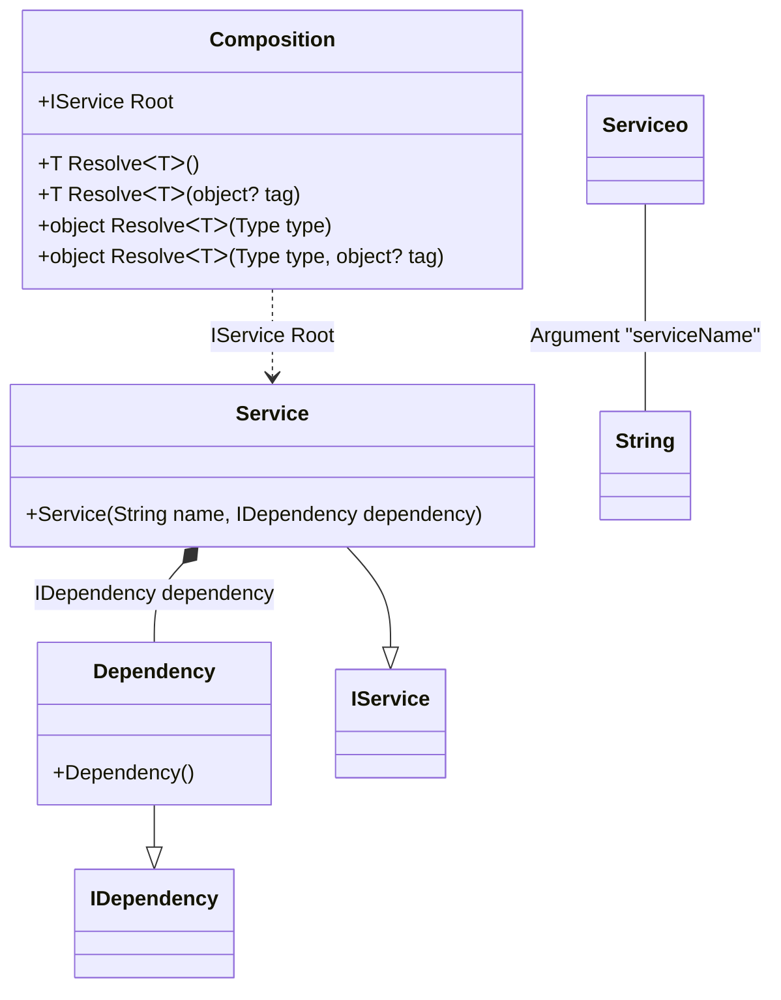
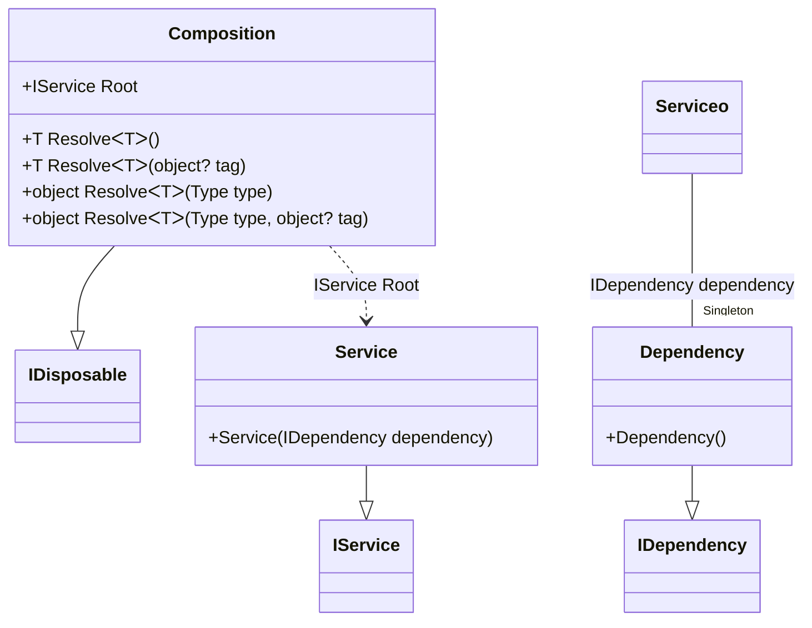
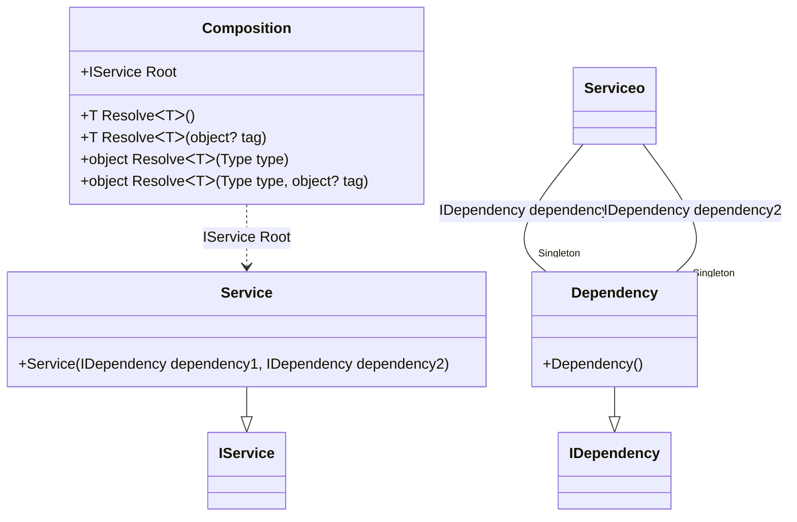

#### Composition root

[](../tests/Pure.DI.UsageTests/Basics/CompositionRootScenario.cs)

This example demonstrates the most efficient way to obtain a composition root. The number of roots are not limited.

```c#
internal interface IDependency { }

internal class Dependency : IDependency { }

internal interface IService { }

internal class Service : IService
{
    public Service(IDependency dependency)
    {
    }
}

internal class OtherService : IService
{
}

DI.Setup("Composition")
    .Bind<IDependency>().To<Dependency>()
    .Bind<IService>("Other").To<OtherService>()
    .Bind<IService>().To<Service>()
    // The only argument is the name of the root property
    .Root<IService>("Root")
    // The first argument is the name of the root property, and the second argument is the tag
    .Root<IService>("OtherRoot", "Other");

var composition = new Composition();
var service = composition.Root;
var otherService = composition.OtherRoot;
```

<details open>
<summary>Class Diagram</summary>


</details>


Actually, the property _Root_ looks like:
```c#
public IService Root
{
  get
  {
    return new Service(new Dependency());
  }
}
```
To avoid generating _Resolve_ methods just add a comment `// Resolve = Off` before a _Setup_ method:
```c#
// Resolve = Off
DI.Setup("Composition")
  .Bind<IDependency>().To<Dependency>()
  ...
```
This can be done if these methods are not needed, in case only certain composition roots are used. It's not significant then, but it will help save resources during compilation.

#### Resolve methods

[](../tests/Pure.DI.UsageTests/Basics/ResolveScenario.cs)

This example shows how to resolve the composition roots using the _Resolve_ methods.

```c#
internal interface IDependency { }

internal class Dependency : IDependency { }

internal interface IService { }

internal class Service : IService
{
    public Service(IDependency dependency)
    {
    }
}

internal class OtherService : IService
{
}

DI.Setup("Composition")
    .Bind<IDependency>().To<Dependency>()
    .Bind<IService>().To<Service>()
    .Bind<IService>("Other").To<OtherService>();

var composition = new Composition();
var service1 = composition.Resolve<IService>();
var service2 = composition.Resolve(typeof(IService));
        
// Resolve by tag
var otherService1 = composition.Resolve<IService>("Other");
var otherService2 = composition.Resolve(typeof(IService),"Other");
```

<details open>
<summary>Class Diagram</summary>


</details>


#### Factory

[](../tests/Pure.DI.UsageTests/Basics/FactoryScenario.cs)

This example demonstrates how to create and initialize an instance manually.

```c#
internal interface IDependency
{
    DateTimeOffset Time { get; }

    bool IsInitialized { get; }
}

internal class Dependency : IDependency
{
    public Dependency(DateTimeOffset time)
    {
        Time = time;
    }

    public DateTimeOffset Time { get; }

    public bool IsInitialized { get; private set; }

    public void Initialize()
    {
        IsInitialized = true;
    }
}

internal interface IService
{
    IDependency Dependency { get; }
}

internal class Service : IService
{
    public Service(IDependency dependency)
    {
        Dependency = dependency;
    }

    public IDependency Dependency { get; }
}

DI.Setup("Composition")
    .Bind<IDependency>().To(_ =>
    {
        var dependency = new Dependency(DateTimeOffset.Now);
        dependency.Initialize();
        return dependency;
    })
    .Bind<IService>().To<Service>()
    .Root<IService>("Root");

var composition = new Composition();
var service = composition.Root;
service.Dependency.IsInitialized.ShouldBeTrue();
```

<details open>
<summary>Class Diagram</summary>


</details>


#### Injection

[](../tests/Pure.DI.UsageTests/Basics/InjectScenario.cs)

This example shows how to create and initialize an instance manually injecting required dependencies.

```c#
internal interface IDependency { }

internal class Dependency : IDependency
{
}

internal interface IService
{
    IDependency Dependency { get; }
}

internal class Service : IService
{
    public Service(IDependency dependency)
    {
        Dependency = dependency;
    }

    public IDependency Dependency { get; }
}

DI.Setup("Composition")
    .Bind<IDependency>().To<Dependency>()
    .Bind<IService>().To(ctx =>
    {
        ctx.Inject<IDependency>(out var dependency);
        return new Service(dependency);
    })
    .Root<IService>("Root");

var composition = new Composition();
var service = composition.Root;
```

<details open>
<summary>Class Diagram</summary>


</details>


#### Generics

[](../tests/Pure.DI.UsageTests/Basics/GenericsScenario.cs)

Generic types are also supported, this is easy to do by binding generic types and specifying generic markers like `TT`, `TT1` etc. as generic type parameters:

```c#
internal interface IDependency<T> { }

internal class Dependency<T> : IDependency<T> { }

internal interface IService
{
    IDependency<int> IntDependency { get; }

    IDependency<string> StringDependency { get; }
}

internal class Service : IService
{
    public Service(IDependency<int> intDependency, IDependency<string> stringDependency)
    {
        IntDependency = intDependency;
        StringDependency = stringDependency;
    }

    public IDependency<int> IntDependency { get; }

    public IDependency<string> StringDependency { get; }
}

DI.Setup("Composition")
    .Bind<IDependency<TT>>().To<Dependency<TT>>()
    .Bind<IService>().To<Service>()
    .Root<IService>("Root");

var composition = new Composition();
var service = composition.Root;
service.IntDependency.ShouldBeOfType<Dependency<int>>();
service.StringDependency.ShouldBeOfType<Dependency<string>>();
```

<details open>
<summary>Class Diagram</summary>


</details>


Actually, the property _Root_ looks like:
```c#
public IService Root
{
  get
  {
    return new Service(new Dependency<int>(), new Dependency<string>());
  }
}
```

#### Arguments

[](../tests/Pure.DI.UsageTests/Basics/ArgumentsScenario.cs)

```c#
internal interface IDependency { }

internal class Dependency : IDependency { }

internal interface IService
{
    string Name { get; }
}

internal class Service : IService
{
    public Service(string name, IDependency dependency)
    {
        Name = name;
    }

    public string Name { get; }
}

DI.Setup("Composition")
    .Bind<IDependency>().To<Dependency>()
    .Bind<IService>().To<Service>()
    .Arg<string>("serviceName")
    .Root<IService>("Root");

var composition = new Composition("Abc");
var service = composition.Root;
service.Name.ShouldBe("Abc");
```

<details open>
<summary>Class Diagram</summary>



</details>


#### Tags

[](../tests/Pure.DI.UsageTests/Basics/TagsScenario.cs)

This example demonstrates the most efficient way to get the root object of a composition without impacting memory consumption or performance.

```c#
internal interface IDependency { }

internal class AbcDependency : IDependency { }

internal class XyzDependency : IDependency { }

internal class Dependency : IDependency { }

internal interface IService
{
    IDependency Dependency1 { get; }

    IDependency Dependency2 { get; }
}

internal class Service : IService
{
    public Service(
        [Tag("Abc")] IDependency dependency1,
        [Tag("Xyz")] IDependency dependency2)
    {
        Dependency1 = dependency1;
        Dependency2 = dependency2;
    }

    public IDependency Dependency1 { get; }

    public IDependency Dependency2 { get; }
}

DI.Setup("Composition")
    .Bind<IDependency>("Abc").To<AbcDependency>()
    .Bind<IDependency>("Xyz").To<XyzDependency>()
    .Bind<IService>().To<Service>()
    .Root<IService>("Root");

var composition = new Composition();
var service = composition.Root;
service.Dependency1.ShouldBeOfType<AbcDependency>();
service.Dependency2.ShouldBeOfType<XyzDependency>();
```

<details open>
<summary>Class Diagram</summary>


</details>


Sometimes it's important to take control of building a dependency graph. In this case, _tags_ help:

#### Auto-bindings

[](../tests/Pure.DI.UsageTests/Basics/AutoBindingScenario.cs)

This approach works great even if DI doesn't have the appropriate bindings. :warning: But it can't be recommended if you follow the dependency inversion principle and want to make sure your types only depend on abstractions.

```c#
internal class Dependency
{
}

internal class Service
{
    public Service(Dependency dependency)
    {
    }
}

DI.Setup("Composition")
    .Root<Service>("Root");

var composition = new Composition();
var service1 = composition.Root;
var service2 = composition.Resolve<Service>();
var service3 = composition.Resolve(typeof(Service));
```

<details open>
<summary>Class Diagram</summary>


</details>


#### Child composition

[](../tests/Pure.DI.UsageTests/Basics/ChildCompositionScenario.cs)

```c#
internal interface IDependency
{
    bool IsDisposed { get; }
}

internal class Dependency : IDependency, IDisposable
{
    public bool IsDisposed { get; private set; }

    public void Dispose()
    {
        IsDisposed = true;
    }
}

internal interface IService
{
    IDependency Dependency { get; }
}

internal class Service : IService
{
    public Service(IDependency dependency)
    {
        Dependency = dependency;
    }

    public IDependency Dependency { get; }
}

DI.Setup("Composition")
    .Bind<IDependency>().As(Lifetime.Singleton).To<Dependency>()
    .Bind<IService>().To<Service>()
    .Root<IService>("Root");

var composition = new Composition();
IService serviceFromChild;
using (var childComposition = new Composition(composition))
{
    serviceFromChild = childComposition.Root;
}
        
serviceFromChild.Dependency.IsDisposed.ShouldBeTrue();
        
var service = composition.Root;
using (var childComposition = new Composition(composition))
{
    childComposition.Root.Dependency.ShouldBe(service.Dependency);
}
```

<details open>
<summary>Class Diagram</summary>



</details>


#### Multi-contract bindings

[](../tests/Pure.DI.UsageTests/Basics/MultiContractBindingsScenario.cs)

```c#
internal interface IDependency { }

internal interface IAdvancedDependency { }

internal class Dependency : IDependency, IAdvancedDependency { }

internal interface IService { }

internal class Service : IService
{
    public Service(
        IDependency dependency,
        IAdvancedDependency advancedDependency)
    {
    }
}

DI.Setup("Composition")
    .Bind<IDependency>().Bind<IAdvancedDependency>().To<Dependency>()
    .Bind<IService>().To<Service>()
    .Root<IService>("Root");

var composition = new Composition();
var service = composition.Root;
```

<details open>
<summary>Class Diagram</summary>


</details>


#### Field Injection

[](../tests/Pure.DI.UsageTests/Basics/FieldInjectionScenario.cs)

To use dependency injection for a field, make sure the field is writable and simply add the _Ordinal_ attribute to that field, specifying an ordinal that will be used to determine the injection order:

```c#
internal interface IDependency { }

internal class Dependency : IDependency { }

internal interface IService
{
    IDependency? Dependency { get; }
}

internal class Service : IService
{
    [Ordinal(0)]
    internal IDependency? DependencyVal;

    public IDependency? Dependency => DependencyVal;
}

DI.Setup("Composition")
    .Bind<IDependency>().To<Dependency>()
    .Bind<IService>().To<Service>()
    .Root<IService>("Root");

var composition = new Composition();
var service = composition.Root;
service.Dependency.ShouldBeOfType<Dependency>();
```

<details open>
<summary>Class Diagram</summary>


</details>


#### Property Injection

[](../tests/Pure.DI.UsageTests/Basics/PropertyInjectionScenario.cs)

To use dependency injection on a property, make sure the property is writable and simply add the _Ordinal_ attribute to that property, specifying the ordinal that will be used to determine the injection order:

```c#
internal interface IDependency { }

internal class Dependency : IDependency { }

internal interface IService
{
    IDependency? Dependency { get; }
}

internal class Service : IService
{
    [Ordinal(0)]
    public IDependency? Dependency { get; set; }
}

DI.Setup("Composition")
    .Bind<IDependency>().To<Dependency>()
    .Bind<IService>().To<Service>()
    .Root<IService>("Root");

var composition = new Composition();
var service = composition.Root;
service.Dependency.ShouldBeOfType<Dependency>();
```

<details open>
<summary>Class Diagram</summary>


</details>


#### Complex Generics

[](../tests/Pure.DI.UsageTests/Basics/ComplexGenericsScenario.cs)

Defining generic type arguments using particular marker types like ```TT``` in this sample is a distinguishing and outstanding feature. This allows binding complex generic types with nested generic types and with any type constraints. For instance ```IService<T1, T2, TList, TDictionary> where T2: struct where TList: IList<T1> where TDictionary: IDictionary<T1, T2> { }``` and its binding to the some implementation ```.Bind<IService<TT1, TTS2, TTList<TT1>, TTDictionary<TT1, TTS2>>>().To<Service<TT1, TTS2, TTList<TT1>, TTDictionary<TT1, TTS2>>>()``` with all checks and code-generation at the compile time. It is clear that this example is exaggerated, it just demonstrates the ease of working with marker types like ```TT, TTEnumerable, TTSet``` and etc. for binding complex generic types.

```c#
internal interface IDependency<T> { }

internal class Dependency<T> : IDependency<T> { }

internal readonly record struct DependencyStruct<T> : IDependency<T>
    where T: struct;

internal interface IService<T1, T2, TList, TDictionary>
    where T2: struct
    where TList: IList<T1>
    where TDictionary: IDictionary<T1, T2>
{
    IDependency<T1> Dependency1 { get; }

    IDependency<T2> Dependency2 { get; }
}

internal class Service<T1, T2, TList, TDictionary> : IService<T1, T2, TList, TDictionary>
    where T2: struct
    where TList: IList<T1>
    where TDictionary: IDictionary<T1, T2>
{
    public Service(
        IDependency<T1> dependency1,
        [Tag("value type")] IDependency<T2> dependency2)
    {
        Dependency1 = dependency1;
        Dependency2 = dependency2;
    }

    public IDependency<T1> Dependency1 { get; }

    public IDependency<T2> Dependency2 { get; }
}

internal class Program<T> where T : notnull
{
    public IService<T, int, List<T>, Dictionary<T, int>> Service { get; }

    public Program(IService<T, int, List<T>, Dictionary<T, int>> service)
    {
        Service = service;
    }
}

DI.Setup("Composition")
    .Bind<IDependency<TT>>().To<Dependency<TT>>()
    .Bind<IDependency<TTS>>("value type").To<DependencyStruct<TTS>>()
    .Bind<IService<TT1, TTS2, TTList<TT1>, TTDictionary<TT1, TTS2>>>()
        .To<Service<TT1, TTS2, TTList<TT1>, TTDictionary<TT1, TTS2>>>()
    .Root<Program<string>>("Root");

var composition = new Composition();
var program = composition.Root;
var service = program.Service;
service.ShouldBeOfType<Service<string, int, List<string>, Dictionary<string, int>>>();
service.Dependency1.ShouldBeOfType<Dependency<string>>();
service.Dependency2.ShouldBeOfType<DependencyStruct<int>>();
```

<details open>
<summary>Class Diagram</summary>


</details>


#### Singleton

[](../tests/Pure.DI.UsageTests/Lifetimes/SingletonScenario.cs)

```c#
internal interface IDependency { }

internal class Dependency : IDependency { }

internal interface IService
{
    public IDependency Dependency1 { get; }

    public IDependency Dependency2 { get; }
}

internal class Service : IService
{
    public Service(IDependency dependency1, IDependency dependency2)
    {
        Dependency1 = dependency1;
        Dependency2 = dependency2;
    }

    public IDependency Dependency1 { get; }

    public IDependency Dependency2 { get; }
}

DI.Setup("Composition")
    .Bind<IDependency>().As(Lifetime.Singleton).To<Dependency>()
    .Bind<IService>().To<Service>()
    .Root<IService>("Root");

var composition = new Composition();
var service1 = composition.Root;
var service2 = composition.Root;
service1.Dependency1.ShouldBe(service1.Dependency2);
service2.Dependency1.ShouldBe(service1.Dependency1);
```

<details open>
<summary>Class Diagram</summary>



</details>


#### PerResolve

[](../tests/Pure.DI.UsageTests/Lifetimes/PerResolveScenario.cs)

```c#
internal interface IDependency { }

internal class Dependency : IDependency { }

internal interface IService
{
    public IDependency Dependency1 { get; }

    public IDependency Dependency2 { get; }
}

internal class Service : IService
{
    public Service(IDependency dependency1, IDependency dependency2)
    {
        Dependency1 = dependency1;
        Dependency2 = dependency2;
    }

    public IDependency Dependency1 { get; }

    public IDependency Dependency2 { get; }
}

DI.Setup("Composition")
    .Bind<IDependency>().As(Lifetime.PerResolve).To<Dependency>()
    .Bind<IService>().To<Service>()
    .Root<IService>("Root");

var composition = new Composition();
var service1 = composition.Root;
var service2 = composition.Root;
service1.Dependency1.ShouldBe(service1.Dependency2);
service2.Dependency1.ShouldNotBe(service1.Dependency1);
```

<details open>
<summary>Class Diagram</summary>


</details>


#### Transient

[](../tests/Pure.DI.UsageTests/Lifetimes/TransientScenario.cs)

```c#
internal interface IDependency { }

internal class Dependency : IDependency { }

internal interface IService
{
    public IDependency Dependency1 { get; }

    public IDependency Dependency2 { get; }
}

internal class Service : IService
{
    public Service(IDependency dependency1, IDependency dependency2)
    {
        Dependency1 = dependency1;
        Dependency2 = dependency2;
    }

    public IDependency Dependency1 { get; }

    public IDependency Dependency2 { get; }
}

DI.Setup("Composition")
    .Bind<IDependency>().As(Lifetime.Transient).To<Dependency>()
    .Bind<IService>().To<Service>()
    .Root<IService>("Root");

var composition = new Composition();
var service1 = composition.Root;
var service2 = composition.Root;
service1.Dependency1.ShouldNotBe(service1.Dependency2);
service2.Dependency1.ShouldNotBe(service1.Dependency1);
```

<details open>
<summary>Class Diagram</summary>


</details>


#### Disposable Singleton

[](../tests/Pure.DI.UsageTests/Lifetimes/DisposableSingletonScenario.cs)

To dispose all created singleton instances, simply dispose the composition instance:

```c#
internal interface IDependency
{
    bool IsDisposed { get; }
}

internal class Dependency : IDependency, IDisposable
{
    public bool IsDisposed { get; private set; }

    public void Dispose()
    {
        IsDisposed = true;
    }
}

internal interface IService
{
    public IDependency Dependency { get; }
}

internal class Service : IService
{
    public Service(IDependency dependency)
    {
        Dependency = dependency;
    }

    public IDependency Dependency { get; }
}

DI.Setup("Composition")
    .Bind<IDependency>().As(Lifetime.Singleton).To<Dependency>()
    .Bind<IService>().To<Service>()
    .Root<IService>("Root");

IDependency dependency;
using (var composition = new Composition())
{
    var service = composition.Root;
    dependency = service.Dependency;
}

dependency.IsDisposed.ShouldBeTrue();
```

<details open>
<summary>Class Diagram</summary>


</details>


#### Default lifetime

[](../tests/Pure.DI.UsageTests/Lifetimes/DefaultLifetimeScenario.cs)

```c#
internal interface IDependency { }

internal class Dependency : IDependency { }

internal interface IService
{
    public IDependency Dependency1 { get; }

    public IDependency Dependency2 { get; }
}

internal class Service : IService
{
    public Service(IDependency dependency1, IDependency dependency2)
    {
        Dependency1 = dependency1;
        Dependency2 = dependency2;
    }

    public IDependency Dependency1 { get; }

    public IDependency Dependency2 { get; }
}

DI.Setup("Composition")
    .DefaultLifetime(Lifetime.Singleton)
    .Bind<IDependency>().To<Dependency>()
    .Bind<IService>().To<Service>()
    .Root<IService>("Root");

var composition = new Composition();
var service1 = composition.Root;
var service2 = composition.Root;
service1.ShouldBe(service2);
service1.Dependency1.ShouldBe(service1.Dependency2);
```

<details open>
<summary>Class Diagram</summary>


</details>


#### Func

[](../tests/Pure.DI.UsageTests/BaseClassLibrary/FuncScenario.cs)

_Func<T>_ helps when logic needs to inject instances of some type on demand and multiple times.

```c#
internal interface IDependency { }

internal class Dependency : IDependency { }

internal interface IService
{
    ImmutableArray<IDependency> Dependencies { get; }
}

internal class Service : IService
{
    public Service(Func<IDependency> dependencyFactory)
    {
        Dependencies = Enumerable
            .Range(0, 10)
            .Select(_ => dependencyFactory())
            .ToImmutableArray();
    }

    public ImmutableArray<IDependency> Dependencies { get; }
}

DI.Setup("Composition")
    .Bind<IDependency>().To<Dependency>()
    .Bind<IService>().To<Service>()
    .Root<IService>("Root");

var composition = new Composition();
var service = composition.Root;
service.Dependencies.Length.ShouldBe(10);
```

<details open>
<summary>Class Diagram</summary>


</details>


#### IEnumerable

[](../tests/Pure.DI.UsageTests/BaseClassLibrary/EnumerableScenario.cs)

Specifying `IEnumerable<T>` as the injection type allows instances of all bindings that implement type `T` to be injected in a lazy manner - the instances will be provided one by one.

```c#
internal interface IDependency { }

internal class AbcDependency : IDependency { }

internal class XyzDependency : IDependency { }

internal interface IService
{
    ImmutableArray<IDependency> Dependencies { get; }
}

internal class Service : IService
{
    public Service(IEnumerable<IDependency> dependencies)
    {
        Dependencies = dependencies.ToImmutableArray();
    }

    public ImmutableArray<IDependency> Dependencies { get; }
}

DI.Setup("Composition")
    .Bind<IDependency>().To<AbcDependency>()
    .Bind<IDependency>(2).To<XyzDependency>()
    .Bind<IService>().To<Service>()
    .Root<IService>("Root");

var composition = new Composition();
var service = composition.Root;
service.Dependencies.Length.ShouldBe(2);
service.Dependencies[0].ShouldBeOfType<AbcDependency>();
service.Dependencies[1].ShouldBeOfType<XyzDependency>();
```

<details open>
<summary>Class Diagram</summary>


</details>


#### Array

[](../tests/Pure.DI.UsageTests/BaseClassLibrary/ArrayScenario.cs)

Specifying `T[]` as the injection type allows instances from all bindings that implement the `T` type to be injected.

```c#
internal interface IDependency { }

internal class AbcDependency : IDependency { }

internal class XyzDependency : IDependency { }

internal interface IService
{
    IDependency[] Dependencies { get; }
}

internal class Service : IService
{
    public Service(IDependency[] dependencies)
    {
        Dependencies = dependencies;
    }

    public IDependency[] Dependencies { get; }
}

DI.Setup("Composition")
    .Bind<IDependency>().To<AbcDependency>()
    .Bind<IDependency>(2).To<XyzDependency>()
    .Bind<IService>().To<Service>()
    .Root<IService>("Root");

var composition = new Composition();
var service = composition.Root;
service.Dependencies.Length.ShouldBe(2);
service.Dependencies[0].ShouldBeOfType<AbcDependency>();
service.Dependencies[1].ShouldBeOfType<XyzDependency>();
```

<details open>
<summary>Class Diagram</summary>

```mermaid
classDiagram
class Composition {
+IService Root
+T ResolveᐸTᐳ()
+T ResolveᐸTᐳ(object? tag)
+object ResolveᐸTᐳ(Type type)
+object ResolveᐸTᐳ(Type type, object? tag)
}
AbcDependency --|> IDependency : 
class AbcDependency {
+AbcDependency()
}
XyzDependency --|> IDependency : 2 
class XyzDependency {
+XyzDependency()
}
Service --|> IService : 
class Service {
+Service(ArrayᐸIDependencyᐳ dependencies)
}
class ArrayᐸIDependencyᐳ
Composition ..> Service : IService Root
Service*--ArrayᐸIDependencyᐳ : ArrayᐸIDependencyᐳ dependencies
ArrayᐸIDependencyᐳ*--AbcDependency : 
ArrayᐸIDependencyᐳ*--XyzDependency : 2  
```

</details>


In addition to arrays, other collection types are also supported, such as:
- System.Memory<T>
- System.ReadOnlyMemory<T>
- System.Span<T>
- System.ReadOnlySpan<T>
- System.Collections.Generic.ICollection<T>
- System.Collections.Generic.IList<T>
- System.Collections.Generic.List<T>
- System.Collections.Generic.IReadOnlyCollection<T>
- System.Collections.Generic.IReadOnlyList<T>
- System.Collections.Generic.ISet<T>
- System.Collections.Generic.HashSet<T>
- System.Collections.Generic.SortedSet<T>
- System.Collections.Generic.Queue<T>
- System.Collections.Generic.Stack<T>
- System.Collections.Immutable.ImmutableArray<T>
- System.Collections.Immutable.IImmutableList<T>
- System.Collections.Immutable.ImmutableList<T>
- System.Collections.Immutable.IImmutableSet<T>
- System.Collections.Immutable.ImmutableHashSet<T>
- System.Collections.Immutable.ImmutableSortedSet<T>
- System.Collections.Immutable.IImmutableQueue<T>
- System.Collections.Immutable.ImmutableQueue<T>
- System.Collections.Immutable.IImmutableStack<T>

#### Lazy

[](../tests/Pure.DI.UsageTests/BaseClassLibrary/LazyScenario.cs)

```c#
internal interface IDependency { }

internal class Dependency : IDependency { }

internal interface IService
{
    IDependency Dependency { get; }
}

internal class Service : IService
{
    private readonly Lazy<IDependency> _dependency;

    public Service(Lazy<IDependency> dependency)
    {
        _dependency = dependency;
    }

    public IDependency Dependency => _dependency.Value;
}

DI.Setup("Composition")
    .Bind<IDependency>().To<Dependency>()
    .Bind<IService>().To<Service>()
    .Root<IService>("Root");

var composition = new Composition();
var service = composition.Root;
service.Dependency.ShouldBe(service.Dependency);
```

<details open>
<summary>Class Diagram</summary>

```mermaid
classDiagram
class Composition {
+IService Root
+T ResolveᐸTᐳ()
+T ResolveᐸTᐳ(object? tag)
+object ResolveᐸTᐳ(Type type)
+object ResolveᐸTᐳ(Type type, object? tag)
}
Dependency --|> IDependency : 
class Dependency {
+Dependency()
}
Service --|> IService : 
class Service {
+Service(LazyᐸIDependencyᐳ dependency)
}
class LazyᐸIDependencyᐳ
class FuncᐸIDependencyᐳ
Composition ..> Service : IService Root
Service*--LazyᐸIDependencyᐳ : LazyᐸIDependencyᐳ dependency
LazyᐸIDependencyᐳ*--FuncᐸIDependencyᐳ : FuncᐸIDependencyᐳ
FuncᐸIDependencyᐳ*--Dependency : IDependency
```

</details>


#### Span and ReadOnlySpan

[](../tests/Pure.DI.UsageTests/BaseClassLibrary/SpanScenario.cs)

Specifying `Span<T>` and `ReadOnlySpan<T>` work the same as with the array `T[]`.

```c#
internal class Dependency
{
}

internal interface IService
{
    int Count { get; }
}

internal class Service : IService
{
    public Service(ReadOnlySpan<Dependency> dependencies)
    {
        Count = dependencies.Length;
    }

    public int Count { get; }
}

DI.Setup("Composition")
    .Bind<Dependency>('a').To<Dependency>()
    .Bind<Dependency>('b').To<Dependency>()
    .Bind<Dependency>('c').To<Dependency>()
    .Bind<IService>().To<Service>()
    .Root<IService>("Root");

var composition = new Composition();
var service = composition.Root;
service.Count.ShouldBe(3);
```

<details open>
<summary>Class Diagram</summary>

```mermaid
classDiagram
class Composition {
+IService Root
+T ResolveᐸTᐳ()
+T ResolveᐸTᐳ(object? tag)
+object ResolveᐸTᐳ(Type type)
+object ResolveᐸTᐳ(Type type, object? tag)
}
class Dependency {
+Dependency()
}
Service --|> IService : 
class Service {
+Service(ReadOnlySpanᐸDependencyᐳ dependencies)
}
class ReadOnlySpanᐸDependencyᐳ
Composition ..> Service : IService Root
Service*--ReadOnlySpanᐸDependencyᐳ : ReadOnlySpanᐸDependencyᐳ dependencies
ReadOnlySpanᐸDependencyᐳ*--Dependency : 'a'  
ReadOnlySpanᐸDependencyᐳ*--Dependency : 'b'  
ReadOnlySpanᐸDependencyᐳ*--Dependency : 'c'  
```

</details>


This scenario is even more efficient when the `Span[]` or `ReadOnlySpan[]` element has a value type. In this case, there are no heap allocations, and the composition root `IService` looks like this:
```c#
public IService Root
{
  get
  {
    ReadOnlySpan<Dependency> dependencies = stackalloc Dependency[3] { new Dependency(), new Dependency(), new Dependency() };
    return new Service(dependencies);
  }
}
```

#### Tuple

[](../tests/Pure.DI.UsageTests/BaseClassLibrary/TupleScenario.cs)

```c#
internal interface IDependency { }

internal class Dependency : IDependency { }

internal readonly record struct Point(int X, int Y);

internal interface IService
{
    IDependency Dependency { get; }
}

internal class Service : IService
{
    public Service((Point Point, IDependency Dependency) tuple)
    {
        Dependency = tuple.Dependency;
    }

    public IDependency Dependency { get; }
}

DI.Setup("Composition")
    .Bind<IDependency>().To<Dependency>()
    .Bind<Point>().To(_ => new Point(7, 9))
    .Bind<IService>().To<Service>()
    .Root<IService>("Root");

var composition = new Composition();
var root = composition.Root;
```

<details open>
<summary>Class Diagram</summary>

```mermaid
classDiagram
class Composition {
+IService Root
+T ResolveᐸTᐳ()
+T ResolveᐸTᐳ(object? tag)
+object ResolveᐸTᐳ(Type type)
+object ResolveᐸTᐳ(Type type, object? tag)
}
Dependency --|> IDependency : 
class Dependency {
+Dependency()
}
class Point
Service --|> IService : 
class Service {
+Service(ValueTupleᐸPointˏIDependencyᐳ tuple)
}
class ValueTupleᐸPointˏIDependencyᐳ {
+ValueTuple(Point item1, IDependency item2)
}
Composition ..> Service : IService Root
Service*--ValueTupleᐸPointˏIDependencyᐳ : ValueTupleᐸPointˏIDependencyᐳ tuple
ValueTupleᐸPointˏIDependencyᐳ*--Point : Point item1
ValueTupleᐸPointˏIDependencyᐳ*--Dependency : IDependency item2
```

</details>


#### Decorator

[](../tests/Pure.DI.UsageTests/Interception/DecoratorScenario.cs)

```c#
internal interface IDependency { }

internal class Dependency : IDependency { }

internal interface IService
{
    string GetMessage();
}

internal class Service : IService
{
    public Service(IDependency dependency)
    {
    }

    public string GetMessage() => "Hello World";
}

internal class DecoratorService : IService
{
    private readonly IService _baseService;

    public DecoratorService([Tag("base")] IService baseService) => _baseService = baseService;

    public string GetMessage() => $"{_baseService.GetMessage()} !!!";
}


DI.Setup("Composition")
    .Bind<IDependency>().To<Dependency>()
    .Bind<IService>("base").To<Service>()
    .Bind<IService>().To<DecoratorService>()
    .Root<IService>("Root");

var composition = new Composition();
var service = composition.Root;
service.GetMessage().ShouldBe("Hello World !!!");
```

<details open>
<summary>Class Diagram</summary>

```mermaid
classDiagram
class Composition {
+IService Root
+T ResolveᐸTᐳ()
+T ResolveᐸTᐳ(object? tag)
+object ResolveᐸTᐳ(Type type)
+object ResolveᐸTᐳ(Type type, object? tag)
}
Dependency --|> IDependency : 
class Dependency {
+Dependency()
}
Service --|> IService : "base" 
class Service {
+Service(IDependency dependency)
}
DecoratorService --|> IService : 
class DecoratorService {
+DecoratorService(IService baseService)
}
Composition ..> DecoratorService : IService Root
Service*--Dependency : IDependency dependency
DecoratorService*--Service : "base"  IService baseService
```

</details>


#### Interception

[](../tests/Pure.DI.UsageTests/Interception/InterceptionScenario.cs)

```c#
public interface IDependency
{
    void DependencyCall();
}

public class Dependency : IDependency
{
    public void DependencyCall()
    {
    }
}

public interface IService
{
    IDependency Dependency { get; }

    void ServiceCall();
}

public class Service : IService
{
    public Service(IDependency dependency)
    {
        Dependency = dependency;
    }

    public IDependency Dependency { get; }

    public void ServiceCall()
    {
    }
}

internal partial class Composition: IInterceptor
{
    private readonly List<string> _log;
    private static readonly ProxyGenerator ProxyGenerator = new();

    public Composition(List<string> log)
        : this()
    {
        _log = log;
    }

    private partial T OnDependencyInjection<T>(in T value, object? tag, Lifetime lifetime)
    {
        if (typeof(T).IsValueType)
        {
            return value;
        }

        return (T)ProxyGenerator.CreateInterfaceProxyWithTargetInterface(
            typeof(T),
            value,
            this);
    }

    public void Intercept(IInvocation invocation)
    {
        _log.Add(invocation.Method.Name);
        invocation.Proceed();
    }
}

// OnDependencyInjection = On
DI.Setup("Composition")
    .Bind<IDependency>().To<Dependency>()
    .Bind<IService>().Tags().To<Service>()
    .Root<IService>("Root");

var log = new List<string>();
var composition = new Composition(log);
var service = composition.Root;
service.ServiceCall();
service.Dependency.DependencyCall();

log.ShouldBe(
    ImmutableArray.Create(
        "ServiceCall",
        "get_Dependency",
        "DependencyCall"));
```

<details open>
<summary>Class Diagram</summary>

```mermaid
classDiagram
class Composition {
+IService Root
+T ResolveᐸTᐳ()
+T ResolveᐸTᐳ(object? tag)
+object ResolveᐸTᐳ(Type type)
+object ResolveᐸTᐳ(Type type, object? tag)
}
Dependency --|> IDependency : 
class Dependency {
+Dependency()
}
Service --|> IService : 
class Service {
+Service(IDependency dependency)
}
Composition ..> Service : IService Root
Service*--Dependency : IDependency dependency
```

</details>


#### Advanced interception

[](../tests/Pure.DI.UsageTests/Interception/AdvancedInterceptionScenario.cs)

```c#
public interface IDependency
{
    void DependencyCall();
}

public class Dependency : IDependency
{
    public void DependencyCall()
    {
    }
}

public interface IService
{
    IDependency Dependency { get; }

    void ServiceCall();
}

public class Service : IService
{
    public Service(IDependency dependency)
    {
        Dependency = dependency;
    }

    public IDependency Dependency { get; }

    public void ServiceCall()
    {
    }
}

internal partial class Composition: IInterceptor
{
    private readonly List<string> _log;
    private static readonly IProxyBuilder ProxyBuilder = new DefaultProxyBuilder();
    private readonly IInterceptor[] _interceptors;

    public Composition(List<string> log)
        : this()
    {
        _log = log;
        _interceptors = new IInterceptor[]{ this };
    }

    private partial T OnDependencyInjection<T>(in T value, object? tag, Lifetime lifetime)
    {
        if (typeof(T).IsValueType)
        {
            return value;
        }

        return ProxyFactory<T>.GetFactory(ProxyBuilder)(value, _interceptors);
    }

    public void Intercept(IInvocation invocation)
    {
        _log.Add(invocation.Method.Name);
        invocation.Proceed();
    }

    private static class ProxyFactory<T>
    {
        private static Func<T, IInterceptor[], T>? _factory;

        public static Func<T, IInterceptor[], T> GetFactory(IProxyBuilder proxyBuilder) =>
            _factory ?? CreateFactory(proxyBuilder);

        private static Func<T, IInterceptor[], T> CreateFactory(IProxyBuilder proxyBuilder)
        {
            // Compiles a delegate to create a proxy for the performance boost
            var proxyType = proxyBuilder.CreateInterfaceProxyTypeWithTargetInterface(typeof(T), Type.EmptyTypes, ProxyGenerationOptions.Default);
            var ctor = proxyType.GetConstructors().Single(i => i.GetParameters().Length == 2);
            var instance = Expression.Parameter(typeof(T));
            var interceptors = Expression.Parameter(typeof(IInterceptor[]));
            var newProxyExpression = Expression.New(ctor, interceptors, instance);
            return _factory = Expression.Lambda<Func<T, IInterceptor[], T>>(newProxyExpression, instance, interceptors).Compile();
        }
    }
}

// OnDependencyInjection = On
DI.Setup("Composition")
    .Bind<IDependency>().To<Dependency>()
    .Bind<IService>().Tags().To<Service>()
    .Root<IService>("Root");

var log = new List<string>();
var composition = new Composition(log);
var service = composition.Root;
service.ServiceCall();
service.Dependency.DependencyCall();

log.ShouldBe(
    ImmutableArray.Create(
        "ServiceCall",
        "get_Dependency",
        "DependencyCall"));
```

<details open>
<summary>Class Diagram</summary>

```mermaid
classDiagram
class Composition {
+IService Root
+T ResolveᐸTᐳ()
+T ResolveᐸTᐳ(object? tag)
+object ResolveᐸTᐳ(Type type)
+object ResolveᐸTᐳ(Type type, object? tag)
}
Dependency --|> IDependency : 
class Dependency {
+Dependency()
}
Service --|> IService : 
class Service {
+Service(IDependency dependency)
}
Composition ..> Service : IService Root
Service*--Dependency : IDependency dependency
```

</details>


#### Resolve Hint

[](../tests/Pure.DI.UsageTests/Hints/ResolveHintScenario.cs)

The _Resolve_ hint determines whether to generate _Resolve_ methods. By default a set of four _Resolve_ methods are generated. Set this hint to _Off_ to disable the generation of resolve methods. This will reduce class composition generation time and no private composition roots will be generated in this case. When the _Resolve_ hint is disabled, only the public root properties are available, so be sure to define them explicitly with the `Root<T>(...)` method.

```c#
internal interface IDependency { }

internal class Dependency : IDependency { }

internal interface IService { }

internal class Service : IService
{
    public Service(IDependency dependency)
    {
    }
}

// Resolve = Off
DI.Setup("Composition")
    .Bind<IDependency>().To<Dependency>()
    .Bind<IService>().To<Service>()
    .Root<IService>("Root")
    .Root<IDependency>("DependencyRoot");

var composition = new Composition();
var service = composition.Root;
var dependencyRoot = composition.DependencyRoot;
```

<details open>
<summary>Class Diagram</summary>

```mermaid
classDiagram
class Composition {
+IDependency DependencyRoot
+IService Root
}
Dependency --|> IDependency : 
class Dependency {
+Dependency()
}
Service --|> IService : 
class Service {
+Service(IDependency dependency)
}
Composition ..> Dependency : IDependency DependencyRoot
Composition ..> Service : IService Root
Service*--Dependency : IDependency dependency
```

</details>


#### ThreadSafe Hint

[](../tests/Pure.DI.UsageTests/Hints/ThreadSafeHintScenario.cs)

The _ThreadSafe_ hint determines whether object composition will be created in a thread-safe manner. This hint is _On_ by default. It is good practice not to use threads when creating an object graph, in which case this hint can be turned off, which will lead to a slight increase in performance.

```c#
internal interface IDependency { }

internal class Dependency : IDependency { }

internal interface IService { }

internal class Service : IService
{
    public Service(IDependency dependency)
    {
    }
}

// ThreadSafe = Off
DI.Setup("Composition")
    .Bind<IDependency>().To<Dependency>()
    .Bind<IService>().To<Service>()
    .Root<IService>("Root");

var composition = new Composition();
var service = composition.Root;
```

<details open>
<summary>Class Diagram</summary>

```mermaid
classDiagram
class Composition {
+IService Root
+T ResolveᐸTᐳ()
+T ResolveᐸTᐳ(object? tag)
+object ResolveᐸTᐳ(Type type)
+object ResolveᐸTᐳ(Type type, object? tag)
}
Dependency --|> IDependency : 
class Dependency {
+Dependency()
}
Service --|> IService : 
class Service {
+Service(IDependency dependency)
}
Composition ..> Service : IService Root
Service*--Dependency : IDependency dependency
```

</details>


#### OnDependencyInjection Hint

[](../tests/Pure.DI.UsageTests/Hints/OnDependencyInjectionHintScenario.cs)

The _OnDependencyInjection_ hint determines whether to generate partial _OnDependencyInjection_ method to control of dependency injection.

```c#
public interface IDependency
{
}

public class Dependency : IDependency
{
}

public interface IService
{
    IDependency Dependency { get; }
}

public class Service : IService
{
    public Service(IDependency dependency)
    {
        Dependency = dependency;
    }

    public IDependency Dependency { get; }
}

internal partial class Composition
{
    private readonly List<string> _log;

    public Composition(List<string> log)
        : this()
    {
        _log = log;
    }

    private partial T OnDependencyInjection<T>(in T value, object? tag, Lifetime lifetime)
    {
        _log.Add($"{value?.GetType().Name} injected");
        return value;
    }
}

// OnDependencyInjection = On
// OnDependencyInjectionContractTypeNameRegularExpression = IDependency
DI.Setup("Composition")
    .Bind<IDependency>().To<Dependency>()
    .Bind<IService>().Tags().To<Service>()
    .Root<IService>("Root");

var log = new List<string>();
var composition = new Composition(log);
var service = composition.Root;
        
log.ShouldBe(ImmutableArray.Create("Dependency injected"));
```

<details open>
<summary>Class Diagram</summary>

```mermaid
classDiagram
class Composition {
+IService Root
+T ResolveᐸTᐳ()
+T ResolveᐸTᐳ(object? tag)
+object ResolveᐸTᐳ(Type type)
+object ResolveᐸTᐳ(Type type, object? tag)
}
Dependency --|> IDependency : 
class Dependency {
+Dependency()
}
Service --|> IService : 
class Service {
+Service(IDependency dependency)
}
Composition ..> Service : IService Root
Service*--Dependency : IDependency dependency
```

</details>


#### OnCannotResolve Hint

[](../tests/Pure.DI.UsageTests/Hints/OnCannotResolveHintScenario.cs)

The _OnCannotResolve_ hint determines whether to generate a partial `OnCannotResolve<T>(...)` method to handle a scenario where an instance which cannot be resolved.

```c#
public interface IDependency
{
}

public class Dependency : IDependency
{
    private readonly string _name;

    public Dependency(string name)
    {
        _name = name;
    }

    public override string ToString() => _name;
}

public interface IService
{
    IDependency Dependency { get; }
}

public class Service : IService
{
    public Service(IDependency dependency)
    {
        Dependency = dependency;
    }

    public IDependency Dependency { get; }

}

internal partial class Composition
{
    private partial T OnCannotResolve<T>(object? tag, Lifetime lifetime)
    {
        if (typeof(T) == typeof(string))
        {
            return (T)(object)"Dependency with name";
        }

        throw new InvalidOperationException("Cannot resolve.");
    }
}

// OnCannotResolve = On
// OnCannotResolveContractTypeNameRegularExpression = string
DI.Setup("Composition")
    .Bind<IDependency>().To<Dependency>()
    .Bind<IService>().Tags().To<Service>()
    .Root<IService>("Root");

var composition = new Composition();
var service = composition.Root;
service.Dependency.ToString().ShouldBe("Dependency with name");
        
```

<details open>
<summary>Class Diagram</summary>

```mermaid
classDiagram
class Composition {
+IService Root
+T ResolveᐸTᐳ()
+T ResolveᐸTᐳ(object? tag)
+object ResolveᐸTᐳ(Type type)
+object ResolveᐸTᐳ(Type type, object? tag)
}
Dependency --|> IDependency : 
class Dependency {
+Dependency(String name)
}
Service --|> IService : 
class Service {
+Service(IDependency dependency)
}
class String
Composition ..> Service : IService Root
Dependency*--String : String name
Service*--Dependency : IDependency dependency
```

</details>


#### OnInstanceCreation Hint

[](../tests/Pure.DI.UsageTests/Hints/OnInstanceCreationHintScenario.cs)

The _OnInstanceCreation_ hint determines whether to generate partial _OnInstanceCreation_ method. The default value is On, so you can omit it if you don't want to explicitly disable it.

```c#
public interface IDependency
{
}

public class Dependency : IDependency
{
    public override string ToString() => "Dependency";
}

public interface IService
{
    IDependency Dependency { get; }
}

public class Service : IService
{
    public Service(IDependency dependency)
    {
        Dependency = dependency;
    }

    public IDependency Dependency { get; }

    public override string ToString() => "Service";
}

internal partial class Composition
{
    private readonly List<string> _log;

    public Composition(List<string> log)
        : this()
    {
        _log = log;
    }

    partial void OnInstanceCreation<T>(ref T value, object? tag, Lifetime lifetime)
    {
        _log.Add(typeof(T).Name);
    }
}

// This is the default hint, so you can omit it.
// OnInstanceCreation = On
DI.Setup("Composition")
    .Bind<IDependency>().To<Dependency>()
    .Bind<IService>().Tags().To<Service>()
    .Root<IService>("Root");

var log = new List<string>();
var composition = new Composition(log);
var service = composition.Root;
        
log.ShouldBe(ImmutableArray.Create("Dependency", "Service"));
```

<details open>
<summary>Class Diagram</summary>

```mermaid
classDiagram
class Composition {
+IService Root
+T ResolveᐸTᐳ()
+T ResolveᐸTᐳ(object? tag)
+object ResolveᐸTᐳ(Type type)
+object ResolveᐸTᐳ(Type type, object? tag)
}
Dependency --|> IDependency : 
class Dependency {
+Dependency()
}
Service --|> IService : 
class Service {
+Service(IDependency dependency)
}
Composition ..> Service : IService Root
Service*--Dependency : IDependency dependency
```

</details>


#### ToString Hint

[](../tests/Pure.DI.UsageTests/Hints/ToStringHintScenario.cs)

The _ToString_ hint determines if the _ToString()_ method should be generated. This method provides a text-based class diagram in the format [mermaid](https://mermaid.js.org/). To see this diagram, just call the ToString method and copy the text to [this site](https://mermaid.live/). An example class diagram can be seen below.

```c#
internal interface IDependency { }

internal class Dependency : IDependency { }

internal interface IService { }

internal class Service : IService
{
    public Service(IDependency dependency) { }
}

// ToString = On
DI.Setup("Composition")
    .Bind<IDependency>().To<Dependency>()
    .Bind<IService>().To<Service>()
    .Root<IService>("MyService");

var composition = new Composition();
string classDiagram = composition.ToString();
```

<details open>
<summary>Class Diagram</summary>

```mermaid
classDiagram
class Composition {
+IService MyService
+T ResolveᐸTᐳ()
+T ResolveᐸTᐳ(object? tag)
+object ResolveᐸTᐳ(Type type)
+object ResolveᐸTᐳ(Type type, object? tag)
}
Dependency --|> IDependency : 
class Dependency {
+Dependency()
}
Service --|> IService : 
class Service {
+Service(IDependency dependency)
}
Composition ..> Service : IService MyService
Service*--Dependency : IDependency dependency
```

</details>


