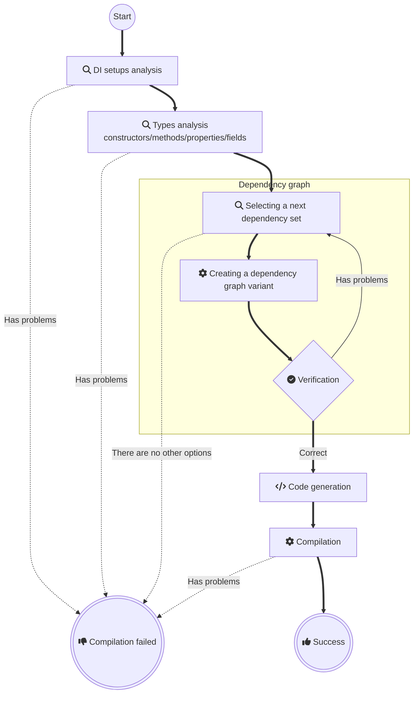

### Applications
- Console
  - [Schrödinger's cat](readme/Console.md)
  - [Top level statements](readme/ConsoleTopLevelStatements.md)
  - [Native AOT](readme/ConsoleNativeAOT.md)
  - [Entity Framework](readme/EntityFramework.md)
- [Unity](readme/Unity.md) 
- UI
  - [MAUI](readme/Maui.md)
  - [WPF](readme/Wpf.md)
  - [Avalonia](readme/Avalonia.md)
  - [Win Forms Net Core](readme/WinFormsAppNetCore.md)
  - [Win Forms](readme/WinFormsApp.md)
- Web
  - [Web](readme/WebApp.md)
  - [Minimal Web API](readme/MinimalWebAPI.md)
  - [Web API](readme/WebAPI.md)
  - [gRPC service](readme/GrpcService.md)
  - [Blazor Server](readme/BlazorServerApp.md)
  - [Blazor WebAssembly](readme/BlazorWebAssemblyApp.md)
    - [https://devteam.github.io/Pure.DI/](https://devteam.github.io/Pure.DI/)
- Git repo with examples
  - [Schrödinger's cat](https://github.com/DevTeam/Pure.DI.Example) 
  - [How to use Pure.DI to create and test libraries](https://github.com/DevTeam/Pure.DI.Solution) 

## Generated Code

Each generated class, hereafter called a _composition_, must be customized. Setup starts with a call to the `Setup(string compositionTypeName)` method:

```c#
DI.Setup("Composition")
    .Bind<IDependency>().To<Dependency>()
    .Bind<IService>().To<Service>()
    .Root<IService>("Root");
```

<details>
<summary>The following class will be generated</summary>

```c#
partial class Composition
{
    // Default constructor
    public Composition() { }

    // Scope constructor
    internal Composition(Composition parentScope) { }

    // Composition root
    public IService Root
    {
        get
        {
            return new Service(new Dependency());
        }
    }

    public T Resolve<T>()  { ... }

    public T Resolve<T>(object? tag)  { ... }

    public object Resolve(Type type) { ... }

    public object Resolve(Type type, object? tag) { ... }
}
```

The _compositionTypeName_ parameter can be omitted

- if the setup is performed inside a partial class, then the composition will be created for this partial class
- for the case of a class with composition kind `CompositionKind.Global`, see [this example](readme/global-compositions.md)

</details>

<details>
<summary>Setup arguments</summary>

The first parameter is used to specify the name of the composition class. All sets with the same name will be combined to create one composition class. Alternatively, this name may contain a namespace, e.g. a composition class is generated for `Sample.Composition`:

```c#
namespace Sample
{
    partial class Composition
    {
        ...
    }
}
```

The second optional parameter may have multiple values to determine the kind of composition.

### CompositionKind.Public

This value is used by default. If this value is specified, a normal composition class will be created.

### CompositionKind.Internal

If you specify this value, the class will not be generated, but this setup can be used by others as a base setup. For example:

```c#
DI.Setup("BaseComposition", CompositionKind.Internal)
    .Bind().To<Dependency>();

DI.Setup("Composition").DependsOn("BaseComposition")
    .Bind().To<Service>();    
```

If the _CompositionKind.Public_ flag is set in the composition setup, it can also be the base for other compositions, as in the example above.

### CompositionKind.Global

No composition class will be created when this value is specified, but this setup is the base setup for all setups in the current project, and `DependsOn(...)` is not required.

</details>

<details>
<summary>Constructors</summary>

### Default constructor

It's quite trivial, this constructor simply initializes the internal state.

### Parameterized constructor

It replaces the default constructor and is only created if at least one argument is specified. For example:

```c#
DI.Setup("Composition")
    .Arg<string>("name")
    .Arg<int>("id")
    ...
```

In this case, the constructor with arguments is as follows:

```c#
public Composition(string name, int id) { ... }
```

and there is no default constructor. It is important to remember that only those arguments that are used in the object graph will appear in the constructor. Arguments that are not involved cannot be defined, as they are omitted from the constructor parameters to save resources.

### Scope constructor

This constructor creates a composition instance for the new scope. This allows ``Lifetime.Scoped`` to be applied. See [this](readme/scope.md) example for details.

</details>

<details>
<summary>Composition Roots</summary>

### Regular Composition Roots

To create an object graph quickly and conveniently, a set of properties (or a methods) is formed. These properties/methods are here called roots of compositions. The type of a property/method is the type of the root object created by the composition. Accordingly, each invocation of a property/method leads to the creation of a composition with a root element of this type.

```c#
DI.Setup("Composition")
    .Bind<IService>().To<Service>()
    .Root<IService>("MyService");

var composition = new Composition();
var service = composition.MyService;
service = composition.Resolve<IService>();
service = composition.Resolve(typeof(IService));
```

In this case, the property for the _IService_ type will be named _MyService_ and will be available for direct use. The result of its use will be the creation of a composition of objects with the root of _IService_ type:

```c#
public IService MyService
{
    get
    { 
        ...
        return new Service(...);
    }
}
```

This is [recommended way](https://blog.ploeh.dk/2011/07/28/CompositionRoot/) to create a composition root. A composition class can contain any number of roots.

In addition, the composition  roots can be resolved using the `Resolve()` methods:

```c#
service = composition.Resolve<IService>();
service = composition.Resolve(typeof(IService));
```

>![TIP]
>- There is no limit to the number of roots, but you should consider limiting the number of roots. Ideally, an application should have a single composition root
>- The name of the composition root is arbitrarily chosen depending on its purpose, but should be restricted by the property naming conventions in C# since it is the same name as a property in the composition class
>- It is recommended that composition roots be resolved using normal properties or methods instead of methods of type `Resolve()`.

### Anonymous Composition Roots

If the root name is empty, an anonymous composition root with a random name is created:

```c#
private IService RootM07D16di_0001
{
    get { ... }
}
```

These properties (or methods) have an arbitrary name and access modifier `private` and cannot be used directly from the code. Do not attempt to use them, as their names are arbitrarily changed. Anonymous composition roots can be resolved by `Resolve` methods:

```c#
DI.Setup("Composition")
    .Bind<IService>().To<Service>()
    .Root<IService>();

var composition = new Composition();
var service = composition.Resolve<IService>();
service = composition.Resolve(typeof(IService));
```

</details>

<details>
<summary>Methods "Resolve"</summary>

### Methods "Resolve"

By default, a set of four _Resolve_ methods is generated:

```c#
public T Resolve<T>() { ... }

public T Resolve<T>(object? tag) { ... }

public object Resolve(Type type) { ... }

public object Resolve(Type type, object? tag) { ... }
```

These methods can resolve both public and anonymous composition roots that do not depend on any arguments of the composition roots. They are useful when using the [Service Locator](https://martinfowler.com/articles/injection.html) approach, where the code resolves composition roots in place:

```c#
var composition = new Composition();

composition.Resolve<IService>();
```

This is a [not recommended](https://blog.ploeh.dk/2010/02/03/ServiceLocatorisanAnti-Pattern/) way to create composition roots because _Resolve_ methods have a number of disadvantages:
- They provide access to an unlimited set of dependencies.
- Their use can potentially lead to runtime exceptions, for example, when the corresponding root has not been defined.
- Lead to performance degradation because they search for the root of a composition based on its type.

To control the generation of these methods, see the [Resolve](#resolve-hint) hint.

### Dispose and DisposeAsync

Provides a mechanism to release unmanaged resources. These methods are generated only if the composition contains at least one singleton/scoped instance that implements either the [IDisposable](https://learn.microsoft.com/en-us/dotnet/api/system.idisposable) and/or [DisposeAsync](https://learn.microsoft.com/en-us/dotnet/api/system.iasyncdisposable.disposeasync) interface. The `Dispose()` or `DisposeAsync()` method of the composition should be called to dispose of all created singleton/scoped objects:

```c#
using var composition = new Composition();
```

or

```c#
await using var composition = new Composition();
```

To dispose objects of other lifetimes please see [this](readme/tracking-disposable-instances-per-a-composition-root.md) or [this](readme/tracking-disposable-instances-in-delegates.md) examples.

</details>

<details>
<summary>Setup hints</summary>

## Setup hints

Hints are used to fine-tune code generation. Setup hints can be used as shown in the following example:

```c#
DI.Setup("Composition")
    .Hint(Hint.Resolve, "Off")
    .Hint(Hint.ThreadSafe, "Off")
    .Hint(Hint.ToString, "On")
    ...
```

In addition, setup hints can be commented out before the _Setup_ method as `hint = value`. For example:

```c#
// Resolve = Off
// ThreadSafe = Off
DI.Setup("Composition")
    ...
```

Both approaches can be mixed:

```c#
// Resolve = Off
DI.Setup("Composition")
    .Hint(Hint.ThreadSafe, "Off")
    ...
```

| Hint                                                                                                                               | Values                                     | C# version | Default   |
|------------------------------------------------------------------------------------------------------------------------------------|--------------------------------------------|------------|-----------|
| [Resolve](#resolve-hint)                                                                                                           | _On_ or _Off_                              |            | _On_      |
| [OnNewInstance](#onnewinstance-hint)                                                                                               | _On_ or _Off_                              | 9.0        | _Off_     |
| [OnNewInstancePartial](#onnewinstance-hint)                                                                                        | _On_ or _Off_                              |            | _On_      |
| [OnNewInstanceImplementationTypeNameRegularExpression](#onnewinstanceimplementationtypenameregularexpression-hint)                 | Regular expression                         |            | .+        |
| [OnNewInstanceImplementationTypeNameWildcard](#onnewinstanceimplementationtypenamewildcard-hint)                                   | Wildcard                                   |            | *         |
| [OnNewInstanceTagRegularExpression](#onnewinstancetagregularexpression-hint)                                                       | Regular expression                         |            | .+        |
| [OnNewInstanceTagWildcard](#onnewinstancetagwildcard-hint)                                                                         | Wildcard                                   |            | *         |
| [OnNewInstanceLifetimeRegularExpression](#onnewinstancelifetimeregularexpression-hint)                                             | Regular expression                         |            | .+        |
| [OnNewInstanceLifetimeWildcard](#onnewinstancelifetimewildcard-hint)                                                               | Wildcard                                   |            | *         |
| [OnDependencyInjection](#ondependencyinjection-hint)                                                                               | _On_ or _Off_                              | 9.0        | _Off_     | 
| [OnDependencyInjectionPartial](#ondependencyinjectionpartial-hint)                                                                 | _On_ or _Off_                              |            | _On_      |
| [OnDependencyInjectionImplementationTypeNameRegularExpression](#OnDependencyInjectionImplementationTypeNameRegularExpression-Hint) | Regular expression                         |            | .+        |
| [OnDependencyInjectionImplementationTypeNameWildcard](#OnDependencyInjectionImplementationTypeNameWildcard-Hint)                   | Wildcard                                   |            | *         |
| [OnDependencyInjectionContractTypeNameRegularExpression](#ondependencyinjectioncontracttypenameregularexpression-hint)             | Regular expression                         |            | .+        |
| [OnDependencyInjectionContractTypeNameWildcard](#ondependencyinjectioncontracttypenameWildcard-hint)                               | Wildcard                                   |            | *         |
| [OnDependencyInjectionTagRegularExpression](#ondependencyinjectiontagregularexpression-hint)                                       | Regular expression                         |            | .+        |
| [OnDependencyInjectionTagWildcard](#ondependencyinjectiontagWildcard-hint)                                                         | Wildcard                                   |            | *         |
| [OnDependencyInjectionLifetimeRegularExpression](#ondependencyinjectionlifetimeregularexpression-hint)                             | Regular expression                         |            | .+        |
| [OnDependencyInjectionLifetimeWildcard](#ondependencyinjectionlifetimeWildcard-hint)                                               | Wildcard                                   |            | *         |
| [OnCannotResolve](#oncannotresolve-hint)                                                                                           | _On_ or _Off_                              | 9.0        | _Off_     |
| [OnCannotResolvePartial](#oncannotresolvepartial-hint)                                                                             | _On_ or _Off_                              |            | _On_      |
| [OnCannotResolveContractTypeNameRegularExpression](#oncannotresolvecontracttypenameregularexpression-hint)                         | Regular expression                         |            | .+        |
| [OnCannotResolveContractTypeNameWildcard](#oncannotresolvecontracttypenameцildcard-hint)                                           | Wildcard                                   |            | *         |
| [OnCannotResolveTagRegularExpression](#oncannotresolvetagregularexpression-hint)                                                   | Regular expression                         |            | .+        |
| [OnCannotResolveTagWildcard](#oncannotresolvetagWildcard-hint)                                                                     | Wildcard                                   |            | *         |
| [OnCannotResolveLifetimeRegularExpression](#oncannotresolvelifetimeregularexpression-hint)                                         | Regular expression                         |            | .+        |
| [OnCannotResolveLifetimeWildcard](#oncannotresolvelifetimeWildcard-hint)                                                           | Wildcard                                   |            | *         |
| [OnNewRoot](#onnewroot-hint)                                                                                                       | _On_ or _Off_                              |            | _Off_     |
| [OnNewRootPartial](#onnewrootpartial-hint)                                                                                         | _On_ or _Off_                              |            | _On_      |
| [ToString](#tostring-hint)                                                                                                         | _On_ or _Off_                              |            | _Off_     |
| [ThreadSafe](#threadsafe-hint)                                                                                                     | _On_ or _Off_                              |            | _On_      |
| [ResolveMethodModifiers](#resolvemethodmodifiers-hint)                                                                             | Method modifier                            |            | _public_  |
| [ResolveMethodName](#resolvemethodname-hint)                                                                                       | Method name                                |            | _Resolve_ |
| [ResolveByTagMethodModifiers](#resolvebytagmethodmodifiers-hint)                                                                   | Method modifier                            |            | _public_  |
| [ResolveByTagMethodName](#resolvebytagmethodname-hint)                                                                             | Method name                                |            | _Resolve_ |
| [ObjectResolveMethodModifiers](#objectresolvemethodmodifiers-hint)                                                                 | Method modifier                            |            | _public_  |
| [ObjectResolveMethodName](#objectresolvemethodname-hint)                                                                           | Method name                                |            | _Resolve_ |
| [ObjectResolveByTagMethodModifiers](#objectresolvebytagmethodmodifiers-hint)                                                       | Method modifier                            |            | _public_  |
| [ObjectResolveByTagMethodName](#objectresolvebytagmethodname-hint)                                                                 | Method name                                |            | _Resolve_ |
| [DisposeMethodModifiers](#disposemethodmodifiers-hint)                                                                             | Method modifier                            |            | _public_  |
| [DisposeAsyncMethodModifiers](#disposeasyncmethodmodifiers-hint)                                                                   | Method modifier                            |            | _public_  |
| [FormatCode](#formatcode-hint)                                                                                                     | _On_ or _Off_                              |            | _Off_     |
| [SeverityOfNotImplementedContract](#severityofnotimplementedcontract-hint)                                                         | _Error_ or _Warning_ or _Info_ or _Hidden_ |            | _Error_   |
| [Comments](#comments-hint)                                                                                                         | _On_ or _Off_                              |            | _On_      |
| SkipDefaultConstructor                                                                                                             | _On_ or _Off_                              |            | _Off_     | 
| SkipDefaultConstructorImplementationTypeNameRegularExpression                                                                      | Regular expression                         |            | .+        |
| SkipDefaultConstructorImplementationTypeNameWildcard                                                                               | Wildcard                                   |            | *         |
| SkipDefaultConstructorLifetimeRegularExpression                                                                                    | Regular expression                         |            | .+        |
| SkipDefaultConstructorLifetimeWildcard                                                                                             | Wildcard                                   |            | *         |
| DisableAutoBinding                                                                                                                 | _On_ or _Off_                              |            | _Off_     | 
| DisableAutoBindingImplementationTypeNameRegularExpression                                                                          | Regular expression                         |            | .+        |
| DisableAutoBindingImplementationTypeNameWildcard                                                                                   | Wildcard                                   |            | *         |
| DisableAutoBindingLifetimeRegularExpression                                                                                        | Regular expression                         |            | .+        |
| DisableAutoBindingLifetimeWildcard                                                                                                 | Wildcard                                   |            | *         |

The list of hints will be gradually expanded to meet the needs and desires for fine-tuning code generation. Please feel free to add your ideas.

### Resolve Hint

Determines whether to generate [_Resolve_ methods](#resolve). By default, a set of four _Resolve_ methods are generated. Set this hint to _Off_ to disable the generation of resolve methods. This will reduce the generation time of the class composition, and in this case no [anonymous composition roots](#private-composition-roots) will be generated. The class composition will be smaller and will only have [public roots](#public-composition-roots). When the _Resolve_ hint is disabled, only the public roots properties are available, so be sure to explicitly define them using the `Root<T>(string name)` method with an explicit composition root name.

### OnNewInstance Hint

Determines whether to use the _OnNewInstance_ partial method. By default, this partial method is not generated. This can be useful, for example, for logging purposes:

```c#
internal partial class Composition
{
    partial void OnNewInstance<T>(ref T value, object? tag, object lifetime) =>
        Console.WriteLine($"'{typeof(T)}'('{tag}') created.");
}
```

You can also replace the created instance with a `T` type, where `T` is the actual type of the created instance. To minimize performance loss when calling _OnNewInstance_, use the three hints below.

### OnNewInstancePartial Hint

Determines whether to generate the _OnNewInstance_ partial method. By default, this partial method is generated when the _OnNewInstance_ hint is ```On```.

### OnNewInstanceImplementationTypeNameRegularExpression Hint

This is a regular expression for filtering by instance type name. This hint is useful when _OnNewInstance_ is in _On_ state and it is necessary to limit the set of types for which the _OnNewInstance_ method will be called.

### OnNewInstanceImplementationTypeNameWildcard Hint

This is a Wildcard for filtering by instance type name. This hint is useful when _OnNewInstance_ is in _On_ state and it is necessary to limit the set of types for which the _OnNewInstance_ method will be called.

### OnNewInstanceTagRegularExpression Hint

This is a regular expression for filtering by _tag_. This hint is also useful when _OnNewInstance_ is in _On_ state and it is necessary to limit the set of _tags_ for which the _OnNewInstance_ method will be called.

### OnNewInstanceTagWildcard Hint

This is a wildcard for filtering by _tag_. This hint is also useful when _OnNewInstance_ is in _On_ state and it is necessary to limit the set of _tags_ for which the _OnNewInstance_ method will be called.

### OnNewInstanceLifetimeRegularExpression Hint

This is a regular expression for filtering by _lifetime_. This hint is also useful when _OnNewInstance_ is in _On_ state and it is necessary to restrict the set of _life_ times for which the _OnNewInstance_ method will be called.

### OnNewInstanceLifetimeWildcard Hint

This is a wildcard for filtering by _lifetime_. This hint is also useful when _OnNewInstance_ is in _On_ state and it is necessary to restrict the set of _life_ times for which the _OnNewInstance_ method will be called.

### OnDependencyInjection Hint

Determines whether to use the _OnDependencyInjection_ partial method when the _OnDependencyInjection_ hint is ```On``` to control dependency injection. By default it is ```On```.

```c#
// OnDependencyInjection = On
// OnDependencyInjectionPartial = Off
// OnDependencyInjectionContractTypeNameRegularExpression = ICalculator[\d]{1}
// OnDependencyInjectionTagRegularExpression = Abc
DI.Setup("Composition")
    ...
```

### OnDependencyInjectionPartial Hint

Determines whether to generate the _OnDependencyInjection_ partial method to control dependency injection. By default, this partial method is not generated. It cannot have an empty body because of the return value. It must be overridden when it is generated. This may be useful, for example, for [Interception Scenario](readme/interception.md).

```c#
// OnDependencyInjection = On
// OnDependencyInjectionContractTypeNameRegularExpression = ICalculator[\d]{1}
// OnDependencyInjectionTagRegularExpression = Abc
DI.Setup("Composition")
    ...
```

To minimize performance loss when calling _OnDependencyInjection_, use the three tips below.

### OnDependencyInjectionImplementationTypeNameRegularExpression Hint

This is a regular expression for filtering by instance type name. This hint is useful when _OnDependencyInjection_ is in _On_ state and it is necessary to restrict the set of types for which the _OnDependencyInjection_ method will be called.

### OnDependencyInjectionImplementationTypeNameWildcard Hint

This is a wildcard for filtering by instance type name. This hint is useful when _OnDependencyInjection_ is in _On_ state and it is necessary to restrict the set of types for which the _OnDependencyInjection_ method will be called.

### OnDependencyInjectionContractTypeNameRegularExpression Hint

This is a regular expression for filtering by the name of the resolving type. This hint is also useful when _OnDependencyInjection_ is in _On_ state and it is necessary to limit the set of permissive types for which the _OnDependencyInjection_ method will be called.

### OnDependencyInjectionContractTypeNameWildcard Hint

This is a wildcard for filtering by the name of the resolving type. This hint is also useful when _OnDependencyInjection_ is in _On_ state and it is necessary to limit the set of permissive types for which the _OnDependencyInjection_ method will be called.

### OnDependencyInjectionTagRegularExpression Hint

This is a regular expression for filtering by _tag_. This hint is also useful when _OnDependencyInjection_ is in the _On_ state and you want to limit the set of _tags_ for which the _OnDependencyInjection_ method will be called.

### OnDependencyInjectionTagWildcard Hint

This is a wildcard for filtering by _tag_. This hint is also useful when _OnDependencyInjection_ is in the _On_ state and you want to limit the set of _tags_ for which the _OnDependencyInjection_ method will be called.

### OnDependencyInjectionLifetimeRegularExpression Hint

This is a regular expression for filtering by _lifetime_. This hint is also useful when _OnDependencyInjection_ is in _On_ state and it is necessary to restrict the set of _lifetime_ for which the _OnDependencyInjection_ method will be called.

### OnDependencyInjectionLifetimeWildcard Hint

This is a wildcard for filtering by _lifetime_. This hint is also useful when _OnDependencyInjection_ is in _On_ state and it is necessary to restrict the set of _lifetime_ for which the _OnDependencyInjection_ method will be called.

### OnCannotResolve Hint

Determines whether to use the `OnCannotResolve<T>(...)` partial method to handle a scenario in which an instance cannot be resolved. By default, this partial method is not generated. Because of the return value, it cannot have an empty body and must be overridden at creation.

```c#
// OnCannotResolve = On
// OnCannotResolveContractTypeNameRegularExpression = string|DateTime
// OnDependencyInjectionTagRegularExpression = null
DI.Setup("Composition")
    ...
```

To avoid missing failed bindings by mistake, use the two relevant hints below.

### OnCannotResolvePartial Hint

Determines whether to generate the `OnCannotResolve<T>(...)` partial method when the _OnCannotResolve_ hint is <c>On</c> to handle a scenario in which an instance cannot be resolved. By default it is ```On```.

```c#
// OnCannotResolve = On
// OnCannotResolvePartial = Off
// OnCannotResolveContractTypeNameRegularExpression = string|DateTime
// OnDependencyInjectionTagRegularExpression = null
DI.Setup("Composition")
    ...
```

To avoid missing failed bindings by mistake, use the two relevant hints below.

### OnNewRoot Hint

Determines whether to use a static partial method `OnNewRoot<TContract, T>(...)` to handle the new composition root registration event.

```c#
// OnNewRoot = On
DI.Setup("Composition")
    ...
```

Be careful, this hint disables checks for the ability to resolve dependencies!

### OnNewRootPartial Hint

Determines whether to generate a static partial method `OnNewRoot<TContract, T>(...)` when the _OnNewRoot_ hint is ```On``` to handle the new composition root registration event.

```c#
// OnNewRootPartial = Off
DI.Setup("Composition")
    ...
```

### OnCannotResolveContractTypeNameRegularExpression Hint

This is a regular expression for filtering by the name of the resolving type. This hint is also useful when _OnCannotResolve_ is in _On_ state and it is necessary to limit the set of resolving types for which the _OnCannotResolve_ method will be called.

### OnCannotResolveContractTypeNameWildcard Hint

This is a wildcard for filtering by the name of the resolving type. This hint is also useful when _OnCannotResolve_ is in _On_ state and it is necessary to limit the set of resolving types for which the _OnCannotResolve_ method will be called.

### OnCannotResolveTagRegularExpression Hint

This is a regular expression for filtering by _tag_. This hint is also useful when _OnCannotResolve_ is in _On_ state and it is necessary to limit the set of _tags_ for which the _OnCannotResolve_ method will be called.

### OnCannotResolveTagWildcard Hint

This is a wildcard for filtering by _tag_. This hint is also useful when _OnCannotResolve_ is in _On_ state and it is necessary to limit the set of _tags_ for which the _OnCannotResolve_ method will be called.

### OnCannotResolveLifetimeRegularExpression Hint

This is a regular expression for filtering by _lifetime_. This hint is also useful when _OnCannotResolve_ is in the _On_ state and it is necessary to restrict the set of _lives_ for which the _OnCannotResolve_ method will be called.

### OnCannotResolveLifetimeWildcard Hint

This is a wildcard for filtering by _lifetime_. This hint is also useful when _OnCannotResolve_ is in the _On_ state and it is necessary to restrict the set of _lives_ for which the _OnCannotResolve_ method will be called.

### ToString Hint

Determines whether to generate the _ToString()_ method. This method provides a class diagram in [mermaid](https://mermaid.js.org/) format. To see this diagram, just call the ToString method and copy the text to [this site](https://mermaid.live/).

```c#
// ToString = On
DI.Setup("Composition")
    .Bind<IService>().To<Service>()
    .Root<IService>("MyService");
    
var composition = new Composition();
string classDiagram = composition.ToString(); 
```

### ThreadSafe Hint

This hint determines whether the composition of objects will be created in a thread-safe way. The default value of this hint is _On_. It is a good practice not to use threads when creating an object graph, in this case the hint can be disabled, which will result in a small performance gain. For example:

```c#
// ThreadSafe = Off
DI.Setup("Composition")
    .Bind<IService>().To<Service>()
    .Root<IService>("MyService");
```

### ResolveMethodModifiers Hint

Overrides the modifiers of the `public T Resolve<T>()` method.

### ResolveMethodName Hint

Overrides the method name for `public T Resolve<T>()`.

### ResolveByTagMethodModifiers Hint

Overrides the modifiers of the `public T Resolve<T>(object? tag)` method.

### ResolveByTagMethodName Hint

Overrides the method name for `public T Resolve<T>(object? tag)`.

### ObjectResolveMethodModifiers Hint

Overrides the modifiers of the `public object Resolve(Type type)` method.

### ObjectResolveMethodName Hint

Overrides the method name for `public object Resolve(Type type)`.

### ObjectResolveByTagMethodModifiers Hint

Overrides the modifiers of the `public object Resolve(Type type, object? tag)` method.

### ObjectResolveByTagMethodName Hint

Overrides the method name for `public object Resolve(Type type, object? tag)`.

### DisposeMethodModifiers Hint

Overrides the modifiers of the `public void Dispose()` method.

### DisposeAsyncMethodModifiers Hint

Overrides the modifiers of the `public ValueTask DisposeAsync()` method.

### FormatCode Hint

Specifies whether the generated code should be formatted. This option consumes a lot of CPU resources. This hint may be useful when studying the generated code or, for example, when making presentations.

### SeverityOfNotImplementedContract Hint

Indicates the severity level of the situation when, in the binding, an implementation does not implement a contract. Possible values:

- _"Error"_, it is default value.
- _"Warning"_ - something suspicious but allowed.
- _"Info"_ - information that does not indicate a problem.
- _"Hidden"_ - what's not a problem.

### Comments Hint

Specifies whether the generated code should be commented.

```c#
// Represents the composition class
DI.Setup(nameof(Composition))
    .Bind<IService>().To<Service>()
    // Provides a composition root of my service
    .Root<IService>("MyService");
```

Appropriate comments will be added to the generated ```Composition``` class and the documentation for the class, depending on the IDE used, will look something like this:

### SystemThreadingLock Hint

Indicates whether `System.Threading.Lock` should be used whenever possible instead of the classic approach of synchronizing object access using `System.Threading.Monitor1. `On` by default.

```c#
DI.Setup(nameof(Composition))
    .Hint(Hint.SystemThreadingLock, "Off")
    .Bind().To<Service>()
    .Root<Service>("MyService");
```


Then documentation for the composition root:


</details>

<details>
<summary>Code generation workflow</summary>



</details>

## Project template

Install the DI template [Pure.DI.Templates](https://www.nuget.org/packages/Pure.DI.Templates)

```shell
dotnet new install Pure.DI.Templates
```

Create a "Sample" console application from the template *__di__*

```shell
dotnet new di -o ./Sample
```

And run it

```shell
dotnet run --project Sample
```

For more information about the template, please see [this page](https://github.com/DevTeam/Pure.DI/wiki/Project-templates).

## Troubleshooting

<details>
<summary>Version update</summary>

When updating the version, it is possible that the previous version of the code generator remains active and is used by compilation services. In this case, the old and new versions of the generator may conflict. For a project where the code generator is used, it is recommended to do the following:
- After updating the version, close the IDE if it is open
- Delete the _obj_ and _bin_ directories
- Execute the following commands one by one

```shell
dotnet build-server shutdown
```

```shell
dotnet restore
```

```shell
dotnet build
```

</details>

<details>
<summary>Disabling API generation</summary>

Pure.DI automatically generates its API. If an assembly already has the Pure.DI API, for example, from another assembly, it is sometimes necessary to disable its automatic generation to avoid ambiguity. To do this, you need to add a _DefineConstants_ element to the project files of these modules. For example:

```xml
<PropertyGroup>
    <DefineConstants>$(DefineConstants);PUREDI_API_SUPPRESSION</DefineConstants>
</PropertyGroup>
```

</details>

<details>
<summary>Display generated files</summary>

You can set project properties to save generated files and control their storage location. In the project file, add the `<EmitCompilerGeneratedFiles>` element to the `<PropertyGroup>` group and set its value to `true`. Build the project again. The generated files are now created in the _obj/Debug/netX.X/generated/Pure.DI/Pure.DI/Pure.DI.SourceGenerator_ directory. The path components correspond to the build configuration, the target framework, the source generator project name, and the full name of the generator type. You can choose a more convenient output folder by adding the `<CompilerGeneratedFilesOutputPath>` element to the application project file. For example:

```xml
<Project Sdk="Microsoft.NET.Sdk">
    
    <PropertyGroup>
        <EmitCompilerGeneratedFiles>true</EmitCompilerGeneratedFiles>
        <CompilerGeneratedFilesOutputPath>$(BaseIntermediateOutputPath)Generated</CompilerGeneratedFilesOutputPath>
    </PropertyGroup>
    
</Project>
```

</details>

<details>
<summary>Performance profiling</summary>

Please install the [JetBrains.dotTrace.GlobalTools](https://www.nuget.org/packages/JetBrains.dotTrace.GlobalTools) dotnet tool globally, for example:

```shell
dotnet tool install --global JetBrains.dotTrace.GlobalTools --version 2024.3.3
```

Or make sure it is installed. Add the following sections to the project:

```xml
<Project Sdk="Microsoft.NET.Sdk">

  <PropertyGroup>
    <PureDIProfilePath>c:\profiling</PureDIProfilePath>
  </PropertyGroup>

  <ItemGroup>
    <CompilerVisibleProperty Include="PureDIProfilePath" />
  </ItemGroup>

</Project>
```

Replace the path like *c:\profiling* with the path where the profiling results will be saved.

Start the project build and wait until a file like *c:\profiling\pure_di_????.dtt* appears in the directory.

</details>

## Additional resources

Examples of how to set up a composition
- [Pure.DI](https://github.com/DevTeam/Pure.DI/blob/master/src/Pure.DI.Core/Generator.cs)
- [C# interactive](https://github.com/DevTeam/csharp-interactive/blob/master/CSharpInteractive/Composition.cs)
- [Immutype](https://github.com/DevTeam/Immutype/blob/master/Immutype/Composition.cs)
- [MSBuild logger](https://github.com/JetBrains/teamcity-msbuild-logger/blob/master/TeamCity.MSBuild.Logger/Composition.cs)

Articles
- [RU New in Pure.DI by the end of 2024](https://habr.com/ru/articles/868744/)
- [RU New in Pure.DI](https://habr.com/ru/articles/808297/)
- [RU Pure.DI v2.1](https://habr.com/ru/articles/795809/)
- [RU Pure.DI next step](https://habr.com/ru/articles/554236/)
- [RU Pure.DI for .NET](https://habr.com/ru/articles/552858/)

RU DotNext video

<a href="http://www.youtube.com/watch?feature=player_embedded&v=nrp9SH-gLqg" target="_blank"></a>
