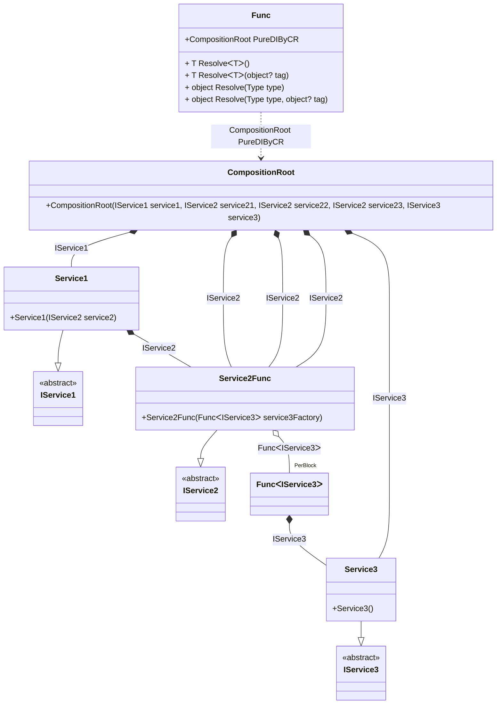

## Func details

Creating an object graph of 7 transition objects plus 1 `Func<T>` with additional 1 transition object.

### Class diagram


### Generated code

<details>
<summary>Pure.DI-generated partial class Func</summary><blockquote>

```c#
partial class Func
{
  private readonly global::System.IDisposable[] _disposableSingletonsM12D01di;
  
  public Func()
  {
    _disposableSingletonsM12D01di = new global::System.IDisposable[0];
  }
  
  internal Func(Func parent)
  {
    _disposableSingletonsM12D01di = new global::System.IDisposable[0];
  }
  
  #region Composition Roots
  #if NETSTANDARD2_0_OR_GREATER || NETCOREAPP || NET40_OR_GREATER || NET
  [global::System.Diagnostics.Contracts.Pure]
  #endif
  public partial Pure.DI.Benchmarks.Model.CompositionRoot PureDIByCR()
  {
    System.Func<Pure.DI.Benchmarks.Model.IService3> perBlockM12D01di6 = new Func<Pure.DI.Benchmarks.Model.IService3>(() =>
    {
        var value = new Pure.DI.Benchmarks.Model.Service3();
        return value;
    });
    return new Pure.DI.Benchmarks.Model.CompositionRoot(new Pure.DI.Benchmarks.Model.Service1(new Pure.DI.Benchmarks.Model.Service2Func(perBlockM12D01di6)), new Pure.DI.Benchmarks.Model.Service2Func(perBlockM12D01di6), new Pure.DI.Benchmarks.Model.Service2Func(perBlockM12D01di6), new Pure.DI.Benchmarks.Model.Service2Func(perBlockM12D01di6), new Pure.DI.Benchmarks.Model.Service3());
  }
  #endregion
  
  #region API
  #if NETSTANDARD2_0_OR_GREATER || NETCOREAPP || NET40_OR_GREATER || NET
  [global::System.Diagnostics.Contracts.Pure]
  #endif
  public T Resolve<T>()
  {
    return ResolverM12D01di<T>.Value.Resolve(this);
  }
  
  #if NETSTANDARD2_0_OR_GREATER || NETCOREAPP || NET40_OR_GREATER || NET
  [global::System.Diagnostics.Contracts.Pure]
  #endif
  public T Resolve<T>(object? tag)
  {
    return ResolverM12D01di<T>.Value.ResolveByTag(this, tag);
  }
  
  #if NETSTANDARD2_0_OR_GREATER || NETCOREAPP || NET40_OR_GREATER || NET
  [global::System.Diagnostics.Contracts.Pure]
  #endif
  public object Resolve(global::System.Type type)
  {
    var index = (int)(_bucketSizeM12D01di * ((uint)global::System.Runtime.CompilerServices.RuntimeHelpers.GetHashCode(type) % 1));
    var finish = index + _bucketSizeM12D01di;
    do {
      ref var pair = ref _bucketsM12D01di[index];
      if (ReferenceEquals(pair.Key, type))
      {
        return pair.Value.Resolve(this);
      }
    } while (++index < finish);
    
    throw new global::System.InvalidOperationException($"Cannot resolve composition root of type {type}.");
  }
  
  #if NETSTANDARD2_0_OR_GREATER || NETCOREAPP || NET40_OR_GREATER || NET
  [global::System.Diagnostics.Contracts.Pure]
  #endif
  public object Resolve(global::System.Type type, object? tag)
  {
    var index = (int)(_bucketSizeM12D01di * ((uint)global::System.Runtime.CompilerServices.RuntimeHelpers.GetHashCode(type) % 1));
    var finish = index + _bucketSizeM12D01di;
    do {
      ref var pair = ref _bucketsM12D01di[index];
      if (ReferenceEquals(pair.Key, type))
      {
        return pair.Value.ResolveByTag(this, tag);
      }
    } while (++index < finish);
    
    throw new global::System.InvalidOperationException($"Cannot resolve composition root \"{tag}\" of type {type}.");
  }
  #endregion
  
  public override string ToString()
  {
    return
      "classDiagram\n" +
        "  class Func {\n" +
          "    +CompositionRoot PureDIByCR\n" +
          "    + T ResolveᐸTᐳ()\n" +
          "    + T ResolveᐸTᐳ(object? tag)\n" +
          "    + object Resolve(Type type)\n" +
          "    + object Resolve(Type type, object? tag)\n" +
        "  }\n" +
        "  class CompositionRoot {\n" +
          "    +CompositionRoot(IService1 service1, IService2 service21, IService2 service22, IService2 service23, IService3 service3)\n" +
        "  }\n" +
        "  Service1 --|> IService1 : \n" +
        "  class Service1 {\n" +
          "    +Service1(IService2 service2)\n" +
        "  }\n" +
        "  Service2Func --|> IService2 : \n" +
        "  class Service2Func {\n" +
          "    +Service2Func(FuncᐸIService3ᐳ service3Factory)\n" +
        "  }\n" +
        "  Service3 --|> IService3 : \n" +
        "  class Service3 {\n" +
          "    +Service3()\n" +
        "  }\n" +
        "  class FuncᐸIService3ᐳ\n" +
        "  class IService1 {\n" +
          "    <<abstract>>\n" +
        "  }\n" +
        "  class IService2 {\n" +
          "    <<abstract>>\n" +
        "  }\n" +
        "  class IService3 {\n" +
          "    <<abstract>>\n" +
        "  }\n" +
        "  CompositionRoot *--  Service1 : IService1\n" +
        "  CompositionRoot *--  Service2Func : IService2\n" +
        "  CompositionRoot *--  Service2Func : IService2\n" +
        "  CompositionRoot *--  Service2Func : IService2\n" +
        "  CompositionRoot *--  Service3 : IService3\n" +
        "  Service1 *--  Service2Func : IService2\n" +
        "  Service2Func o--  \"PerBlock\" FuncᐸIService3ᐳ : FuncᐸIService3ᐳ\n" +
        "  Func ..> CompositionRoot : CompositionRoot PureDIByCR\n" +
        "  FuncᐸIService3ᐳ *--  Service3 : IService3";
  }
  
  private readonly static int _bucketSizeM12D01di;
  private readonly static global::Pure.DI.Pair<global::System.Type, global::Pure.DI.IResolver<Func, object>>[] _bucketsM12D01di;
  
  
  static Func()
  {
    var valResolverM12D01di_0000 = new ResolverM12D01di_0000();
    ResolverM12D01di<Pure.DI.Benchmarks.Model.CompositionRoot>.Value = valResolverM12D01di_0000;
    _bucketsM12D01di = global::Pure.DI.Buckets<global::System.Type, global::Pure.DI.IResolver<Func, object>>.Create(
      1,
      out _bucketSizeM12D01di,
      new global::Pure.DI.Pair<global::System.Type, global::Pure.DI.IResolver<Func, object>>[1]
      {
         new global::Pure.DI.Pair<global::System.Type, global::Pure.DI.IResolver<Func, object>>(typeof(Pure.DI.Benchmarks.Model.CompositionRoot), valResolverM12D01di_0000)
      });
  }
  
  #region Resolvers
  private sealed class ResolverM12D01di<T>: global::Pure.DI.IResolver<Func, T>
  {
    public static global::Pure.DI.IResolver<Func, T> Value = new ResolverM12D01di<T>();
    
    public T Resolve(Func composite)
    {
      throw new global::System.InvalidOperationException($"Cannot resolve composition root of type {typeof(T)}.");
    }
    
    public T ResolveByTag(Func composite, object tag)
    {
      throw new global::System.InvalidOperationException($"Cannot resolve composition root \"{tag}\" of type {typeof(T)}.");
    }
  }
  
  private sealed class ResolverM12D01di_0000: global::Pure.DI.IResolver<Func, Pure.DI.Benchmarks.Model.CompositionRoot>
  {
    public Pure.DI.Benchmarks.Model.CompositionRoot Resolve(Func composition)
    {
      return composition.PureDIByCR();
    }
    
    public Pure.DI.Benchmarks.Model.CompositionRoot ResolveByTag(Func composition, object tag)
    {
      if (Equals(tag, null)) return composition.PureDIByCR();
      throw new global::System.InvalidOperationException($"Cannot resolve composition root \"{tag}\" of type Pure.DI.Benchmarks.Model.CompositionRoot.");
    }
  }
  #endregion
}
```

</blockquote></details>

