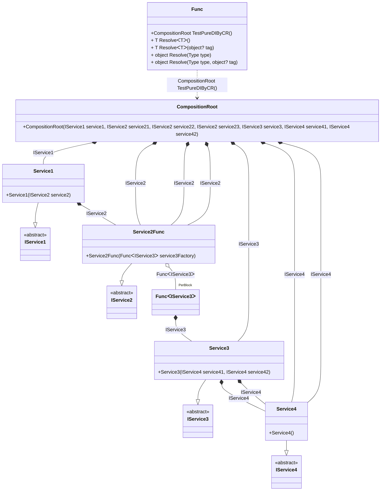

## Func details

Creating an object graph of 7 transition objects plus 1 `Func<T>` with additional 1 transition object.

### Class diagram


### Generated code

<details>
<summary>Pure.DI-generated partial class Func</summary><blockquote>

```c#
partial class Func
{
  private readonly Func _root;

  public Func()
  {
    _root = this;
  }

  internal Func(Func parentScope)
  {
    _root = (parentScope ?? throw new ArgumentNullException(nameof(parentScope)))._root;
  }

  [MethodImpl((MethodImplOptions)0x100)]
  public partial Benchmarks.Model.CompositionRoot TestPureDIByCR()
  {
    Func<Benchmarks.Model.IService3> perBlock10_Func = new Func<Benchmarks.Model.IService3>(
    [MethodImpl((MethodImplOptions)256)]
    () =>
    {
        var value_1 = new Benchmarks.Model.Service3(new Benchmarks.Model.Service4(), new Benchmarks.Model.Service4());
        return value_1;
    });
    return new Benchmarks.Model.CompositionRoot(new Benchmarks.Model.Service1(new Benchmarks.Model.Service2Func(perBlock10_Func)), new Benchmarks.Model.Service2Func(perBlock10_Func), new Benchmarks.Model.Service2Func(perBlock10_Func), new Benchmarks.Model.Service2Func(perBlock10_Func), new Benchmarks.Model.Service3(new Benchmarks.Model.Service4(), new Benchmarks.Model.Service4()), new Benchmarks.Model.Service4(), new Benchmarks.Model.Service4());
  }

  [MethodImpl((MethodImplOptions)0x100)]
  public T Resolve<T>()
  {
    return Resolver<T>.Value.Resolve(this);
  }

  [MethodImpl((MethodImplOptions)0x100)]
  public T Resolve<T>(object? tag)
  {
    return Resolver<T>.Value.ResolveByTag(this, tag);
  }

  [MethodImpl((MethodImplOptions)0x100)]
  public object Resolve(Type type)
  {
    var index = (int)(_bucketSize * ((uint)RuntimeHelpers.GetHashCode(type) % 1));
    ref var pair = ref _buckets[index];
    return pair.Key == type ? pair.Value.Resolve(this) : Resolve(type, index);
  }

  [MethodImpl((MethodImplOptions)0x8)]
  private object Resolve(Type type, int index)
  {
    var finish = index + _bucketSize;
    while (++index < finish)
    {
      ref var pair = ref _buckets[index];
      if (pair.Key == type)
      {
        return pair.Value.Resolve(this);
      }
    }

    throw new InvalidOperationException($"{CannotResolveMessage} {OfTypeMessage} {type}.");
  }

  [MethodImpl((MethodImplOptions)0x100)]
  public object Resolve(Type type, object? tag)
  {
    var index = (int)(_bucketSize * ((uint)RuntimeHelpers.GetHashCode(type) % 1));
    ref var pair = ref _buckets[index];
    return pair.Key == type ? pair.Value.ResolveByTag(this, tag) : Resolve(type, tag, index);
  }

  [MethodImpl((MethodImplOptions)0x8)]
  private object Resolve(Type type, object? tag, int index)
  {
    var finish = index + _bucketSize;
    while (++index < finish)
    {
      ref var pair = ref _buckets[index];
      if (pair.Key == type)
      {
        return pair.Value.ResolveByTag(this, tag);
      }
    }

    throw new InvalidOperationException($"{CannotResolveMessage} \"{tag}\" {OfTypeMessage} {type}.");
  }

  public override string ToString()
  {
    return
      "classDiagram\n" +
        "  class Func {\n" +
          "    +CompositionRoot TestPureDIByCR()\n" +
          "    + T ResolveᐸTᐳ()\n" +
          "    + T ResolveᐸTᐳ(object? tag)\n" +
          "    + object Resolve(Type type)\n" +
          "    + object Resolve(Type type, object? tag)\n" +
        "  }\n" +
        "  class CompositionRoot {\n" +
          "    +CompositionRoot(IService1 service1, IService2 service21, IService2 service22, IService2 service23, IService3 service3, IService4 service41, IService4 service42)\n" +
        "  }\n" +
        "  Service1 --|> IService1 : \n" +
        "  class Service1 {\n" +
          "    +Service1(IService2 service2)\n" +
        "  }\n" +
        "  Service2Func --|> IService2 : \n" +
        "  class Service2Func {\n" +
          "    +Service2Func(FuncᐸIService3ᐳ service3Factory)\n" +
        "  }\n" +
        "  Service3 --|> IService3 : \n" +
        "  class Service3 {\n" +
          "    +Service3(IService4 service41, IService4 service42)\n" +
        "  }\n" +
        "  Service4 --|> IService4 : \n" +
        "  class Service4 {\n" +
          "    +Service4()\n" +
        "  }\n" +
        "  class FuncᐸIService3ᐳ\n" +
        "  class IService1 {\n" +
          "    <<abstract>>\n" +
        "  }\n" +
        "  class IService2 {\n" +
          "    <<abstract>>\n" +
        "  }\n" +
        "  class IService3 {\n" +
          "    <<abstract>>\n" +
        "  }\n" +
        "  class IService4 {\n" +
          "    <<abstract>>\n" +
        "  }\n" +
        "  CompositionRoot *--  Service1 : IService1\n" +
        "  CompositionRoot *--  Service2Func : IService2\n" +
        "  CompositionRoot *--  Service2Func : IService2\n" +
        "  CompositionRoot *--  Service2Func : IService2\n" +
        "  CompositionRoot *--  Service3 : IService3\n" +
        "  CompositionRoot *--  Service4 : IService4\n" +
        "  CompositionRoot *--  Service4 : IService4\n" +
        "  Service1 *--  Service2Func : IService2\n" +
        "  Service2Func o--  \"PerBlock\" FuncᐸIService3ᐳ : FuncᐸIService3ᐳ\n" +
        "  Service3 *--  Service4 : IService4\n" +
        "  Service3 *--  Service4 : IService4\n" +
        "  Func ..> CompositionRoot : CompositionRoot TestPureDIByCR()\n" +
        "  FuncᐸIService3ᐳ *--  Service3 : IService3";
  }

  private readonly static int _bucketSize;
  private readonly static Pair<Type, IResolver<Func, object>>[] _buckets;

  static Func()
  {
    var valResolver_0000 = new Resolver_0000();
    Resolver<Benchmarks.Model.CompositionRoot>.Value = valResolver_0000;
    _buckets = Buckets<Type, IResolver<Func, object>>.Create(
      1,
      out _bucketSize,
      new Pair<Type, IResolver<Func, object>>[1]
      {
         new Pair<Type, IResolver<Func, object>>(typeof(Benchmarks.Model.CompositionRoot), valResolver_0000)
      });
  }

  private const string CannotResolveMessage = "Cannot resolve composition root ";
  private const string OfTypeMessage = "of type ";

  private class Resolver<T>: IResolver<Func, T>
  {
    public static IResolver<Func, T> Value = new Resolver<T>();

    public virtual T Resolve(Func composite)
    {
      throw new InvalidOperationException($"{CannotResolveMessage}{OfTypeMessage}{typeof(T)}.");
    }

    public virtual T ResolveByTag(Func composite, object tag)
    {
      throw new InvalidOperationException($"{CannotResolveMessage}\"{tag}\" {OfTypeMessage}{typeof(T)}.");
    }
  }

  private sealed class Resolver_0000: Resolver<Benchmarks.Model.CompositionRoot>
  {
    public override Benchmarks.Model.CompositionRoot Resolve(Func composition)
    {
      return composition.TestPureDIByCR();
    }

    public override Benchmarks.Model.CompositionRoot ResolveByTag(Func composition, object tag)
    {
      switch (tag)
      {
        case null:
          return composition.TestPureDIByCR();
        default:
          return base.ResolveByTag(composition, tag);
      }
    }
  }
}
```

</blockquote></details>

