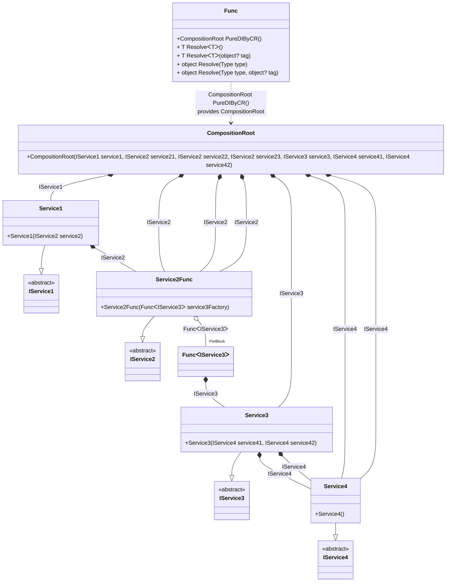

## Func details

Creating an object graph of 7 transition objects plus 1 `Func<T>` with additional 1 transition object.

### Class diagram


### Generated code

<details>
<summary>Pure.DI-generated partial class Func</summary><blockquote>

```c#
/// <para>
/// <b>Composition roots</b><br/>
/// <list type="table">
/// <listheader>
/// <term>Root</term>
/// <description>Description</description>
/// </listheader>
/// <item>
/// <term>
/// <see cref="Pure.DI.Benchmarks.Model.CompositionRoot"/> <see cref="PureDIByCR()"/><br/>or using <see cref="Resolve{T}()"/> method: <c>Resolve&lt;Pure.DI.Benchmarks.Model.CompositionRoot&gt;()</c>
/// </term>
/// <description>
/// Provides a composition root of type <see cref="Pure.DI.Benchmarks.Model.CompositionRoot"/>.
/// </description>
/// </item>
/// </list>
/// </para>
/// </summary>
/// <example>
/// This shows how to get an instance of type <see cref="Pure.DI.Benchmarks.Model.CompositionRoot"/> using the composition root <see cref="PureDIByCR()"/>:
/// <code>
/// var composition = new Func();
/// var instance = composition.PureDIByCR();
/// </code>
/// </example>
/// <a href="https://mermaid.live/view#pako:eNrVVkFuwjAQ_Irlc6VSOxItN0iKxA1Rjr6ExKJpCUZOQEKIP_CXXvodflInJnYcnNCEXnqxDLM7nszuOjnAgIUUDmCw8pPEi_wl92PCyTr_DcbbdQDIttfrj7I_sx0auSzesCRKI7aeMZaC6ZZTbzLau7Mcf87XFx0P5mBGE7ba0fPpe34-fbUKY4sPGqTZHo9B6i-v0mRAkSuT5vsNBalYOkS7oPnIvqf9qVpxwyp53OSN8l0U0CeQXDaXcwsAFQCqR1AtgisILpAq4BSAUz1GI8j27Ep_Dnp67bu5aa-KSIbgIdCWGUjZqwIwTdLP1aAEqT5tVINq1WgCi6IclKqynehOZa3oUuXu2A9SxvcNMvFtibhWIq6Th03D7q2qc1ukUyvSqRPp2Ga-PEkWZzVotpOmx1KZ6y-SlAv7pc7LajnEbIT7eao16crjdOaxXUBoWK4gMCdOVE252ZJAD0mJBP1bEjVqqpotCdQYqDL-CYF5u7Y1wAhgZjKBU8pHKxZ8EmgbuIKwZhbNW6zDI3XI1Bd73v5yFVeRzWWR-8tPk3y4Fpw8SrYNZ7sopFev80KAzaZWTQUfYEx57Eeh-NI6EJi-05gSOCAw9LkoxhEefwBrnzP7">Class diagram</a><br/>
/// This class was created by <a href="https://github.com/DevTeam/Pure.DI">Pure.DI</a> source code generator.
/// <seealso cref="Pure.DI.DI.Setup"/>
/// <seealso cref="Pure.DI.IConfiguration.Bind(object[])"/>
/// <seealso cref="Pure.DI.IConfiguration.Bind{T}(object[])"/>
[global::System.Diagnostics.CodeAnalysis.ExcludeFromCodeCoverage]
partial class Func
{
  private readonly Func _rootM03D14di;
  
  /// <summary>
  /// This constructor creates a new instance of <see cref="Func"/>.
  /// </summary>
  public Func()
  {
    _rootM03D14di = this;
  }
  
  /// <summary>
  /// This constructor creates a new instance of <see cref="Func"/> scope based on <paramref name="baseComposition"/>. This allows the <see cref="Lifetime.Scoped"/> life time to be applied.
  /// </summary>
  /// <param name="baseComposition">Base composition.</param>
  internal Func(Func baseComposition)
  {
    _rootM03D14di = baseComposition._rootM03D14di;
  }
  
  #region Composition Roots
  /// <summary>
  /// Provides a composition root of type <see cref="Pure.DI.Benchmarks.Model.CompositionRoot"/>.
  /// </summary>
  /// <example>
  /// This shows how to get an instance of type <see cref="Pure.DI.Benchmarks.Model.CompositionRoot"/>:
  /// <code>
  /// var composition = new Func();
  /// var instance = composition.PureDIByCR();
  /// </code>
  /// </example>
  #if NETSTANDARD2_0_OR_GREATER || NETCOREAPP || NET40_OR_GREATER || NET
  [global::System.Diagnostics.Contracts.Pure]
  #endif
  public partial Pure.DI.Benchmarks.Model.CompositionRoot PureDIByCR()
  {
    System.Func<Pure.DI.Benchmarks.Model.IService3> perBlockM03D14di10_Func = new Func<Pure.DI.Benchmarks.Model.IService3>(
    [global::System.Runtime.CompilerServices.MethodImpl((global::System.Runtime.CompilerServices.MethodImplOptions)768)]
    () =>
    {
        var value_M03D14di1 = new Pure.DI.Benchmarks.Model.Service3(new Pure.DI.Benchmarks.Model.Service4(), new Pure.DI.Benchmarks.Model.Service4());
        return value_M03D14di1;
    });
    return new Pure.DI.Benchmarks.Model.CompositionRoot(new Pure.DI.Benchmarks.Model.Service1(new Pure.DI.Benchmarks.Model.Service2Func(perBlockM03D14di10_Func)), new Pure.DI.Benchmarks.Model.Service2Func(perBlockM03D14di10_Func), new Pure.DI.Benchmarks.Model.Service2Func(perBlockM03D14di10_Func), new Pure.DI.Benchmarks.Model.Service2Func(perBlockM03D14di10_Func), new Pure.DI.Benchmarks.Model.Service3(new Pure.DI.Benchmarks.Model.Service4(), new Pure.DI.Benchmarks.Model.Service4()), new Pure.DI.Benchmarks.Model.Service4(), new Pure.DI.Benchmarks.Model.Service4());
  }
  #endregion
  
  #region API
  /// <summary>
  /// Resolves the composition root.
  /// </summary>
  /// <typeparam name="T">The type of the composition root.</typeparam>
  /// <returns>A composition root.</returns>
  #if NETSTANDARD2_0_OR_GREATER || NETCOREAPP || NET40_OR_GREATER || NET
  [global::System.Diagnostics.Contracts.Pure]
  #endif
  public T Resolve<T>()
  {
    return ResolverM03D14di<T>.Value.Resolve(this);
  }
  
  /// <summary>
  /// Resolves the composition root by tag.
  /// </summary>
  /// <typeparam name="T">The type of the composition root.</typeparam>
  /// <param name="tag">The tag of a composition root.</param>
  /// <returns>A composition root.</returns>
  #if NETSTANDARD2_0_OR_GREATER || NETCOREAPP || NET40_OR_GREATER || NET
  [global::System.Diagnostics.Contracts.Pure]
  #endif
  public T Resolve<T>(object? tag)
  {
    return ResolverM03D14di<T>.Value.ResolveByTag(this, tag);
  }
  
  /// <summary>
  /// Resolves the composition root.
  /// </summary>
  /// <param name="type">The type of the composition root.</param>
  /// <returns>A composition root.</returns>
  #if NETSTANDARD2_0_OR_GREATER || NETCOREAPP || NET40_OR_GREATER || NET
  [global::System.Diagnostics.Contracts.Pure]
  #endif
  public object Resolve(global::System.Type type)
  {
    var index = (int)(_bucketSizeM03D14di * ((uint)global::System.Runtime.CompilerServices.RuntimeHelpers.GetHashCode(type) % 1));
    var finish = index + _bucketSizeM03D14di;
    do {
      ref var pair = ref _bucketsM03D14di[index];
      if (ReferenceEquals(pair.Key, type))
      {
        return pair.Value.Resolve(this);
      }
    } while (++index < finish);
    
    throw new global::System.InvalidOperationException($"Cannot resolve composition root of type {type}.");
  }
  
  /// <summary>
  /// Resolves the composition root by tag.
  /// </summary>
  /// <param name="type">The type of the composition root.</param>
  /// <param name="tag">The tag of a composition root.</param>
  /// <returns>A composition root.</returns>
  #if NETSTANDARD2_0_OR_GREATER || NETCOREAPP || NET40_OR_GREATER || NET
  [global::System.Diagnostics.Contracts.Pure]
  #endif
  public object Resolve(global::System.Type type, object? tag)
  {
    var index = (int)(_bucketSizeM03D14di * ((uint)global::System.Runtime.CompilerServices.RuntimeHelpers.GetHashCode(type) % 1));
    var finish = index + _bucketSizeM03D14di;
    do {
      ref var pair = ref _bucketsM03D14di[index];
      if (ReferenceEquals(pair.Key, type))
      {
        return pair.Value.ResolveByTag(this, tag);
      }
    } while (++index < finish);
    
    throw new global::System.InvalidOperationException($"Cannot resolve composition root \"{tag}\" of type {type}.");
  }
  #endregion
  
  /// <summary>
  /// This method provides a class diagram in mermaid format. To see this diagram, simply call the method and copy the text to this site https://mermaid.live/.
  /// </summary>
  public override string ToString()
  {
    return
      "classDiagram\n" +
        "  class Func {\n" +
          "    +CompositionRoot PureDIByCR()\n" +
          "    + T ResolveᐸTᐳ()\n" +
          "    + T ResolveᐸTᐳ(object? tag)\n" +
          "    + object Resolve(Type type)\n" +
          "    + object Resolve(Type type, object? tag)\n" +
        "  }\n" +
        "  class CompositionRoot {\n" +
          "    +CompositionRoot(IService1 service1, IService2 service21, IService2 service22, IService2 service23, IService3 service3, IService4 service41, IService4 service42)\n" +
        "  }\n" +
        "  Service1 --|> IService1 : \n" +
        "  class Service1 {\n" +
          "    +Service1(IService2 service2)\n" +
        "  }\n" +
        "  Service2Func --|> IService2 : \n" +
        "  class Service2Func {\n" +
          "    +Service2Func(FuncᐸIService3ᐳ service3Factory)\n" +
        "  }\n" +
        "  Service3 --|> IService3 : \n" +
        "  class Service3 {\n" +
          "    +Service3(IService4 service41, IService4 service42)\n" +
        "  }\n" +
        "  Service4 --|> IService4 : \n" +
        "  class Service4 {\n" +
          "    +Service4()\n" +
        "  }\n" +
        "  class FuncᐸIService3ᐳ\n" +
        "  class IService1 {\n" +
          "    <<abstract>>\n" +
        "  }\n" +
        "  class IService2 {\n" +
          "    <<abstract>>\n" +
        "  }\n" +
        "  class IService3 {\n" +
          "    <<abstract>>\n" +
        "  }\n" +
        "  class IService4 {\n" +
          "    <<abstract>>\n" +
        "  }\n" +
        "  CompositionRoot *--  Service1 : IService1\n" +
        "  CompositionRoot *--  Service2Func : IService2\n" +
        "  CompositionRoot *--  Service2Func : IService2\n" +
        "  CompositionRoot *--  Service2Func : IService2\n" +
        "  CompositionRoot *--  Service3 : IService3\n" +
        "  CompositionRoot *--  Service4 : IService4\n" +
        "  CompositionRoot *--  Service4 : IService4\n" +
        "  Service1 *--  Service2Func : IService2\n" +
        "  Service2Func o--  \"PerBlock\" FuncᐸIService3ᐳ : FuncᐸIService3ᐳ\n" +
        "  Service3 *--  Service4 : IService4\n" +
        "  Service3 *--  Service4 : IService4\n" +
        "  Func ..> CompositionRoot : CompositionRoot PureDIByCR()<br/>provides CompositionRoot\n" +
        "  FuncᐸIService3ᐳ *--  Service3 : IService3";
  }
  
  private readonly static int _bucketSizeM03D14di;
  private readonly static global::Pure.DI.Pair<global::System.Type, global::Pure.DI.IResolver<Func, object>>[] _bucketsM03D14di;
  
  static Func()
  {
    var valResolverM03D14di_0000 = new ResolverM03D14di_0000();
    ResolverM03D14di<Pure.DI.Benchmarks.Model.CompositionRoot>.Value = valResolverM03D14di_0000;
    _bucketsM03D14di = global::Pure.DI.Buckets<global::System.Type, global::Pure.DI.IResolver<Func, object>>.Create(
      1,
      out _bucketSizeM03D14di,
      new global::Pure.DI.Pair<global::System.Type, global::Pure.DI.IResolver<Func, object>>[1]
      {
         new global::Pure.DI.Pair<global::System.Type, global::Pure.DI.IResolver<Func, object>>(typeof(Pure.DI.Benchmarks.Model.CompositionRoot), valResolverM03D14di_0000)
      });
  }
  
  #region Resolvers
  private sealed class ResolverM03D14di<T>: global::Pure.DI.IResolver<Func, T>
  {
    public static global::Pure.DI.IResolver<Func, T> Value = new ResolverM03D14di<T>();
    
    public T Resolve(Func composite)
    {
      throw new global::System.InvalidOperationException($"Cannot resolve composition root of type {typeof(T)}.");
    }
    
    public T ResolveByTag(Func composite, object tag)
    {
      throw new global::System.InvalidOperationException($"Cannot resolve composition root \"{tag}\" of type {typeof(T)}.");
    }
  }
  
  private sealed class ResolverM03D14di_0000: global::Pure.DI.IResolver<Func, Pure.DI.Benchmarks.Model.CompositionRoot>
  {
    public Pure.DI.Benchmarks.Model.CompositionRoot Resolve(Func composition)
    {
      return composition.PureDIByCR();
    }
    
    public Pure.DI.Benchmarks.Model.CompositionRoot ResolveByTag(Func composition, object tag)
    {
      switch (tag)
      {
        case null:
          return composition.PureDIByCR();
      }
      throw new global::System.InvalidOperationException($"Cannot resolve composition root \"{tag}\" of type Pure.DI.Benchmarks.Model.CompositionRoot.");
    }
  }
  #endregion
}
```

</blockquote></details>

