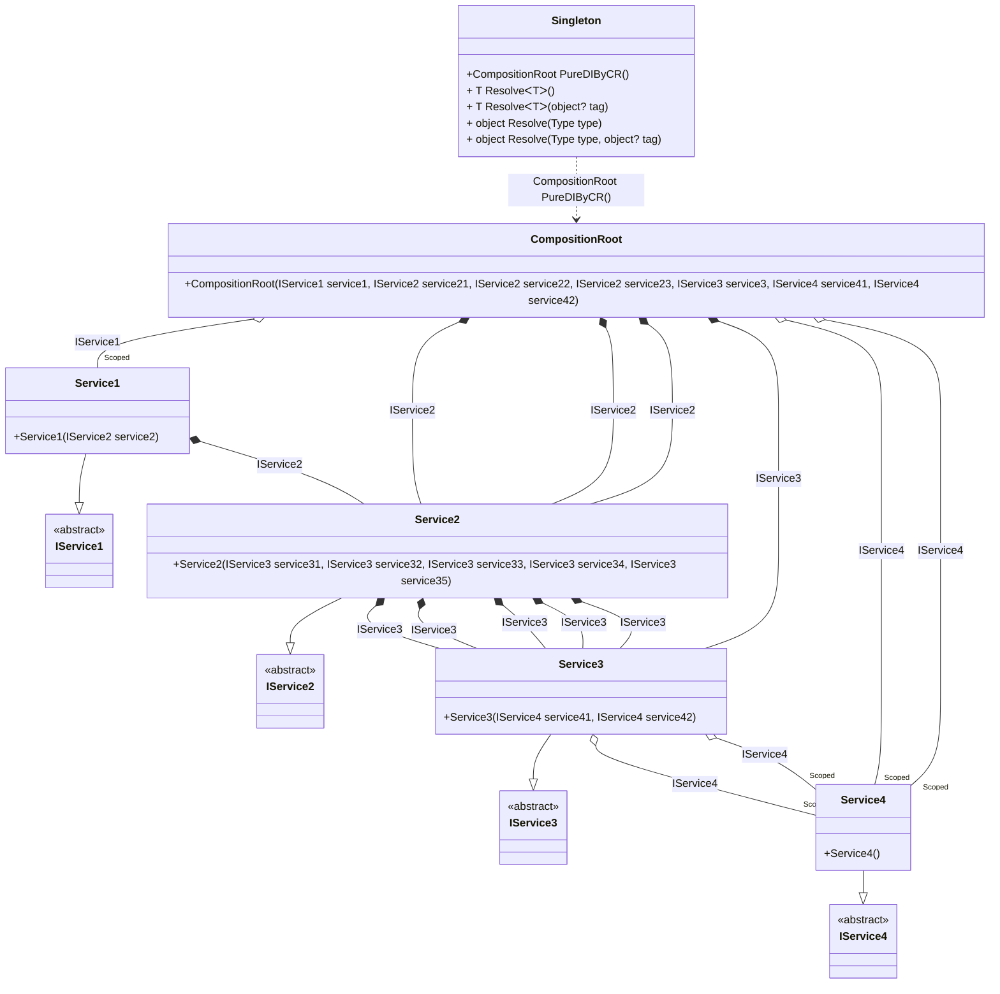

## Singleton details

Creating an object graph of 20 transition objects plus 1 singleton with an additional 6 transition objects .

### Class diagram


### Generated code

<details>
<summary>Pure.DI-generated partial class Singleton</summary><blockquote>

```c#
partial class Singleton
{
  private readonly Singleton _rootM03D20di;
  private Pure.DI.Benchmarks.Model.Service1 _scopedM03D20di35_Service1;
  private Pure.DI.Benchmarks.Model.Service4 _scopedM03D20di38_Service4;
  
  public Singleton()
  {
    _rootM03D20di = this;
  }
  
  internal Singleton(Singleton baseComposition)
  {
    _rootM03D20di = baseComposition._rootM03D20di;
  }
  
  public partial Pure.DI.Benchmarks.Model.CompositionRoot PureDIByCR()
  {
    if (ReferenceEquals(_scopedM03D20di38_Service4, null))
    {
        _scopedM03D20di38_Service4 = new Pure.DI.Benchmarks.Model.Service4();
    }
    if (ReferenceEquals(_scopedM03D20di35_Service1, null))
    {
        _scopedM03D20di35_Service1 = new Pure.DI.Benchmarks.Model.Service1(new Pure.DI.Benchmarks.Model.Service2(new Pure.DI.Benchmarks.Model.Service3(_scopedM03D20di38_Service4, _scopedM03D20di38_Service4), new Pure.DI.Benchmarks.Model.Service3(_scopedM03D20di38_Service4, _scopedM03D20di38_Service4), new Pure.DI.Benchmarks.Model.Service3(_scopedM03D20di38_Service4, _scopedM03D20di38_Service4), new Pure.DI.Benchmarks.Model.Service3(_scopedM03D20di38_Service4, _scopedM03D20di38_Service4), new Pure.DI.Benchmarks.Model.Service3(_scopedM03D20di38_Service4, _scopedM03D20di38_Service4)));
    }
    return new Pure.DI.Benchmarks.Model.CompositionRoot(_scopedM03D20di35_Service1, new Pure.DI.Benchmarks.Model.Service2(new Pure.DI.Benchmarks.Model.Service3(_scopedM03D20di38_Service4, _scopedM03D20di38_Service4), new Pure.DI.Benchmarks.Model.Service3(_scopedM03D20di38_Service4, _scopedM03D20di38_Service4), new Pure.DI.Benchmarks.Model.Service3(_scopedM03D20di38_Service4, _scopedM03D20di38_Service4), new Pure.DI.Benchmarks.Model.Service3(_scopedM03D20di38_Service4, _scopedM03D20di38_Service4), new Pure.DI.Benchmarks.Model.Service3(_scopedM03D20di38_Service4, _scopedM03D20di38_Service4)), new Pure.DI.Benchmarks.Model.Service2(new Pure.DI.Benchmarks.Model.Service3(_scopedM03D20di38_Service4, _scopedM03D20di38_Service4), new Pure.DI.Benchmarks.Model.Service3(_scopedM03D20di38_Service4, _scopedM03D20di38_Service4), new Pure.DI.Benchmarks.Model.Service3(_scopedM03D20di38_Service4, _scopedM03D20di38_Service4), new Pure.DI.Benchmarks.Model.Service3(_scopedM03D20di38_Service4, _scopedM03D20di38_Service4), new Pure.DI.Benchmarks.Model.Service3(_scopedM03D20di38_Service4, _scopedM03D20di38_Service4)), new Pure.DI.Benchmarks.Model.Service2(new Pure.DI.Benchmarks.Model.Service3(_scopedM03D20di38_Service4, _scopedM03D20di38_Service4), new Pure.DI.Benchmarks.Model.Service3(_scopedM03D20di38_Service4, _scopedM03D20di38_Service4), new Pure.DI.Benchmarks.Model.Service3(_scopedM03D20di38_Service4, _scopedM03D20di38_Service4), new Pure.DI.Benchmarks.Model.Service3(_scopedM03D20di38_Service4, _scopedM03D20di38_Service4), new Pure.DI.Benchmarks.Model.Service3(_scopedM03D20di38_Service4, _scopedM03D20di38_Service4)), new Pure.DI.Benchmarks.Model.Service3(_scopedM03D20di38_Service4, _scopedM03D20di38_Service4), _scopedM03D20di38_Service4, _scopedM03D20di38_Service4);
  }
  
  public T Resolve<T>()
  {
    return ResolverM03D20di<T>.Value.Resolve(this);
  }
  
  public T Resolve<T>(object? tag)
  {
    return ResolverM03D20di<T>.Value.ResolveByTag(this, tag);
  }
  
  public object Resolve(global::System.Type type)
  {
    var index = (int)(_bucketSizeM03D20di * ((uint)global::System.Runtime.CompilerServices.RuntimeHelpers.GetHashCode(type) % 1));
    var finish = index + _bucketSizeM03D20di;
    do {
      ref var pair = ref _bucketsM03D20di[index];
      if (ReferenceEquals(pair.Key, type))
      {
        return pair.Value.Resolve(this);
      }
    } while (++index < finish);
    
    throw new global::System.InvalidOperationException($"Cannot resolve composition root of type {type}.");
  }
  
  public object Resolve(global::System.Type type, object? tag)
  {
    var index = (int)(_bucketSizeM03D20di * ((uint)global::System.Runtime.CompilerServices.RuntimeHelpers.GetHashCode(type) % 1));
    var finish = index + _bucketSizeM03D20di;
    do {
      ref var pair = ref _bucketsM03D20di[index];
      if (ReferenceEquals(pair.Key, type))
      {
        return pair.Value.ResolveByTag(this, tag);
      }
    } while (++index < finish);
    
    throw new global::System.InvalidOperationException($"Cannot resolve composition root \"{tag}\" of type {type}.");
  }
  
  public override string ToString()
  {
    return
      "classDiagram\n" +
        "  class Singleton {\n" +
          "    +CompositionRoot PureDIByCR()\n" +
          "    + T ResolveᐸTᐳ()\n" +
          "    + T ResolveᐸTᐳ(object? tag)\n" +
          "    + object Resolve(Type type)\n" +
          "    + object Resolve(Type type, object? tag)\n" +
        "  }\n" +
        "  class CompositionRoot {\n" +
          "    +CompositionRoot(IService1 service1, IService2 service21, IService2 service22, IService2 service23, IService3 service3, IService4 service41, IService4 service42)\n" +
        "  }\n" +
        "  Service1 --|> IService1 : \n" +
        "  class Service1 {\n" +
          "    +Service1(IService2 service2)\n" +
        "  }\n" +
        "  Service2 --|> IService2 : \n" +
        "  class Service2 {\n" +
          "    +Service2(IService3 service31, IService3 service32, IService3 service33, IService3 service34, IService3 service35)\n" +
        "  }\n" +
        "  Service3 --|> IService3 : \n" +
        "  class Service3 {\n" +
          "    +Service3(IService4 service41, IService4 service42)\n" +
        "  }\n" +
        "  Service4 --|> IService4 : \n" +
        "  class Service4 {\n" +
          "    +Service4()\n" +
        "  }\n" +
        "  class IService1 {\n" +
          "    <<abstract>>\n" +
        "  }\n" +
        "  class IService2 {\n" +
          "    <<abstract>>\n" +
        "  }\n" +
        "  class IService3 {\n" +
          "    <<abstract>>\n" +
        "  }\n" +
        "  class IService4 {\n" +
          "    <<abstract>>\n" +
        "  }\n" +
        "  CompositionRoot o--  \"Scoped\" Service1 : IService1\n" +
        "  CompositionRoot *--  Service2 : IService2\n" +
        "  CompositionRoot *--  Service2 : IService2\n" +
        "  CompositionRoot *--  Service2 : IService2\n" +
        "  CompositionRoot *--  Service3 : IService3\n" +
        "  CompositionRoot o--  \"Scoped\" Service4 : IService4\n" +
        "  CompositionRoot o--  \"Scoped\" Service4 : IService4\n" +
        "  Service1 *--  Service2 : IService2\n" +
        "  Service2 *--  Service3 : IService3\n" +
        "  Service2 *--  Service3 : IService3\n" +
        "  Service2 *--  Service3 : IService3\n" +
        "  Service2 *--  Service3 : IService3\n" +
        "  Service2 *--  Service3 : IService3\n" +
        "  Service3 o--  \"Scoped\" Service4 : IService4\n" +
        "  Service3 o--  \"Scoped\" Service4 : IService4\n" +
        "  Singleton ..> CompositionRoot : CompositionRoot PureDIByCR()";
  }
  
  private readonly static int _bucketSizeM03D20di;
  private readonly static global::Pure.DI.Pair<global::System.Type, global::Pure.DI.IResolver<Singleton, object>>[] _bucketsM03D20di;
  
  static Singleton()
  {
    var valResolverM03D20di_0000 = new ResolverM03D20di_0000();
    ResolverM03D20di<Pure.DI.Benchmarks.Model.CompositionRoot>.Value = valResolverM03D20di_0000;
    _bucketsM03D20di = global::Pure.DI.Buckets<global::System.Type, global::Pure.DI.IResolver<Singleton, object>>.Create(
      1,
      out _bucketSizeM03D20di,
      new global::Pure.DI.Pair<global::System.Type, global::Pure.DI.IResolver<Singleton, object>>[1]
      {
         new global::Pure.DI.Pair<global::System.Type, global::Pure.DI.IResolver<Singleton, object>>(typeof(Pure.DI.Benchmarks.Model.CompositionRoot), valResolverM03D20di_0000)
      });
  }
  
  private sealed class ResolverM03D20di<T>: global::Pure.DI.IResolver<Singleton, T>
  {
    public static global::Pure.DI.IResolver<Singleton, T> Value = new ResolverM03D20di<T>();
    
    public T Resolve(Singleton composite)
    {
      throw new global::System.InvalidOperationException($"Cannot resolve composition root of type {typeof(T)}.");
    }
    
    public T ResolveByTag(Singleton composite, object tag)
    {
      throw new global::System.InvalidOperationException($"Cannot resolve composition root \"{tag}\" of type {typeof(T)}.");
    }
  }
  
  private sealed class ResolverM03D20di_0000: global::Pure.DI.IResolver<Singleton, Pure.DI.Benchmarks.Model.CompositionRoot>
  {
    public Pure.DI.Benchmarks.Model.CompositionRoot Resolve(Singleton composition)
    {
      return composition.PureDIByCR();
    }
    
    public Pure.DI.Benchmarks.Model.CompositionRoot ResolveByTag(Singleton composition, object tag)
    {
      switch (tag)
      {
        case null:
          return composition.PureDIByCR();
      }
      throw new global::System.InvalidOperationException($"Cannot resolve composition root \"{tag}\" of type Pure.DI.Benchmarks.Model.CompositionRoot.");
    }
  }
}
```

</blockquote></details>

