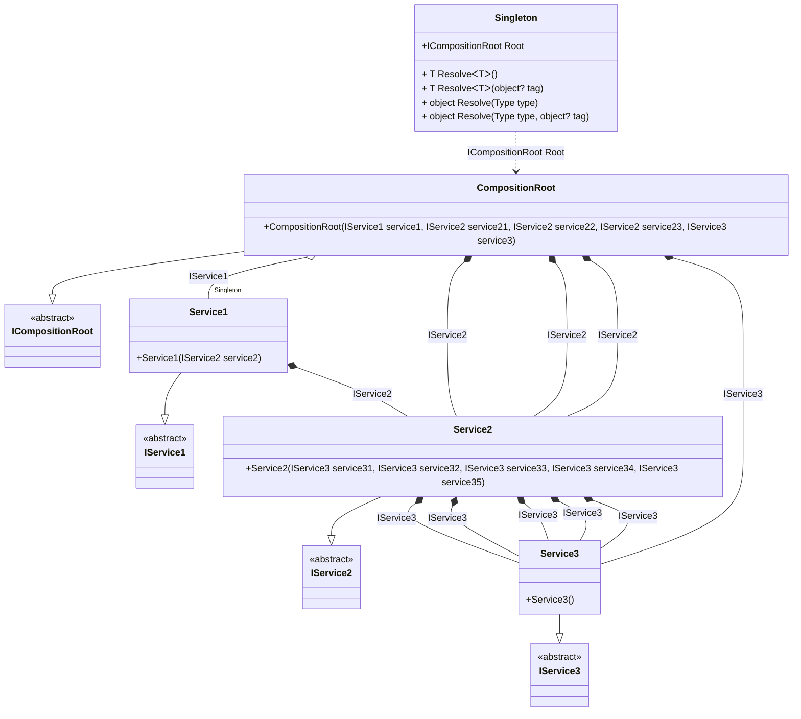

## Singleton details

Creating an object graph of 20 transition objects plus 1 singleton with an additional 6 transition objects .

### Class diagram


### Generated code

<details>
<summary>Pure.DI-generated partial class Singleton</summary><blockquote>

```c#
partial class Singleton
{
  private readonly global::System.IDisposable[] _disposableSingletonsM11D06di;
  private Pure.DI.Benchmarks.Model.Service1 _singletonM11D06di22;
  
  public Singleton()
  {
    _disposableSingletonsM11D06di = new global::System.IDisposable[0];
  }
  
  internal Singleton(Singleton parent)
  {
    _disposableSingletonsM11D06di = new global::System.IDisposable[0];
    lock (parent._disposableSingletonsM11D06di)
    {
      _singletonM11D06di22 = parent._singletonM11D06di22;
    }
  }
  
  #region Composition Roots
  public Pure.DI.Benchmarks.Model.ICompositionRoot Root
  {
    [global::System.Runtime.CompilerServices.MethodImpl((global::System.Runtime.CompilerServices.MethodImplOptions)0x300)]
    get
    {
      var transientM11D06di19 = new Pure.DI.Benchmarks.Model.Service3();
      var transientM11D06di18 = new Pure.DI.Benchmarks.Model.Service3();
      var transientM11D06di17 = new Pure.DI.Benchmarks.Model.Service3();
      var transientM11D06di16 = new Pure.DI.Benchmarks.Model.Service3();
      var transientM11D06di15 = new Pure.DI.Benchmarks.Model.Service3();
      var transientM11D06di14 = new Pure.DI.Benchmarks.Model.Service3();
      var transientM11D06di13 = new Pure.DI.Benchmarks.Model.Service3();
      var transientM11D06di12 = new Pure.DI.Benchmarks.Model.Service3();
      var transientM11D06di11 = new Pure.DI.Benchmarks.Model.Service3();
      var transientM11D06di10 = new Pure.DI.Benchmarks.Model.Service3();
      var transientM11D06di9 = new Pure.DI.Benchmarks.Model.Service3();
      var transientM11D06di8 = new Pure.DI.Benchmarks.Model.Service3();
      var transientM11D06di7 = new Pure.DI.Benchmarks.Model.Service3();
      var transientM11D06di6 = new Pure.DI.Benchmarks.Model.Service3();
      var transientM11D06di5 = new Pure.DI.Benchmarks.Model.Service3();
      var transientM11D06di4 = new Pure.DI.Benchmarks.Model.Service3();
      var transientM11D06di3 = new Pure.DI.Benchmarks.Model.Service2(transientM11D06di5, transientM11D06di6, transientM11D06di7, transientM11D06di8, transientM11D06di9);
      var transientM11D06di2 = new Pure.DI.Benchmarks.Model.Service2(transientM11D06di10, transientM11D06di11, transientM11D06di12, transientM11D06di13, transientM11D06di14);
      var transientM11D06di1 = new Pure.DI.Benchmarks.Model.Service2(transientM11D06di15, transientM11D06di16, transientM11D06di17, transientM11D06di18, transientM11D06di19);
      if (object.ReferenceEquals(_singletonM11D06di22, null))
      {
          var transientM11D06di25 = new Pure.DI.Benchmarks.Model.Service3();
          var transientM11D06di24 = new Pure.DI.Benchmarks.Model.Service3();
          var transientM11D06di23 = new Pure.DI.Benchmarks.Model.Service3();
          var transientM11D06di22 = new Pure.DI.Benchmarks.Model.Service3();
          var transientM11D06di21 = new Pure.DI.Benchmarks.Model.Service3();
          var transientM11D06di20 = new Pure.DI.Benchmarks.Model.Service2(transientM11D06di21, transientM11D06di22, transientM11D06di23, transientM11D06di24, transientM11D06di25);
          _singletonM11D06di22 = new Pure.DI.Benchmarks.Model.Service1(transientM11D06di20);
      }
      var transientM11D06di0 = new Pure.DI.Benchmarks.Model.CompositionRoot(_singletonM11D06di22, transientM11D06di1, transientM11D06di2, transientM11D06di3, transientM11D06di4);
      return transientM11D06di0;
    }
  }
  #endregion
  
  #region API
  #if NETSTANDARD2_0_OR_GREATER || NETCOREAPP || NET40_OR_GREATER
  [global::System.Diagnostics.Contracts.Pure]
  #endif
  [global::System.Runtime.CompilerServices.MethodImpl((global::System.Runtime.CompilerServices.MethodImplOptions)0x300)]
  public T Resolve<T>()
  {
    return ResolverM11D06di<T>.Value.Resolve(this);
  }
  
  #if NETSTANDARD2_0_OR_GREATER || NETCOREAPP || NET40_OR_GREATER
  [global::System.Diagnostics.Contracts.Pure]
  #endif
  [global::System.Runtime.CompilerServices.MethodImpl((global::System.Runtime.CompilerServices.MethodImplOptions)0x300)]
  public T Resolve<T>(object? tag)
  {
    return ResolverM11D06di<T>.Value.ResolveByTag(this, tag);
  }
  
  #if NETSTANDARD2_0_OR_GREATER || NETCOREAPP || NET40_OR_GREATER
  [global::System.Diagnostics.Contracts.Pure]
  #endif
  [global::System.Runtime.CompilerServices.MethodImpl((global::System.Runtime.CompilerServices.MethodImplOptions)0x300)]
  public object Resolve(global::System.Type type)
  {
    var index = (int)(_bucketSizeM11D06di * ((uint)global::System.Runtime.CompilerServices.RuntimeHelpers.GetHashCode(type) % 1));
    var finish = index + _bucketSizeM11D06di;
    do {
      ref var pair = ref _bucketsM11D06di[index];
      if (ReferenceEquals(pair.Key, type))
      {
        return pair.Value.Resolve(this);
      }
    } while (++index < finish);
    
    throw new global::System.InvalidOperationException($"Cannot resolve composition root of type {type}.");
  }
  
  #if NETSTANDARD2_0_OR_GREATER || NETCOREAPP || NET40_OR_GREATER
  [global::System.Diagnostics.Contracts.Pure]
  #endif
  [global::System.Runtime.CompilerServices.MethodImpl((global::System.Runtime.CompilerServices.MethodImplOptions)0x300)]
  public object Resolve(global::System.Type type, object? tag)
  {
    var index = (int)(_bucketSizeM11D06di * ((uint)global::System.Runtime.CompilerServices.RuntimeHelpers.GetHashCode(type) % 1));
    var finish = index + _bucketSizeM11D06di;
    do {
      ref var pair = ref _bucketsM11D06di[index];
      if (ReferenceEquals(pair.Key, type))
      {
        return pair.Value.ResolveByTag(this, tag);
      }
    } while (++index < finish);
    
    throw new global::System.InvalidOperationException($"Cannot resolve composition root \"{tag}\" of type {type}.");
  }
  #endregion
  
  public override string ToString()
  {
    return
      "classDiagram\n" +
        "  class Singleton {\n" +
          "    +ICompositionRoot Root\n" +
          "    + T ResolveᐸTᐳ()\n" +
          "    + T ResolveᐸTᐳ(object? tag)\n" +
          "    + object Resolve(Type type)\n" +
          "    + object Resolve(Type type, object? tag)\n" +
        "  }\n" +
        "  CompositionRoot --|> ICompositionRoot : \n" +
        "  class CompositionRoot {\n" +
          "    +CompositionRoot(IService1 service1, IService2 service21, IService2 service22, IService2 service23, IService3 service3)\n" +
        "  }\n" +
        "  Service2 --|> IService2 : \n" +
        "  class Service2 {\n" +
          "    +Service2(IService3 service31, IService3 service32, IService3 service33, IService3 service34, IService3 service35)\n" +
        "  }\n" +
        "  Service1 --|> IService1 : \n" +
        "  class Service1 {\n" +
          "    +Service1(IService2 service2)\n" +
        "  }\n" +
        "  Service3 --|> IService3 : \n" +
        "  class Service3 {\n" +
          "    +Service3()\n" +
        "  }\n" +
        "  class ICompositionRoot {\n" +
          "    <<abstract>>\n" +
        "  }\n" +
        "  class IService2 {\n" +
          "    <<abstract>>\n" +
        "  }\n" +
        "  class IService1 {\n" +
          "    <<abstract>>\n" +
        "  }\n" +
        "  class IService3 {\n" +
          "    <<abstract>>\n" +
        "  }\n" +
        "  CompositionRoot o--  \"Singleton\" Service1 : IService1\n" +
        "  CompositionRoot *--  Service2 : IService2\n" +
        "  CompositionRoot *--  Service2 : IService2\n" +
        "  CompositionRoot *--  Service2 : IService2\n" +
        "  CompositionRoot *--  Service3 : IService3\n" +
        "  Service2 *--  Service3 : IService3\n" +
        "  Service2 *--  Service3 : IService3\n" +
        "  Service2 *--  Service3 : IService3\n" +
        "  Service2 *--  Service3 : IService3\n" +
        "  Service2 *--  Service3 : IService3\n" +
        "  Service1 *--  Service2 : IService2\n" +
        "  Singleton ..> CompositionRoot : ICompositionRoot Root";
  }
  
  private readonly static int _bucketSizeM11D06di;
  private readonly static global::Pure.DI.Pair<global::System.Type, global::Pure.DI.IResolver<Singleton, object>>[] _bucketsM11D06di;
  
  
  static Singleton()
  {
    var valResolverM11D06di_0000 = new ResolverM11D06di_0000();
    ResolverM11D06di<Pure.DI.Benchmarks.Model.ICompositionRoot>.Value = valResolverM11D06di_0000;
    _bucketsM11D06di = global::Pure.DI.Buckets<global::System.Type, global::Pure.DI.IResolver<Singleton, object>>.Create(
      1,
      out _bucketSizeM11D06di,
      new global::Pure.DI.Pair<global::System.Type, global::Pure.DI.IResolver<Singleton, object>>[1]
      {
         new global::Pure.DI.Pair<global::System.Type, global::Pure.DI.IResolver<Singleton, object>>(typeof(Pure.DI.Benchmarks.Model.ICompositionRoot), valResolverM11D06di_0000)
      });
  }
  
  #region Resolvers
  private sealed class ResolverM11D06di<T>: global::Pure.DI.IResolver<Singleton, T>
  {
    public static global::Pure.DI.IResolver<Singleton, T> Value = new ResolverM11D06di<T>();
    
    public T Resolve(Singleton composite)
    {
      throw new global::System.InvalidOperationException($"Cannot resolve composition root of type {typeof(T)}.");
    }
    
    public T ResolveByTag(Singleton composite, object tag)
    {
      throw new global::System.InvalidOperationException($"Cannot resolve composition root \"{tag}\" of type {typeof(T)}.");
    }
  }
  
  private sealed class ResolverM11D06di_0000: global::Pure.DI.IResolver<Singleton, Pure.DI.Benchmarks.Model.ICompositionRoot>
  {
    [global::System.Runtime.CompilerServices.MethodImpl((global::System.Runtime.CompilerServices.MethodImplOptions)0x300)]
    public Pure.DI.Benchmarks.Model.ICompositionRoot Resolve(Singleton composition)
    {
      return composition.Root;
    }
    
    [global::System.Runtime.CompilerServices.MethodImpl((global::System.Runtime.CompilerServices.MethodImplOptions)0x300)]
    public Pure.DI.Benchmarks.Model.ICompositionRoot ResolveByTag(Singleton composition, object tag)
    {
      if (Equals(tag, null)) return composition.Root;
      throw new global::System.InvalidOperationException($"Cannot resolve composition root \"{tag}\" of type Pure.DI.Benchmarks.Model.ICompositionRoot.");
    }
  }
  #endregion
}
```

</blockquote></details>

