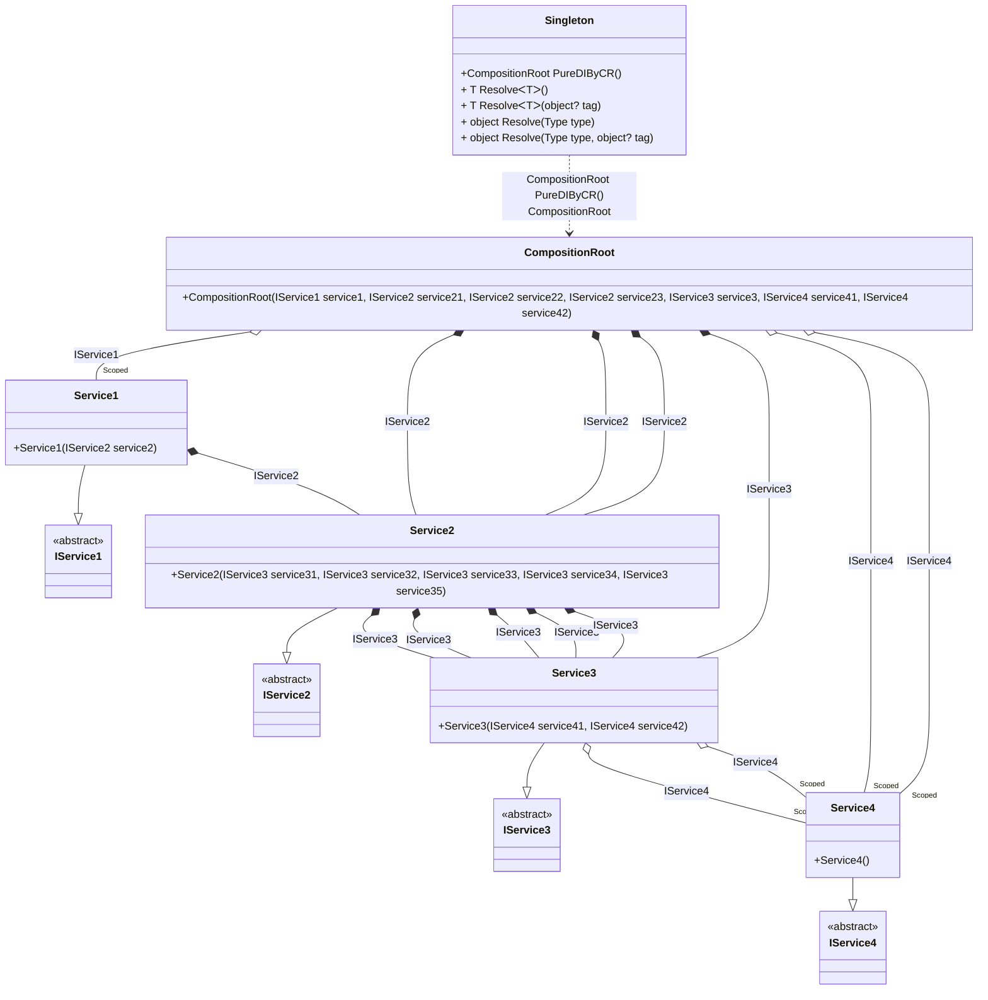

## Singleton details

Creating an object graph of 20 transition objects plus 1 singleton with an additional 6 transition objects .

### Class diagram


### Generated code

<details>
<summary>Pure.DI-generated partial class Singleton</summary><blockquote>

```c#
/// <para>
/// <b>Composition roots</b><br/>
/// <list type="table">
/// <listheader>
/// <term>Root</term>
/// <description>Description</description>
/// </listheader>
/// <item>
/// <term>
/// <see cref="Pure.DI.Benchmarks.Model.CompositionRoot"/> <see cref="PureDIByCR()"/><br/>or using <see cref="Resolve{T}()"/> method: <c>Resolve&lt;Pure.DI.Benchmarks.Model.CompositionRoot&gt;()</c>
/// </term>
/// <description>
/// Provides a composition root of type <see cref="Pure.DI.Benchmarks.Model.CompositionRoot"/>.
/// </description>
/// </item>
/// </list>
/// </para>
/// </summary>
/// <example>
/// This shows how to get an instance of type <see cref="Pure.DI.Benchmarks.Model.CompositionRoot"/> using the composition root <see cref="PureDIByCR()"/>:
/// <code>
/// var composition = new Singleton();
/// var instance = composition.PureDIByCR();
/// </code>
/// </example>
/// <a href="https://mermaid.live/view#pako:eNrlVktuwjAQvYrldaVSOxUtO0ioxK4Clt6ExKJpSRw5AQkh7sBduul1uEnzd2zipIRuqm6sRM_zZubNRz5Ah7kUjqCzsaPI8uw1t33CSZD9g4UXrDc0ZgEg28FgOEmR9AtNTOaHLPJijwVzxmLwuuXUmk325jzDn7LzWdwHSzCnEdvs6Pn0tTyfPq-6xlbv1InTb_wCYnt9YZZfKG1zo-U-pCBOjh63TdDucmgJkVQpOqTK3c0WlO88hz6AqPgo_JYAKgGkR5AWwQqCS0QFjBIwVDcCQU25V_FnoCXOoZmJNq2I8it4DGp9VUfqWpWALJLIqyUS1B0J0kaCdJEgORKhoyqXQNSqCERfFUOLPLakjLtTxtqUsS5lLKd8a4cY3UEa2iANXZBG0_6oT6XcfYIB585NexXF3C4mfFqcLTxqh_TlUWXvy2P05lH3FavXBwACFw4LqUugPKZJeSpNm2gy-7HMpc5dJeafI6jmqKpjLymrTq_K-Is08kq-Rgh5hV6jwD-zxDfWpr-99BJD2WDnZ7JHm_o4IfjhGy1bGytO7nO2kLOd59KLd00aBbyDPuW-7bnJk_FAYPxGfUrgiEDX5h8EHuHxG6YZZUo">Class diagram</a><br/>
/// This class was created by <a href="https://github.com/DevTeam/Pure.DI">Pure.DI</a> source code generator.
/// <seealso cref="Pure.DI.DI.Setup"/>
/// <seealso cref="Pure.DI.IConfiguration.Bind(object[])"/>
/// <seealso cref="Pure.DI.IConfiguration.Bind{T}(object[])"/>
[global::System.Diagnostics.CodeAnalysis.ExcludeFromCodeCoverage]
partial class Singleton
{
  private readonly Singleton _rootM03D13di;
  private Pure.DI.Benchmarks.Model.Service1 _scopedM03D13di35_Service1;
  private Pure.DI.Benchmarks.Model.Service4 _scopedM03D13di38_Service4;
  
  /// <summary>
  /// This constructor creates a new instance of <see cref="Singleton"/>.
  /// </summary>
  public Singleton()
  {
    _rootM03D13di = this;
  }
  
  /// <summary>
  /// This constructor creates a new instance of <see cref="Singleton"/> scope based on <paramref name="baseComposition"/>. This allows the <see cref="Lifetime.Scoped"/> life time to be applied.
  /// </summary>
  /// <param name="baseComposition">Base composition.</param>
  internal Singleton(Singleton baseComposition)
  {
    _rootM03D13di = baseComposition._rootM03D13di;
  }
  
  #region Composition Roots
  /// <summary>
  /// Provides a composition root of type <see cref="Pure.DI.Benchmarks.Model.CompositionRoot"/>.
  /// </summary>
  /// <example>
  /// This shows how to get an instance of type <see cref="Pure.DI.Benchmarks.Model.CompositionRoot"/>:
  /// <code>
  /// var composition = new Singleton();
  /// var instance = composition.PureDIByCR();
  /// </code>
  /// </example>
  #if NETSTANDARD2_0_OR_GREATER || NETCOREAPP || NET40_OR_GREATER || NET
  [global::System.Diagnostics.Contracts.Pure]
  #endif
  public partial Pure.DI.Benchmarks.Model.CompositionRoot PureDIByCR()
  {
    if (ReferenceEquals(_scopedM03D13di38_Service4, null))
    {
        _scopedM03D13di38_Service4 = new Pure.DI.Benchmarks.Model.Service4();
    }
    if (ReferenceEquals(_scopedM03D13di35_Service1, null))
    {
        _scopedM03D13di35_Service1 = new Pure.DI.Benchmarks.Model.Service1(new Pure.DI.Benchmarks.Model.Service2(new Pure.DI.Benchmarks.Model.Service3(_scopedM03D13di38_Service4, _scopedM03D13di38_Service4), new Pure.DI.Benchmarks.Model.Service3(_scopedM03D13di38_Service4, _scopedM03D13di38_Service4), new Pure.DI.Benchmarks.Model.Service3(_scopedM03D13di38_Service4, _scopedM03D13di38_Service4), new Pure.DI.Benchmarks.Model.Service3(_scopedM03D13di38_Service4, _scopedM03D13di38_Service4), new Pure.DI.Benchmarks.Model.Service3(_scopedM03D13di38_Service4, _scopedM03D13di38_Service4)));
    }
    return new Pure.DI.Benchmarks.Model.CompositionRoot(_scopedM03D13di35_Service1, new Pure.DI.Benchmarks.Model.Service2(new Pure.DI.Benchmarks.Model.Service3(_scopedM03D13di38_Service4, _scopedM03D13di38_Service4), new Pure.DI.Benchmarks.Model.Service3(_scopedM03D13di38_Service4, _scopedM03D13di38_Service4), new Pure.DI.Benchmarks.Model.Service3(_scopedM03D13di38_Service4, _scopedM03D13di38_Service4), new Pure.DI.Benchmarks.Model.Service3(_scopedM03D13di38_Service4, _scopedM03D13di38_Service4), new Pure.DI.Benchmarks.Model.Service3(_scopedM03D13di38_Service4, _scopedM03D13di38_Service4)), new Pure.DI.Benchmarks.Model.Service2(new Pure.DI.Benchmarks.Model.Service3(_scopedM03D13di38_Service4, _scopedM03D13di38_Service4), new Pure.DI.Benchmarks.Model.Service3(_scopedM03D13di38_Service4, _scopedM03D13di38_Service4), new Pure.DI.Benchmarks.Model.Service3(_scopedM03D13di38_Service4, _scopedM03D13di38_Service4), new Pure.DI.Benchmarks.Model.Service3(_scopedM03D13di38_Service4, _scopedM03D13di38_Service4), new Pure.DI.Benchmarks.Model.Service3(_scopedM03D13di38_Service4, _scopedM03D13di38_Service4)), new Pure.DI.Benchmarks.Model.Service2(new Pure.DI.Benchmarks.Model.Service3(_scopedM03D13di38_Service4, _scopedM03D13di38_Service4), new Pure.DI.Benchmarks.Model.Service3(_scopedM03D13di38_Service4, _scopedM03D13di38_Service4), new Pure.DI.Benchmarks.Model.Service3(_scopedM03D13di38_Service4, _scopedM03D13di38_Service4), new Pure.DI.Benchmarks.Model.Service3(_scopedM03D13di38_Service4, _scopedM03D13di38_Service4), new Pure.DI.Benchmarks.Model.Service3(_scopedM03D13di38_Service4, _scopedM03D13di38_Service4)), new Pure.DI.Benchmarks.Model.Service3(_scopedM03D13di38_Service4, _scopedM03D13di38_Service4), _scopedM03D13di38_Service4, _scopedM03D13di38_Service4);
  }
  #endregion
  
  #region API
  /// <summary>
  /// Resolves the composition root.
  /// </summary>
  /// <typeparam name="T">The type of the composition root.</typeparam>
  /// <returns>A composition root.</returns>
  #if NETSTANDARD2_0_OR_GREATER || NETCOREAPP || NET40_OR_GREATER || NET
  [global::System.Diagnostics.Contracts.Pure]
  #endif
  public T Resolve<T>()
  {
    return ResolverM03D13di<T>.Value.Resolve(this);
  }
  
  /// <summary>
  /// Resolves the composition root by tag.
  /// </summary>
  /// <typeparam name="T">The type of the composition root.</typeparam>
  /// <param name="tag">The tag of a composition root.</param>
  /// <returns>A composition root.</returns>
  #if NETSTANDARD2_0_OR_GREATER || NETCOREAPP || NET40_OR_GREATER || NET
  [global::System.Diagnostics.Contracts.Pure]
  #endif
  public T Resolve<T>(object? tag)
  {
    return ResolverM03D13di<T>.Value.ResolveByTag(this, tag);
  }
  
  /// <summary>
  /// Resolves the composition root.
  /// </summary>
  /// <param name="type">The type of the composition root.</param>
  /// <returns>A composition root.</returns>
  #if NETSTANDARD2_0_OR_GREATER || NETCOREAPP || NET40_OR_GREATER || NET
  [global::System.Diagnostics.Contracts.Pure]
  #endif
  public object Resolve(global::System.Type type)
  {
    var index = (int)(_bucketSizeM03D13di * ((uint)global::System.Runtime.CompilerServices.RuntimeHelpers.GetHashCode(type) % 1));
    var finish = index + _bucketSizeM03D13di;
    do {
      ref var pair = ref _bucketsM03D13di[index];
      if (ReferenceEquals(pair.Key, type))
      {
        return pair.Value.Resolve(this);
      }
    } while (++index < finish);
    
    throw new global::System.InvalidOperationException($"Cannot resolve composition root of type {type}.");
  }
  
  /// <summary>
  /// Resolves the composition root by tag.
  /// </summary>
  /// <param name="type">The type of the composition root.</param>
  /// <param name="tag">The tag of a composition root.</param>
  /// <returns>A composition root.</returns>
  #if NETSTANDARD2_0_OR_GREATER || NETCOREAPP || NET40_OR_GREATER || NET
  [global::System.Diagnostics.Contracts.Pure]
  #endif
  public object Resolve(global::System.Type type, object? tag)
  {
    var index = (int)(_bucketSizeM03D13di * ((uint)global::System.Runtime.CompilerServices.RuntimeHelpers.GetHashCode(type) % 1));
    var finish = index + _bucketSizeM03D13di;
    do {
      ref var pair = ref _bucketsM03D13di[index];
      if (ReferenceEquals(pair.Key, type))
      {
        return pair.Value.ResolveByTag(this, tag);
      }
    } while (++index < finish);
    
    throw new global::System.InvalidOperationException($"Cannot resolve composition root \"{tag}\" of type {type}.");
  }
  #endregion
  
  /// <summary>
  /// This method provides a class diagram in mermaid format. To see this diagram, simply call the method and copy the text to this site https://mermaid.live/.
  /// </summary>
  public override string ToString()
  {
    return
      "classDiagram\n" +
        "  class Singleton {\n" +
          "    +CompositionRoot PureDIByCR()\n" +
          "    + T ResolveᐸTᐳ()\n" +
          "    + T ResolveᐸTᐳ(object? tag)\n" +
          "    + object Resolve(Type type)\n" +
          "    + object Resolve(Type type, object? tag)\n" +
        "  }\n" +
        "  class CompositionRoot {\n" +
          "    +CompositionRoot(IService1 service1, IService2 service21, IService2 service22, IService2 service23, IService3 service3, IService4 service41, IService4 service42)\n" +
        "  }\n" +
        "  Service1 --|> IService1 : \n" +
        "  class Service1 {\n" +
          "    +Service1(IService2 service2)\n" +
        "  }\n" +
        "  Service2 --|> IService2 : \n" +
        "  class Service2 {\n" +
          "    +Service2(IService3 service31, IService3 service32, IService3 service33, IService3 service34, IService3 service35)\n" +
        "  }\n" +
        "  Service3 --|> IService3 : \n" +
        "  class Service3 {\n" +
          "    +Service3(IService4 service41, IService4 service42)\n" +
        "  }\n" +
        "  Service4 --|> IService4 : \n" +
        "  class Service4 {\n" +
          "    +Service4()\n" +
        "  }\n" +
        "  class IService1 {\n" +
          "    <<abstract>>\n" +
        "  }\n" +
        "  class IService2 {\n" +
          "    <<abstract>>\n" +
        "  }\n" +
        "  class IService3 {\n" +
          "    <<abstract>>\n" +
        "  }\n" +
        "  class IService4 {\n" +
          "    <<abstract>>\n" +
        "  }\n" +
        "  CompositionRoot o--  \"Scoped\" Service1 : IService1\n" +
        "  CompositionRoot *--  Service2 : IService2\n" +
        "  CompositionRoot *--  Service2 : IService2\n" +
        "  CompositionRoot *--  Service2 : IService2\n" +
        "  CompositionRoot *--  Service3 : IService3\n" +
        "  CompositionRoot o--  \"Scoped\" Service4 : IService4\n" +
        "  CompositionRoot o--  \"Scoped\" Service4 : IService4\n" +
        "  Service1 *--  Service2 : IService2\n" +
        "  Service2 *--  Service3 : IService3\n" +
        "  Service2 *--  Service3 : IService3\n" +
        "  Service2 *--  Service3 : IService3\n" +
        "  Service2 *--  Service3 : IService3\n" +
        "  Service2 *--  Service3 : IService3\n" +
        "  Service3 o--  \"Scoped\" Service4 : IService4\n" +
        "  Service3 o--  \"Scoped\" Service4 : IService4\n" +
        "  Singleton ..> CompositionRoot : CompositionRoot PureDIByCR()<br/>provides CompositionRoot";
  }
  
  private readonly static int _bucketSizeM03D13di;
  private readonly static global::Pure.DI.Pair<global::System.Type, global::Pure.DI.IResolver<Singleton, object>>[] _bucketsM03D13di;
  
  static Singleton()
  {
    var valResolverM03D13di_0000 = new ResolverM03D13di_0000();
    ResolverM03D13di<Pure.DI.Benchmarks.Model.CompositionRoot>.Value = valResolverM03D13di_0000;
    _bucketsM03D13di = global::Pure.DI.Buckets<global::System.Type, global::Pure.DI.IResolver<Singleton, object>>.Create(
      1,
      out _bucketSizeM03D13di,
      new global::Pure.DI.Pair<global::System.Type, global::Pure.DI.IResolver<Singleton, object>>[1]
      {
         new global::Pure.DI.Pair<global::System.Type, global::Pure.DI.IResolver<Singleton, object>>(typeof(Pure.DI.Benchmarks.Model.CompositionRoot), valResolverM03D13di_0000)
      });
  }
  
  #region Resolvers
  private sealed class ResolverM03D13di<T>: global::Pure.DI.IResolver<Singleton, T>
  {
    public static global::Pure.DI.IResolver<Singleton, T> Value = new ResolverM03D13di<T>();
    
    public T Resolve(Singleton composite)
    {
      throw new global::System.InvalidOperationException($"Cannot resolve composition root of type {typeof(T)}.");
    }
    
    public T ResolveByTag(Singleton composite, object tag)
    {
      throw new global::System.InvalidOperationException($"Cannot resolve composition root \"{tag}\" of type {typeof(T)}.");
    }
  }
  
  private sealed class ResolverM03D13di_0000: global::Pure.DI.IResolver<Singleton, Pure.DI.Benchmarks.Model.CompositionRoot>
  {
    public Pure.DI.Benchmarks.Model.CompositionRoot Resolve(Singleton composition)
    {
      return composition.PureDIByCR();
    }
    
    public Pure.DI.Benchmarks.Model.CompositionRoot ResolveByTag(Singleton composition, object tag)
    {
      switch (tag)
      {
        case null:
          return composition.PureDIByCR();
      }
      throw new global::System.InvalidOperationException($"Cannot resolve composition root \"{tag}\" of type Pure.DI.Benchmarks.Model.CompositionRoot.");
    }
  }
  #endregion
}
```

</blockquote></details>

