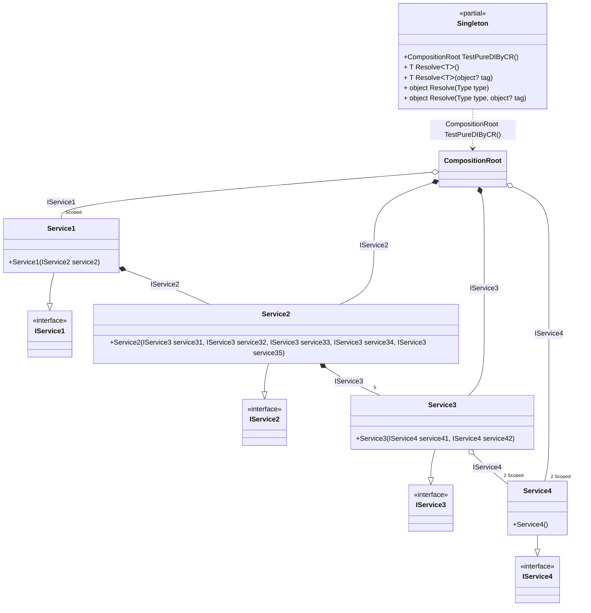

## Singleton details

Creating an object graph of 20 transition objects plus 1 singleton with an additional 6 transition objects .

### Class diagram


### Generated code

The following partial class will be generated:

```c#
partial class Singleton
{
  private readonly Singleton _root;

  private Service1? _scopedService139;
  private Service4? _scopedService442;

  [OrdinalAttribute(20)]
  public Singleton()
  {
    _root = this;
  }

  internal Singleton(Singleton parentScope)
  {
    _root = (parentScope ?? throw new ArgumentNullException(nameof(parentScope)))._root;
  }

  [MethodImpl(MethodImplOptions.AggressiveInlining)]
  public partial CompositionRoot TestPureDIByCR()
  {
    if (_scopedService442 is null)
    {
      _scopedService442 = new Service4();
    }

    if (_scopedService139 is null)
    {
      if (_scopedService442 is null)
      {
        _scopedService442 = new Service4();
      }

      _scopedService139 = new Service1(new Service2(new Service3(_scopedService442!, _scopedService442!), new Service3(_scopedService442!, _scopedService442!), new Service3(_scopedService442!, _scopedService442!), new Service3(_scopedService442!, _scopedService442!), new Service3(_scopedService442!, _scopedService442!)));
    }

    return new CompositionRoot(_scopedService139!, new Service2(new Service3(_scopedService442!, _scopedService442!), new Service3(_scopedService442!, _scopedService442!), new Service3(_scopedService442!, _scopedService442!), new Service3(_scopedService442!, _scopedService442!), new Service3(_scopedService442!, _scopedService442!)), new Service2(new Service3(_scopedService442!, _scopedService442!), new Service3(_scopedService442!, _scopedService442!), new Service3(_scopedService442!, _scopedService442!), new Service3(_scopedService442!, _scopedService442!), new Service3(_scopedService442!, _scopedService442!)), new Service2(new Service3(_scopedService442!, _scopedService442!), new Service3(_scopedService442!, _scopedService442!), new Service3(_scopedService442!, _scopedService442!), new Service3(_scopedService442!, _scopedService442!), new Service3(_scopedService442!, _scopedService442!)), new Service3(_scopedService442!, _scopedService442!), _scopedService442!, _scopedService442!);
  }

  [MethodImpl(MethodImplOptions.AggressiveInlining)]
  public T Resolve<T>()
  {
    return Resolver<T>.Value.Resolve(this);
  }

  [MethodImpl(MethodImplOptions.AggressiveInlining)]
  public T Resolve<T>(object? tag)
  {
    return Resolver<T>.Value.ResolveByTag(this, tag);
  }

  [MethodImpl(MethodImplOptions.AggressiveInlining)]
  public object Resolve(Type type)
  {
    var index = (int)(_bucketSize * ((uint)RuntimeHelpers.GetHashCode(type) % 1));
    ref var pair = ref _buckets[index];
    return pair.Key == type ? pair.Value.Resolve(this) : Resolve(type, index);
  }

  [MethodImpl(MethodImplOptions.NoInlining)]
  private object Resolve(Type type, int index)
  {
    var finish = index + _bucketSize;
    while (++index < finish)
    {
      ref var pair = ref _buckets[index];
      if (pair.Key == type)
      {
        return pair.Value.Resolve(this);
      }
    }

    throw new InvalidOperationException($"{CannotResolveMessage} {OfTypeMessage} {type}.");
  }

  [MethodImpl(MethodImplOptions.AggressiveInlining)]
  public object Resolve(Type type, object? tag)
  {
    var index = (int)(_bucketSize * ((uint)RuntimeHelpers.GetHashCode(type) % 1));
    ref var pair = ref _buckets[index];
    return pair.Key == type ? pair.Value.ResolveByTag(this, tag) : Resolve(type, tag, index);
  }

  [MethodImpl(MethodImplOptions.NoInlining)]
  private object Resolve(Type type, object? tag, int index)
  {
    var finish = index + _bucketSize;
    while (++index < finish)
    {
      ref var pair = ref _buckets[index];
      if (pair.Key == type)
      {
        return pair.Value.ResolveByTag(this, tag);
      }
    }

    throw new InvalidOperationException($"{CannotResolveMessage} \"{tag}\" {OfTypeMessage} {type}.");
  }

  private readonly static int _bucketSize;
  private readonly static Pair<Type, IResolver<Singleton, object>>[] _buckets;

  static Singleton()
  {
    var valResolver_0000 = new Resolver_0000();
    Resolver<CompositionRoot>.Value = valResolver_0000;
    _buckets = Buckets<Type, IResolver<Singleton, object>>.Create(
      1,
      out _bucketSize,
      new Pair<Type, IResolver<Singleton, object>>[1]
      {
         new Pair<Type, IResolver<Singleton, object>>(typeof(CompositionRoot), valResolver_0000)
      });
  }

  private const string CannotResolveMessage = "Cannot resolve composition root ";
  private const string OfTypeMessage = "of type ";

  private class Resolver<T>: IResolver<Singleton, T>
  {
    public static IResolver<Singleton, T> Value = new Resolver<T>();

    public virtual T Resolve(Singleton composite)
    {
      throw new InvalidOperationException($"{CannotResolveMessage}{OfTypeMessage}{typeof(T)}.");
    }

    public virtual T ResolveByTag(Singleton composite, object tag)
    {
      throw new InvalidOperationException($"{CannotResolveMessage}\"{tag}\" {OfTypeMessage}{typeof(T)}.");
    }
  }

  private sealed class Resolver_0000: Resolver<CompositionRoot>
  {
    public override CompositionRoot Resolve(Singleton composition)
    {
      return composition.TestPureDIByCR();
    }

    public override CompositionRoot ResolveByTag(Singleton composition, object tag)
    {
      switch (tag)
      {
        case null:
          return composition.TestPureDIByCR();

        default:
          return base.ResolveByTag(composition, tag);
      }
    }
  }
}
```
