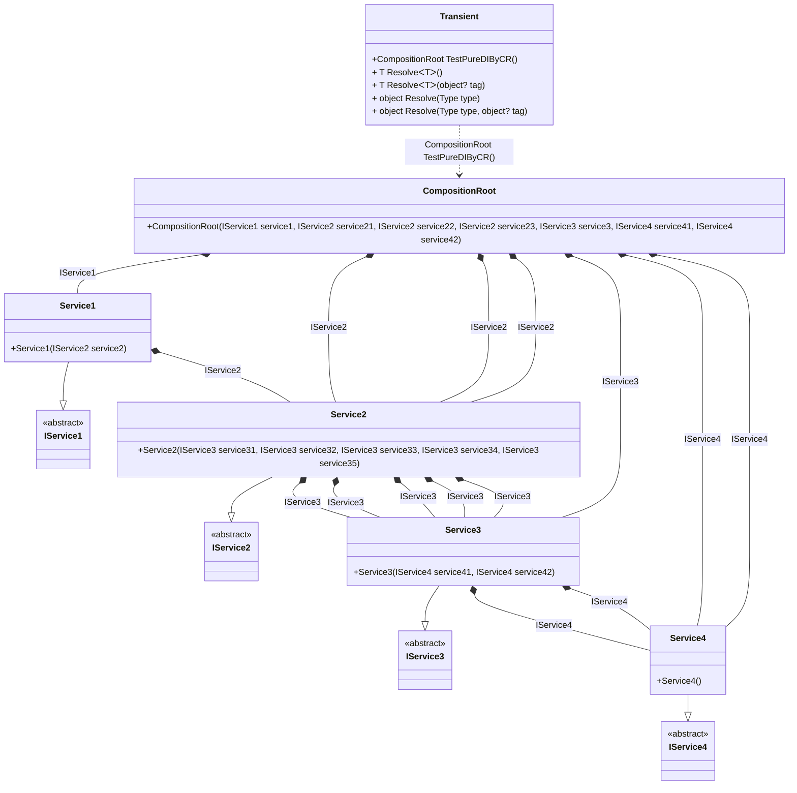

## Transient details

Creating an object graph of 22 transient objects.

### Class diagram


### Generated code

<details>
<summary>Pure.DI-generated partial class Transient</summary><blockquote>

```c#
partial class Transient
{
  private readonly Transient _root;

  public Transient()
  {
    _root = this;
  }

  internal Transient(Transient parentScope)
  {
    _root = parentScope._root;
  }

  [MethodImpl((MethodImplOptions)0x100)]
  public partial Benchmarks.Model.CompositionRoot TestPureDIByCR()
  {
    return new Benchmarks.Model.CompositionRoot(new Benchmarks.Model.Service1(new Benchmarks.Model.Service2(new Benchmarks.Model.Service3(new Benchmarks.Model.Service4(), new Benchmarks.Model.Service4()), new Benchmarks.Model.Service3(new Benchmarks.Model.Service4(), new Benchmarks.Model.Service4()), new Benchmarks.Model.Service3(new Benchmarks.Model.Service4(), new Benchmarks.Model.Service4()), new Benchmarks.Model.Service3(new Benchmarks.Model.Service4(), new Benchmarks.Model.Service4()), new Benchmarks.Model.Service3(new Benchmarks.Model.Service4(), new Benchmarks.Model.Service4()))), new Benchmarks.Model.Service2(new Benchmarks.Model.Service3(new Benchmarks.Model.Service4(), new Benchmarks.Model.Service4()), new Benchmarks.Model.Service3(new Benchmarks.Model.Service4(), new Benchmarks.Model.Service4()), new Benchmarks.Model.Service3(new Benchmarks.Model.Service4(), new Benchmarks.Model.Service4()), new Benchmarks.Model.Service3(new Benchmarks.Model.Service4(), new Benchmarks.Model.Service4()), new Benchmarks.Model.Service3(new Benchmarks.Model.Service4(), new Benchmarks.Model.Service4())), new Benchmarks.Model.Service2(new Benchmarks.Model.Service3(new Benchmarks.Model.Service4(), new Benchmarks.Model.Service4()), new Benchmarks.Model.Service3(new Benchmarks.Model.Service4(), new Benchmarks.Model.Service4()), new Benchmarks.Model.Service3(new Benchmarks.Model.Service4(), new Benchmarks.Model.Service4()), new Benchmarks.Model.Service3(new Benchmarks.Model.Service4(), new Benchmarks.Model.Service4()), new Benchmarks.Model.Service3(new Benchmarks.Model.Service4(), new Benchmarks.Model.Service4())), new Benchmarks.Model.Service2(new Benchmarks.Model.Service3(new Benchmarks.Model.Service4(), new Benchmarks.Model.Service4()), new Benchmarks.Model.Service3(new Benchmarks.Model.Service4(), new Benchmarks.Model.Service4()), new Benchmarks.Model.Service3(new Benchmarks.Model.Service4(), new Benchmarks.Model.Service4()), new Benchmarks.Model.Service3(new Benchmarks.Model.Service4(), new Benchmarks.Model.Service4()), new Benchmarks.Model.Service3(new Benchmarks.Model.Service4(), new Benchmarks.Model.Service4())), new Benchmarks.Model.Service3(new Benchmarks.Model.Service4(), new Benchmarks.Model.Service4()), new Benchmarks.Model.Service4(), new Benchmarks.Model.Service4());
  }

  [MethodImpl((MethodImplOptions)0x100)]
  public T Resolve<T>()
  {
    return Resolver<T>.Value.Resolve(this);
  }

  [MethodImpl((MethodImplOptions)0x100)]
  public T Resolve<T>(object? tag)
  {
    return Resolver<T>.Value.ResolveByTag(this, tag);
  }

  [MethodImpl((MethodImplOptions)0x100)]
  public object Resolve(Type type)
  {
    var index = (int)(_bucketSize * ((uint)RuntimeHelpers.GetHashCode(type) % 1));
    ref var pair = ref _buckets[index];
    return pair.Key == type ? pair.Value.Resolve(this) : Resolve(type, index);
  }

  [MethodImpl((MethodImplOptions)0x8)]
  private object Resolve(Type type, int index)
  {
    var finish = index + _bucketSize;
    while (++index < finish)
    {
      ref var pair = ref _buckets[index];
      if (pair.Key == type)
      {
        return pair.Value.Resolve(this);
      }
    }

    throw new InvalidOperationException($"Cannot resolve composition root of type {type}.");
  }

  [MethodImpl((MethodImplOptions)0x100)]
  public object Resolve(Type type, object? tag)
  {
    var index = (int)(_bucketSize * ((uint)RuntimeHelpers.GetHashCode(type) % 1));
    ref var pair = ref _buckets[index];
    return pair.Key == type ? pair.Value.ResolveByTag(this, tag) : Resolve(type, tag, index);
  }

  [MethodImpl((MethodImplOptions)0x8)]
  private object Resolve(Type type, object? tag, int index)
  {
    var finish = index + _bucketSize;
    while (++index < finish)
    {
      ref var pair = ref _buckets[index];
      if (pair.Key == type)
      {
        return pair.Value.ResolveByTag(this, tag);
      }
    }

    throw new InvalidOperationException($"Cannot resolve composition root \"{tag}\" of type {type}.");
  }

  public override string ToString()
  {
    return
      "classDiagram\n" +
        "  class Transient {\n" +
          "    +CompositionRoot TestPureDIByCR()\n" +
          "    + T ResolveᐸTᐳ()\n" +
          "    + T ResolveᐸTᐳ(object? tag)\n" +
          "    + object Resolve(Type type)\n" +
          "    + object Resolve(Type type, object? tag)\n" +
        "  }\n" +
        "  class CompositionRoot {\n" +
          "    +CompositionRoot(IService1 service1, IService2 service21, IService2 service22, IService2 service23, IService3 service3, IService4 service41, IService4 service42)\n" +
        "  }\n" +
        "  Service1 --|> IService1 : \n" +
        "  class Service1 {\n" +
          "    +Service1(IService2 service2)\n" +
        "  }\n" +
        "  Service2 --|> IService2 : \n" +
        "  class Service2 {\n" +
          "    +Service2(IService3 service31, IService3 service32, IService3 service33, IService3 service34, IService3 service35)\n" +
        "  }\n" +
        "  Service3 --|> IService3 : \n" +
        "  class Service3 {\n" +
          "    +Service3(IService4 service41, IService4 service42)\n" +
        "  }\n" +
        "  Service4 --|> IService4 : \n" +
        "  class Service4 {\n" +
          "    +Service4()\n" +
        "  }\n" +
        "  class IService1 {\n" +
          "    <<abstract>>\n" +
        "  }\n" +
        "  class IService2 {\n" +
          "    <<abstract>>\n" +
        "  }\n" +
        "  class IService3 {\n" +
          "    <<abstract>>\n" +
        "  }\n" +
        "  class IService4 {\n" +
          "    <<abstract>>\n" +
        "  }\n" +
        "  CompositionRoot *--  Service1 : IService1\n" +
        "  CompositionRoot *--  Service2 : IService2\n" +
        "  CompositionRoot *--  Service2 : IService2\n" +
        "  CompositionRoot *--  Service2 : IService2\n" +
        "  CompositionRoot *--  Service3 : IService3\n" +
        "  CompositionRoot *--  Service4 : IService4\n" +
        "  CompositionRoot *--  Service4 : IService4\n" +
        "  Service1 *--  Service2 : IService2\n" +
        "  Service2 *--  Service3 : IService3\n" +
        "  Service2 *--  Service3 : IService3\n" +
        "  Service2 *--  Service3 : IService3\n" +
        "  Service2 *--  Service3 : IService3\n" +
        "  Service2 *--  Service3 : IService3\n" +
        "  Service3 *--  Service4 : IService4\n" +
        "  Service3 *--  Service4 : IService4\n" +
        "  Transient ..> CompositionRoot : CompositionRoot TestPureDIByCR()";
  }

  private readonly static int _bucketSize;
  private readonly static Pair<Type, IResolver<Transient, object>>[] _buckets;

  static Transient()
  {
    var valResolver_0000 = new Resolver_0000();
    Resolver<Benchmarks.Model.CompositionRoot>.Value = valResolver_0000;
    _buckets = Buckets<Type, IResolver<Transient, object>>.Create(
      1,
      out _bucketSize,
      new Pair<Type, IResolver<Transient, object>>[1]
      {
         new Pair<Type, IResolver<Transient, object>>(typeof(Benchmarks.Model.CompositionRoot), valResolver_0000)
      });
  }

  private class Resolver<T>: IResolver<Transient, T>
  {
    private const string CannotResolve = "Cannot resolve composition root ";
    private const string OfType = "of type ";
    public static IResolver<Transient, T> Value = new Resolver<T>();

    public virtual T Resolve(Transient composite)
    {
      throw new InvalidOperationException($"{CannotResolve}{OfType}{typeof(T)}.");
    }

    public virtual T ResolveByTag(Transient composite, object tag)
    {
      throw new InvalidOperationException($"{CannotResolve}\"{tag}\" {OfType}{typeof(T)}.");
    }
  }

  private sealed class Resolver_0000: Resolver<Benchmarks.Model.CompositionRoot>
  {
    public override Benchmarks.Model.CompositionRoot Resolve(Transient composition)
    {
      return composition.TestPureDIByCR();
    }

    public override Benchmarks.Model.CompositionRoot ResolveByTag(Transient composition, object tag)
    {
      switch (tag)
      {
        case null:
          return composition.TestPureDIByCR();
        default:
          return base.ResolveByTag(composition, tag);
      }
    }
  }
}
```

</blockquote></details>

