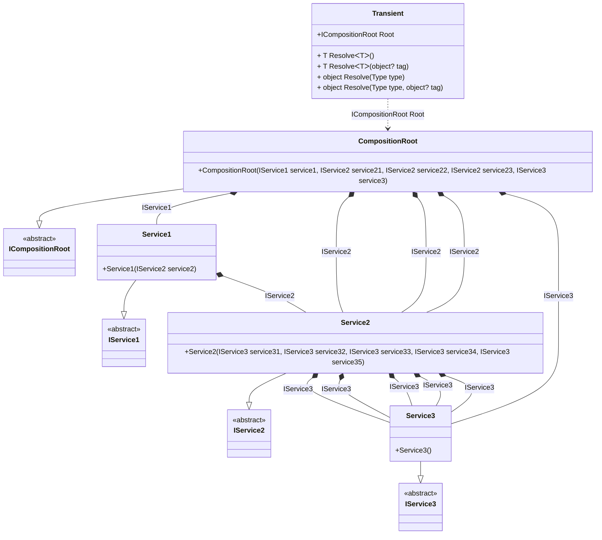

## Transient details

Creating an object graph of 22 transient objects.

### Class diagram


### Generated code

<details>
<summary>Pure.DI-generated partial class Transient</summary><blockquote>

```c#
partial class Transient
{
  private readonly System.IDisposable[] _disposableSingletonsM09D22di;
  
  public Transient()
  {
    _disposableSingletonsM09D22di = new System.IDisposable[0];
  }
  
  internal Transient(Transient parent)
  {
    _disposableSingletonsM09D22di = new System.IDisposable[0];
  }
  
  #region Composition Roots
  public Pure.DI.Benchmarks.Model.ICompositionRoot Root
  {
    [global::System.Runtime.CompilerServices.MethodImpl((global::System.Runtime.CompilerServices.MethodImplOptions)0x300)]
    get
    {
      Pure.DI.Benchmarks.Model.Service3 transientM09D22di116 = new Pure.DI.Benchmarks.Model.Service3();
      Pure.DI.Benchmarks.Model.Service3 transientM09D22di115 = new Pure.DI.Benchmarks.Model.Service3();
      Pure.DI.Benchmarks.Model.Service3 transientM09D22di114 = new Pure.DI.Benchmarks.Model.Service3();
      Pure.DI.Benchmarks.Model.Service3 transientM09D22di113 = new Pure.DI.Benchmarks.Model.Service3();
      Pure.DI.Benchmarks.Model.Service3 transientM09D22di112 = new Pure.DI.Benchmarks.Model.Service3();
      Pure.DI.Benchmarks.Model.Service2 transientM09D22di111 = new Pure.DI.Benchmarks.Model.Service2(transientM09D22di112, transientM09D22di113, transientM09D22di114, transientM09D22di115, transientM09D22di116);
      Pure.DI.Benchmarks.Model.Service3 transientM09D22di110 = new Pure.DI.Benchmarks.Model.Service3();
      Pure.DI.Benchmarks.Model.Service3 transientM09D22di109 = new Pure.DI.Benchmarks.Model.Service3();
      Pure.DI.Benchmarks.Model.Service3 transientM09D22di108 = new Pure.DI.Benchmarks.Model.Service3();
      Pure.DI.Benchmarks.Model.Service3 transientM09D22di107 = new Pure.DI.Benchmarks.Model.Service3();
      Pure.DI.Benchmarks.Model.Service3 transientM09D22di106 = new Pure.DI.Benchmarks.Model.Service3();
      Pure.DI.Benchmarks.Model.Service3 transientM09D22di105 = new Pure.DI.Benchmarks.Model.Service3();
      Pure.DI.Benchmarks.Model.Service3 transientM09D22di104 = new Pure.DI.Benchmarks.Model.Service3();
      Pure.DI.Benchmarks.Model.Service3 transientM09D22di103 = new Pure.DI.Benchmarks.Model.Service3();
      Pure.DI.Benchmarks.Model.Service3 transientM09D22di102 = new Pure.DI.Benchmarks.Model.Service3();
      Pure.DI.Benchmarks.Model.Service3 transientM09D22di101 = new Pure.DI.Benchmarks.Model.Service3();
      Pure.DI.Benchmarks.Model.Service3 transientM09D22di100 = new Pure.DI.Benchmarks.Model.Service3();
      Pure.DI.Benchmarks.Model.Service3 transientM09D22di99 = new Pure.DI.Benchmarks.Model.Service3();
      Pure.DI.Benchmarks.Model.Service3 transientM09D22di98 = new Pure.DI.Benchmarks.Model.Service3();
      Pure.DI.Benchmarks.Model.Service3 transientM09D22di97 = new Pure.DI.Benchmarks.Model.Service3();
      Pure.DI.Benchmarks.Model.Service3 transientM09D22di96 = new Pure.DI.Benchmarks.Model.Service3();
      Pure.DI.Benchmarks.Model.Service3 transientM09D22di95 = new Pure.DI.Benchmarks.Model.Service3();
      Pure.DI.Benchmarks.Model.Service2 transientM09D22di94 = new Pure.DI.Benchmarks.Model.Service2(transientM09D22di96, transientM09D22di97, transientM09D22di98, transientM09D22di99, transientM09D22di100);
      Pure.DI.Benchmarks.Model.Service2 transientM09D22di93 = new Pure.DI.Benchmarks.Model.Service2(transientM09D22di101, transientM09D22di102, transientM09D22di103, transientM09D22di104, transientM09D22di105);
      Pure.DI.Benchmarks.Model.Service2 transientM09D22di92 = new Pure.DI.Benchmarks.Model.Service2(transientM09D22di106, transientM09D22di107, transientM09D22di108, transientM09D22di109, transientM09D22di110);
      Pure.DI.Benchmarks.Model.Service1 transientM09D22di91 = new Pure.DI.Benchmarks.Model.Service1(transientM09D22di111);
      Pure.DI.Benchmarks.Model.CompositionRoot transientM09D22di90 = new Pure.DI.Benchmarks.Model.CompositionRoot(transientM09D22di91, transientM09D22di92, transientM09D22di93, transientM09D22di94, transientM09D22di95);
      return transientM09D22di90;
    }
  }
  #endregion
  
  #region API
  #if NETSTANDARD2_0_OR_GREATER || NETCOREAPP || NET40_OR_GREATER
  [global::System.Diagnostics.Contracts.Pure]
  #endif
  [global::System.Runtime.CompilerServices.MethodImpl((global::System.Runtime.CompilerServices.MethodImplOptions)0x300)]
  public T Resolve<T>()
  {
    return ResolverM09D22di<T>.Value.Resolve(this);
  }
  
  #if NETSTANDARD2_0_OR_GREATER || NETCOREAPP || NET40_OR_GREATER
  [global::System.Diagnostics.Contracts.Pure]
  #endif
  [global::System.Runtime.CompilerServices.MethodImpl((global::System.Runtime.CompilerServices.MethodImplOptions)0x300)]
  public T Resolve<T>(object? tag)
  {
    return ResolverM09D22di<T>.Value.ResolveByTag(this, tag);
  }
  
  #if NETSTANDARD2_0_OR_GREATER || NETCOREAPP || NET40_OR_GREATER
  [global::System.Diagnostics.Contracts.Pure]
  #endif
  [global::System.Runtime.CompilerServices.MethodImpl((global::System.Runtime.CompilerServices.MethodImplOptions)0x300)]
  public object Resolve(global::System.Type type)
  {
    var index = (int)(_bucketSizeM09D22di * ((uint)global::System.Runtime.CompilerServices.RuntimeHelpers.GetHashCode(type) % 1));
    var finish = index + _bucketSizeM09D22di;
    do {
      ref var pair = ref _bucketsM09D22di[index];
      if (ReferenceEquals(pair.Key, type))
      {
        return pair.Value.Resolve(this);
      }
    } while (++index < finish);
    
    throw new global::System.InvalidOperationException($"Cannot resolve composition root of type {type}.");
  }
  
  #if NETSTANDARD2_0_OR_GREATER || NETCOREAPP || NET40_OR_GREATER
  [global::System.Diagnostics.Contracts.Pure]
  #endif
  [global::System.Runtime.CompilerServices.MethodImpl((global::System.Runtime.CompilerServices.MethodImplOptions)0x300)]
  public object Resolve(global::System.Type type, object? tag)
  {
    var index = (int)(_bucketSizeM09D22di * ((uint)global::System.Runtime.CompilerServices.RuntimeHelpers.GetHashCode(type) % 1));
    var finish = index + _bucketSizeM09D22di;
    do {
      ref var pair = ref _bucketsM09D22di[index];
      if (ReferenceEquals(pair.Key, type))
      {
        return pair.Value.ResolveByTag(this, tag);
      }
    } while (++index < finish);
    
    throw new global::System.InvalidOperationException($"Cannot resolve composition root \"{tag}\" of type {type}.");
  }
  #endregion
  
  public override string ToString()
  {
    return
      "classDiagram\n" +
        "  class Transient {\n" +
          "    +ICompositionRoot Root\n" +
          "    + T ResolveᐸTᐳ()\n" +
          "    + T ResolveᐸTᐳ(object? tag)\n" +
          "    + object Resolve(Type type)\n" +
          "    + object Resolve(Type type, object? tag)\n" +
        "  }\n" +
        "  CompositionRoot --|> ICompositionRoot : \n" +
        "  class CompositionRoot {\n" +
          "    +CompositionRoot(IService1 service1, IService2 service21, IService2 service22, IService2 service23, IService3 service3)\n" +
        "  }\n" +
        "  Service2 --|> IService2 : \n" +
        "  class Service2 {\n" +
          "    +Service2(IService3 service31, IService3 service32, IService3 service33, IService3 service34, IService3 service35)\n" +
        "  }\n" +
        "  Service1 --|> IService1 : \n" +
        "  class Service1 {\n" +
          "    +Service1(IService2 service2)\n" +
        "  }\n" +
        "  Service3 --|> IService3 : \n" +
        "  class Service3 {\n" +
          "    +Service3()\n" +
        "  }\n" +
        "  class ICompositionRoot {\n" +
          "    <<abstract>>\n" +
        "  }\n" +
        "  class IService2 {\n" +
          "    <<abstract>>\n" +
        "  }\n" +
        "  class IService1 {\n" +
          "    <<abstract>>\n" +
        "  }\n" +
        "  class IService3 {\n" +
          "    <<abstract>>\n" +
        "  }\n" +
        "  CompositionRoot *--  Service1 : IService1\n" +
        "  CompositionRoot *--  Service2 : IService2\n" +
        "  CompositionRoot *--  Service2 : IService2\n" +
        "  CompositionRoot *--  Service2 : IService2\n" +
        "  CompositionRoot *--  Service3 : IService3\n" +
        "  Service2 *--  Service3 : IService3\n" +
        "  Service2 *--  Service3 : IService3\n" +
        "  Service2 *--  Service3 : IService3\n" +
        "  Service2 *--  Service3 : IService3\n" +
        "  Service2 *--  Service3 : IService3\n" +
        "  Service1 *--  Service2 : IService2\n" +
        "  Transient ..> CompositionRoot : ICompositionRoot Root";
  }
  
  private readonly static int _bucketSizeM09D22di;
  private readonly static global::Pure.DI.Pair<global::System.Type, global::Pure.DI.IResolver<Transient, object>>[] _bucketsM09D22di;
  
  static Transient()
  {
    var valResolverM09D22di_0000 = new ResolverM09D22di_0000();
    ResolverM09D22di<Pure.DI.Benchmarks.Model.ICompositionRoot>.Value = valResolverM09D22di_0000;
    _bucketsM09D22di = global::Pure.DI.Buckets<global::System.Type, global::Pure.DI.IResolver<Transient, object>>.Create(
      1,
      out _bucketSizeM09D22di,
      new global::Pure.DI.Pair<global::System.Type, global::Pure.DI.IResolver<Transient, object>>[1]
      {
         new global::Pure.DI.Pair<global::System.Type, global::Pure.DI.IResolver<Transient, object>>(typeof(Pure.DI.Benchmarks.Model.ICompositionRoot), valResolverM09D22di_0000)
      });
  }
  
  #region Resolvers
  private sealed class ResolverM09D22di<T>: global::Pure.DI.IResolver<Transient, T>
  {
    public static global::Pure.DI.IResolver<Transient, T> Value = new ResolverM09D22di<T>();
    
    public T Resolve(Transient composite)
    {
      throw new global::System.InvalidOperationException($"Cannot resolve composition root of type {typeof(T)}.");
    }
    
    public T ResolveByTag(Transient composite, object tag)
    {
      throw new global::System.InvalidOperationException($"Cannot resolve composition root \"{tag}\" of type {typeof(T)}.");
    }
  }
  
  private sealed class ResolverM09D22di_0000: global::Pure.DI.IResolver<Transient, Pure.DI.Benchmarks.Model.ICompositionRoot>
  {
    [global::System.Runtime.CompilerServices.MethodImpl((global::System.Runtime.CompilerServices.MethodImplOptions)0x300)]
    public Pure.DI.Benchmarks.Model.ICompositionRoot Resolve(Transient composition)
    {
      return composition.Root;
    }
    
    [global::System.Runtime.CompilerServices.MethodImpl((global::System.Runtime.CompilerServices.MethodImplOptions)0x300)]
    public Pure.DI.Benchmarks.Model.ICompositionRoot ResolveByTag(Transient composition, object tag)
    {
      if (Equals(tag, null)) return composition.Root;
      throw new global::System.InvalidOperationException($"Cannot resolve composition root \"{tag}\" of type Pure.DI.Benchmarks.Model.ICompositionRoot.");
    }
  }
  #endregion
}
```

</blockquote></details>

