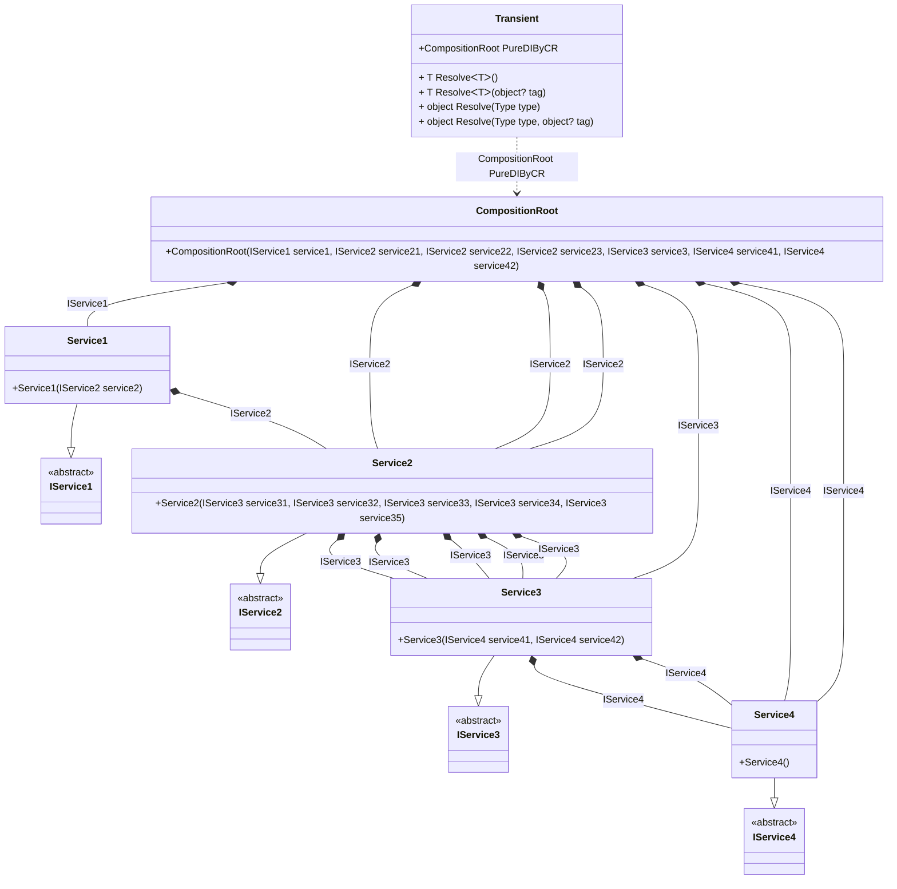

## Transient details

Creating an object graph of 22 transient objects.

### Class diagram


### Generated code

<details>
<summary>Pure.DI-generated partial class Transient</summary><blockquote>

```c#
/// <para>
/// Composition roots:<br/>
/// <list type="table">
/// <listheader>
/// <term>Root</term>
/// <description>Description</description>
/// </listheader>
/// <item>
/// <term>
/// <see cref="Pure.DI.Benchmarks.Model.CompositionRoot"/> PureDIByCR
/// </term>
/// <description>
/// </description>
/// </item>
/// </list>
/// </para>
/// <example>
/// This shows how to get an instance of type <see cref="Pure.DI.Benchmarks.Model.CompositionRoot"/> using the composition root <see cref="PureDIByCR"/>:
/// <code>
/// var composition = new Transient();
/// var instance = composition.PureDIByCR();
/// </code>
/// </example>
/// <a href="https://mermaid.live/view#pako:eNrlVktuwjAQvYrldRfUdkXLDhIqsatoltkYsNq0JEaOQUKIO3CXbnodbtKQj43dOFHSbqpuLCdv_GbmjWfkA1zyFYMjuFzTNPUj-iJoHIowyb9BIGiSRiyRINwOBsPJBbns0MTj8YankYx4MudcgqetYP5ssvfm2gYEYM5Svt6x8-kzOJ8-8t_3-frQasYXb2wpL3v8CCR9-XasMKjOFoeC_YYBmS09rD3Q7HLoa2Hs9FvkKdzNnpnYRUt2C9JyU_qtAFQByI0gJ4ItBFeIDZAKILYbjaC63FX8Oejrdejlok0VUWGCx0BLZiDXWlWAKZLOqyES1B4JckaCXJEgMxKtoy2XRuyqaMRdFeJE7hpSxu0pY2fK2JUyNlP-6Q0h7UESZ5DEFSSpmx_XXWnePs2AC-ceXaRS0LLDp-XawGPfkL48tux9eUhvnrp5hcbXRQJmg2aFUWp2JFAdp2T8cwSqg1QFOxKo261K9ysE5gDukrw5MLtk_c9OlvO1R1V6nDTfVyhv3WLNJmXdbckIml9e8AbGTMQ0WmWPukMI5SuLWQhHIVxR8R7CIzx-AQNVRRo">Class diagram</a><br/>
/// This class was created by <a href="https://github.com/DevTeam/Pure.DI">Pure.DI</a> source code generator.
/// </summary>
/// <seealso cref="Pure.DI.DI.Setup"/>
[global::System.Diagnostics.CodeAnalysis.ExcludeFromCodeCoverage]
partial class Transient
{
  private readonly Transient _rootM02D27di;
  
  /// <summary>
  /// This constructor creates a new instance of <see cref="Transient"/>.
  /// </summary>
  public Transient()
  {
    _rootM02D27di = this;
  }
  
  /// <summary>
  /// This constructor creates a new instance of <see cref="Transient"/> scope based on <paramref name="baseComposition"/>. This allows the <see cref="Lifetime.Scoped"/> life time to be applied.
  /// </summary>
  /// <param name="baseComposition">Base composition.</param>
  internal Transient(Transient baseComposition)
  {
    _rootM02D27di = baseComposition._rootM02D27di;
  }
  
  #region Composition Roots
  #if NETSTANDARD2_0_OR_GREATER || NETCOREAPP || NET40_OR_GREATER || NET
  [global::System.Diagnostics.Contracts.Pure]
  #endif
  public partial Pure.DI.Benchmarks.Model.CompositionRoot PureDIByCR()
  {
    return new Pure.DI.Benchmarks.Model.CompositionRoot(new Pure.DI.Benchmarks.Model.Service1(new Pure.DI.Benchmarks.Model.Service2(new Pure.DI.Benchmarks.Model.Service3(new Pure.DI.Benchmarks.Model.Service4(), new Pure.DI.Benchmarks.Model.Service4()), new Pure.DI.Benchmarks.Model.Service3(new Pure.DI.Benchmarks.Model.Service4(), new Pure.DI.Benchmarks.Model.Service4()), new Pure.DI.Benchmarks.Model.Service3(new Pure.DI.Benchmarks.Model.Service4(), new Pure.DI.Benchmarks.Model.Service4()), new Pure.DI.Benchmarks.Model.Service3(new Pure.DI.Benchmarks.Model.Service4(), new Pure.DI.Benchmarks.Model.Service4()), new Pure.DI.Benchmarks.Model.Service3(new Pure.DI.Benchmarks.Model.Service4(), new Pure.DI.Benchmarks.Model.Service4()))), new Pure.DI.Benchmarks.Model.Service2(new Pure.DI.Benchmarks.Model.Service3(new Pure.DI.Benchmarks.Model.Service4(), new Pure.DI.Benchmarks.Model.Service4()), new Pure.DI.Benchmarks.Model.Service3(new Pure.DI.Benchmarks.Model.Service4(), new Pure.DI.Benchmarks.Model.Service4()), new Pure.DI.Benchmarks.Model.Service3(new Pure.DI.Benchmarks.Model.Service4(), new Pure.DI.Benchmarks.Model.Service4()), new Pure.DI.Benchmarks.Model.Service3(new Pure.DI.Benchmarks.Model.Service4(), new Pure.DI.Benchmarks.Model.Service4()), new Pure.DI.Benchmarks.Model.Service3(new Pure.DI.Benchmarks.Model.Service4(), new Pure.DI.Benchmarks.Model.Service4())), new Pure.DI.Benchmarks.Model.Service2(new Pure.DI.Benchmarks.Model.Service3(new Pure.DI.Benchmarks.Model.Service4(), new Pure.DI.Benchmarks.Model.Service4()), new Pure.DI.Benchmarks.Model.Service3(new Pure.DI.Benchmarks.Model.Service4(), new Pure.DI.Benchmarks.Model.Service4()), new Pure.DI.Benchmarks.Model.Service3(new Pure.DI.Benchmarks.Model.Service4(), new Pure.DI.Benchmarks.Model.Service4()), new Pure.DI.Benchmarks.Model.Service3(new Pure.DI.Benchmarks.Model.Service4(), new Pure.DI.Benchmarks.Model.Service4()), new Pure.DI.Benchmarks.Model.Service3(new Pure.DI.Benchmarks.Model.Service4(), new Pure.DI.Benchmarks.Model.Service4())), new Pure.DI.Benchmarks.Model.Service2(new Pure.DI.Benchmarks.Model.Service3(new Pure.DI.Benchmarks.Model.Service4(), new Pure.DI.Benchmarks.Model.Service4()), new Pure.DI.Benchmarks.Model.Service3(new Pure.DI.Benchmarks.Model.Service4(), new Pure.DI.Benchmarks.Model.Service4()), new Pure.DI.Benchmarks.Model.Service3(new Pure.DI.Benchmarks.Model.Service4(), new Pure.DI.Benchmarks.Model.Service4()), new Pure.DI.Benchmarks.Model.Service3(new Pure.DI.Benchmarks.Model.Service4(), new Pure.DI.Benchmarks.Model.Service4()), new Pure.DI.Benchmarks.Model.Service3(new Pure.DI.Benchmarks.Model.Service4(), new Pure.DI.Benchmarks.Model.Service4())), new Pure.DI.Benchmarks.Model.Service3(new Pure.DI.Benchmarks.Model.Service4(), new Pure.DI.Benchmarks.Model.Service4()), new Pure.DI.Benchmarks.Model.Service4(), new Pure.DI.Benchmarks.Model.Service4());
  }
  #endregion
  
  #region API
  /// <summary>
  /// Resolves the composition root.
  /// </summary>
  /// <typeparam name="T">The type of the composition root.</typeparam>
  /// <returns>A composition root.</returns>
  #if NETSTANDARD2_0_OR_GREATER || NETCOREAPP || NET40_OR_GREATER || NET
  [global::System.Diagnostics.Contracts.Pure]
  #endif
  public T Resolve<T>()
  {
    return ResolverM02D27di<T>.Value.Resolve(this);
  }
  
  /// <summary>
  /// Resolves the composition root by tag.
  /// </summary>
  /// <typeparam name="T">The type of the composition root.</typeparam>
  /// <param name="tag">The tag of a composition root.</param>
  /// <returns>A composition root.</returns>
  #if NETSTANDARD2_0_OR_GREATER || NETCOREAPP || NET40_OR_GREATER || NET
  [global::System.Diagnostics.Contracts.Pure]
  #endif
  public T Resolve<T>(object? tag)
  {
    return ResolverM02D27di<T>.Value.ResolveByTag(this, tag);
  }
  
  /// <summary>
  /// Resolves the composition root.
  /// </summary>
  /// <param name="type">The type of the composition root.</param>
  /// <returns>A composition root.</returns>
  #if NETSTANDARD2_0_OR_GREATER || NETCOREAPP || NET40_OR_GREATER || NET
  [global::System.Diagnostics.Contracts.Pure]
  #endif
  public object Resolve(global::System.Type type)
  {
    var index = (int)(_bucketSizeM02D27di * ((uint)global::System.Runtime.CompilerServices.RuntimeHelpers.GetHashCode(type) % 1));
    var finish = index + _bucketSizeM02D27di;
    do {
      ref var pair = ref _bucketsM02D27di[index];
      if (ReferenceEquals(pair.Key, type))
      {
        return pair.Value.Resolve(this);
      }
    } while (++index < finish);
    
    throw new global::System.InvalidOperationException($"Cannot resolve composition root of type {type}.");
  }
  
  /// <summary>
  /// Resolves the composition root by tag.
  /// </summary>
  /// <param name="type">The type of the composition root.</param>
  /// <param name="tag">The tag of a composition root.</param>
  /// <returns>A composition root.</returns>
  #if NETSTANDARD2_0_OR_GREATER || NETCOREAPP || NET40_OR_GREATER || NET
  [global::System.Diagnostics.Contracts.Pure]
  #endif
  public object Resolve(global::System.Type type, object? tag)
  {
    var index = (int)(_bucketSizeM02D27di * ((uint)global::System.Runtime.CompilerServices.RuntimeHelpers.GetHashCode(type) % 1));
    var finish = index + _bucketSizeM02D27di;
    do {
      ref var pair = ref _bucketsM02D27di[index];
      if (ReferenceEquals(pair.Key, type))
      {
        return pair.Value.ResolveByTag(this, tag);
      }
    } while (++index < finish);
    
    throw new global::System.InvalidOperationException($"Cannot resolve composition root \"{tag}\" of type {type}.");
  }
  #endregion
  
  /// <summary>
  /// This method provides a class diagram in mermaid format. To see this diagram, simply call the method and copy the text to this site https://mermaid.live/.
  /// </summary>
  public override string ToString()
  {
    return
      "classDiagram\n" +
        "  class Transient {\n" +
          "    +CompositionRoot PureDIByCR\n" +
          "    + T ResolveᐸTᐳ()\n" +
          "    + T ResolveᐸTᐳ(object? tag)\n" +
          "    + object Resolve(Type type)\n" +
          "    + object Resolve(Type type, object? tag)\n" +
        "  }\n" +
        "  class CompositionRoot {\n" +
          "    +CompositionRoot(IService1 service1, IService2 service21, IService2 service22, IService2 service23, IService3 service3, IService4 service41, IService4 service42)\n" +
        "  }\n" +
        "  Service1 --|> IService1 : \n" +
        "  class Service1 {\n" +
          "    +Service1(IService2 service2)\n" +
        "  }\n" +
        "  Service2 --|> IService2 : \n" +
        "  class Service2 {\n" +
          "    +Service2(IService3 service31, IService3 service32, IService3 service33, IService3 service34, IService3 service35)\n" +
        "  }\n" +
        "  Service3 --|> IService3 : \n" +
        "  class Service3 {\n" +
          "    +Service3(IService4 service41, IService4 service42)\n" +
        "  }\n" +
        "  Service4 --|> IService4 : \n" +
        "  class Service4 {\n" +
          "    +Service4()\n" +
        "  }\n" +
        "  class IService1 {\n" +
          "    <<abstract>>\n" +
        "  }\n" +
        "  class IService2 {\n" +
          "    <<abstract>>\n" +
        "  }\n" +
        "  class IService3 {\n" +
          "    <<abstract>>\n" +
        "  }\n" +
        "  class IService4 {\n" +
          "    <<abstract>>\n" +
        "  }\n" +
        "  CompositionRoot *--  Service1 : IService1\n" +
        "  CompositionRoot *--  Service2 : IService2\n" +
        "  CompositionRoot *--  Service2 : IService2\n" +
        "  CompositionRoot *--  Service2 : IService2\n" +
        "  CompositionRoot *--  Service3 : IService3\n" +
        "  CompositionRoot *--  Service4 : IService4\n" +
        "  CompositionRoot *--  Service4 : IService4\n" +
        "  Service1 *--  Service2 : IService2\n" +
        "  Service2 *--  Service3 : IService3\n" +
        "  Service2 *--  Service3 : IService3\n" +
        "  Service2 *--  Service3 : IService3\n" +
        "  Service2 *--  Service3 : IService3\n" +
        "  Service2 *--  Service3 : IService3\n" +
        "  Service3 *--  Service4 : IService4\n" +
        "  Service3 *--  Service4 : IService4\n" +
        "  Transient ..> CompositionRoot : CompositionRoot PureDIByCR";
  }
  
  private readonly static int _bucketSizeM02D27di;
  private readonly static global::Pure.DI.Pair<global::System.Type, global::Pure.DI.IResolver<Transient, object>>[] _bucketsM02D27di;
  
  static Transient()
  {
    var valResolverM02D27di_0000 = new ResolverM02D27di_0000();
    ResolverM02D27di<Pure.DI.Benchmarks.Model.CompositionRoot>.Value = valResolverM02D27di_0000;
    _bucketsM02D27di = global::Pure.DI.Buckets<global::System.Type, global::Pure.DI.IResolver<Transient, object>>.Create(
      1,
      out _bucketSizeM02D27di,
      new global::Pure.DI.Pair<global::System.Type, global::Pure.DI.IResolver<Transient, object>>[1]
      {
         new global::Pure.DI.Pair<global::System.Type, global::Pure.DI.IResolver<Transient, object>>(typeof(Pure.DI.Benchmarks.Model.CompositionRoot), valResolverM02D27di_0000)
      });
  }
  
  #region Resolvers
  private sealed class ResolverM02D27di<T>: global::Pure.DI.IResolver<Transient, T>
  {
    public static global::Pure.DI.IResolver<Transient, T> Value = new ResolverM02D27di<T>();
    
    public T Resolve(Transient composite)
    {
      throw new global::System.InvalidOperationException($"Cannot resolve composition root of type {typeof(T)}.");
    }
    
    public T ResolveByTag(Transient composite, object tag)
    {
      throw new global::System.InvalidOperationException($"Cannot resolve composition root \"{tag}\" of type {typeof(T)}.");
    }
  }
  
  private sealed class ResolverM02D27di_0000: global::Pure.DI.IResolver<Transient, Pure.DI.Benchmarks.Model.CompositionRoot>
  {
    public Pure.DI.Benchmarks.Model.CompositionRoot Resolve(Transient composition)
    {
      return composition.PureDIByCR();
    }
    
    public Pure.DI.Benchmarks.Model.CompositionRoot ResolveByTag(Transient composition, object tag)
    {
      switch (tag)
      {
        case null:
          return composition.PureDIByCR();
      }
      throw new global::System.InvalidOperationException($"Cannot resolve composition root \"{tag}\" of type Pure.DI.Benchmarks.Model.CompositionRoot.");
    }
  }
  #endregion
}
```

</blockquote></details>

