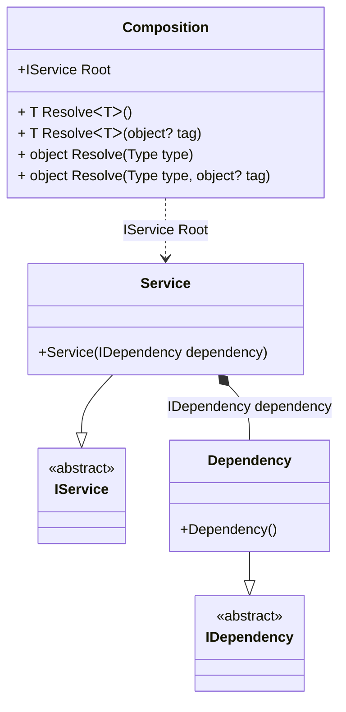

#### A few partial classes

[](../tests/Pure.DI.UsageTests/Basics/SeveralPartialClassesScenario.cs)

The setting code for one Composition can be located in several methods and/or in several partial classes.

```c#
interface IDependency { }

class Dependency : IDependency { }

interface IService { }

class Service : IService
{
    public Service(IDependency dependency) { }
}

partial class Composition
{
    // This method will not be called in runtime
    private void Setup1() =>

        DI.Setup(nameof(Composition))
            .Bind<IDependency>().To<Dependency>();
}

partial class Composition
{
    // This method will not be called in runtime
    private void Setup2() =>

        DI.Setup(nameof(Composition))
            .Bind<IService>().To<Service>();
}

partial class Composition
{
    // This method will not be called in runtime
    private void Setup3() =>

        DI.Setup(nameof(Composition))
            .Root<IService>("Root");
}

var composition = new Composition();
var service = composition.Root;
```

<details open>
<summary>Class Diagram</summary>



</details>

<details>
<summary>Composition Code</summary>

```c#
partial class Composition
{
  public Composition()
  {
  }
  
  internal Composition(Composition parent)
  {
  }
  
  #region Composition Roots
  public Pure.DI.UsageTests.Basics.SeveralPartialClassesScenario.IService Root
  {
    [global::System.Runtime.CompilerServices.MethodImpl((global::System.Runtime.CompilerServices.MethodImplOptions)0x300)]
    get
    {
      Pure.DI.UsageTests.Basics.SeveralPartialClassesScenario.Dependency transientM07D27di_0001 = new Pure.DI.UsageTests.Basics.SeveralPartialClassesScenario.Dependency();
      Pure.DI.UsageTests.Basics.SeveralPartialClassesScenario.Service transientM07D27di_0000 = new Pure.DI.UsageTests.Basics.SeveralPartialClassesScenario.Service(transientM07D27di_0001);
      return transientM07D27di_0000;
    }
  }
  #endregion
  
  #region API
  #if NETSTANDARD2_0_OR_GREATER || NETCOREAPP || NET40_OR_GREATER
  [global::System.Diagnostics.Contracts.Pure]
  #endif
  [global::System.Runtime.CompilerServices.MethodImpl((global::System.Runtime.CompilerServices.MethodImplOptions)0x300)]
  public T Resolve<T>()
  {
    return ResolverM07D27di<T>.Value.Resolve(this);
  }
  
  #if NETSTANDARD2_0_OR_GREATER || NETCOREAPP || NET40_OR_GREATER
  [global::System.Diagnostics.Contracts.Pure]
  #endif
  [global::System.Runtime.CompilerServices.MethodImpl((global::System.Runtime.CompilerServices.MethodImplOptions)0x300)]
  public T Resolve<T>(object? tag)
  {
    return ResolverM07D27di<T>.Value.ResolveByTag(this, tag);
  }
  
  #if NETSTANDARD2_0_OR_GREATER || NETCOREAPP || NET40_OR_GREATER
  [global::System.Diagnostics.Contracts.Pure]
  #endif
  [global::System.Runtime.CompilerServices.MethodImpl((global::System.Runtime.CompilerServices.MethodImplOptions)0x300)]
  public object Resolve(global::System.Type type)
  {
    int index = (int)(_bucketSizeM07D27di * ((uint)global::System.Runtime.CompilerServices.RuntimeHelpers.GetHashCode(type) % 1));
    ref var pair = ref _bucketsM07D27di[index];
    if (ReferenceEquals(pair.Key, type))
    {
      return pair.Value.Resolve(this);
    }
    
    for (int i = index + 1; i < index + _bucketSizeM07D27di; i++)
    {
      pair = ref _bucketsM07D27di[i];
      if (ReferenceEquals(pair.Key, type))
      {
        return pair.Value.Resolve(this);
      }
    }
    
    throw new global::System.InvalidOperationException($"Cannot resolve composition root of type {type}.");
  }
  
  #if NETSTANDARD2_0_OR_GREATER || NETCOREAPP || NET40_OR_GREATER
  [global::System.Diagnostics.Contracts.Pure]
  #endif
  [global::System.Runtime.CompilerServices.MethodImpl((global::System.Runtime.CompilerServices.MethodImplOptions)0x300)]
  public object Resolve(global::System.Type type, object? tag)
  {
    int index = (int)(_bucketSizeM07D27di * ((uint)global::System.Runtime.CompilerServices.RuntimeHelpers.GetHashCode(type) % 1));
    ref var pair = ref _bucketsM07D27di[index];
    if (ReferenceEquals(pair.Key, type))
    {
      return pair.Value.ResolveByTag(this, tag);
    }
    
    for (int i = index + 1; i < index + _bucketSizeM07D27di; i++)
    {
      pair = ref _bucketsM07D27di[i];
      if (ReferenceEquals(pair.Key, type))
      {
        return pair.Value.ResolveByTag(this, tag);
      }
    }
    
    throw new global::System.InvalidOperationException($"Cannot resolve composition root \"{tag}\" of type {type}.");
  }
  #endregion
  
  public override string ToString()
  {
    return
      "classDiagram\n" +
        "  class Composition {\n" +
          "    +IService Root\n" +
          "    + T ResolveᐸTᐳ()\n" +
          "    + T ResolveᐸTᐳ(object? tag)\n" +
          "    + object Resolve(Type type)\n" +
          "    + object Resolve(Type type, object? tag)\n" +
        "  }\n" +
        "  Service --|> IService : \n" +
        "  class Service {\n" +
          "    +Service(IDependency dependency)\n" +
        "  }\n" +
        "  Dependency --|> IDependency : \n" +
        "  class Dependency {\n" +
          "    +Dependency()\n" +
        "  }\n" +
        "  class IService {\n" +
          "    <<abstract>>\n" +
        "  }\n" +
        "  class IDependency {\n" +
          "    <<abstract>>\n" +
        "  }\n" +
        "  Service *--  Dependency : IDependency dependency\n" +
        "  Composition ..> Service : IService Root";
  }
  
  private readonly static int _bucketSizeM07D27di;
  private readonly static global::Pure.DI.Pair<global::System.Type, global::Pure.DI.IResolver<Composition, object>>[] _bucketsM07D27di;
  
  static Composition()
  {
    ResolverM07D27di_0000 valResolverM07D27di_0000 = new ResolverM07D27di_0000();
    ResolverM07D27di<Pure.DI.UsageTests.Basics.SeveralPartialClassesScenario.IService>.Value = valResolverM07D27di_0000;
    _bucketsM07D27di = global::Pure.DI.Buckets<global::System.Type, global::Pure.DI.IResolver<Composition, object>>.Create(
      1,
      out _bucketSizeM07D27di,
      new global::Pure.DI.Pair<global::System.Type, global::Pure.DI.IResolver<Composition, object>>[1]
      {
         new global::Pure.DI.Pair<global::System.Type, global::Pure.DI.IResolver<Composition, object>>(typeof(Pure.DI.UsageTests.Basics.SeveralPartialClassesScenario.IService), valResolverM07D27di_0000)
      });
  }
  
  #region Resolvers
  private sealed class ResolverM07D27di<T>: global::Pure.DI.IResolver<Composition, T>
  {
    public static global::Pure.DI.IResolver<Composition, T> Value = new ResolverM07D27di<T>();
    
    public T Resolve(Composition composite)
    {
      throw new global::System.InvalidOperationException($"Cannot resolve composition root of type {typeof(T)}.");
    }
    
    public T ResolveByTag(Composition composite, object tag)
    {
      throw new global::System.InvalidOperationException($"Cannot resolve composition root \"{tag}\" of type {typeof(T)}.");
    }
  }
  
  private sealed class ResolverM07D27di_0000: global::Pure.DI.IResolver<Composition, Pure.DI.UsageTests.Basics.SeveralPartialClassesScenario.IService>
  {
    [global::System.Runtime.CompilerServices.MethodImpl((global::System.Runtime.CompilerServices.MethodImplOptions)0x300)]
    public Pure.DI.UsageTests.Basics.SeveralPartialClassesScenario.IService Resolve(Composition composition)
    {
      return composition.Root;
    }
    
    [global::System.Runtime.CompilerServices.MethodImpl((global::System.Runtime.CompilerServices.MethodImplOptions)0x300)]
    public Pure.DI.UsageTests.Basics.SeveralPartialClassesScenario.IService ResolveByTag(Composition composition, object tag)
    {
      if (Equals(tag, null)) return composition.Root;
      throw new global::System.InvalidOperationException($"Cannot resolve composition root \"{tag}\" of type Pure.DI.UsageTests.Basics.SeveralPartialClassesScenario.IService.");
    }
  }
  #endregion
}
```

</details>

