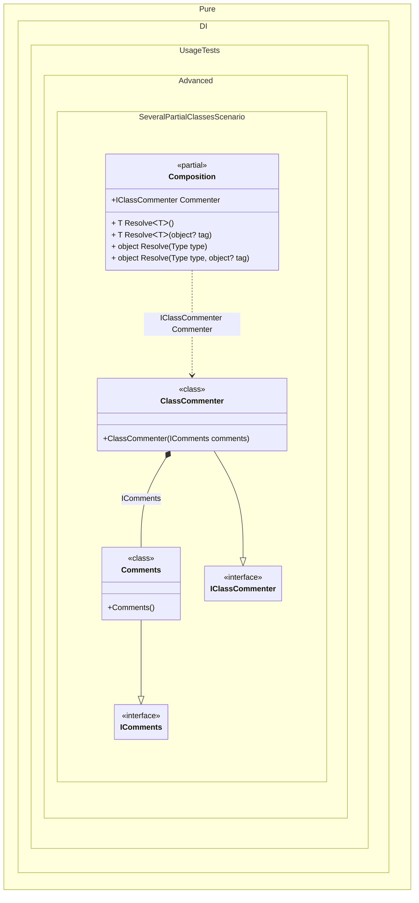

#### A few partial classes

The setting code for one Composition can be located in several methods and/or in several partial classes.


```c#
using Pure.DI;

var composition = new Composition();
var commenter = composition.Commenter;

// Infrastructure interface for retrieving comments (e.g., from a database)
interface IComments;

class Comments : IComments;

// Domain service for handling class comments
interface IClassCommenter;

class ClassCommenter(IComments comments) : IClassCommenter;

partial class Composition
{

    // Infrastructure layer setup.
    // This method isolates the configuration of databases or external services.
    static void SetupInfrastructure() =>
        DI.Setup()
            .Bind<IComments>().To<Comments>();
}

partial class Composition
{
    // Domain logic layer setup.
    // Here we bind domain services.
    static void SetupDomain() =>
        DI.Setup()
            .Bind<IClassCommenter>().To<ClassCommenter>();
}

partial class Composition
{
    // Public API setup (Composition Roots).
    // Determines which objects can be retrieved directly from the container.
    private static void SetupApi() =>
        DI.Setup()
            .Root<IClassCommenter>("Commenter");
}
```

<details>
<summary>Running this code sample locally</summary>

- Make sure you have the [.NET SDK 10.0](https://dotnet.microsoft.com/en-us/download/dotnet/10.0) or later is installed
```bash
dotnet --list-sdk
```
- Create a net10.0 (or later) console application
```bash
dotnet new console -n Sample
```
- Add reference to NuGet package
  - [Pure.DI](https://www.nuget.org/packages/Pure.DI)
```bash
dotnet add package Pure.DI
```
- Copy the example code into the _Program.cs_ file

You are ready to run the example 🚀
```bash
dotnet run
```

</details>

The following partial class will be generated:

```c#
partial class Composition
{
  public IClassCommenter Commenter
  {
    [MethodImpl(MethodImplOptions.AggressiveInlining)]
    get
    {
      return new ClassCommenter(new Comments());
    }
  }

  [MethodImpl(MethodImplOptions.AggressiveInlining)]
  public T Resolve<T>()
  {
    return Resolver<T>.Value.Resolve(this);
  }

  [MethodImpl(MethodImplOptions.AggressiveInlining)]
  public T Resolve<T>(object? tag)
  {
    return Resolver<T>.Value.ResolveByTag(this, tag);
  }

  [MethodImpl(MethodImplOptions.AggressiveInlining)]
  public object Resolve(Type type)
  {
    #if NETCOREAPP3_0_OR_GREATER
    var index = (int)(_bucketSize * (((uint)type.TypeHandle.GetHashCode()) % 1));
    #else
    var index = (int)(_bucketSize * (((uint)RuntimeHelpers.GetHashCode(type)) % 1));
    #endif
    ref var pair = ref _buckets[index];
    return Object.ReferenceEquals(pair.Key, type) ? pair.Value.Resolve(this) : Resolve(type, index);
  }

  [MethodImpl(MethodImplOptions.NoInlining)]
  private object Resolve(Type type, int index)
  {
    var finish = index + _bucketSize;
    while (++index < finish)
    {
      ref var pair = ref _buckets[index];
      if (Object.ReferenceEquals(pair.Key, type))
      {
        return pair.Value.Resolve(this);
      }
    }

    throw new CannotResolveException($"{CannotResolveMessage} {OfTypeMessage} {type}.", type, null);
  }

  [MethodImpl(MethodImplOptions.AggressiveInlining)]
  public object Resolve(Type type, object? tag)
  {
    #if NETCOREAPP3_0_OR_GREATER
    var index = (int)(_bucketSize * (((uint)type.TypeHandle.GetHashCode()) % 1));
    #else
    var index = (int)(_bucketSize * (((uint)RuntimeHelpers.GetHashCode(type)) % 1));
    #endif
    ref var pair = ref _buckets[index];
    return Object.ReferenceEquals(pair.Key, type) ? pair.Value.ResolveByTag(this, tag) : Resolve(type, tag, index);
  }

  [MethodImpl(MethodImplOptions.NoInlining)]
  private object Resolve(Type type, object? tag, int index)
  {
    var finish = index + _bucketSize;
    while (++index < finish)
    {
      ref var pair = ref _buckets[index];
      if (Object.ReferenceEquals(pair.Key, type))
      {
        return pair.Value.ResolveByTag(this, tag);
      }
    }

    throw new CannotResolveException($"{CannotResolveMessage} \"{tag}\" {OfTypeMessage} {type}.", type, tag);
  }

  private readonly static uint _bucketSize;
  private readonly static Pair<IResolver<Composition, object>>[] _buckets;

  static Composition()
  {
    var valResolver_0000 = new Resolver_0000();
    Resolver<IClassCommenter>.Value = valResolver_0000;
    _buckets = Buckets<IResolver<Composition, object>>.Create(
      1,
      out _bucketSize,
      new Pair<IResolver<Composition, object>>[1]
      {
         new Pair<IResolver<Composition, object>>(typeof(IClassCommenter), valResolver_0000)
      });
  }

  private const string CannotResolveMessage = "Cannot resolve composition root ";
  private const string OfTypeMessage = "of type ";

  private class Resolver<T>: IResolver<Composition, T>
  {
    public static IResolver<Composition, T> Value = new Resolver<T>();

    public virtual T Resolve(Composition composite)
    {
      throw new CannotResolveException($"{CannotResolveMessage}{OfTypeMessage}{typeof(T)}.", typeof(T), null);
    }

    public virtual T ResolveByTag(Composition composite, object tag)
    {
      throw new CannotResolveException($"{CannotResolveMessage}\"{tag}\" {OfTypeMessage}{typeof(T)}.", typeof(T), tag);
    }
  }

  private sealed class Resolver_0000: Resolver<IClassCommenter>
  {
    public override IClassCommenter Resolve(Composition composition)
    {
      return composition.Commenter;
    }

    public override IClassCommenter ResolveByTag(Composition composition, object tag)
    {
      switch (tag)
      {
        case null:
          return composition.Commenter;

        default:
          return base.ResolveByTag(composition, tag);
      }
    }
  }
}
```

Class diagram:



