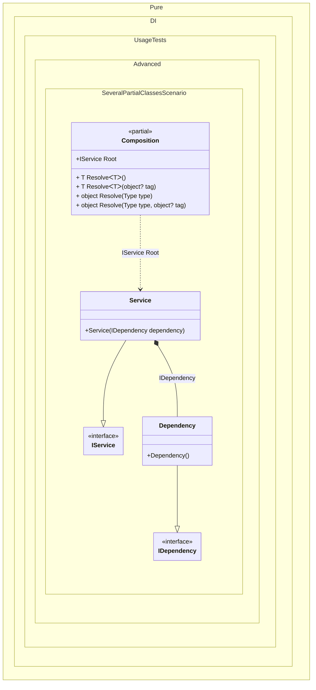

#### A few partial classes

[](../tests/Pure.DI.UsageTests/Advanced/SeveralPartialClassesScenario.cs)

The setting code for one Composition can be located in several methods and/or in several partial classes.


```c#
using Pure.DI;

var composition = new Composition();
var service = composition.Root;

interface IDependency;

class Dependency : IDependency;

interface IService;

class Service(IDependency dependency) : IService;

partial class Composition
{
    // This method will not be called in runtime
    static void Setup1() =>
        DI.Setup()
            .Bind<IDependency>().To<Dependency>();
}

partial class Composition
{
    // This method will not be called in runtime
    static void Setup2() =>
        DI.Setup()
            .Bind<IService>().To<Service>();
}

partial class Composition
{
    // This method will not be called in runtime
    private static void Setup3() =>
        DI.Setup()
            .Root<IService>("Root");
}
```

<details>
<summary>Running this code sample locally</summary>

- Make sure you have the [.NET SDK 9.0](https://dotnet.microsoft.com/en-us/download/dotnet/9.0) or later is installed
- Create a net9.0 (or later) console application
- Add reference to NuGet package
  - [Pure.DI](https://www.nuget.org/packages/Pure.DI)
- Copy the example code into the _Program.cs_ file

You are ready to run the example!

</details>


Class diagram:



