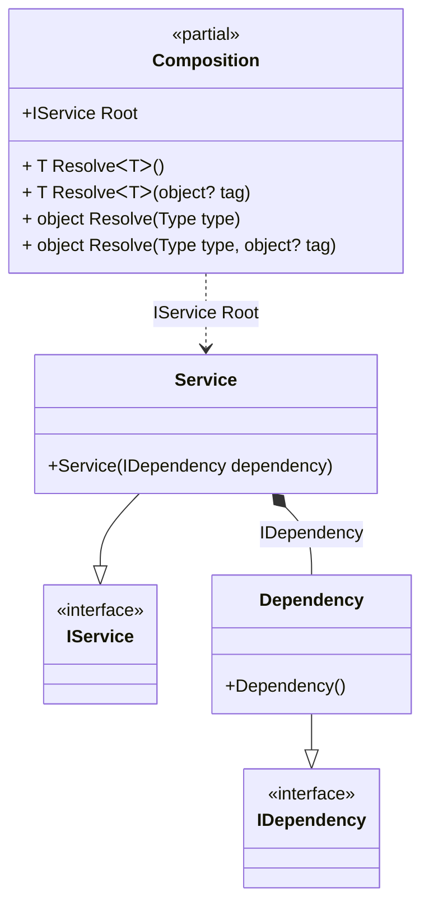

#### A few partial classes

[](../tests/Pure.DI.UsageTests/Advanced/SeveralPartialClassesScenario.cs)

The setting code for one Composition can be located in several methods and/or in several partial classes.


```c#
interface IDependency;

class Dependency : IDependency;

interface IService;

class Service(IDependency dependency) : IService;

partial class Composition
{
    // This method will not be called in runtime
    static void Setup1() =>
        DI.Setup()
            .Bind<IDependency>().To<Dependency>();
}

partial class Composition
{
    // This method will not be called in runtime
    static void Setup2() =>
        DI.Setup()
            .Bind<IService>().To<Service>();
}

partial class Composition
{
    // This method will not be called in runtime
    private static void Setup3() =>
        DI.Setup()
            .Root<IService>("Root");
}

var composition = new Composition();
var service = composition.Root;
```

The following partial class will be generated:

```c#
partial class Composition
{
  private readonly Composition _root;

  [OrdinalAttribute(20)]
  public Composition()
  {
    _root = this;
  }

  internal Composition(Composition parentScope)
  {
    _root = (parentScope ?? throw new ArgumentNullException(nameof(parentScope)))._root;
  }

  public IService Root
  {
    [MethodImpl(MethodImplOptions.AggressiveInlining)]
    get
    {
      return new Service(new Dependency());
    }
  }

  [MethodImpl(MethodImplOptions.AggressiveInlining)]
  public T Resolve<T>()
  {
    return Resolver<T>.Value.Resolve(this);
  }

  [MethodImpl(MethodImplOptions.AggressiveInlining)]
  public T Resolve<T>(object? tag)
  {
    return Resolver<T>.Value.ResolveByTag(this, tag);
  }

  [MethodImpl(MethodImplOptions.AggressiveInlining)]
  public object Resolve(Type type)
  {
    var index = (int)(_bucketSize * ((uint)RuntimeHelpers.GetHashCode(type) % 1));
    ref var pair = ref _buckets[index];
    return pair.Key == type ? pair.Value.Resolve(this) : Resolve(type, index);
  }

  [MethodImpl(MethodImplOptions.NoInlining)]
  private object Resolve(Type type, int index)
  {
    var finish = index + _bucketSize;
    while (++index < finish)
    {
      ref var pair = ref _buckets[index];
      if (pair.Key == type)
      {
        return pair.Value.Resolve(this);
      }
    }

    throw new InvalidOperationException($"{CannotResolveMessage} {OfTypeMessage} {type}.");
  }

  [MethodImpl(MethodImplOptions.AggressiveInlining)]
  public object Resolve(Type type, object? tag)
  {
    var index = (int)(_bucketSize * ((uint)RuntimeHelpers.GetHashCode(type) % 1));
    ref var pair = ref _buckets[index];
    return pair.Key == type ? pair.Value.ResolveByTag(this, tag) : Resolve(type, tag, index);
  }

  [MethodImpl(MethodImplOptions.NoInlining)]
  private object Resolve(Type type, object? tag, int index)
  {
    var finish = index + _bucketSize;
    while (++index < finish)
    {
      ref var pair = ref _buckets[index];
      if (pair.Key == type)
      {
        return pair.Value.ResolveByTag(this, tag);
      }
    }

    throw new InvalidOperationException($"{CannotResolveMessage} \"{tag}\" {OfTypeMessage} {type}.");
  }

  private readonly static int _bucketSize;
  private readonly static Pair<Type, IResolver<Composition, object>>[] _buckets;

  static Composition()
  {
    var valResolver_0000 = new Resolver_0000();
    Resolver<IService>.Value = valResolver_0000;
    _buckets = Buckets<Type, IResolver<Composition, object>>.Create(
      1,
      out _bucketSize,
      new Pair<Type, IResolver<Composition, object>>[1]
      {
         new Pair<Type, IResolver<Composition, object>>(typeof(IService), valResolver_0000)
      });
  }

  private const string CannotResolveMessage = "Cannot resolve composition root ";
  private const string OfTypeMessage = "of type ";

  private class Resolver<T>: IResolver<Composition, T>
  {
    public static IResolver<Composition, T> Value = new Resolver<T>();

    public virtual T Resolve(Composition composite)
    {
      throw new InvalidOperationException($"{CannotResolveMessage}{OfTypeMessage}{typeof(T)}.");
    }

    public virtual T ResolveByTag(Composition composite, object tag)
    {
      throw new InvalidOperationException($"{CannotResolveMessage}\"{tag}\" {OfTypeMessage}{typeof(T)}.");
    }
  }

  private sealed class Resolver_0000: Resolver<IService>
  {
    public override IService Resolve(Composition composition)
    {
      return composition.Root;
    }

    public override IService ResolveByTag(Composition composition, object tag)
    {
      switch (tag)
      {
        case null:
          return composition.Root;

        default:
          return base.ResolveByTag(composition, tag);
      }
    }
  }
}
```

Class diagram:



