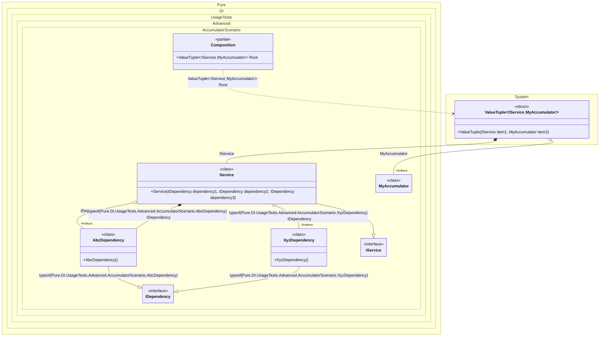

#### Accumulators

Accumulators allow you to accumulate instances of certain types and lifetimes.


```c#
using Shouldly;
using Pure.DI;
using static Pure.DI.Lifetime;

DI.Setup(nameof(Composition))
    .Accumulate<IAccumulating, MyAccumulator>(Transient, Singleton)
    .Bind<IDependency>().As(PerBlock).To<AbcDependency>()
    .Bind<IDependency>(Tag.Type).To<AbcDependency>()
    .Bind<IDependency>(Tag.Type).As(Singleton).To<XyzDependency>()
    .Bind<IService>().To<Service>()
    .Root<(IService service, MyAccumulator accumulator)>("Root");

var composition = new Composition();
var (service, accumulator) = composition.Root;
accumulator.Count.ShouldBe(3);
accumulator[0].ShouldBeOfType<XyzDependency>();
accumulator[1].ShouldBeOfType<AbcDependency>();
accumulator[2].ShouldBeOfType<Service>();

interface IAccumulating;

class MyAccumulator : List<IAccumulating>;

interface IDependency;

class AbcDependency : IDependency, IAccumulating;

class XyzDependency : IDependency, IAccumulating;

interface IService;

class Service(
    [Tag(typeof(AbcDependency))] IDependency dependency1,
    [Tag(typeof(XyzDependency))] IDependency dependency2,
    IDependency dependency3)
    : IService, IAccumulating;
```

<details>
<summary>Running this code sample locally</summary>

- Make sure you have the [.NET SDK 9.0](https://dotnet.microsoft.com/en-us/download/dotnet/9.0) or later is installed
```bash
dotnet --list-sdk
```
- Create a net9.0 (or later) console application
```bash
dotnet new console -n Sample
```
- Add references to NuGet packages
  - [Pure.DI](https://www.nuget.org/packages/Pure.DI)
  - [Shouldly](https://www.nuget.org/packages/Shouldly)
```bash
dotnet add package Pure.DI
dotnet add package Shouldly
```
- Copy the example code into the _Program.cs_ file

You are ready to run the example 🚀
```bash
dotnet run
```

</details>

The following partial class will be generated:

```c#
partial class Composition
{
  private readonly Composition _root;
#if NET9_0_OR_GREATER
  private readonly Lock _lock;
#else
  private readonly Object _lock;
#endif

  private XyzDependency? _singletonXyzDependency54;

  [OrdinalAttribute(256)]
  public Composition()
  {
    _root = this;
#if NET9_0_OR_GREATER
    _lock = new Lock();
#else
    _lock = new Object();
#endif
  }

  internal Composition(Composition parentScope)
  {
    _root = (parentScope ?? throw new ArgumentNullException(nameof(parentScope)))._root;
    _lock = _root._lock;
  }

  public (IService service, MyAccumulator accumulator) Root
  {
    [MethodImpl(MethodImplOptions.AggressiveInlining)]
    get
    {
      var perBlockMyAccumulator1 = new MyAccumulator();
      var perBlockAbcDependency5 = new AbcDependency();
      if (_root._singletonXyzDependency54 is null)
      {
        lock (_lock)
        {
          if (_root._singletonXyzDependency54 is null)
          {
            XyzDependency _singletonXyzDependency54Temp;
            _singletonXyzDependency54Temp = new XyzDependency();
            perBlockMyAccumulator1.Add(_singletonXyzDependency54Temp);
            Thread.MemoryBarrier();
            _root._singletonXyzDependency54 = _singletonXyzDependency54Temp;
          }
        }
      }

      var transientAbcDependency3 = new AbcDependency();
      lock (_lock)
      {
        perBlockMyAccumulator1.Add(transientAbcDependency3);
      }

      var transientService2 = new Service(transientAbcDependency3, _root._singletonXyzDependency54, perBlockAbcDependency5);
      lock (_lock)
      {
        perBlockMyAccumulator1.Add(transientService2);
      }

      return (transientService2, perBlockMyAccumulator1);
    }
  }
}
```

Class diagram:



