```mermaid
classDiagram
  class Composition {
    +ValueTupleᐸIServiceˏMyAccumulatorᐳ Root
    + T ResolveᐸTᐳ()
    + T ResolveᐸTᐳ(object? tag)
    + object Resolve(Type type)
    + object Resolve(Type type, object? tag)
  }
  class MyAccumulator
  class ValueTupleᐸIServiceˏMyAccumulatorᐳ {
    +ValueTuple(IService item1, MyAccumulator item2)
  }
  AbcDependency --|> IDependency : 
  class AbcDependency {
    +AbcDependency()
  }
  XyzDependency --|> IDependency : typeof(Pure.DI.UsageTests.Advanced.AccumulatorScenario.XyzDependency) 
  class XyzDependency {
    +XyzDependency()
  }
  Service --|> IService : 
  class Service {
    +Service(IDependency dependency1, IDependency dependency2, IDependency dependency3)
  }
  class IDependency {
    <<abstract>>
  }
  class IService {
    <<abstract>>
  }
  ValueTupleᐸIServiceˏMyAccumulatorᐳ *--  Service : IService
  ValueTupleᐸIServiceˏMyAccumulatorᐳ *--  MyAccumulator : MyAccumulator
  Service *--  AbcDependency : typeof(Pure.DI.UsageTests.Advanced.AccumulatorScenario.AbcDependency)  IDependency
  Service o--  "Singleton" XyzDependency : typeof(Pure.DI.UsageTests.Advanced.AccumulatorScenario.XyzDependency)  IDependency
  Service o--  "PerBlock" AbcDependency : IDependency
  Composition ..> ValueTupleᐸIServiceˏMyAccumulatorᐳ : ValueTupleᐸIServiceˏMyAccumulatorᐳ Root
```

#### Accumulators

[](../tests/Pure.DI.UsageTests/Advanced/AccumulatorScenario.cs)

Accumulators allow you to accumulate instances of certain types and lifetimes.

```c#
interface IAccumulating;

class MyAccumulator : List<IAccumulating>;

interface IDependency;

class AbcDependency : IDependency, IAccumulating;

class XyzDependency : IDependency, IAccumulating;

interface IService;

class Service(
    [Tag(typeof(AbcDependency))] IDependency dependency1,
    [Tag(typeof(XyzDependency))] IDependency dependency2,
    IDependency dependency3)
    : IService, IAccumulating;

DI.Setup(nameof(Composition))
    .Accumulate<IAccumulating, MyAccumulator>(Lifetime.Transient, Lifetime.Singleton)
    .Bind<IDependency>().As(Lifetime.PerBlock).To<AbcDependency>()
    .Bind<IDependency>(Tag.Type).To<AbcDependency>()
    .Bind<IDependency>(Tag.Type).As(Lifetime.Singleton).To<XyzDependency>()
    .Bind<IService>().To<Service>()
    .Root<(IService service, MyAccumulator accumulator)>("Root");

var composition = new Composition();
var (service, accumulator) = composition.Root;
accumulator.Count.ShouldBe(3);
accumulator[0].ShouldBeOfType<XyzDependency>();
accumulator[1].ShouldBeOfType<AbcDependency>();
accumulator[2].ShouldBeOfType<Service>();
        
```

<details open>
<summary>Class Diagram</summary>



</details>

<details>
<summary>Pure.DI-generated partial class Composition</summary><blockquote>

```c#
partial class Composition
{
  private readonly Composition _rootM04D12di;
  private readonly object _lockM04D12di;
  private Pure.DI.UsageTests.Advanced.AccumulatorScenario.XyzDependency _singletonM04D12di38_XyzDependency;
  
  public Composition()
  {
    _rootM04D12di = this;
    _lockM04D12di = new object();
  }
  
  internal Composition(Composition baseComposition)
  {
    _rootM04D12di = baseComposition._rootM04D12di;
    _lockM04D12di = _rootM04D12di._lockM04D12di;
  }
  
  public (Pure.DI.UsageTests.Advanced.AccumulatorScenario.IService service, Pure.DI.UsageTests.Advanced.AccumulatorScenario.MyAccumulator accumulator) Root
  {
    [global::System.Runtime.CompilerServices.MethodImpl((global::System.Runtime.CompilerServices.MethodImplOptions)0x100)]
    get
    {
      var accumulatorM04D12di42 = new Pure.DI.UsageTests.Advanced.AccumulatorScenario.MyAccumulator();
      Pure.DI.UsageTests.Advanced.AccumulatorScenario.AbcDependency perBlockM04D12di4_AbcDependency = new Pure.DI.UsageTests.Advanced.AccumulatorScenario.AbcDependency();
      if (_rootM04D12di._singletonM04D12di38_XyzDependency == null)
      {
          lock (_lockM04D12di)
          {
              if (_rootM04D12di._singletonM04D12di38_XyzDependency == null)
              {
                  Pure.DI.UsageTests.Advanced.AccumulatorScenario.XyzDependency _singletonM04D12di38_XyzDependencyTemp;
                  _singletonM04D12di38_XyzDependencyTemp = new Pure.DI.UsageTests.Advanced.AccumulatorScenario.XyzDependency();
                  accumulatorM04D12di42.Add(_singletonM04D12di38_XyzDependencyTemp);
                  global::System.Threading.Thread.MemoryBarrier();
                  _singletonM04D12di38_XyzDependency = _singletonM04D12di38_XyzDependencyTemp;
                  _rootM04D12di._singletonM04D12di38_XyzDependency = _singletonM04D12di38_XyzDependency;
              }
          }
      }
      Pure.DI.UsageTests.Advanced.AccumulatorScenario.AbcDependency transientM04D12di3_AbcDependency = new Pure.DI.UsageTests.Advanced.AccumulatorScenario.AbcDependency();
      lock (_lockM04D12di)
      {
          accumulatorM04D12di42.Add(transientM04D12di3_AbcDependency);
      }
      Pure.DI.UsageTests.Advanced.AccumulatorScenario.Service transientM04D12di1_Service = new Pure.DI.UsageTests.Advanced.AccumulatorScenario.Service(transientM04D12di3_AbcDependency, _rootM04D12di._singletonM04D12di38_XyzDependency, perBlockM04D12di4_AbcDependency);
      lock (_lockM04D12di)
      {
          accumulatorM04D12di42.Add(transientM04D12di1_Service);
      }
      return (transientM04D12di1_Service, accumulatorM04D12di42);
    }
  }
  
  public T Resolve<T>()
  {
    return ResolverM04D12di<T>.Value.Resolve(this);
  }
  
  public T Resolve<T>(object? tag)
  {
    return ResolverM04D12di<T>.Value.ResolveByTag(this, tag);
  }
  
  [global::System.Runtime.CompilerServices.MethodImpl((global::System.Runtime.CompilerServices.MethodImplOptions)0x100)]
  public object Resolve(global::System.Type type)
  {
    var index = (int)(_bucketSizeM04D12di * ((uint)global::System.Runtime.CompilerServices.RuntimeHelpers.GetHashCode(type) % 1));
    ref var pair = ref _bucketsM04D12di[index];
    return pair.Key == type ? pair.Value.Resolve(this) : ResolveM04D12di(type, index);
  }
  
  [global::System.Runtime.CompilerServices.MethodImpl((global::System.Runtime.CompilerServices.MethodImplOptions)0x8)]
  private object ResolveM04D12di(global::System.Type type, int index)
  {
    var finish = index + _bucketSizeM04D12di;
    while (++index < finish)
    {
      ref var pair = ref _bucketsM04D12di[index];
      if (pair.Key == type)
      {
        return pair.Value.Resolve(this);
      }
    }
    
    throw new global::System.InvalidOperationException($"Cannot resolve composition root of type {type}.");
  }
  
  [global::System.Runtime.CompilerServices.MethodImpl((global::System.Runtime.CompilerServices.MethodImplOptions)0x100)]
  public object Resolve(global::System.Type type, object? tag)
  {
    var index = (int)(_bucketSizeM04D12di * ((uint)global::System.Runtime.CompilerServices.RuntimeHelpers.GetHashCode(type) % 1));
    ref var pair = ref _bucketsM04D12di[index];
    return pair.Key == type ? pair.Value.ResolveByTag(this, tag) : ResolveM04D12di(type, index);
  }
  
  [global::System.Runtime.CompilerServices.MethodImpl((global::System.Runtime.CompilerServices.MethodImplOptions)0x8)]
  private object ResolveM04D12di(global::System.Type type, object? tag, int index)
  {
    var finish = index + _bucketSizeM04D12di;
    while (++index < finish)
    {
      ref var pair = ref _bucketsM04D12di[index];
      if (pair.Key == type)
      {
        return pair.Value.ResolveByTag(this, tag);
      }
    }
    
    throw new global::System.InvalidOperationException($"Cannot resolve composition root \"{tag}\" of type {type}.");
  }
  
  public override string ToString()
  {
    return
      "classDiagram\n" +
        "  class Composition {\n" +
          "    +ValueTupleᐸIServiceˏMyAccumulatorᐳ Root\n" +
          "    + T ResolveᐸTᐳ()\n" +
          "    + T ResolveᐸTᐳ(object? tag)\n" +
          "    + object Resolve(Type type)\n" +
          "    + object Resolve(Type type, object? tag)\n" +
        "  }\n" +
        "  class MyAccumulator\n" +
        "  class ValueTupleᐸIServiceˏMyAccumulatorᐳ {\n" +
          "    +ValueTuple(IService item1, MyAccumulator item2)\n" +
        "  }\n" +
        "  AbcDependency --|> IDependency : \n" +
        "  class AbcDependency {\n" +
          "    +AbcDependency()\n" +
        "  }\n" +
        "  XyzDependency --|> IDependency : typeof(Pure.DI.UsageTests.Advanced.AccumulatorScenario.XyzDependency) \n" +
        "  class XyzDependency {\n" +
          "    +XyzDependency()\n" +
        "  }\n" +
        "  Service --|> IService : \n" +
        "  class Service {\n" +
          "    +Service(IDependency dependency1, IDependency dependency2, IDependency dependency3)\n" +
        "  }\n" +
        "  class IDependency {\n" +
          "    <<abstract>>\n" +
        "  }\n" +
        "  class IService {\n" +
          "    <<abstract>>\n" +
        "  }\n" +
        "  ValueTupleᐸIServiceˏMyAccumulatorᐳ *--  Service : IService\n" +
        "  ValueTupleᐸIServiceˏMyAccumulatorᐳ *--  MyAccumulator : MyAccumulator\n" +
        "  Service *--  AbcDependency : typeof(Pure.DI.UsageTests.Advanced.AccumulatorScenario.AbcDependency)  IDependency\n" +
        "  Service o--  \"Singleton\" XyzDependency : typeof(Pure.DI.UsageTests.Advanced.AccumulatorScenario.XyzDependency)  IDependency\n" +
        "  Service o--  \"PerBlock\" AbcDependency : IDependency\n" +
        "  Composition ..> ValueTupleᐸIServiceˏMyAccumulatorᐳ : ValueTupleᐸIServiceˏMyAccumulatorᐳ Root";
  }
  
  private readonly static int _bucketSizeM04D12di;
  private readonly static global::Pure.DI.Pair<global::System.Type, global::Pure.DI.IResolver<Composition, object>>[] _bucketsM04D12di;
  
  static Composition()
  {
    var valResolverM04D12di_0000 = new ResolverM04D12di_0000();
    ResolverM04D12di<(Pure.DI.UsageTests.Advanced.AccumulatorScenario.IService service, Pure.DI.UsageTests.Advanced.AccumulatorScenario.MyAccumulator accumulator)>.Value = valResolverM04D12di_0000;
    _bucketsM04D12di = global::Pure.DI.Buckets<global::System.Type, global::Pure.DI.IResolver<Composition, object>>.Create(
      1,
      out _bucketSizeM04D12di,
      new global::Pure.DI.Pair<global::System.Type, global::Pure.DI.IResolver<Composition, object>>[1]
      {
         new global::Pure.DI.Pair<global::System.Type, global::Pure.DI.IResolver<Composition, object>>(typeof((Pure.DI.UsageTests.Advanced.AccumulatorScenario.IService service, Pure.DI.UsageTests.Advanced.AccumulatorScenario.MyAccumulator accumulator)), valResolverM04D12di_0000)
      });
  }
  
  private sealed class ResolverM04D12di<T>: global::Pure.DI.IResolver<Composition, T>
  {
    public static global::Pure.DI.IResolver<Composition, T> Value = new ResolverM04D12di<T>();
    
    public T Resolve(Composition composite)
    {
      throw new global::System.InvalidOperationException($"Cannot resolve composition root of type {typeof(T)}.");
    }
    
    public T ResolveByTag(Composition composite, object tag)
    {
      throw new global::System.InvalidOperationException($"Cannot resolve composition root \"{tag}\" of type {typeof(T)}.");
    }
  }
  
  private sealed class ResolverM04D12di_0000: global::Pure.DI.IResolver<Composition, (Pure.DI.UsageTests.Advanced.AccumulatorScenario.IService service, Pure.DI.UsageTests.Advanced.AccumulatorScenario.MyAccumulator accumulator)>, global::Pure.DI.IResolver<Composition, object>
  {
    public (Pure.DI.UsageTests.Advanced.AccumulatorScenario.IService service, Pure.DI.UsageTests.Advanced.AccumulatorScenario.MyAccumulator accumulator) Resolve(Composition composition)
    {
      return composition.Root;
    }
    
    public (Pure.DI.UsageTests.Advanced.AccumulatorScenario.IService service, Pure.DI.UsageTests.Advanced.AccumulatorScenario.MyAccumulator accumulator) ResolveByTag(Composition composition, object tag)
    {
      switch (tag)
      {
        case null:
          return composition.Root;
      }
      throw new global::System.InvalidOperationException($"Cannot resolve composition root \"{tag}\" of type (Pure.DI.UsageTests.Advanced.AccumulatorScenario.IService service, Pure.DI.UsageTests.Advanced.AccumulatorScenario.MyAccumulator accumulator).");
    }
    object global::Pure.DI.IResolver<Composition, object>.Resolve(Composition composition)
    {
      return Resolve(composition);
    }
    
    object global::Pure.DI.IResolver<Composition, object>.ResolveByTag(Composition composition, object tag)
    {
      return ResolveByTag(composition, tag);
    }
  }
}
```

</blockquote></details>

