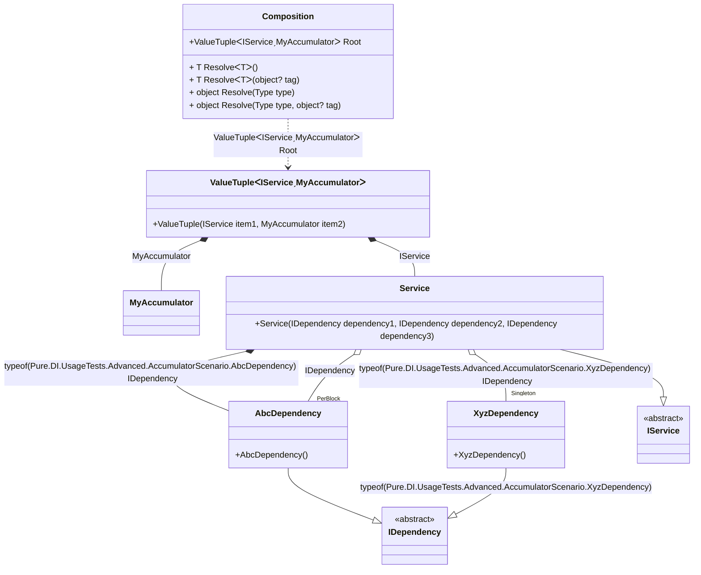

#### Accumulators

[](../tests/Pure.DI.UsageTests/Advanced/AccumulatorScenario.cs)

Accumulators allow you to accumulate instances of certain types and lifetimes.

```c#
interface IAccumulating;

class MyAccumulator : List<IAccumulating>;

interface IDependency;

class AbcDependency : IDependency, IAccumulating;

class XyzDependency : IDependency, IAccumulating;

interface IService;

class Service(
    [Tag(typeof(AbcDependency))] IDependency dependency1,
    [Tag(typeof(XyzDependency))] IDependency dependency2,
    IDependency dependency3)
    : IService, IAccumulating;

DI.Setup(nameof(Composition))
    .Accumulate<IAccumulating, MyAccumulator>(Lifetime.Transient, Lifetime.Singleton)
    .Bind<IDependency>().As(Lifetime.PerBlock).To<AbcDependency>()
    .Bind<IDependency>(Tag.Type).To<AbcDependency>()
    .Bind<IDependency>(Tag.Type).As(Lifetime.Singleton).To<XyzDependency>()
    .Bind<IService>().To<Service>()
    .Root<(IService service, MyAccumulator accumulator)>("Root");

var composition = new Composition();
var (service, accumulator) = composition.Root;
accumulator.Count.ShouldBe(3);
accumulator[0].ShouldBeOfType<XyzDependency>();
accumulator[1].ShouldBeOfType<AbcDependency>();
accumulator[2].ShouldBeOfType<Service>();
        
```

<details open>
<summary>Class Diagram</summary>



</details>

<details>
<summary>Pure.DI-generated partial class Composition</summary><blockquote>

```c#
partial class Composition
{
  private readonly Composition _root;
  private readonly object _lock;
  private XyzDependency? _singleton38_XyzDependency;

  public Composition()
  {
    _root = this;
    _lock = new object();
  }

  internal Composition(Composition parentScope)
  {
    _root = (parentScope ?? throw new ArgumentNullException(nameof(parentScope)))._root;
    _lock = _root._lock;
  }

  public (IService service, MyAccumulator accumulator) Root
  {
    [MethodImpl((MethodImplOptions)0x100)]
    get
    {
      var accumulator42 = new MyAccumulator();
      AbcDependency perBlock4_AbcDependency = new AbcDependency();
      if (_root._singleton38_XyzDependency == null)
      {
          lock (_lock)
          {
              if (_root._singleton38_XyzDependency == null)
              {
                  XyzDependency _singleton38_XyzDependencyTemp;
                  _singleton38_XyzDependencyTemp = new XyzDependency();
                  accumulator42.Add(_singleton38_XyzDependencyTemp);
                  Thread.MemoryBarrier();
                  _root._singleton38_XyzDependency = _singleton38_XyzDependencyTemp;
              }
          }
      }
      AbcDependency transient3_AbcDependency = new AbcDependency();
      lock (_lock)
      {
          accumulator42.Add(transient3_AbcDependency);
      }
      Service transient1_Service = new Service(transient3_AbcDependency, _root._singleton38_XyzDependency!, perBlock4_AbcDependency);
      lock (_lock)
      {
          accumulator42.Add(transient1_Service);
      }
      return (transient1_Service, accumulator42);
    }
  }

  [MethodImpl((MethodImplOptions)0x100)]
  public T Resolve<T>()
  {
    return Resolver<T>.Value.Resolve(this);
  }

  [MethodImpl((MethodImplOptions)0x100)]
  public T Resolve<T>(object? tag)
  {
    return Resolver<T>.Value.ResolveByTag(this, tag);
  }

  [MethodImpl((MethodImplOptions)0x100)]
  public object Resolve(Type type)
  {
    var index = (int)(_bucketSize * ((uint)RuntimeHelpers.GetHashCode(type) % 1));
    ref var pair = ref _buckets[index];
    return pair.Key == type ? pair.Value.Resolve(this) : Resolve(type, index);
  }

  [MethodImpl((MethodImplOptions)0x8)]
  private object Resolve(Type type, int index)
  {
    var finish = index + _bucketSize;
    while (++index < finish)
    {
      ref var pair = ref _buckets[index];
      if (pair.Key == type)
      {
        return pair.Value.Resolve(this);
      }
    }

    throw new InvalidOperationException($"{CannotResolveMessage} {OfTypeMessage} {type}.");
  }

  [MethodImpl((MethodImplOptions)0x100)]
  public object Resolve(Type type, object? tag)
  {
    var index = (int)(_bucketSize * ((uint)RuntimeHelpers.GetHashCode(type) % 1));
    ref var pair = ref _buckets[index];
    return pair.Key == type ? pair.Value.ResolveByTag(this, tag) : Resolve(type, tag, index);
  }

  [MethodImpl((MethodImplOptions)0x8)]
  private object Resolve(Type type, object? tag, int index)
  {
    var finish = index + _bucketSize;
    while (++index < finish)
    {
      ref var pair = ref _buckets[index];
      if (pair.Key == type)
      {
        return pair.Value.ResolveByTag(this, tag);
      }
    }

    throw new InvalidOperationException($"{CannotResolveMessage} \"{tag}\" {OfTypeMessage} {type}.");
  }

  public override string ToString()
  {
    return
      "classDiagram\n" +
        "  class Composition {\n" +
          "    +ValueTupleᐸIServiceˏMyAccumulatorᐳ Root\n" +
          "    + T ResolveᐸTᐳ()\n" +
          "    + T ResolveᐸTᐳ(object? tag)\n" +
          "    + object Resolve(Type type)\n" +
          "    + object Resolve(Type type, object? tag)\n" +
        "  }\n" +
        "  class MyAccumulator\n" +
        "  class ValueTupleᐸIServiceˏMyAccumulatorᐳ {\n" +
          "    +ValueTuple(IService item1, MyAccumulator item2)\n" +
        "  }\n" +
        "  AbcDependency --|> IDependency : \n" +
        "  class AbcDependency {\n" +
          "    +AbcDependency()\n" +
        "  }\n" +
        "  XyzDependency --|> IDependency : typeof(XyzDependency) \n" +
        "  class XyzDependency {\n" +
          "    +XyzDependency()\n" +
        "  }\n" +
        "  Service --|> IService : \n" +
        "  class Service {\n" +
          "    +Service(IDependency dependency1, IDependency dependency2, IDependency dependency3)\n" +
        "  }\n" +
        "  class IDependency {\n" +
          "    <<abstract>>\n" +
        "  }\n" +
        "  class IService {\n" +
          "    <<abstract>>\n" +
        "  }\n" +
        "  ValueTupleᐸIServiceˏMyAccumulatorᐳ *--  Service : IService\n" +
        "  ValueTupleᐸIServiceˏMyAccumulatorᐳ *--  MyAccumulator : MyAccumulator\n" +
        "  Service *--  AbcDependency : typeof(AbcDependency)  IDependency\n" +
        "  Service o--  \"Singleton\" XyzDependency : typeof(XyzDependency)  IDependency\n" +
        "  Service o--  \"PerBlock\" AbcDependency : IDependency\n" +
        "  Composition ..> ValueTupleᐸIServiceˏMyAccumulatorᐳ : ValueTupleᐸIServiceˏMyAccumulatorᐳ Root";
  }

  private readonly static int _bucketSize;
  private readonly static Pair<Type, IResolver<Composition, object>>[] _buckets;

  static Composition()
  {
    var valResolver_0000 = new Resolver_0000();
    Resolver<(IService service, MyAccumulator accumulator)>.Value = valResolver_0000;
    _buckets = Buckets<Type, IResolver<Composition, object>>.Create(
      1,
      out _bucketSize,
      new Pair<Type, IResolver<Composition, object>>[1]
      {
         new Pair<Type, IResolver<Composition, object>>(typeof((IService service, MyAccumulator accumulator)), valResolver_0000)
      });
  }

  private const string CannotResolveMessage = "Cannot resolve composition root ";
  private const string OfTypeMessage = "of type ";

  private class Resolver<T>: IResolver<Composition, T>
  {
    public static IResolver<Composition, T> Value = new Resolver<T>();

    public virtual T Resolve(Composition composite)
    {
      throw new InvalidOperationException($"{CannotResolveMessage}{OfTypeMessage}{typeof(T)}.");
    }

    public virtual T ResolveByTag(Composition composite, object tag)
    {
      throw new InvalidOperationException($"{CannotResolveMessage}\"{tag}\" {OfTypeMessage}{typeof(T)}.");
    }
  }

  private sealed class Resolver_0000: Resolver<(IService service, MyAccumulator accumulator)>, IResolver<Composition, object>
  {
    public override (IService service, MyAccumulator accumulator) Resolve(Composition composition)
    {
      return composition.Root;
    }

    public override (IService service, MyAccumulator accumulator) ResolveByTag(Composition composition, object tag)
    {
      switch (tag)
      {
        case null:
          return composition.Root;
        default:
          return base.ResolveByTag(composition, tag);
      }
    }
    object IResolver<Composition, object>.Resolve(Composition composition)
    {
      return Resolve(composition);
    }

    object IResolver<Composition, object>.ResolveByTag(Composition composition, object tag)
    {
      return ResolveByTag(composition, tag);
    }
  }
}
```

</blockquote></details>

