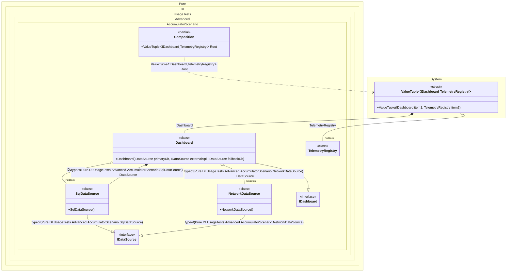

#### Accumulators

Accumulators allow you to accumulate instances of certain types and lifetimes.


```c#
using Shouldly;
using Pure.DI;
using static Pure.DI.Lifetime;

DI.Setup(nameof(Composition))
    // Accumulates all instances implementing ITelemetrySource
    // into a collection of type TelemetryRegistry.
    // The accumulation applies to Transient and Singleton lifetimes.
    .Accumulate<ITelemetrySource, TelemetryRegistry>(Transient, Singleton)

    // Infrastructure bindings
    .Bind<IDataSource>().As(PerBlock).To<SqlDataSource>()
    .Bind<IDataSource>(Tag.Type).To<SqlDataSource>()
    .Bind<IDataSource>(Tag.Type).As(Singleton).To<NetworkDataSource>()
    .Bind<IDashboard>().To<Dashboard>()

    // Composition root
    .Root<(IDashboard dashboard, TelemetryRegistry registry)>("Root");

var composition = new Composition();
var (dashboard, registry) = composition.Root;

// Checks that all telemetry sources have been collected
registry.Count.ShouldBe(3);
// The order of accumulation depends on the order of object creation in the graph
registry[0].ShouldBeOfType<NetworkDataSource>();
registry[1].ShouldBeOfType<SqlDataSource>();
registry[2].ShouldBeOfType<Dashboard>();

// Represents a component that produces telemetry data
interface ITelemetrySource;

// Accumulator for collecting all telemetry sources in the object graph
class TelemetryRegistry : List<ITelemetrySource>;

// Abstract data source interface
interface IDataSource;

// SQL database implementation acting as a telemetry source
class SqlDataSource : IDataSource, ITelemetrySource;

// Network data source implementation acting as a telemetry source
class NetworkDataSource : IDataSource, ITelemetrySource;

// Dashboard interface
interface IDashboard;

// Dashboard implementation aggregating data from sources
class Dashboard(
    [Tag(typeof(SqlDataSource))] IDataSource primaryDb,
    [Tag(typeof(NetworkDataSource))] IDataSource externalApi,
    IDataSource fallbackDb)
    : IDashboard, ITelemetrySource;
```

<details>
<summary>Running this code sample locally</summary>

- Make sure you have the [.NET SDK 10.0](https://dotnet.microsoft.com/en-us/download/dotnet/10.0) or later is installed
```bash
dotnet --list-sdk
```
- Create a net10.0 (or later) console application
```bash
dotnet new console -n Sample
```
- Add references to NuGet packages
  - [Pure.DI](https://www.nuget.org/packages/Pure.DI)
  - [Shouldly](https://www.nuget.org/packages/Shouldly)
```bash
dotnet add package Pure.DI
dotnet add package Shouldly
```
- Copy the example code into the _Program.cs_ file

You are ready to run the example 🚀
```bash
dotnet run
```

</details>

The following partial class will be generated:

```c#
partial class Composition
{
#if NET9_0_OR_GREATER
  private readonly Lock _lock = new Lock();
#else
  private readonly Object _lock = new Object();
#endif

  private NetworkDataSource? _singletonNetworkDataSource53;

  public (IDashboard dashboard, TelemetryRegistry registry) Root
  {
    [MethodImpl(MethodImplOptions.AggressiveInlining)]
    get
    {
      var perBlockTelemetryRegistry1 = new TelemetryRegistry();
      if (_singletonNetworkDataSource53 is null)
        lock (_lock)
          if (_singletonNetworkDataSource53 is null)
          {
            NetworkDataSource _singletonNetworkDataSource53Temp;
            _singletonNetworkDataSource53Temp = new NetworkDataSource();
            perBlockTelemetryRegistry1.Add(_singletonNetworkDataSource53Temp);
            Thread.MemoryBarrier();
            _singletonNetworkDataSource53 = _singletonNetworkDataSource53Temp;
          }

      var transientSqlDataSource3 = new SqlDataSource();
      lock (_lock)
      {
        perBlockTelemetryRegistry1.Add(transientSqlDataSource3);
      }

      var transientDashboard2 = new Dashboard(transientSqlDataSource3, _singletonNetworkDataSource53, new SqlDataSource());
      lock (_lock)
      {
        perBlockTelemetryRegistry1.Add(transientDashboard2);
      }

      return (transientDashboard2, perBlockTelemetryRegistry1);
    }
  }
}
```

Class diagram:



