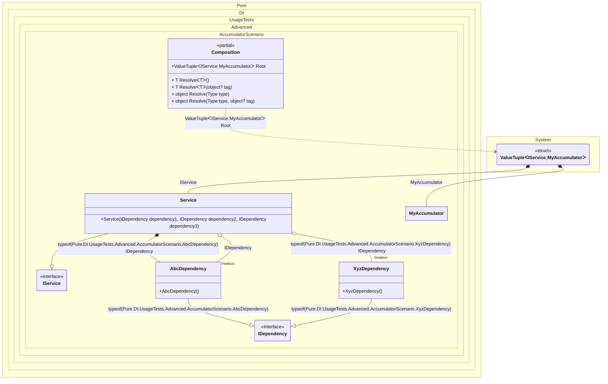

#### Accumulators

Accumulators allow you to accumulate instances of certain types and lifetimes.


```c#
using Shouldly;
using Pure.DI;
using static Pure.DI.Lifetime;

DI.Setup(nameof(Composition))
    .Accumulate<IAccumulating, MyAccumulator>(Transient, Singleton)
    .Bind<IDependency>().As(PerBlock).To<AbcDependency>()
    .Bind<IDependency>(Tag.Type).To<AbcDependency>()
    .Bind<IDependency>(Tag.Type).As(Singleton).To<XyzDependency>()
    .Bind<IService>().To<Service>()
    .Root<(IService service, MyAccumulator accumulator)>("Root");

var composition = new Composition();
var (service, accumulator) = composition.Root;
accumulator.Count.ShouldBe(3);
accumulator[0].ShouldBeOfType<AbcDependency>();
accumulator[1].ShouldBeOfType<XyzDependency>();
accumulator[2].ShouldBeOfType<Service>();

interface IAccumulating;

class MyAccumulator : List<IAccumulating>;

interface IDependency;

class AbcDependency : IDependency, IAccumulating;

class XyzDependency : IDependency, IAccumulating;

interface IService;

class Service(
    [Tag(typeof(AbcDependency))] IDependency dependency1,
    [Tag(typeof(XyzDependency))] IDependency dependency2,
    IDependency dependency3)
    : IService, IAccumulating;
```

<details>
<summary>Running this code sample locally</summary>

- Make sure you have the [.NET SDK 9.0](https://dotnet.microsoft.com/en-us/download/dotnet/9.0) or later is installed
```bash
dotnet --list-sdk
```
- Create a net9.0 (or later) console application
```bash
dotnet new console -n Sample
```
- Add references to NuGet packages
  - [Pure.DI](https://www.nuget.org/packages/Pure.DI)
  - [Shouldly](https://www.nuget.org/packages/Shouldly)
```bash
dotnet add package Pure.DI
dotnet add package Shouldly
```
- Copy the example code into the _Program.cs_ file

You are ready to run the example 🚀
```bash
dotnet run
```

</details>

The following partial class will be generated:

```c#
partial class Composition
{
  private readonly Composition _root;
  private readonly Lock _lock;

  private XyzDependency? _singletonXyzDependency53;

  [OrdinalAttribute(256)]
  public Composition()
  {
    _root = this;
    _lock = new Lock();
  }

  internal Composition(Composition parentScope)
  {
    _root = (parentScope ?? throw new ArgumentNullException(nameof(parentScope)))._root;
    _lock = _root._lock;
  }

  public (IService service, MyAccumulator accumulator) Root
  {
    [MethodImpl(MethodImplOptions.AggressiveInlining)]
    get
    {
      var accumulator56 = new MyAccumulator();
      AbcDependency transientAbcDependency3 = new AbcDependency();
      using (_lock.EnterScope())
      {
        accumulator56.Add(transientAbcDependency3);
      }

      if (_root._singletonXyzDependency53 is null)
      {
        using (_lock.EnterScope())
        {
          if (_root._singletonXyzDependency53 is null)
          {
            XyzDependency _singletonXyzDependency53Temp;
            _singletonXyzDependency53Temp = new XyzDependency();
            accumulator56.Add(_singletonXyzDependency53Temp);
            Thread.MemoryBarrier();
            _root._singletonXyzDependency53 = _singletonXyzDependency53Temp;
          }
        }
      }

      AbcDependency perBlockAbcDependency4 = new AbcDependency();
      Service transientService1 = new Service(transientAbcDependency3, _root._singletonXyzDependency53, perBlockAbcDependency4);
      using (_lock.EnterScope())
      {
        accumulator56.Add(transientService1);
      }

      return (transientService1, accumulator56);
    }
  }

  [MethodImpl(MethodImplOptions.AggressiveInlining)]
  public T Resolve<T>()
  {
    return Resolver<T>.Value.Resolve(this);
  }

  [MethodImpl(MethodImplOptions.AggressiveInlining)]
  public T Resolve<T>(object? tag)
  {
    return Resolver<T>.Value.ResolveByTag(this, tag);
  }

  [MethodImpl(MethodImplOptions.AggressiveInlining)]
  public object Resolve(Type type)
  {
    var index = (int)(_bucketSize * ((uint)RuntimeHelpers.GetHashCode(type) % 1));
    ref var pair = ref _buckets[index];
    return pair.Key == type ? pair.Value.Resolve(this) : Resolve(type, index);
  }

  [MethodImpl(MethodImplOptions.NoInlining)]
  private object Resolve(Type type, int index)
  {
    var finish = index + _bucketSize;
    while (++index < finish)
    {
      ref var pair = ref _buckets[index];
      if (pair.Key == type)
      {
        return pair.Value.Resolve(this);
      }
    }

    throw new InvalidOperationException($"{CannotResolveMessage} {OfTypeMessage} {type}.");
  }

  [MethodImpl(MethodImplOptions.AggressiveInlining)]
  public object Resolve(Type type, object? tag)
  {
    var index = (int)(_bucketSize * ((uint)RuntimeHelpers.GetHashCode(type) % 1));
    ref var pair = ref _buckets[index];
    return pair.Key == type ? pair.Value.ResolveByTag(this, tag) : Resolve(type, tag, index);
  }

  [MethodImpl(MethodImplOptions.NoInlining)]
  private object Resolve(Type type, object? tag, int index)
  {
    var finish = index + _bucketSize;
    while (++index < finish)
    {
      ref var pair = ref _buckets[index];
      if (pair.Key == type)
      {
        return pair.Value.ResolveByTag(this, tag);
      }
    }

    throw new InvalidOperationException($"{CannotResolveMessage} \"{tag}\" {OfTypeMessage} {type}.");
  }

  private readonly static int _bucketSize;
  private readonly static Pair<Type, IResolver<Composition, object>>[] _buckets;

  static Composition()
  {
    var valResolver_0000 = new Resolver_0000();
    Resolver<(IService service, MyAccumulator accumulator)>.Value = valResolver_0000;
    _buckets = Buckets<Type, IResolver<Composition, object>>.Create(
      1,
      out _bucketSize,
      new Pair<Type, IResolver<Composition, object>>[1]
      {
         new Pair<Type, IResolver<Composition, object>>(typeof((IService service, MyAccumulator accumulator)), valResolver_0000)
      });
  }

  private const string CannotResolveMessage = "Cannot resolve composition root ";
  private const string OfTypeMessage = "of type ";

  private class Resolver<T>: IResolver<Composition, T>
  {
    public static IResolver<Composition, T> Value = new Resolver<T>();

    public virtual T Resolve(Composition composite)
    {
      throw new InvalidOperationException($"{CannotResolveMessage}{OfTypeMessage}{typeof(T)}.");
    }

    public virtual T ResolveByTag(Composition composite, object tag)
    {
      throw new InvalidOperationException($"{CannotResolveMessage}\"{tag}\" {OfTypeMessage}{typeof(T)}.");
    }
  }

  private sealed class Resolver_0000: Resolver<(IService service, MyAccumulator accumulator)>, IResolver<Composition, object>
  {
    public override (IService service, MyAccumulator accumulator) Resolve(Composition composition)
    {
      return composition.Root;
    }

    public override (IService service, MyAccumulator accumulator) ResolveByTag(Composition composition, object tag)
    {
      switch (tag)
      {
        case null:
          return composition.Root;

        default:
          return base.ResolveByTag(composition, tag);
      }
    }
    object IResolver<Composition, object>.Resolve(Composition composition)
    {
      return Resolve(composition);
    }

    object IResolver<Composition, object>.ResolveByTag(Composition composition, object tag)
    {
      return ResolveByTag(composition, tag);
    }
  }
}
```

Class diagram:



