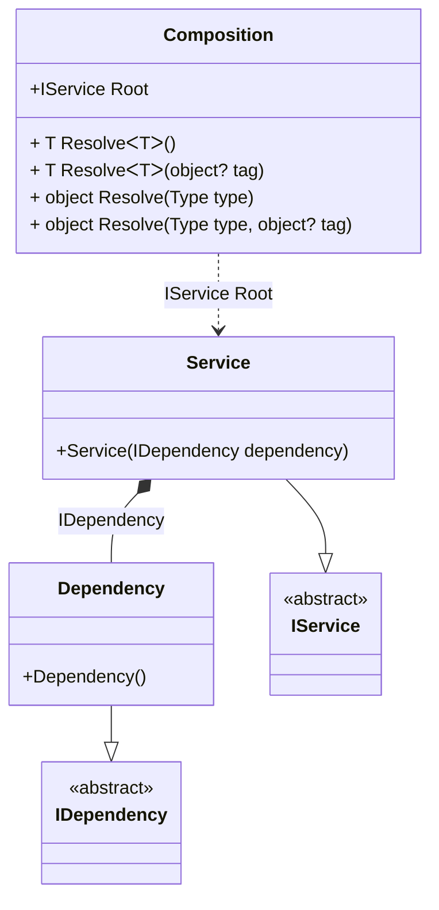

#### Advanced interception

[](../tests/Pure.DI.UsageTests/Interception/AdvancedInterceptionScenario.cs)

This approach of interception maximizes performance by precompiling the proxy object factory.

```c#
public interface IDependency
{
    void DependencyCall();
}

class Dependency : IDependency
{
    public void DependencyCall() { }
}

public interface IService
{
    IDependency Dependency { get; }

    void ServiceCall();
}

class Service(IDependency dependency) : IService
{
    public IDependency Dependency { get; } = dependency;

    public void ServiceCall() { }
}

internal partial class Composition: IInterceptor
{
    private readonly List<string> _log;
    private static readonly IProxyBuilder ProxyBuilder = new DefaultProxyBuilder();
    private readonly IInterceptor[] _interceptors;

    public Composition(List<string> log)
        : this()
    {
        _log = log;
        _interceptors = [this];
    }

    private partial T OnDependencyInjection<T>(
        in T value,
        object? tag,
        Lifetime lifetime)
    {
        if (typeof(T).IsValueType)
        {
            return value;
        }

        return ProxyFactory<T>.GetFactory(ProxyBuilder)(
            value,
            _interceptors);
    }

    public void Intercept(IInvocation invocation)
    {
        _log.Add(invocation.Method.Name);
        invocation.Proceed();
    }

    private static class ProxyFactory<T>
    {
        private static Func<T, IInterceptor[], T>? _factory;

        public static Func<T, IInterceptor[], T> GetFactory(IProxyBuilder proxyBuilder) =>
            _factory ?? CreateFactory(proxyBuilder);

        private static Func<T, IInterceptor[], T> CreateFactory(IProxyBuilder proxyBuilder)
        {
            // Compiles a delegate to create a proxy for the performance boost
            var proxyType = proxyBuilder.CreateInterfaceProxyTypeWithTargetInterface(
                typeof(T),
                Type.EmptyTypes,
                ProxyGenerationOptions.Default);
            var ctor = proxyType.GetConstructors()
                .Single(i => i.GetParameters().Length == 2);
            var instance = Expression.Parameter(typeof(T));
            var interceptors = Expression.Parameter(typeof(IInterceptor[]));
            var newProxyExpression = Expression.New(ctor, interceptors, instance);
            return _factory = Expression.Lambda<Func<T, IInterceptor[], T>>(
                newProxyExpression,
                instance,
                interceptors)
                .Compile();
        }
    }
}

// OnDependencyInjection = On
DI.Setup(nameof(Composition))
    .Bind<IDependency>().To<Dependency>()
    .Bind<IService>().Tags().To<Service>().Root<IService>("Root");

var log = new List<string>();
var composition = new Composition(log);
var service = composition.Root;
service.ServiceCall();
service.Dependency.DependencyCall();

log.ShouldBe(
    ImmutableArray.Create(
        "ServiceCall",
        "get_Dependency",
        "DependencyCall"));
```

<details open>
<summary>Class Diagram</summary>



</details>

<details>
<summary>Pure.DI-generated partial class Composition</summary><blockquote>

```c#
/// <para>
/// Composition roots:<br/>
/// <list type="table">
/// <listheader>
/// <term>Root</term>
/// <description>Description</description>
/// </listheader>
/// <item>
/// <term>
/// <see cref="Pure.DI.UsageTests.Interception.AdvancedInterceptionScenario.Service"/> Root
/// </term>
/// <description>
/// </description>
/// </item>
/// </list>
/// </para>
/// <example>
/// This shows how to get an instance of type <see cref="Pure.DI.UsageTests.Interception.AdvancedInterceptionScenario.Service"/> using the composition root <see cref="Root"/>:
/// <code>
/// var composition = new Composition();
/// var instance = composition.Root;
/// </code>
/// </example>
/// <a href="https://mermaid.live/view#pako:eNqdkz9uwjAUxq_y5LkDSoYUNkioxEozejHJE02L48gxSAhxB-7SpdfhJo3tIDsmbVGXJ-f9-z7_5JxIIUokM1LsWNtmFdtKxqmktfmGVPBGtJWqRA10P5kkC13Tp2ixekV5qAqEtRDKpSGHNbZid8Dr5Su_Xj5N-tnE6Z9tYvOOhdLn-AUU296N2YbbrB3Kjw2C6sI_ulP4XTLJ9CnDBusS6-JoMESZi0lqRpewCpriOTiQQc3n6EpjpKz-DfXP4n7HQNkv-LJ93mr63suhn8CJXRre1S2OraOUbVolWc912cexTeP-Hl8zQDP3AUFIvePiGdfD4fuOjISNHdUA6t2LJ0-Eo-SsKrs_6ESJekOOlMwoKZn8oORMzt9eESO4">Class diagram</a><br/>
/// This class was created by <a href="https://github.com/DevTeam/Pure.DI">Pure.DI</a> source code generator.
/// </summary>
/// <seealso cref="Pure.DI.DI.Setup"/>
[global::System.Diagnostics.CodeAnalysis.ExcludeFromCodeCoverage]
partial class Composition
{
  private readonly Composition _rootM02D26di;
  
  /// <summary>
  /// This constructor creates a new instance of <see cref="Composition"/>.
  /// </summary>
  public Composition()
  {
    _rootM02D26di = this;
  }
  
  /// <summary>
  /// This constructor creates a new instance of <see cref="Composition"/> scope based on <paramref name="baseComposition"/>. This allows the <see cref="Lifetime.Scoped"/> life time to be applied.
  /// </summary>
  /// <param name="baseComposition">Base composition.</param>
  internal Composition(Composition baseComposition)
  {
    _rootM02D26di = baseComposition._rootM02D26di;
  }
  
  #region Composition Roots
  public Pure.DI.UsageTests.Interception.AdvancedInterceptionScenario.IService Root
  {
    #if NETSTANDARD2_0_OR_GREATER || NETCOREAPP || NET40_OR_GREATER || NET
    [global::System.Diagnostics.Contracts.Pure]
    #endif
    get
    {
      return OnDependencyInjection<Pure.DI.UsageTests.Interception.AdvancedInterceptionScenario.IService>(new Pure.DI.UsageTests.Interception.AdvancedInterceptionScenario.Service(OnDependencyInjection<Pure.DI.UsageTests.Interception.AdvancedInterceptionScenario.IDependency>(new Pure.DI.UsageTests.Interception.AdvancedInterceptionScenario.Dependency(), null, Pure.DI.Lifetime.Transient)), null, Pure.DI.Lifetime.Transient);
    }
  }
  #endregion
  
  #region API
  /// <summary>
  /// Resolves the composition root.
  /// </summary>
  /// <typeparam name="T">The type of the composition root.</typeparam>
  /// <returns>A composition root.</returns>
  #if NETSTANDARD2_0_OR_GREATER || NETCOREAPP || NET40_OR_GREATER || NET
  [global::System.Diagnostics.Contracts.Pure]
  #endif
  public T Resolve<T>()
  {
    return ResolverM02D26di<T>.Value.Resolve(this);
  }
  
  /// <summary>
  /// Resolves the composition root by tag.
  /// </summary>
  /// <typeparam name="T">The type of the composition root.</typeparam>
  /// <param name="tag">The tag of a composition root.</param>
  /// <returns>A composition root.</returns>
  #if NETSTANDARD2_0_OR_GREATER || NETCOREAPP || NET40_OR_GREATER || NET
  [global::System.Diagnostics.Contracts.Pure]
  #endif
  public T Resolve<T>(object? tag)
  {
    return ResolverM02D26di<T>.Value.ResolveByTag(this, tag);
  }
  
  /// <summary>
  /// Resolves the composition root.
  /// </summary>
  /// <param name="type">The type of the composition root.</param>
  /// <returns>A composition root.</returns>
  #if NETSTANDARD2_0_OR_GREATER || NETCOREAPP || NET40_OR_GREATER || NET
  [global::System.Diagnostics.Contracts.Pure]
  #endif
  public object Resolve(global::System.Type type)
  {
    var index = (int)(_bucketSizeM02D26di * ((uint)global::System.Runtime.CompilerServices.RuntimeHelpers.GetHashCode(type) % 1));
    var finish = index + _bucketSizeM02D26di;
    do {
      ref var pair = ref _bucketsM02D26di[index];
      if (ReferenceEquals(pair.Key, type))
      {
        return pair.Value.Resolve(this);
      }
    } while (++index < finish);
    
    throw new global::System.InvalidOperationException($"Cannot resolve composition root of type {type}.");
  }
  
  /// <summary>
  /// Resolves the composition root by tag.
  /// </summary>
  /// <param name="type">The type of the composition root.</param>
  /// <param name="tag">The tag of a composition root.</param>
  /// <returns>A composition root.</returns>
  #if NETSTANDARD2_0_OR_GREATER || NETCOREAPP || NET40_OR_GREATER || NET
  [global::System.Diagnostics.Contracts.Pure]
  #endif
  public object Resolve(global::System.Type type, object? tag)
  {
    var index = (int)(_bucketSizeM02D26di * ((uint)global::System.Runtime.CompilerServices.RuntimeHelpers.GetHashCode(type) % 1));
    var finish = index + _bucketSizeM02D26di;
    do {
      ref var pair = ref _bucketsM02D26di[index];
      if (ReferenceEquals(pair.Key, type))
      {
        return pair.Value.ResolveByTag(this, tag);
      }
    } while (++index < finish);
    
    throw new global::System.InvalidOperationException($"Cannot resolve composition root \"{tag}\" of type {type}.");
  }
  
  private partial T OnDependencyInjection<T>(in T value, object? tag, global::Pure.DI.Lifetime lifetime);
  #endregion
  
  /// <summary>
  /// This method provides a class diagram in mermaid format. To see this diagram, simply call the method and copy the text to this site https://mermaid.live/.
  /// </summary>
  public override string ToString()
  {
    return
      "classDiagram\n" +
        "  class Composition {\n" +
          "    +IService Root\n" +
          "    + T ResolveᐸTᐳ()\n" +
          "    + T ResolveᐸTᐳ(object? tag)\n" +
          "    + object Resolve(Type type)\n" +
          "    + object Resolve(Type type, object? tag)\n" +
        "  }\n" +
        "  Dependency --|> IDependency : \n" +
        "  class Dependency {\n" +
          "    +Dependency()\n" +
        "  }\n" +
        "  Service --|> IService : \n" +
        "  class Service {\n" +
          "    +Service(IDependency dependency)\n" +
        "  }\n" +
        "  class IDependency {\n" +
          "    <<abstract>>\n" +
        "  }\n" +
        "  class IService {\n" +
          "    <<abstract>>\n" +
        "  }\n" +
        "  Service *--  Dependency : IDependency\n" +
        "  Composition ..> Service : IService Root";
  }
  
  private readonly static int _bucketSizeM02D26di;
  private readonly static global::Pure.DI.Pair<global::System.Type, global::Pure.DI.IResolver<Composition, object>>[] _bucketsM02D26di;
  
  static Composition()
  {
    var valResolverM02D26di_0000 = new ResolverM02D26di_0000();
    ResolverM02D26di<Pure.DI.UsageTests.Interception.AdvancedInterceptionScenario.IService>.Value = valResolverM02D26di_0000;
    _bucketsM02D26di = global::Pure.DI.Buckets<global::System.Type, global::Pure.DI.IResolver<Composition, object>>.Create(
      1,
      out _bucketSizeM02D26di,
      new global::Pure.DI.Pair<global::System.Type, global::Pure.DI.IResolver<Composition, object>>[1]
      {
         new global::Pure.DI.Pair<global::System.Type, global::Pure.DI.IResolver<Composition, object>>(typeof(Pure.DI.UsageTests.Interception.AdvancedInterceptionScenario.IService), valResolverM02D26di_0000)
      });
  }
  
  #region Resolvers
  private sealed class ResolverM02D26di<T>: global::Pure.DI.IResolver<Composition, T>
  {
    public static global::Pure.DI.IResolver<Composition, T> Value = new ResolverM02D26di<T>();
    
    public T Resolve(Composition composite)
    {
      throw new global::System.InvalidOperationException($"Cannot resolve composition root of type {typeof(T)}.");
    }
    
    public T ResolveByTag(Composition composite, object tag)
    {
      throw new global::System.InvalidOperationException($"Cannot resolve composition root \"{tag}\" of type {typeof(T)}.");
    }
  }
  
  private sealed class ResolverM02D26di_0000: global::Pure.DI.IResolver<Composition, Pure.DI.UsageTests.Interception.AdvancedInterceptionScenario.IService>
  {
    public Pure.DI.UsageTests.Interception.AdvancedInterceptionScenario.IService Resolve(Composition composition)
    {
      return composition.Root;
    }
    
    public Pure.DI.UsageTests.Interception.AdvancedInterceptionScenario.IService ResolveByTag(Composition composition, object tag)
    {
      switch (tag)
      {
        case null:
          return composition.Root;
      }
      throw new global::System.InvalidOperationException($"Cannot resolve composition root \"{tag}\" of type Pure.DI.UsageTests.Interception.AdvancedInterceptionScenario.IService.");
    }
  }
  #endregion
}
```

</blockquote></details>

