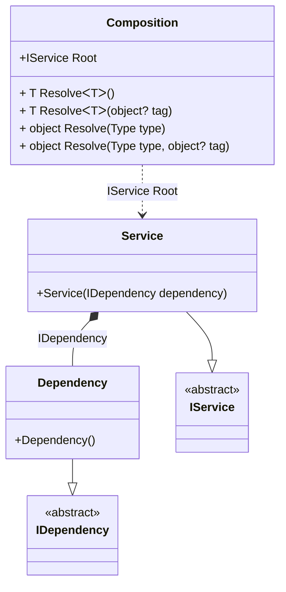

#### Advanced interception

[](../tests/Pure.DI.UsageTests/Interception/AdvancedInterceptionScenario.cs)

This approach of interception maximizes performance by precompiling the proxy object factory.

```c#
public interface IDependency
{
    void DependencyCall();
}

class Dependency : IDependency
{
    public void DependencyCall() { }
}

public interface IService
{
    IDependency Dependency { get; }

    void ServiceCall();
}

class Service(IDependency dependency) : IService
{
    public IDependency Dependency { get; } = dependency;

    public void ServiceCall() { }
}

internal partial class Composition: IInterceptor
{
    private readonly List<string> _log = new();
    private static readonly IProxyBuilder ProxyBuilder = new DefaultProxyBuilder();
    private readonly IInterceptor[] _interceptors = [];

    public Composition(List<string> log)
        : this()
    {
        _log = log;
        _interceptors = [this];
    }

    private partial T OnDependencyInjection<T>(
        in T value,
        object? tag,
        Lifetime lifetime)
    {
        if (typeof(T).IsValueType)
        {
            return value;
        }

        return ProxyFactory<T>.GetFactory(ProxyBuilder)(
            value,
            _interceptors);
    }

    public void Intercept(IInvocation invocation)
    {
        _log.Add(invocation.Method.Name);
        invocation.Proceed();
    }

    private static class ProxyFactory<T>
    {
        private static Func<T, IInterceptor[], T>? _factory;

        public static Func<T, IInterceptor[], T> GetFactory(IProxyBuilder proxyBuilder) =>
            _factory ?? CreateFactory(proxyBuilder);

        private static Func<T, IInterceptor[], T> CreateFactory(IProxyBuilder proxyBuilder)
        {
            // Compiles a delegate to create a proxy for the performance boost
            var proxyType = proxyBuilder.CreateInterfaceProxyTypeWithTargetInterface(
                typeof(T),
                Type.EmptyTypes,
                ProxyGenerationOptions.Default);
            var ctor = proxyType.GetConstructors()
                .Single(i => i.GetParameters().Length == 2);
            var instance = Expression.Parameter(typeof(T));
            var interceptors = Expression.Parameter(typeof(IInterceptor[]));
            var newProxyExpression = Expression.New(ctor, interceptors, instance);
            return _factory = Expression.Lambda<Func<T, IInterceptor[], T>>(
                newProxyExpression,
                instance,
                interceptors)
                .Compile();
        }
    }
}

// OnDependencyInjection = On
DI.Setup(nameof(Composition))
    .Bind().To<Dependency>()
    .RootBind<IService>("Root").To<Service>();

var log = new List<string>();
var composition = new Composition(log);
var service = composition.Root;
service.ServiceCall();
service.Dependency.DependencyCall();

log.ShouldBe(
    ImmutableArray.Create(
        "ServiceCall",
        "get_Dependency",
        "DependencyCall"));
```

<details open>
<summary>Class Diagram</summary>



</details>

<details>
<summary>Pure.DI-generated partial class Composition</summary><blockquote>

```c#
partial class Composition
{
  private readonly Composition _root;

  public Composition()
  {
    _root = this;
  }

  internal Composition(Composition parentScope)
  {
    _root = (parentScope ?? throw new ArgumentNullException(nameof(parentScope)))._root;
  }

  public IService Root
  {
    [MethodImpl((MethodImplOptions)0x100)]
    get
    {
      return OnDependencyInjection<IService>(new Service(OnDependencyInjection<IDependency>(new Dependency(), null, Lifetime.Transient)), null, Lifetime.Transient);
    }
  }

  [MethodImpl((MethodImplOptions)0x100)]
  public T Resolve<T>()
  {
    return Resolver<T>.Value.Resolve(this);
  }

  [MethodImpl((MethodImplOptions)0x100)]
  public T Resolve<T>(object? tag)
  {
    return Resolver<T>.Value.ResolveByTag(this, tag);
  }

  [MethodImpl((MethodImplOptions)0x100)]
  public object Resolve(Type type)
  {
    var index = (int)(_bucketSize * ((uint)RuntimeHelpers.GetHashCode(type) % 1));
    ref var pair = ref _buckets[index];
    return pair.Key == type ? pair.Value.Resolve(this) : Resolve(type, index);
  }

  [MethodImpl((MethodImplOptions)0x8)]
  private object Resolve(Type type, int index)
  {
    var finish = index + _bucketSize;
    while (++index < finish)
    {
      ref var pair = ref _buckets[index];
      if (pair.Key == type)
      {
        return pair.Value.Resolve(this);
      }
    }

    throw new InvalidOperationException($"{CannotResolveMessage} {OfTypeMessage} {type}.");
  }

  [MethodImpl((MethodImplOptions)0x100)]
  public object Resolve(Type type, object? tag)
  {
    var index = (int)(_bucketSize * ((uint)RuntimeHelpers.GetHashCode(type) % 1));
    ref var pair = ref _buckets[index];
    return pair.Key == type ? pair.Value.ResolveByTag(this, tag) : Resolve(type, tag, index);
  }

  [MethodImpl((MethodImplOptions)0x8)]
  private object Resolve(Type type, object? tag, int index)
  {
    var finish = index + _bucketSize;
    while (++index < finish)
    {
      ref var pair = ref _buckets[index];
      if (pair.Key == type)
      {
        return pair.Value.ResolveByTag(this, tag);
      }
    }

    throw new InvalidOperationException($"{CannotResolveMessage} \"{tag}\" {OfTypeMessage} {type}.");
  }

  private partial T OnDependencyInjection<T>(in T value, object? tag, Lifetime lifetime);

  public override string ToString()
  {
    return
      "classDiagram\n" +
        "  class Composition {\n" +
          "    +IService Root\n" +
          "    + T ResolveᐸTᐳ()\n" +
          "    + T ResolveᐸTᐳ(object? tag)\n" +
          "    + object Resolve(Type type)\n" +
          "    + object Resolve(Type type, object? tag)\n" +
        "  }\n" +
        "  Dependency --|> IDependency : \n" +
        "  class Dependency {\n" +
          "    +Dependency()\n" +
        "  }\n" +
        "  Service --|> IService : \n" +
        "  class Service {\n" +
          "    +Service(IDependency dependency)\n" +
        "  }\n" +
        "  class IDependency {\n" +
          "    <<abstract>>\n" +
        "  }\n" +
        "  class IService {\n" +
          "    <<abstract>>\n" +
        "  }\n" +
        "  Service *--  Dependency : IDependency\n" +
        "  Composition ..> Service : IService Root";
  }

  private readonly static int _bucketSize;
  private readonly static Pair<Type, IResolver<Composition, object>>[] _buckets;

  static Composition()
  {
    var valResolver_0000 = new Resolver_0000();
    Resolver<IService>.Value = valResolver_0000;
    _buckets = Buckets<Type, IResolver<Composition, object>>.Create(
      1,
      out _bucketSize,
      new Pair<Type, IResolver<Composition, object>>[1]
      {
         new Pair<Type, IResolver<Composition, object>>(typeof(IService), valResolver_0000)
      });
  }

  private const string CannotResolveMessage = "Cannot resolve composition root ";
  private const string OfTypeMessage = "of type ";

  private class Resolver<T>: IResolver<Composition, T>
  {
    public static IResolver<Composition, T> Value = new Resolver<T>();

    public virtual T Resolve(Composition composite)
    {
      throw new InvalidOperationException($"{CannotResolveMessage}{OfTypeMessage}{typeof(T)}.");
    }

    public virtual T ResolveByTag(Composition composite, object tag)
    {
      throw new InvalidOperationException($"{CannotResolveMessage}\"{tag}\" {OfTypeMessage}{typeof(T)}.");
    }
  }

  private sealed class Resolver_0000: Resolver<IService>
  {
    public override IService Resolve(Composition composition)
    {
      return composition.Root;
    }

    public override IService ResolveByTag(Composition composition, object tag)
    {
      switch (tag)
      {
        case null:
          return composition.Root;
        default:
          return base.ResolveByTag(composition, tag);
      }
    }
  }
}
```

</blockquote></details>

