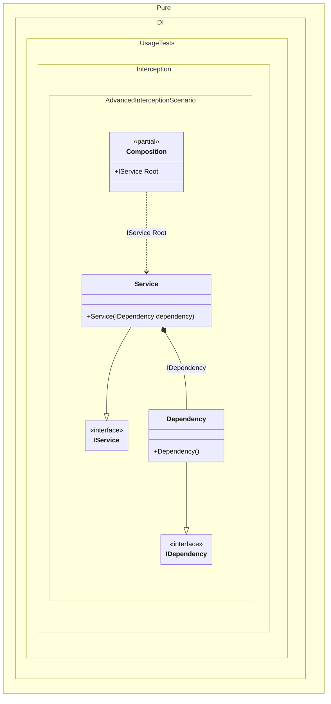

#### Advanced interception

[](../tests/Pure.DI.UsageTests/Interception/AdvancedInterceptionScenario.cs)

This approach of interception maximizes performance by precompiling the proxy object factory.


```c#
public interface IDependency
{
    int DependencyRun();
}

class Dependency : IDependency
{
    public int DependencyRun() => 33;
}

public interface IService
{
    IDependency Dependency { get; }

    string ServiceRun();
}

class Service(IDependency dependency) : IService
{
    public IDependency Dependency { get; } = dependency;

    public string ServiceRun() => "Abc";
}

internal partial class Composition : IInterceptor
{
    private readonly List<string> _log = [];
    private static readonly IProxyBuilder ProxyBuilder = new DefaultProxyBuilder();
    private readonly IInterceptor[] _interceptors = [];

    public Composition(List<string> log)
        : this()
    {
        _log = log;
        _interceptors = [this];
    }

    [MethodImpl(MethodImplOptions.AggressiveInlining)]
    private partial T OnDependencyInjection<T>(
        in T value,
        object? tag,
        Lifetime lifetime)
    {
        if (typeof(T).IsValueType)
        {
            return value;
        }

        return ProxyFactory<T>.GetFactory(ProxyBuilder)(
            value,
            _interceptors);
    }

    public void Intercept(IInvocation invocation)
    {
        invocation.Proceed();
        _log.Add($"{invocation.Method.Name} returns {invocation.ReturnValue}");
    }

    private static class ProxyFactory<T>
    {
        private static Func<T, IInterceptor[], T>? _factory;

        public static Func<T, IInterceptor[], T> GetFactory(IProxyBuilder proxyBuilder) =>
            _factory ?? CreateFactory(proxyBuilder);

        private static Func<T, IInterceptor[], T> CreateFactory(IProxyBuilder proxyBuilder)
        {
            // Compiles a delegate to create a proxy for the performance boost
            var proxyType = proxyBuilder.CreateInterfaceProxyTypeWithTargetInterface(
                typeof(T),
                Type.EmptyTypes,
                ProxyGenerationOptions.Default);
            var ctor = proxyType.GetConstructors()
                .Single(i => i.GetParameters().Length == 2);
            var instance = Expression.Parameter(typeof(T));
            var interceptors = Expression.Parameter(typeof(IInterceptor[]));
            var newProxyExpression = Expression.New(ctor, interceptors, instance);
            return _factory = Expression.Lambda<Func<T, IInterceptor[], T>>(
                    newProxyExpression,
                    instance,
                    interceptors)
                .Compile();
        }
    }
}

// OnDependencyInjection = On
DI.Setup(nameof(Composition))
    .Bind().To<Dependency>()
    .Bind().To<Service>()
    .Root<IService>("Root");

var log = new List<string>();
var composition = new Composition(log);
var service = composition.Root;
service.ServiceRun();
service.Dependency.DependencyRun();

log.ShouldBe(
    ImmutableArray.Create(
        "ServiceRun returns Abc",
        "get_Dependency returns Castle.Proxies.IDependencyProxy",
        "DependencyRun returns 33"));
```

The following partial class will be generated:

```c#
partial class Composition
{
  private readonly Composition _root;

  [OrdinalAttribute(256)]
  public Composition()
  {
    _root = this;
  }

  internal Composition(Composition parentScope)
  {
    _root = (parentScope ?? throw new ArgumentNullException(nameof(parentScope)))._root;
  }

  public IService Root
  {
    [MethodImpl(MethodImplOptions.AggressiveInlining)]
    get
    {
      return OnDependencyInjection<IService>(new Service(OnDependencyInjection<IDependency>(new Dependency(), null, Lifetime.Transient)), null, Lifetime.Transient);
    }
  }


  private partial T OnDependencyInjection<T>(in T value, object? tag, Lifetime lifetime);
}
```

Class diagram:



