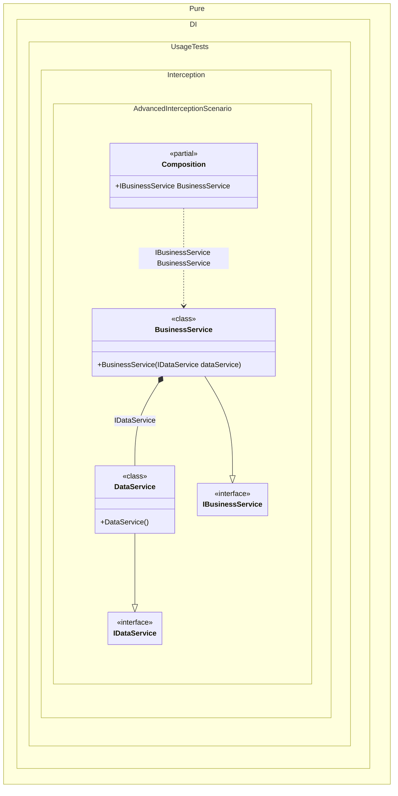

#### Advanced interception

This approach of interception maximizes performance by precompiling the proxy object factory.


```c#
using Shouldly;
using Castle.DynamicProxy;
using System.Collections.Immutable;
using System.Linq.Expressions;
using System.Runtime.CompilerServices;
using Pure.DI;

// OnDependencyInjection = On
DI.Setup(nameof(Composition))
    .Bind().To<DataService>()
    .Bind().To<BusinessService>()
    .Root<IBusinessService>("BusinessService");

var log = new List<string>();
var composition = new Composition(log);
var businessService = composition.BusinessService;

// Взаимодействие с сервисами для проверки перехвата
businessService.Process();
businessService.DataService.Count();

log.ShouldBe(
    ImmutableArray.Create(
        "Process returns Processed",
        "get_DataService returns Castle.Proxies.IDataServiceProxy",
        "Count returns 55"));

public interface IDataService
{
    int Count();
}

class DataService : IDataService
{
    public int Count() => 55;
}

public interface IBusinessService
{
    IDataService DataService { get; }

    string Process();
}

class BusinessService(IDataService dataService) : IBusinessService
{
    public IDataService DataService { get; } = dataService;

    public string Process() => "Processed";
}

internal partial class Composition : IInterceptor
{
    private readonly List<string> _log = [];
    private static readonly IProxyBuilder ProxyBuilder = new DefaultProxyBuilder();
    private readonly IInterceptor[] _interceptors = [];

    public Composition(List<string> log)
        : this()
    {
        _log = log;
        _interceptors = [this];
    }

    [MethodImpl(MethodImplOptions.AggressiveInlining)]
    private partial T OnDependencyInjection<T>(
        in T value,
        object? tag,
        Lifetime lifetime)
    {
        if (typeof(T).IsValueType)
        {
            return value;
        }

        return ProxyFactory<T>.GetFactory(ProxyBuilder)(
            value,
            _interceptors);
    }

    public void Intercept(IInvocation invocation)
    {
        invocation.Proceed();
        _log.Add($"{invocation.Method.Name} returns {invocation.ReturnValue}");
    }

    private static class ProxyFactory<T>
    {
        private static Func<T, IInterceptor[], T>? _factory;

        public static Func<T, IInterceptor[], T> GetFactory(IProxyBuilder proxyBuilder) =>
            _factory ?? CreateFactory(proxyBuilder);

        private static Func<T, IInterceptor[], T> CreateFactory(IProxyBuilder proxyBuilder)
        {
            // Compiles a delegate to create a proxy for the performance boost
            var proxyType = proxyBuilder.CreateInterfaceProxyTypeWithTargetInterface(
                typeof(T),
                Type.EmptyTypes,
                ProxyGenerationOptions.Default);
            var ctor = proxyType.GetConstructors()
                .Single(i => i.GetParameters().Length == 2);
            var instance = Expression.Parameter(typeof(T));
            var interceptors = Expression.Parameter(typeof(IInterceptor[]));
            var newProxyExpression = Expression.New(ctor, interceptors, instance);
            return _factory = Expression.Lambda<Func<T, IInterceptor[], T>>(
                    newProxyExpression,
                    instance,
                    interceptors)
                .Compile();
        }
    }
}
```

<details>
<summary>Running this code sample locally</summary>

- Make sure you have the [.NET SDK 10.0](https://dotnet.microsoft.com/en-us/download/dotnet/10.0) or later is installed
```bash
dotnet --list-sdk
```
- Create a net10.0 (or later) console application
```bash
dotnet new console -n Sample
```
- Add references to NuGet packages
  - [Pure.DI](https://www.nuget.org/packages/Pure.DI)
  - [Shouldly](https://www.nuget.org/packages/Shouldly)
  - [Castle.DynamicProxy](https://www.nuget.org/packages/Castle.DynamicProxy)
```bash
dotnet add package Pure.DI
dotnet add package Shouldly
dotnet add package Castle.DynamicProxy
```
- Copy the example code into the _Program.cs_ file

You are ready to run the example 🚀
```bash
dotnet run
```

</details>

The following partial class will be generated:

```c#
partial class Composition
{
  [OrdinalAttribute(256)]
  public Composition()
  {
  }

  internal Composition(Composition parentScope)
  {
  }

  public IBusinessService BusinessService
  {
    [MethodImpl(MethodImplOptions.AggressiveInlining)]
    get
    {
      return OnDependencyInjection<IBusinessService>(new BusinessService(OnDependencyInjection<IDataService>(new DataService(), null, Lifetime.Transient)), null, Lifetime.Transient);
    }
  }


  private partial T OnDependencyInjection<T>(in T value, object? tag, Lifetime lifetime);
}
```

Class diagram:



