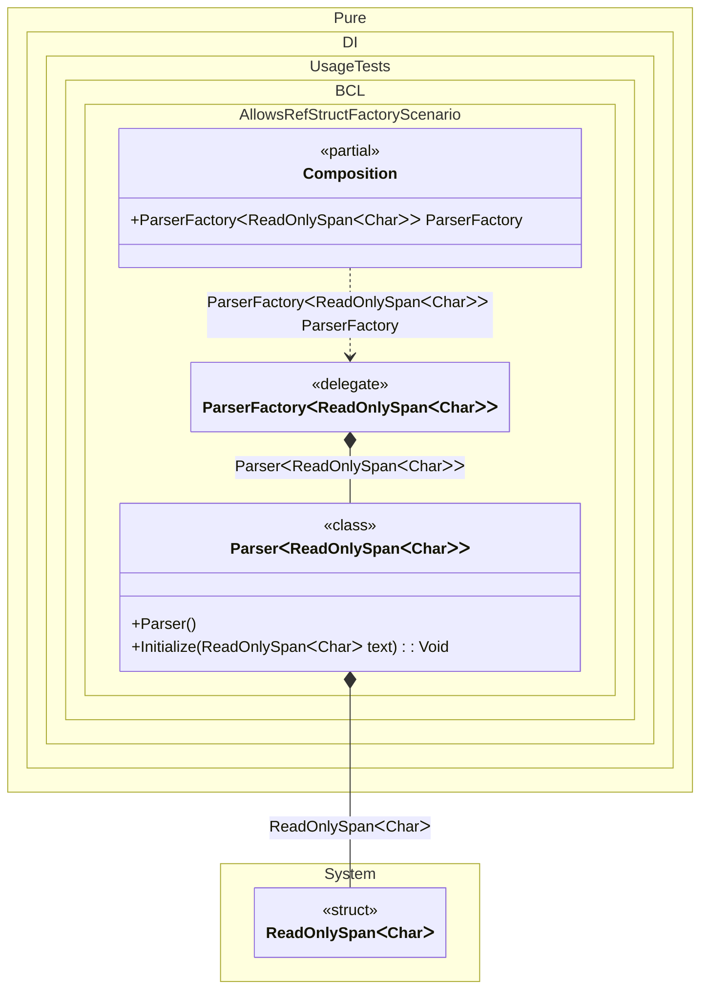

#### Allows ref struct factory

A delegate factory can accept stack-only values when the value is consumed immediately inside the same invocation. For custom generic delegate APIs that use `where T : allows ref struct`, pass the delegate argument through `ctx.Override<T>(...)` or `ctx.Let<T>(...)`, resolve the target immediately, and keep the override plus injection inside `lock (ctx.Lock)` when thread safety is enabled.


```c#
using Shouldly;
using Pure.DI;
using System;

DI.Setup(nameof(Composition))
    .Bind<ParserFactory<ReadOnlySpan<char>>>().To(ctx => new ParserFactory<ReadOnlySpan<char>>(text =>
    {
        lock (ctx.Lock)
        {
            ctx.Override<ReadOnlySpan<char>>(text);
            ctx.Inject<Parser<ReadOnlySpan<char>>>(out var parser);
            return parser.Initialized;
        }
    }))

    // Composition root
    .Root<ParserFactory<ReadOnlySpan<char>>>("ParserFactory");

var composition = new Composition();
var initialized = composition.ParserFactory("Hello".AsSpan());

initialized.ShouldBeTrue();

delegate bool ParserFactory<in T>(T text)
    where T : allows ref struct;

class Parser<T>
    where T : allows ref struct
{
    private bool _initialized;

    [Ordinal]
    public void Initialize(T text)
    {
        _ = text;
        _initialized = true;
    }

    public bool Initialized => _initialized;
}
```

<details>
<summary>Running this code sample locally</summary>

- Make sure you have the [.NET SDK 10.0](https://dotnet.microsoft.com/en-us/download/dotnet/10.0) or later installed
```bash
dotnet --list-sdk
```
- Create a net10.0 (or later) console application
```bash
dotnet new console -n Sample
```
- Add references to the NuGet packages
  - [Pure.DI](https://www.nuget.org/packages/Pure.DI)
  - [Shouldly](https://www.nuget.org/packages/Shouldly)
```bash
dotnet add package Pure.DI
dotnet add package Shouldly
```
- Copy the example code into the _Program.cs_ file

You are ready to run the example 🚀
```bash
dotnet run
```

</details>

This manual factory pattern keeps `ReadOnlySpan<T>` and other stack-only values inside the current synchronous frame. Pure.DI reports `DIE049` if the value is captured by a nested or returned delegate, and `DIW013` if the stack-only override is not synchronized while thread safety is enabled.
When the standard delegate shape is enough, prefer the generated default `Func<ReadOnlySpan<char>, T>` binding. It uses local values in the generated delegate invocation and does not require a manual `lock`.
The fluent contract API accepts ref-like type arguments in `Bind<T>()`, `RootBind<T>()`, `Root<T>()`, and `DefaultLifetime<T>()`. The `Transient<T>()`, `PerResolve<T>()`, and `PerBlock<T>()` shortcuts support ref-like implementations and factory results because generated instances remain local to root execution.
`Singleton<T>()` and `Scoped<T>()` keep their implementation and factory-result type heap-safe. Their parameterized factory overloads accept ref-like dependency types so Pure.DI can apply its stored-lifetime validation and report `DIE046` instead of failing earlier with the C# generic-argument diagnostic `CS9244`.

<details>
<summary>The following partial class will be generated</summary>

```c#
partial class Composition
{
#if NET9_0_OR_GREATER
  private readonly Lock _lock = new Lock();
#else
  private readonly Object _lock = new Object();
#endif

  public ParserFactory<ReadOnlySpan<char>> ParserFactory
  {
    [MethodImpl(MethodImplOptions.AggressiveInlining)]
    get
    {
      ParserFactory<ReadOnlySpan<char>> transientParserFactoryReadOnlySpanChar = new ParserFactory<ReadOnlySpan<char>>(localText =>
      {
        lock (_lock)
        {
          ReadOnlySpan<char> overriddenReadOnlySpanChar = localText;
          var transientParserReadOnlySpanChar = new Parser<ReadOnlySpan<char>>();
          transientParserReadOnlySpanChar.Initialize(overriddenReadOnlySpanChar);
          Parser<ReadOnlySpan<char>> localParser = transientParserReadOnlySpanChar;
          return localParser.Initialized;
        }
      });
      return transientParserFactoryReadOnlySpanChar;
    }
  }
}
```

</details>

Class diagram:



See also:

- [Span and ReadOnlySpan](span-and-readonlyspan.md)
- [Factory](factory.md)
- [Thread-safe overrides](thread-safe-overrides.md)

