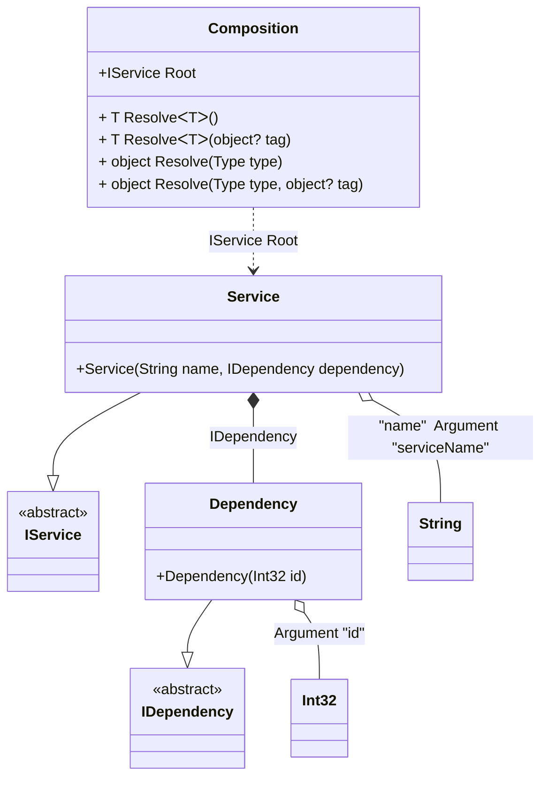

#### Arguments

[](../tests/Pure.DI.UsageTests/Basics/ArgumentsScenario.cs)

Sometimes you need to pass some state to a composition class to use it when resolving dependencies. To do this, just use the `Arg<T>(string argName)` method, specify the type of argument and its name. You can also specify a tag for each argument. You can then use them as dependencies when building the object graph. If you have multiple arguments of the same type, just use tags to distinguish them. The values of the arguments are manipulated when you create a composition class by calling its constructor. It is important to remember that only those arguments that are used in the object graph will appear in the constructor. Arguments that are not involved will not be added to the constructor arguments.

```c#
interface IDependency
{
    int Id { get; }
}

class Dependency(int id) : IDependency
{
    public int Id { get; } = id;
}

interface IService
{
    string Name { get; }

    IDependency Dependency { get; }
}

class Service(
    [Tag("name")] string name,
    IDependency dependency) : IService
{
    public string Name { get; } = name;

    public IDependency Dependency { get; } = dependency;
}

DI.Setup("Composition")
    .Bind<IDependency>().To<Dependency>()
    .Bind<IService>().To<Service>().Root<IService>("Root")
    // Some argument
    .Arg<int>("id")
    // An argument can be tagged (e.g., tag "name")
    // to be injectable by type and this tag
    .Arg<string>("serviceName", "name");

var composition = new Composition(serviceName: "Abc", id: 123);
var service = composition.Root;
service.Name.ShouldBe("Abc");
service.Dependency.Id.ShouldBe(123);
```

<details open>
<summary>Class Diagram</summary>



</details>

<details>
<summary>Pure.DI-generated partial class Composition</summary><blockquote>

```c#
partial class Composition
{
  private readonly global::System.IDisposable[] _disposableSingletonsM01D16di;
  private readonly int _argM01D16di_id;
  private readonly string _argM01D16di_serviceName;
  
  public Composition(int id, string serviceName)
  {
    if (global::System.Object.ReferenceEquals(serviceName, null))
    {
      throw new global::System.ArgumentNullException("serviceName");
    }
    
    _argM01D16di_id = id;
    _argM01D16di_serviceName = serviceName;
    _disposableSingletonsM01D16di = new global::System.IDisposable[0];
  }
  
  internal Composition(Composition parent)
  {
    _disposableSingletonsM01D16di = new global::System.IDisposable[0];
    _argM01D16di_id = parent._argM01D16di_id;
    _argM01D16di_serviceName = parent._argM01D16di_serviceName;
  }
  
  #region Composition Roots
  public Pure.DI.UsageTests.Basics.ArgumentsScenario.IService Root
  {
    #if NETSTANDARD2_0_OR_GREATER || NETCOREAPP || NET40_OR_GREATER || NET
    [global::System.Diagnostics.Contracts.Pure]
    #endif
    get
    {
      return new Pure.DI.UsageTests.Basics.ArgumentsScenario.Service(_argM01D16di_serviceName, new Pure.DI.UsageTests.Basics.ArgumentsScenario.Dependency(_argM01D16di_id));
    }
  }
  #endregion
  
  #region API
  #if NETSTANDARD2_0_OR_GREATER || NETCOREAPP || NET40_OR_GREATER || NET
  [global::System.Diagnostics.Contracts.Pure]
  #endif
  public T Resolve<T>()
  {
    return ResolverM01D16di<T>.Value.Resolve(this);
  }
  
  #if NETSTANDARD2_0_OR_GREATER || NETCOREAPP || NET40_OR_GREATER || NET
  [global::System.Diagnostics.Contracts.Pure]
  #endif
  public T Resolve<T>(object? tag)
  {
    return ResolverM01D16di<T>.Value.ResolveByTag(this, tag);
  }
  
  #if NETSTANDARD2_0_OR_GREATER || NETCOREAPP || NET40_OR_GREATER || NET
  [global::System.Diagnostics.Contracts.Pure]
  #endif
  public object Resolve(global::System.Type type)
  {
    var index = (int)(_bucketSizeM01D16di * ((uint)global::System.Runtime.CompilerServices.RuntimeHelpers.GetHashCode(type) % 1));
    var finish = index + _bucketSizeM01D16di;
    do {
      ref var pair = ref _bucketsM01D16di[index];
      if (ReferenceEquals(pair.Key, type))
      {
        return pair.Value.Resolve(this);
      }
    } while (++index < finish);
    
    throw new global::System.InvalidOperationException($"Cannot resolve composition root of type {type}.");
  }
  
  #if NETSTANDARD2_0_OR_GREATER || NETCOREAPP || NET40_OR_GREATER || NET
  [global::System.Diagnostics.Contracts.Pure]
  #endif
  public object Resolve(global::System.Type type, object? tag)
  {
    var index = (int)(_bucketSizeM01D16di * ((uint)global::System.Runtime.CompilerServices.RuntimeHelpers.GetHashCode(type) % 1));
    var finish = index + _bucketSizeM01D16di;
    do {
      ref var pair = ref _bucketsM01D16di[index];
      if (ReferenceEquals(pair.Key, type))
      {
        return pair.Value.ResolveByTag(this, tag);
      }
    } while (++index < finish);
    
    throw new global::System.InvalidOperationException($"Cannot resolve composition root \"{tag}\" of type {type}.");
  }
  #endregion
  
  public override string ToString()
  {
    return
      "classDiagram\n" +
        "  class Composition {\n" +
          "    +IService Root\n" +
          "    + T ResolveᐸTᐳ()\n" +
          "    + T ResolveᐸTᐳ(object? tag)\n" +
          "    + object Resolve(Type type)\n" +
          "    + object Resolve(Type type, object? tag)\n" +
        "  }\n" +
        "  Service --|> IService : \n" +
        "  class Service {\n" +
          "    +Service(String name, IDependency dependency)\n" +
        "  }\n" +
        "  Dependency --|> IDependency : \n" +
        "  class Dependency {\n" +
          "    +Dependency(Int32 id)\n" +
        "  }\n" +
        "  class Int32\n" +
        "  class String\n" +
        "  class IService {\n" +
          "    <<abstract>>\n" +
        "  }\n" +
        "  class IDependency {\n" +
          "    <<abstract>>\n" +
        "  }\n" +
        "  Service o-- String : \"name\"  Argument \"serviceName\"\n" +
        "  Service *--  Dependency : IDependency\n" +
        "  Dependency o-- Int32 : Argument \"id\"\n" +
        "  Composition ..> Service : IService Root";
  }
  
  private readonly static int _bucketSizeM01D16di;
  private readonly static global::Pure.DI.Pair<global::System.Type, global::Pure.DI.IResolver<Composition, object>>[] _bucketsM01D16di;
  
  static Composition()
  {
    var valResolverM01D16di_0000 = new ResolverM01D16di_0000();
    ResolverM01D16di<Pure.DI.UsageTests.Basics.ArgumentsScenario.IService>.Value = valResolverM01D16di_0000;
    _bucketsM01D16di = global::Pure.DI.Buckets<global::System.Type, global::Pure.DI.IResolver<Composition, object>>.Create(
      1,
      out _bucketSizeM01D16di,
      new global::Pure.DI.Pair<global::System.Type, global::Pure.DI.IResolver<Composition, object>>[1]
      {
         new global::Pure.DI.Pair<global::System.Type, global::Pure.DI.IResolver<Composition, object>>(typeof(Pure.DI.UsageTests.Basics.ArgumentsScenario.IService), valResolverM01D16di_0000)
      });
  }
  
  #region Resolvers
  private sealed class ResolverM01D16di<T>: global::Pure.DI.IResolver<Composition, T>
  {
    public static global::Pure.DI.IResolver<Composition, T> Value = new ResolverM01D16di<T>();
    
    public T Resolve(Composition composite)
    {
      throw new global::System.InvalidOperationException($"Cannot resolve composition root of type {typeof(T)}.");
    }
    
    public T ResolveByTag(Composition composite, object tag)
    {
      throw new global::System.InvalidOperationException($"Cannot resolve composition root \"{tag}\" of type {typeof(T)}.");
    }
  }
  
  private sealed class ResolverM01D16di_0000: global::Pure.DI.IResolver<Composition, Pure.DI.UsageTests.Basics.ArgumentsScenario.IService>
  {
    public Pure.DI.UsageTests.Basics.ArgumentsScenario.IService Resolve(Composition composition)
    {
      return composition.Root;
    }
    
    public Pure.DI.UsageTests.Basics.ArgumentsScenario.IService ResolveByTag(Composition composition, object tag)
    {
      switch (tag)
      {
        case null:
          return composition.Root;
      }
      throw new global::System.InvalidOperationException($"Cannot resolve composition root \"{tag}\" of type Pure.DI.UsageTests.Basics.ArgumentsScenario.IService.");
    }
  }
  #endregion
}
```

</blockquote></details>

