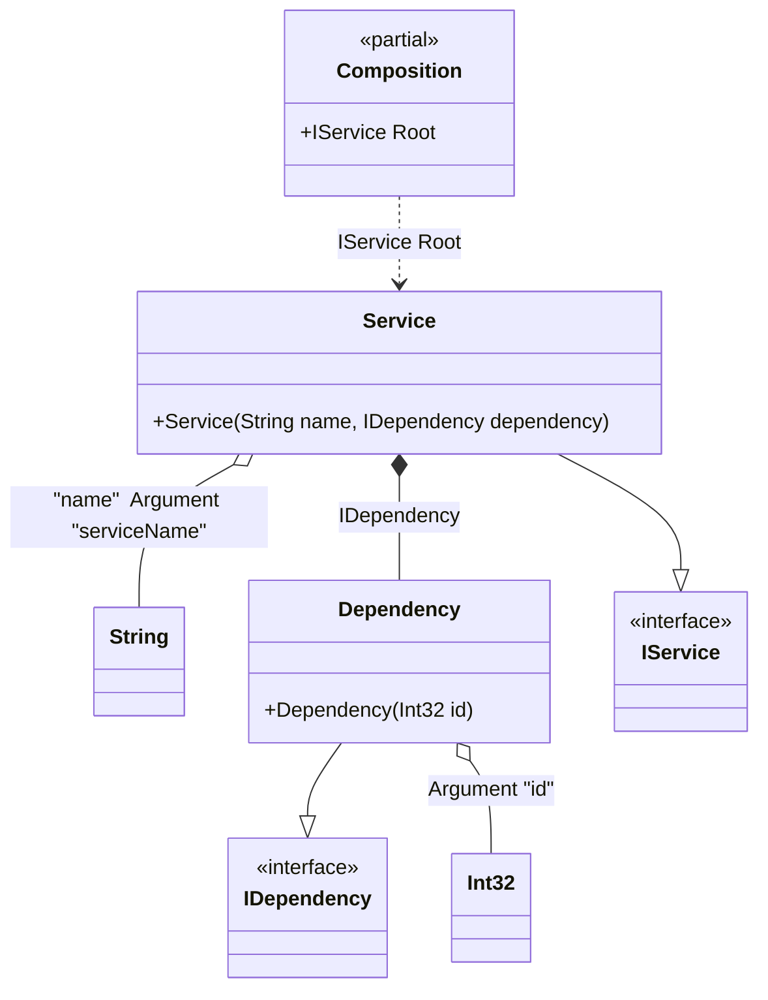

#### Arguments

[](../tests/Pure.DI.UsageTests/Basics/ArgumentsScenario.cs)

Sometimes you need to pass some state to a composition class to use it when resolving dependencies. To do this, just use the `Arg<T>(string argName)` method, specify the type of argument and its name. You can also specify a tag for each argument. You can then use them as dependencies when building the object graph. If you have multiple arguments of the same type, just use tags to distinguish them. The values of the arguments are manipulated when you create a composition class by calling its constructor. It is important to remember that only those arguments that are used in the object graph will appear in the constructor. Arguments that are not involved will not be added to the constructor arguments.


```c#
interface IDependency
{
    int Id { get; }
}

class Dependency(int id) : IDependency
{
    public int Id { get; } = id;
}

interface IService
{
    string Name { get; }

    IDependency Dependency { get; }
}

class Service(
    [Tag("name")] string name,
    IDependency dependency) : IService
{
    public string Name { get; } = name;

    public IDependency Dependency { get; } = dependency;
}

DI.Setup(nameof(Composition))
    .Bind<IDependency>().To<Dependency>()
    .Bind<IService>().To<Service>()

    // Composition root
    .Root<IService>("Root")

    // Some kind of identifier
    .Arg<int>("id")

    // An argument can be tagged (e.g., tag "name")
    // to be injectable by type and this tag
    .Arg<string>("serviceName", "name");

var composition = new Composition(serviceName: "Abc", id: 123);
        
// service = new Service("Abc", new Dependency(123));
var service = composition.Root;
        
service.Name.ShouldBe("Abc");
service.Dependency.Id.ShouldBe(123);
```

The following partial class will be generated:

```c#
partial class Composition
{
  private readonly Composition _root;

  private readonly int _arg_id;
  private readonly string _arg_serviceName;

  public Composition(int id, string serviceName)
  {
    _arg_id = id;
    _arg_serviceName = serviceName ?? throw new ArgumentNullException(nameof(serviceName));
    _root = this;
  }

  internal Composition(Composition parentScope)
  {
    _root = (parentScope ?? throw new ArgumentNullException(nameof(parentScope)))._root;
    _arg_id = _root._arg_id;
    _arg_serviceName = _root._arg_serviceName;
  }

  public IService Root
  {
    [MethodImpl(MethodImplOptions.AggressiveInlining)]
    get
    {
      return new Service(_arg_serviceName, new Dependency(_arg_id));
    }
  }
}
```

Class diagram:



