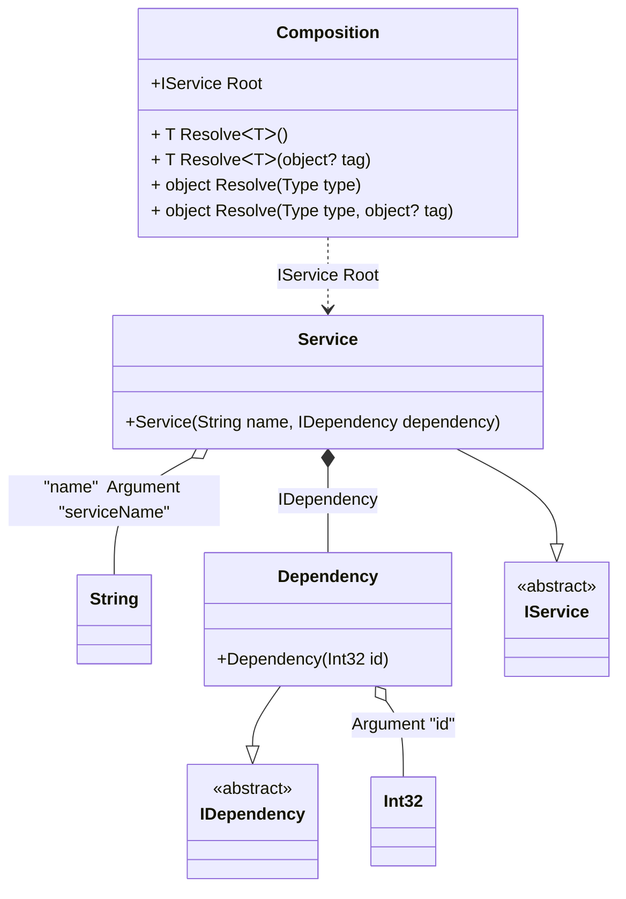

#### Arguments

[](../tests/Pure.DI.UsageTests/Basics/ArgumentsScenario.cs)

Sometimes you need to pass some state to a composition class to use it when resolving dependencies. To do this, just use the `Arg<T>(string argName)` method, specify the type of argument and its name. You can also specify a tag for each argument. You can then use them as dependencies when building the object graph. If you have multiple arguments of the same type, just use tags to distinguish them. The values of the arguments are manipulated when you create a composition class by calling its constructor. It is important to remember that only those arguments that are used in the object graph will appear in the constructor. Arguments that are not involved will not be added to the constructor arguments.

```c#
interface IDependency
{
    int Id { get; }
}

class Dependency(int id) : IDependency
{
    public int Id { get; } = id;
}

interface IService
{
    string Name { get; }

    IDependency Dependency { get; }
}

class Service(
    [Tag("name")] string name,
    IDependency dependency) : IService
{
    public string Name { get; } = name;

    public IDependency Dependency { get; } = dependency;
}

DI.Setup(nameof(Composition))
    .Bind<IDependency>().To<Dependency>()
    .Bind<IService>().To<Service>()

    // Composition root
    .Root<IService>("Root")

    // Some kind of identifier
    .Arg<int>("id")

    // An argument can be tagged (e.g., tag "name")
    // to be injectable by type and this tag
    .Arg<string>("serviceName", "name");

var composition = new Composition(serviceName: "Abc", id: 123);
        
// service = new Service("Abc", new Dependency(123));
var service = composition.Root;
        
service.Name.ShouldBe("Abc");
service.Dependency.Id.ShouldBe(123);
```

<details open>
<summary>Class Diagram</summary>



</details>

<details>
<summary>Pure.DI-generated partial class Composition</summary><blockquote>

```c#
partial class Composition
{
  private readonly Composition _rootM04D27di;

  private readonly int _argM04D27di_id;
  private readonly string _argM04D27di_serviceName;

  public Composition(int id, string serviceName)
  {
    _rootM04D27di = this;
    if (ReferenceEquals(serviceName, null))
    {
      throw new ArgumentNullException("serviceName");
    }

    _argM04D27di_id = id;
    _argM04D27di_serviceName = serviceName;
  }

  internal Composition(Composition baseComposition)
  {
    _rootM04D27di = baseComposition._rootM04D27di;
    _argM04D27di_id = baseComposition._argM04D27di_id;
    _argM04D27di_serviceName = baseComposition._argM04D27di_serviceName;
  }

  public IService Root
  {
    [MethodImpl((MethodImplOptions)0x100)]
    get
    {
      return new Service(_argM04D27di_serviceName, new Dependency(_argM04D27di_id));
    }
  }

  [MethodImpl((MethodImplOptions)0x100)]
  public T Resolve<T>()
  {
    return ResolverM04D27di<T>.Value.Resolve(this);
  }

  [MethodImpl((MethodImplOptions)0x100)]
  public T Resolve<T>(object? tag)
  {
    return ResolverM04D27di<T>.Value.ResolveByTag(this, tag);
  }

  [MethodImpl((MethodImplOptions)0x100)]
  public object Resolve(Type type)
  {
    var index = (int)(_bucketSizeM04D27di * ((uint)RuntimeHelpers.GetHashCode(type) % 1));
    ref var pair = ref _bucketsM04D27di[index];
    return pair.Key == type ? pair.Value.Resolve(this) : ResolveM04D27di(type, index);
  }

  [MethodImpl((MethodImplOptions)0x8)]
  private object ResolveM04D27di(Type type, int index)
  {
    var finish = index + _bucketSizeM04D27di;
    while (++index < finish)
    {
      ref var pair = ref _bucketsM04D27di[index];
      if (pair.Key == type)
      {
        return pair.Value.Resolve(this);
      }
    }

    throw new InvalidOperationException($"Cannot resolve composition root of type {type}.");
  }

  [MethodImpl((MethodImplOptions)0x100)]
  public object Resolve(Type type, object? tag)
  {
    var index = (int)(_bucketSizeM04D27di * ((uint)RuntimeHelpers.GetHashCode(type) % 1));
    ref var pair = ref _bucketsM04D27di[index];
    return pair.Key == type ? pair.Value.ResolveByTag(this, tag) : ResolveM04D27di(type, tag, index);
  }

  [MethodImpl((MethodImplOptions)0x8)]
  private object ResolveM04D27di(Type type, object? tag, int index)
  {
    var finish = index + _bucketSizeM04D27di;
    while (++index < finish)
    {
      ref var pair = ref _bucketsM04D27di[index];
      if (pair.Key == type)
      {
        return pair.Value.ResolveByTag(this, tag);
      }
    }

    throw new InvalidOperationException($"Cannot resolve composition root \"{tag}\" of type {type}.");
  }

  public override string ToString()
  {
    return
      "classDiagram\n" +
        "  class Composition {\n" +
          "    +IService Root\n" +
          "    + T ResolveᐸTᐳ()\n" +
          "    + T ResolveᐸTᐳ(object? tag)\n" +
          "    + object Resolve(Type type)\n" +
          "    + object Resolve(Type type, object? tag)\n" +
        "  }\n" +
        "  class Int32\n" +
        "  class String\n" +
        "  Dependency --|> IDependency : \n" +
        "  class Dependency {\n" +
          "    +Dependency(Int32 id)\n" +
        "  }\n" +
        "  Service --|> IService : \n" +
        "  class Service {\n" +
          "    +Service(String name, IDependency dependency)\n" +
        "  }\n" +
        "  class IDependency {\n" +
          "    <<abstract>>\n" +
        "  }\n" +
        "  class IService {\n" +
          "    <<abstract>>\n" +
        "  }\n" +
        "  Dependency o-- Int32 : Argument \"id\"\n" +
        "  Service o-- String : \"name\"  Argument \"serviceName\"\n" +
        "  Service *--  Dependency : IDependency\n" +
        "  Composition ..> Service : IService Root";
  }

  private readonly static int _bucketSizeM04D27di;
  private readonly static Pair<Type, IResolver<Composition, object>>[] _bucketsM04D27di;

  static Composition()
  {
    var valResolverM04D27di_0000 = new ResolverM04D27di_0000();
    ResolverM04D27di<IService>.Value = valResolverM04D27di_0000;
    _bucketsM04D27di = Buckets<Type, IResolver<Composition, object>>.Create(
      1,
      out _bucketSizeM04D27di,
      new Pair<Type, IResolver<Composition, object>>[1]
      {
         new Pair<Type, IResolver<Composition, object>>(typeof(IService), valResolverM04D27di_0000)
      });
  }

  private sealed class ResolverM04D27di<T>: IResolver<Composition, T>
  {
    public static IResolver<Composition, T> Value = new ResolverM04D27di<T>();

    public T Resolve(Composition composite)
    {
      throw new InvalidOperationException($"Cannot resolve composition root of type {typeof(T)}.");
    }

    public T ResolveByTag(Composition composite, object tag)
    {
      throw new InvalidOperationException($"Cannot resolve composition root \"{tag}\" of type {typeof(T)}.");
    }
  }

  private sealed class ResolverM04D27di_0000: IResolver<Composition, IService>
  {
    public IService Resolve(Composition composition)
    {
      return composition.Root;
    }

    public IService ResolveByTag(Composition composition, object tag)
    {
      switch (tag)
      {
        case null:
          return composition.Root;
        default:
          throw new InvalidOperationException($"Cannot resolve composition root \"{tag}\" of type IService.");
      }
    }
  }
}
```

</blockquote></details>

