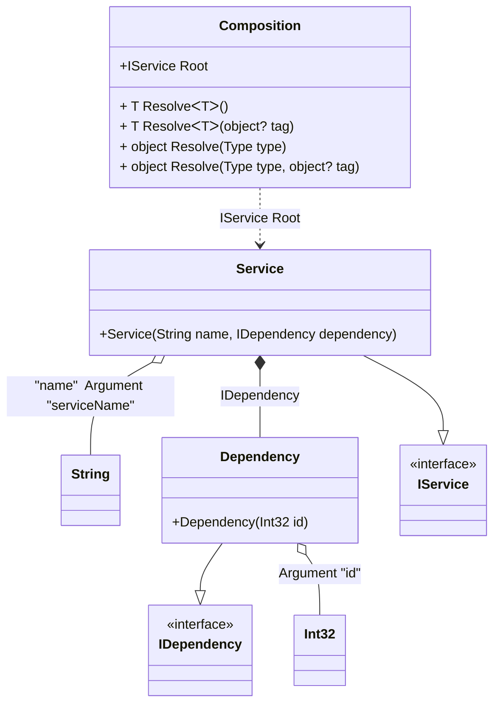

#### Arguments

[](../tests/Pure.DI.UsageTests/Basics/ArgumentsScenario.cs)

Sometimes you need to pass some state to a composition class to use it when resolving dependencies. To do this, just use the `Arg<T>(string argName)` method, specify the type of argument and its name. You can also specify a tag for each argument. You can then use them as dependencies when building the object graph. If you have multiple arguments of the same type, just use tags to distinguish them. The values of the arguments are manipulated when you create a composition class by calling its constructor. It is important to remember that only those arguments that are used in the object graph will appear in the constructor. Arguments that are not involved will not be added to the constructor arguments.

```c#
interface IDependency
{
    int Id { get; }
}

class Dependency(int id) : IDependency
{
    public int Id { get; } = id;
}

interface IService
{
    string Name { get; }

    IDependency Dependency { get; }
}

class Service(
    [Tag("name")] string name,
    IDependency dependency) : IService
{
    public string Name { get; } = name;

    public IDependency Dependency { get; } = dependency;
}

DI.Setup(nameof(Composition))
    .Bind<IDependency>().To<Dependency>()
    .Bind<IService>().To<Service>()

    // Composition root
    .Root<IService>("Root")

    // Some kind of identifier
    .Arg<int>("id")

    // An argument can be tagged (e.g., tag "name")
    // to be injectable by type and this tag
    .Arg<string>("serviceName", "name");

var composition = new Composition(serviceName: "Abc", id: 123);
        
// service = new Service("Abc", new Dependency(123));
var service = composition.Root;
        
service.Name.ShouldBe("Abc");
service.Dependency.Id.ShouldBe(123);
```

<details open>
<summary>Class Diagram</summary>



</details>

<details>
<summary>Pure.DI-generated partial class Composition</summary><blockquote>

```c#
partial class Composition
{
  private readonly Composition _root;

  private readonly int _arg_id;
  private readonly string _arg_serviceName;

  public Composition(int id, string serviceName)
  {
    _arg_id = id;
    _arg_serviceName = serviceName ?? throw new ArgumentNullException(nameof(serviceName));
    _root = this;
  }

  internal Composition(Composition parentScope)
  {
    _root = (parentScope ?? throw new ArgumentNullException(nameof(parentScope)))._root;
    _arg_id = _root._arg_id;
    _arg_serviceName = _root._arg_serviceName;
  }

  public IService Root
  {
    [MethodImpl(MethodImplOptions.AggressiveInlining)]
    get
    {
      return new Service(_arg_serviceName, new Dependency(_arg_id));
    }
  }

  [MethodImpl(MethodImplOptions.AggressiveInlining)]
  public T Resolve<T>()
  {
    return Resolver<T>.Value.Resolve(this);
  }

  [MethodImpl(MethodImplOptions.AggressiveInlining)]
  public T Resolve<T>(object? tag)
  {
    return Resolver<T>.Value.ResolveByTag(this, tag);
  }

  [MethodImpl(MethodImplOptions.AggressiveInlining)]
  public object Resolve(Type type)
  {
    var index = (int)(_bucketSize * ((uint)RuntimeHelpers.GetHashCode(type) % 1));
    ref var pair = ref _buckets[index];
    return pair.Key == type ? pair.Value.Resolve(this) : Resolve(type, index);
  }

  [MethodImpl(MethodImplOptions.NoInlining)]
  private object Resolve(Type type, int index)
  {
    var finish = index + _bucketSize;
    while (++index < finish)
    {
      ref var pair = ref _buckets[index];
      if (pair.Key == type)
      {
        return pair.Value.Resolve(this);
      }
    }

    throw new InvalidOperationException($"{CannotResolveMessage} {OfTypeMessage} {type}.");
  }

  [MethodImpl(MethodImplOptions.AggressiveInlining)]
  public object Resolve(Type type, object? tag)
  {
    var index = (int)(_bucketSize * ((uint)RuntimeHelpers.GetHashCode(type) % 1));
    ref var pair = ref _buckets[index];
    return pair.Key == type ? pair.Value.ResolveByTag(this, tag) : Resolve(type, tag, index);
  }

  [MethodImpl(MethodImplOptions.NoInlining)]
  private object Resolve(Type type, object? tag, int index)
  {
    var finish = index + _bucketSize;
    while (++index < finish)
    {
      ref var pair = ref _buckets[index];
      if (pair.Key == type)
      {
        return pair.Value.ResolveByTag(this, tag);
      }
    }

    throw new InvalidOperationException($"{CannotResolveMessage} \"{tag}\" {OfTypeMessage} {type}.");
  }

  private readonly static int _bucketSize;
  private readonly static Pair<Type, IResolver<Composition, object>>[] _buckets;

  static Composition()
  {
    var valResolver_0000 = new Resolver_0000();
    Resolver<IService>.Value = valResolver_0000;
    _buckets = Buckets<Type, IResolver<Composition, object>>.Create(
      1,
      out _bucketSize,
      new Pair<Type, IResolver<Composition, object>>[1]
      {
         new Pair<Type, IResolver<Composition, object>>(typeof(IService), valResolver_0000)
      });
  }

  private const string CannotResolveMessage = "Cannot resolve composition root ";
  private const string OfTypeMessage = "of type ";

  private class Resolver<T>: IResolver<Composition, T>
  {
    public static IResolver<Composition, T> Value = new Resolver<T>();

    public virtual T Resolve(Composition composite)
    {
      throw new InvalidOperationException($"{CannotResolveMessage}{OfTypeMessage}{typeof(T)}.");
    }

    public virtual T ResolveByTag(Composition composite, object tag)
    {
      throw new InvalidOperationException($"{CannotResolveMessage}\"{tag}\" {OfTypeMessage}{typeof(T)}.");
    }
  }

  private sealed class Resolver_0000: Resolver<IService>
  {
    public override IService Resolve(Composition composition)
    {
      return composition.Root;
    }

    public override IService ResolveByTag(Composition composition, object tag)
    {
      switch (tag)
      {
        case null:
          return composition.Root;

        default:
          return base.ResolveByTag(composition, tag);
      }
    }
  }
}
```

</blockquote></details>

