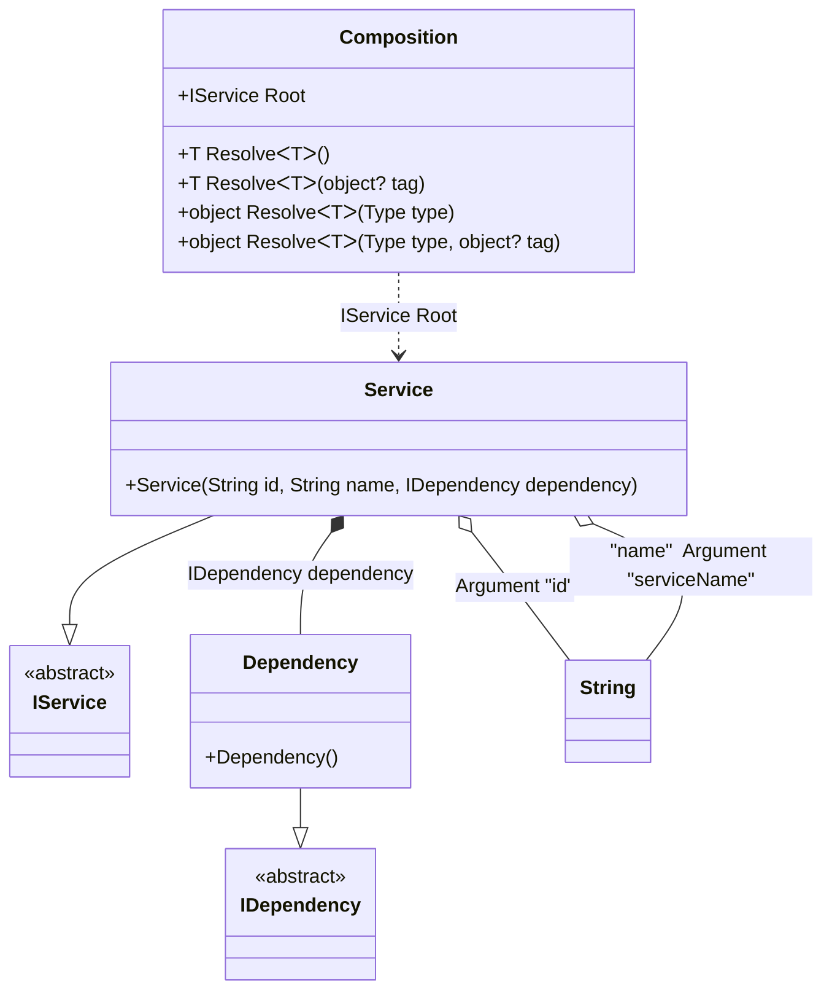

#### Arguments

[](../tests/Pure.DI.UsageTests/Basics/ArgumentsScenario.cs)

Sometimes you need to pass some state to the composition class in order to use it when resolving dependencies. Just use the `Arg` method, specify the type of the argument and the name of the argument. A tag can also be specified for each argument. After that, they can be used as dependencies when building an object graph. If you have multiple arguments of the same type, just use tags to distinguish between them.

```c#
internal interface IDependency { }

internal class Dependency : IDependency { }

internal interface IService
{
    string Id { get; }

    string Name { get; }
}

internal class Service : IService
{
    public Service(
        string id,
        [Tag("name")] string name,
        IDependency dependency)
    {
        Id = id;
        Name = name;
    }

    public string Id { get; }

    public string Name { get; }
}

DI.Setup("Composition")
    .Bind<IDependency>().To<Dependency>()
    .Bind<IService>().To<Service>().Root<IService>("Root")
    // The argument can be tagged to be available for injection by type and that tag
    .Arg<string>("serviceName", "name")
    // An untagged argument
    .Arg<string>("id");

var composition = new Composition(serviceName: "Abc", id: "123");
var service = composition.Root;
service.Name.ShouldBe("Abc");
service.Id.ShouldBe("123");
```

<details open>
<summary>Class Diagram</summary>



</details>

<details>
<summary>Generated Code</summary>

```c#
partial class Composition
{
  private readonly string _serviceNameArg6435C6;
  private readonly string _idArg6435C6;
  
  public Composition(string serviceName, string id)
  {
    if (global::System.Object.ReferenceEquals(serviceName, null))
    {
      throw new global::System.ArgumentNullException("serviceName");
    }
    
    if (global::System.Object.ReferenceEquals(id, null))
    {
      throw new global::System.ArgumentNullException("id");
    }
    
    _serviceNameArg6435C6 = serviceName;
    _idArg6435C6 = id;
  }
  
  internal Composition(Composition parent)
  {
    _serviceNameArg6435C6 = parent._serviceNameArg6435C6;
    _idArg6435C6 = parent._idArg6435C6;
  }
  
  #region Composition Roots
  public Pure.DI.UsageTests.Basics.ArgumentsScenario.IService Root
  {
    [global::System.Runtime.CompilerServices.MethodImpl((global::System.Runtime.CompilerServices.MethodImplOptions)0x300)]
    get
    {
      Pure.DI.UsageTests.Basics.ArgumentsScenario.Dependency v51Local6435C6 = new Pure.DI.UsageTests.Basics.ArgumentsScenario.Dependency();
      Pure.DI.UsageTests.Basics.ArgumentsScenario.Service v50Local6435C6 = new Pure.DI.UsageTests.Basics.ArgumentsScenario.Service(_idArg6435C6, _serviceNameArg6435C6, v51Local6435C6);
      return v50Local6435C6;
    }
  }
  #endregion
  
  #region API
  #if NETSTANDARD2_0_OR_GREATER || NETCOREAPP || NET40_OR_GREATER
  [global::System.Diagnostics.Contracts.Pure]
  #endif
  [global::System.Runtime.CompilerServices.MethodImpl((global::System.Runtime.CompilerServices.MethodImplOptions)0x300)]
  public T Resolve<T>()
  {
    return Resolver6435C6<T>.Value.Resolve(this);
  }
  
  #if NETSTANDARD2_0_OR_GREATER || NETCOREAPP || NET40_OR_GREATER
  [global::System.Diagnostics.Contracts.Pure]
  #endif
  [global::System.Runtime.CompilerServices.MethodImpl((global::System.Runtime.CompilerServices.MethodImplOptions)0x300)]
  public T Resolve<T>(object? tag)
  {
    return Resolver6435C6<T>.Value.ResolveByTag(this, tag);
  }
  
  #if NETSTANDARD2_0_OR_GREATER || NETCOREAPP || NET40_OR_GREATER
  [global::System.Diagnostics.Contracts.Pure]
  #endif
  [global::System.Runtime.CompilerServices.MethodImpl((global::System.Runtime.CompilerServices.MethodImplOptions)0x300)]
  public object Resolve(global::System.Type type)
  {
    int index = (int)(_bucketSize6435C6 * ((uint)global::System.Runtime.CompilerServices.RuntimeHelpers.GetHashCode(type) % 1));
    ref var pair = ref _buckets6435C6[index];
    if (ReferenceEquals(pair.Key, type))
    {
      return pair.Value.Resolve(this);
    }
    
    int maxIndex = index + _bucketSize6435C6;
    for (int i = index + 1; i < maxIndex; i++)
    {
      pair = ref _buckets6435C6[i];
      if (ReferenceEquals(pair.Key, type))
      {
        return pair.Value.Resolve(this);
      }
    }
    
    throw new global::System.InvalidOperationException($"Cannot resolve composition root of type {type}.");
  }
  
  #if NETSTANDARD2_0_OR_GREATER || NETCOREAPP || NET40_OR_GREATER
  [global::System.Diagnostics.Contracts.Pure]
  #endif
  [global::System.Runtime.CompilerServices.MethodImpl((global::System.Runtime.CompilerServices.MethodImplOptions)0x300)]
  public object Resolve(global::System.Type type, object? tag)
  {
    int index = (int)(_bucketSize6435C6 * ((uint)global::System.Runtime.CompilerServices.RuntimeHelpers.GetHashCode(type) % 1));
    ref var pair = ref _buckets6435C6[index];
    if (ReferenceEquals(pair.Key, type))
    {
      return pair.Value.ResolveByTag(this, tag);
    }
    
    int maxIndex = index + _bucketSize6435C6;
    for (int i = index + 1; i < maxIndex; i++)
    {
      pair = ref _buckets6435C6[i];
      if (ReferenceEquals(pair.Key, type))
      {
        return pair.Value.ResolveByTag(this, tag);
      }
    }
    
    throw new global::System.InvalidOperationException($"Cannot resolve composition root of type {type}.");
  }
  
  #endregion
  
  public override string ToString()
  {
    return
      "classDiagram\n" +
        "  class Composition {\n" +
          "    +IService Root\n" +
          "    +T ResolveᐸTᐳ()\n" +
          "    +T ResolveᐸTᐳ(object? tag)\n" +
          "    +object ResolveᐸTᐳ(Type type)\n" +
          "    +object ResolveᐸTᐳ(Type type, object? tag)\n" +
        "  }\n" +
        "  Service --|> IService : \n" +
        "  class Service {\n" +
          "    +Service(String id, String name, IDependency dependency)\n" +
        "  }\n" +
        "  Dependency --|> IDependency : \n" +
        "  class Dependency {\n" +
          "    +Dependency()\n" +
        "  }\n" +
        "  class String\n" +
        "  class IService {\n" +
          "    <<abstract>>\n" +
        "  }\n" +
        "  class IDependency {\n" +
          "    <<abstract>>\n" +
        "  }\n" +
        "  Service o-- String : Argument \"id\"\n" +
        "  Service o-- String : \"name\"  Argument \"serviceName\"\n" +
        "  Service *--  Dependency : IDependency dependency\n" +
        "  Composition ..> Service : IService Root";
  }
  
  private readonly static int _bucketSize6435C6;
  private readonly static global::Pure.DI.Pair<global::System.Type, global::Pure.DI.IResolver<Composition, object>>[] _buckets6435C6;
  
  static Composition()
  {
    Resolver6435C60 valResolver6435C60 = new Resolver6435C60();
    Resolver6435C6<Pure.DI.UsageTests.Basics.ArgumentsScenario.IService>.Value = valResolver6435C60;
    _buckets6435C6 = global::Pure.DI.Buckets<global::System.Type, global::Pure.DI.IResolver<Composition, object>>.Create(
      1,
      out _bucketSize6435C6,
      new global::Pure.DI.Pair<global::System.Type, global::Pure.DI.IResolver<Composition, object>>[1]
      {
         new global::Pure.DI.Pair<global::System.Type, global::Pure.DI.IResolver<Composition, object>>(typeof(Pure.DI.UsageTests.Basics.ArgumentsScenario.IService), valResolver6435C60)
      });
  }
  
  #region Resolvers
  private class Resolver6435C6<T>
  {
    public static global::Pure.DI.IResolver<Composition, T> Value;
  }
  
  private sealed class Resolver6435C60: global::Pure.DI.IResolver<Composition, Pure.DI.UsageTests.Basics.ArgumentsScenario.IService>
  {
    [global::System.Runtime.CompilerServices.MethodImpl((global::System.Runtime.CompilerServices.MethodImplOptions)0x300)]
    public Pure.DI.UsageTests.Basics.ArgumentsScenario.IService Resolve(Composition composition)
    {
      return composition.Root;
    }
    
    [global::System.Runtime.CompilerServices.MethodImpl((global::System.Runtime.CompilerServices.MethodImplOptions)0x300)]
    public Pure.DI.UsageTests.Basics.ArgumentsScenario.IService ResolveByTag(Composition composition, object tag)
    {
      if (Equals(tag, null)) return composition.Root;
      throw new global::System.InvalidOperationException($"Cannot resolve composition root \"{tag}\" of type Pure.DI.UsageTests.Basics.ArgumentsScenario.IService.");
    }
  }
  #endregion
}
```

</details>

