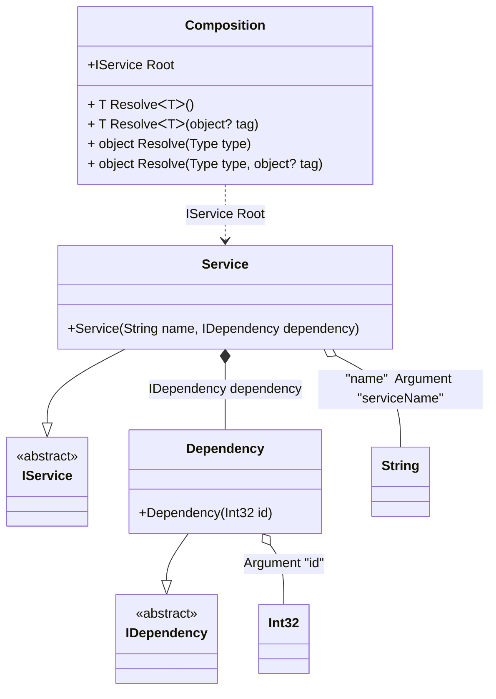

#### Arguments

[](../tests/Pure.DI.UsageTests/Basics/ArgumentsScenario.cs)

Sometimes you need to pass some state to a composition class to use it when resolving dependencies. To do this, just use the `Arg<T>(string argName)` method, specify the type of argument and its name. You can also specify a tag for each argument. You can then use them as dependencies when building the object graph. If you have multiple arguments of the same type, just use tags to distinguish them. The values of the arguments are manipulated when you create a composition class by calling its constructor. It is important to remember that only those arguments that are used in the object graph will appear in the constructor. Arguments that are not involved cannot be defined, as they are omitted from the constructor parameters to save resources.

```c#
interface IDependency
{
    int Id { get; }
}

class Dependency : IDependency
{
    public Dependency(int id) => Id = id;

    public int Id { get; }
}

interface IService
{
    string Name { get; }

    IDependency Dependency { get; }
}

class Service : IService
{
    public Service(
        [Tag("name")] string name,
        IDependency dependency)
    {
        Name = name;
        Dependency = dependency;
    }

    public string Name { get; }

    public IDependency Dependency { get; }
}

DI.Setup("Composition")
    .Bind<IDependency>().To<Dependency>()
    .Bind<IService>().To<Service>().Root<IService>("Root")
    // Some argument
    .Arg<int>("id")
    // An argument can be tagged (e.g., tag "name")
    // to be injectable by type and this tag
    .Arg<string>("serviceName", "name");

var composition = new Composition(serviceName: "Abc", id: 123);
var service = composition.Root;
service.Name.ShouldBe("Abc");
service.Dependency.Id.ShouldBe(123);
```

<details open>
<summary>Class Diagram</summary>



</details>

<details>
<summary>Composition Code</summary>

```c#
partial class Composition
{
  private readonly int _argM07D27di_id;
  private readonly string _argM07D27di_serviceName;
  
  public Composition(int id, string serviceName)
  {
    if (global::System.Object.ReferenceEquals(serviceName, null))
    {
      throw new global::System.ArgumentNullException("serviceName");
    }
    
    _argM07D27di_id = id;
    _argM07D27di_serviceName = serviceName;
  }
  
  internal Composition(Composition parent)
  {
    _argM07D27di_id = parent._argM07D27di_id;
    _argM07D27di_serviceName = parent._argM07D27di_serviceName;
  }
  
  #region Composition Roots
  public Pure.DI.UsageTests.Basics.ArgumentsScenario.IService Root
  {
    [global::System.Runtime.CompilerServices.MethodImpl((global::System.Runtime.CompilerServices.MethodImplOptions)0x300)]
    get
    {
      Pure.DI.UsageTests.Basics.ArgumentsScenario.Dependency transientM07D27di_0001 = new Pure.DI.UsageTests.Basics.ArgumentsScenario.Dependency(_argM07D27di_id);
      Pure.DI.UsageTests.Basics.ArgumentsScenario.Service transientM07D27di_0000 = new Pure.DI.UsageTests.Basics.ArgumentsScenario.Service(_argM07D27di_serviceName, transientM07D27di_0001);
      return transientM07D27di_0000;
    }
  }
  #endregion
  
  #region API
  #if NETSTANDARD2_0_OR_GREATER || NETCOREAPP || NET40_OR_GREATER
  [global::System.Diagnostics.Contracts.Pure]
  #endif
  [global::System.Runtime.CompilerServices.MethodImpl((global::System.Runtime.CompilerServices.MethodImplOptions)0x300)]
  public T Resolve<T>()
  {
    return ResolverM07D27di<T>.Value.Resolve(this);
  }
  
  #if NETSTANDARD2_0_OR_GREATER || NETCOREAPP || NET40_OR_GREATER
  [global::System.Diagnostics.Contracts.Pure]
  #endif
  [global::System.Runtime.CompilerServices.MethodImpl((global::System.Runtime.CompilerServices.MethodImplOptions)0x300)]
  public T Resolve<T>(object? tag)
  {
    return ResolverM07D27di<T>.Value.ResolveByTag(this, tag);
  }
  
  #if NETSTANDARD2_0_OR_GREATER || NETCOREAPP || NET40_OR_GREATER
  [global::System.Diagnostics.Contracts.Pure]
  #endif
  [global::System.Runtime.CompilerServices.MethodImpl((global::System.Runtime.CompilerServices.MethodImplOptions)0x300)]
  public object Resolve(global::System.Type type)
  {
    int index = (int)(_bucketSizeM07D27di * ((uint)global::System.Runtime.CompilerServices.RuntimeHelpers.GetHashCode(type) % 1));
    ref var pair = ref _bucketsM07D27di[index];
    if (ReferenceEquals(pair.Key, type))
    {
      return pair.Value.Resolve(this);
    }
    
    for (int i = index + 1; i < index + _bucketSizeM07D27di; i++)
    {
      pair = ref _bucketsM07D27di[i];
      if (ReferenceEquals(pair.Key, type))
      {
        return pair.Value.Resolve(this);
      }
    }
    
    throw new global::System.InvalidOperationException($"Cannot resolve composition root of type {type}.");
  }
  
  #if NETSTANDARD2_0_OR_GREATER || NETCOREAPP || NET40_OR_GREATER
  [global::System.Diagnostics.Contracts.Pure]
  #endif
  [global::System.Runtime.CompilerServices.MethodImpl((global::System.Runtime.CompilerServices.MethodImplOptions)0x300)]
  public object Resolve(global::System.Type type, object? tag)
  {
    int index = (int)(_bucketSizeM07D27di * ((uint)global::System.Runtime.CompilerServices.RuntimeHelpers.GetHashCode(type) % 1));
    ref var pair = ref _bucketsM07D27di[index];
    if (ReferenceEquals(pair.Key, type))
    {
      return pair.Value.ResolveByTag(this, tag);
    }
    
    for (int i = index + 1; i < index + _bucketSizeM07D27di; i++)
    {
      pair = ref _bucketsM07D27di[i];
      if (ReferenceEquals(pair.Key, type))
      {
        return pair.Value.ResolveByTag(this, tag);
      }
    }
    
    throw new global::System.InvalidOperationException($"Cannot resolve composition root \"{tag}\" of type {type}.");
  }
  #endregion
  
  public override string ToString()
  {
    return
      "classDiagram\n" +
        "  class Composition {\n" +
          "    +IService Root\n" +
          "    + T ResolveᐸTᐳ()\n" +
          "    + T ResolveᐸTᐳ(object? tag)\n" +
          "    + object Resolve(Type type)\n" +
          "    + object Resolve(Type type, object? tag)\n" +
        "  }\n" +
        "  Service --|> IService : \n" +
        "  class Service {\n" +
          "    +Service(String name, IDependency dependency)\n" +
        "  }\n" +
        "  Dependency --|> IDependency : \n" +
        "  class Dependency {\n" +
          "    +Dependency(Int32 id)\n" +
        "  }\n" +
        "  class Int32\n" +
        "  class String\n" +
        "  class IService {\n" +
          "    <<abstract>>\n" +
        "  }\n" +
        "  class IDependency {\n" +
          "    <<abstract>>\n" +
        "  }\n" +
        "  Service o-- String : \"name\"  Argument \"serviceName\"\n" +
        "  Service *--  Dependency : IDependency dependency\n" +
        "  Dependency o-- Int32 : Argument \"id\"\n" +
        "  Composition ..> Service : IService Root";
  }
  
  private readonly static int _bucketSizeM07D27di;
  private readonly static global::Pure.DI.Pair<global::System.Type, global::Pure.DI.IResolver<Composition, object>>[] _bucketsM07D27di;
  
  static Composition()
  {
    ResolverM07D27di_0000 valResolverM07D27di_0000 = new ResolverM07D27di_0000();
    ResolverM07D27di<Pure.DI.UsageTests.Basics.ArgumentsScenario.IService>.Value = valResolverM07D27di_0000;
    _bucketsM07D27di = global::Pure.DI.Buckets<global::System.Type, global::Pure.DI.IResolver<Composition, object>>.Create(
      1,
      out _bucketSizeM07D27di,
      new global::Pure.DI.Pair<global::System.Type, global::Pure.DI.IResolver<Composition, object>>[1]
      {
         new global::Pure.DI.Pair<global::System.Type, global::Pure.DI.IResolver<Composition, object>>(typeof(Pure.DI.UsageTests.Basics.ArgumentsScenario.IService), valResolverM07D27di_0000)
      });
  }
  
  #region Resolvers
  private sealed class ResolverM07D27di<T>: global::Pure.DI.IResolver<Composition, T>
  {
    public static global::Pure.DI.IResolver<Composition, T> Value = new ResolverM07D27di<T>();
    
    public T Resolve(Composition composite)
    {
      throw new global::System.InvalidOperationException($"Cannot resolve composition root of type {typeof(T)}.");
    }
    
    public T ResolveByTag(Composition composite, object tag)
    {
      throw new global::System.InvalidOperationException($"Cannot resolve composition root \"{tag}\" of type {typeof(T)}.");
    }
  }
  
  private sealed class ResolverM07D27di_0000: global::Pure.DI.IResolver<Composition, Pure.DI.UsageTests.Basics.ArgumentsScenario.IService>
  {
    [global::System.Runtime.CompilerServices.MethodImpl((global::System.Runtime.CompilerServices.MethodImplOptions)0x300)]
    public Pure.DI.UsageTests.Basics.ArgumentsScenario.IService Resolve(Composition composition)
    {
      return composition.Root;
    }
    
    [global::System.Runtime.CompilerServices.MethodImpl((global::System.Runtime.CompilerServices.MethodImplOptions)0x300)]
    public Pure.DI.UsageTests.Basics.ArgumentsScenario.IService ResolveByTag(Composition composition, object tag)
    {
      if (Equals(tag, null)) return composition.Root;
      throw new global::System.InvalidOperationException($"Cannot resolve composition root \"{tag}\" of type Pure.DI.UsageTests.Basics.ArgumentsScenario.IService.");
    }
  }
  #endregion
}
```

</details>

