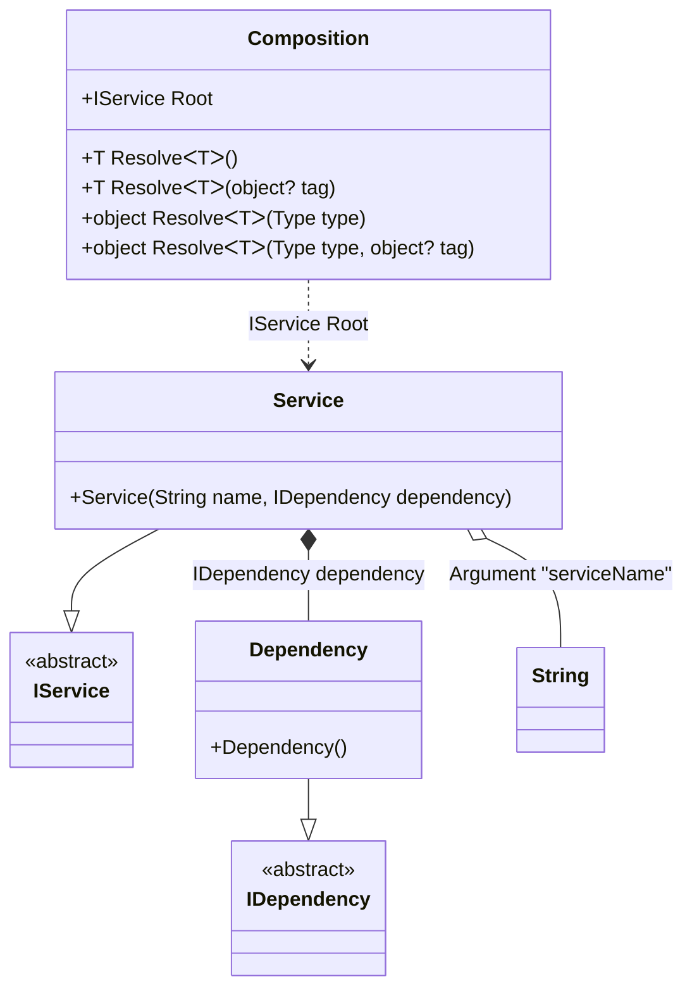

#### Arguments

[](../tests/Pure.DI.UsageTests/Basics/ArgumentsScenario.cs)

```c#
internal interface IDependency { }

internal class Dependency : IDependency { }

internal interface IService
{
    string Name { get; }
}

internal class Service : IService
{
    public Service(string name, IDependency dependency)
    {
        Name = name;
    }

    public string Name { get; }
}

DI.Setup("Composition")
    .Bind<IDependency>().To<Dependency>()
    .Bind<IService>().To<Service>().Root<IService>("Root")
    .Arg<string>("serviceName");

var composition = new Composition("Abc");
var service = composition.Root;
service.Name.ShouldBe("Abc");
```

<details open>
<summary>Class Diagram</summary>



</details>

<details>
<summary>Generated Code</summary>

```c#
partial class Composition
{
  private readonly string _serviceNameArg73742A;
  
  public Composition(string serviceName)
  {
    if (global::System.Object.ReferenceEquals(serviceName, null))
    {
      throw new global::System.ArgumentNullException("serviceName");
    }
    
    _serviceNameArg73742A = serviceName;
  }
  
  internal Composition(Composition parent)
  {
    _serviceNameArg73742A = parent._serviceNameArg73742A;
  }
  
  #region Composition Roots
  public Pure.DI.UsageTests.Basics.ArgumentsScenario.IService Root
  {
    [global::System.Runtime.CompilerServices.MethodImpl((global::System.Runtime.CompilerServices.MethodImplOptions)0x300)]
    get
    {
      Pure.DI.UsageTests.Basics.ArgumentsScenario.Dependency v34Local73742A = new Pure.DI.UsageTests.Basics.ArgumentsScenario.Dependency();
      Pure.DI.UsageTests.Basics.ArgumentsScenario.Service v33Local73742A = new Pure.DI.UsageTests.Basics.ArgumentsScenario.Service(_serviceNameArg73742A, v34Local73742A);
      return v33Local73742A;
    }
  }
  #endregion
  
  #region API
  #if NETSTANDARD2_0_OR_GREATER || NETCOREAPP || NET40_OR_GREATER
  [global::System.Diagnostics.Contracts.Pure]
  #endif
  [global::System.Runtime.CompilerServices.MethodImpl((global::System.Runtime.CompilerServices.MethodImplOptions)0x300)]
  public T Resolve<T>()
  {
    return Resolver73742A<T>.Value.Resolve(this);
  }
  
  #if NETSTANDARD2_0_OR_GREATER || NETCOREAPP || NET40_OR_GREATER
  [global::System.Diagnostics.Contracts.Pure]
  #endif
  [global::System.Runtime.CompilerServices.MethodImpl((global::System.Runtime.CompilerServices.MethodImplOptions)0x300)]
  public T Resolve<T>(object? tag)
  {
    return Resolver73742A<T>.Value.ResolveByTag(this, tag);
  }
  
  #if NETSTANDARD2_0_OR_GREATER || NETCOREAPP || NET40_OR_GREATER
  [global::System.Diagnostics.Contracts.Pure]
  #endif
  [global::System.Runtime.CompilerServices.MethodImpl((global::System.Runtime.CompilerServices.MethodImplOptions)0x300)]
  public object Resolve(global::System.Type type)
  {
    int index = (int)(_bucketSize73742A * ((uint)global::System.Runtime.CompilerServices.RuntimeHelpers.GetHashCode(type) % 1));
    ref var pair = ref _buckets73742A[index];
    if (ReferenceEquals(pair.Key, type))
    {
      return pair.Value.Resolve(this);
    }
    
    int maxIndex = index + _bucketSize73742A;
    for (int i = index + 1; i < maxIndex; i++)
    {
      pair = ref _buckets73742A[i];
      if (ReferenceEquals(pair.Key, type))
      {
        return pair.Value.Resolve(this);
      }
    }
    
    throw new global::System.InvalidOperationException($"Cannot resolve composition root of type {type}.");
  }
  
  #if NETSTANDARD2_0_OR_GREATER || NETCOREAPP || NET40_OR_GREATER
  [global::System.Diagnostics.Contracts.Pure]
  #endif
  [global::System.Runtime.CompilerServices.MethodImpl((global::System.Runtime.CompilerServices.MethodImplOptions)0x300)]
  public object Resolve(global::System.Type type, object? tag)
  {
    int index = (int)(_bucketSize73742A * ((uint)global::System.Runtime.CompilerServices.RuntimeHelpers.GetHashCode(type) % 1));
    ref var pair = ref _buckets73742A[index];
    if (ReferenceEquals(pair.Key, type))
    {
      return pair.Value.ResolveByTag(this, tag);
    }
    
    int maxIndex = index + _bucketSize73742A;
    for (int i = index + 1; i < maxIndex; i++)
    {
      pair = ref _buckets73742A[i];
      if (ReferenceEquals(pair.Key, type))
      {
        return pair.Value.ResolveByTag(this, tag);
      }
    }
    
    throw new global::System.InvalidOperationException($"Cannot resolve composition root of type {type}.");
  }
  
  #endregion
  
  public override string ToString()
  {
    return
      "classDiagram\n" +
        "  class Composition {\n" +
          "    +IService Root\n" +
          "    +T ResolveᐸTᐳ()\n" +
          "    +T ResolveᐸTᐳ(object? tag)\n" +
          "    +object ResolveᐸTᐳ(Type type)\n" +
          "    +object ResolveᐸTᐳ(Type type, object? tag)\n" +
        "  }\n" +
        "  Service --|> IService : \n" +
        "  class Service {\n" +
          "    +Service(String name, IDependency dependency)\n" +
        "  }\n" +
        "  Dependency --|> IDependency : \n" +
        "  class Dependency {\n" +
          "    +Dependency()\n" +
        "  }\n" +
        "  class String\n" +
        "  class IService {\n" +
          "    <<abstract>>\n" +
        "  }\n" +
        "  class IDependency {\n" +
          "    <<abstract>>\n" +
        "  }\n" +
        "  Service o-- String : Argument \"serviceName\"\n" +
        "  Service *--  Dependency : IDependency dependency\n" +
        "  Composition ..> Service : IService Root";
  }
  
  private readonly static int _bucketSize73742A;
  private readonly static global::Pure.DI.Pair<global::System.Type, global::Pure.DI.IResolver<Composition, object>>[] _buckets73742A;
  
  static Composition()
  {
    Resolver73742A0 valResolver73742A0 = new Resolver73742A0();
    Resolver73742A<Pure.DI.UsageTests.Basics.ArgumentsScenario.IService>.Value = valResolver73742A0;
    _buckets73742A = global::Pure.DI.Buckets<global::System.Type, global::Pure.DI.IResolver<Composition, object>>.Create(
      1,
      out _bucketSize73742A,
      new global::Pure.DI.Pair<global::System.Type, global::Pure.DI.IResolver<Composition, object>>[1]
      {
         new global::Pure.DI.Pair<global::System.Type, global::Pure.DI.IResolver<Composition, object>>(typeof(Pure.DI.UsageTests.Basics.ArgumentsScenario.IService), valResolver73742A0)
      });
  }
  
  #region Resolvers
  #pragma warning disable CS0649
  private class Resolver73742A<T>
  {
    public static global::Pure.DI.IResolver<Composition, T> Value;
  }
  
  private sealed class Resolver73742A0: global::Pure.DI.IResolver<Composition, Pure.DI.UsageTests.Basics.ArgumentsScenario.IService>
  {
    [global::System.Runtime.CompilerServices.MethodImpl((global::System.Runtime.CompilerServices.MethodImplOptions)0x300)]
    public Pure.DI.UsageTests.Basics.ArgumentsScenario.IService Resolve(Composition composition)
    {
      return composition.Root;
    }
    
    [global::System.Runtime.CompilerServices.MethodImpl((global::System.Runtime.CompilerServices.MethodImplOptions)0x300)]
    public Pure.DI.UsageTests.Basics.ArgumentsScenario.IService ResolveByTag(Composition composition, object tag)
    {
      if (Equals(tag, null)) return composition.Root;
      throw new global::System.InvalidOperationException($"Cannot resolve composition root \"{tag}\" of type Pure.DI.UsageTests.Basics.ArgumentsScenario.IService.");
    }
  }
  #pragma warning restore CS0649
  #endregion
}
```

</details>

