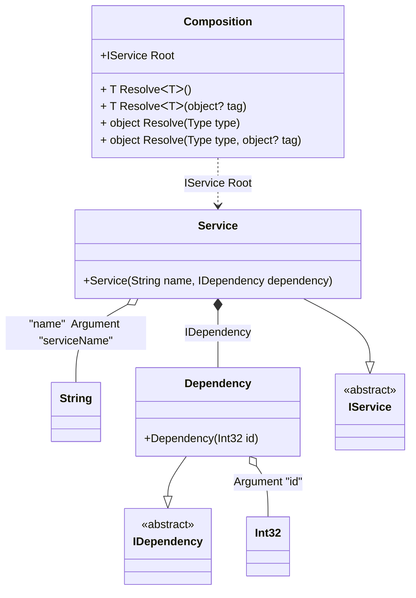

#### Arguments

[](../tests/Pure.DI.UsageTests/Basics/ArgumentsScenario.cs)

Sometimes you need to pass some state to a composition class to use it when resolving dependencies. To do this, just use the `Arg<T>(string argName)` method, specify the type of argument and its name. You can also specify a tag for each argument. You can then use them as dependencies when building the object graph. If you have multiple arguments of the same type, just use tags to distinguish them. The values of the arguments are manipulated when you create a composition class by calling its constructor. It is important to remember that only those arguments that are used in the object graph will appear in the constructor. Arguments that are not involved will not be added to the constructor arguments.

```c#
interface IDependency
{
    int Id { get; }
}

class Dependency(int id) : IDependency
{
    public int Id { get; } = id;
}

interface IService
{
    string Name { get; }

    IDependency Dependency { get; }
}

class Service(
    [Tag("name")] string name,
    IDependency dependency) : IService
{
    public string Name { get; } = name;

    public IDependency Dependency { get; } = dependency;
}

DI.Setup(nameof(Composition))
    .Bind<IDependency>().To<Dependency>()
    .Bind<IService>().To<Service>()
    .Root<IService>("Root")
    // Some kind of identifier
    .Arg<int>("id")
    // An argument can be tagged (e.g., tag "name")
    // to be injectable by type and this tag
    .Arg<string>("serviceName", "name");

var composition = new Composition(serviceName: "Abc", id: 123);
        
// service = new Service("Abc", new Dependency(123));
var service = composition.Root;
        
service.Name.ShouldBe("Abc");
service.Dependency.Id.ShouldBe(123);
```

<details open>
<summary>Class Diagram</summary>



</details>

<details>
<summary>Pure.DI-generated partial class Composition</summary><blockquote>

```c#
/// <para>
/// Composition roots:<br/>
/// <list type="table">
/// <listheader>
/// <term>Root</term>
/// <description>Description</description>
/// </listheader>
/// <item>
/// <term>
/// <see cref="Pure.DI.UsageTests.Basics.ArgumentsScenario.IService"/> Root
/// </term>
/// <description>
/// Provides a composition root of type <see cref="Pure.DI.UsageTests.Basics.ArgumentsScenario.Service"/>.
/// </description>
/// </item>
/// </list>
/// </para>
/// <example>
/// This shows how to get an instance of type <see cref="Pure.DI.UsageTests.Basics.ArgumentsScenario.Service"/> using the composition root <see cref="Root"/>:
/// <code>
/// var composition = new Composition(id, serviceName);
/// var instance = composition.Root;
/// </code>
/// </example>
/// <a href="https://mermaid.live/view#pako:eNqdU8FuwjAM_RXL5x1Qe2DjBi2TuOwAHHMJrdVl0ASlAQkh_oF_2WW_w5-sTVo1LWWbdrHi2H55fo7PmKiUcILJjhdFLHimec40k9aHSOV7VQgjlAR2GI3GsypWnYLZYkX6KBKCpVKmvYY1LKlQuyPdrl_r2_XTXj9b-_Jrmtp8UGKqc_gKhmd3ZS6hqXVF69OewJTmH9kR_PzkOG7VWEgTBq27MlrIrPJj2pNMSSYnq1IQt3YcWeQ5LHpJ4RRaqF7Ml7kNOfqWBIh0iGYzkcck_IwOAz_gP1_fu7ddxyB53ojnd5V2mQ5L-LDT0HGM-KYwmtcDmdd2CGmY8d9hPCbKF8yNuVFoqrNDTtIAw1Jz9FXuVtXaNMKiFQnBByhc4ZuN3M1r2oHrf4kS09OuKu7vZmC7dLYcdW_Sd9uKT5iTzrlIy-0_MzTvVNGaMEy53jK84OUbu25iew">Class diagram</a><br/>
/// This class was created by <a href="https://github.com/DevTeam/Pure.DI">Pure.DI</a> source code generator.
/// </summary>
/// <seealso cref="Pure.DI.DI.Setup"/>
[global::System.Diagnostics.CodeAnalysis.ExcludeFromCodeCoverage]
partial class Composition
{
  private readonly Composition _rootM03D12di;
  private readonly int _argM03D12di_id;
  private readonly string _argM03D12di_serviceName;
  
  /// <summary>
  /// This parameterized constructor creates a new instance of <see cref="Composition"/> with arguments.
  /// </summary>
  /// <param name="id">
  /// Some kind of identifier
  /// </param>
  /// <param name="serviceName">
  /// An argument can be tagged (e.g., tag "name")<br/>
  /// to be injectable by type and this tag
  /// </param>
  public Composition(int id, string serviceName)
  {
    _rootM03D12di = this;
    if (ReferenceEquals(serviceName, null))
    {
      throw new global::System.ArgumentNullException("serviceName");
    }
    
    _argM03D12di_id = id;
    _argM03D12di_serviceName = serviceName;
  }
  
  /// <summary>
  /// This constructor creates a new instance of <see cref="Composition"/> scope based on <paramref name="baseComposition"/>. This allows the <see cref="Lifetime.Scoped"/> life time to be applied.
  /// </summary>
  /// <param name="baseComposition">Base composition.</param>
  internal Composition(Composition baseComposition)
  {
    _rootM03D12di = baseComposition._rootM03D12di;
    _argM03D12di_id = baseComposition._argM03D12di_id;
    _argM03D12di_serviceName = baseComposition._argM03D12di_serviceName;
  }
  
  #region Composition Roots
  public Pure.DI.UsageTests.Basics.ArgumentsScenario.IService Root
  {
    #if NETSTANDARD2_0_OR_GREATER || NETCOREAPP || NET40_OR_GREATER || NET
    [global::System.Diagnostics.Contracts.Pure]
    #endif
    get
    {
      return new Pure.DI.UsageTests.Basics.ArgumentsScenario.Service(_argM03D12di_serviceName, new Pure.DI.UsageTests.Basics.ArgumentsScenario.Dependency(_argM03D12di_id));
    }
  }
  #endregion
  
  #region API
  /// <summary>
  /// Resolves the composition root.
  /// </summary>
  /// <typeparam name="T">The type of the composition root.</typeparam>
  /// <returns>A composition root.</returns>
  #if NETSTANDARD2_0_OR_GREATER || NETCOREAPP || NET40_OR_GREATER || NET
  [global::System.Diagnostics.Contracts.Pure]
  #endif
  public T Resolve<T>()
  {
    return ResolverM03D12di<T>.Value.Resolve(this);
  }
  
  /// <summary>
  /// Resolves the composition root by tag.
  /// </summary>
  /// <typeparam name="T">The type of the composition root.</typeparam>
  /// <param name="tag">The tag of a composition root.</param>
  /// <returns>A composition root.</returns>
  #if NETSTANDARD2_0_OR_GREATER || NETCOREAPP || NET40_OR_GREATER || NET
  [global::System.Diagnostics.Contracts.Pure]
  #endif
  public T Resolve<T>(object? tag)
  {
    return ResolverM03D12di<T>.Value.ResolveByTag(this, tag);
  }
  
  /// <summary>
  /// Resolves the composition root.
  /// </summary>
  /// <param name="type">The type of the composition root.</param>
  /// <returns>A composition root.</returns>
  #if NETSTANDARD2_0_OR_GREATER || NETCOREAPP || NET40_OR_GREATER || NET
  [global::System.Diagnostics.Contracts.Pure]
  #endif
  public object Resolve(global::System.Type type)
  {
    var index = (int)(_bucketSizeM03D12di * ((uint)global::System.Runtime.CompilerServices.RuntimeHelpers.GetHashCode(type) % 1));
    var finish = index + _bucketSizeM03D12di;
    do {
      ref var pair = ref _bucketsM03D12di[index];
      if (ReferenceEquals(pair.Key, type))
      {
        return pair.Value.Resolve(this);
      }
    } while (++index < finish);
    
    throw new global::System.InvalidOperationException($"Cannot resolve composition root of type {type}.");
  }
  
  /// <summary>
  /// Resolves the composition root by tag.
  /// </summary>
  /// <param name="type">The type of the composition root.</param>
  /// <param name="tag">The tag of a composition root.</param>
  /// <returns>A composition root.</returns>
  #if NETSTANDARD2_0_OR_GREATER || NETCOREAPP || NET40_OR_GREATER || NET
  [global::System.Diagnostics.Contracts.Pure]
  #endif
  public object Resolve(global::System.Type type, object? tag)
  {
    var index = (int)(_bucketSizeM03D12di * ((uint)global::System.Runtime.CompilerServices.RuntimeHelpers.GetHashCode(type) % 1));
    var finish = index + _bucketSizeM03D12di;
    do {
      ref var pair = ref _bucketsM03D12di[index];
      if (ReferenceEquals(pair.Key, type))
      {
        return pair.Value.ResolveByTag(this, tag);
      }
    } while (++index < finish);
    
    throw new global::System.InvalidOperationException($"Cannot resolve composition root \"{tag}\" of type {type}.");
  }
  #endregion
  
  /// <summary>
  /// This method provides a class diagram in mermaid format. To see this diagram, simply call the method and copy the text to this site https://mermaid.live/.
  /// </summary>
  public override string ToString()
  {
    return
      "classDiagram\n" +
        "  class Composition {\n" +
          "    +IService Root\n" +
          "    + T ResolveᐸTᐳ()\n" +
          "    + T ResolveᐸTᐳ(object? tag)\n" +
          "    + object Resolve(Type type)\n" +
          "    + object Resolve(Type type, object? tag)\n" +
        "  }\n" +
        "  class Int32\n" +
        "  class String\n" +
        "  Dependency --|> IDependency : \n" +
        "  class Dependency {\n" +
          "    +Dependency(Int32 id)\n" +
        "  }\n" +
        "  Service --|> IService : \n" +
        "  class Service {\n" +
          "    +Service(String name, IDependency dependency)\n" +
        "  }\n" +
        "  class IDependency {\n" +
          "    <<abstract>>\n" +
        "  }\n" +
        "  class IService {\n" +
          "    <<abstract>>\n" +
        "  }\n" +
        "  Dependency o-- Int32 : Argument \"id\"\n" +
        "  Service o-- String : \"name\"  Argument \"serviceName\"\n" +
        "  Service *--  Dependency : IDependency\n" +
        "  Composition ..> Service : IService Root";
  }
  
  private readonly static int _bucketSizeM03D12di;
  private readonly static global::Pure.DI.Pair<global::System.Type, global::Pure.DI.IResolver<Composition, object>>[] _bucketsM03D12di;
  
  static Composition()
  {
    var valResolverM03D12di_0000 = new ResolverM03D12di_0000();
    ResolverM03D12di<Pure.DI.UsageTests.Basics.ArgumentsScenario.IService>.Value = valResolverM03D12di_0000;
    _bucketsM03D12di = global::Pure.DI.Buckets<global::System.Type, global::Pure.DI.IResolver<Composition, object>>.Create(
      1,
      out _bucketSizeM03D12di,
      new global::Pure.DI.Pair<global::System.Type, global::Pure.DI.IResolver<Composition, object>>[1]
      {
         new global::Pure.DI.Pair<global::System.Type, global::Pure.DI.IResolver<Composition, object>>(typeof(Pure.DI.UsageTests.Basics.ArgumentsScenario.IService), valResolverM03D12di_0000)
      });
  }
  
  #region Resolvers
  private sealed class ResolverM03D12di<T>: global::Pure.DI.IResolver<Composition, T>
  {
    public static global::Pure.DI.IResolver<Composition, T> Value = new ResolverM03D12di<T>();
    
    public T Resolve(Composition composite)
    {
      throw new global::System.InvalidOperationException($"Cannot resolve composition root of type {typeof(T)}.");
    }
    
    public T ResolveByTag(Composition composite, object tag)
    {
      throw new global::System.InvalidOperationException($"Cannot resolve composition root \"{tag}\" of type {typeof(T)}.");
    }
  }
  
  private sealed class ResolverM03D12di_0000: global::Pure.DI.IResolver<Composition, Pure.DI.UsageTests.Basics.ArgumentsScenario.IService>
  {
    public Pure.DI.UsageTests.Basics.ArgumentsScenario.IService Resolve(Composition composition)
    {
      return composition.Root;
    }
    
    public Pure.DI.UsageTests.Basics.ArgumentsScenario.IService ResolveByTag(Composition composition, object tag)
    {
      switch (tag)
      {
        case null:
          return composition.Root;
      }
      throw new global::System.InvalidOperationException($"Cannot resolve composition root \"{tag}\" of type Pure.DI.UsageTests.Basics.ArgumentsScenario.IService.");
    }
  }
  #endregion
}
```

</blockquote></details>

