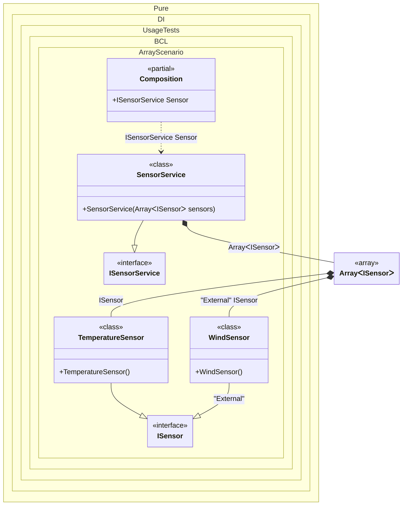

#### Array

Specifying `T[]` as the injection type allows instances from all bindings that implement the `T` type to be injected.


```c#
using Shouldly;
using Pure.DI;

DI.Setup(nameof(Composition))
    .Bind<ISensor>().To<TemperatureSensor>()
    .Bind<ISensor>("External").To<WindSensor>()
    .Bind<ISensorService>().To<SensorService>()

    // Composition root
    .Root<ISensorService>("Sensor");

var composition = new Composition();
var sensor = composition.Sensor;

// Checks that all bindings for the ISensor interface are injected,
// regardless of whether they are tagged or not.
sensor.Sensors.Length.ShouldBe(2);
sensor.Sensors[0].ShouldBeOfType<TemperatureSensor>();
sensor.Sensors[1].ShouldBeOfType<WindSensor>();

interface ISensor;

class TemperatureSensor : ISensor;

class WindSensor : ISensor;

interface ISensorService
{
    ISensor[] Sensors { get; }
}

class SensorService(ISensor[] sensors) : ISensorService
{
    public ISensor[] Sensors { get; } = sensors;
}
```

<details>
<summary>Running this code sample locally</summary>

- Make sure you have the [.NET SDK 10.0](https://dotnet.microsoft.com/en-us/download/dotnet/10.0) or later is installed
```bash
dotnet --list-sdk
```
- Create a net10.0 (or later) console application
```bash
dotnet new console -n Sample
```
- Add references to NuGet packages
  - [Pure.DI](https://www.nuget.org/packages/Pure.DI)
  - [Shouldly](https://www.nuget.org/packages/Shouldly)
```bash
dotnet add package Pure.DI
dotnet add package Shouldly
```
- Copy the example code into the _Program.cs_ file

You are ready to run the example 🚀
```bash
dotnet run
```

</details>

In addition to arrays, other collection types are also supported, such as:
- System.Memory<T>
- System.ReadOnlyMemory<T>
- System.Span<T>
- System.ReadOnlySpan<T>
- System.Collections.Generic.ICollection<T>
- System.Collections.Generic.IList<T>
- System.Collections.Generic.List<T>
- System.Collections.Generic.IReadOnlyCollection<T>
- System.Collections.Generic.IReadOnlyList<T>
- System.Collections.Generic.ISet<T>
- System.Collections.Generic.HashSet<T>
- System.Collections.Generic.SortedSet<T>
- System.Collections.Generic.Queue<T>
- System.Collections.Generic.Stack<T>
- System.Collections.Immutable.ImmutableArray<T>
- System.Collections.Immutable.IImmutableList<T>
- System.Collections.Immutable.ImmutableList<T>
- System.Collections.Immutable.IImmutableSet<T>
- System.Collections.Immutable.ImmutableHashSet<T>
- System.Collections.Immutable.ImmutableSortedSet<T>
- System.Collections.Immutable.IImmutableQueue<T>
- System.Collections.Immutable.ImmutableQueue<T>
- System.Collections.Immutable.IImmutableStack<T>
And of course this list can easily be supplemented on its own.

The following partial class will be generated:

```c#
partial class Composition
{
  public ISensorService Sensor
  {
    [MethodImpl(MethodImplOptions.AggressiveInlining)]
    get
    {
      return new SensorService(new ISensor[2] { new TemperatureSensor(), new WindSensor() });
    }
  }
}
```

Class diagram:



