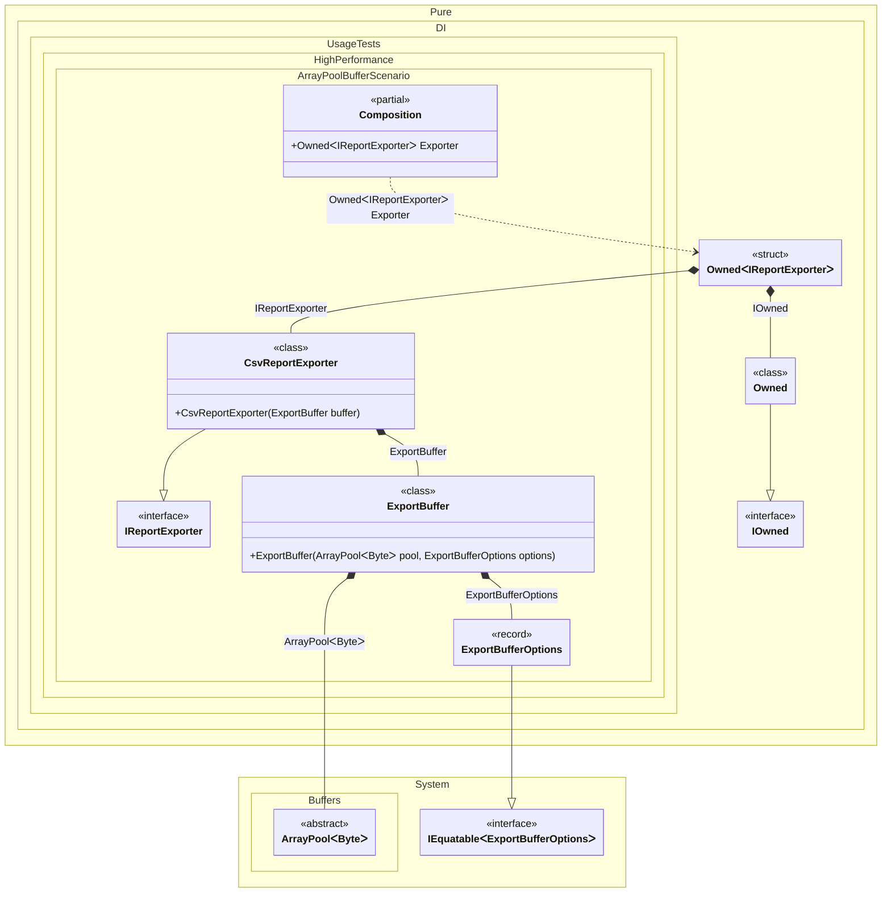

#### ArrayPool buffer

Use `ArrayPool<T>` when a hot path needs temporary buffers whose size is too large or too variable for `stackalloc`. Pure.DI supports `ArrayPool<T>` out of the box, so the setup does not need to bind `ArrayPool<byte>.Shared` manually; request `ArrayPool<byte>` like any other dependency.
In this example a CSV export endpoint creates a per-request `ExportBuffer`. The buffer owner receives the shared `ArrayPool<byte>` from Pure.DI, rents an array using application options, exposes only `Memory<byte>` to the exporter, and returns the array when the `Owned<IReportExporter>` operation scope is disposed.


```c#
using Shouldly;
using Pure.DI;
using System.Buffers;
using System.Text;

DI.Setup(nameof(Composition))
    .Bind().To(_ => new ExportBufferOptions(Size: 256))
    .Bind().To<ExportBuffer>()
    .Bind<IReportExporter>().To<CsvReportExporter>()
    .Root<Owned<IReportExporter>>("Exporter");

var composition = new Composition();
var exporter = composition.Exporter;

var bytesWritten = exporter.Value.Export(
    [
        new Order(17, 42.50m),
        new Order(18, 13.25m)
    ]);

bytesWritten.ShouldBeGreaterThan(0);
exporter.Value.Buffer.Returned.ShouldBeFalse();

readonly record struct Order(int Id, decimal Total);

readonly record struct ExportBufferOptions(int Size);

interface IReportExporter
{
    ExportBuffer Buffer { get; }

    int Export(IReadOnlyList<Order> orders);
}

sealed class CsvReportExporter(ExportBuffer buffer) : IReportExporter
{
    public ExportBuffer Buffer => buffer;

    public int Export(IReadOnlyList<Order> orders)
    {
        var writer = new ArrayBufferWriter<byte>(buffer.Memory.Length);
        foreach (var order in orders)
        {
            var line = $"order-{order.Id},{order.Total:0.00}\n";
            writer.Write(Encoding.UTF8.GetBytes(line));
        }

        writer.WrittenSpan.CopyTo(buffer.Memory.Span);
        return writer.WrittenCount;
    }
}

sealed class ExportBuffer(
    ArrayPool<byte> pool,
    ExportBufferOptions options)
    : IDisposable
{
    private byte[]? _buffer = pool.Rent(options.Size);

    public Memory<byte> Memory => _buffer;

    public bool Returned => _buffer is null;

    public void Dispose()
    {
        if (_buffer is {} buffer)
        {
            Array.Clear(buffer);
            pool.Return(buffer);
            _buffer = null;
        }
    }
}
```

<details>
<summary>Running this code sample locally</summary>

- Make sure you have the [.NET SDK 10.0](https://dotnet.microsoft.com/en-us/download/dotnet/10.0) or later installed
```bash
dotnet --list-sdk
```
- Create a net10.0 (or later) console application
```bash
dotnet new console -n Sample
```
- Add references to the NuGet packages
  - [Pure.DI](https://www.nuget.org/packages/Pure.DI)
  - [Shouldly](https://www.nuget.org/packages/Shouldly)
```bash
dotnet add package Pure.DI
dotnet add package Shouldly
```
- Copy the example code into the _Program.cs_ file

You are ready to run the example 🚀
```bash
dotnet run
```

</details>

This pattern is useful for serialization, compression, protocol framing, and batch export pipelines. Keep the owner lifetime short, clear sensitive buffers before returning them, and do not store the rented `Memory<T>` after the owner is disposed.
The important DI detail is ownership: bind or auto-bind the owner as the dependency that is tracked and disposed, not the raw array. The pool itself is a built-in BCL dependency; the owner is the application-specific object that defines rent size, cleanup, and return rules. `Owned<T>` keeps that cleanup tied to one root call instead of the whole composition.

<details>
<summary>The following partial class will be generated</summary>

```c#
partial class Composition
{
#if NET9_0_OR_GREATER
  private readonly Lock _lock = new Lock();
#else
  private readonly Object _lock = new Object();
#endif

  public Owned<IReportExporter> Exporter
  {
    [MethodImpl(MethodImplOptions.AggressiveInlining)]
    get
    {
      var perBlockOwned = new Owned();
      Owned<IReportExporter> perBlockOwnedIReportExporter;
      // Tracks owned disposables
      Owned transientOwned;
      Owned localOwned1 = perBlockOwned;
      transientOwned = localOwned1;
      lock (_lock)
      {
        perBlockOwned.Add(transientOwned);
      }

      IOwned localOwned = transientOwned;
      // Creates the owned value
      Buffers.ArrayPool<byte> transientArrayPoolByte = Buffers.ArrayPool<byte>.Shared;
      ExportBufferOptions transientExportBufferOptions = new ExportBufferOptions(Size: 256);
      var transientExportBuffer = new ExportBuffer(transientArrayPoolByte, transientExportBufferOptions);
      lock (_lock)
      {
        perBlockOwned.Add(transientExportBuffer);
      }

      IReportExporter localValue = new CsvReportExporter(transientExportBuffer);
      perBlockOwnedIReportExporter = new Owned<IReportExporter>(localValue, localOwned);
      lock (_lock)
      {
        perBlockOwned.Add(perBlockOwnedIReportExporter);
      }

      return perBlockOwnedIReportExporter;
    }
  }
}
```

</details>

Class diagram:



See also:

- [Span and ReadOnlySpan](span-and-readonlyspan.md)
- [Tracking disposable instances per a composition root](tracking-disposable-instances-per-a-composition-root.md)

