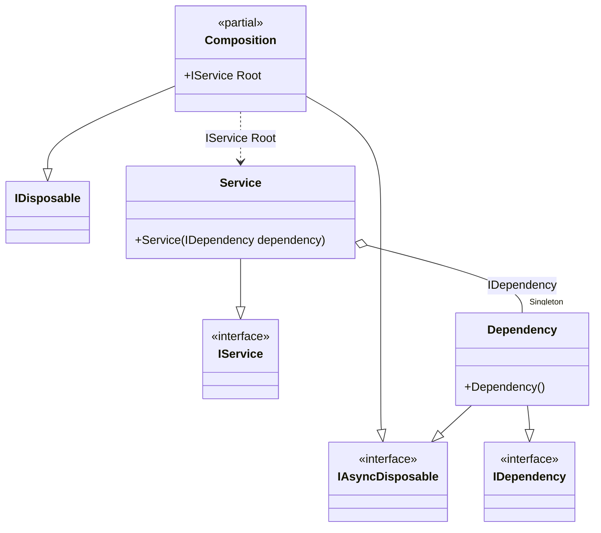

#### Async disposable singleton

[](../tests/Pure.DI.UsageTests/Lifetimes/AsyncDisposableSingletonScenario.cs)

If at least one of these objects implements the `IAsyncDisposable` interface, then the composition implements `IAsyncDisposable` as well. To dispose of all created singleton instances in an asynchronous manner, simply dispose of the composition instance in an asynchronous manner:


```c#
interface IDependency
{
    bool IsDisposed { get; }
}

class Dependency : IDependency, IAsyncDisposable
{
    public bool IsDisposed { get; private set; }

    public ValueTask DisposeAsync()
    {
        IsDisposed = true;
        return ValueTask.CompletedTask;
    }
}

interface IService
{
    public IDependency Dependency { get; }
}

class Service(IDependency dependency) : IService
{
    public IDependency Dependency { get; } = dependency;
}

DI.Setup(nameof(Composition))
    // This hint indicates to not generate methods such as Resolve
    .Hint(Hint.Resolve, "Off")
    .Bind().As(Lifetime.Singleton).To<Dependency>()
    .Bind().To<Service>()
    .Root<IService>("Root");

IDependency dependency;
await using (var composition = new Composition())
{
    var service = composition.Root;
    dependency = service.Dependency;
}

dependency.IsDisposed.ShouldBeTrue();
```

The following partial class will be generated:

```c#
partial class Composition: IDisposable, IAsyncDisposable
{
  private readonly Composition _root;
  private readonly Lock _lock;
  private object[] _disposables;
  private int _disposeIndex;

  private Dependency? _singletonDependency39;

  [OrdinalAttribute(20)]
  public Composition()
  {
    _root = this;
    _lock = new Lock();
    _disposables = new object[1];
  }

  internal Composition(Composition parentScope)
  {
    _root = (parentScope ?? throw new ArgumentNullException(nameof(parentScope)))._root;
    _lock = _root._lock;
    _disposables = parentScope._disposables;
  }

  public IService Root
  {
    [MethodImpl(MethodImplOptions.AggressiveInlining)]
    get
    {
      if (_root._singletonDependency39 is null)
      {
        using (_lock.EnterScope())
        {
          if (_root._singletonDependency39 is null)
          {
            _root._singletonDependency39 = new Dependency();
            _root._disposables[_root._disposeIndex++] = _root._singletonDependency39;
          }
        }
      }

      return new Service(_root._singletonDependency39!);
    }
  }

  public void Dispose()
  {
    int disposeIndex;
    object[] disposables;
    using (_lock.EnterScope())
    {
      disposeIndex = _disposeIndex;
      _disposeIndex = 0;
      disposables = _disposables;
      _disposables = new object[1];
      _singletonDependency39 = null;
    }

    while (disposeIndex-- > 0)
    {
      switch (disposables[disposeIndex])
      {
        case IAsyncDisposable asyncDisposableInstance:
          try
          {
            var valueTask = asyncDisposableInstance.DisposeAsync();
            if (!valueTask.IsCompleted)
            {
              valueTask.AsTask().Wait();
            }
          }
          catch (Exception exception)
          {
            OnDisposeAsyncException(asyncDisposableInstance, exception);
          }
          break;
      }
    }
  }

  partial void OnDisposeException<T>(T disposableInstance, Exception exception) where T : IDisposable;

  public async ValueTask DisposeAsync()
  {
    int disposeIndex;
    object[] disposables;
    _lock.Enter();
    try
    {
      disposeIndex = _disposeIndex;
      _disposeIndex = 0;
      disposables = _disposables;
      _disposables = new object[1];
      _singletonDependency39 = null;
    }
    finally
    {
      _lock.Exit();
    }

    while (disposeIndex-- > 0)
    {
      switch (disposables[disposeIndex])
      {
        case IAsyncDisposable asyncDisposableInstance:
          try
          {
            await asyncDisposableInstance.DisposeAsync();
          }
          catch (Exception exception)
          {
            OnDisposeAsyncException(asyncDisposableInstance, exception);
          }
          break;
      }
    }
  }

  partial void OnDisposeAsyncException<T>(T asyncDisposableInstance, Exception exception) where T : IAsyncDisposable;
}
```

Class diagram:



