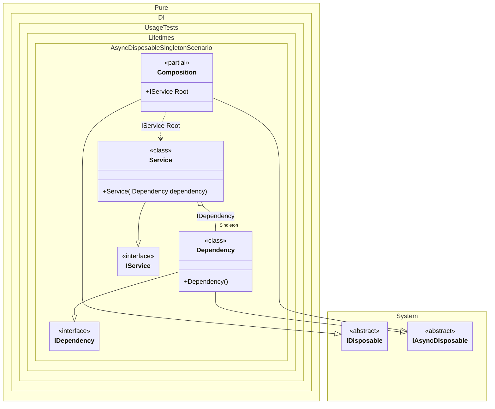

#### Async disposable singleton

If at least one of these objects implements the `IAsyncDisposable` interface, then the composition implements `IAsyncDisposable` as well. To dispose of all created singleton instances in an asynchronous manner, simply dispose of the composition instance in an asynchronous manner:


```c#
using Shouldly;
using Pure.DI;
using static Pure.DI.Lifetime;

DI.Setup(nameof(Composition))
    .Bind().As(Singleton).To<Dependency>()
    .Bind().To<Service>()
    .Root<IService>("Root");

IDependency dependency;
await using (var composition = new Composition())
{
    var service = composition.Root;
    dependency = service.Dependency;
}

dependency.IsDisposed.ShouldBeTrue();

interface IDependency
{
    bool IsDisposed { get; }
}

class Dependency : IDependency, IAsyncDisposable
{
    public bool IsDisposed { get; private set; }

    public ValueTask DisposeAsync()
    {
        IsDisposed = true;
        return ValueTask.CompletedTask;
    }
}

interface IService
{
    public IDependency Dependency { get; }
}

class Service(IDependency dependency) : IService
{
    public IDependency Dependency { get; } = dependency;
}
```

<details>
<summary>Running this code sample locally</summary>

- Make sure you have the [.NET SDK 10.0](https://dotnet.microsoft.com/en-us/download/dotnet/10.0) or later is installed
```bash
dotnet --list-sdk
```
- Create a net10.0 (or later) console application
```bash
dotnet new console -n Sample
```
- Add references to NuGet packages
  - [Pure.DI](https://www.nuget.org/packages/Pure.DI)
  - [Shouldly](https://www.nuget.org/packages/Shouldly)
```bash
dotnet add package Pure.DI
dotnet add package Shouldly
```
- Copy the example code into the _Program.cs_ file

You are ready to run the example 🚀
```bash
dotnet run
```

</details>

The following partial class will be generated:

```c#
partial class Composition: IDisposable, IAsyncDisposable
{
  private readonly Composition _root;
#if NET9_0_OR_GREATER
  private readonly Lock _lock;
#else
  private readonly Object _lock;
#endif
  private object[] _disposables;
  private int _disposeIndex;

  private Dependency? _singletonDependency51;

  [OrdinalAttribute(256)]
  public Composition()
  {
    _root = this;
#if NET9_0_OR_GREATER
    _lock = new Lock();
#else
    _lock = new Object();
#endif
    _disposables = new object[1];
  }

  internal Composition(Composition parentScope)
  {
    _root = (parentScope ?? throw new ArgumentNullException(nameof(parentScope)))._root;
    _lock = parentScope._lock;
    _disposables = parentScope._disposables;
  }

  public IService Root
  {
    [MethodImpl(MethodImplOptions.AggressiveInlining)]
    get
    {
      if (_root._singletonDependency51 is null)
        lock (_lock)
          if (_root._singletonDependency51 is null)
          {
            _root._singletonDependency51 = new Dependency();
            _root._disposables[_root._disposeIndex++] = _root._singletonDependency51;
          }

      return new Service(_root._singletonDependency51);
    }
  }

  public void Dispose()
  {
    int disposeIndex;
    object[] disposables;
    lock (_lock)
    {
      disposeIndex = _disposeIndex;
      _disposeIndex = 0;
      disposables = _disposables;
      _disposables = new object[1];
      _singletonDependency51 = null;
    }

    while (disposeIndex-- > 0)
    {
      switch (disposables[disposeIndex])
      {
        case IAsyncDisposable asyncDisposableInstance:
          try
          {
            var valueTask = asyncDisposableInstance.DisposeAsync();
            if (!valueTask.IsCompleted)
            {
              valueTask.AsTask().Wait();
            }
          }
          catch (Exception exception)
          {
            OnDisposeAsyncException(asyncDisposableInstance, exception);
          }
          break;
      }
    }
  }

  partial void OnDisposeException<T>(T disposableInstance, Exception exception) where T : IDisposable;

  public async ValueTask DisposeAsync()
  {
    int disposeIndex;
    object[] disposables;
    {
      disposeIndex = _disposeIndex;
      _disposeIndex = 0;
      disposables = _disposables;
      _disposables = new object[1];
      _singletonDependency51 = null;
    }

    while (disposeIndex-- > 0)
    {
      switch (disposables[disposeIndex])
      {
        case IAsyncDisposable asyncDisposableInstance:
          try
          {
            await asyncDisposableInstance.DisposeAsync();
          }
          catch (Exception exception)
          {
            OnDisposeAsyncException(asyncDisposableInstance, exception);
          }
          break;
      }
    }
  }

  partial void OnDisposeAsyncException<T>(T asyncDisposableInstance, Exception exception) where T : IAsyncDisposable;
}
```

Class diagram:



