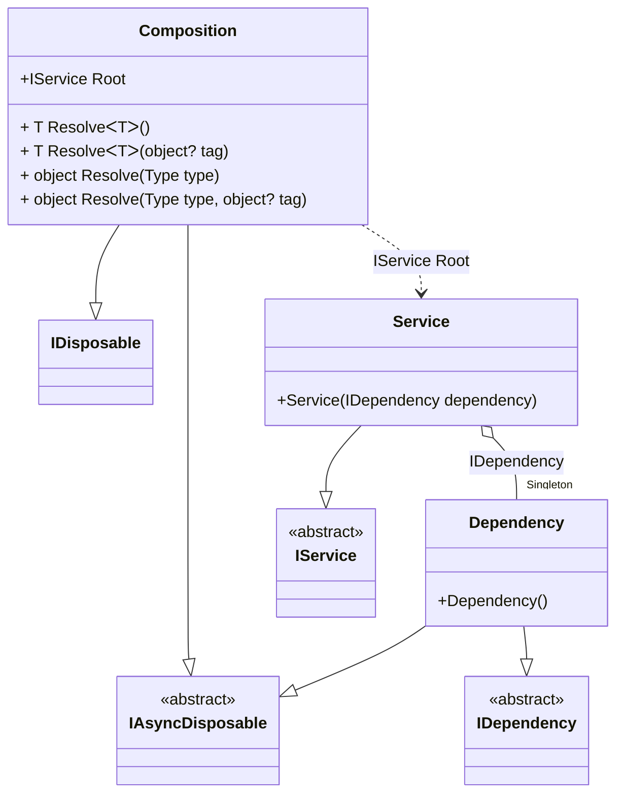

#### Async disposable singleton

[](../tests/Pure.DI.UsageTests/Lifetimes/AsyncDisposableSingletonScenario.cs)

If at least one of these objects implements the `IAsyncDisposable` interface, then the composition implements `IAsyncDisposable` as well. To dispose of all created singleton instances in an asynchronous manner, simply dispose of the composition instance in an asynchronous manner:

```c#
interface IDependency
{
    bool IsDisposed { get; }
}

class Dependency : IDependency, IAsyncDisposable
{
    public bool IsDisposed { get; private set; }

    public ValueTask DisposeAsync()
    {
        IsDisposed = true;
        return ValueTask.CompletedTask;
    }
}

interface IService
{
    public IDependency Dependency { get; }
}

class Service(IDependency dependency): IService
{
    public IDependency Dependency { get; } = dependency;
}

DI.Setup(nameof(Composition))
    .Bind().As(Lifetime.Singleton).To<Dependency>()
    .RootBind<IService>("Root").To<Service>();

IDependency dependency;
await using (var composition = new Composition())
{
    var service = composition.Root;
    dependency = service.Dependency;
}

dependency.IsDisposed.ShouldBeTrue();
```

<details open>
<summary>Class Diagram</summary>



</details>

<details>
<summary>Pure.DI-generated partial class Composition</summary><blockquote>

```c#
partial class Composition: IDisposable, IAsyncDisposable
{
  private readonly Composition _root;
  private readonly object _lock;
  private object[] _disposables;
  private int _disposeIndex;
  private Dependency _singleton36_Dependency;

  public Composition()
  {
    _root = this;
    _lock = new object();
    _disposables = new object[1];
  }

  internal Composition(Composition baseComposition)
  {
    _root = baseComposition._root;
    _lock = _root._lock;
  }

  public IService Root
  {
    [MethodImpl((MethodImplOptions)0x100)]
    get
    {
      if (_root._singleton36_Dependency == null)
      {
          lock (_lock)
          {
              if (_root._singleton36_Dependency == null)
              {
                  _singleton36_Dependency = new Dependency();
                  _root._singleton36_Dependency = _singleton36_Dependency;
                  _root._disposables[_root._disposeIndex++] = _singleton36_Dependency;
              }
          }
      }
      return new Service(_root._singleton36_Dependency);
    }
  }

  [MethodImpl((MethodImplOptions)0x100)]
  public T Resolve<T>()
  {
    return Resolver<T>.Value.Resolve(this);
  }

  [MethodImpl((MethodImplOptions)0x100)]
  public T Resolve<T>(object? tag)
  {
    return Resolver<T>.Value.ResolveByTag(this, tag);
  }

  [MethodImpl((MethodImplOptions)0x100)]
  public object Resolve(Type type)
  {
    var index = (int)(_bucketSize * ((uint)RuntimeHelpers.GetHashCode(type) % 1));
    ref var pair = ref _buckets[index];
    return pair.Key == type ? pair.Value.Resolve(this) : Resolve(type, index);
  }

  [MethodImpl((MethodImplOptions)0x8)]
  private object Resolve(Type type, int index)
  {
    var finish = index + _bucketSize;
    while (++index < finish)
    {
      ref var pair = ref _buckets[index];
      if (pair.Key == type)
      {
        return pair.Value.Resolve(this);
      }
    }

    throw new InvalidOperationException($"Cannot resolve composition root of type {type}.");
  }

  [MethodImpl((MethodImplOptions)0x100)]
  public object Resolve(Type type, object? tag)
  {
    var index = (int)(_bucketSize * ((uint)RuntimeHelpers.GetHashCode(type) % 1));
    ref var pair = ref _buckets[index];
    return pair.Key == type ? pair.Value.ResolveByTag(this, tag) : Resolve(type, tag, index);
  }

  [MethodImpl((MethodImplOptions)0x8)]
  private object Resolve(Type type, object? tag, int index)
  {
    var finish = index + _bucketSize;
    while (++index < finish)
    {
      ref var pair = ref _buckets[index];
      if (pair.Key == type)
      {
        return pair.Value.ResolveByTag(this, tag);
      }
    }

    throw new InvalidOperationException($"Cannot resolve composition root \"{tag}\" of type {type}.");
  }

  public void Dispose()
  {
    int disposeIndex;
    object[] disposables;
    lock (_lock)
    {
      disposeIndex = _disposeIndex;
      _disposeIndex = 0;
      disposables = _disposables;
      _disposables = new object[1];
      _singleton36_Dependency = null;
    }

    while (disposeIndex-- > 0)
    {
      switch (disposables[disposeIndex])
      {
        case IAsyncDisposable asyncDisposableInstance:
          try
          {
            var valueTask = asyncDisposableInstance.DisposeAsync();
            if (!valueTask.IsCompleted)
            {
              valueTask.AsTask().Wait();
            }
          }
          catch (Exception exception)
          {
            OnDisposeAsyncException(asyncDisposableInstance, exception);
          }
          break;
      }
    }
  }

  partial void OnDisposeException<T>(T disposableInstance, Exception exception) where T : IDisposable;

  public async ValueTask DisposeAsync()
  {
    int disposeIndex;
    object[] disposables;
    lock (_lock)
    {
      disposeIndex = _disposeIndex;
      _disposeIndex = 0;
      disposables = _disposables;
      _disposables = new object[1];
      _singleton36_Dependency = null;
    }

    while (disposeIndex-- > 0)
    {
      switch (disposables[disposeIndex])
      {
        case IAsyncDisposable asyncDisposableInstance:
          try
          {
            await asyncDisposableInstance.DisposeAsync();
          }
          catch (Exception exception)
          {
            OnDisposeAsyncException(asyncDisposableInstance, exception);
          }
          break;
      }
    }
  }

  partial void OnDisposeAsyncException<T>(T asyncDisposableInstance, Exception exception) where T : IAsyncDisposable;

  public override string ToString()
  {
    return
      "classDiagram\n" +
        "  class Composition {\n" +
          "    +IService Root\n" +
          "    + T ResolveᐸTᐳ()\n" +
          "    + T ResolveᐸTᐳ(object? tag)\n" +
          "    + object Resolve(Type type)\n" +
          "    + object Resolve(Type type, object? tag)\n" +
        "  }\n" +
        "  Composition --|> IDisposable\n" +
        "  Composition --|> IAsyncDisposable\n" +
        "  Dependency --|> IDependency : \n" +
        "  Dependency --|> IAsyncDisposable : \n" +
        "  class Dependency {\n" +
          "    +Dependency()\n" +
        "  }\n" +
        "  Service --|> IService : \n" +
        "  class Service {\n" +
          "    +Service(IDependency dependency)\n" +
        "  }\n" +
        "  class IDependency {\n" +
          "    <<abstract>>\n" +
        "  }\n" +
        "  class IAsyncDisposable {\n" +
          "    <<abstract>>\n" +
        "  }\n" +
        "  class IService {\n" +
          "    <<abstract>>\n" +
        "  }\n" +
        "  Service o--  \"Singleton\" Dependency : IDependency\n" +
        "  Composition ..> Service : IService Root";
  }

  private readonly static int _bucketSize;
  private readonly static Pair<Type, IResolver<Composition, object>>[] _buckets;

  static Composition()
  {
    var valResolver_0000 = new Resolver_0000();
    Resolver<IService>.Value = valResolver_0000;
    _buckets = Buckets<Type, IResolver<Composition, object>>.Create(
      1,
      out _bucketSize,
      new Pair<Type, IResolver<Composition, object>>[1]
      {
         new Pair<Type, IResolver<Composition, object>>(typeof(IService), valResolver_0000)
      });
  }

  private sealed class Resolver<T>: IResolver<Composition, T>
  {
    public static IResolver<Composition, T> Value = new Resolver<T>();

    public T Resolve(Composition composite)
    {
      throw new InvalidOperationException($"Cannot resolve composition root of type {typeof(T)}.");
    }

    public T ResolveByTag(Composition composite, object tag)
    {
      throw new InvalidOperationException($"Cannot resolve composition root \"{tag}\" of type {typeof(T)}.");
    }
  }

  private sealed class Resolver_0000: IResolver<Composition, IService>
  {
    public IService Resolve(Composition composition)
    {
      return composition.Root;
    }

    public IService ResolveByTag(Composition composition, object tag)
    {
      switch (tag)
      {
        case null:
          return composition.Root;
        default:
          throw new InvalidOperationException($"Cannot resolve composition root \"{tag}\" of type IService.");
      }
    }
  }
}
```

</blockquote></details>

