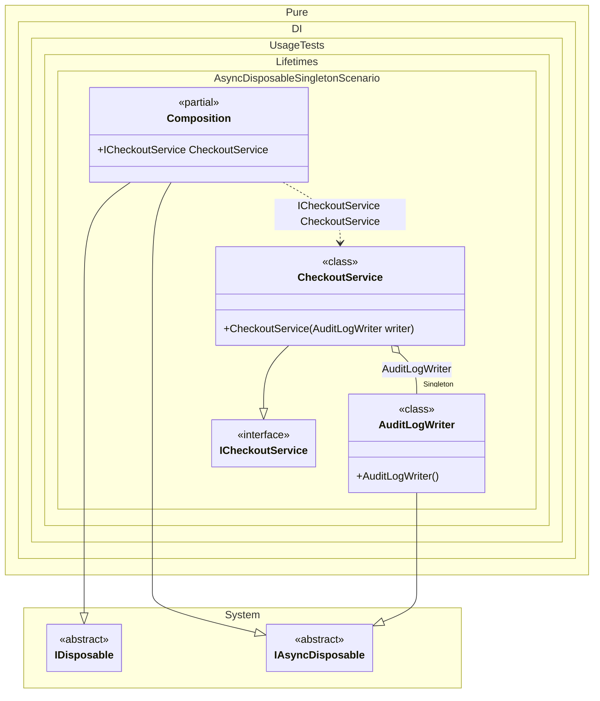

#### Async disposable singleton

If at least one of these objects implements the `IAsyncDisposable` interface, then the composition implements `IAsyncDisposable` as well. To dispose of all created singleton instances in an asynchronous manner, simply dispose of the composition instance in an asynchronous manner:


```c#
using Shouldly;
using Pure.DI;
using static Pure.DI.Lifetime;
using System.Threading.Tasks;

DI.Setup(nameof(Composition))
    // A singleton resource that needs async cleanup (e.g., flushing buffers, closing connections)
    .Bind().As(Singleton).To<AuditLogWriter>()
    .Bind().To<CheckoutService>()
    .Root<ICheckoutService>("CheckoutService");

AuditLogWriter writer;

await using (var composition = new Composition())
{
    var service = composition.CheckoutService;

    // A "live" usage: do some work that writes to an audit log
    await service.CheckoutAsync(orderId: "ORD-2025-00042");

    // Keep a reference so we can assert disposal after the composition is disposed
    writer = service.Writer;
    writer.IsDisposed.ShouldBeFalse();
}

// Composition disposal triggers async disposal of singleton(s)
writer.IsDisposed.ShouldBeTrue();

interface ICheckoutService
{
    AuditLogWriter Writer { get; }

    ValueTask CheckoutAsync(string orderId);
}

/// <summary>
/// Represents a singleton infrastructure component.
/// Think: audit log writer, message producer, telemetry pipeline, DB connection, etc.
/// It is owned by the DI container and must be disposed asynchronously.
/// </summary>
sealed class AuditLogWriter : IAsyncDisposable
{
    public bool IsDisposed { get; private set; }

    public async ValueTask WriteAsync(string message)
    {
        ObjectDisposedException.ThrowIf(IsDisposed, nameof(AuditLogWriter));
        // Simulate I/O (writing to file / network / remote log)
        await Task.Delay(5);
    }

    public async ValueTask DisposeAsync()
    {
        // Simulate async cleanup: flush buffers / send remaining events / gracefully close connection
        await Task.Delay(5);
        IsDisposed = true;
    }
}

sealed class CheckoutService(AuditLogWriter writer) : ICheckoutService
{
    public AuditLogWriter Writer { get; } = writer;

    public ValueTask CheckoutAsync(string orderId)
    {
        // Real-world-ish side effect: record a business event
        return Writer.WriteAsync($"Checkout completed: {orderId}");
    }
}
```

<details>
<summary>Running this code sample locally</summary>

- Make sure you have the [.NET SDK 10.0](https://dotnet.microsoft.com/en-us/download/dotnet/10.0) or later is installed
```bash
dotnet --list-sdk
```
- Create a net10.0 (or later) console application
```bash
dotnet new console -n Sample
```
- Add references to NuGet packages
  - [Pure.DI](https://www.nuget.org/packages/Pure.DI)
  - [Shouldly](https://www.nuget.org/packages/Shouldly)
```bash
dotnet add package Pure.DI
dotnet add package Shouldly
```
- Copy the example code into the _Program.cs_ file

You are ready to run the example 🚀
```bash
dotnet run
```

</details>

The following partial class will be generated:

```c#
partial class Composition: IDisposable, IAsyncDisposable
{
#if NET9_0_OR_GREATER
  private readonly Lock _lock = new Lock();
#else
  private readonly Object _lock = new Object();
#endif
  private object[] _disposables = new object[1];
  private int _disposeIndex;

  private AuditLogWriter? _singletonAuditLogWriter51;

  public ICheckoutService CheckoutService
  {
    [MethodImpl(MethodImplOptions.AggressiveInlining)]
    get
    {
      if (_singletonAuditLogWriter51 is null)
        lock (_lock)
          if (_singletonAuditLogWriter51 is null)
          {
            _singletonAuditLogWriter51 = new AuditLogWriter();
            _disposables[_disposeIndex++] = _singletonAuditLogWriter51;
          }

      return new CheckoutService(_singletonAuditLogWriter51);
    }
  }

  public void Dispose()
  {
    int disposeIndex;
    object[] disposables;
    lock (_lock)
    {
      disposeIndex = _disposeIndex;
      _disposeIndex = 0;
      disposables = _disposables;
      _disposables = new object[1];
      _singletonAuditLogWriter51 = null;
    }

    while (disposeIndex-- > 0)
    {
      switch (disposables[disposeIndex])
      {
        case IAsyncDisposable asyncDisposableInstance:
          try
          {
            var valueTask = asyncDisposableInstance.DisposeAsync();
            if (!valueTask.IsCompleted)
            {
              valueTask.AsTask().Wait();
            }
          }
          catch (Exception exception)
          {
            OnDisposeAsyncException(asyncDisposableInstance, exception);
          }
          break;
      }
    }
  }

  partial void OnDisposeException<T>(T disposableInstance, Exception exception) where T : IDisposable;

  public async ValueTask DisposeAsync()
  {
    int disposeIndex;
    object[] disposables;
    {
      disposeIndex = _disposeIndex;
      _disposeIndex = 0;
      disposables = _disposables;
      _disposables = new object[1];
      _singletonAuditLogWriter51 = null;
    }

    while (disposeIndex-- > 0)
    {
      switch (disposables[disposeIndex])
      {
        case IAsyncDisposable asyncDisposableInstance:
          try
          {
            await asyncDisposableInstance.DisposeAsync();
          }
          catch (Exception exception)
          {
            OnDisposeAsyncException(asyncDisposableInstance, exception);
          }
          break;
      }
    }
  }

  partial void OnDisposeAsyncException<T>(T asyncDisposableInstance, Exception exception) where T : IAsyncDisposable;
}
```

Class diagram:



